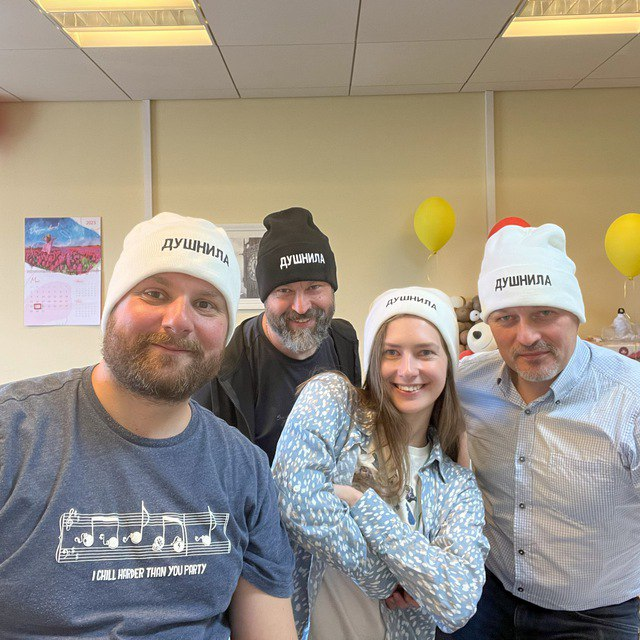

# В качестве вступления

Здравствуйте!

Меня зовут Сергей Поляков и я из тех, кто на вопрос «Как жизнь?» начинает подробно рассказывать, как он живет и о чём думает. Раньше таких называли занудами, сейчас чаще душнилами. И совсем недавно один мой друг, совершенно спонтанно, во время нашего разговора вдруг изменился в лице, метнулся в другую комнату, вынес оттуда шапку с такой вышивкой и подарил ее мне - думаю, неспроста!

<figure><figcaption>
<em>Я тот, что в черной шапке. Быть душнилой иногда заразно!</em>
</figcaption></figure>

Так вот... Рассуждая с женой на прогулке о роли и важности определения системы ценностей в семье и, в частности, для современного российского общества, вдруг отметил, что повторяюсь: уже не в первый раз приходилось мне подыскивать слова и наглядные примеры в подобных беседах по этой теме с близкими. Причем из истории я точно знаю, что ответы эти я ищу далеко не первый. И люди с внутренним стремлением к упорядочиванию вечно пытаются с этими повторениями что-то сделать. А уж программисты и архитекторы информационных систем, когда видят однообразное повторение действий, совершенно инстинктивно начинают объединять их в блоки, структурировать, наводя красоту и стремясь достичь гармоничной формы. И значит, надо один раз изложить своё видение в тексте, разложить его по полочкам и далее использовать по необходимости. Мысль эта подтверждалась крылатой фразой Жванецкого, что писАть, как и пИсать, нужно тогда, когда терпеть уже не можешь. Пора?

Идея о написании текста, в целом, нравилась. Споры и беседы с близкими и друзьями должны будут стать более спокойными и рассудительными, ведь в споре с собеседником ты обычно обозначаешь свою позицию, но тебя зачастую перебивают или в паузе выдают какой-то контраргумент. И досадно то, что ты уже обдумал и этот аспект тоже и у тебя есть ответ, но ведь надо дослушать собеседника до конца, чтобы его не перебивать. Или диалог вообще прерывается по какой-то причине, и ты остаешься непонятым. А тут даешь текст прочитать и получаешь возможность реагировать только на обдуманные со всех сторон контраргументы. В конце концов, приятно использовать заранее подготовленные параграфы текста в обсуждениях (часто так делаю в переписке, когда одно сообщение отправляется в несколько групп Телеграм).

Предполагаю, что эти вступительные пассажи уже характеризует меня как душнилу в постоянном желании оптимизации… Надеюсь, что до навязчивой мании Моники из сериала «Друзья» всё упорядочить и разложить по полочкам мне ещё далеко, но желание такое имеется. Также стоит сразу отметить, что сам я отношусь к этой склонности структурировать и оптимизировать не как к безусловному благу, а просто как к особенностям личности.

В общем, документ был создан спустя 10 минут после этой идеи. И это, как будто бы, другая моя особенность: запускать процессы сразу после принятия решения, следуя порыву, не откладывая. Даже можно сказать - ещё во время принятия этого решения.

Как-то раз услышал название книги личностного роста Power of Now («Сила Настоящего»). К слову, при близком знакомстве с ней впоследствии, она оказалась совсем не про принятие быстрых решений, но мне изначально очень понравилось английское звучание этих слов и то, как воспринимается их смысл в английском варианте. Периодически использовал эту словосочетание как якорь и ритуальную фразу, когда новый проект ещё только обсуждается в зародыше, но уже запускается процесс и начинает решаться первая задача. Опять же, считаю этот навык особенностью, а не очевидным плюсом. Ведь это качество можно с таким же успехом назвать торопливостью или нетерпением, которые имеют противоположный знак. Обратная же сторона незамедлительных действий — плохо обдуманные поступки или, попросту говоря, ошибки. Которые, впрочем, на мой взгляд, ошибками не являются, если на них учиться и стараться не повторять. Опять же, рациональный склад ума сразу запускает процесс поиска выхода из создавшейся нетиповой ситуации, и мой персональный жизненный опыт пока говорит «ЗА» то, что лучше сделать шаг и потом извлечь урок, чем маяться в раздумьях и ничего не делать. Пока так… Может ещё и потому не наделал критических ошибок, что живу в окружении осторожных людей, к мнению которых прислушиваюсь.

В общем, до публикации этого текста ещё как до луны и совершенно точно, ничего смертельного нет в том, чтобы не откладывая создать живой документ в Google Docs и в осях начать формировать содержание и последовательность изложения. И это привычный, любимый и понятный процесс аналитики и структурирования мыслей. Сродни уборке или мытью посуды…

А вот с названием документа случился первый затык…

Креативность и поиск оригинальных образов — явно не моя сильная сторона. Тут обычно на помощь приходит жена, у которой правое полушарие мозга так же сильно превалирует, как у меня левое. У неё вдруг появляются «Мудрые вчерашники», «Сладкие дрозды» и другие причудливые названия по ассоциациям, а у меня с этим туго. И такое вот разнополярное состояние психологических особенностей в нашей семье, естественно, приводит к противоположным мнениям по многим (чуть ли не всем!) жизненным ситуациям. Непросто это, мягко говоря, но мы вроде приноровились - Люда стоически выносит мои занудства, а я с переменным успехом пытаюсь сдерживать гнев разными способами. Но мы воспринимаем это как полезную возможность оценивать любую ситуацию с разных сторон, что есть явное благо.

Этот рождающийся текст, конечно же, получается очень личный и поэтому с названием, явно, придется выкручиваться самому. Заранее готовлюсь к какому-нибудь унылому штампу.

“Ситуация в России”, “Путь России”, “Россия в 21 веке”, “Между Самарой и Петербургом”...

Да что же это за тошнотворно зашкаливающий уровень пафоса и глупости получаются?! Жена выдала вариант, который от неё можно было ждать "Самара-Питер. Туда и обратно." Забавно, сразу представил себя хоббитом, но сути не раскрывает. Можно было бы попробовать назвать каким-нибудь специальным термином из области социологии, психологии, политологии. Но эти слова не отзываются у собеседников, да и в памяти и в активном словарном запасе не задерживаются. А что у меня в памяти засело максимально глубоко?

Ну вот, например, что процессор уже древнего компьютера Yamaha MSХ II после перезапуска читает блок кода из памяти со смещением 4 тысячи байт от начала.\
Или что бессменного басиста Napalm Death зовут Shane Embury (и ещё бесконечный список близких сердцу имен Tom Araya, Peter Tagtgren, Dave Lombardo, Andreas Kisser) может быть воспроизведен без запинки, хоть ночью разбуди... Почему так?

Страстные увлечения программированием и тяжелой музыкой в молодости впечатывали в мозги эти знания на десятилетия и сохраняют эти увлечения до сих пор, а вот общепризнанно полезные факты из истории и других школьных дисциплин о том, кто был первым европейским книгопечатником или основоположником квантовой теории утекали, оставляя лишь еле уловимое послевкусие. Долгое время мне было обидно и даже в какие-то моменты стыдно, что так плохо запоминаются вроде бы важные факты и ещё хуже цифры. Но когда осознал, что большинство моего окружения также не помнят деталей из школьной и институтской программы, успокоил себя тем, что общий кругозор, даже без деталей и фамилий, дает возможность смотреть широко и связывать понятия из разных областей друг с другом. Википедия и Интернет ведь позволяют погрузиться в конкретику сколь угодно глубоко в одно мгновение (было бы критическое мышление и благородное любопытство).

Поэтому здесь и далее буду стараться обходиться разговорным запасом слов, жестами и картинками :-) в попытках создать и озаглавить этот текст.

Помню, что мне изначально положительно отозвалась свежая тенденция называть заведения обрывками диалогов или описаниями жизненных ситуаций - бары “Дорогая, я перезвоню!” или “Мама, не горюй!”, тату салон “Битый небитого” или гриль-ресторан “Ели мясо мужики”. Так легко создается довольно точный образ того, что можно ожидать за дверью. Скорее всего ошибаюсь, но для меня первой ассоциацией в названиях книг с таким подходом является роман 1863 года Николая Чернышевского “Что делать?”. Сразу же рисуется образ огромного вопросительного знака. Олицетворение конфликта между устаревающим и новым укладом общества, которые описываются в книге. И ведь надеешься, что к поставленному вопросу в тексте будет программно-декларативный список рекомендаций - такой притягательный набор пунктов с галочками для людей с рационально-структурированным сознанием. И эти ответы дадут возможность подготовиться к “дивному новому миру”, который нас ожидает. На мой взгляд, “Что делать?” - гениальное название для текста о переломном периоде в обществе, который 160 лет назад перевернул уклад и вот почему.

В конце XVIII века, когда в России занятие литературой стало входить в моду (как нынешнее блоггерство) Александр Николаевич Радищев не оставлял попыток стать известным писателем. Но его рассказы и стихи не давали ему известности. До момента, когда под копирку модных тогда путеводителей не было написано “Путешествие из Петербурга в Москву”. Книга произвела фурор смелыми идеями о перестройке общественного уклада на манер революций во Франции и Америке и в заметной степени вдохновила декабристов на идею свержения монархии в России. Восстание декабристов инициировало Герцена на его издательскую деятельность, посвященной гуманитарному образованию, ограничению религиозного мировоззрения в воспитании и поиска симбиоза направлений западников и славянофилов для новой России. “Отцы и дети” Тургенева, “Кому на Руси жить хорошо?” Некрасова были яркими произведениями с рассуждениями о меняющихся ценностях, но, пожалуй, уступали “Что делать?” писателя-философа Чернышевского по воздействию на читающую аудиторию. Книга стала настольным руководством к действию для Ленина и целого поколения революционеров. Фантастическая энергетика и напор Ленина на базе фундаментальных работ Карла Маркса взбаламутили всю страну и не ограничились бы Россией, если бы Владимира Ильича не постиг сначала инсульт, а потом смерть. Жаль, что последствия этих подходов в произведении Чернышевского оказались столь разрушительными. Впрочем, ничего другого от любого революционного настроя ждать не приходится - не разбив яиц не приготовить яичницу. Ведь революция это как раз про - сначала до основания разрушим, а потом новый мир построим. И в том шторме мировоззрений и назревающих грозных перемен в стране совершенно неожиданно, как внезапно случившееся затишье и выглянувшее солнце среди грозы, прозвучала речь Достоевского в 1880 году с его признанием в любви к гению Пушкина, которая объединила вечных оппонентов. Очевидцы говорили, что со слушателями творилось необъяснимое. Люди плакали, обнимались, один даже упал в обморок от переизбытка чувств - интересно было бы это увидеть :-) Но, несмотря на бурную реакцию в моменте, эффект в обществе был недолгим и яростные споры продолжились.

В общем, находка Чернышевского в образном названии своей точки зрения (нейминга как сейчас сказали бы в определенных кругах) и явном обозначении нависшего над всеми вопроса - Что делать? - на мой взгляд, повторюсь, совершенно гениальна. Название прекрасно передает смятение в умах целых поколений во время глубинного кризиса в обществе и предполагает набор определенных действий и подходов, которые заменят неработающие. Правда ведь, что сейчас похожее переходное время? Поэтому было бы здорово хоть чуть-чуть отойти от категоричных революционных порывов и вернуть эволюционный (с установкой - Не навреди!), мирный, можно даже сказать благодушный образ этому изначально конструктивно-созидательному словосочетанию с вопросительным знаком в конце. И пальцы машинально и совершенно автоматически добавили 3 привычных знака - двоеточие, тире, скобка :-) после вопроса. Возможно, эта улыбка - отголосок шутливого ответа-поговорки из моего детства на вопрос "Что делать?”. Ответ был мгновенным: “Снимать штаны и бегать!". А чем больше общаешься в кругах серьезных взрослых людей, тем больше хочется повторять барона фон Мюнхгаузена: “Улыбайтесь, господа, улыбайтесь! Ведь глупости на Земле делаются с серьезным выражением лица”. Ну и надо же как-то отстроиться от названия великого произведения Чернышевского - хотя цель этого текста именно в попытке ответить на этот вопрос.

Что ещё очень важно для меня? Всячески воздерживаться от надувания щек, от назидательных рекомендаций или уверенных утверждений. Поэтому собираюсь ставить вопросы и нащупывать варианты ответа на них вместе с читателем, в доброжелательном диалоге - вот желаемая цель. Если вдруг при прочтении текста почувствовали назидательный пафос лезущей из глубины гордыни - пожалуйста, дайте об этом знать, её хотелось бы умерить. Уже при прочтении практически готового текста один из соавторов заметил, что Чернышевский в “Что делать?” был абсолютно уверен в правильности модели описываемого поведения. Получается, что его книга был скорее декларацией, без всяких вопросов. В то время как этот текст призван к диалогу и обсуждению возможных направлений развития и фундаментальных ценностей.

В общем не слишком пространный, не слишком занудный, образный текст с вариантами мыслей и предложений по этому поводу пригодится мне лично. Такая шпаргалка для разговоров за столом с женой, детьми и друзьями на извечные темы. Изложение мыслей, конечно же, личное, поэтому, вероятно, правильнее будет добавить в название местоимение “мне”, подчеркивающее субъективность оценки. Но хотелось бы в результате прочтения и обсуждения текста достичь объективности, звучать максимально в унисон с читателем и по возможности убрать его. Поэтому (мне) заключено в скобки.

Текст сам собой начал формироваться в виде выжимок основных мыслей из важных книг и разбавлен описаниями личных эмоциональных переживаний. Почему?

Есть очень удобный сервис для нехудожественной, прикладной литературы - smart reading. Там основная суть книги приводится в виде инфографики и основных тезисов без воды. Но при этом сухое и краткое изложение материала обычно не цепляет эмоционально. Автор “Power of Now” даже настоятельно рекомендовал делать перерывы между чтением полного текста глав, чтобы мысль осознавалась постепенно и прорастала. Или, например, когда читал “7 Навыков” Стивена Кови 20 лет назад стало понятно, что пока не превратишь первый же навык в привычку (а это может занять месяцы работы с собой) - читать дальше совершенно бессмысленно.

Можно сэкономить время при чтении краткого содержания, но эмоций в таком формате будет минимум. А получить самые яркие переживания при чтении мне удавалось благодаря, так называемому, эффекту узнавания себя и своих жизненных ситуаций в описываемых событиях. Гениальным мастером (если не изобретателем) этого способа подачи, например, является Евгений Гришковец. Он своими воспоминаниями о том, как его родители собирали в школу у многих вызывает сильные эмоции, а описанием своих переживаний в происшествии с мошенниками в Домодедово меня порвал в клочья. Совершенно невероятно, что кто-то испытывал такие же глубокие эмоции как ты и их так точно описал. В момент чтения происходило настоящее чудо - кто-то, не ты сам! описывает твои яркие мысли и переживания, доставая их наружу из каких-то недр души и сознания. Узнавание было настолько сильным, что я знал, что будет написано через предложение. А там было написано ровно то, что я и предполагал! И от этого волны эмоций усиливались уже до звона в ушах. Поэтому давая сухие выжимки вычитанных идей и фактов, объединяя их в общую картину, мне кажется важным также делиться связанными с ними собственными ситуациями и переживаниями.

Друзья при обсуждении мыслей и содержания этого текста предлагали мне писать подкасты или записывать видео. Тем более, что технологии преобразования звука в текст уже встроены в мессенджеры и видео платформы. Но в моем случае, создание текста - рациональный процесс упорядочивания мыслей и основной канал получения информации. К тому же, я довольно косноязычен и мне неминуемо будет стыдно за бесконечные Там и Эээ. И если потом потребуется другой формат - из текста его можно будет сделать в любой момент. Текст как начало. Текст как завершение. Мир как текст.

Забавно, что при обсуждении этого текста с друзьями зачастую звучало слово Книга, как привычный формат текста. Но дело в том, что книга это скорее монолог автора, а целью этого текста является диалог, где авторство уже не так важно. Поэтому видится скорее набор небольших публикаций-лонгридов с комментариями в небольшом сообществе любопытствующих и неравнодушных людей, как следование современному метамодерну.
