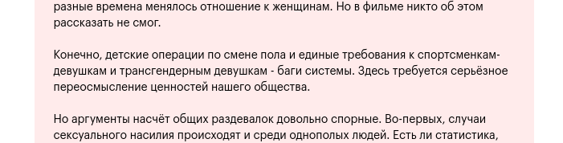

# 4. Особенности нашего времени 

Краткие тезисы по главе

- [Автор пытается проанализировать трансформацию понятия Счастье и влияющих на него факторов за историю человечества.](#happiness_in_time) 
- [Наш организм сформирован эволюцией 100 тысяч лет назад для не очень долгой и не очень счастливой жизни.](#human_body_for_happiness)
- [У автора возникают вопросики к осознанности — как своей, так и окружения. Мы точно хотим быть Счастливы, когда выпиваем, курим?](#awareness_and_addictions)
- [Брезжил ли свет Надежды о Счастливом будущем ранее? 100 тысяч лет назад — неизвестно, а всего лишь 100 лет назад в России была Надежда.](#new_hope)
- [Автор задаётся вопросом — каким было самосознание человека 500 лет назад? Вероятно, оно было совершенно другим и в центре не было Я.](#self_awareness)
- [Самоощущение человека в мире и обществе значительно поменялось с научным и техническим прогрессом.](#scientific_progress)
- [Трансформация базовых принципов сейчас происходит наиболее активно. Делает ли это нас счастливее и не создаёт ли новых рисков?](#new_system_of_principles)
- [Глубокие ученые, совершая прорывы в представлении о материальном мире, зачастую остаются консервативны в ценностях и идеалах.](#scientific_approach)
- [Автор текста пытается в одном параграфе подытожить успехи человечества и определить — приближается ли наше поколение к Счастью?](#summary_about_out_time)
- [А что нас ждёт в недалеком будущем, которое довольно уверенно описывает автор текста и специалисты в области информационных технологий?](#happy_tomorrow)

Нам посчастливилось (может в кавычки стоит взять) жить в совершенно причудливое время.

## Насколько наше тело соответствует современному образу жизни? 

Смею предположить, что за 100 тысяч лет эволюции наши тела поменялись несильно: ну стали мы повыше на 10 сантиметров, ну зубы чуть уменьшились, мозг чуть побольше стал, хотя палитра испытываемых чувств и эмоций расширилась кардинально. Но в целом, наши тела остались такими же, и они не очень соответствуют современным условиям жизни. Ведь на значительные мутации нашего организма в естественном отборе требуются миллионы лет, и эволюция не успевает перестроить наши тела, следуя за динамикой развития сферы потребления последних двух сотен лет. Мозг, который сформировался во времена, когда еды могло не быть неделями и её нужно было добывать на охоте, продолжает посылать нам стимулирующие сигналы употребить побольше быстрых углеводов про запас, если такие вдруг попадают в рот. Для современных жителей этот инстинкт накопления скорее создает проблемы с лишним весом и сопутствующими болезнями, чем помогает выжить. И средняя продолжительность жизни у нас стала значительно дольше 30-40 лет. А это тот период, когда неумолимо включается ген старения и наши ткани начинают разрушаться. И этот полезный и необходимый для эволюции процесс, который ускоряет сменяемость поколений и увеличивает число потенциальных мутаций, не может нас не расстраивать. Эти инстинкты и особенности нашего организма скорее не повышают, а понижают интегральный уровень счастья.

## Осознанность и зависимости 

При этом уровень осознанности и отношения у человека разумного к окружению и даже к своему организму такой, что начинаешь сомневаться в том, что разумный. Чтобы далеко не ходить, можно прямо на моем примере: вот знаю же, что алкоголь и никотин обладают определенным наркотическим действием и не делают меня здоровее? Знаю. Буду дальше культурно припивать? Конечно же! Ещё не раз нанесу умеренный вред здоровью, чтобы "выдохнуть" в состоянии стресса, когда уже сил не хватает. И трубку ещё набью, когда табак вкусный под руку подвернется и захочется убрать это раздражающее З-з-з-з-з из сознания, а организм ещё будет в состоянии выдерживать все эти воздействия. Довольно подробно и увлекательно про все эти знакомые зависимости и быстрые способы повышения эмоционального тона описано в [Занимательной наркологии музыканта Макаревича](https://www.livelib.ru/review/3535819-zanimatelnaya-narkologiya-andrej-makarevich). Алкоголь снимает блоки в коммуникациях, начинаешь говорить из сердца, и усиливает ощущения прекрасного момента — здесь и сейчас. В контексте рассуждений о Счастье очень нравится определение [Владимира Андреева](../what-to-do/equator.md#andreevvs):
> Алкоголь — это Счастье, взятое взаймы. 

Куда менее забавно о своих зависимостях пишет комик Мэтью Перри, умерший как раз в день публикации этой главы. [Смешной и остроумный текст](https://www.livelib.ru/review/3780112-druzya-lyubimye-i-odna-bolshaya-uzhasnaya-vesch-avtobiografiya-mettyu-perri) зачастую пробирает до содрогания и послужит хорошим предостережением. Или, вот тоже, мой любимый [Оззи Осборн](https://www.livelib.ru/review/3752326-ya-ozzi-vsjo-chto-mne-udalos-vspomnit), который ничего не мог поделать с собой и до сих пор не умер лишь благодаря фантастической стойкости организма. 

Ещё 100 лет назад такое отношение было бы простительно. Курили все — и женщины, и дети. Образования не было, привычка даже не считалась вредной, но сейчас же не так! Есть динамика, конечно, но, глядя на себя и по сторонам, незначительная.


Могу заметить, что когда нахожусь в воодушевлении от большой и важной работы и когда занимаюсь ровно тем, что люблю — не возникает особого желания защищаться от выгорания ни алкоголем, ни никотином. Правда, бывает, начинаю просыпаться до восхода, но это хорошая возможность поразмышлять и обстоятельно начать какие-то ключевые изменения, которые не получается запустить в дневной рутине. А бороться с собой на волевых и ограничивать себя в неудачно приобретенных по молодости вредных привычках, когда силы моральные закончились, вероятно, будет даже себе дороже. Отсюда, лично для себя, сделал вывод, что следование Призванию и Большим целям, о которых говорил ранее, в какой-то степени, сохраняет здоровье :-) И такой естественный подход работает, вероятно, эффективнее чем всякие терапии, таблетки и другие костыли, которые я, впрочем, не пробовал без лишней надобности.  


## Россияне в ожидании сказки 100 лет назад 

В 1917 году именно в России многие жили в надежде, что строится новый мировой уклад общества, основанный на разумном распределении ресурсов и дружбе народов. Границ и стран не будет, общество едино. Поэтому, кстати, когда большевики отдавали земли Германии в 1918, всё равно держали в уме, что скоро эти земли вернуться в управление трудящихся. От каждого по способностям, каждому по потребностям — все будут счастливы! Труд будет не следствием эксплуатации одних другими, а естественной потребностью для человека! Ведь интересно же опускаться на дно океана, летать на другие планеты, изучать историю! Ресурсов всем хватит, работа на всех найдется! Для замещения рутинной и тяжелой работы построим электростанции и заводы с конвейерами! 

Если вдуматься — совершенно разумные подходы. Только сознание у людей, объективно, не было готово к таким переменам — не готово человечество считать равными в правах себе подобных. Ни 100 лет назад, ни сейчас. Родился на Манхеттене — одна жизнь, в китайском человейнике или глухой деревушке — другая совсем жизнь будет. И один будет эксплуатировать другого, и войны на Земле будут неизбежно, пока человек не станет разумным по-настоящему и не поменяет системы ценностей и уклад общества.

## Самосознание 500 лет назад 

Тысячи лет до эпохи технического прогресса каких-то особенных изменений в течении жизни человека не происходило. Как мужчина охотился с помощью лука, так и его дед использовал стрелы, и его сыновья шли на охоту со стрелами без изменений. Ничего принципиально не менялось. Одинаковые войны, одинаковые жизни, одинаковые заботы. Если хочешь знаний и просвещения — иди в монастырь. Лучшие умы стекались туда, монахи были грамотные, у них были книги, деньги и даже оружие. Достаточно побывать на Соловках, чтобы в этом убедиться — свои водные каналы, шлюзы, водопровод, оранжереи, сложные схемы отопления, маяк с актуальной по сей день хрустальной оптикой, совмещенный с колокольней. Это был центр мира: единение духа, труда и интеллекта. И это не уступало по инновациям и рациональному подходу планировкам европейских городов эпохи Ренессанса. Которые начали стремительный рост после перемещения золота крестоносцами из Константинополя в Европу. До этого были диковатые нравы и средневековая грязища, но неожиданно появившееся золото и рациональный подход в его использовании поменяли ситуацию.

В то время, когда мало что менялось в течении жизни одного человека и мир вокруг был полон тайн, в центре мироздания был Бог. Удивительными для меня оказались наблюдения ученого и писателя Евгения Водолазкина, изучающего летописи русского средневековья: люди мыслили совершенно по другому в то время. В рукописях практически отсутствуют «Я» формулировки. Даже когда летописец писал о себе — использовалось третье лицо. Для того, чтобы почувствовать себя средневековым человеком, вероятно, действеннее не надевать лапти или кольчугу, как это делают реконструкторы, а в течении недели не использовать в речи и мыслях «Я» форму. Не «Я» провел встречу и подписал контракт с заказчиком, а волей Божией подписали контракт :-) Забавно. Чувство трепета и благоговения при столкновении с необъяснимым и бесконечно великим, можно предположить, возникало чаще. А чувство зацикленности на себе и зависти к успехам "друзей" из ленты соцмедиа — реже.

## И вот наступила эпоха научного прогресса 

И в общем, если мы, как будто бы, не можем похвастаться значительным прогрессом в физиологии и общественном сознании, то с технологическим прогрессом за последние пару сотен лет всё очень неплохо. А в области информационных технологий прогресс просто умопомрачительный, и кривая роста объёмов обработки данных год к году стремится к бесконечности. Прошлое поколение ещё не знало мобильных телефонов, а теперь каждый в любой момент времени может прояснить для себя любой вопрос известный человечеству, подключившись к Википедии или искусственному интеллекту, который вобрал в себя знания, накопленные со времен Адама и Евы по сегодняшний день. Фантастика!

Т.е. тело у нас заточено под образ жизни первобытного человека, сознание и образ мыслей по сравнению со средневековым сильно поменялись, хотя до разумной осознанности нам далеко, но мы получили в руки инструментарий сверхлюдей в области обмена информацией. У меня лично такая ситуация разрыва уровней подготовки человека по разным характеристикам вызывает ассоциации с капризным ребенком в очень обеспеченной семье или вспоминается метафора «обезьяна с гранатой». Достаточно посмотреть, к чему приводили эти разрывы в истории. 

Достижения капиталистического строя на всемирных выставках XIX века (паровозы, пароходы, конвейеры, заводы) поражали воображение, ломали старые представления о богоцентричном мире и меняли жизнь уверенно и бесповоротно. Критическое мышление и пересмотр базовых принципов и ценностей от мыслителей-теоретиков, таких как Маркс или Ницше (что само по себе очень неплохо), успешно использовались для раскачки общественных настроений политиками-практиками — Лениным и Гитлером, например. А последующая борьба за власть с использованием новых достижений в технологиях массового уничтожения и коммуникаций рождали колоссальные трагедии и войны.

## Наше время 

Пересмотр принципов в отношении рас (BLM), полов и гендеров (LGBT) последних лет, как естественное следствие развития эгоцентричного мира, на мой взгляд, может использоваться как инструмент влияния на геополитическом уровне вместо устаревающих, уже немодных национальных и классовых различий. Сделал этот вывод самостоятельно, общаясь с знакомыми итальянцами, американцами, сербами, вьетнамцами, мигрантами, погружаясь в историю, книги и документальные фильмы. Многочисленные диалоги по этой теме с друзьями мне привести будет затруднительно, но вот американский журналист провел мощнейшую работу в фильме-интервью [What is a Woman](https://www.kinopoisk.ru/film/5016160/). Считаю, что уважительно отношусь к правам и мнениям разных людей, включая и нетрадиционных ориентаций. И даже если мне не довелось вести с представителями меньшинств задушевных бесед о трудностях их непростой жизни — трудно не видеть те перекосы и потенциальные риски, которые создаются популяризацией этих течений в головах наших же детей. При этом, если как-то произошло, что люди одного пола хотят быть вместе — уверен, что настоящая Любовь найдет возможность им объединиться без выхода на демонстрацию с транспарантами вагины и не тряся причиндалами на уровне головы ребенка, как можно видеть во время исследования этой темы Мэттом Уолшем. Прочитал одинокую, и от этого заслуживающую уважения, оправдательную рецензию к этому фильму с позиции Адвоката на сайте Кинопоиска, где девушка мужественно пытается защитить всё то, на что направлен жесткий посыл этой документалки.

И в целом, всем сердцем принимая её комментарий и ассоциацию с процессом программной разработки информационной системы, готов с ней согласиться и дополнить: если эти “баги” нового дивного мира столь очевидны и критичны — может не стоит тогда использовать эту доктрину как фактор давления на страны Евросоюза и убеждать, что этот “релиз” можно выкатывать “в прод” всем разом? Может, действительно, надо критически сначала подойти к ценностям общества?

## Настрой общества и отношение ученых к ценностям разнятся     

Примечательно, что гениальные учёные, совершившие реальные прорывы в науке, зачастую не разделяли прогрессивные и модные общественные течения. Например, по отношению к религии и борьбе с Богом. Эйнштейн, сформулировавший теорию относительности и, как казалось тогда, подступивший вплотную к раскрытию тайны мироздания, откровенно злился когда ему за глаза навешивали ярлык атеиста. Приведу его рассуждения на эту тему.

> Ваш вопрос (о Боге) является самым трудным в мире. Это не тот вопрос, на который я могу ответить просто «да» или «нет». Я не атеист. Я не знаю, могу ли я охарактеризовать себя как пантеист. Эта проблема слишком обширна для наших ограниченных умов. Могу ли я не отвечать притчей? Человеческий разум, независимо от того, как хорошо он обучен, не может понять Вселенную. Мы подобны маленькому ребёнку, зашедшему в огромную библиотеку, стены которой забиты книгами на разных языках до потолка. Ребёнок понимает, что кто-то должен был написать эти книги. Но он не знает, кто и как их написал. Он не понимает языков, на которых написаны книги. Ребёнок замечает определённый порядок этих книг, порядок, который он не понимает, но смутно представляет. Это, как мне кажется, отражает отношение человеческого разума, даже наилучшего и самого культурного, к Богу. Мы видим, что Вселенная устроена удивительно, подчиняется определённым законам, но мы понимаем эти законы лишь смутно. Наш ограниченный разум не способен постичь загадочную силу, которая качает созвездия. — _Альберт Эйнштейн_

Понятна реакция Эйнштейна. Ведь даже сам термин атеист, не про веру в Науку, а про неверие в Бога. И учитывая, что Бог, как понятие, у непогруженного человека, зачастую субъективное, стереотипное и наносное, статус атеиста — это прекрасный повод отмахнуться от всех сложных вопросов и дилемм: "Я атеист и в бога не верю!". После этого высказывания, как будто бы, проведена черта между мной — рациональным трезвым современным человеком и остальным непонятным “мракобесием”, в котором надо разбираться. Есть прекрасный анекдот-притча на этот счет.

> Жил-был на свете один атеист. Характеризовался хорошим знанием религиозных тем. Он был довольно начитанным в Евангелии и легко спорил с православными батюшками, с католическими ксендзами, с протестантскими пасторами. Он знал церковный богослужебный устав, поэтому мог спорить даже с церковными уставщиками.
Мало того, он знал даже и еврейскую письменность, знал и Тору, и Каббалу. И мог спорить и с евреями на темы, которые их интересовали. Мало того, он знал и мусульманскую письменность, он знал хорошо Коран, суры, сунны, толкования, хадисы пророка. Короче, он вводил в шок и трепет всех монобожников: христиан, мусульман, иудеев, спорил с ними жарко. Где ни заметит, бросается в спор и побивает их.
Это рождало ужас и трепет во всех религиозных деятелях и рождало великое уважение атеистов.
Однажды к нему пришел молодой человек и говорит: "Я хочу у вас учиться. Я такой же безбожник, как и вы, и мне очень импонирует эта ваша начитанность, агрессивность в спорах с религиозными деятелями. Я тоже так хочу. Я хочу защищать безбожие вашей аргументацией".
На что этот известный атеист говорит ему: "Сынок, ты когда-нибудь слышал хор девственниц на ночной службе в монастыре? Как они с полуночи до утра поют богу псалмы и песни духовные?" Тот отвечает: "Нет, конечно, никогда этого не слышал, потому что мне это не надо, потому что я атеист".
Он говорит: "Хорошо, а ты знаешь, о чем думают мусульмане, когда одеваются в белые одежды и идут пешком в свой хадж в Мекку, и чем они занимаются, когда в Мекке сидят вокруг Каабы? Что они там делают, о чем думают, что поют, что едят?" Тот отвечает: "Мне это вообще не интересно, потому что я атеист, как вы сами понимаете, я не интересуюсь такими вещами". Он говорит: "А ты когда-нибудь слышал, как плачут в своих кельях отшельники?". Тот отвечает: "Нет, мне это совершенно до лампочки, потому что я атеист и не интересуюсь этими вещами. Я хочу громить всех церковников, и мне не интересно, вообще, о чем они плачут, о чем они поют, о чем они думают". Он говорит: "Я еще спрошу, ты знаешь, сколько часов в день над книгами проводит средний раввин?" Тот отвечает: "Я не знаю всего этого. И мне непонятны ваши вопросы. Неужели вы не понимаете, я атеист, как и вы. Мне плевать на раввинов, на мулл, на паломников, на монахинь, на отшельников, на всё. Я хочу быть проповедником атеизма". Атеист поспрашивал его еще. Потом говорит ему: "Сынок, понимаешь, ты не атеист. Ты дурак".

Я этот анекдот слышал в исполнении протоиерея Ткачева, но, самое забавное, что в Интернете нашел его на сайте какого-то боевитого атеиста, где он пускается в рассуждения на этот счёт и, кажется, сам себя запутывает окончательно. Во всяком случае, прочитав его рассуждения, создается впечатление, что либо ему придется найти ответы на феномен возникновения жизни ([смотрите статьи о гомохиральности](https://elementy.ru/novosti_nauki/432316/Na_puti_k_obyasneniyu_gomokhiralnosti_zhizni_polyarizovannye_elektrony_initsiiruyut_khiralno_selektivnye_reaktsii_v_gazovoy_faze)) и нерешенные вопросы из квантовой физики, либо смириться с этим неблагозвучным эпитетом, который стоит рядом с гордым званием атеиста. Или вот великолепное высказывание Гейзенберга — не того, что в Breaking Bad, а того который создал квантовую теорию и, вроде бы, разобрал мироздание на маленькие частицы, не оставив места для чего-то ещё.

> Первый глоток из сосуда естественных наук делает нас атеистами, но на его дне нас ожидает Бог. — _Вернер Гейзенберг_

## Выводы 

Совершенно не хочется лезть в дебри креационизма и разбираться в противоречиях религии, естественных наук и философии, так как для этого нужно одинаково глубоко разбираться во всех этих дисциплинах, а хочется остаться на уровне причин формирования феномена Счастья — и для этого слишком глубоко погружаться в эти нюансы нет необходимости. Тем более, что все эти направления мысли могут сосуществовать вместе.

Попробую выписать сделанные мной обобщённые выводы в список:
* опору в Боге, в успокоительном центре мироздания, общество в основной своей массе потеряло уже довольно давно; 
* другие фундаментальные принципы и ориентиры, ведущие к счастливой и осмысленной жизни не закрепились и вызывают вопросы;
* мы, как биологический вид, обладаем весьма посредственными физическими данными для противостояния стихии один на один, но придумали всякого оружия массового уничтожения себе подобных;
* наша осознанность, вероятно, укрепляется, но мы всё ещё развлекаем себя легкими наркотиками, алкоголем, неполезной и лишней пищей при том, что знаем о разрушительном для тела действии;
* мы привыкли и в целом спокойно относимся к очевидному неравенству людей при их рождении;
* мы заметно улучшили качество жизни за последние сотни лет и продолжаем его улучшать с большим рвением;
* на Марс мы пока не улетели, но у нас есть стремительно развивающиеся информационные технологии, позволяющие общаться. "Человеку нужен Человек!" как звучало в Солярисе; 
* отсутствие (в основной массе) знания исторических событий и общественных настроений, даже последних столетий, не позволяет видеть маятник схожих ситуаций и одного витка за другим;
* a отсутствие навыков критического мышления даёт возможность применения глобальных манипулятивных техник и пропаганды в современном обществе.

## Искусственный интеллект — следующая угроза человечеству? 

Фантасты уже несколько десятков лет говорят про то, что Человекоцентричный мир может закончиться уже при нашей жизни. Как только технологический прогресс дойдет до запуска искусственного интеллекта, который будет превосходить наш и который мы не сможем контролировать. Наступает, так называемая, точка технологической сингулярности. Сам не страдаю фобиями, но темпы развития машинного интеллекта и сценарии его применения беспокоят известных мыслителей нашего времени. Как в 1970-е годы создавались ассоциации по биоэтике, затрагивающие вопросы вмешательства технологий в человеческое тело, так сейчас создаются ассоциации этики искусственного интеллекта, который может создать угрозу человечеству. И вроде можно сказать, что достаточно выдернуть компьютер из розетки, отключить от сети, но ведь сам же понимаешь, что вычисления давным давно распределены и инфраструктура защищена от таких ситуаций, как потеря электропитания. И если от Богоцентричного мира общество в массе своей отказалось из-за технического прогресса и релятивистских течений в философии, Человекоцентричный мир хоть и не в состоянии пока ответить на фундаментальные вопросы о происхождении мира и жизни, но уже давно создает угрозы в саморазрушении. Сюжеты Терминатора или Черного зеркала или практически [документальные ролики про наших детей в недалеком будущем искусственного интеллекта](https://www.youtube.com/watch?v=-r_2a064dWY) перестают быть фантастикой и заставляют задуматься. А если Искусственный Интеллект превзойдет Человеческий - на кого можно будет надеяться? :-)

Кстати, сам искусственный интеллект в лице GPT 3.5, как средоточие накопленных человечеством знаний и мнений, ожидаемо балансирует в суждениях о Боге и даёт разные варианты ответов для разных контекстов:


Serge Polyakov:

Бог - это рациональное понятие?

ChatGPT bot:

Как и все, что связано с религиозными верованиями, вопрос о том, является ли Бог рациональным понятием, вызывает много разногласий. Некоторые люди считают, что Бог является вымыслом и не может быть рационально объяснён, тогда как другие утверждают, что Бог существует и может быть объяснен рационально.
С точки зрения философии, Бог может рассматриваться как рациональное понятие, поскольку он может быть определен и описан через различные философские аргументы и логические доказательства. Например, аргумент о первопричине говорит о том, что все в мире имеет причину, и поэтому должна существовать первопричина, которая не имеет причины и является Богом. Аргумент о порядке и дизайне утверждает, что порядок и дизайн в природе указывают на существование Бога.
Однако многие люди считают, что Бог не может быть рационально объяснён, так как он является сверхъестественным и трансцендентным понятием, которое не может быть измерено или доказано научными методами. В конечном счете, вопрос о том, является ли Бог рациональным понятием, остается открытым и зависит от индивидуальных верований и философских взглядов.


[Краткий пересказ главы](#kratkie-tezisy-po-glave)