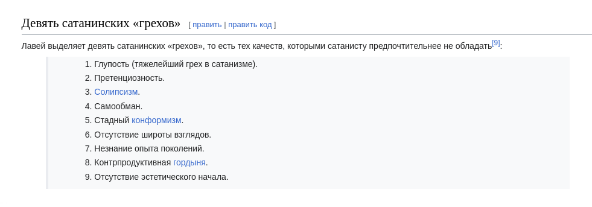

# 5. Стереотипы счастья и причины несчастий 

Краткие тезисы по главе

- [Стереотипы счастья и причины несчастий](#reasons_for_happiness_and_misfortune)
- [Деньги](#money_for_nothing)
- [Деньги — увеличительное стекло или просто ресурс](#wealth_is_not_happiness)
- [Батарейка, Азиз!](#battery_aziz)
- [Эгоцентризм](#egocentrism)
- [Зацикливание на себе как повод Несчастья](#egocentrism_is_not_happiness)
- [Горе от ума](#intelligence_quotient)
- [Жить моментом](#power_of_now)
- [Технологии](#gadgets)
- [Дед Мороз и гаджеты в семьях](#ded_moroz_and_ipad)
- [Контроль информационного потока](#information_flow)

Краткое содержание построено YandexGPT (Краткий пересказ, Температура: 0.1):

- Деньги не делают людей счастливыми, а могут привести к дополнительным заботам и проблемам.
- Капиталистическое мироустройство формирует систему координат, основанную на конкуренции и перераспределении ресурсов.
- Зависимость от денег может привести к потере счастья и радости.
- Богатство не гарантирует счастья, а может даже сделать человека несчастным.
- Эгоцентричное восприятие мира может привести к конфликтам и несчастью.
- Интеллект и технологии могут быть источником счастья, но также могут привести к зависимости и несчастью.
- Важно контролировать информационный поток и не зависеть от социальных медиа.
- Зависимость от общества и страны может привести к несчастью, даже если человек пытается изменить свою жизнь.

## Деньги 

Традиционный полу-шуточный ответ на полу-шуточный вопрос:

- Что тебе надо для счастья?
- Денег! И побольше!

При этом сравнительно небедные люди, скорее всего, подтвердят, что деньги, также как и власть, не делают их обладателей счастливыми. Да, требуется определенный уровень достатка, необходимый для того, чтобы чувствовать себя комфортно и быть полноценным членом общества, но при достижении этого уровня дальнейшее увеличение богатства создает скорее сложности и лишние заботы. При этом сам процесс перераспределения денег в свою пользу может создавать определенный игровой азарт и бодрящее ощущение риска, как на охоте, но сам результат, в виде заработка или последующих покупок — значимого счастья и радости уже не приносят. Возникает потребность в чём-то большем!

Капиталистическое мироустройство неминуемо формирует основную систему координат и ценностей в обществе, основанную на перераспределении ресурсов и конкуренции, что формирует в сознании вектор развития в обогащение. Очень многое в нашей жизни пересчитывается на деньги. По покупкам судят об успешности человека. Зависимость от прыгающей морковки с нулями денежных знаков перед глазами растет, но при этом счастья больше не становится.

Меня сравнительно недавно спросили:

— А когда ты последний раз считал деньги до получки?

И мне стало неловко от того, что я уже не смог вспомнить этого времени. Пришлось разматывать цепочку с юности.

В старших классах школы, в 1990м, семья состояла из меня и мамы. Мама работала в ночную смену корректором в Доме Печати и этих денег хватало нам вдвоем только на еду. Моя мама была совершенно невероятная и свободу мне предоставляла очень широкую — отпускала из дома на несколько дней и верила (хотя, конечно же, очень переживала), что эти ночи я провожу на кафедре вычислительной техники в Педагогическом институте. Мне позволяли там ночевать и работать на персональных компьютерах. Там я и был все дни напролёт, в ущерб учебе и здоровью. О правильном питании и речи не было. Спорта тоже, можно сказать, не было. Плюс к тому, я сидел неотрывно за компом и начал покуривать в поисках какого-нибудь особо заковыристого «бага», который не удавалось поймать всю ночь. Но не голодал, свободные деньги были не особо нужны, и я был счастлив! Именно в школьном возрасте стал профессиональным программистом — написал на языке Assembler для MSX Yamaha графический пакет программ для преподавания в школах. В моей же школе на меня махнули рукой и начали отправлять на олимпиады по программированию, закрывая глаза на посещаемость. Время было такое и школа такая, что так вполне было можно сделать. Чему я, кстати, очень рад и считаю такой формат образования успешным. И в результате карманные деньги у меня-школьника появились от продаж софта и разработки на заказ для профессуры и студентов-дипломников.

В студенческие годы меня подкосил тот факт, что мой уровень практических знаний программирования на порядок превосходил уровень преподавателей. Я говорю именно про практическую часть — «как реализовать планировщик задач?», а не теоретическую — «кто создал первый советский компьютер и какую площадь он занимал?». Исчезла цель и преодоление, необходимость заниматься малоинтересными дисциплинами снизила фокусировку, я подрасслабился — любопытство и увлечение перекинулось с программирования, которым раньше занимался круглые сутки, на исследование тяжёлой музыки, которая для меня, рождённого в СССР, была символом свободы и выхода за рамки. И если сама музыка вызывала мощнейшие эмоции, то рациональное сознание и навыки программирования тут же, сами собой, упаковали и оцифровали всю дискографию, состав групп, музыкальные стили в единую базу данных. А если есть база данных — значит можно сделать программу для красивого оформления вкладышей в аудиокассеты. А это уже конкурентное преимущество для студии звукозаписи, которые появлялись как грибы после дождя в то время. На деньги от продажи графического редактора были куплены двухкассетные магнитофоны и началась запись, печать и продажа кассет с новинками любимой музыки. Чтобы привлечь клиентов достаточно было прийти на местное радио и предложить им занять часовой эфир программой, которую я взялся вести как диджей. Для радио Самара-Максимум это означало расширение аудитории, без каких-либо затрат, а для меня — бесплатную рекламу. Так появилась студия звукозаписи и передача Lightning Strike, позже веб-сайт musica.mustdie.ru, а денег стало более чем достаточно для веселой студенческой жизни. Но и цель была не в деньгах изначально, а лишь в следовании своим увлечениям. И, конечно же, я был счастлив совмещать оба увлечения — программирование и музыку.

Когда в моей жизни появились жена, ребёнок и сопутствующие этому серьёзные траты, а зарплаты программиста на заре Интернет стало не хватать, выход был очевидный — самому начать заботится о проектах и работе. Так появилась веб-студия Вебзавод. Бухгалтерия и сопровождение договоров оставались на головной компании, а сам я мог и далее развлекать себя интересными и абсолютно бессмысленными финансово проектами. Однако денег хватало на питание семьи и платежи по ипотеке, которая на тот момент была новшеством.

Но что такое небольшая, хоть и созданная своими руками, студия разработки против супер-пупер-мега монстра в мире программного обеспечения, корпорации Microsoft? В стек технологий «мелкомягких», как разработчики ласково называли компанию, я был искренне влюблён. Работа в Microsoft была сияющей целью, настоящая DREAM JOB, и я решил упираться рогом, чтобы туда попасть. Что и реализовалось спустя пару лет. Вопрос с деньгами, чтобы дотянуть до получки там уже не стоял в принципе. Но появились хитрые в расчёте и мотивации премии, опционы и акции.

Важно отметить, что на тот момент мои личные финансы уже учитывались. Любые поступления и траты фиксировались в цифровом устройстве, а процесс анализа финансов и периодического сведения баланса перешёл в привычку. Обойтись без вовлечения жены в этот процесс было совершенно нереально — ведь баланс должен сходиться по всем семейным счетам. Сильная сторона жены — экспромт и импровизация, и ей было намного сложнее вырабатывать эту привычку. Но как следствие этих привычек дочь самостоятельно начала вести учет своих финансов. Никто её не учил и не подталкивал. И такой спокойный, чёткий подход к деньгам, как к основному ресурсу, формирует, на мой взгляд, правильную картину мира — деньги не цель, а ресурс для целей.

«Богатого папы» у меня не было. Однако в данный момент считаю, что мне максимально повезло по жизни. Деньги я просто учитывал, но вкладывался в отношения с окружающими меня по работе людьми. Которых люблю и уважаю.

В общем, я растерянно пожал плечами вместо ответа на этот вопрос…

### Деньги — увеличительное стекло или просто ресурс 

Банальный вывод — деньги необходимы для создания уверенной базы, но далее, не только не приносят радости, но чаще создают проблемы. Начиная со среднего уровня достатка, деньги, очень похоже, работают как увеличительное стекло, усиливая позитивный или негативный настрой. Если деньгами подменить своё Призвание, если к моменту обретения богатства не нащупать истинное Призвание, то возникает слишком много соблазнов отклониться от своего пути. Если поставить недостаточно амбициозные цели и достигнуть их без значительного преодоления, то деньги могут сделать человека более несчастным. Примеров таких Остапов Бендеров множество в литературе и реальной жизни.

## Батарейка, Азиз! 

До последнего времени старался раз в год ходить в непростые походы с друзьями. Там выходишь из состояния рутины и в полной роли ощущаешь важность человеческих отношений — никуда не деться от совместных испытаний. В зимнем походе по Хибинам у меня визуализировалось картинка, где над товарищами отображается индикатор их Душевных сил. Индикатор в виде батарейки, иногда мерцающий. У кого-то ёмкость была невелика изначально и любое падение уровня заряда приводит тон общения в опасный негативный формат — раздражение, скрытая или явная агрессия. У другого — размер батарейки приличный, но длительная растрата заряда требует периодической подзарядки. Чья-то батарея мгновенно разряжается на морозе, у кого-то после долгой физической нагрузки, у другого на антисанитарной обстановке — на любом несоответствии реальности и ожиданий. Как только батарейка высаживается в ноль, человек начинает инстинктивно ограничивать сохранение связей с окружением, сберегая оставшийся заряд. Этот аварийный режим, который человек использует, чтобы остаться в строю и растянуть заряд на другие задачи, более заряженное окружение обычно воспринимает как холодность, злобу или даже враждебность. Хотя при более внимательном взгляде, видно, что это не так и настоящая причина в нехватке Душевных сил.

Не претендую на глубину мысли и на авторство — подход примитивен, но он помогает избегать раздражения. А сдерживание гнева — мой приоритет в работе с доставшимся по наследству темпераментом. Тоже ведь надо ёмкость «апгрейдить» или учиться переходить в режим энергосбережения в определенных ситуациях. В общем, прежде чем самому переходить в турбо режим траты душевной энергии и эмоционально включаться в конфликтную ситуацию полезно выдохнуть и постараться разглядеть ёмкость батарейки и уровень заряда у товарища. Ведь глупо обижаться и ругаться из-за разряженной батарейки! Почему-то вспомнилась комичная сценка с батарейкой из видеокассетной юности — «Правдивая ложь». Помните ? :-)

В завершении похода, размышляя о пережитом при посадке в самолёт, [столкнулся с попутчиком, у которого на майке была надпись «Злых людей нет, есть только люди несчастливые»](https://t.me/bongiozzo\_public/488). В тот момент я даже не вспомнил, где её читал раньше, но формулировка настолько резко срезонировала с рассуждениями, что я остановился в проходе, непроизвольно достал смартфон и сфотографировал изумлённого мужчину. Уже на своём месте додумал формулировку до принципа в персональной системе правил — есть только люди, у которых по какой-то причине закончились душевные силы. А когда сам это прочувствовал, обдумал и согласился — обиды на окружение в жизни стало меньше :-)

## Эгоцентризм 

Кажется, что быть счастливым очень мешает эгоцентричное Я-Я-Я восприятие мира. Когда мир видится как пространство, в центре которого находишься сам. Удивлюсь, если распространено другое :-) Когда мозги постоянно анализируют и сравнивают окружение на улице, на работе, в соцмедиа и оно зачастую видится лучше тебя — непроизвольно возникает ощущение, что тебя обделили или даже скажем — тебе Должны! Заметил, что в надломленных людях, которые воспринимаются как несчастливые, часто можно слышать слово Должен в формулировках, направленных на других.

Вероятно, что сделал человек что-то хорошее для другого, но запускается мысль, а что Я получу в награду? Реальность не совпала с ожиданиями, появляется обида и недовольство «неправильным» окружением, которое теперь Должно.

Думаю, что пребывание в модели Долженствования в отношениях с окружением разъедает человека изнутри и делает его несчастным. Размышлял над этим и даже решил опробовать для себя в качестве установки максиму — НИКТО МНЕ НИЧЕГО НЕ ДОЛЖЕН! Мне нравится подход, когда принцип закрепляется через правило в разговорной речи. Не использовать указующее слово Должен в общении с детьми, родителями, друзьями, соседями, со всеми с кем хотелось бы жить по Любви. Любовь ведь не подразумевает награды и освобождает от связывающих пут долженствования. А слово Любовь давным давно, с момента прочтения [«7 навыков»](https://www.livelib.ru/review/3792199-sem-navykov-vysokoeffektivnyh-lyudej), воспринимаю как ГЛАГОЛ. И тогда любовь к маме, жене, детям, отцу и всем близким это всего лишь, когда выделяешь время, берёшь ответственность и совершаешь разные поступки, без которых к этому слову возникают вопросики.

Эту установку не стоит применять к Договорам и другим явно прописанным Контрактам с разделом Обязательств. Может плохо закончиться :-)

В случае с Отчизной хорошо бы тоже практиковать глагольное понятие Любви. Например, легко и с интересом погружаюсь в историю города и окрестностей.

### Зацикливание на себе как повод Несчастья 

Конфликты с окружающими нас людьми, конечно же, делают нас несчастными — в эгоцентричном восприятии мы ждём понимания и внимания к себе, но его недополучаем по множеству причин. В результате растёт ощущение несчастья внутри. [Концепция разумного эгоизма](https://ru.ruwiki.ru/wiki/Разумный_эгоизм), сформулированная Чернышевским в [романе «Что делать?»](../README.md#what_to_do), доработанная [петербурженкой Алисой Розенбаум, более известной после эмиграции как Айн Рэнд](https://ru.ruwiki.ru/wiki/Айн_Рэнд), сформировала систему координат для системы высшего образования в США и со временем оказала влияние на государство в целом. Система прекрасно «заточена» под развитие конкуренции и, как следствии, прогресса, но оставляет серьёзные поводы для несчастья в обществе.

Не хватает в рутинной городской жизни ощущения соприЧастия себя, маленькой и незначимой частички, к бесконечному и прекрасному миру — [редкое ныне чувство Благоговения](./sledovanie-prizvaniyu.md#sense_of_awe). А это значит, что мы не дополучаем положенные нам природой моменты Счастья :-)

## Горе от ума 

Эра бурного научного и технологического прогресса поменяла уклад, систему взглядов и ценностей — интеллект закрепляется как самый важный вектор собственного развития. Быть неумным ещё более неприлично в определенных кругах, чем быть финансово несостоятельным.

Когда Wikipedia ещё не было даже в проекте, а мне приспичило собрать дискографию всех тяжело-металлических групп, в том числе построивших свой имидж на антихристианской или, попросту говоря, сатанинской тематике, меня заинтересовали предпосылки появления такого творчества.

Сразу оговорюсь, что никаких сектантов и оккультистов в моём неформальном окружении не было. Основной круг общения составляли незаурядные парни, вероятно более открытые и добрые, чем моё «приличное» окружение сокурсников в университете. Это были дети работяг и инженеров нашего промышленного города, которые дорвались до свободы самовыражения и всем сердцем любили мощнейшую энергетику, которую вскрывала эта необычная музыка.

Интеллектуалы музыкального андерграунда использовали благодатную почву иезуитского образа отдельных представителей церкви — проповедуют одно, но делают совершенно другое, что отвратительно — об этом и поём. Творчество других было весёлым стёбом в стиле ужастиков на любую тему, где религия не была исключением. Скандинавы погрузились в языческие традиции своих народностей, которые были вытеснены христианским укладом и поэтому они своим творчеством наносят «ответный» удар. Но некоторые команды из южных штатов Америки были «глубоко в теме» и состояли в рядах сатанинской церкви (секты), сформировавшей свою систему ценностей. Тогда детальная информация такого рода была дефицитом и подробнее узнать получилось сравнительно недавно, посмотрев документалки и почитав сетевую энциклопедию.

Любопытно, что система координат, смоделированная оккультистом с русскими корнями [Антоном Лавеем](https://ru.ruwiki.ru/wiki/Лавей,_Антон_Шандор) в 60е годы для новой общественной модели, очень напоминает базовые ценности образованного либерального современного человека. Есть вполне логичное мнение, что философия Лавея, изложенная им в [«Сатанинской библии»](https://ru.ruwiki.ru/wiki/Сатанинская_библия), где в степень возводится роль Разума и отрицается ценность Веры, является радикальным усилением материализма философии Ницше, объективизма Айн Рэнд и, как следствие, «разумного эгоизма» Чернышевского — бери от жизни всё и ни о чём не переживай.

Ни в коем случае не призываю отказываться от образования и развития своих мыслительных способностей! :-) Лишь обращаю внимание, что в определённой поляризованной системе координат, где интеллект поставлен во главу угла — добрый, даже очень полезный для общества, но недалёкий человек будет представителем низшей касты.

При прохождении процесса устройства на работу в Microsoft в 2007 было множество разных согласующих сотрудников и интервью и, конечно же, тестов на уровень IQ. Какие-то задачки на сообразительность я знал с детства из книжек Занимательной серии Перельмана. Какие-то решались по аналогии. [Упомянутый ранее офицер ВВС](./sledovanie-prizvaniyu.md#dream_job_checklist), который руководил службой консалтинга, задал всего два вопроса — «Почему я припёрся к нему на собеседование в майке Sepultura и потертых джинсах?». На что я ответил, что костюм у меня есть, но в разговорах начистоту, а сегодня именно такой важный день для меня, я бы предпочёл быть собой. Второй вопрос был: «Как выглядит твой кабинет на текущей работе?». У меня не было кабинета, моё место было среди разработчиков. После чего он крепко пожал мне руку и посоветовал на следующем интервью с директором Microsoft Russia больше не испытывать судьбу. На следующий день мы с директором сидели в переговорке напротив друг друга. В непривычном костюме я себя чувствовал довольно неуютно. Руководитель изучал мои документы, а я изучал его вид и благодарил полковника за совет. Директор безусловно прошёл бы самый требовательный кастинг на роль самого крутого CEO в истории. Нельзя было не обратить внимания на рельефные бицепсы под идеально сидящей рубашкой. Он безусловно занимался какой-нибудь греблей в студенческом братстве престижного университета, а я вот бросил большой теннис в 5м классе, думал я. Между тем, на его лице удивлённо поднимались брови. Вопросы его были такими — Почему у меня не красный диплом? Ладно, если бы не удалось стать отличником в столичном МГУ, но не в Самарском Университета же!? А уж когда там обнаружились тройки, он спросил прямо, на что я рассчитываю и как здесь оказался?

Я рассказал, что горжусь тем, что не уехал из своего закрытого промышленного города в Москву в 90е. Когда сверстники зарабатывали свои дипломы, мы вместе с друзьями строили первую в области интернет компанию. Да, это было зачастую в ущерб учёбе, но нам было в кайф и эти истории я не променяю ни на какие дипломы.

Ответа не последовало, но был сдержанный кивок. Это интервью завершало долгую цепочку процесса прохождения испытаний для трудоустройства. Был ещё очень муторный тест проверки IQ, и я точно знал, что никого не поражу своими результатами. Переживал, что срежусь на недостаточном уровне для лучшей компании в мире. Но звёзды сложились так, что мне посчастливилось набрать необходимые очки, для того, чтобы стать частью Microsoft Team.

Тезис, что высокий Интеллект зачастую делает нас несчастными не новый. Достаточно вспомнить «Горе от ума» Грибоедова. Постоянные процессы анализа, сравнения и планирования утомляют и делают нас несчастными.

### Жить моментом 

Чем больше этой мыслительной работы, тем критичнее умение отключить мозги и оценить красоту момента, умение прислушиваться к своим эмоциям и чувствам. То, что делает нас счастливыми, мы обычно получаем не в ходе мыслительной деятельности и, чаще всего, не от покупок и денег, которые зарабатываем в конкурентной среде. Уже упомянутая [книга «Power Of Now»](https://www.livelib.ru/book/1001530607-sila-nastoyaschego-rukovodstvo-k-duhovnomu-probuzhdeniyu-ekhart-tolle) убедительно описывает важность умения ценить настоящий момент, не отвлекаясь на ловушку развитого Интеллекта.

## Технологии 

Развитые технологии делают ловушку информационной зависимости ещё более притягательной и опасной. Всего 100 лет назад технологии позволили нам заполнять свободное время радиопрограммами. Потом появилось телевидение. А теперь нас постоянно подмывает сравнивать себя с окружением в Facebook, Instagram, ВКонтакте. В конкурентной среде социальные электронные медиа успешно вытесняют традиционные СМИ — радио, телевидение, газеты. Телевизор у меня был только в детстве и скудность программ телепередач в Советском Союзе не формировали зависимость. Не в чем там было «залипать» :-) Но в зрелом возрасте уже пришлось намеренно ограничивать информационные потоки, чтобы иметь возможность что-либо делать самому и не попадать в ловушку нехватки времени. Теперь следить за временем детей с компьютером и смартфоном и даже исключать их до подросткового возраста — очевидная необходимость.

### Дед Мороз и гаджеты в семьях 

[Создатель самых желанных гаджетов в мире — Стив Джобс, запрещал их использовать своим детям](https://www.businessinsider.com/screen-time-limits-bill-gates-steve-jobs-red-flag-2017-10). Эта история с детьми Джобса общеизвестна — странно только, что это никого не настораживало и его примеру следуют немногие родители. В бытность работы в Microsoft меня намного больше поразила другая, кулуарная история. [Тут можно прочитать пространное описание](https://www.cnet.com/tech/tech-industry/the-inside-story-of-how-microsoft-killed-its-courier-tablet/), но вспоминаются нюансы, которые обсуждались в курилках корпорации и не попали в статью.

На волне успеха Apple с новыми гаджетами команда из сотрудников Microsoft выкатила на обсуждение с советом директоров версию «убийцы» iPad — Microsoft Courier. Упрощённо, это такой iPad с двумя панелями — похожий на современный Samsung Galaxy Fold. И вот на этой встрече Билл Гейтс спрашивает создателя: «А в чём будет преимущество перед iPad?» И тот начинает рассказывать, как неудобно на одном экране читать и набирать большой текст. А если ты, например, рисуешь картину или ретушируешь фотографию, то неудобно перетаскивать палитру инструментов. А тут — вот она! Удобно же!

По рассказам, Билл Гейтс не стеснялся в выражениях и говорил он о том, что общество нацелено на потребление информации, а не на её создание! Соотношение условно — 95% к 5%. И поэтому стратегия Джобса с максимально удобным и эстетически выверенным способом Потребления информации — абсолютно верная! И не получится с таким наивным подходом в схожем формфакторе победить iPad на массовом рынке, где крутятся основные деньги. Тем более, что для создания контента у Microsoft уже есть Windows и ноутбуки, и такой планшет создаёт угрозы в каннибализации выручки.

Меня неожиданно поразила эта история. Я окружён людьми, которые постоянно, что-то пишут и рисуют и забываешь, что так не везде. И когда дочка заказала Деду Морозу планшет на Новый Год, который уже был у всех её одноклассниц, то «дедушка» под ёлку положил планшет. Но не Apple, а Wacom. Для рисования. В тот год дочь подумала, что Дед Мороз какой-то мутный тип и у неё есть вопросики к нему. И мы с ней тогда вели беседы о том — кем она себя видит в будущем, хочет классно уметь рисовать (как единицы) или только смотреть мультики и картинки (как все остальные)? В общем, не случился у неё тогда iPad с бесконечным потоком «полезной» информации из Интернет. Поначалу продолжала рисовать на бумаге, но потихоньку планшет начал использоваться всё чаще и сейчас у неё уже четвертый по счёту Wacom версии Pro, купила себе ещё iPad Pro с супер чувствительными перьями и рисует на этом всём хозяйстве свои мультики и художественные проекты безвылазно. А фильмы смотрит на телефоне. Вот ведь…

## Контроль информационного потока 

Социальные сети создавались, чтобы дать возможность пользователям самовыражаться. Они могут подталкивать человека в развитии, но зачастую приводит к тому, что пользователь начинает чувствовать себя несчастным неудачником в потоке Я-Я-Я достижений своего окружения — ванильных и блистательных селфи, умопомрачительных «айронменных» результатов и всего этого Я центричного контента, которым заполнено наше информационное пространство.

Вследствие ограничения доступа к Facebook/Instagram задумался о необходимости заморачиваться с VPN и осознал, что это прекрасная возможность вынырнуть из привычного потока и переосмыслить собственные привычки и каналы потребления. Основным инструментом информационного обмена давно стал Telegram, который прошёл попытки блокировок и где есть возможность самому строить группы с близкими и поэтому важными людьми, оставаясь с ними в контакте. Критически важен совершенно отличный от соцсети подход — ты сам строишь собственную информационную ленту из любых интересных тебе каналов. Без каких-либо рекомендаций, которые пытаются раскачать на какое-то явное или манипулятивное действие.

Также отключил ВСЕ уведомления в чатах. И не поддаюсь предложениям к общению в других мессенджерах, вежливо прошу использовать Telegram. Практическую рекомендацию настройки Telegram — как быть на связи, в курсе важных событий, контролировать множество процессов, и при этом находиться в сравнительно спокойном состоянии можно найти в [этой заметке](https://t.me/bongiozzo\_public/88).

Так можно оставаться в состоянии относительного дзена и информационной гигиены.

Привычные информационные технологии, которые через игры и соцмедиа повышают наш эмоциональный тон в моменте, на продолжительном временном промежутке создают проблемы с мотивацией и ощущением собственной значимости. В книге [«Не оторваться!»](https://www.livelib.ru/book/1002986342-ne-otorvatsya-pochemu-nash-mozg-lyubit-vsjo-novoe-i-tak-li-eto-horosho-v-epohu-interneta-adam-alter) подробно и на многочисленных примерах описывается какие риски несёт наша привычка занимать мозг информацией.

Но даже если человек может осознанно признать, что быть богатым и счастливым — не одно и тоже, откажется от вредных привычек и лишней информации, пересмотрит ориентиры своего личностного роста, то он, всё равно, будет зависеть от общества и страны, в которой живет. Ну, во всяком случае, пока не ушёл в отшельники или не эмигрировал и … стал зависеть от общества в другой стране :-)

[Краткий пересказ главы](#kratkie-tezisy-po-glave)
