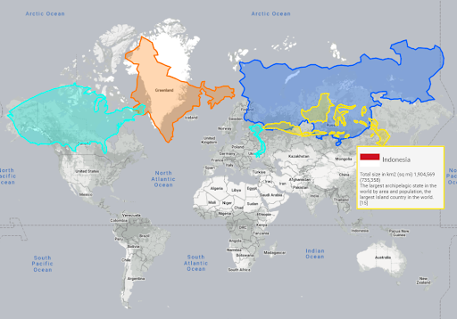

# 6. Страна и страх 

Краткие тезисы по главе

- [Теперь автор пытается анализировать понятие Счастья в контексте территории, на которой пишется Текст — Россия.](#russia_and_happiness)
- [Тема знакомая всем, кто рассуждал об этом на кухне в компании и привычном ключе — Вот у них Жизнь! А у нас что? Эх.](#happiness_in_russia)
- [Неожиданно приводится наблюдение в разности восприятия карт и реальных цифр расстояний и площадей.](#true_size)
- [Поднимается вопрос о балансировке между необходимостью контролировать огромные территории и соответствовать ожиданиям населения.](#big_size_matters)
- [Результаты правления Александра II, Столыпина, Николая II и наблюдения Достоевского из Новой истории приведены в кратком виде.](#russia_in_new_history)
- [И, якобы, Ленин, одно время, видел Страну Советов без правительства на базе BlockChain платформы и Smart контрактов (которых не было).](#lenin_anarchist)
- [Далее идут восторженные отзывы об анализе трансформации общества в результате стремления к Счастью спортсменов в Ленинграде 90х годов.](#newest_history)
- [Все эти примеры, якобы, дают основание автору делать выводы о навыках, особенностях, сильных и слабых сторонах руководителей в России.](#russian_management)
- [Дается оценка состояния современных Государственных Информационных Систем, сделанных для обеспечения потребностей населения.](#russian_it)
- [В завершения первой части Текста с анализом понятия Счастья подключился соавтор и заявил о Страхе — как о распространенной причине Несчастья.](#fear)

## Огромная, ресурсно богатая страна — счастье или проблема? 

И вот если проблемы в своей семье, а тем более в себе, критически обсуждать люди обычно не очень любят, то как управлять страной лучше чем её руководство — большинство знают наверняка :-) А несоответствие реальности и наших ожиданий обычно делают нас несчастными.

Базово стараюсь занимать обратную сторону основному течению беседы по важным темам, пусть даже непопулярную и сомнительную для компании, в которой эта беседа ведётся. Такой подход позволяет уточнять свою позицию и аргументацию. А если со всеми соглашаться, кивать и поддакивать, то начинаешь чувствовать, как тебя засасывает в трясину и тонешь в безысходности — ведь внятных, конструктивных предложений кроме критики обычно не звучит. И вот что мы, россияне, можем сказать про нашу страну прежде всего? На мой взгляд, она очень большая и богатая. И в привычной канве "кухонного разговора за жизнь", богатство это распределяется и управляется как-то очень несправедливо и нерационально.

## Особенности восприятия размеров нашей страны 


Справедливости ради, попробую переметнуться на обратную сторону и попробую опровергнуть свой же тезис. Индонезия воспринималась с детства как группа экваториальных островов, которых и не заметно на карте мира. На которой сверху, как огромная медведица, нависает Россия. И вот когда кто-то упомянул, что пролететь из столицы Индонезии Джакарты на их же остров Папуа занимает больше 5 часов, уточняешь со снисходительной улыбкой — ну это, наверное, какой-то маленький винтовой самолет? НЕТ. Это Boeing 737. И тут я удивился и полез смотреть реальные расстояния. 


Надо сказать, что расстояния у нас колоссальные, но сравнимые с азиатами, например. Безграничные пространства на мировой карте, которую мы с детства хорошо представляем, довольно сильно искажены. Про проекцию Меркатора со школы тоже все должны знать, но забывается ведь, а карта мира всегда перед глазами. [По ссылке](https://www.thetruesize.com/#?borders=1~!MTc3MDkzNTg.MTU1Nzk2NQ*MzYwMDAwMDA\(MA~!CONTIGUOUS_US*MjkzNjQ1OA.MTY1NDcwNTg\(MTc1\)MA~!IN*ODU1ODk0Mw.MTU5ODkzNjE\)Mg~!CN*NDAzNjc1Mw.MTcyMzQ4MTk\)Mw~!VN*NzM2NDMzNA.MTQzNzExNjc\)MA~!ID*Nzc5ODYxMQ.MTY5NzA5Nzk\)MQ) можно увидеть как выглядела бы карта мира если бы США, Индия, Вьетнам, Индонезия или Китай находились на наших широтах. Вьетнам простирается от Санкт-Петербурга до Севастополя, перелететь “ничтожно малые”, на первый взгляд, экваториальные острова Индонезии — приблизительно как добраться из Самары до Владивостока. Не говоря о том, что населения там в 2 раза больше, чем в России. И таких интересных сравнений бесконечно много.

Это просто любопытное наблюдение, которое показывает, как разные формы представлений и доминирующее визуальное восприятие с школьного возраста формирует сознание. Сухие цифры воспринимаются не так ярко, хотя именно они и являются максимально объективными. И цифры, конечно же, подтверждают, что нет у нас конкурентов по площади территорий и богатств.

## Размер имеет значение 

Плодородные обширные земли нашей страны способствовали развитию сельского хозяйства. И до отмены крепостного права в 1861 году более 80% населения было занято в аграрной отрасли и освобождение его от неоплачиваемой обязанности (крепостного права) выработки основного экономического ресурса страны без возможности контроля процесса на отдаленных территориях было большим риском для существования империи в целом. Т.е. Александр II взвешивал варианты — либо освободить крестьян и предотвратить революцию, либо потерять страну во время последующего экономического кризиса. Однако риски масштабных крестьянских волнений перевесили и крепостное право было отменено. Страну “колбасило” пару десятков лет пока не началась новая волна экономического роста. Представьте, что в эмиграцию тогда уезжали русские дворяне, с проклятием в адрес своей родины и монарха за излишне либеральное и слишком человечное отношение к народу :-) Достоевский пишет в своих письмах об этом настрое, царившем среди русской эмиграции того времени. Вот уж маятник…

## Новая история 

Столыпин, как реформатор и управленец, который впервые в истории России при этом не являлся царем, был нацелен на освоение бесконечных просторов Сибири, опираясь на здравую логику и успешный опыт колонизации США. Начав в 1906 году необходимые обширные преобразования для остановки революционных волнений, планировал завершить передачу земли в собственность крестьянам спустя 20 лет при условии мирного существования империи. Его действия, которые, по сути, вводили капитализм в деревнях, были чужды как крестьянам так и политической оппозиции — общественный менталитет не был готов и требовались долгие годы для его коррекции, что Пётр Аркадьевич, конечно же, осознавал. Впрочем, убийство Столыпина в 1911 году и даже бодро начавшаяся после него на патриотической волне в 1914, а потом сильно забуксовавшая, Первая Мировая война не остановили его реформу. А вот февральская революция 1917 года, когда Николай II сложил полномочия, конечно же, полностью поставила на ней крест.

## Ленин — мечтатель-анархист? 

Ленин мечтал о государственном строе, где по сути не будет ни руководства, ни партии, и в этой Стране Советы из разных отраслей будут договариваться между собой самостоятельно и роль государства будет заключаться лишь в контроле исполнения этих договоренностей. Эдакие Smart Contracts между Советами на базе государственной BlockChain платформы. А диктатура пролетариата или последующий откат до НЭПа — были лишь временными переходными шагами, которые надо было, быстро маневрируя и балансируя, пережить. Но даже его гений и фантастическая работоспособность не смогли предотвратить гражданской войны, уничтожения семьи императора, кровавой продразверстки в деревнях, жестокого подавления восстания изначально "своих в доску" моряков Кронштадта в условиях послереволюционной турбулентности. А инсульт и смерть окончательно отбросили надежды на реализацию и этой мечты о справедливом обществе на русской земле.

## Новейшая история 

После планомерного погружения в нюансы новой и новейшей истории, понимания технологических трендов и движущих геополитических факторов спокойно могу говорить, что я не в состоянии объективно рассуждать про руководство страны колоссальной площади, богатств и потенциала — слишком много факторов, которые необходимо учитывать и помнить, которые остаются вне поля зрения граждан. Даже та история, которая проходила перед нашими глазами быстро забывается. После погружения в антологии Парфенова, Зыгаря и других, понравился прагматичный, образный, сбалансированный и разносторонний анализ происходящего в стране, неожиданно, с глаз спортсменов 70-80х, которые забрались на вершину в 90е, и сошли на нет в 2000е — [книга василеостровца Евгения Вышенкова “Именем братвы”](https://www.livelib.ru/review/3634177-imenem-bratvy-proishozhdenie-gangstera-ot-sportsmena-ili-30-let-so-smerti-sssr-evgenij-vyshenkov). Новое поколение уже не в курсе тех событий, среднее уже подзабывает, а ситуация в стране была крайне опасной и последствия её мы, безусловно, до сих пор ощущаем на себе.

## Русская модель управления 

Но стоит признать, что не боги горшки обжигают и руководство обычно формируется из управленцев среднего уровня. Исторически серьезные проблемы в России решались не системно через экономию и оптимизацию, а через антикризисное управление и привлечение ещё больших ресурсов на коротких отрезках планирования. И вот это ресурсное богатство сформировало за несколько поколений у нас сильную экспертизу кризис менеджмента, а не планомерного операционного повышения эффективности в управлении. Лучшие представители таких руководителей могут за неделю построить завод в лесу (что неоднократно происходило в нашей истории), а вот контролировать в цифрах узкие места (бутылочные горлышки) ключевых процессов, улучшать их и постепенно адаптировать из года в год под меняющиеся обстоятельства — не наша сильная черта. В спокойные тучные годы, находясь на управлении, менеджеры нацелены на удержание своей позиции, распоряжаясь ресурсами по своему усмотрению и выдавая минимально достаточный результат. Ситуацию могли бы поправить наработанные управленческие практики, а также железобетонные внутренние принципы и персональная система ценностей, которые формируются поколениями, но революции, перевороты и частые перестройки не способствуют их появлению и укреплению. Хороший экскурс в особенности управления на наших бескрайних территориях можно найти в [книге Александра Прохорова "Русская модель управления"](https://www.livelib.ru/review/3093508-russkaya-model-upravleniya-aleksandr-prohorov).


О навыках и уровне менеджеров крупных компаний и чиновников могу судить, т.к. сталкивался с ними по работе немало, понимаю их критерии в принятии решений и горизонт планирования. Очень хорошо прочувствовал, когда проводил тренинги для менеджмента крупнейших российских компаний металлургии и машиностроения с использованием технологий Microsoft BI в 2012 и продолжаю это наблюдать по сей день на стратегических сессиях для чиновников по Цифровой Трансформации и подготовке конкурса инициативного бюджетирования для городских активистов — [Твой Бюджет 2.0](https://tvoybudget.spb.ru/).

Особенно "бомбило" меня, когда показываешь руководству как можно элегантно с помощью автоматизированного процесса на платформе SharePoint и прикрученной к ней панели в каком-нибудь Excel решить реально важную задачу на крупнейшем промышленном предприятии — технология проверенная, стоит в десятки раз меньше, чем сейчас тратится на её решение, сроки в пределах месяца. А интереса НЕТ! Как так то!? В лучшем случае руководитель мог отвести меня в сторонку и сказать:
- Ну вот куда ты лезешь? Если я внедрю этот подход, мне нечем будет 150 человек занять. А у меня градообразующее предприятие между прочим!

Или:
- У нас на этом процессе уже 10 лет сидит подрядчик, который всех устраивает. Есть более важные задачи, но это не по твоей части.

И понимаю я, что если он "рыпнется" с какой-нибудь подобной "рацухой", то может и сам работы лишиться. Страшно.

У нас достаточно идейных и прекраснодушных людей, но и они в большинстве случаев погружаться в анализ процессов и цифры ключевых показателей для повышения эффективности не сильно стремятся. Когда жареный петух клюнет — мы сможем сделать быстро, только ресурсов сожжём в 10 раз больше. Но не в них ключевая проблема же была до сих пор! :-) Рациональный подход в сознании у нас базово несколько атрофирован, если сравнивать с населением прагматичной Германии, например. И если нет отработанных управленческих практик в среднем звене, то дефицит будет и в верхних. И требуются годы, чтобы кадровый дефицит подготовленных специалистов естественным образом исправился.


## Цифровая зрелость России 

Российские разработчики и архитекторы создают неплохие информационные системы для государственного управления. Уровень цифровизации услуг в России [входит в десятку лучших в мире](https://digital.gov.ru/ru/events/42223/). В течении двух лет занимался экспортом информационных технологий в страны юго-восточной Азии, где встречался с экспортерами из других стран и могу с уверенностью сказать, что разнообразие и развитие российских информационных систем на высоте. Кремль в 2023 году начал поддерживать открытие данных для последующего использование технологий Искусственного Интеллекта в управлении страной, выпуская [соответствующие поручения](http://kremlin.ru/acts/assignments/orders/70418). Планируются к запуску другие масштабные цифровые инициативы, которым нет аналогов в мире. Но при этом жители нашей планеты для поиска информации и общения используют прежде всего Google и Facebook и, по большому счету, только Китай и Россия являются исключениями. Есть "свои" Яндекс и ВКонтакте, без которых страна в принципе не может быть независимой и обладать суверенитетом в наш цифровой век. 

Т.е. с информационными технологиями в стране всё очень неплохо. Но глубокие практики управления на основе цифры у менеджеров среднего звена в крупном и малом бизнесе, а также среди чиновников, по моему субъективному мнению, в широкой массе, по большому счету, пока отсутствуют. Мой жизненный опыт говорит, что ресурсное богатство, частые перевороты и другие социальные эксперименты, которые формируют сознание, совсем не помогают в развитии операционных навыков планомерного повышения эффективности, стабильности, и в конечном итоге — благосостояния населения, которое влияет на ощущения Счастья, в том числе. Такое мнение ни в коем случае не должно звучать как оправдание в бездействии — это всего лишь задача, которую надо планомерно решать и видно, что динамика положительная. Такая наша особенность с недостатком Рацио подхода — не хорошо и не плохо. Это такая вот наша отличительная черта в сравнении с немцами или японцами, территории которых, на порядок (!) меньше средней площади одного (!) нашего федерального округа. А у нас их 8 (!), ВОСЕМЬ, Карл! Конечно же, мы — в основной своей массе оседлые крестьяне, отличаемся от американцев, менталитет которых формировался предками предпринимателями, которые сорвались со своих родных мест осваивать чужие, новые богатые территории. Хорошо отношусь и к американцам, и к немцам, и к вьетнамцам, и к русским. Не навешиваю ярлыков — хороший, плохой, правильный, неправильный. Но знать историю и учитывать особенности присущего нам менталитета в суждениях и практике управления, на мой взгляд — необходимо. В конечном итоге, такой подход даёт понимание, что можно делать самому, на своём месте, на своей земле, в настоящее время, чувствовать прогресс и оставаться сравнительно счастливым :-)

## Страх (Владимир Лобачев) 


Идея этого текста заключается в коллективном его написании. Так создаются программы в концепции Open Source — Открытый код. И мне очень отрадно, что от друга "прилетела" первая текстовая вставка о Страхе, как о причине несчастья.  

Следующий блок текста звучит от лица Владимира Лобачёва. Я же персонально пропустил этот текст через себя и подписываюсь под каждой его строчкой, хотя стиль написания сохранен. 


Раздел «Стереотипы счастья и причины несчастий» захотелось дополнить подразделом «Страх». Страх изучал Зигмунд Фрейд, но я его не читал, так что скатиться в плагиат страха нет :-)

Страхи преследуют людей с детского возраста и имеют совершенно разные оттенки: 
* боязнь спросить что-то у постороннего; 
* страх перед физической расправой; 
* боязнь развода родителей и крушения привычного мира ребенка; 
* наконец, страх перед смертью…

В процессе взросления часть страхов сохраняется, другие модифицируются в зависимости от пола, сексуальности, окружающего социума: 
* боязнь познакомится с девушкой; 
* страх быть не принятым и осмеянным сверстниками; 
* боязнь поражения в соревновательном или учебном процессе…

И, наконец, страхи взрослого человека: 
* перед начальником; 
* перед супругом; 
* перед более преуспевающими знакомыми…
* Нарастающий с приближением конца страх смерти (заметьте, он присутствует только в детстве и старости, но не в юности).

По мере своего взросления человек учится бороться со своими страхами, часть из них ему удается укротить, часть остается в тени его сознания.

Как же наличие страха в подсознании человека влияет на его ощущение страха? Из своего жизненного опыта я не могу сделать вывод, что я трус. Случались критические ситуации, угрожавшие мне лично, или окружающим людям (например сильнейший пожар в офисе), однако выброс нужной дозы адреналина делал сознание живым, а ход мыслей четким и ясным. Отсутствовала паника, удалось организовать эвакуацию персонала и имущества, не было волнения, когда раз за разом возвращался в дымящееся помещение, не смотря на то, что крыша трещала и готова была обрушиться…   

Однако считаю себя человеком, проживающим жизнь рядом со своими внутренними страхами, которые зачастую связаны в современных реалиях с опасением потерять стабильный доход, не справится с ролью главы семьи и отца, тревогами за здоровье и будущее детей…

Постоянно напоминая о себе и подпитываясь у части людей повышенной чувствительностью психики, или банальной вегетососудистой дистонией, страхи отравляют жизнь, мешая человеку ощущать себя счастливым здесь и сейчас. Где бы ты ни был, на отдыхе  жарких странах, в заснеженном лесу с резвящимися детьми, или дома в постели, страх может в любую секунду вынырнуть из глубины тебя и отравить самые радостные моменты, крутясь в голове утомительным волчком.

Одним из «лекарств» против таких проявлений собственной психики стал однажды алкоголь, однако это тема отдельного исследования :-)

Вывод: не победив собственные страхи, причем не победив их здоровыми (не медикаментозными) средствами, человек не сможет достичь состояния Счастья.

И еще один подраздел пришел на ум под названием «Конформизм» (что-то про неготовность сменить работу на занятие мечты, про неготовность отстаивать свои интересы в браке из-за боязни его разрушить, и т.п.). Но об этом в следующий раз.

_Владимир Лобачёв_

Испытывал абсолютно все перечисленные страхи. Согласен с каждым утверждением. Во многих случаях мне лично помогало Следование Призванию с целью больше Жизни, о чем писал выше. Зачастую спасало от этого Страха импульсивное и иррациональное решение в следовании этому неведомому Призванию, как Прыжок Веры — Leap of Faith, который так нравится поклонникам игры Assassin's Creed. И если ещё не лежишь на смертном одре, то может и не поздно последовать этому Призванию. 

Про алкоголь тоже упоминал ранее, но также не стал описывать свои соображения, а попросту сослался на книгу Макаревича — его опыт показался созвучным и занимательным в описании.

В целом, жду когда количество таких вставок будет расти и начнут приходить Change Request непосредственно в GitHub, но радуюсь появлению этого дополнения как началу коллективного творчества!