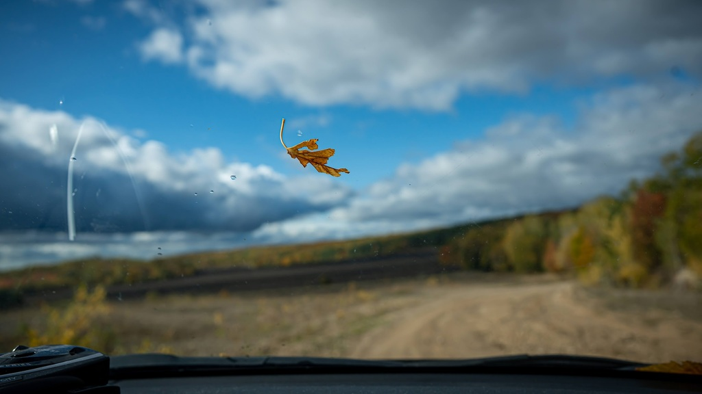

# Счастье как смысл жизни

## Что делать и главное — ради чего? {#cornerstone_of_text}

В информационное поле изредка пробиваются психологи, коучи и другие эксперты со своими тренингами. Каждый зарабатывает по-своему, и такая работа тоже нужна. Однако хочу отстроиться и обозначить основное отличие. Изначально не думал продавать что-либо — книгу, тренинг, продукт или сервис. Интересна критика и диалог в поиске ответа на вопрос «Что делать?». Важно самому разобраться, а не продать что-либо :-)

Учитывая обширность и кажущуюся простоту поднимаемых вопросов, единственно возможным способом пройти через текст вместе будет внимательное продвижение от одного вывода к другому. Как сапёр. Но излишне увлекаться и разжёвывать очевидные понятия тоже ведь нельзя, дабы не потерять интерес и читателя.

Пожалуй, нужно начать совместный путь, явно обозначив общую цель, которая будет принята большинством. Таким краеугольным камнем этого текста стало утверждение, что большинство ищущих ответ на вопрос «Что делать?» людей хотят быть счастливыми и изначально, в глубине души, стремятся к этому состоянию. Смысл жизни может быть в том, чтобы быть счастливым и стремиться к счастью. И такой ответ на самый важный вопрос кажется очень логичным и правильным. Т. е. максимально развернутое название текста может быть «Что мне делать, чтобы быть счастливым? :-)». И в самой первой версии текста утверждение это было аксиомой — ВСЕ хотят быть счастливыми! Но в одном из важных диалогов на эту тему мне обоснованно возразили.

Не все и не всегда так хотели — например, в христианстве изначально звучит идея о стремлении человека к Богу, а не к Счастью. Бог — понятие довольно определённое в рамках одной конфессии, в отличие от иллюзорного образа Счастья.

Или другое крайнее исключение — встречаются особенные люди, которые идут к своим целям, проявляя столько Воли, что понятие Счастья становится их врагом, потому что в их представлении делает их слабее. Но думаю, что таких людей, которые думали об этом и теперь отрицательно отвечают на вопрос о стремлении к Счастью, не так много. И скорее всего, им не требуется ответ на вопрос «Что делать?». Они его знают.

Думаю, что много людей, которые не думают в категориях Счастья. И слово это не отзывается ничем конкретным в голове.

А мне любопытно определиться, что мы вкладываем в понятие Счастья и что мне лично стоит делать, чтобы его в жизни было больше. И этот мыслительный процесс видится важным. Не менее важным, чем ответ на вопрос о смысле жизни.

## Что такое счастье? {#what_is_happiness}

Если подумать над первоначальным значением славянского слова «Счастье», то видится образ сопричастия к чему-то хорошему и большому. Мне образ Счастья видится состоянием единения моего сознания с окружающим миром. Или можно представить владение частью чего-то хорошего и большого. Есть красивые художественные аллегории на этот счёт. Например… На протяжении сотен лет в семьях пекли хлеб, и часть теста для закваски сохранялась изо дня в день и связывала целые поколения. Когда кто-то создавал свою семью, то получал закваску от родителей и был «СЧастью» своих предков далее. Эту историю можно посмотреть и даже прочувствовать на себе в [спектакле «Семейная пекарня»](http://teatrvkusa.ru/pekarnya/).

А если не задумываться над первоначальными смыслами слова, то все мы можем чувствовать и ассоциировать Счастье с ощущением эмоционального взлёта. И несмотря на, казалось бы, очевидный смысл понятия «Счастье», каждый будет вкладывать в этот образ что-то своё, чего ему больше всего хочется — кто-то приобретение нового автомобиля, а кто-то прогулку с возлюбленной по набережной, кто-то велосипед, а кто-то отпуск с детьми, один представит рыбалку с друзьями, другой возможность выспаться в течение нескольких дней и т. д.

Зачастую желаю именинникам на их день рождения персонального Счастья, надеясь, что они сами представят и пожелают себе ровно то, чего им не хватает в этот момент для Счастья. Ведь остальные пожелания являются лишь моими гипотезами и можно промахнуться, пожелав чего-нибудь незначительного или вообще лишнего. Многие подумают в момент такого поздравления, что я Душнила. [И будут правы](index.md#introduction).

Психологами [было замечено](https://www.b17.ru/blog/401335/), что порядка 50% ощущения благополучия или счастья зависит от обстоятельств, на которые мы вообще не сильно влияем. Темперамент, характер и, как следствие, внутреннее ощущение человека зависят от нейромедиаторов, которые, в свою очередь, зависят от генетики и физиологических особенностей работы головного мозга. У кого-то соотношение сбалансировано и «жизнь прекрасна», а другому нужно «выпрыгивать из штанов», чтобы чувствовать себя благополучным.

Говорят, что Счастье — это большой труд. И достаточно посмотреть на «молекулярный мотор» — белок миозина, который доставляет эндорфин до коры головного мозга, чтобы убедиться, насколько непростой путь приходится проделывать этому симпатичному и независимому «человечку» :-)

Всего 10% наших ощущений зависят от внешних обстоятельств, на которые мы обычно влияем и где фокусируемся. Известный актёр оценивал [радость от приобретения великолепного, но доступного ему автомобиля всего в 5 дней](https://www.livelib.ru/quote/47121569-druzya-lyubimye-i-odna-bolshaya-uzhasnaya-vesch-avtobiografiya-mettyu-perri):
> At one point I bought yet another new car, the excitement of which lasted about five days. I moved regularly, too — the thrill of a new house with an even better view lasted a bit longer than the Porsche or the Bentley, but not by much.

А 40 процентов зависит от системы взглядов, которую мы вырабатываем за свою жизнь. Образ Счастья также меняется на протяжении всей жизни. Думаю, что так оно и должно быть. И самая сложная задача — быть преимущественно в позитивном эмоциональном настрое всю жизнь и прийти в старость, в стадию завершения жизни, также в плюсовом значении по градуснику внутреннего ощущения уровня Счастья.

Любой проектный менеджер, строитель, артист, в общем — творец знает о важности чёткого представления желаемого результата своих действий. Важно понимать — в какое своё «будущее» ты направляешься и как оно выглядит? Но при этом мы знаем, что в финале любой жизни всегда наступает Смерть.

## Смерть как неизбежный финал {#funeral_as_result}

Скорее всего, зря я сейчас употребил в тексте это слово, хотя и делаю это намеренно. Множество близких мне людей при рассуждениях на тему смерти меняются в лице, переводят взгляд внутрь, и формат диалога становится совершенно другой. Понятие Смерти ведь имеет ярко негативный окрас и рядом со словом «Счастье» смотрится противоречиво. Можно вместо смерти рассуждать о переходе в другое состояние или слиянии с Вселенной — но я не могу с уверенностью рассуждать об этом. А вот если подменить понятие Смерти более бытовым понятием процесса прощания с человеком, который завершил свой путь — похоронами, то становится чуть проще. Похороны — всего лишь формальность, как [говорил Генри Форд](https://www.livelib.ru/quote/47208530-moya-zhizn-moi-dostizheniya-s-sovremennymi-kommentariyami-genri-ford):
> Человек умирает тогда, когда перестаёт меняться, а похороны — просто формальность.

Наверняка вы можете вспомнить фильмы и книги, где похороны вызывали улыбку. И даже описания похорон, когда оптимистичный формат был заранее спланирован умирающим. Даже на обычных похоронах обычно звучат скорбные речи, которые воодушевляют присутствующих.

На похоронах наставника, учителя и основателя компании, в которой начал свою карьеру, впервые всерьёз осознал важность контроля основных показателей собственного здоровья. Именно благодаря тому моменту, когда сидел в сторонке от основной процессии и внутри была черная пустота, были приняты откладываемые решения, которые повлияли на появление привычек ходить пешком и следить за питанием… Это, безусловно, отразилось на моей жизни и событиях, с ней связанных. Жена подсказала уместную тут цитату Ирвина Ялома: «Физически смерть разрушает человека, но идея смерти спасает его».

Где-то прочитал, что осознание своей смертности есть завершение детства. Тогда получается, что начало планирования собственных похорон и есть начало взрослой осознанной жизни. Представлять саму смерть, пожалуй, не требуется, а вот визуализировать собственные похороны — на мой взгляд, полезное занятие. Разные книги по личностному росту были прочитаны, но [глава «Начинай с конца» от Стивена Кови](https://www.livelib.ru/review/3792199-sem-navykov-vysokoeffektivnyh-lyudej) проняла меня в 27 лет и подтолкнула к глубинным сдвигам и действиям. У Кови были еще принципы — про планирование, проактивность, заточку пилы и что-то ещё (не буду делать вид, что на самом деле обладаю хорошей памятью и помню книгу наизусть), но этот навык основательно запомнился. Конечно же, Стивен Кови, будучи миссионером-мормоном, не изобрёл этот подход. Любой христианин базово живет в Вере, что Смерть — лишь переход к Вечной Жизни. И в этом мире мы лишь готовимся к ней.

## Представьте свои похороны {#funeral_visualization}

Визуализация своих похорон, на мой взгляд, сродни представлению успешно сданного экзамена в престижный ВУЗ. Я визуал, как и большинство людей на планете, и мне проще рассуждать, глядя на картинку, пусть и выдуманную. Представив это событие, можно начинать выписывать следующие факты:

- Возраст и внешний вид себя умершего;
- Количество пришедших на церемонию: заполненная улица или 10 человек у гроба?
- Кто пришел на прощание? Друзья, дети, внуки, сотрудники, соседи?
- Что они говорят о тебе?
- Что напишут на могиле?
- Город и страна, где проходят похороны? И т. д.

Все эти факты, на мой взгляд, важны и зависят от жизненного пути. Очевидно, что каждый такой ориентир даёт представление о необходимых шагах и изменениях. Дотянешь ли ты со своим здоровьем до желаемого возраста или пора принимать меры? Нужно ли переезжать в другой город/страну или лучше остаться с родственниками и друзьями? Которых вероятнее всего не будет на похоронах, если уехать. Нужно ли расширять круг общения или пора уединиться?

Конечно же, от нас зависит не всё или даже лучше сказать — немногое. «Что ты будешь делать в четверг, если умрёшь в среду?», как говорил Пётр Мамонов. Но запуск этих мыслительных процессов о смерти, её осознание и начало действий, потому что завтра ведь может и не наступить — оказались для меня чрезвычайно полезны.

## Моменты счастья в течение всей жизни {#moments_of_happiness}

Но ведь мы хотим быть счастливым человеком не в нарисованном образе конечной цели, а желательно в каждом моменте этого пути и желательно начиная с сегодняшнего дня. В гробу это счастье, как будто бы, неинтересно — хотелось бы пораньше.

В начале двухтысячных, когда мне было 28 лет, я мечтал стать техническим экспертом в лучшей компании мира по разработке программного обеспечения. Дальше я не загадывал и картинка этого сияющего будущего полностью формировала моё представление. И когда в 33 года я стал Developer Evangelist в компании Microsoft, уже не знал чего хотеть и куда двигаться дальше. Этот период запомнился и стал одним из самых сильных жизненных кризисов: ты уже достиг поставленных глобальных целей, но ты растерян и потерял ощущение динамики роста.

Так я осознал, что хорошо бы научиться видеть свои цели максимально далёкими и может быть даже неисполнимыми. Больше своей жизни и дальше своих похорон. Чтобы не упираться в стенки и не вставать на неожиданных развилках, а ощущать движение на всём протяжении жизни.

Не знаю как вы, а я люблю путешествовать и люблю быть за рулём. Желание попасть в новое место изначально запускает процесс планирования поездки. Но весьма вероятно, что ощущения движения по красивой дороге, в конечном итоге, даже важнее. Когда определился с конечной целью, представляешь направление движения, проложил маршрут из промежуточных точек и не ищешь глазами нужные повороты — двигаешься уверенно, наслаждаешься видом дороги и получаешь удовольствие. Сама уверенность в правильности выбранного пути уже вызывает удовольствие, но многообразие чувств намного шире и каждый находит что-то своё.

Вот пример для экстремалов: на прямом отрезке пустой трассы нажал на педаль, тебя вжимает в кресло и ты с удовольствием ощущаешь как машина летит, но всё ещё уверенно слушается каждого движения. Маленькое счастье. Признаюсь, что это не совсем мой формат и привёл я его для друзей :-) Сам обречён на проверки уровня расхода топлива и поэтому неминуемо перейду на крейсерскую скорость.

Или для визуалов: едешь и любуешься видом — необычный цвет закатного неба, уходящая вдаль композиция цветущих полей. И вдруг солнце проглянуло между облаками таким образом, что осветило отдельно стоящий храм, оставив всё остальное в тени. И дыхание замирает от красоты и гармонии. Как-то раз мы ехали в микроавтобусе с друзьями по дорогам Якутии, а рядом простиралось обширное болото, в котором удивительно стройными рядами стояли засохшие низкорослые деревья. На боковом сиденье я устало наблюдал за проплывающим унылым пейзажем… И вдруг дорога так повернула, что закатное солнце оказалось прямо напротив меня и в этот момент окончательно зашло за горизонт, мягко и равномерно окрасив водную поверхность и небо в кроваво алый цвет. «Metallica, 86 год, Master of Puppets», пронеслось у меня в голове и я онемел от восхищения. Спустя 10 секунд, поборов смущение, резко попросил водителя остановиться и, изрядно всех удивив, убежал назад с фотоаппаратом наперевес… Конечно же, картинка безвозвратно ушла, но с тех пор я договорился с собой не стесняться и принимать такие решения мгновенно.

А вот для гедонистов/кинестетиков: каким вкусным бывает простецкий ужин и стакан недорогого вина после десятка часов вождения! И вот взялся резать спелый крупный помидор сорта «Бычье сердце» и чувствуешь как легко отходят ровные кусочки от острейшего лезвия ножа. Высококачественное изделие вызывает исключительно приятные тактильные ощущения и лежит в руке как её продолжение. А крики чаек, звук прибоя и вид моря, до которого наконец-то доехали, формируют вкус соли во рту. Помидор и досаливать не надо.

При этом легко согласится с тем, что человек существо социальное, и подавляющее число таких моментов мы испытываем в компании с кем-то ещё.

И вот ведь хочется таких мгновений побольше. И чтобы мурашки по коже от удовольствия. Но как этого достигать? Быстрый ответ — никак. Если счастье ставить целью, то его, почему-то, перестаёшь испытывать. Множество неглупых людей об этом говорят тысячи лет. [Вот, например](https://www.livelib.ru/quote/47010373-strategicheskaya-psihologiya-globalizatsii-psihologiya-chelovecheskogo-kapitala):

> Сенека предупреждал, что чем больше стремишься к счастью, тем больше от него отдаляешься.

Да и наступают эти моменты, как правило, [неожиданно](https://www.livelib.ru/quote/131476-zanimatelnaya-narkologiya-andrej-makarevich):

> Счастье — внезапно!

## Не можешь измерить — не можешь управлять {#happiness_model}

Если нет возможности стремиться к счастью, то может можно поупражняться в рассуждениях о том, как его измерить? Можно предположить, что уровень эмоционального тона в моменте измеряется. И в качестве шкалы взять навскидку:

- +10 — состояние максимально высокого настроя, состояние Трепета и Благоговения, когда «гусиная кожа» и «бабочки в животе»;
- 0 — может описывать состояние тоски;
- -10 — это состояние полного ужаса, паники, когда, условно, летишь с 25 этажа вниз, а там асфальт.

Также трудно спорить с утверждением, что жизнь состоит из таких моментов, каждый из которых имеет свой эмоциональный уровень. То есть предположим, что есть функция f, которая возвращает уровень эмоционального тона E для момента времени t. E (уровень Счастья в моменте t) = f(t). Можно легко себе представить кривую нашего настроения от 0 до +5 в ситуации, когда от скуки взял в руки книжку, которая неожиданно оказалась очень интересной. Или даже эмоциональные качели от -7 до +8, когда мошенники украли все деньги, ты один в другом городе, но вдруг совершенно случайно встретил школьного друга, у которого есть и квартира и возможность устроить прекрасный ужин с воспоминаниями. Был у меня такой случай в начале 90-х. Так вот. Для людей, не полностью забывших школьный курс математики, определение качества жизни L будет легко представить как интеграл по функции эмоционального тона на протяжении всей жизни.

L = ∫ f(t).

Если интеграл к завершению жизни L больше 0 — жизнь удалась, если меньше — счастливой её назвать можно будет только местами.

Всё это подробно и наглядно описано в работе [«Модель количественной оценки уровня счастья»](https://www.livelib.ru/work/1008288064-model-kolichestvennoj-otsenki-urovnya-schastya-vladimir-andreev) Владимира Андреева. [Автор имеет образование психолога, но также посвятил свою жизнь проектированию информационных систем](p2-100-authors.md#andreevvs). Книга находится в свободном доступе, снабжена примерами, графиками, справочниками с этапами развития личности и сопровождающими их кризисами. В кратком виде содержание приведено во [второй части нашего текста](p2-120-school.md#brief_happiness_model). Этот труд, на мой взгляд, можно брать за основу для понимания принципов и выработки практических подходов в системах с расчетом мотивационных техник, влияющих на счастье человека.

Когда сам перечитываю строки с «интегралами по счастью», не могу сдержать улыбки от зашкаливающего уровня системности в совершенно несистемной области. Чувствую скептическую реакцию собеседников:

— Ага, ну давай Счастье ещё считать! Серьёзно?

¯\\\_(ツ)\_/¯

Действительно, выглядит идея с подсчётом моментов счастья первоначально совершенно абсурдно и даже чувствуешь себя от этого неловко. Пока не привыкаешь к этой мысли :-) А потом непроизвольно запускаются важные мыслительные процессы…

## Жизнь как множество моментов счастья {#moments_of_happiness_book}

Обсуждая идею этого текста с соседом, который [одарил меня шапкой Душнилы](index.md#introduction), узнал о коллекции из 800+ коротких историй, которые собраны в книгу под названием [«Моменты Счастья»](https://www.livelib.ru/review/3575245-momenty-schastya-aleks-dubas). Начинается она с [великолепной притчи про кладбище и счастье](https://www.livelib.ru/quote/47123888-momenty-schastya-aleks-dubas). Более того, про счастье именно в интегральной форме!

> Один странник подошел к деревне, в надежде найти там еду и ночлег. Но прежде он оказался на кладбище. Погосты всегда были на краю селений, и обойти их было невозможно. Он осмотрелся и испугался: на могильных плитах были необычные надписи. Кроме имён, там присутствовали странные даты: «Один год и три дня», или «Семь месяцев», или «Две с половиной недели», «Шесть часов», «Двенадцать минут».  
> Бродяга в ужасе побежал оттуда, но был остановлен окликом какой-то старухи:  
> — Куда же ты спешишь, странник?  
> — Куда угодно, ведь в этой деревне убивают детей.  
> — Ты все неверно понял. Дело в том, что в наших краях считается, что по-настоящему мы живем только тогда, когда мы счастливы. И то, что тебя так напугало, это — не время существования человека. Это — подлинное время его жизни.

Эта притча меня укрепила в мысли, что мы на правильном пути и не стоит мне так переживать. А по прочтении описаний первых историй, я начал испытывать один [эффект узнавания](index.md#emotional_parts) за другим — «Я такое также испытывал!» Меня это так вдохновило, что я решил выписывать свои моменты счастья. И я бы изменил себе, если бы не начал это делать в таблице с колонками в виде Времени, Места, Имени спутника и флажком наличия Фотографии. Многие моменты в книге очень похожи и это заставило меня идти глубже в воспоминания в поисках разных историй.

Этот концентрированный поток счастья и ярких эмоций отлично уравновешивает строгие рассуждения об интегралах, дифференциалах, свойствах и характеристиках. Но благодаря количественному подходу и атрибутивным характеристикам получается наглядно убедиться — насколько счастливая у тебя жизнь. Убедиться прежде всего самому :-) Что бывает особенно полезно в тяжёлые минуты. Можно даже создать персональную галерею фотоснимков счастья. А если сгруппировать записи по людям, которые были с тобой в эти моменты, и делиться этим счастьем с ними тоже? Ведь счастье настоящее, когда им можно поделиться!

## Осознанность, мотивация и геймификация {#awareness_of_happiness}

Никто не призывает вручную измерять своё состояние в моментах хорошего настроения. Хотя такие подходы и являются наиболее действенными.

Например, подсчёт разницы потреблённых в еде и израсходованных в физических активностях калорий результативно приводит к сокращению или набору веса. Безотказно, как законы Ньютона :-)

Понятно, что следовать рутинным процедурам подсчётов не многие готовы: постоянный контроль требует наличия жизненных сил. А когда они на нуле, то результат вероятно будет обратный. Но с рутиной всё больше помогают технологии: шаги, сердцебиение, потраченные калории уже довольно точно и совершенно автоматически считают недорогие электронные браслеты. Вероятно, что под контроль придётся брать отдельно белки, жиры, углеводы, витамины и воду — ведь каждый организм и метаболизм очень специфичен. Но обученные нейронные сети в мобильных приложениях и чат-ботах многократно упрощают учёт, учитывают больше параметров и мотивируют на полезные действия всякими медальками и достижениями (ачивками). То же самое будет и с измерением настроения.

Но если пришло осознание, что каждый шаг и конфетка микроскопически влияют на конечный результат, то полдела сделано! Осознание уровня эмоционального тона в моменте также лишний раз напоминает о счастье и формирует уверенность. А визуализация кривой на графике интегральной модели счастья способствует формированию причинно-следственных связей.

Происходит геймификация жизни: искусственное стимулирование действий человека, которое должно быть направлено на повышение интегрального уровня счастья на протяжении жизни. Хотя в реальности обычно направлено на замаскированное перераспределение денежного капитала благодаря зависимости от игры или услуги.

Уже после публикации текста этой главы [в комментариях мне напомнили](https://t.me/bongiozzo_discussion/945) о [формуле счастья](https://www.cnews.ru/news/top/osnovatel_abbyy_o_marketinge_po_formule), которую сформировал Давид Ян — основатель компании Abbyy. Что лишний раз подчеркивает важность систематизации этого явления. И лучшее представление о предмете получаешь именно в попытках его оценить и измерить.
