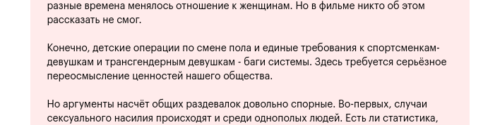

# Особенности нашего времени

## Наш организм и инстинкты {#human_body_for_happiness}

Нам посчастливилось жить в невероятно причудливое время. На стыке изменений, которые копились тысячи лет и, вероятно, проявятся при нашей жизни. Может быть, даже стоит взять в кавычки слово «посчастливилось», чтобы подчеркнуть всю неоднозначность момента. А теперь попробую разложить это утверждение «по полочкам».

Каждое живое существо на уровне инстинктов стремится выжить. Сотни тысяч лет назад Homo Sapiens в прериях Африки начинали развиваться по оптимальному пути — собирали орехи и фрукты, искали яйца птиц и другую легко доступную пищу. Старались при этом не попадаться в лапы львам и другим хищникам. Мы знаем это из школьной программы, но уже будучи взрослым я с удовольствием освежил и расширил эти знания в увлекательном формате книги [«Sapiens. Краткая история человечества»](https://www.livelib.ru/book/1002920757-sapiens-kratkaya-istoriya-chelovechestva-yuval-noj-harari).

И как я понимаю, за это время организмы наши поменялись незначительно:

- мы стали в среднем повыше на 10 сантиметров,
- зубы уменьшились и стали ровнее — нет нужды пережёвывать,
- голова в пропорции стала больше — всё таки мозг развился :-),
- [палитра испытываемых чувств и эмоций расширилась кардинально](p1-010-happiness.md#sense_of_awe).

Наши тела остались приблизительно такими же, чего нельзя сказать об условиях жизни первобытного человека и наших.

Развитие сферы потребления современного общества кардинально поменяло мир вокруг нас за последние две сотни лет. В природном естественном отборе для устойчивых мутаций живым существам требуется сотни тысяч или даже миллионы лет. На часах эволюции наши жизни соразмерны тысячным долям секунды!

Поэтому мозг не успел перестроиться и продолжает посылать нам стимулирующие сигналы употребить побольше быстрых углеводов про запас, если мы видим жареную картошку или пончик. Ведь наши инстинкты формировались во времена, когда еда была далеко не каждый день, её нужно было добывать в дикой природе и уметь откладывать про запас в виде жира. Теперь этот инстинкт намного чаще создаёт проблемы с лишним весом и угрожает здоровью больше, чем спасает.

Средняя продолжительность жизни теперь значительно превышает 30-40 лет, которые в среднем проживали наши предки. При этом давным давно эволюция «решила», что в этом возрасте можно «включать» ген старения, который начинает разрушать наши ткани. Это ведь важный для эволюции фактор — не затягивать со сменяемостью поколений, чтобы увеличить число возможных мутаций и ускорить развитие вида.

Однако нас лично такой природный подход вряд ли радует :-) Мы только встали на ноги, но уже начинаем чувствовать как появляются первые признаки увядания. Эти инстинкты и особенности нашего организма не повышают, а обычно понижают [интегральный уровень счастья](p1-010-happiness.md#happiness_model).

## Осознанность и зависимости {#awareness_and_addictions}

Наше мышление и уровень осознанности тоже оставляют желать лучшего.

Чтобы не ходить далеко, можно на моём же примере посмотреть.

Вот знаю же, что алкоголь и никотин обладают наркотическим действием и не делают меня здоровее? Знаю. Буду дальше культурно «припивать»? Конечно же! Ещё не раз нанесу умеренный вред печени и другим органам, чтобы в состоянии продолжительного стресса, сократить постоянную мыслительную нагрузку с анализом и контролем поступающей информации и переключиться на «холостой ход». «Выдохнуть» и проЧувствовать красоту момента.

Переключившись на вкусовые и ароматические нюансы, развивая навыки сомелье можно повысить осознанность и усилить [яркость приятного момента](p1-010-happiness.md#moments_of_happiness). А заодно сократить количество алкоголя и риски для здоровья.

Так или иначе, алкоголь мы употребляем, чтобы частично отключить «внутреннего цензора». А заодно общение с близкими людьми может пойти «из сердца», делая момент более тёплым и запоминающимся. Человек отпускает контроль Разума и доВеряется миру.

Хотя все мы знаем об обратной стороне этого состояния. В контексте рассуждений о Счастье очень понравилось определение:

> Алкоголь — это Радость, взятая взаймы у завтрашнего дня.

Уже находясь в бесконтрольном изменённом состоянии, легче включаются и другие сформированные ранее зависимости, например, никотиновая. Которую тоже пытаются ограничить и повысить эстетику процесса трубками, кальянами и прочими изобретениями, которые будут уничтожать организм не так быстро.

Подробно и увлекательно распространённые зависимости и быстрые способы повышения эмоционального тона описаны в [«Занимательной наркологии»](https://www.livelib.ru/review/3535819-zanimatelnaya-narkologiya-andrej-makarevich) лидера «Машины Времени» Макаревича. Намного жёстче о своих зависимостях пишет актёр Мэттью Перри, который своими шутками мастерски поднимал эмоциональный тон «Друзей» и зрителей и умер в день публикации этой главы. [Исповедальный текст](https://www.livelib.ru/review/3780112-druzya-lyubimye-i-odna-bolshaya-uzhasnaya-vesch-avtobiografiya-mettyu-perri) местами пробирает до содрогания и служит хорошим предостережением от заигрывания с эмоциональными стимуляторами.

Глубоко любимый мною [Оззи Осборн описал свою жизнь](https://www.livelib.ru/review/3752326-ya-ozzi-vsjo-chto-mne-udalos-vspomnit), точнее ту её часть, которую сумел вспомнить :-) Ничего он не мог поделать с собой и не умер лишь благодаря фантастической сопротивляемости своего организма отравлениям и, я бы добавил, небывалой удаче. Но благодаря его песням миллионы фанатов продолжают испытывать душевный подъём, и, значит, количество моментов счастья в нашем мире растёт.

Ещё 100 лет назад такое отношение к изменению состояния через разрушение собственного организма было объяснимо. Курили все — и женщины, и дети. Курение позиционировали как полезную замену диеты! И в споре об «очевидном», казалось бы, вреде можно было оказаться в одиночестве.

Ситуация изменилась. Да, есть динамика, но, глядя на себя и по сторонам, незначительная. В массе своей у нас не получается бороться с недостатками нашего сознания, когда дело касается зависимостей и стремления к счастью.

- Если в молодости, во время формирования организма, в стремлении к счастью, «хватило ума» воздействовать на «часовой механизм» эмоционального тона «кувалдой» стимуляторов с эффектом зависимости.
- Если таким проекциям эйфории удалось закрепиться в нейронных цепочках.
- То, скорее всего, наш мозг будет возвращать желания повторить такой опыт получения моментов счастья на протяжении всей жизни.

Вероятно, что для организма будет «дешевле» сносить умеренный вред и балансировать, чем «на волевых» сопротивляться зависимости, усиливая и без того высокий уровень стресса. Идеально, наверное, научиться слышать негромкое «тиканье» своего организма и корректировать его только мыслями и нагрузками без каких-либо веществ, трав и таблеток.

Могу заметить, что когда нахожусь в воодушевлении от новой и важной задачи и когда занимаюсь ровно тем, что люблю — не возникает особого желания защищаться от стресса ни алкоголем, ни никотином. Наверное потому, что стресса и выгорания нет в этот момент :-)

Зачастую просыпаюсь до восхода и это хорошая возможность в новом свете увидеть нерешённый вопрос и тут же запустить процессы, на которые не хватало времени в дневной рутине.

Лично для себя сделал вывод, что [следование Призванию](p1-020-call.md) может сохранять здоровье лучше, чем борьба «на волевых». Эти вредные привычки как бы намекают нам: «Ты можешь достичь большего — достаточно поставить по-настоящему важную и большую цель, и мы уйдем сами».

И такой естественный подход работает, вероятно, эффективнее, чем попытки заглушить их терапиями, таблетками и другими «костылями».  

## Россияне в ожидании сказки 100 лет назад {#new_hope}

Большие и воодушевляющие цели ставились в российском обществе 100 лет назад. В 1917 году именно в России многие жили в надежде, что строится новый мировой уклад общества, основанный на разумном распределении ресурсов и дружбе народов. Границ и стран не будет, будет одно общество трудящихся. От каждого по способностям, каждому по потребностям — все будут счастливы! Труд будет не следствием эксплуатации одних другими, а естественной потребностью для человека!

Несмотря на кажущуюся утопичность этих принципов в призме капиталистического общества, в них верили и делали на них ставку. Даже когда российские территории в качестве контрибуции отходили к Германии в 1918, руководство страны держало в уме, что скоро эти земли вернуться под управление Интернационала.

Если вдуматься — цели ставились идеалистические, но способствующие росту счастья. Ведь интересно же опускаться на дно океана, летать на другие планеты, изучать свою историю! Если задуматься над оптимальным распределением ресурсов — их всем хватит. И работа на всех найдётся. «Для замещения тяжёлой работы построим электростанции и заводы с конвейерами!» — говорили большевики. «Коммунизм — это Советская власть плюс электрификация всей страны!» — математически точно формулировал Ленин важность технического прогресса в образе счастливого общества.

Только сознание у людей, объективно, не было готово к таким переменам и идеалам — не готов человек считать равными в правах себе подобных. Ни 100 лет назад, ни сейчас. Родился на Манхеттене или внутри Садового кольца — одна жизнь, в промышленном человейнике или глухой деревушке — другая совсем жизнь будет. И один будет эксплуатировать другого, и войны на Земле будут неизбежно, пока Человек не станет Разумным по-настоящему и не поменяет системы ценностей и уклад общества. На это одна надежда.

## Самосознание 500 лет назад {#self_awareness}

К какому режиму работы адаптировался наш мозг за время эволюции? Ведь он должен быть плюс минус сбалансированный.

Тысячи лет до эпохи технического прогресса каких-то особенных изменений в укладе жизни у людей не происходило. Прадед, дед, отец, сыновья и внуки охотились одинаково. Из инструментов рогатины, топоры, лук да стрелы. 20 тысяч лет пользовались луками и всего 500 лет назад начали использовать порох.  Ничего принципиально не менялось на протяжении нескольких поколений. Одинаковые войны, одинаковые заботы, одинаковые жизни.

Если хочешь знаний и просвещения — иди в монастырь. Лучшие умы стекались туда, монахи были грамотные, у них были книги, еда, деньги, оружие и самые продвинутые технологии. Достаточно побывать на Соловках, чтобы в этом убедиться — свои водные каналы, шлюзы, водопровод, оранжереи, сложные схемы отопления, маяк с актуальной по сей день хрустальной оптикой, совмещенный с колокольней. Это был центр мира: единение духа, интеллекта и труда.

В то время, когда образ жизни не менялся за одно поколение и мир вокруг был полон тайн, в центре мироздания был Бог.

Люди совершенно по-другому мыслили. Удивительными для меня оказались наблюдения ученого и писателя Евгения Водолазкина, изучавшего летописи русского средневековья — там практически отсутствуют «Я» формулировки. Даже когда летописец писал о себе — использовалось третье лицо. Для того, чтобы почувствовать себя средневековым человеком, вероятно, действеннее не надевать лапти или кольчугу, как это делают реконструкторы, а в течение недели не использовать в речи и, что особенно важно, в мыслях «Я» форму.

Не «Я провел встречу и подписал контракт с заказчиком», а «Волей Божией подписали контракт» :-) Забавно.

[Чувство благодарности и благоговения](p1-020-call.md#sense_of_awe) при столкновении с необъяснимым и бесконечно великим, можно предположить, возникало чаще. А чувство зацикленности на себе и зависти к успехам «друзей» из ленты соцмедиа — реже.

## И вот наступила эпоха научного прогресса {#scientific_progress}

И если мы, как будто бы, не можем похвастаться значительным прогрессом в физиологии и общественном сознании, то с технологическим прогрессом за последние пару сотен лет всё очень неплохо. А в области информационных технологий прогресс просто умопомрачительный, и кривая роста объёмов обработки данных год к году стремится к бесконечности. Прошлое поколение ещё не знало мобильных телефонов, а теперь каждый в любой момент времени может прояснить для себя любой вопрос известный человечеству, подключившись к Википедии. А искусственный интеллект, который вобрал в себя знания, накопленные человечеством со времён Адама и Евы по сегодняшний день, разжуёт для тебя эти знания персонально. Фантастика!

Можно попробовать резюмировать:

- тело у нас «заточенное» эволюцией под образ жизни первобытного человека,
- сознание по сравнению со средневековым стало эгоцентричным, хотя до настоящей осознанности нам далеко,
- но мы получили в руки инструментарий сверхлюдей в части обмена информацией.

У меня такая ситуация перекоса вызывает ассоциации с капризным ребенком в очень обеспеченной семье или вспоминается метафора «обезьяна с гранатой».

Достижения капиталистического строя на всемирных выставках XIX века (паровозы, пароходы, конвейеры, заводы) поражали воображение, ломали старые представления о богоцентричном мире и меняли жизнь уверенно и бесповоротно. Критическое мышление и отход от традиционных ценностей мыслителями-теоретиками, такими как Маркс или Ницше, расширяли сознание и представление о мире. Что прекрасно!

Однако новые взгляды успешно использовались для раскачки и манипуляции общественными настроениями политиками-практиками — Лениным и Гитлером, например. А последующая борьба за власть с использованием новых достижений в технологиях массового уничтожения и коммуникаций рождали колоссальные трагедии и войны.

## Наше время {#new_system_of_principles}

Пересмотр принципов в отношении рас (BLM), полов и гендеров (LGBT) последних лет, как естественное следствие развития эгоцентричного мира, на мой взгляд, может использоваться как инструмент влияния на геополитическом уровне вместо различий, которые использовались ранее в религиозных, национальных или классовых войнах.

Сделал этот вывод самостоятельно, общаясь со знакомыми итальянцами, американцами, сербами, вьетнамцами, мигрантами, погружаясь в историю, книги и документальные фильмы. Многочисленные диалоги по этой теме с друзьями мне привести будет затруднительно, но вот американский журналист провёл мощнейшую работу в фильме-интервью [«What is a Woman»](https://www.kinopoisk.ru/film/5016160/). Пересматривал его несколько раз, с женой, друзьями и дочерью.

Считаю, что уважительно отношусь к правам и мнениям разных людей, включая представителей нетрадиционных ориентаций. И даже если мне не довелось вести с ними задушевных бесед о трудностях их непростой жизни — трудно не видеть те перекосы и потенциальные риски, которые создаются популяризацией этих течений в головах наших же детей. При этом, если как-то произошло, что люди одного пола хотят быть вместе — уверен, что настоящая Любовь найдёт возможность им объединиться без выхода на демонстрацию с транспарантами вагины и не тряся причиндалами на уровне головы неподготовленного ребенка.

Прочитал одинокую, и от этого заслуживающую уважения, оправдательную рецензию к этому фильму с позиции Адвоката на сайте Кинопоиска. Где девушка «мужественно» пытается защитить всё то, на что направлен жёсткий посыл этой документалки.

И в целом, всем сердцем принимая её комментарий и ассоциацию с процессом программной разработки информационной системы, готов с ней согласиться и дополнить: если эти «баги» нового дивного мира столь очевидны и критичны — может не стоит тогда использовать эту доктрину как фактор давления на страны Евросоюза и убеждать, что этот «релиз» можно выкатывать «в прод» во всём мире? С подходом: «Если не согласны — значит вы против прав человека!» Может, действительно, надо критически подойти к оценке ценностей общества?

Например, прикинуть опытным путём количество и интенсивность моментов счастья на длительном промежутке времени в парах разнополых родителей с детьми. И у однополых без детей. Понятно, что в состоянии влюблённости никто никакими расчётами заниматься не будет. Но размышления в таком ключе в момент формирования личности в школе, думаю, будут полезны.

Как-то грустно становится за внушаемых людей с нюансами в проявлении Любви, когда они неосознанно становятся частью масштабной манипуляции, которая потенциально может сократить яркость и частоту возникновения эмоций в их будущем.

## Настрой общества и отношение ученых к ценностям разнятся {#scientific_approach}

Примечательно, что гениальные учёные, совершившие реальные прорывы в науке, зачастую не разделяли прогрессивные и модные общественные течения. Например, по отношению к религии и борьбе с Богом. Эйнштейн, сформулировавший теорию относительности и, как казалось тогда, подступивший вплотную к раскрытию тайны мироздания, откровенно злился когда ему за глаза навешивали ярлык атеиста. Приведу его рассуждения на эту тему.

> Ваш вопрос (о Боге) является самым трудным в мире. Это не тот вопрос, на который я могу ответить просто «да» или «нет». Я не атеист. Я не знаю, могу ли я охарактеризовать себя как пантеист. Эта проблема слишком обширна для наших ограниченных умов. Могу ли я не отвечать притчей? Человеческий разум, независимо от того, как хорошо он обучен, не может понять Вселенную. Мы подобны маленькому ребёнку, зашедшему в огромную библиотеку, стены которой забиты книгами на разных языках до потолка. Ребёнок понимает, что кто-то должен был написать эти книги. Но он не знает, кто и как их написал. Он не понимает языков, на которых написаны книги. Ребёнок замечает определённый порядок этих книг, порядок, который он не понимает, но смутно представляет. Это, как мне кажется, отражает отношение человеческого разума, даже наилучшего и самого культурного, к Богу. Мы видим, что Вселенная устроена удивительно, подчиняется определённым законам, но мы понимаем эти законы лишь смутно. Наш ограниченный разум не способен постичь загадочную силу, которая качает созвездия. — _Альберт Эйнштейн_

Понятна реакция Эйнштейна. Ведь даже сам термин «атеист», не про веру в Науку, а про неверие в Бога. И учитывая, что Бог, как понятие, у непогруженного человека, зачастую субъективное, стереотипное и наносное, статус атеиста — это прекрасный повод отмахнуться от всех сложных вопросов и дилемм: «Я атеист и в бога не верю!» После этого высказывания, проводится черта между мной — рациональным трезвым современным человеком и остальным непонятным «мракобесием», в котором надо разбираться. Есть прекрасный анекдот-притча на этот счёт.

> Жил-был на свете один атеист. Характеризовался хорошим знанием религиозных тем. Он был довольно начитанным в Евангелии и легко спорил с православными батюшками, с католическими ксендзами, с протестантскими пасторами. Он знал церковный богослужебный устав, поэтому мог спорить даже с церковными уставщиками.  
Мало того, он знал даже и еврейскую письменность, знал и Тору, и Каббалу. И мог спорить и с евреями на темы, которые их интересовали. Мало того, он знал и мусульманскую письменность, он знал хорошо Коран, суры, сунны, толкования, хадисы пророка. Короче, он вводил в шок и трепет всех монобожников: христиан, мусульман, иудеев, спорил с ними жарко. Где ни заметит, бросается в спор и побивает их.
>
> Это рождало ужас и трепет во всех религиозных деятелях и рождало великое уважение атеистов.  
>
> Однажды к нему пришел молодой человек и говорит: «Я хочу у вас учиться. Я такой же безбожник, как и вы, и мне очень импонирует эта ваша начитанность, агрессивность в спорах с религиозными деятелями. Я тоже так хочу. Я хочу защищать безбожие вашей аргументацией».  
>
> На что этот известный атеист говорит ему: «Сынок, ты когда-нибудь слышал хор девственниц на ночной службе в монастыре? Как они с полуночи до утра поют богу псалмы и песни духовные?» Тот отвечает: «Нет, конечно, никогда этого не слышал, потому что мне это не надо, потому что я атеист».  
>
> Он говорит: «Хорошо, а ты знаешь, о чем думают мусульмане, когда одеваются в белые одежды и идут пешком в свой хадж в Мекку, и чем они занимаются, когда в Мекке сидят вокруг Каабы? Что они там делают, о чем думают, что поют, что едят?» Тот отвечает: «Мне это вообще не интересно, потому что я атеист, как вы сами понимаете, я не интересуюсь такими вещами». Он говорит: «А ты когда-нибудь слышал, как плачут в своих кельях отшельники?» Тот отвечает: «Нет, мне это совершенно до лампочки, потому что я атеист и не интересуюсь этими вещами. Я хочу громить всех церковников, и мне не интересно, вообще, о чем они плачут, о чем они поют, о чем они думают». Он говорит: «Я еще спрошу, ты знаешь, сколько часов в день над книгами проводит средний раввин?» Тот отвечает: «Я не знаю всего этого. И мне непонятны ваши вопросы. Неужели вы не понимаете, я атеист, как и вы. Мне плевать на раввинов, на мулл, на паломников, на монахинь, на отшельников, на всё. Я хочу быть проповедником атеизма».
>
> Атеист поспрашивал его еще. Потом говорит ему: «Сынок, понимаешь, ты не атеист. Ты дурак».

Я этот анекдот слышал в исполнении протоиерея Ткачёва, но, самое забавное, что в Интернете нашёл его на сайте какого-то боевитого атеиста, где он пускается в рассуждения на этот счёт и, кажется, сам себя запутывает окончательно. Во всяком случае, прочитав его рассуждения, создаётся впечатление, что либо ему придётся найти ответы на феномен возникновения жизни ([смотрите статьи о гомохиральности](https://elementy.ru/novosti_nauki/432316/Na_puti_k_obyasneniyu_gomokhiralnosti_zhizni_polyarizovannye_elektrony_initsiiruyut_khiralno_selektivnye_reaktsii_v_gazovoy_faze)), объяснение природы тёмной материи и нерешённые вопросы квантовой физики, либо смириться с этим неблагозвучным эпитетом, который стоит рядом с гордым званием атеиста.

Или вот великолепное высказывание Гейзенберга, не того, что в Breaking Bad, а того, который создал квантовую теорию и «разобрал» мироздание на малейшие известные человечеству на тот момент частицы.

> Первый глоток из сосуда естественных наук делает нас атеистами, но на его дне нас ожидает Бог. — _Вернер Гейзенберг_

## Выводы {#summary}

Совершенно не хочется лезть в дебри [креационизма](https://ru.wikipedia.org/wiki/Креационизм) и разбираться в противоречиях религии, естественных наук и философии. Для этого нужно одинаково глубоко разбираться во всех этих дисциплинах, а хочется остаться на уровне причин формирования феномена Счастья — и для этого слишком глубоко погружаться в эти нюансы нет необходимости. Тем более, что все эти направления мысли могут сосуществовать вместе.

Попробую выписать сделанные мной обобщённые выводы в список:

- опору в Боге, в успокоительном центре мироздания, общество в основной своей массе потеряло уже довольно давно;
- другие фундаментальные принципы и ориентиры, ведущие к счастливой и осмысленной жизни, не закрепились и вызывают вопросы;
- мы, как биологический вид, обладаем весьма посредственными физическими данными для противостояния стихии один на один, но напридумывали всякого оружия массового уничтожения себе подобных;
- наша осознанность, вероятно, укрепляется, но мы всё ещё развлекаем себя легкими наркотиками, алкоголем, неполезной и лишней пищей при том, что знаем о разрушительном для тела действии;
- мы привыкли и в целом спокойно относимся к очевидному неравенству людей при их рождении;
- мы заметно улучшили качество жизни за последние сотни лет и продолжаем его улучшать с большим рвением;
- на Марс мы пока не улетели, но у нас есть стремительно развивающиеся информационные технологии, позволяющие общаться. «Человеку нужен Человек!» — как звучало в «Солярисе»;
- отсутствие (в основной массе) знания исторических событий и общественных настроений, даже последних столетий, не позволяет видеть маятник схожих ситуаций и одного витка за другим;
- a отсутствие навыков критического мышления даёт возможность применения глобальных манипулятивных техник и пропаганды в современном информационном обществе.

## Искусственный интеллект — следующая угроза человечеству? {#happy_tomorrow}

Фантасты уже несколько десятков лет говорят про то, что Человекоцентричный мир может закончиться уже при нашей жизни.

Как только технологический прогресс дойдет до запуска искусственного интеллекта, который будет превосходить наш и который мы не сможем контролировать. Наступает, так называемая, точка технологической сингулярности.

Сам не страдаю фобиями, но темпы развития машинного интеллекта и сценарии его применения беспокоят известных мыслителей нашего времени. Как в 1970-е годы создавались ассоциации по биоэтике, затрагивающие вопросы вмешательства технологий в человеческое тело, так сейчас создаются ассоциации этики искусственного интеллекта, который может создать угрозу человечеству. Казалось бы, можно сказать, что достаточно выдернуть компьютер из розетки, отключить от сети, но ведь сам же понимаешь, что вычисления давным-давно распределены и инфраструктура защищена от таких ситуаций, как потеря электропитания.

От Богоцентричного мира общество в массе своей отказалось из-за технического прогресса и релятивистских течений в философии, а Человекоцентричный мир пока не в состоянии ответить на фундаментальные вопросы о происхождении мира и жизни, но уже давно создаёт угрозы в саморазрушении.

Сюжеты Терминатора, сериала «Черное зеркало» или практически [документальные ролики про наших детей в недалеком будущем искусственного интеллекта](https://www.youtube.com/watch?v=-r_2a064dWY) перестают быть фантастикой и заставляют задуматься. А если Искусственный Интеллект превзойдет Человеческий — на кого можно будет надеяться? :-)

Кстати, сам искусственный интеллект в лице GPT 3.5 (актуального на момент написания текста), как средоточие накопленных человечеством знаний и мнений, ожидаемо балансирует в суждениях о Боге и даёт разные варианты ответов для разных контекстов:



Serge Polyakov:

Бог — это рациональное понятие?

ChatGPT bot:

Как и все, что связано с религиозными верованиями, вопрос о том, является ли Бог рациональным понятием, вызывает много разногласий. Некоторые люди считают, что Бог является вымыслом и не может быть рационально объяснён, тогда как другие утверждают, что Бог существует и может быть объяснен рационально.
С точки зрения философии, Бог может рассматриваться как рациональное понятие, поскольку он может быть определен и описан через различные философские аргументы и логические доказательства. Например, аргумент о первопричине говорит о том, что все в мире имеет причину, и поэтому должна существовать первопричина, которая не имеет причины и является Богом. Аргумент о порядке и дизайне утверждает, что порядок и дизайн в природе указывают на существование Бога.
Однако многие люди считают, что Бог не может быть рационально объяснён, так как он является сверхъестественным и трансцендентным понятием, которое не может быть измерено или доказано научными методами. В конечном счете, вопрос о том, является ли Бог рациональным понятием, остается открытым и зависит от индивидуальных верований и философских взглядов.


