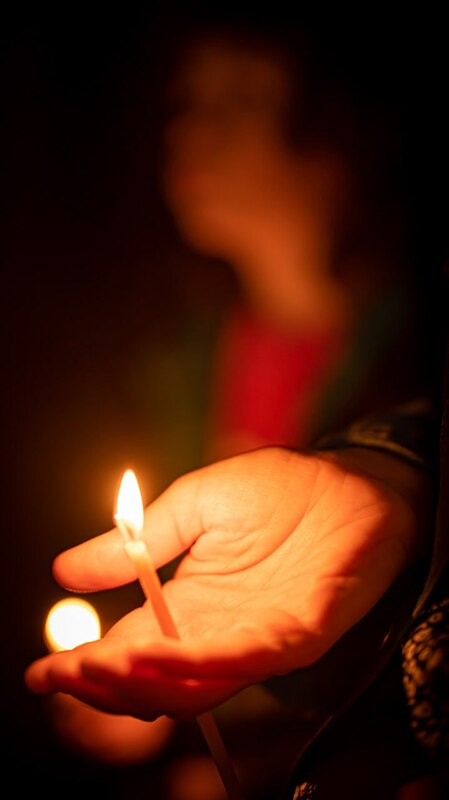
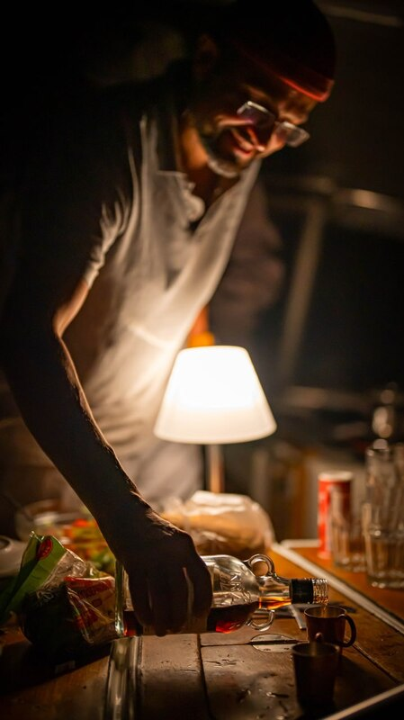

# Персональная система ценностей

## Смятение в головах далеко не первый раз {#again_and_again}

Прошли в 2022 году разговоры разной степени накала эмоций. Разговоры, после которых «кулаки в зубной эмали», как [поёт музыкант Юра Шевчук](https://music.yandex.ru/album/24387038/track/110033569) и непременно вызывает мурашки на коже уже первыми аккордами, создавая [маленький момент Счастья](p1-010-happiness.md#moments_of_happiness). Звучали полярные фразы типа «Можем повторить!», «Мы русские, мы правы — с нами Бог», а также «Пора валить!», «Ничего тут не изменится». Не занимая ни одну из сторон, а точнее, стараясь занимать в каждом диалоге сторону оппонента, с уверенностью могу сказать только одно — похожие ситуации были в истории нашей страны многократно и разговоры эти извечны. И, казалось бы, дни России уже были сочтены — то в войне с Польшей, то с Францией, то с Германией, то из-за внутренней революции, то из-за гражданской войны, но после смутных времен страна в результате становилась крепче и возрождалась. Достаточно почитать переписку известных людей и публикации в газетах времен Крымской войны 170 лет назад и убедиться, что полярные мнения западников и славянофилов невероятно напоминают посты в социальных сетях наших современников. И несмотря на то, что тогда это было с кем-то, когда-то, а сейчас происходит с нами и влияет на нас и наших детей — всё-таки, на мой взгляд, крайне важно выйти из собственного мировосприятия и взглянуть с другой стороны и шире на историю страны и её кризисов, чтобы убедиться, что мы на очередном похожем витке. И как удалось на короткое время гению Достоевского найти баланс между двумя лагерями в любви к гению Пушкина 143 года назад, с чего я издалека начал в [самой первой главе этого текста](index.md#what_to_do), так и мы, возможно, сможем отыскать опору для этого баланса совместно. Мне, как будто бы, получается нащупать.

## Поляризация как маятник: Нужно искать баланс {#polarization}

Как только маятник оппозиционной критики ситуации в стране доходит до крайности, в СМИ прилагается симметричное полярное усилие. Очевидно, что максимально приоритетная задача обеспечения безопасности и стабильной ситуации внутри страны требует немедленных мер — нет возможности рассусоливать и работать на далёкое будущее. Однако, в результате у многих в головах возникает упрощенное, без должного глубокого контекста понимание предшествующих кризису проблем — ответственность за ситуацию обычно полностью возлагается на одну из сторон. Создаётся опасность закрепления в сознании следующих поколений полярных мнений, которые несут в себе риски следующих войн. Очередной размах маятника и уход в поляризацию мнений, которые аукнутся позже. Да, беда случилась, началась она намного раньше чем февраль 2022 года и набирала обороты до этого, но давайте выбираться из этой ситуации и при этом прежде всего смотреть на недоработки нашей стороны, начиная, прежде всего, с себя. Вот прям с себя лично! Что Я ЛИЧНО делал или не делал такого, что приводит к крайностям в суждениях, поляризации, которая, в свою очередь, ведёт к излишней уверенности в своей правоте и дальнейшим трагедиям?

Пишу и понимаю, что эти прекраснодушные метания не имеют быстрых и простых решений в [условиях огромной страны](p1-050-country.md#happiness_in_russia) и разнородного населения. Но чем раньше мы нарисуем наглядную и полную картину текущей ситуации, не с позиции «Кто виноват?», а с анализом причин неудач и постановкой задачи в формате «Что мне делать?», чтобы их не повторить и исправить — тем будет проще. Потребуется отобразить наши слабые стороны и определить общий созидательный вектор развития, чтобы сократить амплитуду маятника волнений. Чтобы не повторять историю снова и снова. И именно у нас, в нашей стране, в наше неспокойное и переломное время, когда стало понятно, что тотальная глобализация и формирование единого плоского, как блин, мира, [описанного Томасом Фридманом](https://ru.wikipedia.org/wiki/Фридман,_Томас) не случатся в ближайшем будущем, можно определять эти новые векторы. Хотя на изменение общественного сознания уходят поколения и вероятно увидеть результаты нам будет не суждено, но стремиться к этой цели, на мой взгляд, необходимо и начинать нужно с себя.

## Бог и Наука {#god_and_science}

Думается, что исторический маятник колоссального сдвига, сформулированного Карлом Марксом и усиленного Лениным материализма: «Бытие определяет Сознание» двигается в обратную сторону и для нашей эпохи более подходит тезис идеализма: «Сознание определяет Бытие». Меня самого поразило наблюдение, что [маятник мировой революции, который запустили в России в начале прошлого века вернулся к нам западным постмодерном в 80е](p1-050-country.md#russia_in_new_history). Но мы опять «впереди планеты всей» — [формируем эпоху метамодерна и ищем утраченные смыслы](index.md#text_is_not_a_book). И, на мой взгляд, эти приоритеты и векторы для себя лично могут звучать как:

- Развитие навыков Критического мышления;
- Уход от Я центричного мира в сторону мира с центром в виде духовного Идеала.

Если совсем упрощенно (что начинает звучать провокационно) — Бог и Наука :-) Или Вера и Знание. Улыбку поставил, потому что явственно слышится критическая волна протеста, прежде всего внутри себя-рационала-логика-айтишника, с которой придётся разбираться. И такая болезненная реакция порой является признаком, что это и есть правильная точка приложения усилий в работе с собой. Как на приёме у доктора, который ищет источник проблемы, ощупывая тело. Постоянное нахождение в привычном потоке изучения новых технологий, рационализации и цифровизации жизни вызывает серьёзное утомление, выгорание, как сейчас говорят. Лет десять назад начал испытывать усталость от всех этих информационных систем и устройств, которыми занимался всю жизнь и дал этому кризису название — «Отойти от АйТи» или «Выйти из АйТи». Комичное звучание этих фраз в разговоре непременно вызывало улыбку :-)

## Дуализм {#dualism}

Нет внутри меня сомнений, а в моем окружении людей, которые были бы против тезиса о необходимости развития интеллекта и навыков мышления. [Даже если этот бесконечный процесс сравнения и анализа может уводить нас от состояния высокого эмоционального тона](p1-040-unhappiness.md#intelligence_quotient). Но вот рядом стоящий тезис об усилении значения Веры и использование понятия Бог вызывает вопросы. У меня лично, совершенно точно, вызывал и продолжает вызывать. Формулировка о цели в духовном идеале вопросов вызывает меньше, но также я понимаю, что Бог и Духовный Идеал понятия равнозначные в определённом контексте. И значит надо убирать из головы все стереотипы и ассоциации вокруг Веры и Бога — весь тот хлам, которым нас заваливает поляризованное информационное общество и самому со всем этим разбираться.

Глава в набросках ждала публикации несколько месяцев, пока в одном из диалогов не получил [ссылку на видео с таким же названием](https://vk.com/video-212448670_456239085). И хотя я не обладаю достаточно глубокими знаниями физики, чтобы пускаться в рассуждения о связи квантовых запутанностей и Бога, но даже я понимаю — что нельзя упрощать постановку вопроса до уровня «Гагарин в космос летал и Бога не видел!» И если природа построена на [корпускулярно-волновом дуализме](https://ru.wikipedia.org/wiki/Корпускулярно-волновой_дуализм), то похожий парадоксальный дуализм может быть и в голове.

Видео заставило задуматься, но не могу сказать, что оно мне всем понравилось. Оскомину вызвал услышанный подтекст о «навязанном» нам постмодерне, где мы-россияне представляемся жертвой. Вероятно это моё субъективное восприятие — [не люблю популярный формат видео и подкастов](index.md#text_is_better_than_podcast), где аудио-визуальный ряд может дополнять (но за зачастую размывает) основной смысл лишней информацией.

Сами мы-русские активно формировали эти новые системы ценностей в [новой](p1-050-country.md#russia_in_new_history) и [новейшей истории](p1-050-country.md#newest_history). И нести ответственность за последствия можем только мы сами.

Основной ценностью от просмотра этого видео стало знание, полученное от настоятеля храмов святых апостолов Петра и Павла и святой мученицы Татьяны при Санкт-Петербургском Государственном Университете, а также кандидата физико-математических наук Кирилла Копейкина. Знание о системе богословия [преподобного Максима Исповедника](https://ru.wikipedia.org/wiki/Максим_Исповедник), в котором предназначение Человека определяется в исследовании нашего материального мира и объединение его в себе с Богом — красивая и дополняющая научный прогресс идея.

[Информационные технологии со своей максимально рациональной Цифрой, в виде потока нулей и единиц, уже стали неотделимой частью всех областей человеческой деятельности](p1-050-country.md#russian_it). Тех, кто всячески пытаются уйти от цифры (отказ от номерных паспортов, баллов ЕГЭ и т.д.) воспринимаю как радикалов, которые, впрочем, мало чем отличаются от другой полярной позиции технократического гика, без царя в голове. И сложить два разнонаправленных подхода в одном сознании трудно. Но реально. Уже во время финализации первой версии этого текста мне прислали ещё одну ссылку на [выступление Сергея Иванова (группа компаний ЭФКО) — «Душа России на распутье»](https://t.me/sergei\_ivanov\_efko/2027). С Сергеем ранее не был знаком, но мысли его звучат на удивлении в унисон с изложенными здесь. Русские генетически более склонны идеализировать ситуацию, а в самом начале приведён хороший пример действенности совмещения разнополярных подходов. Один из серьезных мировых капиталов на высококонкурентном рынке пищевых продуктов был создан на базе антикапиталистической системы ценностей.

## Баланс внутри как залог мира {#dualism_for_peace}

И вот этот дуализм и совмещение внутри себя разнонаправленных подходов приводят не к перекосам вовне — ссорам, разводам, войнам и революциям, а к погружению в физику, химию, историю и развитию собственных моральных качеств. И, как будто бы, вдалеке там маячит Счастье. И это прекрасно!

Интуитивно нравится мне такая картина мира :-) Она целостная и красивая. А как мне [ранее подсказал ChatGPT](p1-030-time.md#happy_tomorrow), ссылаясь на дизайнеров, которых я люблю и уважаю — если в мире есть красота и порядок, то есть и Бог, иначе был бы хаос.

## Принятие и единая система ценностей {#acceptance}

И картина эта красива, как раз, своей кажущейся противоречивостью и парадоксальностью. В ней, сколько не ищу, не вижу серьёзных рисков для личности и общества. Для начала хочу осторожно использовать понятие Бога как Духовного Идеала, не связанного с какой-либо конфессией. Всё таки уровень принятия в обществе за 200 лет изменился и в моем окружении никто не стал бы проламывать голову другому как называть этот центр — Христом, Буддой, Аллахом, Высшей силой или Духовным идеалом. Также как никого не подвергают анафеме и не сжигают за изучение и преподавание эволюционного происхождения видов. Надеюсь, что в нашем информационном и более осознанном обществе настолько далеко маятник уже не качнётся, несмотря ни на какую поляризацию и пропаганду. На мой взгляд нет противоречий в тезисе «Бог создал Человека» и теорией происхождения видов Дарвина — [не надо же всё настолько буквально воспринимать, как не воспринимают это сами учёные](p1-030-time.md#scientific_approach)! И на уровне абстракции верующих в Высшую Силу можно задержаться и зафиксировать единую систему координат, как точку баланса.

## В поисках Бога {#finding_god}

Я живу в России, на реке Волга, в Самаре. Могу с уверенностью сказать, что привязан к своей земле, к её истории и людям. И эта связь доставляет много радости в моей жизни. Сотни лет тут верили в Иисуса Христа и практиковали православие. Мама предложила креститься, когда мне было 20 лет в момент душевных метаний — я не сопротивлялся, но не могу сказать, что проникся особенно. Знал какие-то самые базовые понятия о христианстве благодаря интересу к истории и рассказам старшего брата. Но если говорить о верующих, то к моменту попыток осмысления мне больше всего была знакома культура и система ценностей православных христиан, хотя поездил по миру изрядно и базово космополитичен.

Насколько могу судить, жизненные невзгоды и смутные времена верующие православные переживают спокойнее и достойнее, что ли… Может быть так совпало, а может быть потому, что живут они в системе понятий, где «на всё воля Божья», что жизнь продолжается после физической смерти и может даже думают они о том, что Бог — это мир вокруг, включая их самих, и от этого не чувствуют себя одинокими. Возможно. Это, конечно, всё очень субъективно и, вероятно, надуманно, но могу сказать, что далеко не каждого, кто говорит о Библии и ходит в церковь я считаю верующим. И значит надо разбираться самому.

Попыток поменять традиционные трактовки только в христианстве было множество — достаточно оценить количество конфессий и сект вокруг образа Христа. Есть даже Христианская Наука, распространённая в США, к которой причислял себя [Прокофьев Сергей Сергеевич](https://ru.wikipedia.org/wiki/Прокофьев,_Сергей_Сергеевич). Однако сам я с любопытством и уважением отношусь к истории формирования уклада православных канонов. Интереснее узнать — почему возникла такая трактовка, чем пытаться навязать свою точку зрения. Если самому погружаться в предпосылки и самому принимать парадоксальное совмещение рацио-иррацио, то компромиссное объяснение, верю, найдётся.

Итак, чтобы по канонам стать православным я **должен** принять Символ Веры. И желание моё обрести такую опору и уверенность совершенно искреннее, хотя любое долженствование, как [признавался ранее](p1-040-unhappiness.md#egocentrism), без Любви и принятия, вызывает множество внутренних сомнений. Толкование Символа Веры легко находится поиском и вот, например, [одно из них](https://www.pravmir.ru/simvol-very/). И если сам текст Символа имеет скорее понятный для меня смысл и подтекст, то через подробное толкование, к сожалению, не могу продраться. Слишком много бескомпромиссной уверенности и нечётких причинно следственных связей по множеству неочевидных для меня тезисов. А когда натолкнулся на категорическое расхождение со своей текущей, примирительной позицией дуализма отложил эту трактовку в сторону. Не потому, что считаю её неверной, а потому что, вероятно, не пришло время или написана она не для моего психотипа. [Люди же мыслят по разному](p1-020-call.md#mbti_personalities). И когда не было технологической возможности войти в картину мира каждого и описать смысл правильными для него словами — описывалась единственная, наиболее приемлемая версия. Сейчас нет проблем с многообразием трактовок, вплоть до [Искусственного Интеллекта, который упакует информацию персонально, по заданному формату](p1-030-time.md#happy_tomorrow). С одной стороны это безусловно хорошо, но с другой стороны повышает необходимость вдумываться в потребляемую информацию и пропускать её через «внутреннего цензора».

[Объяснение на другом сайте pravoslavie.ru](https://pravoslavie.ru/104596.html) уже не вызвало таких ментальных блоков. Но опять же — изобилие суждений и отсылок, которые по складу характера потребуется перепроверить и прочувствовать самому, создаёт понимание о колоссальном для этого занятия количестве времени. А это время необходимо для важных и практических проектов, которые предполагают твёрдый фундамент принципов уже сейчас. И это наводит на мысль, что какие-то шаги детального анализа можно отложить — не все толкования и источники одинаково полезны. И поменять свой подход — посмотреть укрупнённо, с другого уровня абстракции.

## Определение христианства в системе ценностей {#rational_definition_of_christ}

И вот вопрос — а что если от Символа Веры с его трактовкой опуститься (или подняться?) на уровень базовых Ценностей? Ценности — совсем не эзотерическое понятие. Для принятия ценности не требуется перепроверки исторических событий в однозначной трактовке. Пожалуй, каждый в состоянии увидеть ответ, «Что такое Хорошо и что такое Плохо?», руководствуясь внутренним моральным законом. Все мы об этом в состоянии размышлять, также как наблюдать звёзды:

> Две вещи наполняют душу всегда новым и всё более сильным удивлением и благоговением, чем чаще и продолжительнее мы размышляем о них, - это звёздное небо надо мной и моральный закон во мне. _[Эммануил Кант](https://www.livelib.ru/quote/361311-kritika-prakticheskogo-razuma-kant-i)_

Можно посмотреть на ценности верующего, на примере православного, глазами человека, который вырос в бум развития информационных технологий и популяризации психологии. Смогу ли я себя, критически настроенного, убедить с этой точки зрения в правильности выбранного вектора с Верой в Высшую силу?

## Благородное любопытство {#noble_curiosity}

[Вот такое описание христианских ценностей](https://www.pravoslavie.ru/7007.html) с использованием понятных мне отсылок к истории последних столетий (а не ветхих тысячелетий), к трудам философов и к высказыванию мыслителя-математика, мне «зашли» очень хорошо. Упомянуты концепции и труды, о которых я уже достаточно знал и использовал в первой части текста ­— релятивизм, нигилизм, философия Ницше и Карла Маркса, которые развивались в [разумный эгоизм](index.md#what_to_do), [объективизм](p1-040-unhappiness.md#egocentrism_is_not_happiness) и даже [сатанизм](p1-040-unhappiness.md#intelligence_quotient). Последствия применения гибких, относительных систем ценностей, которые [фиксируются политиками в нужном им положении](p1-030-time.md#new_system_of_principles), как опора для экспансии своих взглядов — действительно, весьма печальны и продолжают нести риски в будущем. И, действительно, критическое мышление в отношении духовного идеала и устоев (или как принято сейчас с усмешкой говорить — скреп) лучше бы уметь ограничивать самому внутри себя, чтобы уроки истории не пропадали зря.

Вероятно, что это Критическое мышление лучше привыкнуть называть Благородным Любопытством. При этом прилагательное Благородное — обязательно в использовании и не может подвергаться критике :-) Благородство предполагает недопущение компромиссов с совестью, внутренним моральным законом, в том числе и к тем, кто полагается лишь на свою Веру или следует традициям без осознания их глубинного смысла.

## Любовь как вектор приложения усилий {#love_as_labor}

В размышлении о преимуществах Благородного Любопытства перед Критическим Мышлением неминуемо возникает понятие Любовь, как основной вектор приложения усилий в системе ценностей христианина. Понятие Любовь характеризуется самой широкой палитрой ассоциаций и образов, также как и Счастье. Раскрытию этого понятия посвящены множество книг. Не хочется быть слишком банальным и повторяться, но за последнее время откопал определение Любви физиком-математиком, которое особенно отозвалось. В христианской системе ценностей Любовь к ближнему — основополагающее понятие и в точных науках такое понятие называется Радикалом или Корнем. Любовь как корень и отправная точка всех действий и усилий человека. Великим мыслителям как Сахаров, например, достаточно вместо пространных рассуждений написать краткую красивую формулу и всё становится понятно:

> Любовь = √ Истина. _Андрей Дмитриевич Сахаров_

Любовь — это не ванильное чувство из романтических фильмов и тем более не иррациональное чувство влюблённости, граничащее с инстинктом размножения. Любовь — ежедневный труд. Любовь в отношениях между людьми может и по шее дать в исключительных случаях. Например, когда отец видит, что сын делает несусветную дичь и уже не может остановится, если его не остановить немедля, случится беда много страшнее, чем условная затрещина.

За всю свою 20+ летнюю бытность отцом помню два случая. Один раз дал подзатыльник дочери, другой раз чуть сильнее ткнул сына в плечо, чем предполагал. И совершенно точно могу сказать, что можно было обойтись без этого физического воздействия — эта реакция была импульсивна и произошла в уже взвинченном моём состоянии, в состоянии серьёзной усталости и [нехватки жизненных сил](p1-040-unhappiness.md#battery_aziz). Помню эти моменты по сей день, даже благодарен им, т.к., вероятно, они стали предостережением для меня на протяжении оставшейся жизни. До сих пор переживаю о них и надеюсь, что они не повлияют на наши отношения.

Вообще, мне близка трактовка понятия Любви как действия, а не чувства. Хорошие, всё таки, жвачки «Love is …», где разные поступки приводятся как пример любви :-) Начинаешь сам что-то делать и чувства проявляются следом. Действия сделанные по Любви [не формируют ожиданий Долженствования](p1-040-unhappiness.md#egocentrism) и не имеют обратного негативного эффекта, как любые поступки направленные на перераспределение денег или власти. Когда ты становишься богаче относительно окружения, окружение становится беднее. И только в действиях по Любви нет проигравших.

Есть граничное понятие «причинение добра» — любоначалие, которое может начать замещать любовь. Но это уже про перекос в сторону гордыни и там ни благородства, ни любопытства уже нет.

## Человек как образ Бога {#human_as_god}

В концепции христианства человек изначально прекрасен и подобен Богу, создан по его образу — то есть изначально безгрешен. Если на себя взглянуть со стороны глазами христианина, то мы увидим прекрасный образ. Опять же, в этой концепции всё, что нам в себе не нравится и является нашими пороками и слабостями — это внешние силы, которые раньше называли бесами. А с ними можно работать, как с тараканами и крысами — противостоять им в меру сил и возможностей, наводить порядок и чистоту. Идеал, в виде Христа, бесконечно высок, и всегда найдётся чем заняться в самосовершенствовании.

Сейчас в психологии этот древний взгляд на себя-прекрасного называется растождествлением и по праву считается эффективным инструментом повышения психического здоровья. А ощущение причастности себя к прекрасному, божественному миру, [чувство трепета и благоговения](p1-020-call.md#sense_of_awe), безусловно делает человека более счастливым.

## Цели больше жизни {#larger_than_life}

Смысл жизни в системе христианских ценностей — спасение в этой жизни, чтобы не попасть в ад после неё. Сейчас, наверное, уже не так эффективно пугать современных, сравнительно благополучных (при этом зачастую несчастливых), получивших светское образование людей чертями со сковородками — смысл-то в другом. Можно не бояться смерти. Можно лишь бояться не спастись от ада, а точнее — можно бояться остановиться в движении к идеалу, по образу которого мы были созданы.

Остановиться в работе над собой при жизни, с точки зрения христианских ценностей, значит умереть ещё до своей смерти, а «похороны — лишь формальность», как говорил [Генри Форд](https://ru.wikipedia.org/wiki/Форд,_Генри), который не считал себя христианином, но имел собственную систему ценностей, в которой была вера в реинкарнацию — жизнь после смерти.

А ведь цели больше жизни и необходимость постоянного обучения и развития — это базовые отправные точки в современных популярных практиках личностного роста. Люди, которые поставили себе созидательную Цель, заведомо невыполнимую при своей жизни, но неустанно идущие к ней на протяжении всей жизни — очень напоминают православных в стремлении уподобиться Христу.

## Успешные продавцы схожих подходов {#successful_salesmen}

[Стивен Кови со своими навыками](https://www.livelib.ru/review/3792199-sem-navykov-vysokoeffektivnyh-lyudej) или другой американский писатель-коуч Дэн Миллман, создавший [учение о пути Мирного Воина](https://www.kinopoisk.ru/film/87161/), в котором сформулировано три принципа, эксплуатируют схожие ценности и модели. Они исключают ожидание исполнение Долга в свою сторону, что предполагает Любовь. Они также снимают корону с Я центричного восприятия мира:

- _Парадокс_ — смысл жизни, это как и Бог — бесконечная тайна, посели этот парадокс внутри себя;
- _Перемены_ — живи сейчас, научись видеть красоту мира в нюансах и мгновениях, будь благодарен каждому моменту, ведь всё постоянно меняется;
- _Юмор_ — будь самоироничен и не отращивай рога Я-гордыни.

Похоже, что нового фундамента и опорных истин при формировании надёжных систем ценностей придумать трудно и когда старые названия выходят из моды — их заменяют новыми трактовками, придумывают яркую упаковку, и даже выгодно перепродают миллионами экземпляров :-)

И на этих рассуждениях я, пожалуй, могу остановиться и не копать глубже — мне лично оказалось достаточно этой базы системы принципов и ценностей, чтобы на них опереться, чувствовать себя в этой системе координат уверенно и начинать строить серьёзные решения на вполне устойчивом, проверенном мною и временем фундаменте.

## Много рассуждений, а что на практике? {#practicing_meditation}

Поиск этой системы ценностей тоже можно назвать теоретизацией, а в этой части текста заявлялась практическая работа. И практика по развитию в себе духовного идеала в христианской системе ценностей начинается с работы над собой, с молитвы. Хотя, пожалуй, опять стоит начать с момента чуть пораньше.

Продолжительная командировка в Ханой. Снял маленькую комнатушку в уютном мини-отеле французского колониального стиля на берегу древнего озера Тэй. Билеты в Ханой и обратно были куплены заранее, но обсуждение контракта заняло меньше времени, чем предполагалось — появилось свободное время. Неделей ранее друг упомянул про хорошую книжку «Медитация и осознанность. 10 минут в день, которые приведут ваши мысли в порядок». Задача приведения в порядок всего подряд, а тем более мыслей, мне очень близка и понятна, а тут практическое руководство по медитации, и грех не воспользоваться открывшейся возможностью. Тем более, что окружение древних пагод и исторического озера всячески способствовало практике медитации. Книжку прочитал, она небольшая, и начал тренироваться. В общем-то, как описывалось состояние — так всё и получалось. Отключал ощущения во всех частях тела, освобождал сознание. Ну да — настрой становился ровнее. Создавшееся ощущение простора и взгляд на себя со стороны — всё это как-то меня особо не вдохновляло. Что дальше? Допустим, найду я эти 10 минут в день — но буду ли всякий раз садится в позу лотоса и начинать медитацию, когда мысли и эмоции пускаются в пляс? Нет! Делать это только ради того, чтобы успокоить свой темперамент? Ну может быть, но вернувшись в Россию, где нет чарующих звуков гонга, нет пагод и озера, а вместо этого — перелёты постоянные, Самара с пляжами и песком в трусах, Питер, Москва, встречи, переговоры, десятки инициатив под контролем, дети, друзья и близкие — уже и обстановки уместной для медитаций не стало. Что мне делать дальше?

## Отче наш {#our_father}

Когда возникает возможность зайти к старшему брату в гости — делаю это с удовольствием. Сидим и разговариваем с ним про разные житейские темы. Он любит говорить, готовить (при этом стараясь придерживаться рецептуры нашей мамы), а я люблю у него просто сидеть, молчать, отдыхать и есть :-) И также как у меня с женой, с ним у нас [очень разные характеры и психотип](p1-020-call.md#mbti_personalities). Практически противоположные. Он давно воцерковлен и изначально был экстравертом, а я постоянно сомневающийся и ищущий интроверт, он полагается на свою Веру и использует аргумент типа «Так в библии написано», а я стараюсь занять обратную сторону и лезу под кожу с разными контраргументами и вопросами. Ну и, конечно же, перед едой он молится — Отче Наш. Ну и я тоже вставал рядом, изначально, чтобы не нарушать обычаев дома. Но в какой-то момент времени, особенно когда внешние обстоятельства раскатывали меня катком, появилось желание перенести мой опыт с медитацией на молитву. В отличие от медитации в молитве каждая строка имеет смысл и значение. Когда каждую строчку «Отче наш» искренне стараешься прочувствовать и всем сердцем принять — в голове возникают образы. Знаю, что это не всегда приветствуется, но мне не смогли донести смысл этого ограничения явно, поэтому я продолжил визуализировать смыслы. Попробую их описать, но не претендую на глубину трактовки. Описываю лишь собственные ассоциации.

> Отче наш, Иже еси на небесе́х!  
> Да святится имя Твое, да прии́дет Царствие Твое,  
> Да будет воля Твоя, яко на небеси́ и на земли́.

Смысл первых трех строк в целом понятен — это как вступление, где я обозначаю свою причастность к Богу, православию и системе ценностей, но визуальных образов скорее нет — как в медитации представляется чистое голубое небо и, возможно, [нерукотворный лик Христа](https://ru.wikipedia.org/wiki/Спас_Нерукотворный). Не более того.

> Хлеб наш насущный да́ждь нам дне́сь;

Договорился с собой читать молитву осознанно перед каждым приемом пищи. Когда смотришь на стол уже можно чувствовать благодарность. Еда могла бы быть не такой вкусной, не говоря о том, что в истории нашей страны за последние 100 лет случалось, что её не было вовсе. Впрочем даже без вкусного обеда, всегда есть за что быть благодарным и эта строка имеет более широкий смысл, чем просьба о пище. Очень часто не хватает жизненных сил и [батарейка на нуле](p1-040-unhappiness.md#battery_aziz), когда ты ЗАДОЛБАЛСЯ или просто плохо себя чувствуешь. На этой строчке даже порой зажмуриваешься сильнее — настолько хочется попросить этой дополнительной энергии, чтобы двигаться дальше, в нужном созидательном направлении.

> и оста́ви нам до́лги наши, якоже и мы оставляем должнико́м нашим;

В этот момент перебираю в памяти всех своих близких и знакомых, с которыми приходилось сталкиваться за последнее время и отбираю тех, с кем испытывал малейшие негативные эмоции. Выбираю самую запомнившуюся кандидатуру, включаю рубильник Любви, мысленно обнимаю и прощаю. Искренне и бесповоротно. Надо. Учитывая, что поводов для споров с женой больше чем с кем-либо — обнимаемся мы довольно часто :-)

> и не введи нас во искушение, но изба́ви нас от лукаваго.

А вот тут, как раз, включается подход с растождествлением. Когда ты смотришь на себя недавнего со стороны — дымящим каким-нибудь видом табака, с лишним бокалом вина, хвалящимся чем-то — в общем, видишь себя тем, кто тебе не очень нравится. И это ведь не ты плохой, ты же создан по образу и подобию Бога. Но есть множество соблазнов вокруг — они разные, действуют изощрённо, к каждому находят свою лазейку. И хотя слово «бесы» у меня одно время вызывало смешливую ассоциацию, то вот образ лукавого, в исполнении потрясающего Аль Пачино в [«Адвокате Дьявола»](https://www.kinopoisk.ru/film/3797/) вполне себе заслуживает очень серьезной и искренней просьбы о помощи… Помните «Тщеславие — мой любимый из грехов!»? Пол ночи не спал после первого просмотра, а был уже далеко не мальчик.

> Яко Твое есть Царство и сила, и слава, Отца, и Сына, и Святаго Духа, ныне и присно, и во веки веков. Аминь.

## НЛП и осознанная молитва {#nlp_and_pray}

Лет 20 назад увлекался и читал о НЛП — нейролингвистическое программирование. Совершенно очевидно, что не мне одному пришла ассоциация «якорения» из НЛП с молитвой. Даже после того как написал эти строки, набрал в поиске и нашёл публикацию о разборе «Отче наш» с точки зрения психотерапии. Признаюсь, что не разделяю такой утилитарный подход. Отношусь к молитве как к очень важному процессу, где эти подходы лишь помогают начать выныривать из рутины дня, возвращать гармонию в мысли и настраиваться на внутренний разговор. Если вдруг чувствую, что слова звучат зазубренно, поверхностно, образы размываются — останавливаюсь и начинаю с начала.

Не стоит и говорить, что молитва работает — настрой в целом улучшается когда искренне благодаришь за всё хорошее, что тебя окружает. Когда по 3 раза в день напоминаешь себе про разряженную батарейку и другой темперамент у человека, с которым поругался — становится легче. Или в которой раз искренне попросил помощи удержать тебя от какой-нибудь пагубной зависимости… Но спустя несколько часов, когда ты опять в стрессе и близок к провалу, вспоминаешь о своих просьбах, бросаешь взгляд внутрь и понимаешь, что зависимость ослабла и есть силы переключиться на прогулку или просто прослушивание музыки. Подход сработал! Правда обычно просыпается какой-нибудь другой бесёнок, фокус теряется и приходиться начинать заново :-)

Очень неожиданно было прочитать [у Мэттью Перри про его мольбу о получении роли в сериале «Друзья»](https://www.livelib.ru/quote/46683988-druzya-lyubimye-i-odna-bolshaya-uzhasnaya-vesch-avtobiografiya-mettyu-perri):

> — Боже, ты можешь делать со мной всё, что захочешь, только, пожалуйста, — сделай меня знаменитым.

Молитва была услышана, он стал знаменитым и последствия делали с ним несусветные вещи. Но удивительно было от шутника из «Друзей» слышать [столько мыслей о Боге](https://www.livelib.ru/quote/46635772-druzya-lyubimye-i-odna-bolshaya-uzhasnaya-vesch-avtobiografiya-mettyu-perri):

> Бог везде, вам просто нужно прочистить свой канал связи, иначе вы Его не заметите.

## Определяя приоритеты {#refining_priorities}

Работаю только с собой, никого не убеждаю, даже детей. Ведь особенно приятно, когда сынище подходит и встает рядом сам. Если я в общественном месте, где мой уход на этот важный разговор вызовет ненужные вопросы, я предпочту закрыть лицо руками ненадолго и не привлекать внимание.

Никуда не тороплюсь — долго читал только «Отче наш» перед едой и Иисусову молитву на любую ситуацию. Потом добавилась мега полезная молитва [Ефрема Сирина](https://ru.wikipedia.org/wiki/Ефрем_Сирин). Порой возникает потребность прочитать молитву Оптинских старцев, тем более мне из окна виден храм подворья [Оптиной пустыни](https://ru.wikipedia.org/wiki/Оптина_пустынь). Других молитв пока не ищу — пока не вижу потребности и смысла. Мне нравится подход «лучше меньше, да лучше». Как только глубина и осознанность ушла из молитвы или опять начал потреблять калории без молитвы вовсе, значит дело плохо — меня опять затащило в пучину неотложных срочных, и не факт, что важных дел. Значит я перестал отслеживать ориентиры, у меня в голове опять превалирует один полюс и меня может выбросить на мель или разбить о скалы.

Когда начинаешь несколько раз в день всерьез вкладывать глубокие смыслы в слова и отправлять их наверх, неминуемо начинается переосмысление других вопросов, которые требуют определенности.

## Семейные ценности и система координат {#family_priorities}

Решил это я сходить на персональный мастер-класс по фотографии и меня попросили предоставить краткое резюме для знакомства. Понятно ведь, что это не то же самое, что написать резюме для работы, где ты свои профессиональные достижения и места трудоустройства перечисляешь. Руководствуясь правилом «Краткость — сестра таланта» и думая про моё увлечение и профессию, получилось совсем кратко — «Фотограф и Предприниматель». Хотя на первое место, пожалуй, стоило бы поставить истинное Призвание, ведь предпринимателем я когда-то стал по необходимости — если бы не надо было искать деньги в конце девяностых, чтобы продолжать заниматься любимым занятием — разработкой своих информационных систем — так и остался бы программистом/архитектором. Значит —  «Программист, Предприниматель, Фотограф». Но ведь моя семейная жизнь и дети очень важны для меня. Значит — «Отец, Муж, Программист, Предприниматель, Фотограф». Но раз уж я занялся перестановками, надо до конца с приоритетами разобраться — что важнее? Если в порядке и в пропорции траты времени, то кроме вот этого Предпринимателя с очень широкой зоной ответственности ничего и не останется. И если для меня успешно работает система ценностей православного, тогда полезно было бы посмотреть как роли расположены в приоритетах этой парадигмы. Перечитал несколько статей и не «заходили» они мне — возникали ассоциации со [средневековым «Домостроем»](https://ru.wikipedia.org/wiki/Домострой), а это не мой формат. А вот [такое определение системы ценностей в семье](https://pravoslavie.ru/96881.html) мне очень понравилось. Написано женщиной и поэтому, с моих глаз, выглядит куда более сбалансированным чем всё, что написали мужчины. А уж использование понятия «система ценностей» попали в самое сердце :-)

И стало понятно, что главный в семье ни я, ни жена, но получается, что для меня первая роль в моём списке, всё таки, именно Муж, а потом уже всё остальное. Строго говоря, первым пунктом может быть Православный. Но во-первых, для меня это внутренне очень высокий статус, который требует недостижимого пока для меня уровня Веры и я лишь неспешно иду в этом направлении, поставив Бога над собой. Даже слышал историю, что крестили раньше по заслугам ближе к концу жизни, а не в её начале. А во-вторых, мне видится критически важным использование понятия «системы ценностей» — оно исключает ярлыки и стереотипы, которые люди придумывают для общеупотребительных понятий типа Христианин. И даёт возможность вести разговор с представителями разных конфессий. Надеюсь, что абстрактное понятие «система ценностей» стимулирует благородное любопытство — а про какие ещё ценности речь? Поэтому получилось такое описание, которое соответствует моему самоощущению и давно прописано в профиле Телеграм и ВКонтакте — «Муж, Отец, Программист, Предприниматель, Фотограф с ценностями Православного».

В моём случае получается, что достаточно было всерьёз расставить приоритеты и начать в них жить, осознанно возвращаясь к внутреннему диалогу и отслеживанию своих приоритетов по несколько раз в день, чтобы спустя несколько месяцев мир начал зримо меняться. При этом ничуть не зарекаюсь и понимаю, что всё может развалиться и поменяться, но так или иначе — отношения с миром меняются.

## Важные книги о Любви {#books_about_love}

Часто не могу оставаться спокойным, когда вижу у близких людей привычки, которые в будущем могут обернуться серьёзными риски. Убедить в необходимости перемен удаётся не всегда. Понимал и до этого, что моя личная задача не показать кто в семье главный, а продолжать любить, как бы не складывалась ситуация. И чаще всего эта любовь означает не прожать свою идею, а искать другие способы донести свою мысль. Выбрать правильный язык этой любви, который будет понятен другому. [Пока батарейки хватает](p1-040-unhappiness.md#battery_aziz). И если она разряжена в ноль — отойти, выдохнуть, подзарядиться, продолжить искать и ждать подходящего момента. Сэкономить батарейку и взглянуть на ситуацию со стороны любопытствующего рационала помогают книжки — [«Искусство Любить»](https://www.livelib.ru/review/2985526-iskusstvo-lyubit-erih-fromm) и [«Пять языков Любви»](https://www.livelib.ru/review/3720607-pyat-yazykov-lyubvi-geri-chepmen).

Но это уже техника, а начинать, как будто бы, лучше с того, что определить главенствующее место для Любви внутри себя. [Не повторять путь отца Сергия](https://www.livelib.ru/review/3718900-otets-sergij-lev-tolstoj), который, как мне кажется, принёс Любовь в жертву, но ждал просветления. Проассоциировался в этом контексте Иван из [фильма «Фрау»](https://www.kinopoisk.ru/film/4739527/). А лично я из годичного опыта молитвы и установок по приоритетам, которые дают результат, убедился, что Сознание определяет бытие, а в начале перемен стоит Слово.

## А при чём тут счастье и его количественная модель? {#stop_it}

Собирался в этой главе описывать доказательную базу прямой связи погружения в описанные выше практики и повышение интегрального уровня тона. А значит — проживание более счастливой жизни. Про то, что имея от рождения сравнительно деятельную натуру, пытливый и рациональный ум, можно блуждать в нашем информированном обществе бесконечно и не видеть счастья и ответов на реально важные вопросы, в то время когда они могут быть на поверхности.

Но нельзя же быть настолько занудной душнилой! Поэтому, пожалуй, просто «украду» понравившуюся цитату, которая принадлежит Станиславу Ежи Лецу:

> В жизни всё не так, как на самом деле…

Есть ещё один момент — когда пытаешься разложить по полочкам и разобрать на составные части сложные иррациональные понятия, такие как Любовь или Счастье, создаётся впечатление, что чудо пропало. Как в анекдоте с китайскими ёлочными игрушками — такие же красивые, а радости уже не приносят. Также неоднократно замечено, что разговоры о моделях Счастья в основном вызывают неловкость и зевоту, несмотря на всю их важность. Мне кажется большинству очевидно, что Счастье зависит от мириады нюансов — всё не проанализируешь. И, возможно, инстинкты просто вырубают зевотой «предохранители» мозга, чтобы тот не перегрелся. Поэтому стараюсь не «душнить» лишнего и останавливаться в своём занудстве с близкими и друзьями, радуясь моментам встречи.

Однако следование внутренним принципам и открытое отношение к окружающим, зачастую «на волевых», на последних остатках жизненных сил, сохраняют отношения, которые впоследствии возвращаются сотнями моментов счастья :-)
