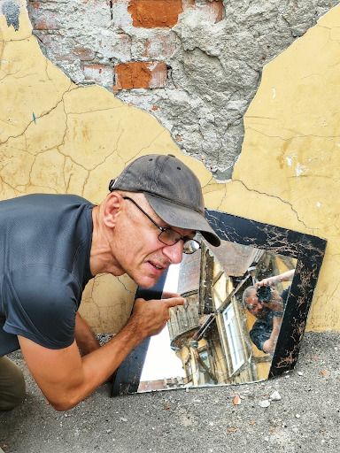
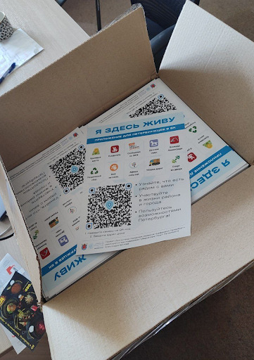
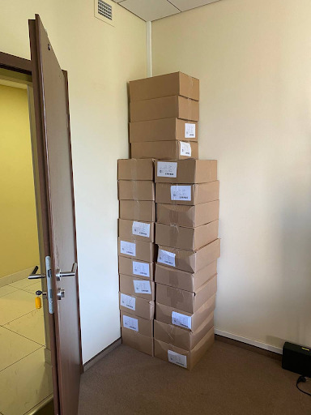

# Я Здесь Живу {#i_live_here}

{#top}



- [Я Здесь Живу](#i_live_here)
- [Несчастливые иностранцы](#unhappy_foreigners)
- [«Когда переезжаете?»](#when_are_you_moving)
- [Старая Самара](#old_samara)
- [Том Сойер Фест](#tom_sawyer_fest)
- [Фотовыставка во дворе](#expo_in_yard)
- [Васильевский остров: Признание в любви](#love_to_vo)
- [Жизнь на два города](#two_cities)
- [Приложение «Я Здесь Живу»](#mini_app_vkontakte)
- [Развитие Цифрового Петербурга](#digital_petersburg_roadmap)
- [Город как Текст](#city_as_text)
- [Русский космизм с петербургскими корнями :-)](#russian_cosmism)
- [Люби свой город не только на словах](#love_beyond_words)

Краткое содержание построено YandexGPT (Модель: Краткий пересказ, Температура: 0.1):

- Статья представляет собой интервью с участником проекта "Я Здесь Живу" и команды "Цифровой Петербург".
- Проект предлагает приложение для улучшения знаний о своем доме, дворе и районе.
- Развитие Цифрового Петербурга включает создание открытых API и использование интеллектуальных помощников на базе чат-ботов.
- Идея запуска культурных, исторических и фотографических сервисов в Петербурге, учитывая его культурный, исторический и визуальный потенциал.
- Философское отступление о ноосфере и идеях русского космизма, связанных с объединением человечества и улучшением пространства жизни.
- Автор обсуждает важность укрепления системы ценностей и духовности для достижения счастья и гармонии.



## Несчастливые иностранцы {#unhappy_foreigners}

Хорошая, на мой вкус, метафора — Иностранец не тот, у кого гражданство другой страны, а тот, кто не знает и не чувствует места, в котором живёт. В нашем информационном обществе мы живём, прежде всего, во внутреннем мире сообщений из ленты и отсмотренных видео. [В телефоне жители городов проводят больше времени, чем в проживании происходящего вокруг](p1-040-unhappiness.md#gadgets). Мы неосознанно отмечаем недочёты реальности в сравнении с нашим «насмотренным» глянцевым миром и [отучаемся радоваться мелочам происходящего](p1-040-unhappiness.md#power_of_now). Если в голове постоянно крутятся яркие образы из блокбастеров, неконкурентные скромному образу родного города — мы потихоньку лишаемся корней, перестаём быть в гармонии с миром, в котором живем. И есть мнение, что наши города заселены преимущественно иностранцами. Не очень счастливыми. В таком ключе я начал размышлять сравнительно недавно. А этому предшествовало вот что.

## «Когда переезжаете?» {#when_are_you_moving}

С момента прохождения собеседований на позицию Engagement Manager в компанию Microsoft в 2006 году друзья начали задавать один и тот же вопрос:

— Ну что, когда переезжаете в Москву?

Это был само собой разумеющийся следующий шаг карьерного пути. Соглашусь, что он был логичным — ведь руководитель и вся команда экспертов-консультантов находились в Москве, а мои заказчики были по всей стране, точнее — вне МКАДа. Но летать-то всё равно приходилось через Москву. Каких-то критических причин оставаться в Самаре, на тот момент, не было. Тем более, что были доступны специальные программы релокации для сотрудников — помогали найти жилье, перевезти барахло, индексировали зарплату и т.д. Но мне внутри очень отзывалась поговорка «Где родился — там и пригодился» и я, как будто бы, любил свой город и жгучего желания переезжать не было.

Ладно Москва… Пару раз в год мы дружной командой летали в США на сборы по обмену опытом и общались с соотечественниками, которые перебрались туда. И если раскрученные образы Нью-Йорка, Вашингтона, Чикаго, Лос-Анджелеса, Майями, Лас-Вегаса, не говоря уж про Атланту, Хьюстон и т.д. не влюбляли в себя совершенно, то Сиэтл мне нравился очень. Есть в этом портовом городе, соединяющем большие Штаты с Аляской, что-то глубинно настоящее, чего мне не хватало в остальной Америке. Деревянный рынок Pike Market со своими традициями перекидывания рыбы через ряды покупателей, индейцы на улицах, старенькие милые здания, среди которых первый Starbucks. А не вот эти вот доминирующие новодельно-железобетонно-пластиковые даунтауны и бесконечно-безликие одноэтажные домики, из которых преимущественно и состоит Америка. Конечно же, в Штатах у семьи был бы совершенно другой уровень жизни, сравнивая с Самарой! Дом, лес, лужайка, океан, горы, супер интересная работа, экология и т.д. Практически все об этом мечтали, но это непросто реализовать, когда переезжаешь в другую страну без гарантированной и высокооплачиваемой работы. А тут, когда работаешь в глобальной корпорации с высокой внутренней культурой, среди сотрудников, где каждый откликается на призыв «Microsoft? One Team!» и все процессы релокации прозрачны и понятны — это становится делом техники. Хотелось попробовать реализовать этот совершенно рациональный и разумный проект переезда, но останавливало что-то из серии подсознательного. Не тоска по березкам, конечно. Но что-то похожее. Вот, например, прилетаю я летней ночью в самарский аэропорт Курумоч, выхожу из самолета на трап, вдыхаю полные лёгкие воздуха и чувствую сырой, но свежий запах Волги. Хотя она довольно далеко от аэропорта. И счастлив в этот момент — я дома! А в Штатах, кстати, меня почему-то по прилёту всегда преследовал запах прогорклого масла, который первое время на контрасте особенно ощущается. И от этого всегда как-то грустновато становилось :-)

В 2012 году после цепочки событий в Microsoft Russia сам себе обострил выбор — либо идти на позицию Incubation Lead с руководством в Мюнхене и продвигать набирающий обороты облачный сервис Microsoft Azure в Центральной Европе, либо закончить этот семилетний этап жизни и вернуться в собственные проекты. И решился на второй пункт. Семья была в полном (прошу прощения) «ахрене». Дочь недавно рассказала, что у неё тогда чуть ли не травма была детская. Папа работал в крупнейшей компьютерной корпорации, мотался по всему миру, по возможности семью с собой возил, везде нас встречали приятные друзья-сотрудники. И этот прекрасный мир рушился :-)

Заниматься продвижением облачной платформы в Европе из Самары было уж совсем странно — рано или поздно пришлось бы переехать. А помимо березок, которые много где растут за рубежом, и Волги, к которой привязан настолько, что иногда даже разговариваю с ней, есть ещё одно важное обстоятельство. Со знанием дела его [обозначил Довлатов](https://www.livelib.ru/quote/154795-zapovednik-sergej-dovlatov). Неожиданно для его образа, с объективно количественной оценкой:

> На чужом языке мы теряем восемьдесят процентов своей личности. Мы утрачиваем способность шутить, иронизировать. Одно это приводит меня в ужас. _Сергей Довлатов_

## Старая Самара {#old_samara}

В общем, пожалуй, уже понятно к чему я тут старательно подвожу мысль. Но, лучше сделаю ещё один круг перед заходом на посадку… Иду это я по родной Самаре, за которую держусь всю свою жизнь, по её старому центру и что же вижу и чувствую по сравнению с городами, сравнимой истории? Обычно вижу разруху и чувствую горечь от утраты прекрасного некогда города. Кто виноват не буду анализировать — нюансов тьма. Они подробно проанализированы, например, в [книге «Самарский двор»](https://www.livelib.ru/review/3871987-the-samarsky-yard-samarskij-dvor). И вина, в очень большой степени, лежит на нас самих. На тех, кто живёт в этих дворах и домах. Как минимум за то, что допустили этот развал. Да, государственный строй отобрал эти дворы у рачительных собственников 100 лет назад и заселил их чужаками. Да, с возвращением права собственности на недвижимость в 90е возникли серьёзные бюрократические сложности определения границ в кадастре. Но самая большая проблема — мы сами, не умеющие договариваться и слышать друг друга в вопросе: «Этот квадратный метр мой или чужой?» И пусть дом развалится вовсе, чем я уступлю этот метр соседям! В старом городе среди гнилых развалюх иногда попадаются чистые, интересные дворики с палисадником, в которых жители смогли договориться или один не стал обращать внимание на разногласия. И эти оазисы вызывает особо милые и приятные чувства.

## Том Сойер Фест {#tom_sawyer_fest}

Очень крутые самарские ребята придумали и запустили инициативу «Том Сойер Фест». Суть проста — собирается неравнодушный народ и привлекается небольшой бюджет на краску и инструменты от спонсоров. Вместе восстанавливают старые развалюшки до приличного состояния. Создали целую методологию, написали книги «Как любить город не только на словах» (_отличный, кстати, заголовок!_), двигаются по стране — в списке присоединившихся насчитал 64 группы, включая Питер, точнее Ленинградскую область. Всё это можно увидеть на [их сайте](http://tsfest.ru/) и [ВКонтакте](https://vk.com/tomsawyerfest) и присоединиться к движению.

## Фотовыставка во дворе {#expo_in_yard}

Но, пожалуй, очевидно, что этих активистов не хватит, чтобы восстановить несколько кварталов города. Тогда привлекают внимание жителей к старым дворам и домам через искусство и культурные мероприятия в них. В Петербурге живёт [фотограф Александр Петросян](p2-100-authors.md#alexander_petrosyan), который больше 40 лет ходит по одним и тем же улицам родного города. Помнит какими они были во времена СССР. Что особенно удивительно — знает в какой момент для этого времени года появится солнце в прогале между зданиями и осветит через отражение в окне напротив лица прохожих особенно живописно. В общем, любит он свой город не на словах, а в мельчайших нюансах его визуального ряда. И тогда появляется возможность скрещивать исчезающие пространства дворов с искусством таких мастеров — можно передавать любовь мастера жителям. Вот, например, получилась [такая фотовыставка на стыке двух городов — Самары и Петербурга](https://vk.com/wall-3611243_14815). Музей Алабина с Андреем Кочетковым во главе продолжают делать [серию  дворовых выставок «Сохранить как…»](https://vk.com/wall-3611243_15071). И таким образом происходит формирование зацепок и корней к месту, где ты живёшь. Появляется связь с местом жительства. И в этот момент уже что-то незримо меняется и становится не всё равно, что стена осыпается и надо с ней что-то делать — либо самому ремонтировать, либо методично решать эту задачу, по всем правилам вовлекая ответственных и придавая огласке статус решения. И как только пространство вокруг тебя становится лучше — появляется дополнительная связь внутреннего мира с реальным, которая даёт тебе опору, уверенность и формирует момент маленького счастья каждый раз, когда проходишь мимо :-)

## Васильевский остров: Признание в любви {#love_to_vo}

С 2020 года работаю в Санкт-Петербурге и опять испытываю дежавю с вопросом о переезде. А иногда даже слышу заявления со стороны, что теперь и семья моя в Петербурге. Нет. В Питере я работаю и тут я, действительно, живу, т.к. на работу уходит бОльшая часть жизни. И Санкт-Петербург, действительно, самый мой любимый город. Не в обиду Самаре, которая родная от рождения, как мама. А с Питером другие отношения… В детстве ещё влюбился в Ленинград. И почему-то думал тогда, начитавшись Шерлока Холмса, что Лондон — это Питер на стероидах. И своей туманной «альбионностью» он меня сразит наповал. Но когда в 2006 удалось пожить в «зе кэпитал оф грейт британ» осознал, что нет у Лондона никаких шансов занять соразмерное культурной столице место в моём сердце. А Васильевский остров, который изначально задумывался Петром как центр города и на территории которого произошло бесконечное количество важнейших для России событий, пожалуй, самое сакральное для меня место на Земле :-) Бывшая Николаевская набережная, ныне [набережная Лейтенанта Шмидта](https://ru.wikipedia.org/wiki/Набережная_Лейтенанта_Шмидта_(Санкт-Петербург)) — мощнейшее Место Силы, которое стараюсь посещать ежедневно.

## Жизнь на два города {#two_cities}

Жизнь на два города, действительно, непростая история с точки зрения нагрузки, прежде всего, на здоровье. Но с точки зрения контрастов и моментов Счастья для моего темперамента она полностью оправдана. Красивейшая Волга и спокойный размеренный уклад жизни самарцев с одной стороны. С другой стороны грандиозное культурное, историческое и архитектурное богатство города с непростыми петербуржцами и ленинградцами. Всего два с половиной часа лёта и совершенно разные архитектура, история, менталитеты, и, как следствие, контрасты и моменты Счастья. Как от Волжских просторов и самарского быта, так и от великого Санкт-Петербурга с его жителями. Пока будет хватать здоровья — буду мотаться туда и обратно.

## Приложение «Я Здесь Живу» {#mini_app_vkontakte}

И вот в 2020 [мы с прекрасной командой строим «Цифровой Петербург»](https://about.petersburg.ru/). Есть возможность в любимом городе реализовать новые подходы. Штормим и ищем идеи для потенциальных сервисов, которые будут максимально востребованы жителями и изначально отталкиваемся от их потребностей, что обусловлено принципами человекоцентричного государства. В современном градоуправлении без этой Я-центричности не обойтись. Выписываются роли «Я — Родитель», «Я — Водитель», «Я — Пассажир», «Я с Питомцем» и т.д. Прикидываем количество петербуржцев в каждой роли. Перечисляем обычные потребности под каждую из ролей, сортируем их по частоте возникновения и важности. Например, где дать ребенку дополнительное образование? Где припарковать машину? Но замечаем, что каждая из этих ролей имеет явный акцент на территории, которая близка к месту жительства.

И вопросы, на самом деле, чаще всего звучат как:

- [Как убирается снег и мусор в моем доме?](https://vk.com/app7710919#road_cleaning)
- [Какие задачи город решал в моем доме и дворе?](https://vk.com/app7710919#our_spb)
- [В какой кружок доп образования можно отправить ребёнка в шаговой доступности?](https://vk.com/app7710919#i_parent)
- [Есть ли места в ближайшем детском садике и как туда записаться?](https://vk.com/app7710919#kindergartens)
- [Что было рядом с моим домом во время блокады?](https://vk.com/app7710919#blockade)
- [Где погулять с собакой в доступности 15 минутной прогулки?](https://vk.com/app7710919#pets)
- [Зачем разделять мусор и куда выкинуть батарейки рядом с домом?](https://vk.com/app7710919#ecology)
- [Где и с кем позаниматься спортом вместе после работы?](https://vk.com/app7710919#sports_ground)
- [Какие лекции и другие мероприятия от лица города проходят рядом со мной?](https://vk.com/app7710919#billboard_event)
- [А что делать если мой голос по выбору УК подделали?](https://vk.com/app7710919#falsification)
- [Почему мой дом является памятником исторического наследия?](https://vk.com/app7710919#my_home)
- [Какие новости города касаются именно моего района?](https://vk.com/app7710919)

И значит, нам нужно отвечать на разнообразные вопросы с привязкой к адресу. И мы хотим отвечать объективно, со ссылками и данными из официальных городских информационных систем. Мы хотели бы стать прообразом эксперта, который всё знает о своим доме, дворе и районе. В каждом доме и районе уже, как правило, создано сообщество ВКонтакте, и если в нём появится такой эксперт, то все участники сообщества могут обрести корни.

Роль «Я Здесь Живу» мы и взяли в качестве основной идеи для реализации [флагманского приложения экосистемы городских сервисов](https://vk.com/app7710919_20069794). Начиная с декабря 2022 года приложение стало попадать в новости Санкт-Петербурга с анонсами городских сервисов, которые помогают получше узнать место своего жительства с разных сторон. И пока мы планируем в год запускать порядка десятка новых функций приложения «Я Здесь Живу».

## Развитие Цифрового Петербурга {#digital_petersburg_roadmap}

Ближе к концу 2023 года мы начали пробовать [рассказывать о событиях и фактах на районе не только в приложении, но и в мессенджерах ВКонтакте и Telegram](https://vk.com/ya_zdes_zhivu?w=wall-205339741_362). И вообще этот функционал потока сообщений, фактов и функций мы реализовали в виде [открытого API](https://api.petersburg.ru/mainPortal/api_services;role=22), чтобы вовлекались разработчики и создавали разнообразные информирующие и полезные сервисы с привязкой к месту города.

В Telegram группе и сообществе ВКонтакте каждого многоквартирного дома хорошо бы запустить чат-бота, который будет исполнять роль эксперта. До революции такую роль исполняли дворники, теперь это может быть виртуальный персонаж. Он знает об актуальных обращениях граждан по соседним домам, он информирует об отключениях воды, может выдавать районные новости как еженедельный вестник и с ним можно поговорить. Можно пожаловаться на проблему, а также совета спросить. Такой одушевлённый «дворник» на основе Искусственного Интеллекта, думаю, будет восприниматься неплохо. Особенно если он будет говорить не только про проблемы, но также будет уметь шутить, находить компромисс и будет иметь образ и имя. Например, Яков Петрович. В каждом доме свой собственный и уникальный. В Петербурге уже есть такие примеры в некоторых Жилищных Комплексах. Выбор концепции проходит осторожно. Вероятно это будет не дворник, а ежедневно зажигающий свет фонарщик и будут его звать, например, Яков Захарович Жилин :-)

С использованием [открытых интерфейсов](https://api.petersburg.ru) и [интеллектуальных помощников на базе чат-ботов](https://isaak.iac.spb.ru/) разработчики могут вовлечь в осчастливающую деятельность познания своего места жительства максимальное количество горожан. А когда ты узнаёшь и делаешь место жительства лучше совместно с кем-то — счастье растёт в геометрической прогрессии. Ребята из команд «Том Сойер Фест» и «Я Здесь Живу» это хорошо понимают и хотелось бы впоследствии [объединить эти движения](https://vk.com/wall-205339741_347).

Особенно мотивирует идея запустить в Петербурге экскурсионные и фотографические сервисы. Уж больно велик культурный, исторический и визуальный потенциал этого города. А красота, как известно, спасёт мир! И поэтому хочется дать ответы жителям и гостям по типу:

- Какой самый красивый вид в 18:00 в августе в радиусе 2 километров от точки моего нахождения с учётом положения солнца? А кто меня там сможет сфотографировать?
- Через какие 5 мест Петроградской стороны, связанных с движением народовольцев, можно пройти пешком за час и ещё выпить хороший кофе в середине маршрута?
- Какие сертифицированные гиды проведут экскурсию по местам в Петербурге, связанным со школьной программой седьмого класса по Литературе?
- Сколько потребуется времени, чтобы пройти по всем местам жительства Достоевского в Петербурге, а заодно съесть борща?
- Какое знаменательное событие, связанное с Петербургом, достойно тоста для рюмки под борщ? [Алиса, скажи, за что пить в Питере сегодня?](https://dialogs.yandex.ru/store/skills/632de8b1-za-chto-pit-v-piter)

Ежегодный поток туристов в Петербурге всегда исчислялся миллионами. В городе тысячи гидов и фотографов, которые не всегда загружены работой, но заинтересованы в дополнительных клиентах и могут быть вовлечены в эти сервисы. Местные мне говорили, что увлечь в основной массе петербуржцев историей города нереально — приелось, да и отношение у них ко всему особенное. Решил проверить эту версию — сделал заказ на эксклюзивную экскурсию по истории событий, происходивших в районе 26 линии и Большого проспекта Васильевского острова и [позвал соседей](https://vk.com/bongiozzo?w=wall20069794_86). В результате затраты на одного из самых известных и дорогих гидов Санкт-Петербурга — [Павла Перца](https://vk.com/spbtrip), отбились и ещё осталось на [посидеть соседям в местном ресторанчике и обсудить услышанное](https://vk.com/bongiozzo?w=wall20069794_96). Сложно, но можно растормошить жителей на подобные погружения. Сервисы эти, пожалуй, стоит делать тематические и завязывать не только на территорию, но также на увлечения живописью, литературой, музыкой, историей… Тёплые воспоминания и дорогие сердцу фотографии, привязанные к местам города, есть не только у гидов и фотографов, но у каждой петербургской семьи. Почему не дать возможность друзьям и потомкам сохранить память о семейных традициях в привязке к местам на карте?

В общем, хочется запустить [благородное любопытство](p2-110-system.md#noble_curiosity) и сохранение корней прекрасного Петербурга на полную катушку. Есть идеи и есть прототипы. Ребята команды «Цифровой Петербург» без каких-либо поручений [сами «запилили» базовую версию сервиса «Красивые места»](https://vk.com/app7710919#beautiful_places), но потенциал развития сервиса в Петербурге, можно сказать, неограничен. Будем работать над этими и другими идеями, пока есть такая возможность.

## Город как Текст {#city_as_text}

В качестве философского отступления от излишней конкретики и практических примеров последних абзацев… Сравнительно недавно познакомился с таким понятием как [семиотика](https://ru.wikipedia.org/wiki/Семиотика), которая рассматривает пространство и объекты в нём как Текст. Архитектура Санкт-Петербурга это тоже Текст, который мы «читаем» каждый раз, когда созерцаем перспективы прекрасного города. Архитектура несёт послания, как заложенные при проектировании, так и заряженные историческими событиями, произошедшими в этом пространстве. С трудом можно назвать более концентрированное по смыслам последних 3 столетий место. Благородный и возвышенный текст Петербурга ощутимо и настойчиво требует перемен и переосмысления ценностей у своих «читателей» — жителей и гостей. Неспроста он стал «городом трёх революций».

## Русский космизм с петербургскими корнями :-) {#russian_cosmism}

Если чуть продвинуться в эзотерику, то можно найти понятие [Эгрегора](https://ru.wikipedia.org/wiki/Эгрегор), которое связывает пространство, людей, их цели и ценности. Оно слишком ненаучное и позднее получило свое развитие как [Ноосфера](https://ru.wikipedia.org/wiki/Ноосфера). Ноосфера это обитаемое пространство планеты Земля (биосфера) неразрывно связано с обществом, которое объединилось, стало осознанным, рациональным человечеством и меняет облик планеты в интересах всех землян. И далее вся эта ноосфера расширяется в космос — Профит!

Основным идеологом был петербуржец Владимир Вернадский, который двигал понятие ноосферы как вектор развития в 20е-30е годы в СССР и за рубежом. Вот условия развития ноосферы по Вернадскому:

- Заселение человеком всей планеты;
- Резкое преобразование средств связи и обмена между разными странами;
- Усиление связей, в том числе политических, между государствами Земли;
- Преобладание геологической роли человека над другими геологическими процессами, протекающими в биосфере;
- Расширение границ биосферы и выход в Космос;
- Открытие новых источников энергии;
- Равенство людей всех рас и религий;
- Увеличение роли народных масс в решении вопросов и внутренней политики;
- Свобода научной мысли и научного искания от давления религиозных, философских и политических построений и создание в общественном и государственном строе условий, благоприятных для свободной научной мысли;
- Подъём благосостояния трудящихся. Создание реальной возможности не допустить недоедания, голода, нищеты и ослабить влияние болезней;
- Разумное преобразование первичной природы Земли с целью сделать способной удовлетворять все материальные, эстетические и духовные потребности численно возрастающего населения;
- Исключение войн из жизни человечества.

Не стоит и говорить, что даже если эти пункты, как одно целое, в теории можно обсуждать, то на практике объединить страны и поставить всех на рельсы единых ценностей получается не очень. Понятно, что его пункты звучали органично в контексте актуальной на тот момент идеи мировой революции и победы коммунизма над капитализмом. Чем на практике [активно занимался Владимир Ильич Ленин](p1-050-country.md#lenin_anarchist). Но как тогда не получилось у советских политиков провернуть идею мировой революции (и слава Богу), так и западным политикам не удалось завершить [процесс глобализации всего мира в своей системе координат](p2-110-system.md#polarization). Нет проверенной системы распределения ценностей, которая была бы проверена десятилетиями, на каждом шагу возникают конфликты интересов. Да и политика сплошь и рядом строится на скрытых мотивах. Одна надежда на технологический прогресс и открытые принципы — когда аграрная и промышленная реформы будут основываться не на зыбком фундаменте совести, стоящих у руля, а на блокчейн платформе с реализованными смарт-контрактами, предотвращающими расслоение граждан.

Ещё раньше в Петербурге над идеей счастливого мироустройства размышляли Достоевский, Соловьев, Рерих, Блаватская… В Калуге поверх [христианской системы ценностей](p2-110-system.md#rational_definition_of_christ) и идеи освоения космоса построил свою концепцию Циолковский. Уже в 1970-е годы труды этой плеяды мыслителей в попытках найти идею, объединяющую человечество, назвали [течением русского космизма](https://ru.wikipedia.org/wiki/Русский_космизм).

И вроде всё очевидно — бери проверенную временем систему ценностей и рационально улучшай пространство своей жизни, расширяясь в ноосферу и космос, укрепляясь знаниями о духовных подвигах людей и храмами, которые стоят как напоминания. Но что-то останавливает. Что?

Году в 2019 гуляли мы с друзьями по Самаре и рассуждали — а что конкретно не устраивает в православии и системе ценностей, которая стоит за этим учением? Чего не хватает? Само понятие любви, как основной вектор усилий? Отождествление себя, созданного по подобию, с совершенным образом духовного идеала? Взгляд на свою жизнь с позиции после смерти? Всё это понятные подходы, разобранные ранее и объективно не вызывающие отторжения. Можно пробовать другие практики, изобретать велосипеды, но проверенный временем и отдельными личностями созидательный путь в достижении счастья уже есть рядом. Так что не устраивает? И тут прозвучал яркий аргумент Против, который, вероятно, был основным и самым понятным — «друзья засмеют!» А дальше истории с «часами патриарха» и другими скандалами в СМИ. И в этот момент, пожалуй, произошел перелом во мне лично.

## Люби свой город не только на словах! {#love_beyond_words}

Когда отдаёшь себе отчет, что внутри [достаточно твердая собственная опора из системы ценностей](p2-110-system.md) и [хватает батарейки](p1-040-unhappiness.md#battery_aziz) менять к лучшему пространство вокруг — иди и делай бестрепетно. А что про тебя подумают и что там с этими часами было — да неважно! Можно не забивать себе этим голову. Не хватит сил на все эти метания и сомнения.

А пространство, где мы живём можно улучшать уже сейчас и возвращаются эти действия [моментами счастья](p1-010-happiness.md#moments_of_happiness) на протяжении оставшейся жизни снова и снова. С другой же стороны, если следовать только концепции Клиентоцентричного государства, принесённой из коммерческой среды — где «Клиент всегда прав», возникает большой риск свалиться в эгоцентричную позицию, когда ты оплатил налоги и после этого встаёшь в позицию когда тебе Должны. [Да, но это ловушка будущего Несчастья.](p1-040-unhappiness.md#egocentrism) Термин Клиентоцентричность, на мой взгляд, не самый удачный и подразумевает лишь удобство пользования государственными сервисами по аналогии с коммерческими, которые развиваются в условиях рыночной конкуренции. Но базово — Гражданин не равно Клиент.

«Люби свой город не только на словах!» — как говорят участники Том Сойер феста. Вкладывайся сам и будет тебе Счастье :-)

[Краткий пересказ главы](#top)
