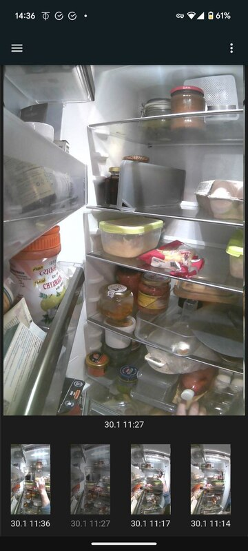
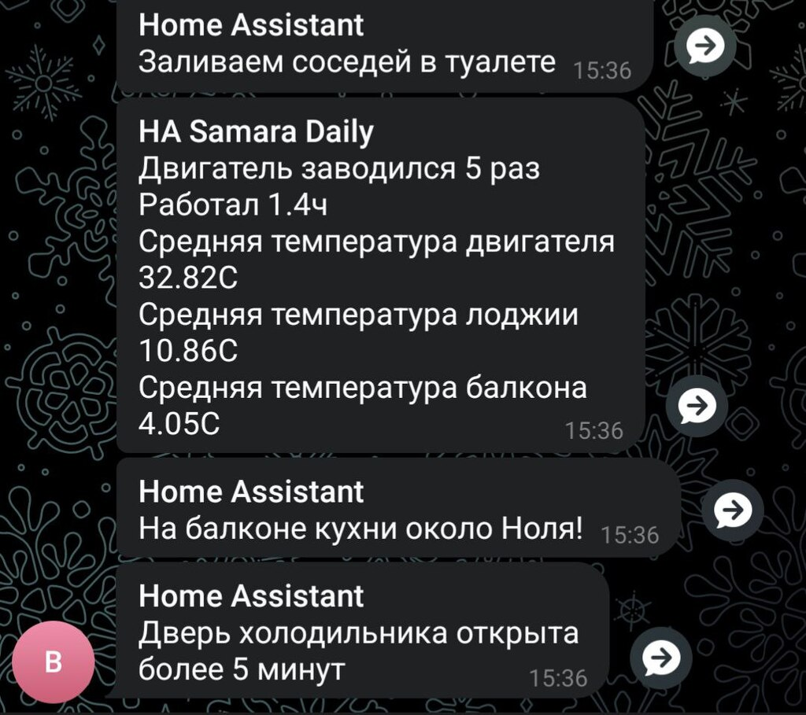
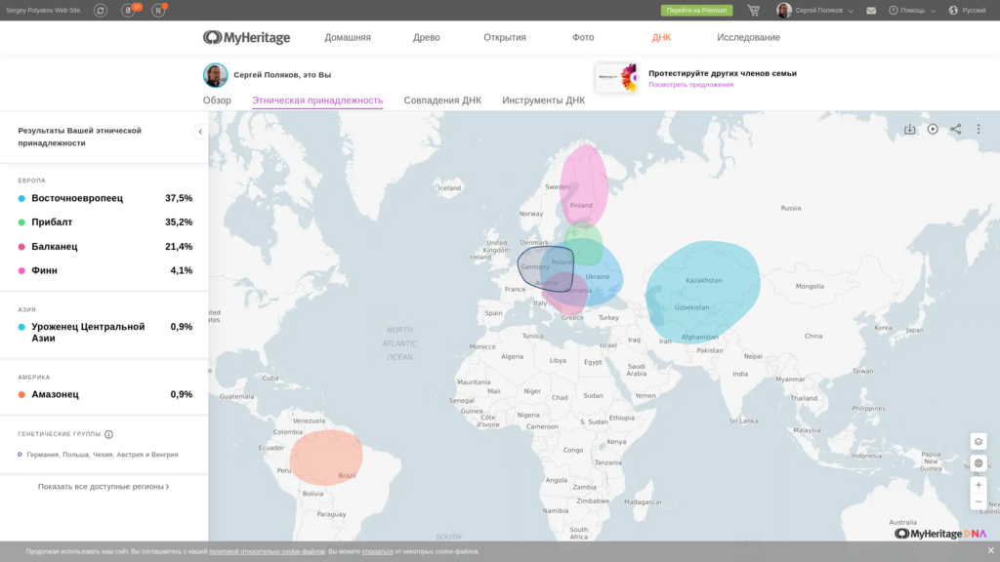
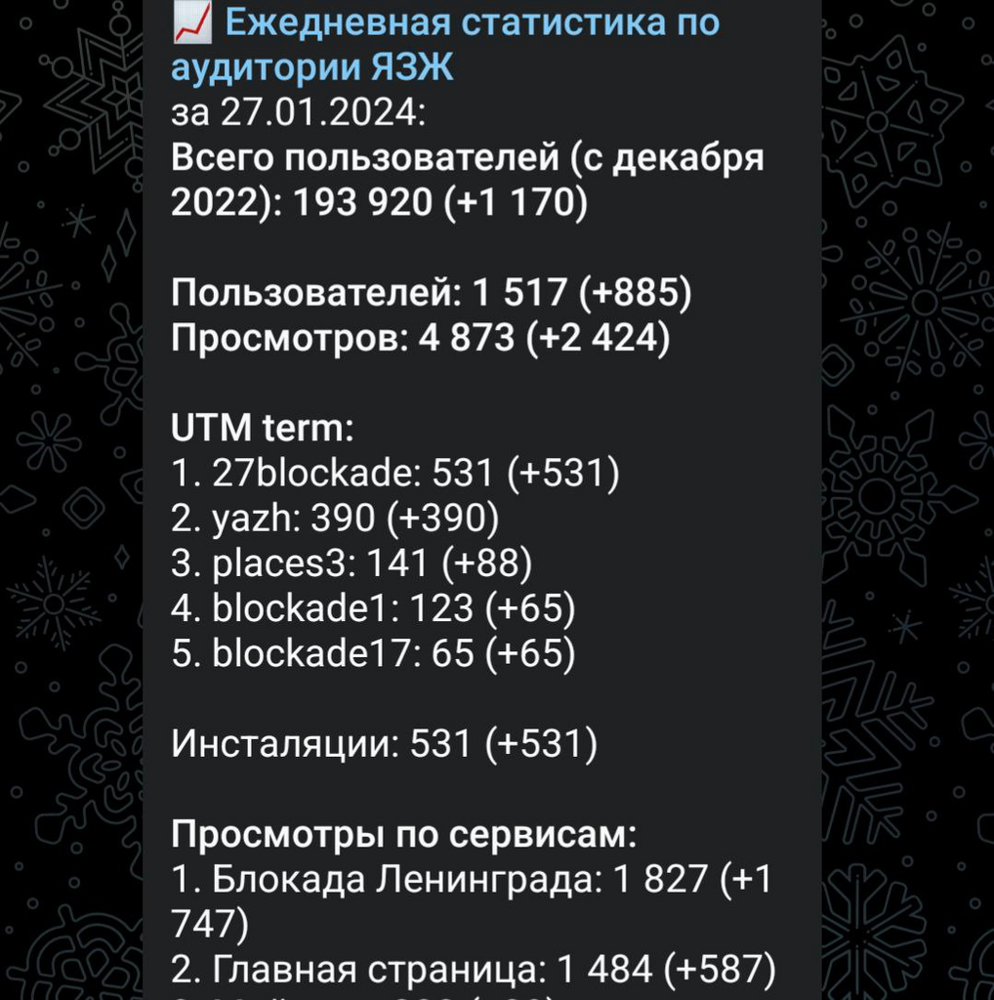
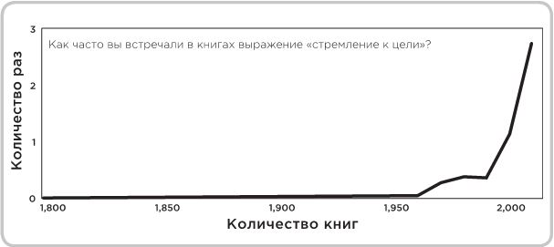

# Управление на основе «Цифры»

## Почему «Цифра» особенна важна для России? {#why_digital_russia}

Пожалуй, могу уверенно заявить, что рачительные навыки управления и ведения хозяйства [не являются нашей сильной национальной чертой](p1-050-country.md#russian_management). Аллегории русского менталитета с Иванушкой-дурачком, который лежал на печи и мечтал, вполне уместны. Здесь же Лев Толстой с его [видением русского народа, сильного духом, но не разумом](https://www.livelib.ru/quote/47165834-rodnaya-rech-petr-vajl-aleksandr-genis). Тут же стихотворение Тютчева [«Умом Россию не понять»](https://ru.wikipedia.org/wiki/Умом_Россию_не_понять), фраза, которая зачастую используется в контексте — «поэтому можно и не пытаться» :-) В 2006 году российские политологи [сокрушались на этот счёт и начали вникать](https://www.livelib.ru/quote/47030374-strategicheskaya-psihologiya-globalizatsii-psihologiya-chelovecheskogo-kapitala):

> Поразительным является то, что государственные политические и экономические решения базируются на представлениях о качестве человеческого капитала в России, почерпнутых из литературы и публицистики, вроде «умом Россию не понять…» Никаких научных данных об уровне развития внимания, памяти, интеллекта, воли, речи граждан России нет, и никто не ставит перед собой задачу их собирать. Они должны быть столь же научны и объективны, как данные о росте, массе тела, объеме легких граждан России. Вот только когда требуется формировать Вооруженные силы, высокотехнологичные производства, обеспечить рабочей силой капитальное строительство, то вдруг оказывается, что некому служить в армии, строить, добывать нефть и пр. Реальные люди, измеренные по многим психологическим параметрам развития и состояния научными методами, — объект настоящей книги.

В свежем выступлении Сергея Иванова [«Душа России на распутье»](https://t.me/sergei\_ivanov\_efko/2027) буквально в первых минутах говорится об исследовании, подтверждающем, что в России значительно больше людей, которые опираются не на объективные факты и цифры, а на собственные идеализированные представления. А у людей с [разными образами мышления](p1-020-call.md#mbti_personalities) и подходы к управлению будут разные. Возможной причиной такой нашей особенности могут быть [наши богатства и масштабы](p1-050-country.md#big_size_matters), но не это важно — что выросло, то выросло. Важнее разобраться, что с этим делать?

Объективный и количественный подход в принятии решений, основанный на динамике изменений численных показателей в ключевых процессах (Key Performance Indicators, KPI или Objectives and Key Results, OKR) — лично мне, видится самым правильным подходом. Управление — оно базово про цифру, как самое объективное представление. А для русских, получается, это — критически важный навык. И чем больше данных и точнее [модели, отражающие процессы](p2-120-school.md#models_in_history) — тем точнее принимаемые решения. Впрочем, очевидно, что агитировать за использование Цифры в управлении уже давно бессмысленно.

## Измерения темперамента, сильных и слабых сторон {#relationship_management}

Конечно же, задача руководителя выражается вполне конкретной целью, которую необходимо достичь, а не задачей развлечь команду сотрудников. Может, у кого-то и такая цель есть :-) Однако у руководителя обычно есть подчинённые, и для достижения цели он формирует команду. Мне неимоверно везло всю жизнь с руководителями, а в Microsoft посчастливилось ещё и прочувствовать на себе [практики учёта темперамента в эффективной команде](p1-020-call.md#mbti_personalities). Такой подход напоминает, что у каждого свои сильные стороны, что задача руководителя — найти каждому своё место и оберегает тех, кто привык работать в стиле — «Я — начальник, ты — дурак», от ошибок.

## Цифровая Трансформация для Постоянного Улучшения {#continual_improvement}

Даже опытные управленцы зачастую не видят важность первичных данных при анализе узких мест в производственных процессах. Сразу начинают говорить о внедрении полномасштабных информационных систем, которые должны решить проблему раз и навсегда. Звучат термины — CRM система, ERP система, упоминаются программные продукты от компаний SAP, Microsoft, 1С, Битрикс, amoCRM и т.д. Это очевидный подход. Однако, на мой взгляд, для начала, хорошо бы самому разобраться в том, что является критической проблемой производственного процесса и оцифровать ключевой показатель, связанный с этой проблемой. Стоит самому изучить проблематику на базовом уровне и с помощью доступного инструмента, типа Excel, создать прототип и отследить слабые звенья. Понимание процесса и ежедневный контроль ключевых показателей, пусть даже собираемых для начала на коленке, намного важнее, чем внедрение очередной системы без понимания нюансов. На каком-то уровне, действительно, целесообразно внедрить единую платформу. Но не разобравшись с первопричинами, очень часто, создаётся ещё больший «зоопарк».

В Microsoft мы с другом помогали найти первопричины сотрудникам российских предприятий и обучали, как быстро и незатратно, в Цифре, анализировать и находить решения. Даже сделали типовое [консалтинговое предложение](https://bd.webzavod.ru/). Но такой подход должен инициироваться собственниками бизнеса. На каждом предприятии, скорее всего, проблема будет уникальная — со своими нюансами. И, как не удивительно, слабо связана с размерами бизнеса. Иногда даже на малом предприятии найти узкое бутылочное горлышко сложнее, чем на большом предприятии, где процессы уже плюс минус устоялись. А бюджеты на оплату такого проекта могут отличаться на несколько порядков. В результате мы много где помогли, что видно на странице Клиентов, но сделать из этого бизнес желаемого размера не получилось. Нужно было самому становиться наёмным консультантом, но с уровнем зрелости и общения не ниже собственников этих бизнесов. И эти метания в поиске контакта руководителя крупного предприятия и формирования доверия у него требовали порядочно усилий с непредсказуемым результатом. А для малого и среднего бизнеса зачастую вообще не окупались. Товарищ до сих пор обучает и помогает создавать инструменты контроля на платформе Microsoft. И подход этот неизменно работает и улучшает ситуацию, если не увлекаться лишнего и не пытаться на Excel делать несвойственные для него вещи. Типа автоматизации процессов с помощью макросов.

## Кулинарный рецепт подготовки хорошего отчёта {#report_as_borsch}

На практических занятиях создания отчётов с сотрудниками крупных предприятий мой друг придумал прекрасный наглядный пример правильного подхода к работе с данными для контроля ключевых показателей. Большинство участников этих тренингов, которые готовили отчёты, были женщинами и явно не понаслышке знали, как готовить дома еду. Поэтому кулинарный пример получился максимально доходчивым.

Представьте, что вам надо приготовить борщ. Вкусный, который будут нахваливать гости. И вот теперь давайте разбираться по порядку, из чего состоит процесс его приготовления.

### Поиск продуктов / Получение доступа к данным {#products}

Нам потребуется аккуратно выписать и найти все те продукты, которые потребуются по рецепту:

- Мясо с костью,
- Капуста,
- Свёкла,
- Лук,
- Морковь,
- Картошка или Фасоль,
- Сельдерей (опционально),
- Сметана,
- Вода.

Очень желательно, чтобы на первом этапе все продукты были отдельными, т.е. не были заготовками и полуфабрикатами и, конечно же, наилучшего качества. Другими словами, должны быть очень свежими! Протухший или недостающий ингредиент может загубить всю идею Борща на корню.

Также и с отчетом — нам нужно определиться какие первичные данные нам потребуются и где мы их возьмем. Допустим, нам потребуется:

- список пользователей,
- список их заказов со всеми атрибутами и статусами,
- список магазинов и т.д.

Мы должны убедиться, что доступ к данным у нас постоянный и в любой момент мы получим актуальную версию, а не какую-то выгрузку недельной давности. Актуальную информацию можно всегда получить, если есть программный доступ (Application Program Interface, API) к системе или источнику, где используются эти первичные данные. Всякие временные выгрузки являются полумерой и в какой-то момент «несвежие» данные делают отчёт нерабочим.

### Подготовка ингредиентов / Подготовка данных {#clean}

Дальше, обычно, мы чистим лук, морковь, свёклу, нарезаем на одинаковые по размеру кубики, дольки, трём на терке, фильтруем воду, шинкуем капусту. Складываем излишки в холодильник и раскладываем по красивым контейнерам для последующего приготовления. Грязная, нечищенная морковь для нас недопустимы.

А к данным, на практике, отношение не всегда было столь же щепетильное, как к продуктам. Их пытались использовать не разобравшись в формате и нюансах. Данные тоже надо подготовить, структурировать и удалить лишние артефакты. Например, оставляем только активные заказы, убирая все выполненные и дубликаты заказов. Приводим все значения в единый формат и готовим справочники для многократного использования. Наводим красоту с форматом и хранением на этом этапе.

### Процесс приготовления / Подготовка цифровой модели {#process}

Далее всё смешиваем в правильной последовательности, длительности приготовления и температурных условиях. Обжарить лук, добавить туда же морковь, потом свёклу. Параллельно отварить мясо. Потом всё это объединить и варить вместе до готовности. Перчим, солим — обогащаем вкусовую палитру. Хорошо бы ещё дать настояться. Следование рецепту и нюансам приготовления очень важно. В серьезных ресторанах процесс жёстко регламентирован и соблюдается для сохранения постоянного вкуса и качества, а умелые повара доводят процесс до полного автоматизма, на глаз контролируя процесс.

С отчётами мы делаем очень похожие вещи — наборы данных объединяются друг с другом в определённой последовательности с помощью связей через идентификаторы. Группируем данные по определённым признакам и вычисляем агрегатные показатели — сумма, среднее, максимальное или минимальное значение. Объединённые выборки данных обогащаются с использованием внешних функций. Все действия мы чётко фиксируем в виде алгоритма и программируем на автоматическое исполнение по расписанию или нажатию кнопки.

### Сервировка и подача / Подготовка отчёта {#present}

Ну а когда борщ готов, прошли сутки — можно разливать по тарелкам красивым, разогревать пампушки, доставать хлеб, чеснок, сметану, смалец и готовить сопутствующие напитки. Делаем всё так, как понравится нашим едокам.

С отчётом также. Делаем представление, где взгляд сразу падает на самые важные ключевые показатели. Формируем удобный для руководителя формат — распечатываем или выводим на панель в кабинете. Или отправляем сообщением в мессенджер, в котором руководители и так сидят, контролируя рабочие процессы круглыми сутками.

На моей практике, приходится наблюдать, как задача отчётности решается с конца. И внимания уделяется заключительному этапу прежде всего. Сотрудники «разлиновывают» форму, к которой привык руководитель. Excel зачастую используется только как инструмент табличной формы представления данных. Данные берут не первой свежести из почты или недельных выгрузок в том же Excel. И чаще всего вручную (копирование-вставка) заполняют таблицу. Зачастую промахиваясь ячейками. В лучшем случае используя функции подстановки или макросы, которые уже давно использовать нельзя.

Новым сотрудникам передаются тонкости и «секреты» подготовки отчётов для руководства, а новые сотрудники всё равно «косячат». На них даже жалуются — что они не могут работать также внимательно и безошибочно, как делает это «старая гвардия»! Хотя, на мой взгляд, такое можно ждать от роботов, но не людей.

Буду рад ошибаться, что сейчас такого уже нет, но 10 лет назад это был самый распространённый способ подготовки управленческой отчётности на ведущих российских предприятиях машиностроения и металлургии. А в государственном управлении ситуация, думаю, ещё более запущенная.

Проводя обратную аналогию, насколько получается вкусный борщ, если 80% усилий уделить его сервировке, но не качеству продуктов и следованию рецептуре — можно легко догадаться.

## Развитие базовых навыков управления на основе «Цифры» {#reporting_for_dummies}

На мой взгляд, у управленцев любого уровня эти навыки работы с цифрой должны от зубов отскакивать, если в ночи разбудят. Качество данных, которые используются для принятия важных решений, не должно вызывать сомнений, также как уверенность в свежести продуктов для своих родных. Пока не поменяем отношение к цифре в контроле ресурсов на самом базовом уровне, так и будем разбазаривать наши ресурсы. Вот такое моё субъективное мнение. А как эти навыки формировать? На мой взгляд, начиная со школы и на наглядных, интересных и практических примерах.

Я не слышал о предмете Цифровизации для детей, а можно было бы начать практиковаться в измерениях, которые имеют особенную ценность не столько для будущей работы, но по жизни в целом. Тем более, что [счастливые люди обычно не разделяют эти два потока](p1-020-call.md#frequent_happiness).

### Время {#time}

Начать лучше с самого важного и невосполнимого ресурса — это Время. Очень просто запустить эксперимент и выписывать в течение 2-3 недель, на что было потрачено время за прошедший день. Вполне подойдёт онлайн таблица [Google Sheet](https://docs.google.com) или [Яндекс 360](https://docs.yandex.ru/). Такая практическая задачка по силам пятиклассникам. Сколько времени ушло на сон, утреннюю раскачку, на еду, на дорогу, на обучение или работу, на отдых в промежутках, на игру, кино и зависания в телефоне, на общение.

| Дата       | Занятие                  | Время (часы) |
| -          | -                        | -            |
| 25.01.2024 | Сон                      | 8            |
| 25.01.2024 | Побудка                  | 0.5          |
| 25.01.2024 | Еда в одиночку           | 0.5          |
| 25.01.2024 | Дорога пешком            | 2            |
| 25.01.2024 | Контроль в Telegram      | 4            |
| 25.01.2024 | Текст                    | 4            |
| 25.01.2024 | Обед в компании          | 1            |
| 25.01.2024 | Ужин в компании под вино | 2            |
| 25.01.2024 | Чтение                   | 3            |

Главное в процессе учёта себе не врать и не заниматься приписками. Осознание наступает уже в процессе сбора данных, когда начинаешь тупить, но вспоминаешь, что потом придётся занести время в таблицу. Спустя несколько дней с помощью механизма Сводных таблиц, который есть и в Google, и в Яндекс, можно сгруппировать эти записи по роду занятий и посмотреть суммарные значения и пропорции. Анализ зачастую отрезвляет и подталкивает к изменению привычек. Получить такой опыт и осознать, на что уходит время в пропорции полезно каждому молодому человеку.

Когда разобрались и оптимизировали самый важный показатель, переключаем внимание на следующий. Постоянно контролировать показатель, по которому ты уверен, нет никакого смысла.

### Здоровье {#health}

У меня не очень хорошая наследственность по диабету и гипертонии — есть риски. Поэтому довольно рано начал запускать процессы контроля ключевых показателей по здоровью.

Обзавёлся электронным тонометром и начал следить за давлением. И сразу началась какая-то муть — прибор стабильно показывал завышенные цифры, что лишь усиливало беспокойство. Молодая красивая врач в модной платной клинике мне поставила хроническую гипертонию и понавыписывала таблеток на постоянное употребление до конца моей, уже не такой счастливой, жизни. Однако нужно второе мнение. И механический аналоговый тонометр, вставленный в уши доктора старой школы, выдавал вполне нормальные показатели. Сам доктор тоже посоветовал мне расслабиться. Такой себе совет… Он отлично работает, когда требуется разгневанного человека привести в ярость :-)

А успокоился я, когда разобрался, что на моих венах электронный тонометр был излишне чувствительным. Я был счастлив, что проблема не во мне, а в несовершенном цифровом устройстве. Впрочем, этот опыт был очень полезный — одно лишь упоминание о постоянном приёме медикаментов, как ассоциации с хроническим заболеванием, меня мощнейшим образом мотивировало поменять образ жизни и увеличить физические нагрузки.

Периодически ходить на какой-либо спорт я совершенно неприспособлен. Проходили в детстве попытки записать меня в разные спортивные секции, и сколько себя помню — всегда бойкотировал эту идею. И это, как мне кажется, не про лень. Вероятно, [мой психотип Архитектора](p1-020-call.md#architect_personality) формирует такое отношение к Спорту. Ведь спорт — это быть здесь и сейчас, максимально точно чувствовать реальность и возможности организма, а я прежде всего про выдуманные миры, где мне интереснее. А может быть потому, что Спорт — это сублимация Соперничества, Столкновений и, если угодно, Войны. Не даром на студенческих тусах [с особым упоением вместе с друзьями подпевали Tom Araya](https://music.yandex.ru/album/1081748/track/125615):

> The sport is war, total war  
> When this end is a slaughter  
> The final swing is not a drill  
> It's how many people I can kill

Надо понимать, что я, ни в коем случае, не против Спорта — есть ещё, как минимум, 15 других психотипов. Просто это «не моя вода»:

- состязательность не приносит мне счастья,
- а на физкультуру мне жаль драгоценного времени, которое хочется тратить на любимые занятия.

Что делать? Выход есть!

Физические нагрузки, тренировку воли, необходимое для счастья преодоление можно обеспечить стремлением к Цели, пусть даже виртуальной.



Первое же устройство Fitbit, которое появилось на рынке в начале 2000-х для измерения шагов и двигательной активности, было немедленно куплено. 7-8 тысяч шагов в сутки, которые я проходил, для улучшения здоровья явно не хватало. Ну не получается ходить больше, когда в семье у меня и у жены своя машина, мы по уши в сидячей работе за компьютером, живём и работаем в домах, где установлены лифты. Следуя принципу [совмещения Природных и Технологических подходов](p2-110-system.md#dualism), в жертву было принесено благо цивилизации — личный автомобиль. Отдал свой жене, которая в 1000 раз чаще меня сопровождает детей, а сам практически отказался от использования любого транспорта в перемещении по городу, если можно дойти пешком за час-два. Время в пути тратил на телефонные разговоры по работе. Количество шагов увеличилось в 3 раза! Приятным бонусом сократились траты на бензин, а также где-то далеко Грета Тунберг захлопала в ладоши. Или она ещё тогда не родилась?



Средний показатель на сегодняшний день, спустя 20 лет, порядка 15 тысяч шагов в сутки. В поездках по работе или в отпуске этот показатель драматически увеличивается.

В летние периоды с огромным удовольствием использую велосипед. Каждый раз нехотя выкатываю его во двор и думаю: «В этот раз поеду спокойно…» Но вот выехал на [просторную набережную лейтенанта Шмидта](./p2-130-local.md#love_to_vo), меня встречает Нева, поток свежего воздуха, непроизвольно встаю с седла, приналегаю на педали и вот я уже лечу в мощнейшем ощущении Счастья! И вот этот момент для меня имеет значение!

Стараюсь не пользоваться лифтами, особенно после услышанной забавной истории.



В Microsoft ходила внутренняя забавная история из начала 2000-х про русского разработчика, который переехал работать в Штаты. В бесконечном потоке счастливых обладателей загородных домов и больших машин он каждое утро приезжал из одноэтажной Америки в Америку небоскрёбов, в рабочий офис. Каждое утро он проходит мимо группы своих коллег, которые со стаканчиками Starbucks ждут лифта, и направляется к пожарной лестнице. Офис Microsoft был (условно) на 26 этаже. Стоит ли говорить, что эдаким своим подходом он вызывал полнейшее недоумение и коллеги порой крутили крутили пальцем у виска? И вот как-то раз один «остряк» бросил ему вслед:

— А что, русские не умеют пользоваться лифтами? ;-)

Ответ прозвучал молниеносно:

— Умеют, но русские ещё умеют ими НЕ пользоваться.



Лабораторные и ежедневные показатели по сахару натощак, которые я начал измерять электронным глюкометром, меня тоже поначалу напрягали повышенными значениями в зоне преддиабета. И подтолкнули к изменению рациона и сокращению углеводов, которые, конечно же, я тоже начал измерять :-) Старался искать баланс и не сваливаться в крайности строгих ограничений. Искал варианты блюд, которые нравились бы, а не просто были полезными. Крючкотворство ручного учёта каждой съеденной калории было выше моих ограниченных сил и я купил платную подписку мобильного приложения для быстрого поиска и учёта калорийности продуктов. Учитывал до тех пор, пока не добился сокращения веса и не сформировал привычку по питанию. После чего учёт стал ненужным и внимание переключилось на другие проблемки.

Спустя 3 года опять пришлось корректировать привычки, но и прогресс не стоял на месте — за это время сильно продвинулись возможности искусственного интеллекта. [Вот пример чат-бота в Telegram](https://kcalc.ru/), который распознает еду, определяет калорийность и БЖУ состав по изображению. Тотальное поветрие фотографировать свою еду и сообщать всему миру, как ты питаешься можно и во что-то более полезное трансформировать :-) Хотя мне больше понравилось в общении с этим ботом голосом проговаривать съеденное, а не «отмазываться» отправкой фоточки. Быстрее и точнее получается. Да и осознанность повышается, что особенно важно.

Что мне не давало полностью успокоиться по поводу потенциального диабета, так это то, что несмотря на здоровое питание и физическую нагрузку показатели глюкозы оставались в верхней границе нормы и даже выходили за её пределы. Эндокринологи известных клиник, рассказывая про чудеса фармакологии (приносящей триллионы долларов собственникам), назначали мне корректирующие сахар препараты и тоже пытались меня успокоить, что для своих 50 лет я держусь молодцом! Расслабьтесь и выпейте таблеточку!

Я бы, может, сдался и расслабился, но раз в полгода также измерял [гликированный гемоглобин](https://ru.wikipedia.org/wiki/Гликированный_гемоглобин), который по аналогии с [определением Счастливой Жизни](p1-010-happiness.md#happiness_model) тоже является средним интегральным показателем. Но не уровня эмоционального тона, а уровня глюкозы в крови. И вот это среднее значения были совершенно нормальными. Почему же тогда глюкометр стабильно показывает завышения в моменте? Всё как со счастьем — вроде все признаки счастливой жизни налицо, но слишком часто чувствуешь себя несчастливым :-)

И тут мне помогла бескомпромиссная цифровизация — постоянный мониторинг глюкозы в крови, по сути, внедрение электронного датчика под кожу. Ну хорошо, не совсем постоянный — всего на 14 дней. Но только это устройство показало, что значение в норме 99% времени. Включая те моменты, когда глюкометр сигнализировал о проблеме. Оказалось, что анализаторы состава крови из пальца стабильно завышали показатели по сравнению с датчиком, который находится внутри кровеносного потока и точнее в измерениях.

Вот такой вот опыт, которому я очень благодарен — за 2 недели получилось прочувствовать реакции организма на питание, сон и физические нагрузки, и настолько детально самому разобраться в работе внутренних органов мне по-другому не получилось бы.

Сценарий этого решающего эпизода моего расследования вызывает некоторую тревогу не за мой организм, но за будущее врачей. Десять лет уважаемые специалисты в Самаре и Петербурге не могли чётко ответить на мои вопросы. Точку в вопросе поставили прежде всего 3 вещи:

- [Собственное любопытство](p2-110-system.md#noble_curiosity);
- [Достоверные первичные данные](#products);
- [ChatGPT](p1-030-time.md#happy_tomorrow), который выдавал мне возможные варианты причин повышенных показателей и рекомендации по дальнейшей диагностике в максимально понятном мне формате.

Проверку этих рекомендаций и выписку направлений я доверил человеку-специалисту на удалёнке, которого выбирал на сайте [ПроДокторов](https://prodoctorov.ru/). Разговор там был не слишком содержательным, в стиле:

— Всё ли верно в этих рекомендациях?
— Пожалуй, да. Держите Ваши направления. С Вас 3тр за приём.

По какому ещё поводу я могу беспокоиться? :-)

Ну, конечно же, сон! Сон — важнейший физиологический процесс, и если он нарушается, можешь извести себя до мощнейшей депрессии. У меня до крайностей, слава Богу, не доходило, но качество жизни, бывало, снижалось существенно.

Также как во взвинченном состоянии не работает совет «Узбагойся!», также при бессонице не пытаюсь заснуть — начинаешь расстраиваться от бездарной потери каждой минуты. Поэтому я научился обманывать своё сознание и поменять отношение к бессонице. Если вдруг просыпаюсь в неурочное время, значит это знак, что надо чем-то заняться. Внутренне спрашиваю себя: «[На какое занятие мне хватит батарейки](p1-040-unhappiness.md#battery_aziz)? [Помолиться](p2-110-system.md#our_father), послушать аудиокнигу, почитать, [разобрать Telegram](p1-040-unhappiness.md#information_flow), отредактировать накопившиеся фотографии или продолжить дорабатывать этот текст?»

Если проснулся в районе часа ночи, то скорее всего в районе 4 опять засну с чувством удовлетворения и ещё успею выспаться.

Впрочем, оставить сон без измерений я не мог :-) Современные часы-браслеты довольно хорошо считают время сна с учётом фаз — глубокий сон, легкий и быстрый. В зависимости от того, что больше требуется — отдых или сновидения яркие, хотелось бы воздействовать на увеличение той или иной фазы.

Друзья подарили электронный кубик Дип, который пытается влиять на эти фазы. Смысл в том, что Земля генерирует электромагнитные импульсы разной частоты ночью, днём, утром и вечером, и наши организмы за миллионы лет эволюции настроились на этот ритм, пока мы спали непосредственно на земле. А вот переезд в верхние этажи многоквартирных домов сотню лет назад эту настройку сбил. А маленький кубик сна эмитирует большую Землю и тем самым пытается вернуть нас в лоно природы. По [ссылке](https://deep-russia.online/how/) можно найти описание, да и уважаемые мной специалисты подтвердили, что определённый эффект должен быть. От себя могу сказать, что результат не всегда, но всё же есть, а порой значительный. Хотя скажу, что если есть возможность спать на природе, поближе к земле, на свежем воздухе, то размениваться на кубик я бы точно не стал.

Полезным результатом от этого опыта мне видится куда более осознанное отношение к сновидениям. Особо интересные начал записывать во время пробуждения как [моменты Счастья](p1-010-happiness.md#moments_of_happiness_book) :-)

### Деньги {#money}

Пока в мире не наступит коммунизм (на что я не рассчитывал бы в своей жизни) и деньги играют важнейшую роль — их необходимо контролировать, но [нельзя на них зацикливаться](p1-040-unhappiness.md#money_for_nothing). Про финансовую грамотность написаны прекрасные книжки, кто-то уже активно просвещает (смотри далее), но я бы даже не начинал рассказывать про продвинутые финансовые инструменты без сформированной привычки банального учёта всех денежных транзакций. Сейчас электронные платежи автоматически учитываются в приложении банка, но я не уверен, что эта цифровизация 100% во благо.

Хорошо бы иметь привычку учитывать каждую трату осознанно. В 90-е годы никаких приложений, конечно же, не было, и тогда приходилось использовать Excel или позже Microsoft Money. Сейчас можно использовать сервисы для ведения семейных финансов. Тем более отдельный инструмент необходим, если тратят несколько человек и счета заведены в разных банках. Учёт онлайн транзакций можно полностью автоматизировать, а вот оплата наличными потребует ручного ввода.

Также требует внимания процесс подведения баланса по счетам раз в квартал. Хочешь ты этого или нет, но неминуемо придётся провести анализ по тратам. И вот когда все расхождения найдены, по всем счетам баланс сошёлся, тогда случается маленький момент Счастья, как после генеральной уборки в квартире, когда всё сверкает чистотой. С деньгами порядок! :-)



Дочь получила свою банковскую карточку в 15 лет в 2017. Т.к. финансы в семье учитываются постоянно мной и женой — мы понимали, сколько уходит на её образование и сопутствующие потребности — оплата школьных завтраков, кружков, репетиторов, проверки у врачей, сезонная одежда и т.д. Весь этот бюджет начали перекидывать ей на карту. Чтобы она оплачивала их самостоятельно, формировала свои привычки управления деньгами, понимала сколько что стоит. В 15 лет уже пора быть самостоятельным. Если можешь не платить репетитору, а самостоятельно выучить какой-то предмет — это прекрасная мотивация оставить денежку себе. Я её даже не собирался контролировать в этом. Уже 3 года как она зарабатывает и, насколько мне известно, применяет инвестиционные инструменты. Размер её заработка, на мой взгляд, сейчас не так важен, как привычка контролировать деньги и выбирать работу, которая доставляет максимальное удовольствие, но не оплату.



Сын получил карточку в 11 лет. Посмотрим, как пойдёт — дети очень разные :-)

### Умный Дом {#home}

Дома хочется качественно отдыхать, иначе потом работать не получается. Важные показатели места, в котором я живу, включают температуру, влажность воздуха, содержание в нём кислорода или CO2, энергопотребление, местоположение автомобиля, его статус и состояние. Интересно было повысить комфорт с помощью собственных сервисов контроля наличия продуктов в холодильнике, умного управления светом и системами кондиционирования воздуха. Мониторинг всех этих значений, уведомления по событиям и ежедневная статистика в Telegram, интеграция сервисов с колонкой Алисой и автоматизация процессов максимально созвучны основной моей деятельности на работе. Самостоятельное улучшение системы умного дома позволяет мне не забывать навыки программирования и поддерживать себя в тонусе, хотя я уже давно не являюсь профессиональным разработчиком. Тут, как мне кажется, наилучшим образом работает [принцип следования Призванию](p1-020-call.md#frequent_happiness) — когда не разделяешь работу от остальной жизни.

Признаюсь, что весь этот комфорт для меня не столь важен, как сам процесс его создания. Если это электронное хозяйство требует моих сил для поддержания — я от него отказываюсь.

### Происхождение {#dna}

Мама любила рассказывать про своих родителей и своё детство. Как мой дед Иван Максимович Кириллов в 1918 году юнцом ушёл в Красную Армию из многодетной семьи иконописца села Кинель-Черкассы. А мой прадед Яков Семёнович Курганов был портным и шил костюм для [Ленина в его бытность помощника адвоката в Самаре](./p2-120-school.md#models_in_history). Спустя тридцать лет у него шили кожанки комиссары. Один решил сэкономить на оплате следующим образом — потребовал снять икону и приставил наган к виску прадеда. Яков Семёнович снимать икону отказался, но попробовал сослаться на авторитет вождя, который был клиентом и работу оплачивал. Комиссара решил жизнь «великодушно» сохранить, а курточку забрал бесплатно. Мда.

Мне было любопытно слушать, но я также включал диктофон на телефоне и ставил его рядом. Когда по понятной причине эти разговоры прекратились, у меня остались записи. И значит разговор можно продолжать. И даже перевести эти записи в текст и передать своим детям. Это важно для ощущения корней и [связи поколений с местом, где живёшь](./p2-130-local.md#unhappy_foreigners). Благодаря им неожиданно возникают моменты счастья.

Проявил системный подход и оцифровал фотографии из альбомов своей семьи и жены. Выложил в домашний цифровой архив и синхронизировал с двумя (!) облачными сервисами. Отказоустойчивость — наше всё :-) Теперь можно в два клика найти изображение своего предка в разные годы. А подборка фотографий, которые ещё и снабжены тегами момента счастья — проверенный годами антидепрессант :-) В минуту грусти или встречи с родственниками наши родители доставали фотоальбомы.

Стоит ли говорить, что как только узнал про сервисы поиска родственников и построения древа — [MyHeritage](https://www.myheritage.com/) и [FamilyTreeDNA](https://www.familytreedna.com/) — сразу же сдал тесты и туда и туда. А также выгрузил профиль в сеть [GedMatch](https://www.gedmatch.com/). С появлением российского [Genotek](https://www.genotek.ru/) подарил тесты на Новый год дочери и племяннику. В общем, раскидал я цифровые сети поиска своих корней и жду, как паук в засаде, когда найдутся общие предки с другими пользователями.

А совпадений сотни и тысячи. Учитывая, что первичный сбор данных происходил преимущественно в США и Европе, находятся родственники, которые эмигрировали ещё до революции. Пятиюродные братья и сёстры — мелкая рыбёшка. Проку от этого мало, но интересно осознавать, как же НАС много по всему свету :-)

Из забавного. После первого теста в MyHeritage мне сообщили, что я на 3% амазонский индеец! И я даже представлял, как моя прапрапрабабушка путешествовала в Южную Америку вместе с детьми капитана Гранта и там согрешила. Это меня почему-то радовало :-) Но на одну оценку полагаться не стоило и я сдал второй тест в более серьёзный сервис, с самой большой базой ДНК — FamilyTreeDNA. Как выяснилось, MyHeritage является партнёром FamilyTreeDNA и мой первый тест был урезанной версией. А на втором тесте мои надежды рассыпались — амазонские индейцы превратились в монголов.

В общем, моё происхождение довольно прозаично. Викинги с Балтики, чернобровые славяне с Балкан (вспоминается мамина история про девушку, которую мой прапрапрадед вывез из разрушенного селения районы Шипка во время русско-турецкой войны 1877 года) и щепотка завоевателей из тёмных времён татаро-монгольского ига. Да и ошибка с индейцами понятна. Племена наших предков пришли в Америку через Азию, Монголию и Аляску и, как я понимаю, стоят близко друг к другу по ДНК. Можно ошибиться.

С пополнением базы новыми тестами отчёты уточняются и обновляются — 3% стали 0.9% в MyHeritage. Запись о монголах в FamilyTreeDNA вовсе пропала, как малозначимая. Зато в Genotek проявились градации по нашим народностям — их база преимущественно состоит из наших соотечественников и можно находить тонкие различия. И в Genotek нашлась более близкая родственница из любимого Петербурга. Ура!

Линия моего отца представляет собой мощный куст крестьян-староверов. И мой прадед Леонтий Николаевич Пашков оставил собственное жизнеописание. Документ этот я, конечно же, тоже оцифровал. В его воспоминаниях мы нашли общего родственника, с которым мой прадед вёл любопытный бизнес.

Они массово делали косы. Ну, которые для того, чтобы косить траву :-) Ездили по деревням в начале сезона и раздавали их крестьянам. Те после зимовки жили настолько впроголодь, что новую косу справить было непросто. А по осени опять проезжали по деревням и собирали оплату. Понравилось мне такое предпринимательство в своих корнях. Стоит ли говорить, что без такого «кредитования» кто-то из крестьян мог и до осени не дожить.

### Творчество {#art}

Соприкосновение с музыкой в моей жизни происходит практически постоянно. Если только нет возможности послушать естественные звуки леса или моря. И рациональному порыву оцифровки знаний о любимой эмоциональной музыке [посвятил отдельную главу](p2-150-absurd.md).

Просмотренные фильмы начал учитывать в [IMDB](https://www.imdb.com/) с появлением доступа к сети Интернет в 90-х. Было очень интересно разбираться с формулами рейтинга фильмов и читать про архитектуру высоконагруженного сайта, созданного на языке Perl и веб-сервере Apache. Статьи с описанием внутренностей этого популярного портала были в открытом доступе и одними из первых материалов по теме практической разработки онлайн платформ. Именно у архитекторов IMDB учился проектировать собственные системы.

Дополнительно сделал базу данных собственных видеокассет, чтобы учитывать, кому отдал фильм посмотреть, и собирал взносы, которые шли на запись новых кассет, а потом DVD дисков. Уверен, что разработчики Кинопоиска тоже вдохновлялись IMDB и сделали свою платформу, которая в чём-то была удобнее, но также учитывала [русский менталитет](#why_digital_russia) в восприятии фильмов и при составлении рейтингов. Что, на мой взгляд, важно. Российские разработчики также обеспечивали открытый API для экспорта-импорта своих оценок — я перенёс их с IMDB и переключился на российскую платформу. В 2020 году Яндекс закрыл возможность экспорта собственных оценок! И это вызывает раздражение хотя бы потому, что собирал оценки я не только с их помощью и никакого права на них корпорация не имеет. Хорошо, что в сообществе разработчиков [открытого кода](p2-170-opensource.md) есть умельцы, которые [помогают вызволить мои данные из плена Кинопоиска](https://github.com/Drysua/rating_kinopoisk).

Чем могут быть полезны все эти заморочки с данными? Хотя бы тем, чтобы составить список фильмов, которые стоит посмотреть вместе с сыном. Чтобы сесть рядом с повзрослевшей дочерью, которая занимается кино, и пройтись по списку особенно выдающихся и сравнить оценки. Мне видится это очень важным.

Ведение цифрового списка книг и заметок по ходу прочтения — ещё более важная история. Жаль, что не вёл этот учёт с самого детства, а выписывать понравившиеся цитаты начал совсем недавно. Можно признать, что этот текст состоит прежде всего из [прочитанных мной и соавторами книг](p3-references.md), которые мы объединили, дополнили своим опытом и применяем к планам на будущее. Надеюсь, что про цифровизацию книжного мира также будет отдельная глава нашего текста.

### Путешествия {#travel}

Трудно обойти тему Путешествий, с которыми связано много воспоминаний и моментов Счастья. Фотографий из путешествий тысячи, при том, что оставляю максимум 5-10% отснятого материала. Конечно же, лежат они в архиве, в папках по годам и городам. Несколько лет подряд скрупулёзно снабжал каждую фотографию координатами GPS, сейчас уже спокойнее к этому отношусь.

Но мой пример оцифровки собственных поездок слишком банальный — практически все так делают. Куда более фундаментальный подход недавно привела дочь, восхитившись [полной ретроспективой перемещений Артемия Лебедева](https://www.tema.ru/travel/) — действительно, круто!

## Открытые данные «Цифрового Петербурга» {#api_petersburg_ru}

Важность первичных данных для контроля ключевых процессов невозможно переоценить. «Данные — это новая нефть» — звучит из каждого утюга, и я могу признаться, что не менее 50% усилий [команды Цифрового Петербурга в создании приложения «Я Здесь Живу»](p2-130-local.md#mini_app_vkontakte) заключаются именно в поиске и получении доступа к этой нефти, а не в программировании и создании интерфейсов.

Даже если эти данные лежат в недрах какой-то организации, не являются персональными или секретными и не используются толком — отдавать их обычно не торопятся. Всё-таки у всех есть понимание, что это реальная ценность и их, на всякий случай, лучше держать при себе. Да и понятно же, что как только будет получен доступ к этим данным, сразу начнутся уточняющие вопросы один за другим. И начнут вскрываться разного рода недоработки и проявляться серые зоны, в которых не наведён порядок и можно даже обнаружить вероятные нарушения.

Поэтому когда цифровизаторы приходят в государственные организации и начинают задавать вопросы о данных и целевых показателях ключевых процессов — это как если бы к вам домой пришел незванный доктор с градусником и линейкой и начал делать всякие измерения. Мало кому такое понравится. Помогают [поручения, связанные с открытием данных для развития систем Искусственного интеллекта на государственном уровне](p1-050-country.md#russian_it). На моей практике, после открытия данных и их анализа ситуация всегда становится только лучше.

Ещё в 2020 году создали каталог цифровых сервисов для петербуржцев. Но что важнее с точки зрения развития экосистемы — запустили каталог программных интерфейсов (Application Program Interface, API) с доступом к городским данным. Для вовлечения разработчиков провели несколько хакатонов, а 1 июня 2022 года запустили глобальный четырехмесячный [конкурс «Код Петербурга»](https://vk.com/@vkappsdev-vyigrat-priz-i-pomoch-gorodu-otkryvaem-konkurs-vk-spb) на разработку городских сервисов поверх данных [API.petersburg.ru](https://api.petersburg.ru) от лица губернатора Санкт-Петербурга и совместно с социальной сетью ВКонтакте.

Для планирования и создания новых сервисов экосистемы Петербурга и развития функций [приложения «Я Здесь Живу»](https://vk.com/ya_zdes_zhivu) провели 9 масштабных мероприятий и привлекли более 400 участников из разных комитетов и организаций, чтобы отобрать 13 потенциальных сервисов для реализации и определить какие данные нам потребуются. Могу предположить, что основная ценность этих мероприятий заключалась в том, что мы вовлекли сотрудников государственных организаций в процессы, связанные с созданием сервисов и сформировали у них понимание о важности открытия данных.

Первые год для команды самой важной метрикой являлся рост числа пользователей. Сколько НОВЫХ пользователей пришло в сервис за вчерашний день сообщает служебный чат-бот в групповом чате КАЖДЫЙ день. Ключевые показатели и узкие места меняются и должны корректироваться как только они перестают быть узкими. Когда рост стабилизировался, возникла задача выхода в другие каналы и начали учитывать количество пользователей, которым удалось донести объективную информацию о доме и месте жительства. Как только происходит всплеск активности и мы побиваем предыдущий рекорд — в группе команды взлетают «сердечки» Общего Счастья :-)

## Финансовый ЛикБез ([Сергей Сергеевич Поляков](p2-100-authors.md#zpss)) {#finance_for_citizens}

Стоит отметить, что интересы команды «Цифровой Петербург» в части расширения аудитории очень сильно пересеклись с задачами Комитета финансов СПб. Попробую раскрыть эту мысль.

Одной из целей деятельности Комитета является борьба с безграмотностью в управлении личными финансами жителей города. Действительно, уже с 2016 года Комитет пытается бороться с финансовым мракобесием. Для начала расскажу про первые «яркие» подходы «к снаряду».

В начале 2017 года к нам пришел один «товарищ», который уверял, что для разгромной победы над безграмотностью необходим лишь правильный маркетинг и продвижение. После его уверенных речей забурлила активная деятельность по проработке идей для социальной рекламы. В то время, как раз, активно начали набирать оборот микрокредитные организации, и, соответственно, мы решили, что наша целевая аудитория — это как раз клиенты таких фирм. Я, будучи человеком достаточно прямолинейным, решил, что максимально попадающий в точку портрет человека в трудной жизненной ситуации — это портрет типично питерского БОМЖа. Кстати, как-то имел разговор с теперь уже одним из великих руководителей Санкт-Петербурга, на тему — почему это бездомных так и тянет сюда, на север. Заключение его было забавное. Как он выразился, если бы он был на их месте — то точно подался бы в Сочи, а не в Питер.

Соответственно, на просторах интернета была найдена фотография бедолаги, к которой была приделана надпись: «Он уже микрокредитнулся, а ты?»

После дискуссий внутри Комитета финансов было принято решение не шокировать жителей и не устраивать «революций». Более того, через непродолжительное время ещё и появились результаты социологии и стало понятно, что на тот момент основным потребителем МФО были не люди, попавшие в критическую ситуацию, а импульсивные молодые граждане, желающие здесь и сейчас купить себе новый гаджет.

Сейчас основы финансовой грамотности — это уже более-менее отстроенная система, так во всех школах она внедрена во внеурочную деятельность. В этом году, кстати, проведу тестирование на собственном ребенке :-). Мы ведем активную работу с банками через их офисы (в основном речь про телефонные мошенничества) и их мероприятия для клиентов. Вместе с ними же проводим лекции для возрастного населения. Присутствует и социальная реклама, и, кстати, в этом году мы начали активно использовать не только физические носители для социальной рекламы, но и таргетированные механизмы цифрового продвижения на крупных площадках Яндекса и ВКонтакте.

Наша задача — научить людей думать, анализировать, считать и делать рациональные выводы и, что не маловажно, постепенно менять себя и среду вокруг. Постепенно, итерационно, без «революций». Ставить цели и идти к ним опираясь на измеримые показатели своего результата.

## Твой Бюджет 2.0 {#your_budget}

Так вот, одним из наших инструментов по направлению финансовой грамотности, а как мы теперь говорим и основ финансовой культуры является проект «Твой бюджет».
Это проект инициативного бюджетирования в формате краудсорсинга идей среди всех жителей, который мы проводим с 2016 года. В рамках проекта, помимо воплощения идей граждан, происходит и образовательный процесс — становится понятнее как управляется город и принимаются решения. Стоит отметить, что победители проекта вынуждены работать со своими идеями до их реализации и не получают за это наград, денег и т.п. Всё делается на чистом энтузиазме. Важнейшим аспектом «Твоего бюджета» является его коммуникативная функция. Он позволяет жителям города напрямую взаимодействовать с органами власти, высказывать свои идеи и вносить предложения по улучшению городской инфраструктуры. Это способствует повышению доверия между жителями и властью, а также создает условия для более активного участия граждан в управлении городом и повышения прозрачности данного процесса.

Экосистема общественного участия в бюджетном процессе Петербурга, поступательно формируемая с 2016 года, в виде нескольких проектов инициативного бюджетирования и соучаствующего проектирования, рассчитанных как на взрослую, так и подростковую аудиторию представлена на сайте [https://tvoybudget.spb.ru/about](https://tvoybudget.spb.ru/). Если говорить о результатах, то, с одной стороны, количественные показатели не самые гигантские.

За 7 лет в этих проектах:

- приняли участие более 100 тысяч человек;
- выбрано 160 инициатив, включая и взрослый, и школьный проекты, из них 113 уже реализованы;
- общая стоимость этих проектов — 2,8 млрд рублей.

С другой стороны, думаю, мы получили очень значимый качественный результат. Он состоит в том, что мы научились производить жизнеспособные и востребованные инструменты вовлечения горожан в принятие решений. Возможно, они не носят массового характера, но мы знаем, что городским активистам известно, что такое «Твой Бюджет», и многие из них неоднократно становились участниками Проекта.

Часть из них вошла в ряды муниципальных депутатов, кто-то пополнил ряды городских активистов, есть примеры объединения нескольких городских сообществ вокруг одной идеи или проекта, создания новых коллабораций.

В 2021 году, через 5 лет после запуска проекта «Твой бюджет», мы поняли, что его пора трансформировать. Если проект не менять, он перестает жить в проектной логике и становится рутиной. К проекту начали привыкать, и начались попытки использовать его в качестве ещё одного «источника финансирования». Вместо необычных, сложных, но «живых» инициатив мы стали наблюдать поток банальных предложений по ремонту школ и садиков, закупке оборудования для поликлиник и т.п. Между тем, в опыте «Твоего бюджета» было много повторяющихся, системных запросов, дающих понимание, каких объектов городской среды не хватает, какие потребности удовлетворяются не должным образом. Отмечу несколько: спортивная инфраструктура для подростков, велоинфраструктура, инклюзивная среда, соучаствующее проектирование и биоразнообразие в городе, поддержка бездомных — причем, как людей, так и животных.

В сентябре 2022 года, после летних обсуждений, в том числе с командой «Цифрового Петербурга», было принято решение о проведении следующего цикла проекта, нацелив его на создание цифровых сервисов для населения и сбор идей о том, каких городских данных не хватает нашим жителям, бизнесу, активистам. Более того? мы понимали, что в ходе реализации участники увидят какие шаги предшествуют появлению нового электронного сервиса, какие данные потребуется найти и как их подготовить, а финансирование этих инициатив, по сути, будет направлено прежде всего на формирование и открытие этих данных.

В итоге, после паузы, взятой в 2022 году на разработку новой модели, 1 марта 2023 года мы запустили обновленный «Твой Бюджет 2.0». Было немного боязно запускать проект в таком формате, ибо практик подобного мероприятия в нашей стране еще не было. Как правило, 90% всех подобных проектов по всей России (да и во всем мире) сводятся к установке «клумб» и «скамеек», а тут была выбрана достаточно сложная тема — цифровые сервисы. Однако, если быть максимально краткими, то у нас вместе с командой «Цифрового Петербурга» пока всё получается. На первом этапе удалось собрать более сотни предложений от жителей, которые, пройдя через сито проекта, превратились в 6 полноценных цифровых сервисов, которые предстоит реализовать как часть городской инфраструктуры:

- Петербургский цифровой архив государственных финансов и управления;
- «Жду малыша» — развитие сервиса «Календарь беременности» на портале «Здоровье петербуржца»;
- Цифровая карта инфраструктуры для беспилотной авиационной системы (БАС);
- Создание и ведение сайта «Соучаствующее проектирование в Санкт-Петербурге»;
- «Город во времени, пространстве и лицах» — база данных фактов из истории города с привязкой к адресу, персоне и дате;
- Велосипедная экосистема Санкт-Петербурга.

Конечно, можно рассказать про каждый проект, но не думаю, что это формат сего документа, тем более, что эти проекты еще только предстоит реализовать. Но ключевая ценность — в раскрытии данных информационных систем Санкт-Петербурга и создании на основе этих данных сервисов для жителей, заложена в их фундамент.

А это и есть то, что повышает прозрачность управления — открытый доступ к данным.

Что будет дальше с «Твоим бюджетом» пока даже мне не очень понятно, но, надеюсь, что в новом цикле мы сохраним его ключевую идею — открытость и прозрачность, в том числе и в «цифре».  В чем я абсолютно точно уверен, так это в том, что 2023 году мы смогли параллельно с перезапуском ТБ 2.0 поместить понятие инициативного бюджетирования в закон Санкт-Петербурга и тем самым на несколько лет вперед обеспечили возможность его существования гарантированно.

## Выводы ([Сергей Поляков](p2-100-authors.md#serpo)) {#summary_and_references}

На мой взгляд, выбор технологического инструментария в решении задачи контроля процессов хоть и важен, но вторичен. Куда важнее уметь разбираться в сути и понимать, что надо измерять и изменять. Одной из самых сильных книг, оказавших влияние на привычки в работе, была [книга «Цель»](https://www.livelib.ru/review/3908812-tsel-protsess-nepreryvnogo-uluchsheniya). Первый раз читал бизнес-литературу с элементами драмы и «разборок» в семье :-) Всё как в жизни. Но основная мысль была донесена очень доходчиво — необходимо постоянно контролировать самое узкое место в своей работе. Ну, т.е. буквально каждый день измерять и следить за динамикой этого показателя. Разбираться в факторах, которые влияют на рост и падение показателя, пробовать что-то новое, смотреть на результат и опять пробовать. А когда ситуация сдвигается с мёртвой точки и нормализуется — надо искать другое узкое место.

Вроде всё просто, но на практике обычно видишь, что если напряглись и начали что-то измерять, то спустя год интерес пропадает, отчёт теряет смысл и процесс опять заваливается в рутину. На мой взгляд, каждый год показатели должны существенно пересматриваться и изменяться! И такой повторяемый и взвешенный подход, на моём опыте, качественно сокращает перекосы в оценках. [«Цифра» вообще нейтрализует радикальные настроения и поляризацию](p2-110-system.md#polarization).

Более современный текст о практическом опыте использования количественных и амбициозных целей в ИТ-отрасли — [книга «Измеряйте самое важное. Как Google, Intel и другие компании добиваются роста с помощью OKR»](https://www.livelib.ru/review/3937348-izmeryajte-samoe-vazhnoe-kak-google-intel-i-drugie-kompanii-dobivayutsya-rosta-s-pomoschyu-okr-dzhon-dorr).

Подход отлично работает в конкурентной среде, но было удивительно узнать, что [целеполагание, как понятие, практически отсутствовало в литературе и, соответственно, в сознании до 1950 года и начало активно применяться лишь в 90-е](https://www.livelib.ru/quote/46741534-ne-otorvatsya-pochemu-nash-mozg-lyubit-vsjo-novoe-i-tak-li-eto-horosho-v-epohu-interneta-adam-alter):

> Цели ставились всегда — с того момента, как на нашей планете появилась жизнь. Изменилось лишь то, какую роль они стали играть. Когда-то цель была только одна — выжить. Люди добывали пищу и прихорашивались, чтобы завоевать привлекательных партнеров. Это было необходимо для выживания нашего вида. Цели были биологическим императивом, а не роскошью или вопросом выбора. Наш вид никогда не выжил бы, если бы предки стремились к достижению цели без веской причины. Когда не хватает пищи и сил, парень, который просто так полезет на соседнюю гору или пробежит сотню миль, чтобы проверить, удастся ли ему это, проживет недолго. Сегодня большая часть мира вполне обеспечена и пищей, и энергией. Можно жить долго и счастливо, не подвергая себя испытаниям и опасностям. И все же люди ищут для себя трудностей. Они поднимаются в горы и участвуют в супермарафонах. Покорив очередную вершину и пробежав очередной марафон, они начинают готовиться к следующему, потому что сегодня цели — это не просто точка назначения. Сегодня мы зациклены на процессе, а достижение часто становится очередным разочарованием. Если знать, где искать, можно найти массу свидетельств развития культуры целей. Само выражение «стремление к цели» появилось в английских словарях лишь в 1950 году.

Поэтому можно предположить, что подход с постановкой амбициозных исчислимых целей противоестественен человеческой природе и про это стоит помнить.

Вероятно лучшая производственная драма-триллер про критическое мышление и поиск узких мест в кинематографе — [фильм «Премия»](https://www.kinopoisk.ru/film/43235/). Фильм — мой ровесник и забавно, что спустя 30 лет в моей практике тоже был проект, где начали измерять и контролировать отклонение от плана ключевого показателя динамики стройки. Но когда подход подтвердился — руководство планового отдела в заказчике проект «закопало», чтобы не вскрывать «серые зоны». Очень медленно у нас меняется сознание и подходы.
