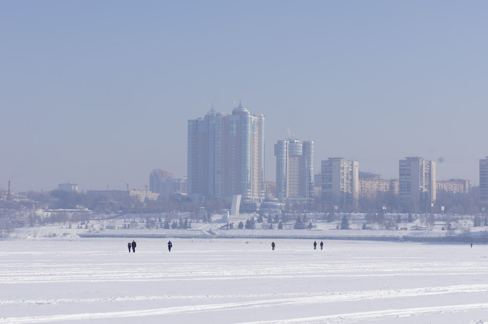
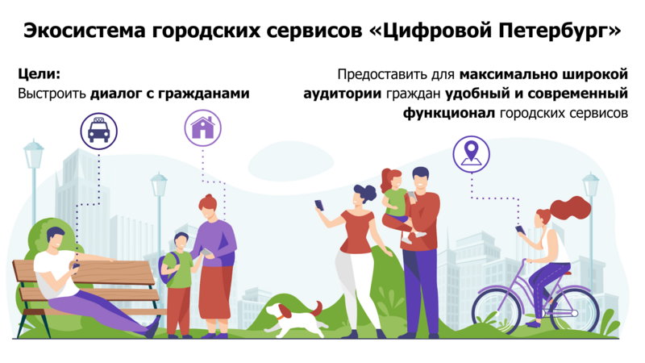

# Социальный капитал и Общие цели

## Преодоление {#overcoming}



Мой Друг, которого неоднократно упоминал в этом Тексте, спустя практически 20 лет после нашего выпуска из школы вдруг обнаружил неожиданную для меня привычку. Оказывается, он бегает по субботам. А я, признаюсь, с детства терпеть не могу ни бег, ни лыжи. Велосипед очень люблю, а бег и лыжи попали в чёрный список занятий. С этим другом мы вечно исследовали всякого рода [зависимости](p1-030-time.md#awareness_and_addictions), слушали [тяжёлую музыку](p2-150-absurd.md) и попадали в разные истории. Поэтому чего-то «правильного» и «полезного» я от него никогда не ждал. Только неформатное общение и приключения. Мне стало немного завидно, что у меня нет такого опыта, и я попросил пригласить меня в следующий раз… И вот через неделю, в пятницу вечером, когда я уже и позабыл об этом разговоре, он пишет:

— Ну что, завтра бегаем?

А я в постоянных разъездах, командировках и чтобы как-то обосновать свой отказ, перезваниваю ему и начинаю живописно рассказывать, как я замотался и собираюсь отдохнуть:

— Да я ещё в Шереметьево, мне лететь в Самару, а потом до дома ещё добираться! Хорошо бы заснуть к 3-м часам ночи! — как бы между строк, говорю ему, что не смогу.

А он меня выслушал и так кратко обронил:

— Так я сам в Домодедово.

Бляха-муха, думаю… Ну а я, тряпка что-ли? Не сливаться же!

— Хорошо, до завтра!

На утро с замиранием сердца продираю один глаз и смотрю в телефон с надеждой — не нашёл ли причину «не бежать» товарищ? Но нет… Нехороший человек. Пишет, что собирается и выходит. Что же делать? Сливаться в такой ситуации и изменять своим принципам и данному слову для меня немыслимо.

Смирился, собрался и приехал на набережную. Неторопливая пробежка, приятная беседа, разогрев. И вот уже и купание в проруби не кажется идиотской затеей, и ты стоишь на снегу, от тебя валит пар, но при этом не холодно, удивительно легко и глубоко дышится… А вокруг… Бескрайнее пространство Волги и силуэт Самары в морозной дымке… Счастье :-)



**_Зимняя Самара с Волги_**

Если системно разобрать эту ситуацию — что произошло?

У нас разный жизненный опыт и воспринимаемся мы сильно по разному, но у нас также множество общих интересов и он тоже [психотипа Архитектор](./p1-020-call.md#architect_personality). У нас сравнимый уровень серьёзной нагрузки и дефицит времени, мы друг другу ничего не должны, но друг друга уважаем. Для каждого из нас — данное слово весомо.

Я стараюсь естественным образом [испытывать физические нагрузки](p2-140-digital.md#health) и заставлять себя делать экстра усилия после нервной работы — довольно трудно. Поэтому могу легко себя оправдывать, когда игнорирую объективно полезные, но не особо любимые мной спортивные занятия.

Но тут изначально сработало данное мной обещание. А по завершению первой пробежки договориться о следующем разе существенно проще. И эта повторяемость и прозрачность временных инвестиций — каждую субботу, пару часов, играет немаловажную роль. Я даже представил, как подписал сам с собой контракт — тратить 2 часа в субботу на совместное занятие, которое является Преодолением. Именно сам с собой — [мне никто ничего не должен](p1-040-unhappiness.md#egocentrism). Также для меня был важен момент отсутствия всяких напоминалок и будильников. Если бы решил бегать один и поставил себе в календарь повторяющиеся блоки и настроил будильники, очень быстро случились бы поводы по работе или в семье, из-за которых этот договор я бы с раздражением разорвал. Объективно, рабочая нагрузка всегда была высокая. А тут ты видишь, что при приближении исполнения контракта твой товарищ, такой же занятый, готов его исполнять. И ты САМ исполняешь свой контракт также. Круговая порука в достижении Счастья :-)

Совершенно очевидна мысль о том, что чаще всего [моменты Счастья](p1-010-happiness.md#moments_of_happiness) наступают после Преодоления. Иногда этого Преодоления слишком много по жизни, когда давно выработал привычку на автомате совершать действия, которые тебе несвойственны. Например, [постоянно общаться, будучи Интровертом](p1-020-call.md#introvert_extravert). Или [ориентироваться по ситуации, когда любишь всё планировать](p1-020-call.md#judging_perception). И от этого постоянного Преодоления уже подташнивает и Счастья оно в таком виде не приносит. А когда разделяешь это Преодоление в достижении Общей Цели с человеком схожих ценностей — становится легче. Настолько легче, что жизненных сил хватает на усложнение Преодоления…

## Шило в Ж… {#ants_in_your_pants}

Субботние пробежки были ещё обменом историями и наблюдениями по жизни. И вот зашла речь о том, что его новые знакомые собираются в Жигулёвскую Кругосветку на байдарках и ищут желающих присоединиться. Ходил я в этот [знаменитый поход](https://ru.wikipedia.org/wiki/Жигулёвская_кругосветка) с одноклассниками ещё в средней школе и с тех пор сохранилось мощное подростковое романтичное воспоминание, которое хотелось повторить, но уже со своими детьми.

**_Волга в районе Васильевских островов_**

В кругосветку мы сходили — и так я попал в компанию друзей, которым не сидится на месте. Которые постоянно планировали какие-то совместные путешествия. Вместе мы проходили через трескучие морозы, горные болезни, болотную сырость, натирали кровавые мозоли и в завершении все вместе становились счастливыми. Название у группы в мессенджере — «Шило в ж…» Впрочем, соль названия именно в слове Шило, которое не даёт сидеть на месте, заставляет поднимать эту Ж, куда-то идти, что-то придумывать. Снова и снова.

Шило это торчит необязательно у кого-то одного. Оно может даже не у всех и есть. Вообще, по моим наблюдениям, оно переходящее. Но когда кто-либо в группе обозначает свою готовность идти на Алтай, или Маньпупунер, или Эльбрус, Казбек, Хибины… Не важно. Каждый внутри задаётся вопросом: «А я пойду?» И когда наблюдаешь, как осторожно начинает формироваться группа хорошо знакомых тебе людей, у которых также есть всякие вопросики по здоровью, дети, семья, работа — внутренне говоришь ДА, я тоже пока ещё могу разрулить свою непростую ситуацию и вписаться в очередное преодоление. Не было бы этого Шила в моей жизни, не срывался бы я из дома и так задолбанный по работе — не было бы значительной части богатства, которое я имею. И, естественно, разговор не про деньги, а про счастливые моменты единения с природой, куда мы вместе добирались. [Несколько фотографий выложил в альбом](https://photo.bongiozzo.ru/disk/shilobest).

Группа ширилась — появились «Шило-Девочки». И плодилась — выросло и сформировалось «Детское Шило». Это Шило стало целым общественным движением. И оно общее, как и Цели, движение к которым приносит Счастье.

## Сценарии использования системы {#use_case}

Проанализировав свои мотивы, я подумал, что мне бы помогла система, в которую можно вносить Контракты с самим собой. Контракты на инвестиции времени, которое я готов тратить на движение к большим Целям.

Такое планирование, как упражнение, многие коучи выделяют как обязательное. У [Кови было еженедельное планирование времени](https://www.livelib.ru/review/3792199-sem-navykov-vysokoeffektivnyh-lyudej). И я для себя вёл такие заметки. Но мне было понятно, что эта система не должна подменять мою Волю и не должна стать ещё одним цифровым помощником, который никогда не устаёт, следит за временем с точностью процессора и вызывает раздражение всякий раз, когда говорит мне, что я должен делать. Но мне было бы любопытно сверяться с динамикой в достижении общих со мной Целей другими людьми. И тогда мне самому, скорее всего, захочется. И Воля ведь нужна своя, а не цифровая.

Такой функционал является анализом моей мотивации из историй, рассказанных выше. Возможно, для [других психотипов](p1-020-call.md#mbti_personalities) такая мотивация не будет работать. Но мне видится, что в ней нет никаких скрытых или явных манипуляций и самообмана. Всё просто, честно и объективно.

Самый ценный ресурс — [время, которым надо уметь управлять](p2-140-digital.md#time). Если тратить время не только на свои, но на общие цели вместе с другими, то шанс испытывать [моменты Счастья](p1-010-happiness.md#moments_of_happiness) значительно выше. И тогда мы и общество становится более Счастливым. Прекрасно.

Взаимодействие с этой платформой должно быть, как будто бы, растворено в привычном канале коммуникаций. Она не должна стать «ещё одной системой».

Общаешься в группе в Telegram или в сообществе ВКонтакте и тут же можешь в «два нажатия» отметить свои планы по движению к Цели. Например, готов присоединиться к благоустройству «Детской площадки во дворе» по QR ссылке, которую увидел на двери и в чате дома ВКонтакте. Навёл, два нажатия, готово! Как только получилось выделить 20 минут и прикинули с соседом смету работ в Telegram — ещё минута, и не выходя из мессенджера боту отправлен микроотчёт. Инвестировал 20 минут, «Создание сметы» записал в поле «Было сделано», «Следующим шагом» планируем «Закупить расходники». А это значит, что другие участники получат в удобном для них формате, и канале коммуникаций, когда они сами захотят, статус о динамике по этой Цели.

Платформа должна быть [максимально открыта](p2-170-opensource.md), а сущности для учёта, в общем и целом, элементарны:

### Сущность: Цель {#entity_goal}

Цели у людей, как мне кажется, по большей части, являются Общими. И типов этих Целей не так уж и много. Большинство хотят найти работу с большей зарплатой и жильё поудобнее, иметь фигуру постройнее, мышцы порельефнее. И даже в этих персональных целях, как правило, всегда есть желающие присоединиться.

Если зарплатой озадачился муж, то жена также будет заинтересована, и от неё многое зависит. Учиться на новую профессию намного эффективнее вместе. Худеть тоже лучше в компании с друзьями и соседями. Неоднократно замечал в командах, где посчастливилось работать — когда объединяются изначально очень разные люди, которые горят одной идеей, не щадя себя работают, «искрят» и спорят в поиске лучших решений и вместе идут к Общей Цели — в какой-то момент они начинают испытывать общее Счастье. И значит, можно найти способ нагляднее показать взаимосвязь и помочь сделать первый шаг.

Цели могут быть глобальными — «Бегаем вместе!» Могут быть территориально специфичны — «Строим детскую площадку». Или «Озеленяем [Васильевский остров](p2-130-local.md#love_to_vo)». Публичные цели можно найти в каталоге платформы по ключевым словам или по территориальному признаку, поделившись локацией. Или наведя телефон на QR, который привлёк внимание во дворе дома. В браузере, в мессенджерах, в соцсетях. Для айтишника, который сидит в командной строке, вероятно, подойдёт команда типа `join Run Every Day && commit 1 hour`. Должны поддерживаться разные сценарии через разные клиенты к платформе.

Могут быть цели, ограниченные конкретными участниками — муж с женой и всё. Или 3 друга-предпринимателя объединились, чтобы создать новый бизнес. В такие Цели вступают по приглашению, по сформированной и присланной ссылке.

Цель может быть и вовсе персональная. Хотя это вырожденный сценарий общей цели, в которой пока никого нет, кроме автора.

Что конкретно делать для достижения каждой цели, на самом деле, вторично. Самое важное — выделять время. В конце концов, если не знаешь, что делать — начинай составлять план движения к цели. Подготовка тоже требует времени.

### Сущность: Контракт {#entity_contract}

Время, которое ты готов тратить, представляет собой суть Контракта. Один час в неделю или 20 минут в месяц. Неважно. Количество выделяемого времени и периодичность у участников может быть совершенно разные. Важно начать с чего-либо, больше чем 0.

Мне было бы любопытно периодически получать сводку по Целям, к которым присоединился. Сколько участников активно, сколько человек реально исполнили контракты и что они при этом делали? Видится важным «дозреть» до активных действий самостоятельно, лишь наблюдая за другими участниками.

Если не получается выделить запланированное Контрактом время в полной мере, можно в пару кликов его сократить и Исполнить. Главное — само движение, а не как быстро и кто первый.

### Сущность: Исполнение {#entity_commit}

Когда Контракт сам считаешь исполненным, можно сделать короткую отметку. Commit. Исполнено.

Это самая часто обновляемая сущность системы. Чем больше этих исполнений, «коммитов», тем больше полезной информации для мотивации себя и других.

Отметка по умолчанию заполнена временем из Контракта. Также хорошо бы указать, что «Было сделано» и что планируется сделать «Следующим шагом». Если это Исполнение Контракта уже не первое и в прошлой транзакции был указан «Следующий шаг», то можно его подставить в поле «Было сделано». Короткие сообщения дают представление о том, что происходит с Целью. Если человеку неинтересно разбирать эти потоки сообщений, то [Искусственный Интеллект легко справится с этой рутиной](p2-160-routine.md#routine_and_improvement) — выдать резюме происходящего, найти зависимость, предложить следующий шаг.

Чаще всего моменты Счастья наступают после успешного Преодоления движения к Цели. А Счастье становится наиболее ощутимым, когда им можно поделиться с теми, кто разделяет Общую Цель.

Если Исполнение Контракта было в какой-то степени Преодолением и привело к повышению эмоционального тона или даже стало [моментом Счастья](p1-010-happiness.md#moments_of_happiness) — это можно отметить особым флажком с яркой эмоцией. По типу того, как это происходит в элементарном, но качественно сделанном приложении [How We Feel](https://howwefeel.org/). Тогда мы получим в одной системе поток моментов созидательного Счастья, [частью которого ХОЧЕТСЯ быть](p1-010-happiness.md#what_is_happiness). Цели, в которых чаще всего у разных людей возникают моменты Счастья,  можно, пожалуй, считать действительно достойными, без скрытых манипуляций.

В поле «Следующего шага» можно повторить значение «Было сделано» или взять следующий пункт из Плана действий для этой Цели.

### Сущность: План действий {#entity_instruction}

План действий — опциональная сущность. В стремлении всё разложить по полочкам и пунктикам таится риск чрезмерного микроменеджмента, который убивает творческое начало. И нужно искать [баланс](p2-110-system.md#dualism). И, на мой взгляд, если выработать привычку кратко описывать «Что было сделано?» и «Что делать далее?», то этого будет достаточно для большинства целей.

Однако и люди разные, и задачи могут быть космически сложными, новыми и непонятными.

Формированием планов действий могут заниматься эксперты. Как от лица государства — сотрудники министерств и исполнительных органов, которые «на службе». Так и профессионалы-коммерсанты. В этой сущности заложена потенциальная возможность для монетизации системы. Ведь каждый потенциальный контрагент захочет предложить для целевой аудитории план действий, где одним из пунктов будет его услуга.

Но не хочется накручивать идею заработка изначально. Она есть, но система движения к Целям прежде всего [должна быть открытой](p2-170-opensource.md). И этим отличаться от остальных.

## Аналоги систем целеполагания {#goal_setting_systems}



С появлением Интернет, как грибы после дождя, начали рождаться системы для обмена сообщениями, а значит — эмоциями. Никаких Telegram, ВКонтакте и даже Facebook в помине тогда ещё не было, поэтому был интерес создавать своё. В конце 90-х с друзьями [спроектировали и создали чат платформу Samara Pub](p1-020-call.md#architect_personality) с социальными ролями, игровыми персонажами-роботами и внутренней валютой. Первую версию написал и запустил за одну ночь, на спор :-) Какой-либо цели, кроме получения радости от общения с друзьями, не было. А их появилось несколько сотен в разных городах.



Посмотреть, как это выглядело можно в [архивах Интернет](https://web.archive.org/web/20010429231340/http://www.mustdie.ru/Pubman/). Спустя несколько лет, в отсутствии цели и поддерживающих процессов, сервис естественным образом прекратил своё существование, но остались друзья и приятное чувство ностальгии.

Как зарабатывать на интернет-сервисах, находясь на периферии, я тогда не понимал и был нацелен на заработок в проектной корпоративной среде. Где [в тот момент безраздельно царил Microsoft](p1-020-call.md#dream_job_checklist). В компании тогда как раз только придумали и запустили платформу для совместной работы в движении к корпоративным целям — SharePoint. Примечательно, что платформа была бесплатной (но не открытой) и довольно быстро распространилась в корпоративной среде по всему миру. Россия стояла чуть особняком — платформа Битрикс успела занять рынок. Но в Microsoft, как и в других мировых корпорациях, прежде всего SharePoint использовался для достижения согласованного движения сотрудников к целям корпорации.

Руководство корпорации определяло стратегию конкурентной борьбы, определяло цели, которые раскатывались на всех сотрудников через, так называемые, Commitments. Как минимум дважды в год происходила выверка и корректировка этих целей. Впрочем, про эту [методику формирования корпоративной культуры уже было сказано](p1-020-call.md#dream_job_checklist).

Эти платформы и инструменты имеют очень чёткую специализацию на корпоративный сегмент и рабочие процессы. Хотя и привносят в неё элементы геймификации из социальных сетей. С трудом представляю себе туристов-велосипедистов, которые купили платную подписку Битрикс24, чтобы перенести туда планирование и обсуждение покатушек на выходные. Хотя есть, конечно, исключения и я знаю таких людей :-)

Само [понятие целеполагания неестественно для человеческой натуры](p2-140-digital.md#summary_and_references) — эволюция миллионы лет «заботилась» лишь о том, чтобы вид выжил. Однако и представления о работе и увлечениях меняются. Между ними стираются границы. Люди всё больше зарабатывают, занимаясь любимым делом, а технологии в этом не только помогают, но уже и [вынуждают следовать за Призванием](p2-160-routine.md#smart_assistants), забирая на себя рутинную деятельность. Прогресс неостановим. Процесс коммуникаций постоянно улучшается и изменяется в условиях конкуренции. И [после 5 уровня развития личности](p2-120-school.md#brief_happiness_model) для достижения Счастья без стремления к Идеалам и следования Целям не обойтись. И потребуется нарабатывать собственную Волю, Привычки и образы Счастливого Завтра, в которые поверит большинство.

Согласованные действия и коммуникации для достижения целей компании критичны в конкурентной среде. Facebook, который бурно рос как канал коммуникаций в социальной среде, в корпоративной среде не применяется. И Facebook, и Instagram построены с центром в «Я» концепции с лентой личных достижений. А любая компания базируется на «МЫ» концепции. При этом наработки Facebook можно перенимать. Так Microsoft купили корпоративную социальную сеть Yammer и продолжают её развивать как Viva Engage, вводя чат-ботов и искусственный интеллект. В России также есть аналоги — вот пример [корпоративной социальной сети DаOffice с функционалом вовлечения сотрудников в общие цели](https://www.daoffice.ru/functional#communication). Но эти инструменты социализации и вовлечения сотрудников специфичны только для корпоративной среды, но не общественной. А разделять работу и увлечения [неэффективно для счастья](./p1-020-call.md#frequent_happiness).

## Принципы Telegram {#telegram_principles}

На мой взгляд, из универсальных каналов коммуникаций на текущий момент наиболее интересен Telegram. Не столько благодаря бесспорному таланту Дуровых, сколько благодаря принципам, которые они заложили:

- использование [концепции Open Source для клиентских приложений](p2-170-opensource.md), что формирует доверие и надёжность,
- отказу от [манипулятивных техник рекомендаций и отсутствию навязчивой рекламы](p1-040-unhappiness.md#information_flow), болезнями других систем,
- [постоянным улучшениям](p2-140-digital.md#continual_improvement), которые являются следствием движения к
- амбициозной Глобальной Цели процветания и приятного общения с миром.

Доверительное общение пользователей в Telegram сформировало кровеносную систему. Для которой была изначально спроектирована платформа приложений-роботов. И эти чат-боты, сначала без особых мозгов, а теперь с искусственным интеллектом, без устали [делают за людей рутинную работу](p2-160-routine.md). Накачивая эту систему не только человеческими эмоциями, но и TON-криптовалютой.

Хотим мы или нет, но в удобном Telegram всё больше обсуждается рабочих вопросов, которые смешиваются с другими целями, также требующих общения и времени. Увлечённые и счастливые люди чаще всего не отделяют работу от личной жизни. И пользователи не будут доверять неудобным закрытым системам, когда сформировано представление, как выглядит защищённая, быстрая и удобная.

## Поиск баланса {#seek_balance}

И значит платформа Общих Целей должна быть одинаково проста, удобна и доступна в привычных каналах общения, которыми пользуются и на работе и в личной жизни. Нужно найти [баланс рациональных и иррациональных подходов](p2-110-system.md#dualism) для ощущения вовлеченности и счастья. Нужно объединить людей стремлением к идеалам, но [ограничить количественные персональные показатели](https://www.livelib.ru/quote/46659634-ne-otorvatsya-pochemu-nash-mozg-lyubit-vsjo-novoe-i-tak-li-eto-horosho-v-epohu-interneta-adam-alter), которые сравнивают тебя с другими и делают несчастным. Счастье заканчивается там, где начинается Сравнение.

> Социальные сети стоило бы избавить от количественных показателей, чтобы люди не использовали их для социального сравнения и постоянного целеполагания.

Нужно отдавать отчёт, что [геймификация должна вовлекать и способствовать возникновению моментов созидательного счастья](https://www.livelib.ru/quote/46659631-ne-otorvatsya-pochemu-nash-mozg-lyubit-vsjo-novoe-i-tak-li-eto-horosho-v-epohu-interneta-adam-alter), а не создавать новые зависимости и не являться скрытыми способами заработка.

> Геймификация — мощное средство, и, как все мощные средства, она имеет и побочные эффекты. С одной стороны, она делает рутинные и неприятные вещи увлекательными и радостными. Она дарит больным облегчение боли, школьников избавляет от скуки, а игроки получают возможность жертвовать средства нуждающимся. Одни только эти результаты придают ей важность и ценность. Это хорошая альтернатива традиционным медицинским приемам, методикам обучения и подходам к благотворительности, потому что во многих отношениях все эти подходы глухи к стимулам человеческой мотивации. Но Ян Богост совершенно справедливо указал на опасности геймификации. Такие игры, как FarmVille и Hollywood Ким Кардашьян, эксплуатируют человеческую мотивацию ради финансовой выгоды. Они обращают геймификацию против игрока, который попадается в непреодолимо соблазнительные сети игры. Но, как я уже говорил, технология не бывает только хорошей или исключительно дурной. То же относится и к геймификации. Лишенная фальшивой популярности и наукообразного названия, геймификация — это эффективный способ построения любого опыта. Игры прекрасно снимают боль, делают скучное увлекательным и поощряют благотворительность, делая ее интересной и приятной.

## Прототип Общих целей — Shared Goals {#shared_goals}



С [Другом](p2-100-authors.md#onegin), с которым познакомились в Samara Pub и который продолжал заниматься любимым программированием, решили сделать действующий прототип. И сделали — по наброскам и сценариям Женя реализовал MVP (Minimum Viable Product, Минимально жизнеспособный продукт). Мы изначально проектировали модульную архитектуру и следовали [концепции Open Source](p2-170-opensource.md). [Это первый опытный образец](http://web.sharedgoals.net), в котором можно пройти пользовательский сценарий. Дальше нужно было формировать команду разработчиков, брать тестовые группы людей с активной жизненной позицией и вовлекать других пользователей.



Но тут мне подвернулся случай попробовать себя на поприще международной деятельности — экспорт отечественных ИТ разработок в страны Юго-Восточной Азии. Это был очень интересный опыт. Всерьёз заниматься запуском системы, будучи в разъездах, на мой взгляд, совершенно нереально, и процесс приостановился. Пара лет у меня ушло на погружение в совершенно иную культуру бурно растущего Вьетнама. Прививка понимания, что привычные нам вещи выглядят совершенно по-иному в системе координат другой страны, была очень ценная и заслуживает отдельной главы.

## Социальный капитал {#social_capital}

А следом после Вьетнама пришло приглашение заняться созданием [экосистемы городских сервисов в Петербурге](p2-130-local.md#mini_app_vkontakte). Где мы начали определять принципы и искать проверенные модели как надёжную основу для экосистемы.

**_Презентация 2020-го года — Цели не меняются_**

И тогда я впервые услышал от [вице-губернатора Казарина Станислава Валериевича](https://t.me/skaz_spb) о [Социальном капитале](https://ru.wikipedia.org/wiki/Социальный_капитал). Понятие интересное и глубокое. Но при первом его упоминании оно обычно вызывало ассоциацию с Социальным Рейтингом. Образом цифрового контроля и поощрений для гражданина, который СМИ раскрутили в рубрике «Их нравы» о современном Китае. И ассоциация эта не сказать, чтобы была позитивная. У россиян восприятие Социального рейтинга из таких заметок вполне однозначное — это численная оценка лояльности гражданина к власти. Перешёл дорогу на красный свет — получай минус в карму, причём с публичным порицанием на ближайшем экране. Не заплатил налог вовремя — получай ещё. Такой [технократический рациональный подход в управлении обществом](p2-110-system.md#god_and_science) начал описывать [петербуржец Замятин в антиутопии «Мы»](https://www.livelib.ru/book/1009002958-my-evgenij-zamyatin). И лишь позднее подхватили Оруэлл и Хаксли, а наши современники сняли сериал «Чёрное зеркало».

Русский менталитет, [сформированный на наших бескрайних просторах](p1-050-country.md#big_size_matters) восстаёт против такой системы при первой же ассоциации.

Впрочем, когда я начал перепроверять образ Социального рейтинга глазами самих китайцами, стало понятно, что образ этот сфабрикован. Также как образ русских с водкой и медведями на улицах. Пока сам не поживёшь с местными — представления реалистичного не составишь. Жизнь и заботы среднестатистического китайца в мегаполисе без прикрас можно увидеть, например, в [нетуристическом репортаже «Погнали!»](https://youtu.be/5ByThkUVwrM?si=yQoNL0C2vQGsTWGP), а также в последующем разборе этого репортажа с экспертами.

В том же анализе выделили отличительную особенность китайцев, которая также заметна у вьетнамцев и, наверное, у большинства азиатов. В их культуре намного ярче, чем у нас, выделено стремление быть богатым. Вероятно, это объясняется несколькими столетиями выживания, другой культурой, религией, системой ценностей и, как следствие, другим менталитетом.

Товарищи, которые ездили в Китай лет 15 назад, возвращались немножко изменённые:



— Представляешь, вот приехали мы в город размером больше чем Москва. При этом название этого города никогда в жизни и не слышали до этого. А таких несколько в Китае. Идём по мегаполису, переходим через шоссе по пешеходному мосту, поднялись на несколько метров над людским потоком. И это нескончаемая река китайцев, которые спешат на работу. Выглядят и одеты по разному, но бросается в глаза, что по сравнению с нами, практически не видно праздношатающихся! Самое поразительное, что на лицах видна общая цель — работать и зарабатывать. И это мощное впечатление. Это как стихия, которая не знает преград. Это даже страшно.



На мой взгляд, единый порыв населения и направляющая роль руководства стали причинами роста экономики, которая в динамике превосходит все другие страны.

Однако я отвлёкся, и понятие Социальный капитал, в любом случае, совершенно про другое.

На мой взгляд, Социальный капитал определяется готовностью вложиться своим временем (прежде всего своим трудом) в задачи, которые касаются не только «себя любимого». Чаще всего проявляется в [благоустройстве общего места жительства](p2-130-local.md), хотя этим не ограничивается. Примечательно, что рост Социального капитала означает возникновение новых моментов Счастья не только у тех, кто вложился и прошёл через Преодоление, но и у тех, кто пользуется этим капиталом. Хотя у них они проявляются не так ярко.

## Социальный капитал на практике {#social_capital_in_practice}

Давайте представим город, в котором администрация и жители друг друга дополняют и поддерживают.

### Финансовый ликбез {#social_capital_finance}

Вероятно, одной из первых общих целей является повышение доходов малообеспеченного населения. Отдать часть денег малообеспеченным — очевидный, но неработающий в долгой перспективе подход. Отчаявшиеся люди без веры в завтрашний день продолжают зарывать деньги и свои таланты в землю. Ничего не поменялось с времён этой [библейской притчи](https://ru.wikipedia.org/wiki/Притча_о_талантах). Требуется [вкладываться в финансовую грамотность](p2-140-digital.md#money) ещё со школы. Без привычек управления деньгами состоятельности не будет. [Город вкладывается в ликвидацию финансовой безграмотности](p2-140-digital.md#finance_for_citizens), запускаются инициативы информирования о [дефиците кадров на производстве](https://петербург-заводской.рф/) и попытки представить [профессии завтрашнего дня](https://new.atlas100.ru/). Но базово нужно [понимать свои сильные стороны](p1-020-call.md#mbti_personalities) со школы и [следить за постоянно меняющимися условиями вместе с цифровыми помощниками](p2-160-routine.md#smart_assistants). Вложение времени в поиск Призвания и практические занятия по развитию навыков управления деньгами, как учащихся, так и преподавателей, будут инвестициями в Социальный Капитал.

### Экология {#social_capital_ecology}

Или экология. Допустим, в условном городе избыток машин и изначально неприспособленная под нагруженный транспортный поток инфраструктура. И вот жителям сообщают:

— У нас по статистике сейчас в городе 1 миллион машин в сутки передвигается. Мы хотели бы сократить загазованность и улучшить вид города. Для этого вкладываемся в развитие общественного транспорта. Если одобряете Общую цель сделать наш город более экологичным и готовы пересесть с Вашего личного автомобиля с двигателем внутреннего сгорания на общественный транспорт — подключитесь к этой цели. Время, которое Вы провели в транспорте вместо автомобиля, будет вкладом. Мы не обещаем каких-то бонусов, это не про «Ты мне — Я тебе». Это наша Общая Цель. Мы готовы рассказывать, что мы планируем делать, и воспринимать конструктивную критику. Нам важно заранее понимать — где эта инициатива будет хорошо работать, а где не очень. Ваши персональные данные о перемещениях никуда не передаются, но мы сможем точнее посчитать динамику в достижении цели, а Вы будете видеть свой вклад в Общую цель и лучше понимать проблематику.

Если помимо отказа от личного автомобиля Вы проделали путь пешком — то каждые 10 минут прогулки также пойдут в зачёт Общей цели экологичного города. А также будут учтены как инвестиции в Цель поддержания физической формы.

### Озеленение {#social_capital_green}

В сообществе активистов озеленения озвучили Общую цель:

— Хотим высадить 1000 деревьев и приглашаем волонтёров. Посмотрите условия, они несложные. Может быть, Вам будет по силам высадить своими руками 2-3 дерева и знать, что в нашем городе есть и Ваши деревья? Укажите количество часов, которое Вы можете потратить на это занятие и мы обещаем, что ни разу сами не побеспокоим Вас :-) Мы не про то, чтобы вызывать чувство неудовлетворённости от собственных неисполненных планов. Однако с этого момента мы будем знать, что есть ещё один потенциально желающий стать причастным к нашему делу, а Вы будете в курсе — сколько людей присоединились к этой же цели, сколько исполнили свои намерения и сколько времени суммарно потратили. Мы хотим поддерживать каждого в достижении наших общих целей и предоставим информацию об общей динамике.

Социальный капитал города растёт, когда жители тратят время на раздельный сбор мусора, когда они становятся здоровее на спортивных площадках и мероприятиях. Когда соседи видят заявки по благоустройству в городские службы от неравнодушных соседей и сами вовлекаются — ведь даже несколько минут на ознакомление с обращениями по своему дому и выделение наиболее важного — уже вклад. [Безразличия становится меньше, когда сам потратил хоть минуту](p2-130-local.md#old_samara). И тогда эти обращения уже не просто жалобная книга, а общее дело, и город может исправлять проблемы в порядке их важности для всех. А не в том порядке, в котором они создавались неизвестным соседям активистом. Зачастую вопреки интересам проживающих, но в рамках какого-то законного требования.

И тогда Социальный Капитал это не персональная метрика, а средний интегральный показатель всех инвестиций времени всех участников всех общих целей, которые объективно идут на пользу общества. Через геймификацию и привлечение отраслевых спонсоров можно будет выдавать какие-то медальки, но именно [причастность к общему движению без явного эгоцентризма делает людей счастливыми](p1-040-unhappiness.md#egocentrism). И это должно оставаться основным мотивом. Иначе выделение персонального вклада обретёт черты пресловутого Социального рейтинга — будь-то медальки за достижения или доски позора.

## Общие Цели для граждан {#shared_goals_for_citizens}

Таких целей у города десятки и сотни, а с учётом отдельно взятых зданий и дворов — тысячи. Их нет надобности придумывать — активисты уже объединились в сообщества социальных сетей, привлекая внимание к решению задач. В Петербурге действует [практика инициативного бюджетирования «Твой Бюджет»](p2-140-digital.md#your_budget), в федеральном Агентстве Стратегических Инициатив собирают [«Сильные идеи нашего времени»](https://идея.росконгресс.рф/), и по моим оценкам более 30% идей, по своей сути, являются попытками вовлечения неравнодушных граждан в Общие Цели для города и страны.

Создание единой платформы для вовлечения в Общие Цели позволит:

- объединять усилия,
- соотносить эти Цели между собой и расставлять приоритеты,
- прилагать больше внимания и ресурсов к тем, где динамика неудовлетворительная.

И тогда единая платформа SharedGoals может стать инструментом для подсчёта динамики роста Социального капитала. Ведь временные инвестиции, сделанные в эти Общие Цели и учтённые в системе, будут Социальным Капиталом. На базе единой платформы впоследствии станет возможным выработать единые стандарты для интеграции. И тогда ввод этих транзакций для учёта Социального Капитала может быть полностью автоматизирован. Тем более когда городские сервисы соответствуют принципам Открытого Правительства и также имеют программные интерфейсы (API) для интеграции. [Цифровой Петербург изначально создавался открытым и соответствовал этим принципам](p2-140-digital.md#api_petersburg_ru), что делает его сервисы доступными в разных каналах коммуникаций.

На платформе ВКонтакте уже существуют сообщества для любых социальных ролей — «Я за экологию», «Я фотограф», «Я музыкант» и т.д. Государство также создаёт сообщества по отраслям и территориям, именуемые Госпаблики. Там ведётся, как правило, одностороннее информирование.

Но если в уже созданные сообщества размещены «виджеты» связанных Общих Целей, где легко найти актуальные Планы действий инвестиций в Общие цели, сформированные экспертами или непосредственно городскими службами, и также легко отметить Исполнение собственного контракта, тогда может начаться максимально предметный и конструктивный разговор: «Что мешает? Чего не хватает?» В том числе с использованием Искусственного Интеллекта.

## Новая трактовка понятия Умный город {#smart_city}

И тогда уже немодное и выхолощенное понятие Умный город может приобрести новый смысл.

Про умные города обычно говорят в контексте каких-то дорогостоящих городских проектов с камерами и датчиками, звучат слова про Цифровизацию, как [100 лет назад звучали слова про Электрификацию](p1-040-unhappiness.md#new_hope). Всё это так. Но! Что это означает для жителей? С Электрификацией было понятнее — лампочка в каждом доме! А тут, не думаю, что все чувствуют конечный результат Цифровизации. И отсюда вопрос — насколько это вся [Цифровизация делает жителей по-настоящему счастливыми](p1-040-unhappiness.md#gadgets)?

Создавались индексы счастья, которые в одно время появились в разных странах, но эти индексы завязаны преимущественно на деньги и экономику. Хотя [счастливый человек совсем не то же самое, что обеспеченный](p1-040-unhappiness.md#money_for_nothing)!

Счастливый человек обычно не чувствует себя стеснённым в возможностях, которые есть у окружения, но понимает, как его вклад помогает обществу, частью которого он является. Счастливый человек сравнительно здоров, у него есть интересы и увлечения. Идеально, если он состоялся и чувствует признание в области его интересов. Он отдохнул и у него хватает батарейки жизненных сил на духовный рост. В целом, [он понимает свои цели, представляет Путь к ним и чувствует движение](p2-120-school.md#brief_happiness_model). Но также он чувствует, как растёт Социальный Капитал города, в котором он живёт. И Город можно назвать Умным, если его Социальный Капитал растёт быстрее, чем в других городах. И жители такого Города, скорее всего, будут более счастливыми.

## Проверка баланса {#balance_check}

Ощущение, что чем бы я ни занимался, в итоге опять начинаю собирать конструкцию Общих Целей. И вряд ли успокоюсь, пока не появится в каком-то виде платформа, где люди смогут объединяться и мотивировать друг друга в достижении общих светлых целей, при этом становясь счастливее.

Важно, что одна платформа Общих Целей может объединять все области интересов взрослого человека. И личные, и семейные, и рабочие и общественные. По сути, это создание открытой социальной сети с фокусом не на Я, а на достижение Общих целей из разных областей жизни.

Для России такой подход, на мой взгляд, весьма органичен по культурному коду:

- Он инженерный, но простой и открытый для развития — [ведь Кулибины у нас во все времена были](https://ru.wikipedia.org/wiki/Кулибин,_Иван_Петрович);
- Главным приоритетом не являются Деньги. [Хотя и они тоже не забыты](p2-140-digital.md#finance_for_citizens);
- Подход не такой уж конкурентно-рационально-соревновательный. Не в стилистике «достигаторства» и Я-лидерства. Далеко не все в этом видят своё Счастье. Хотя он формирует привычки и [учит ответственно относится к самому ценному ресурсу — Нашему Времени](p2-140-digital.md#time);
- Это больше про баланс и компенсацию недостающих [Духовных Идеалов](p2-110-system.md#god_and_science), которые всё больше растворяются в современном технократическом обществе;
- Это создание Счастливого Общества вне партий и политики, [в концепции открытого кода и правительства](p2-170-opensource.md);
- И постоянные поиски такой конструкции — опять же наша особенность. Достаточно [вспомнить целую плеяду русских космистов](p2-130-local.md#russian_cosmism).

Ведь Космос, как понятие, [изначально было не про физику, ракеты и технологии, но, в том числе, про духовные идеалы, смыслы и мироздание](https://www.livelib.ru/quote/46881931-kratkaya-istoriya-vsego-ken-uilber). В балансе.

> Вопрос: Мы проследим развитие эволюции в различных сферах, от материи до жизни и разума. Вы называете эти основные области материей, или космосом, жизнью, или биосферой, и разумом, или ноосферой. И все три области вы называете словом «Космос»?  
> Кен Уилбер: Да, пифагорейцы ввели понятие «Космос», которое мы обычно переводим как космос. Но изначальное значение этого слова — упорядоченная природа или процесс всех областей существования, от материи и разума до Бога, а не только физический мир, который соответствует сегодняшнему употреблению слова «космос» или «вселенная». Поэтому я хотел бы определить этот термин заново. И, как Вы говорили, Космос содержит космос (или физиосферу), жизнь (или биосферу), душу или разум (ноосферу) и божественное (теосферу или область божественного).

Собственно, одна из основных причин появления этого Текста именно в том, чтобы проверить и обосновать идею запуска этой системы на всех уровнях и в должном масштабе. Мне видится очень важным, что платформа развития Личности в обществе сбалансирована и изначально включает и Коммерческие и Государственные интересы. И при этом является [Открытой](./p2-170-opensource.md).

Наш Текст изобилует ссылками на цитаты из книг и основан на множестве моментов Счастья, которые происходили со мной и соавторами. Будет здорово услышать критические замечания по Тексту. Ещё важнее найти соавторов, которые дадут своё видение по этой теме. Ну и самое важное — найти единомышленников, которым будет любопытно присоединиться к общей цели запуска Shared Goals :-)

## Стратегическая психология глобализации. Психология человеческого капитала {#human_capital_book}



Уже когда завершал первый набросок этой главы, мне в руки попалось учебное пособие 2006 года для учащихся кафедры политической психологии — [«Стратегическая психология глобализации. Психология человеческого капитала»](https://www.livelib.ru/review/4165063-strategicheskaya-psihologiya-globalizatsii-psihologiya-chelovecheskogo-kapitala). Рекомендовали к прочтению этот труд петербургских политологов как всесторонний и фундаментальный взгляд восприятия Счастья. Забежав вперёд, посмотрел, чем всё заканчивается — в последней главе авторы приходят к выводу, что образ Счастья для общества есть основной мотиватор и инструмент политика.

И начал читать книгу с начала :-) В процессе непроизвольно кивал в согласии с рассуждениями и [выписывал цитаты одну за одной](https://www.livelib.ru/book/1001128870/quotes-strategicheskaya-psihologiya-globalizatsii-psihologiya-chelovecheskogo-kapitala).



Благодаря этой книге я лишь укрепился в собственной трактовке понятия Политика — это Искусство создать образ Счастливого Завтра для общества.

На первых страницах книги вводится мысль о [роли психологии для каждого ищущего ответы на важные вопросы человека](https://www.livelib.ru/quote/47214101-strategicheskaya-psihologiya-globalizatsii-psihologiya-chelovecheskogo-kapitala):

> Вероятно, что психология человека не исчерпывается кругом вопросов, заявленных в оглавлениях современных учебников, и необходимо рассмотреть, чем психологическая наука может помочь интеллектуалам вернуть свое место в жизни общества. Для этого можно попытаться расширить принятую сегодня дифференциацию психологического знания на сферы Разума, Воли, Бессознательного и Веры.

## 4 вида психологии в модели Счастья {#types_of_psychology}

Идея об органичном развитии всех четырёх типов нашего мышления настолько органично переплетается с [Путём Этапов Развития Личности (ПЭРЛ) и собственным жизненным опытом](p2-120-school.md#brief_happiness_model), что я не удержался продемонстрировать эти связи в контексте Счастья отдельно.

**_Путь Этапов Развития Личности_**

### Психология Разума {#psychology_of_mind}

Психология Разума [доминирует с начала технологического прогресса в нашем современном обществе](p1-030-time.md#scientific_progress). Психология построения выводов на основе фактов и причинно-следственных связей. Педагогика строится на этой же системе координат — в школе мы прежде всего получаем навыки рационального мышления, без которых, вероятнее всего, не сможем пройти кризис Независимости (4) в модели ПЭРЛ и начать достойно зарабатывать.

Наш организм, [формировавшийся эволюцией сотни тысячи лет, значительно не изменился за последние сотню лет](p1-030-time.md#human_body_for_happiness). Мы, строго говоря, не стали умнее. Но у нас стало намного больше доступной Информации, которой совсем недавно обладали лишь редкие мудрецы. Доступная Информация стала подменять навыки Вникать, Анализировать и Делать выводы. Можно следовать желанию в поглощении информации, но это не делает нас умнее и, тем более, счастливее. [Скорее наоборот](p1-040-unhappiness.md#intelligence_quotient).

### Психология Воли {#psychology_of_will}

Воля — это то, что связывает мотив и следующий за ним поступок. Мотив, направленный на самосовершенствование и, чаще всего, преодоление. Выживает тот вид, который в результате частого проявления Воли вырабатывает привычки и становится лучшей версией себя. В ситуациях прямой конкуренции за критические ресурсы это вопрос жизни и смерти. В современном обществе навыки Воли чаще нарабатываются в спортивной состязательности и лидерстве на работе. Но далеко не все граждане развивают их в должной мере для прохождения кризиса Подчинения (3) в модели ПЭРЛ. Уклад современного общества позволяет прожить без них. Общество инфантилизируется.  

Тысячи лет наиболее волевые представители Homo Sapiens завоёвывали чужие территории, но технологический прогресс создал риск полного уничтожения человечества. В 1944 году обескровленная Европа соглашается признать доллар основной валютой, после чего завоевания можно проводить более цивилизованно. Деньги окончательно становятся суррогатом Воли в современном обществе. Но если Волю нельзя украсть или передать по наследству, то Деньги ­можно. Именно поэтому [Деньги лишь кажущийся атрибут Счастья](p1-040-unhappiness.md#money_for_nothing). У настоящего Счастья за Деньгами стоит настоящая Воля, которая позволила их заработать.

### Психология Бессознательного {#psychology_of_unconscious}

Психология Бессознательного даёт возможность выйти за постоянные ограничения и требования Разума и Воли. [Концепция жизни в балансе](p2-110-system.md#polarization) требует отдыха и мышления, не имеющего ограничений. Утомившись от бесконечных рассуждений и волевых поступков душа требует свободы и отсутствия правил.

Если присутствует Шило в одном месте — можно ехать на край света, где снимаешь с себя ограничения социума и растворяешься в природе. [Испытываешь благоговение и состояние Счастья](p1-020-call.md#sense_of_awe).

Искусство по своей сути также свободно от ограничений и зачастую является Призванием в живописи, литературе, вокале, танцах и других видах творчества. Этот вид мышления, на мой взгляд, важно развить, чтобы пройти кризис поиска Интереса (5) в модели ПЭРЛ. Слушаю максимально [абсурдную, но от этого такую притягательную тяжёлую музыку](p2-150-absurd.md) и играюсь с формами передачи [эмоций в фотографии](https://photo.bongiozzo.ru/disk/les-2024).

Хотя и тут человечество нашло суррогаты и лёгкие способы перехода в бессознательное с помощью [разнообразных веществ, вызывающих зависимости](p1-030-time.md#awareness_and_addictions). Всегда с особым приятием реагировал на редких людей, которые с улыбкой отказывались от предлагаемой выпивки: «Спасибо! Своей дури хватает! :-)»

В области бессознательного находятся поиски [выхода за границы возможностей организма](p2-120-school.md#hidden_possibilities). Однако полагаться на бессознательное в жизненно важных вопросах, в силу отсутствия жёсткого каркаса из принципов, правил и, собственно, ограничений, я сам боюсь :-) Часто плохо заканчивается.

### Психология Веры {#psychology_of_belief}

Психология Веры на уровне восприятия в современном обществе существенно обесценена. Информационное общество с системой координат психологии Разума сместило полярное представление о Вере в область невежества. Но если взглянуть на Веру в контексте сотен тысячелетий эволюции, то она скорее видится как необходимый предохранитель для наших мыслительных возможностей от перегрева в понимании бесконечно сложного мира. Как эволюция в какой-то момент сформировала хорду у примитивных животных, так же в своё время появился позвоночник Веры в теле нашей психики. Ведь несмотря на, казалось бы, [очевидную тщетность результата наших усилий](p1-010-happiness.md#funeral_as_result), именно Вера в завтрашний день и Счастье, которое мы испытываем в движении, не дают нам остановиться.

Человек, постоянно проявляющий Волю в [объединении внутри себя Благородного Любопытства в изучении мира и стремлении к Духовным Идеалам](p2-110-system.md#dualism), на мой взгляд, куда более Верующий и потенциально более Счастливый, чем рьяный Борец с «неверными» из любой религиозной конфессии, которые ассоциируются с Верой.

Кажется, что для прохождения кризиса реализации Смысла Жизни (7) именно обретение значимых навыков Веры является необходимым условием. Только обретшие Веру смогли найти в себе силы и смысл жить в ужасе концлагеря — к такому выводу, на мой взгляд, нас подводит Франкл в [книге «Скажи жизни Да»](https://www.livelib.ru/review/4226059-skazat-zhizni-da-psiholog-v-kontslagere-sbornik-viktor-frankl). [Примеры личностей наивысшего уровня Совершенства или Просветления уже неразрывно ассоциируются с психологией Веры](p2-120-school.md#saints_in_russia).

Возможно, только максимально развитые навыки психологии Веры позволяют конвертировать несовместимое для многих понятие Смирения и укрощения собственной Гордыни в навык полного Доверия и Принятия окружающего мира. Необходимого для высшего уровня Просветления (8) по модели ПЭРЛ.

Обретение навыков Веры для людей с [доминирующим рациональным типом мышления](p1-020-call.md#architect_personality) максимально трудный опыт. Мне так кажется. Скорее всего эти навыки не получится в полной мере развить за всю жизнь. Куда проще научиться достоверно играть роль человека с духовными идеалами, чем искренне Верить в них на самом деле. Казаться, а не Быть. Однако прикидываться счастливым совсем неинтересно — хочется им, именно, Быть! И похоже, что Вера со Счастьем в какой-то момент жизни становятся неразрывно связаны.

При определённой гибкости мышления и широте взглядов настоящая Вера, являясь фундаментом, не исключает ни Разума, ни Бессознательного.

В книге изложены выводы на стыке философии, истории, социологии, психологии, политики. Особенно порадовало, что этот научный труд и соображения из нашего текста не являются повторением, а лишь подтверждают и дополняют друг друга, как теория и практика.

## Национальные цели {#national_goals}

Неожиданным синхронизмом стало то, что именно в день публикации главы о Социальном капитале и Общих Целях вышел [Указ Президента Российской Федерации от 07.05.2024 № 309 "О национальных целях развития Российской Федерации на период до 2030 года и на перспективу до 2036 года"](http://publication.pravo.gov.ru/document/0001202405070015). Первым делом поискал в тексте указа слово Счастье. Не нашёл :-)

Указ нацелен на служащих исполнительной власти и определяет цели, как метрики в работе. Однако каждая озвученная цель — Здоровье, Реализация Таланта, Благоустройство, Экология, Технологическое лидерство, История, Цифровая трансформация — является чьим-то Призванием и Талантом. И значит инвестиции в созвучные национальным Общие цели платформы Shared Goals уже будут связаны со Счастьем напрямую.
