# Общие Цели: Презентация {#shared_goals_presentation}

{#top}



1. [Время перемен — Время возможностей](#time_possibilities)
1. [Цели государства и Потребности граждан](#goals_needs)
1. [Каналы коммуникаций](#communication_channels)
1. [Гражданин не равно Клиент](#citizen_client)
1. [Счастье как смысл жизни](#happiness_as_mission)
1. [Научное сообщество о Счастье](#science_about_happiness)
1. [Состояния Счастья](#states_of_happiness)
1. [Пирог Счастья](#pie_of_happiness)
1. [Путь Этапов Развития Личности](#path_of_happiness)
1. [Петербург в поисках Счастья](#petersburg_and_happiness)
1. [Культурная столица](#culture_capital)
1. [Цифровой Петербург](#digital_petersburg)
1. [Я Здесь Живу](#i_live_here_app)
1. [Подход Цифрового Петербурга](#roots_approach)
1. [Новые метрики](#new_metrics)
1. [Определение Социального капитала](#social_capital_definition)
1. [Новое осмысление Умного Города](#smart_city_slide)
1. [Житель — инвестор, а не потребитель](#citizen_investor)
1. [Вовлечение в инвестиции](#investment_involvement)
1. [Общие цели](#shared_goals_slide)
1. [Что мне делать? :)](#this_text)
1. [Подтверждение гипотезы](#proof)
1. [Желаемый результат](#result)
1. [Необходимые условия](#requirements)
1. [Проектная группа](#project_team)
1. [Задачи проектной группы](#project_tasks)



## 1. Время перемен — Время возможностей {#time_possibilities}

2 года как в обществе идёт заметное переосмысление ценностей. И в [истории России это уже случалось не единожды](p2-110-system.md#again_and_again). И каждый раз страна выходила на новый уровень.

## 2. Цели государства и Потребности граждан {#goals_needs}

Очевидно, что руководство страны симметрично реагирует на вызовы, определяет стратегию, но привычки и потребности населения в моменте расходятся с верхнеуровневыми целями. [Спустя время разрыв сокращается, но по инерции, спустя 20-40 лет после взлёта, идёт следующий взмах маятника и его падение](p2-110-system.md#polarization). Хотелось бы, сократить амплитуду будущего взмаха и выйти на стабильный рост.

## 3. Каналы коммуникаций {#communication_channels}

И если 30 лет назад руководство любой страны формировало общее представление через централизованные СМИ — газеты, радио, ТВ, то сейчас это [коммерческие цифровые платформы, которые отвечают запросам общества потребления](p1-040-unhappiness.md#gadgets). Очевидно, что государство присутствует в этих каналах коммуникаций со своей официальной повесткой. Но информация от государства не может быть такой же занимательной и яркой, чтобы конкурировать с рекламой и независимыми блогерами.

## 4. Гражданин не равно Клиент {#citizen_client}

Государство присутствует в коммерческих каналах коммуникаций и даже следует мантре Клиентоцентричного государства с государственными сервисами, постоянно повышая удобство и ожидания, но опосредованно поддерживая образ «Клиент всегда прав» и проводя черту между. В сознании происходит отделение гражданина от государства, снижается сопричастие и, как следствие, растёт недовольство и несчастье. [Гражданин не равно Клиент](p2-130-local.md#love_beyond_words).

## 5. Счастье как смысл жизни {#happiness_as_mission}

При всех разных точках зрения и разных ролях, которые мы играем в жизни существует одна система координат, которая объединяет практически всех людей на Земле. [Это стремление быть Счастливым](p1-010-happiness.md#happiness_as_life_goal).

## 6. Научное сообщество о Счастье {#science_about_happiness}

Стремление к Счастью — это краеугольный камень стратегии диалога с жителями. И если цифровизаторы-айтишники стали обеспечивать диалог города и жителей и разрабатывать городские сервисы для решения их потребностей, то [необходимо понимать и измерять ожидаемое целевое состояние и динамику](p1-010-happiness.md#happiness_model). Счастье понятие очень индивидуальное и ассоциируется с положительными эмоциями. Однако надо понимать — в результате этого диалога люди действительно становятся счастливее?

Мысль это далеко не нова и в научном сообществе уже есть наработки по теме [моделей измерения ощущения от жизни от айтишников-психологов](https://www.livelib.ru/work/1008288064-model-kolichestvennoj-otsenki-urovnya-schastya-vladimir-andreev) и [интегрального понятия Человеческий Капитал (и близкого понятия Социальный Капитал) от политологов-психологов](https://www.livelib.ru/review/4165063-strategicheskaya-psihologiya-globalizatsii-psihologiya-chelovecheskogo-kapitala).

## 7. Состояния Счастья {#states_of_happiness}

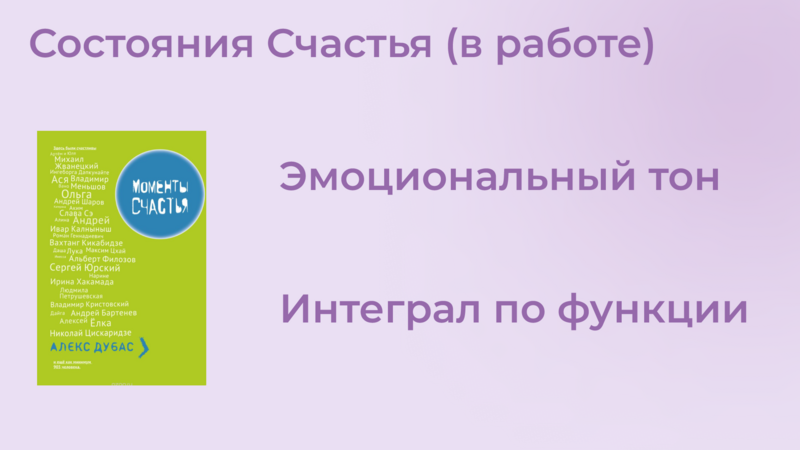

Строго говоря — [жизнь состоит из моментов, характеризуемых эмоциональным тоном](p1-010-happiness.md#moments_of_happiness). Отрицательным или Положительным. «Счастливая ли жизнь?» можно измерить интегралом по функции эмоционального тона на протяжении всего времени. И несмотря на то, что уровень эмоционального тона в моменте можно измерять по физиологическому состоянию организма, как [постоянный мониторинг уровня сахара в крови](p2-140-digital.md#health), например, и это станет возможным в обозримом будущем — речь пойдёт совершенно о другом.

Чтобы не сильно смущать разговорами об интегралах по функции Счастья можно вспомнить [книгу-сборник «Моментов Счастья», которая вдохновила нас не меньше, чем количественные модели](p1-010-happiness.md#moments_of_happiness_book).

## 8. Пирог Счастья {#pie_of_happiness}

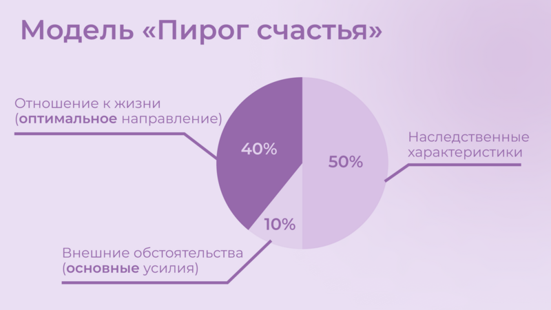

[Природа феномена ощущения Счастья](p1-010-happiness.md#what_is_happiness) такова, что предпосылки его появления на 50% зависят от физиологических и наследственных особенностей (которые обуславливают наш характер/темперамент/психотип), на 10% от внешних обстоятельств, которые соответствуют Ожиданиям: Захотел и Получил (куда и прикладывается максимум усилий), и на 40% от Отношения к жизни, которое мы чаще всего оставляем без внимания.

Наблюдения эти подтверждаются в исследованиях и описаны в книгах — уже упомянутая [«Количественная модель счастья»](https://www.livelib.ru/work/1008288064-model-kolichestvennoj-otsenki-urovnya-schastya-vladimir-andreev) [Владимира Андреева](p2-100-authors.md#andreevvs) и [«Психология Счастья»](https://www.b17.ru/blog/401335/) Сони Любомирски.

## 9. Путь Этапов Развития Личности {#path_of_happiness}

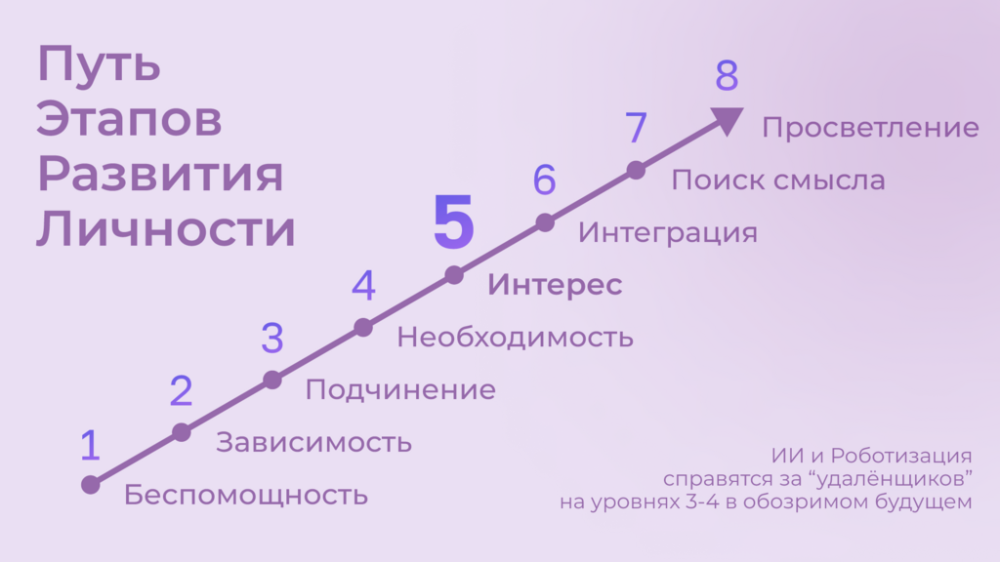

Частота возникновения моментов счастья, в свою очередь, зависит от уровня развития Личности, который человек достигает, преодолевая Кризисы. Можно перескочить какой-то кризис и не выработать необходимые навыки его преодоления, что создаст дисбаланс и сложности в будущем. [Эта модель основывается на аналогичных и им не противоречит](p2-120-school.md#brief_happiness_model):

1. Детская Беспомощность;
1. Зависимость от старших;
1. Умение проявлять свою Волю, принимать решения и выходить из Подчинения;
1. Рациональный навык обустроить жизнь по нормам социума — Необходимость достичь минимальный уровень достатка;
1. Иррациональный навык найти свой Интерес и следовать Призванию, возможно вопреки голосу Разума — многие себя так не реализовали на этом этапе;
1. Интегрировать Интерес и Заработок, Реализоваться как эксперт в своей области — успешные предприниматели и деятели культуры;
1. Преобразование полученного за жизнь опыта в Смысл — известные руководители, писатели, вошедшие в историю;
1. Идеалы, которые смогли достичь полного единения с мирозданием — святые.

Нет практически никаких шансов дойти до конца Пути :-) Слишком много Воли и Веры требуется, чтобы потом ещё и не соблазниться лёгкими способами улучшения настроения. В семьях с [устоявшейся системой ценностей](p2-110-system.md#god_and_science), где заметное место занимают:

- Учёба и тренировка навыков Разума, чтобы уметь добывать необходимые ресурсы,
- Вера в духовные идеалы, которая служит стержнем и формирует ориентиры для роста,
- Труд и волевые навыки по объединению этих двух полюсов нашей психики и поведения,

а отдых проходит на природе и в творчестве — чаще обычного встречаются доброжелательные и счастливые люди. Благодаря [сбалансированному развитию всех сфер психологии — Разум, Воля, Бессознательное и Вера](p2-180-sharedgoals.md#types_of_psychology).

Хотя государство может помогать и помогает преодолевать кризис поиска Интереса, на котором застревают многие. Важность прохождения этого кризиса [растёт с развитием Искусственного интеллекта и Роботизации, которые могут оставить без работы тех, кто закапывают свои таланты](p2-160-routine.md#love_manifest_robots).

## 10. Петербург в поисках Счастья {#petersburg_and_happiness}

Хорошо, но при чём здесь Петербург?

Когда расставлял ссылки в тексте и восполнял собственные пробелы в знании жизнеописаний русских святых новой истории из Википедии узнал о [пророчестве Серафима Вырицкого о роли Петербурга](https://ru.wikipedia.org/wiki/Серафим_Вырицкий). Эта информация меня и порадовала и огорчила. Порадовала, потому что  красиво вписывается в общую картину. Но к сожалению, также держу в уме поправку на то, что предсказания публикуются по прошествию времени и делают это зачастую те, кому хочется построить на них свои выводы. Как мне, например :-)

Хотя я также допускаю, что высокоразвитые личности, проведшие значительное время в [состоянии высокого эмоционального тона](p1-010-happiness.md#не-можешь-измерить--не-можешь-управлять), могут «видеть», прогнозировать развитие событий на продолжительных отрезках времени. Также ведь с трудом укладывается в голове, что нейронная сеть, через которую пропустили петабайты текстовой информации начинает общаться как невероятно разносторонний и одухотворённый человек.

Однако Петербург имеет совершенно объяснимые предпосылки стать точкой роста.

## 11. Культурная столица {#culture_capital}

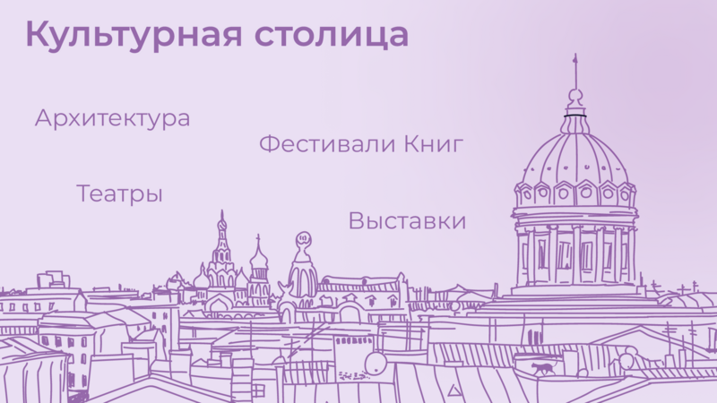

В Петербурге сконцентрировано запредельное количество заведений науки и искусства. Кроме этого очевидного факта, существует [понятие Текст города](p2-130-local.md#city_as_text). Это Архитектура города, которую «читают» его жители и гости, когда идут по улицам и смотрят по сторонам. Архитекторы, определявшие облик Петербурга, очевидно закладывали стремление к Идеалам. Высокая культура и Текст города работают. В городе невероятная концентрация идеалистов. Упомянутые книги о Счастье были написаны мыслителями из Петербурга, также как и [движение русских космистов развивалось в Культурной столице](p2-130-local.md#russian_cosmism). Обычно Петербург вспоминают как город трёх революций, но хотелось бы чтобы эти идеалы послужили катализатором для прохождения кризиса Интереса у граждан.

Тем более, что именно в Петербурге [мы начали успешно освобождать чиновников от рутинной работы](p2-160-routine.md#robots_in_spb), выполняя её роботами, а людей переводить на более творческие задачи.

## 12. Цифровой Петербург {#digital_petersburg}

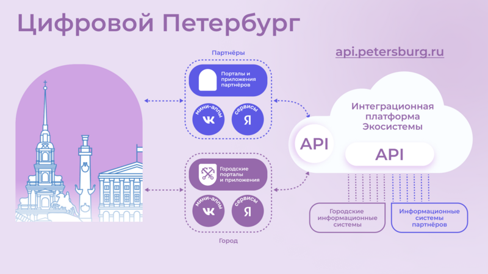

Когда мы [строили «Цифровой Петербург» в 2020 году](p2-130-local.md#mini_app_vkontakte) изначально использовали принципы Открытого Правительства.

Упор был сделан на [открытие данных и создание программных интерфейсов (API) городских информационных систем](p2-170-opensource.md), поверх которых можно создавать новые сервисы для жителей, интегрированные с популярными цифровыми каналами коммуникаций. С площадками, где уже находятся жители.

Использование платформ приложений от партнёров ВКонтакте и Яндекс дало возможность быстро запускать новые сервисы для жителей и масштабироваться в другие субъекты.

## 13. Я Здесь Живу {#i_live_here_app}

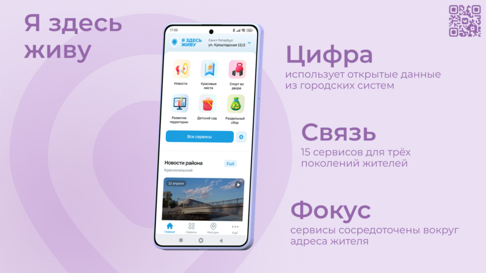

[«Я Здесь Живу»](https://vk.com/ya_zdes_zhivu) — флагманское приложение [«Цифрового Петербурга»](https://about.petersburg.ru) построено не как отдельное приложение, а как набор разнообразных сервисов с привязкой к адресу города, поверх которых создан мини-апп ВКонтакте. [Предполагается запуск сервисов на других платформах](p2-130-local.md#digital_petersburg_roadmap).

## 14. Подход Цифрового Петербурга {#roots_approach}

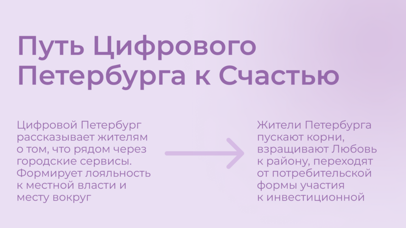

Есть метафора, что [наши города заполнены Иностранцами, которые не знают места, где они живут](p2-130-local.md#unhappy_foreigners). Их мало что связывает с местом жительства, т.к. живут они образами, сформированными цифровыми каналами массовой информации. Разность реальности и этих образов (не самых правдивых) порождает раздражение и несчастье. Мы пока не говорим, что по настоящему приносит Счастье место, которое не только знакомо, но и частично преобразилось в результат труда жителей.

Мы следуем Пути, который позволяет жителям пускать корни и делает его экспертом места, в котором он живет.

## 15. Новые метрики {#new_metrics}

[Следуя принципу «Не можешь измерить — не можешь управлять»](p2-140-digital.md#why_digital_russia) для изменения ситуации необходимо сначала научиться измерять текущее состояние и понимать желаемое в ключевых процессах и целях общества.

Для лучшего понимания эффективности наших усилий в диалоге с жителями от лица города мы начали искать новые понятия и метрики — например, [Социальный капитал](p2-180-sharedgoals.md#social_capital).

## 16. Определение Социального капитала {#social_capital_definition}

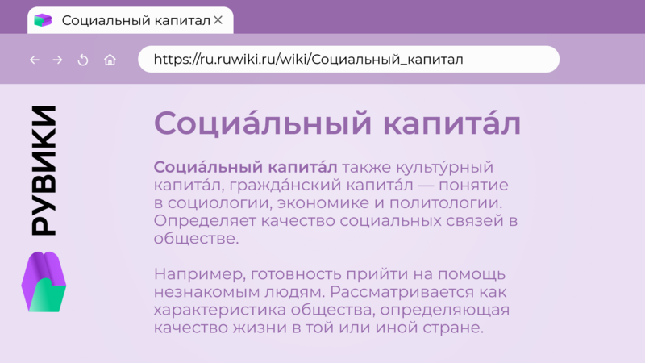

Самый драгоценный ресурс для общества и человека, который изначально [надо уметь измерять и оценивать — это наше Время](p2-140-digital.md#time). Социальный капитал представляется как интегральная инвестиция времени в общие цели для социума. Это время, которое люди тратят не на «себя любимого», а на общество в котором живут. Не «ты мне — я тебе», а мы вместе для нас.

Оно очень похоже с понятием Человеческий капитал, о котором написана уже упомянутая здесь книга [«Психология человеческого капитала»](https://www.livelib.ru/review/4165063-strategicheskaya-psihologiya-globalizatsii-psihologiya-chelovecheskogo-kapitala). Примечательно, что заключение книги посвящено [Счастью, как краеугольному камню](p1-010-happiness.md#cornerstone_of_text) в понятии Человеческий Капитал.

Будь то Социальный или Человеческий, но этот Капитал разительно отличается от Финансового Капитала, который доминирует в мире, что создаёт перекосы и конфликты, в том числе военные. И если это понятие так важно, то его нужно постепенно вводить в управленческую практику наравне с Финансовым капиталом и уметь его измерять, чтобы достигать баланса.

Вполне вероятно, что потребуется введение в обиход принципиально нового понятия, которое отражает смысл инвестиций сделанных в общее дело.

Инвестиции в Счастье.

## 17. Новое осмысление Умного Города {#smart_city_slide}

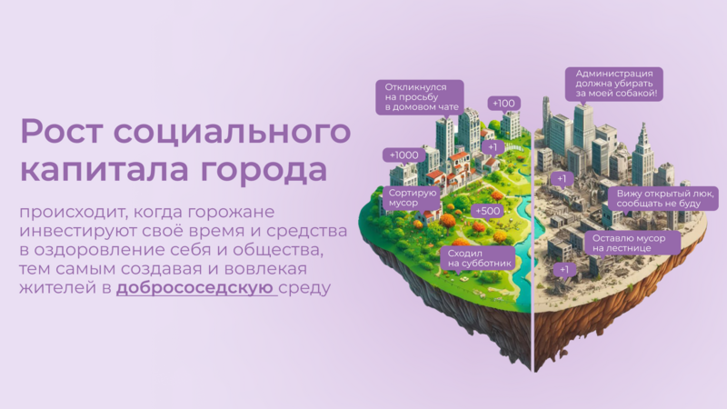

В системе координат, где помимо Финансового капитала начинает оцениваться Человеческий, можно переосмысливать знакомые понятия.

[Умный город — не тот, где больше камер или датчиков, а тот, где Социальный капитал растёт быстрее](p2-180-sharedgoals.md#smart_city).

Если в СССР граждане строили коммунизм без денежных отношений, который воспринимался на уровне обывателя довольно причудливо и непонятно. То вот сейчас важно понимать, что в результате деятельности помимо Финансового капитала растёт ещё и Человеческий, который является залогом нашего Счастливого Завтра. И мы видим этот рост на открытых формулах и цифрах в срезах нашего места жительства и рода занятий.

## 18. Житель — инвестор, а не потребитель {#citizen_investor}

Финансовая независимость, о которой мечтает подавляющая часть населения, приобретается только через навыки Инвестиций. Чтобы научиться инвестировать Деньги, сначала нужно научиться управлять и инвестировать Время, которое имеется у всех в равной степени. Для этого требуется управлять Волей, чтобы не разбазаривать это Время на [ловушки, которые создаёт для нас легкодоступный цифровой мир развлечений](p1-040-unhappiness.md#information_flow).

Вырабатывать эти навыки проще всего на [инвестициях в улучшение своего жизненного пространства](p2-130-local.md#tom_sawyer_fest). Без вовлечения в развитие своего дома и двора, вероятно, не получится стать счастливым и обеспеченным. Улучшение жизненного пространства является общей целью жителей и руководства города.

## 19. Вовлечение в инвестиции {#investment_involvement}

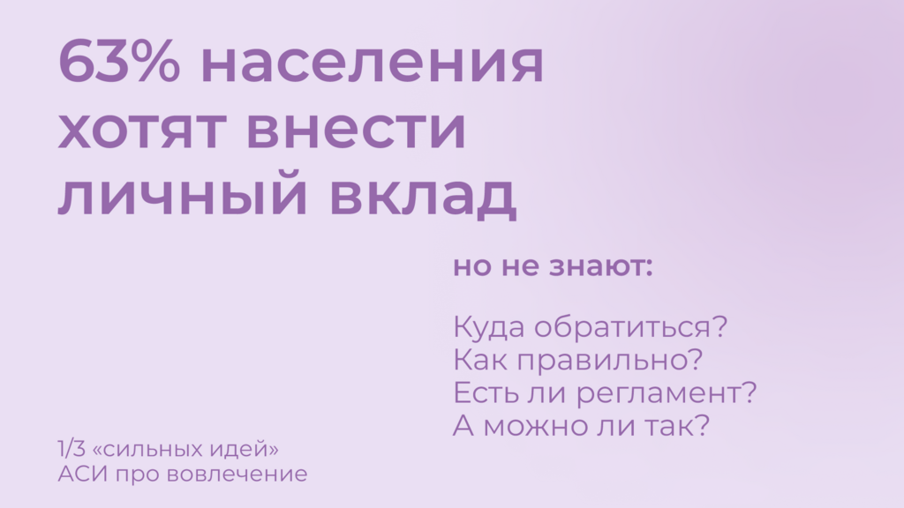

Треть «Сильных идей» предлагаемых Агентством Стратегических Инициатив о [вовлечении граждан в созидательную деятельность на благо общества](p2-180-sharedgoals.md#shared_goals_for_citizens).

По данным опроса, не менее 63% наших жителей ответили, что они готовы инвестировать своё время на благо Общества.

Люди очень разные, но все хотят быть счастливыми. И в глубине души все понимают, что для этого надо как-то вложиться. Есть порыв, но нет понимания «Что же конкретно можно сделать, чтобы помочь?»

## 20. Общие цели {#shared_goals_slide}

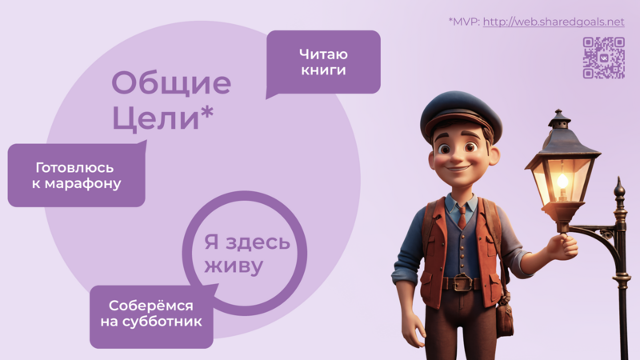

На эти вопросы ответит [платформа Общие Цели](p2-180-sharedgoals.md#shared_goals). И все проекты про вовлечение можно будет объединить [одной открытой цифровой платформой](p2-170-opensource.md#shared_goal).

И тогда общественное движение, клуб по интересам, обычная семья или неравнодушный гражданин могут [присоединиться или создать Общую Цель](p2-180-sharedgoals.md#entity_goal). Где [определяется Время как возможная Инвестиция](p2-180-sharedgoals.md#entity_contract). [Экспертами может быть предложен план рекомендованных действий](p2-180-sharedgoals.md#entity_plans), чтобы избежать ненужных рисков и направить временные инвестиции в правильное русло. И фиксируется [совершённый временной вклад в Общую цель](p2-180-sharedgoals.md#entity_commit). Когда виден результат от сделанных инвестиций, то возникают и отмечаются Моменты Счастья.

Именно они могут быть мотиваторами для тех, кто собирался заняться этой темой, но не хватало времени, а точнее воли.

«Я Здесь Живу» является лишь подмножеством Общих Целей, объединенных адресом многоквартирного дома. А [цифровой аватар Яков Петрович или Яков Захарыч](p2-130-local.md#digital_petersburg_roadmap) (дворник или фонарщик, зажигающий свет) в домовых чатах сможет подсказать, что происходит вокруг и какими Общими Целями можно заняться.

## 21. Что мне делать? :) {#this_text}

Что мне делать? :)

[Так называется этот Текст](index.md#what_to_do), который спонтанно начал писать в GitHub совместно с единомышленниками год назад.

Что надо делать, чтобы быть Счастливым? Что сделать, чтобы запустить этот процесс?

Вопросов, сомнений, рассуждений — множество. Хотя основные выводы в тексте видятся вполне устойчивыми и выдержали не одно критическое замечание, тем не менее у каждого может быть свой нюансный взгляд и каждый может его добавить в [концепции Open Source](p2-170-opensource.md#associations_with_open_source). И значит Текст этот может дополняться бесконечно и [не является законченным продуктом или книгой](index.md#text_is_not_a_book).

## 22. Подтверждение гипотезы {#proof}

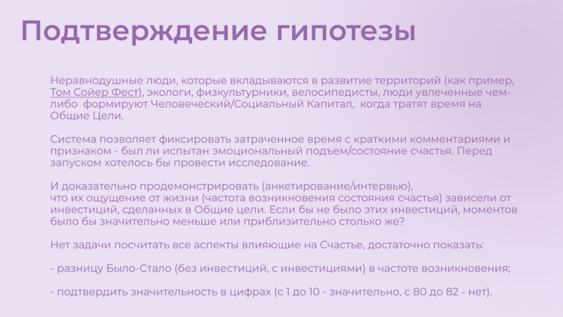

На данный момент требуется выработать простую и понятную формулу, из которой будет следовать зависимость между вложенными инвестициями в общее дело с возникновением состояний счастья впоследствии. А потом ещё и доказать эту формулу на практике.

[Это основная задача, в решении которой будет полезна любая помощь](p2-180-sharedgoals.md#balance_check) — советы, которые многие любят давать :-), примеры из жизни, готовность предоставить доказательство или опровержение гипотезы. Чем полнее будет исследование, тем точнее можно будет настроить систему.

## 23. Желаемый результат {#result}

Общие цели, являясь независимой открытой цифровой платформой, можно встроить через виджеты, мини-аппы и чат-боты в уже существующие сообщества, группы и ГосПаблики. По желанию модераторов и администраторов этих сообществ, конечно же. Ряд изменений можно делать автоматизировано, через API, без необходимости ручного ввода. И тогда в тематических сообществах можно будет наблюдать динамику общих временных инвестиций, активность участников и поток деперсонализированных моментов счастья, которые появились в результате вложений.

[Важные результаты](p2-180-sharedgoals.md#human_capital_book):

- вклад в Общие цели можно соотнести с вкладом в соответствующие национальные цели, определённые Президентом;
- платформа может стать инструментом для измерения человеческого/социального капитала, наряду с финансовым;
- можно формулировать измеримые и понятные цели для общества, напрямую связанные с интересами граждан и влияющими на их счастье.

## 24. Необходимые условия {#requirements}

[Несмотря на растущую важность Цифровизации для государств и явное её присутствие в национальных целях](p2-140-digital.md#russian_it), мы понимаем, что далеко не всё можно решить с помощью информационных систем. Потребуется согласованность усилий на всех уровнях. На наш взгляд, основы психологии и философии в максимально доступной и наглядной форме, понимание природы наркологических и поведенческих зависимостей, необходимость прохождения пути развития уровней личности для испытания моментов счастья на протяжении жизни, историю героев, которые прошли этот путь [необходимо давать уже в средней школе](p2-120-school.md#happiness_in_school).

Конечно же, содержанием школьной программы должны заниматься специалисты в образовании, но пока предмета о Счастье нет в школе, ответственность за счастливое завтра детей полностью лежит на плечах родителей. Мы также понимаем, какие последствия может иметь цифровизация роли наставника для детей, которая сейчас и происходит через компьютерные игры и непрерывное потребление информации с телефона. Ребенку нужны живые Папа и Мама, равно как Человеку нужен Человек. Тут скорее необходимо направлять усилия на осознание сложившейся ситуации в головах взрослых. Через открытый, прямой, объективный диалог.

[В наших силах снабдить цифровыми помощниками уже созданные домовые чаты в мессенджерах](p2-130-local.md#digital_petersburg_roadmap), где присутствует население России, проживающее в многоквартирных домах. В этих группах часто можно наблюдать разгул «диванной аналитики» и «глубокого знания жизни», когда виноват кто угодно, но не сам говорящий. Не слишком серьёзный персонаж, типа виртуального дворника или фонарщика, сможет рассказывать, что Город делает для дома и двора, что делают неравнодушные люди неподалёку, и как можно им помочь. Может даже порассуждать о природе Счастья и навести на мысли, которые прорастут позже.

## 25. Проектная группа {#project_team}

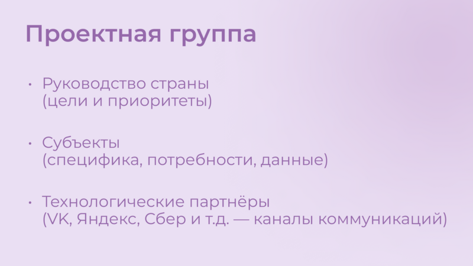

Думается, что важно включиться в проектную рабочую группу, в которой присутствуют представители Руководства, Субъектов и Технологических Партнеров, чтобы согласовать эти действия.

## 26. Задачи проектной группы {#project_tasks}

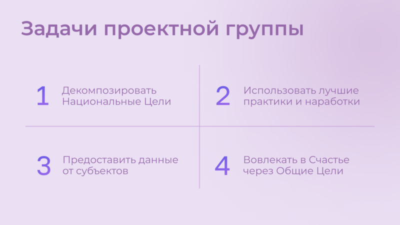

Потребуется:

- Декомпозировать Национальные Цели на исполнимые гражданами планы Общих Целей с помощью экспертов и ответственных из отрасли: Благоустройство - Субботник, Экология - Полить Газон во дворе, Благосостояние - Послушать лекцию о важности контроля трат и начала инвестирования и т.д.;
- Использовать лучшие методологические практики и технические наработки, которые не создадут рисков в дальнейшем;
- Структурировать и снабдить данные API на уровне субъектов для ведения объективного диалога с жителями;
- И вовлекать людей в Общие Цели.

Обсудить положения этой главы и всего остального текста можно в группе [по ссылке](https://t.me/bongiozzo_public).
