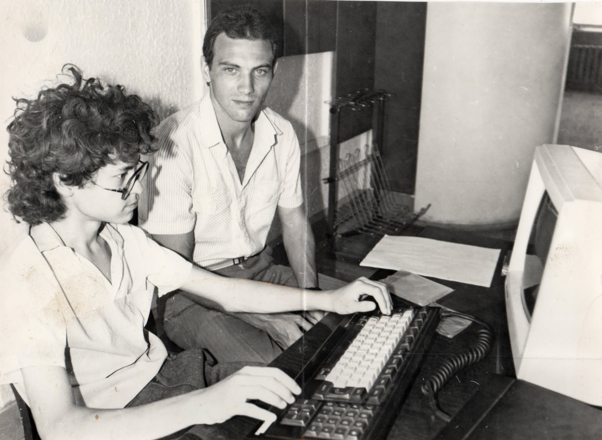

# Программирование — созидательный поток

## Мечты

### Я — Робот

[Книжка про роботов](p1-020-call.md#experience_of_happiness)

### МК-86

Попытки сбора собственного компьютера.

## Первые шаги — школа

### Yamaha MSX

{ width="100%", loading=lazy }
/// caption
Yamaha MSX
///

[Михаил Владимирович Швецкий](https://www.livelib.ru/author/1267409-mihail-vladimirovich-shvetskij)

## Поиск - университет

## Понимание - работа

### Samara-Internet

Соединять людей — наша работа (майка из прошлой жизни)

### Webzavod

### Samara Pub

### Mustdie, Lightning Strike

## Microsoft

### IT Consulting

### Evangelism

### Sales as Helping

## School of Digital Age

## Отойти от IT

## Цифровой Петербург

## Программирование вместе с ИИ
