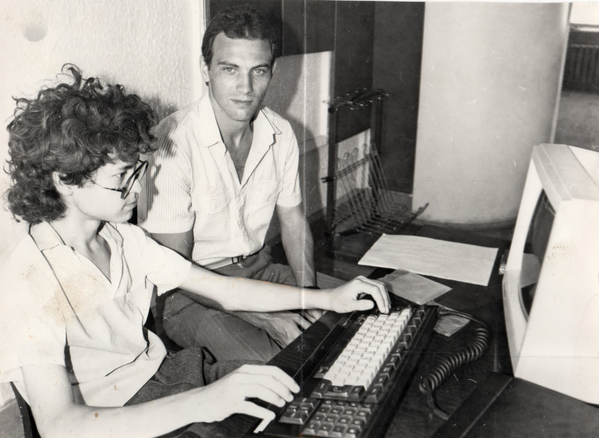
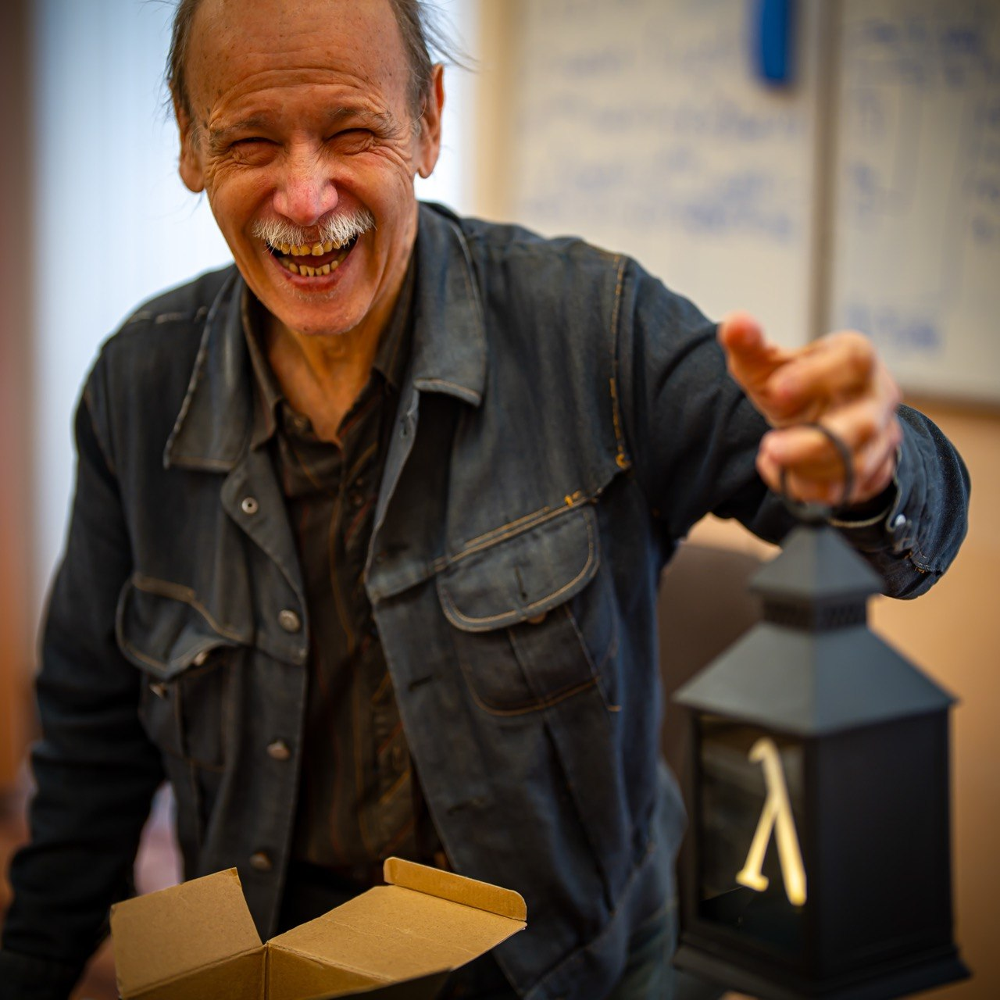

# Программирование — созидательный поток

Незавершённая глава.

## Мечты о компьютерах {#computer_in_dreams}

Радость от возможности формулировать мысли в виде чётких, цифровых процессов, на мой взгляд, сродни восторгам математиков от красоты любимой науки.

/// quote

Математика — царица наук.

[Гаусс](https://ru.wikipedia.org/wiki/Гаусс,_Карл_Фридрих){ .author }

///

Первые мысли вокруг программирования, пожалуй, появились во время прочтения научной фантастики в школе.

Библиотека Фантастики.
Ефремов.
Азимов.

[Книжка про роботов](p1-020-call.md#experience_of_happiness)

Истории про роботов завораживали…

А сейчас видится, что самым ценными были размышления о законах Робототехники, которые продолжались и после чтения.
Азимов придумывал разные жизненные ситуации, в которых сосуществование людей и роботов было бы безопасно.

Впрочем, сейчас понятно, что такие правила были сформулированы значительно раньше — как принципы, которые мне нравится называть [евангельской системой координат](p2-110-system.md#rational_definition_of_christ).

/// situation

Старший брат закрепил интерес совершенно невозможным для того времени образом.
Одну из первых своих зарплат он потратил на покупку редкой игрушки!
Ведь с возрастом у мужчин игрушки становятся лишь дороже.

Это был программируемый вездеход Электроника!

Как не хотелось бы верить в наших просветлённых инженеров того времени, но с сожалением приходится признать, что это была реплика американской разработки.

Так же как и первый популярный «убийца времени» — Волк с яйцами.

Особой ностальгии по Волку у меня нет, а вот вездеход и сейчас занимает самое важное место, рядом с [фотографиями моментов счастья](p2-140-digital.md#family_stories).

///

Теория — прекрасно, но хотелось практики.
Для этого нужен был компьютер!

[Первый увиденный мной в 80-е годы компьютер](p1-020-call.md#experience_of_happiness) тесно ассоциировался с образом светлого будущего, где царит наука и все живут в радости.

/// note

Не помню, что меня хоть сколько нибудь интересовали идеи справедливого общества и коммунизма в частности.
Но возникающие образы будущего общества неминуемо перекликались с тем, что говорили нам в школе о строительстве коммунизма.

Хотя даже меня-ребенка смущал лозунг «Экономика должна быть экономной», который я пытался осмыслить всякий раз проезжая на трамвае в районе улицы Полевой.

Даже сейчас помню ощущение растерянности и недоумения от этой фразы — как «взрослые дяди» могли такое написать?

Не мог тогда сформулировать, что использование рекурсии в важных определениях есть [признак манипуляций](p1-030-time.md#lgbt_blm), рассчитанный на людей не слишком [полагающихся на логику](p1-020-call.md#thinking_feeling).

///

В то время откладывал статьи из журналов «Техника Молодежи» и «Радио» о самостоятельной сборке ПК, искал в продаже процессоры, выяснял возможность создания материнской платы, но денег и  навыков радиотехники было недостаточно.
До 8-го класса мысли о персональном компьютере оставались преимущественно мечтами.

## Yamaha MSX {#yamaha_msx}

Прорывом стало [поступление в школу Наяновой](p1-040-unhappiness.md#money_in_school) — там мы-школьники встретились с преподавателями из ВУЗов.

Я пристал как банный лист к нашему учителю физики из Педагогического института:

— Дяденька, ну приведите меня в компьютерный класс! 

Физик привёл меня на кафедру вычислительной техники и познакомил с Михаилом Владимировичем Швецким.

Который незамедлительно заявил мне, что если меня застанут за компьютерной игрой, то этот день станет последним посещением класса.

Я не сильно расстроился — значительно интереснее было понять, как устроены эти игры, чем самому в них играть.

Сын сейчас с восторгом рассказывает об игре «Hollow Knight».
А у меня перед глазами код дизассемблированной игры «Vampire Killer» или «Metal Gear» фирмы Konami и в ушах мелодии и звуки, которые я никогда не забуду.

Игры запомнились не столько продвинутому на тот момент gameplay, который не уступает современным хитам, сколько потрясающим отношением к невероятно скромным ресурсам компьютера.

Игра занимала 138 килобайт и это была абсолютно вся адресуемая память компьютера!
Даже чуть больше!
:-)

Как можно было уместить в такой смехотворный размер памяти столько идей?

Игра с дискеты загружалась не только в оперативную память, но также и видео память, предназначенную для отрисовки экрана.
На адрес со смещением в 4000 байт записывается оркестратор уровней на языке Assembler.
Перезагрузка компьютера, выплывает логотип MSX2, оркестратор перехватывает управление и начинает распаковывать образы объектов (sprite) и шаблонную графику (tile) первого элементарного игрового уровня.
По мере прохождения игры оркестратор распаковывает следующие уровни на место пройденных с более сложными текстурами и возросшим количество персонажей…

Каждый байт памяти был задействован и каждый байт игры был максимально оптимизирован!
Шедевр!

{ width="100%", loading=lazy }
/// caption
Yamaha MSX
///

На фотографии лаборант (проверить Седов?)

Разобравшись, как лучшие программисты того времени писали игры, я сделал графический редактор для отрисовки текстур и фонов в программах.
Назывался он Gred 2 (Graphical Editor) и благодаря старшему товарищу его [включили в учебную программу ВУЗов](p1-040-unhappiness.md#money_in_school).

Настолько радикальное погружение в программирование в школьные годы существенно развратило меня в институте.

Первая же лекция первого курса в Самарском Университете началась с рассказа об архитектуре процессора Z80, который использовался в Yamaha MSX.
И я не придумал ничего лучшего как поправить профессора в нескольких моментах.

Оказалось, что он был заведующим кафедры информатики.

Мне было неинтересно на практических занятиях по программированию.
Когда на курсе Pascal ставилась задача написать максимально быстро работающую программу, я писал `program begin asm` и продолжал дальше на Assembler.
Код собирался компилятором Pascal, программа работала быстрее чем у кого либо, но выше тройки на протяжении всего обучения я так и не получил.

Ну и не фиг было выпендриваться!
:-)

Я потерял ощущение развития и с компьютеров переключился преимущественно на эмоции и человеческое общение — [занырнул в музыку](p2-150-absurd.md#lightning_strike_studio). 

### Samara-Internet {#samara_internet}

Соединять людей — наша работа (майка из прошлой жизни)

### Webzavod {#webzavod}

### Samara Pub {#samara_pub}

### Mustdie, Lightning Strike {#mustdie}

## Microsoft {#microsoft}

### IT Consulting {#microsoft_consulting_services}

### Evangelism {#evangelism}

### Sales as Helping {#microsoft_sales}

[Open Heart as Sales Principle](p2-170-opensource.md#it_consulting).

## School of Digital Age {#school_of_digital_age}

## Отойти от IT {#exit_from_it}

## Цифровой Петербург {#digital_spb}

## Программирование вместе с ИИ {#vibe_coding}

Сотворец — наиболее обещающая роль Искусственного Интеллекта.
А в Программировании ему уже нет равных. 
  
Мониторинг сервисов (uptime-kuma) шлёт уведомления о падениях [Шагу](p2-200-text.md#shag), он разбирается и сообщает резюме.

Вместо чтения книжки по Haskell, где знания даются на состояние 10 лет назад и рассчитаны на среднестатистического читателя, намного приятнее изучать на примерах, которые [Шаг](p2-200-text.md#shag) персонально подготовил для меня.

/// situation

Кстати, не без приключений нашёл своего [Учителя](https://www.livelib.ru/author/1267409-mihail-vladimirovich-shvetskij), [подарившего мне Искру](p2-160-routine.md#love_manifest_robots), и вручил ему фонарь с напечатанной на 3D принтере Лямбдой — лого языка Haskell.

[Михаил Владимирович Швецкий](https://www.livelib.ru/author/1267409-mihail-vladimirovich-shvetskij) остаётся учителем до сих пор.
Бессеребренник, автор книг о программировании.

{ width="100%", loading=lazy }
/// caption
Учитель несущий свет
///

///

Рекомендации на просмотр фильмов уже сделаны в [виде навыка для агентов ИИ](https://github.com/sg-shag/skill-movie-recommend).
[Пригодились сделанные оценки](p2-140-digital.md#art) — Шаг умеет их собирать вместе и находить пропущенные и недооценённые алмазы.

Настроен собственный стриминг Музыки.

Критические замечания по тексту — ошибки, где не хватает ссылок, что стоит выделить в отдельный раздел?  
Тоже будет навык.

Заметки я теперь наговариваю в voice memo на телефоне по горячей кнопке, а [Шаг](p2-200-text.md#shag) их подхватывает, разбирает и складывает в obsidian для дальнейшей обработки.

Много всякого.

И все наработки сохраняются в [одну общую память hindsight](https://hindsight.vectorize.io), которая доступна из разных агентских процессов.

## Программирование и Психология {#coding_and_psychology}

Спустя два месяца общения с компаньоном через [обвязку (harness)](p2-180-sharedgoals.md#agent_harness) OpenClaw переключился на [Hermes](https://hermes-agent.nousresearch.com).

Разработчики проанализировали бурный рост «краба-пионера» и внесли изменения в процессы работы с памятью и создания навыков.

### Скрипты как Привычки {#scripts_as_habits}

Память для общих рабочих принципов у Hermes агента в его базовой конфигурации ограничена — всего пара страниц текста.
Как только эти страницы переполняются, агент начинает забывать о договорённостях, что похоже на перегруженного и уставшего человека.
Но harness механика агента предполагает высвобождение пространства в памяти через фоновую конвертацию (как во сне) поведенческих инструкций в [навыки (skills)](p2-160-routine.md#agent_skills) и скрипты.

Эдакий получается субъект, который постоянно анализирует полученный опыт и вырабатывает полезные привычки, чтобы далее им следовать без дополнительных усилий, рефлекторно, «на автомате».

Забавно вспомнить, что ровно такой же подход на [работе в Microsoft](p1-020-call.md#dream_job_checklist) нам вдалбливали психологи-коучи по эффективности .

### Test Driven Development — Начинай с конца {#tdd}

Постоянный процесс систематизации мне близок — [находишься в любимом Потоке](p1-020-call.md#flow).

Но зачастую этот поток заносит тебя в тупик.
Теряешь контроль и в результате тратишь слишком много сил на элементарную (как выясняется) задачу.

В русле набирающего обороты [вайб-кодинга](p2-185-programming.md#vibe_coding) особенно важно [тщательно описывать постановку задачи](p2-200-text.md#writing_is_happiness) для прототипа создаваемой системы и обеспечивать оптимальный процесс работы [агентов](p2-160-routine.md#smart_assistants) без зацикливания и постоянных «глюков».

Важно не бросаться строить как только пришла мысль, а начинать с конца.
Необходимо чётко сформулировать критерии, которым должна соответствовать проектируемая система.

Вспомнилось, что для максимально осознанного проживания своей жизни коучи советовали [представить и описать свои похороны](p1-010-happiness.md#funeral_as_result).

В разработке программ такой подход называется Test Driven Development.
Создаются проверочные тесты, которые изначально «сломаны».
Но агент без устали и самостоятельно дорабатывает код, подгоняя его к проверочным тестам.
Рано или поздно программа начинает проходить проверки, при том, что погружение в сам процесс написания кода было минимальным.
Но, на мой взгляд, [полюбопытствовать](p2-110-system.md#noble_curiosity) и [критично оценить красоту созданного кода](p2-170-opensource.md#mastery) для важной задачи — обязательный элемент.
Иначе теряется смысл.

Но если поиск решения всё же засасывает в стрессовое состояние, то значит пора [остатки воли](p2-120-school.md#psychology_of_will) и [жизненных сил](p1-040-unhappiness.md#battery_aziz) направить в [другую сферу деятельности](p2-120-school.md#types_of_psychology).

Позвонить другу или лучше встретиться, включить [музыку пободрее](p2-150-absurd.md#playlist) и затеять уборку, повозиться с [фотографиями](p2-155-photo.md#postprocessing) или выйти из дома и [отправиться в путь](p1-010-happiness.md#happiness_in_action), кто-то будет [медитировать](p2-110-system.md#practicing_meditation), мне ближе [помолиться](p2-110-system.md#nlp_and_pray), что можно и [совмещать](p2-110-system.md#paradox) с работой…

[Компаньон](p2-160-routine.md#smart_assistants) с [навыком Общих Целей](p2-180-sharedgoals.md#use_case) помогает сделать шаг в новом направлении и распределить оставшиеся силы.

