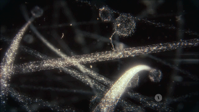

# Счастье как смысл жизни

## Что делать и главное — ради чего? {#cornerstone_of_text}

Краеугольным камнем видится утверждение, что большинство людей хотят быть счастливыми.

В интернете можно видеть рекламу психологов и коучей, помогающих достичь этого ощущения, что косвенно подтверждает это утверждение.
Не было бы спроса, тогда и предложений бы не было.

Но мне хочется отстроиться от продавцов тренингов, книг или сервисов – мне интересно досконально разобраться с этим устремлением самому.
Поэтому я продолжу.

Образ счастья чаще называют мечтой.
И в глубине души мы стремимся к этому образу в течении значительной части своей жизни, если жизни ничто не угрожает.
Ситуацию выживания я не рассматриваю.

Следующий осторожный вывод будет про смысл жизни.

Смысл жизни может быть в том, чтобы большую часть жизни быть счастливым.

Ведь так?

Вроде логично и банально, но есть возражения!

Изначально я был уверен, что все люди хотят быть счастливыми.
Но в одном из важных диалогов на эту тему мне возразили:
«Не все и не всегда хотят быть счастливыми».

Например, в большинстве религиозных конфессий изначально звучит идея о стремлении к Богу, а не к Счастью.

## Что такое счастье? {#what_is_happiness}

Ведь само понятие «Счастье» воспринимается в разных контекстах и культурах по-разному.

Можно в качестве примера привести [ситуацию, которая произошла с Андреем Тарковским на кинофестивале в США](https://www.livelib.ru/quote/48217174-italyanskie-marshruty-andreya-tarkovskogo-lev-naumov).
«Счастье», как наполненная смыслом жизнь, о чём говорил Андрей, и «Happiness», комфортное состояние в моменте, что воспринимала аудитория, были совершенно разными понятиями – поэтому дискуссия не клеилась.

Очевидно, образы счастья сильно отличаются, и с этим надо будет разбираться.

Множество людей, с которыми довелось пообщаться на эту тему, не задумываются об образе Счастья вовсе.
И слово это не отзывается ничем конкретным в их голове.

А мне любопытно разобраться, что мне делать, чтобы быть счастливым!
:-)

Этот мыслительный процесс видится важным и интересным – надо лишь разобраться в понятиях и образах этого счастья.

Слышал критические рассуждения о том, что Счастье - это про комфортное состояние исключительно здесь и сейчас, по [аналогии с Happiness](#cornerstone_of_text), которое тоже имеет широкий спектр смыслов.
Но у меня такого восприятия нет и никогда не было.

Действительно, слово «Счастье» не было распространено в древнерусских и церковных текстах.
Радость, блаженство, но не счастье.

Однако сейчас оно используется повсеместно и если подумать над собственным восприятием славянского слова «Счастье», то видится образ соприЧастия к чему-то хорошему и большому.
[Статья Wikipedia](https://ru.wikipedia.org/wiki/Счастье) также говорит про «хороший удел», достойное бытие, осмысленность жизни, реализацию призвания, а не просто комфортное состояние.

### Семейная пекарня {#family_bakery}

Мне лично образ слова Счастья видится состоянием единения моего сознания с окружающим миром.
Ты являешься Частью светлого и гармоничного мира в пространстве и времени.

Нравятся красивые художественные аллегории на этот счёт.
Например…

!!! note "Пример"

    На протяжении сотен лет в семьях пекли хлеб.
    Начинали дело с молитвы и вкладывали свои помыслы и просьбы в приготовляемую пищу – в замешиваемое тесто.

    Каждый раз часть теста сохранялась для следующего раза и этот кусочек назывался закваской.
    Кусочек этот жил десятилетиями и даже связывал поколения.

    Когда ребёнок вырастал и создавал свою семью, то получал закваску от родителей и таким образом становился «С Частью» помыслов и родовой памяти своих предков дальше по жизни.

{ width="75%", loading=lazy }
/// caption
Быть частью большого и светлого мира
///

Историю об этом можно посмотреть, а лучше прочувствовать на себе в [спектакле «Семейная пекарня»](http://teatrvkusa.ru/pekarnya/).

### Счастье – это чувство? {#happiness_as_feeling}

А если не задумываться над первоначальными смыслами слова, то все мы можем ассоциировать Счастье с ощущением эмоционального взлёта – чувства.

И несмотря на, казалось бы, очевидный смысл понятия «Счастье», каждый будет вкладывать в этот образ что-то своё, чего ему больше всего хочется.

Кто-то приобретение нового автомобиля, а кто-то прогулку с возлюбленной по набережной, кто-то велосипед, а кто-то отпуск с детьми, один представит рыбалку с друзьями, другой возможность выспаться в течение нескольких дней и так далее.

Зачастую желаю именинникам на их день рождения персонального Счастья, надеясь, что они сами представят и пожелают себе ровно то, чего им не хватает в этот момент для Счастья.
Ведь остальные пожелания являются лишь моими гипотезами и можно промахнуться, пожелав чего-нибудь незначительного или вообще лишнего.

### Пирог счастья {#happiness_pie}

Психологами [было замечено](https://www.b17.ru/blog/401335/), что порядка 50% ощущения благополучия или счастья зависит от обстоятельств, на которые мы вообще не сильно влияем.

Темперамент, характер и, как следствие, внутреннее ощущение человека зависят от нейромедиаторов, которые, в свою очередь, зависят от генетики и физиологических особенностей работы головного мозга.
У кого-то соотношение сбалансировано и «жизнь прекрасна», а другому нужно «выпрыгивать из штанов», чтобы чувствовать себя благополучным.

{ width="75%", loading=lazy }
/// caption
Доставщик Счастья
///

Говорят, что Счастье — это большой труд.
И достаточно посмотреть на «молекулярный мотор» — [белок миозина](https://ru.wikipedia.org/wiki/Миозин), который доставляет эндорфин до коры головного мозга, чтобы убедиться, насколько это непростой путь и сколько шагов приходится делать этому симпатичному и независимому «человечку», чтобы мы почувствовали себя счастливыми!
:-)

{ width="75%", loading=lazy }
/// caption
Счастье — это большой труд
///

Всего 10% наших ощущений зависят от внешних обстоятельств, на которые мы обычно влияем и где фокусируемся.
Известный актёр оценивал сколько длилось счастье от самых ярких покупок, которые ему были нужны для того, чтобы стать счастливым:

!!! quote "Цитата"

    Однажды я купил самую желанную машину. Но радость от покупки длилась всего 5 дней. Я периодически переезжал — новый дом поднимал настроение дольше, чем «Порше» или «Бентли», но несильно.
    
    ^^[Мэттью Перри](https://www.livelib.ru/quote/47121569-druzya-lyubimye-i-odna-bolshaya-uzhasnaya-vesch-avtobiografiya-mettyu-perri)^^

{ loading=lazy }
/// caption
Пирог Счастья
///

40% зависит от системы взглядов, которую мы перенимаем от общества.

Если ребенок вырос в семье, в которой друг друга поддерживают и где Любовь не пустой звук – шансы сформировать сбалансированную систему координат и благодаря ей прожить счастливую жизнь значительно увеличиваются.

Пожалуй, это основной вывод из самого продолжительного психологического исследования – [«Гарвардское исследование взрослых людей с 1938 по 2014 годы»](https://psychosearch.ru/napravleniya/social/882-secret-of-happiness?ysclid=mavy1fsnwm445224018).

Образ Счастья также меняется на протяжении всей жизни, при прохождении возрастных кризисов.
Думаю, что так оно и должно быть.

Кроме того, есть теория, что удовлетворённость жизнью у людей обычно держится на одном уровне, независимо от внешних обстоятельств.
Если сравнительно несчастливому человеку подарить миллион долларов, он через непродолжительное время придёт к тому же мироощущению.

И если счастливый человек, например, в результате травмы лишается ног, то через какое-то время его уровень среднего эмоционального тона поднимается до прежних значений.
Что косвенно опровергает, по моим ощущениям, слишком банальное и спорное утверждение: «В здоровом теле – здоровый дух».

Эта закономерность называется [гомеостаз счастья](https://monocler.ru/koordinatyi-schastya-i-moralnoe-licenzirovanie/).

И в результате, глядя на пирог счастья и учитывая эти наблюдения, думается, что работать придётся прежде всего со своей глубинной системой взглядов и, если потребуется, менять привычное отношение к жизни.

Ведь самая сложная задача — быть преимущественно в позитивном эмоциональном настрое всю жизнь и прийти в старость, в стадию завершения жизни, также в плюсовом значении по градуснику внутреннего ощущения уровня Счастья.

Любой проектный менеджер, строитель, артист, иными словами — творец знает о важности чёткого представления желаемого результата своих действий.
И важно понимать — в какое своё «будущее» ты направляешься и как оно выглядит?

Но также стоит помнить, что упрощённо мы всегда находимся в двух состояниях – стремимся к своему образу Счастья и убегаем от своих Страхов и рисков для Жизни.

Но ведь мы же знаем, что в конечном итоге нас догонят и наступит Смерть.

## Смерть как неизбежный финал {#funeral_as_result}

Вероятно, зря я сейчас употребил в тексте это слово, хотя и делаю это намеренно.

Множество близких мне людей при рассуждениях на тему смерти меняются в лице, переводят взгляд внутрь, и формат диалога становится совершенно другой.

Понятие Смерти ведь имеет ярко негативный окрас и рядом со словом «Счастье» смотрится противоречиво.

Можно вместо смерти рассуждать о переходе в другое состояние или слиянии с Вселенной — но я не могу с уверенностью рассуждать об этом.

А вот если подменить понятие Смерти более бытовым понятием процесса прощания с человеком, который завершил свой путь — похоронами, то становится чуть проще.
Похороны — всего лишь формальность:

!!! quote "Цитата"

    Человек умирает тогда, когда перестаёт меняться, а похороны — просто формальность.
    
    ^^[Генри Форд](https://www.livelib.ru/quote/47208530-moya-zhizn-moi-dostizheniya-s-sovremennymi-kommentariyami-genri-ford)^^

Однако, вы наверняка можете вспомнить фильмы и книги, где похороны вызывали улыбку.
Даже на обычных похоронах зачастую звучат речи, которые могут воодушевлять присутствующих.

!!! note "Ситуация"

    На похоронах наставника, учителя и основателя компании, в которой начал свою карьеру, впервые всерьёз осознал важность серьёзного отношения к своему здоровью.
    Именно благодаря тому моменту, когда сидел в сторонке от основной процессии и внутри была черная пустота, были приняты откладываемые решения.
    Эти решения повлияли на появление привычек ходить пешком, когда есть возможность, и следить за питанием.

Конечно же, это отразилось на моей дальнейшей жизни и событиях, с ней связанных.

Жена подсказала уместную тут цитату известного психиатра:

!!! quote "Цитата"

    Физически смерть разрушает человека, но идея смерти спасает его!
    
    ^^[Ирвин Ялом](https://www.livelib.ru/quote/45324397-ekzistentsialnaya-psihoterapiya-irvin-yalom)^^

Где-то прочитал, что осознание своей смертности есть завершение детства.

Тогда получается, что начало планирования собственных похорон и есть начало взрослой осознанной жизни.
Представлять саму смерть, пожалуй, не требуется, а вот визуализировать собственные похороны и могилу — на мой взгляд, полезное занятие.

Разные книги по личностному росту были прочитаны, но [глава «Начинай с конца» от Стивена Кови](https://www.livelib.ru/review/3792199-sem-navykov-vysokoeffektivnyh-lyudej) проняла меня в 27 лет и подтолкнула к глубинным сдвигам и действиям.

У Кови были ещё принципы — про планирование, проактивность, заточку пилы и что-то ещё (не буду делать вид, что на самом деле обладаю хорошей памятью и помню книгу наизусть), но этот навык основательно запомнился.

Конечно же, Стивен Кови, будучи миссионером-мормоном, не изобрёл этот подход.
Любой христианин базово живет в Вере, что Смерть — лишь переход к Вечной Жизни.
И в этом мире мы лишь готовимся к ней.

!!! note "Ситуация"

    Спустя 2 года после написания первых строк этой главы я погрузился в изучение биографии и творчества Льва Николаевича Толстого периода его «духовного переворота».
    Узнал и [про зелёную палочку с тайным рецептом счастья для всех жителей Земли](https://www.livelib.ru/quote/48235906-lev-tolstoj-svobodnyj-chelovek-pavel-basinskij), которую закопал его старший брат в лесу, и где Толстой завещал его похоронить в самом простом гробу и без каких-либо памятников.

    Сразу же захотелось посетить это место, и я поставил в планы заехать в Ясную Поляну на машине с оказией по пути из Самары в Москву.
    Такая поездка вместе с женой вскоре случилась, но стало понятно, что попадём на место мы глубокой ночью.
    Приличная и свободная гостиница нашлась неподалёку в посёлке с необычным названием Грумант и возникла идея дойти до могилы через лес пешком.
    По прямой выходило меньше часа ходьбы от трассы.

    Машину оставили рядом с дорогой, а сами двинулись вдоль берега озера, по кромке леса, через холмы до едва заметной лесной тропинки в сторону Ясной Поляны.

    Сделали короткую остановку на полянке, где сфотографировал балансирующую на пеньке жену.
    А дальше по тропинке предстояло ещё 20 минут пройти через лес, в котором довольно часто [плутал Лев Николаевич](https://www.livelib.ru/quote/48330376-lev-tolstoj-begstvo-iz-raya-pavel-basinskij).
    Лес действительно густой и тёмный – заблудиться немудрено.

    Могила как-то очень неожиданно появилась на пути и было очень непривычно не увидеть никаких надписей и других следов деятельности человека.
    Едва заметное ограждение, постриженная трава и не более того.

    { width="75%", loading=lazy }
    /// caption
    Тайный рецепт Счастья где-то рядом
    ///

    Место очень атмосферное.
    В голову лезли ассоциации со «Сталкером».

    А на обратном пути в Самару дослушали [аудиокнигу «Бегство из рая»](https://www.livelib.ru/review/5304772-lev-tolstoj-begstvo-iz-raya-pavel-basinskij) и [узнали про пенёк рядом с посёлком Грумант](https://www.livelib.ru/quote/48329923-lev-tolstoj-begstvo-iz-raya-pavel-basinskij) – порадовались.

    Про зелёную палочку с тайным рецептом можно кратко прочитать [по ссылке](https://tolstoy.ru/creativity/journalismguide/263.php).

## Представьте свои похороны {#funeral_visualization}

Визуализация своих похорон, на мой взгляд, сродни представлению успешно сданного экзамена в престижный ВУЗ.
Я визуал, как и большинство людей на планете, и мне проще рассуждать, глядя на картинку, пусть и выдуманную.
Представив это событие, можно начинать выписывать следующие факты:

- Возраст и внешний вид себя умершего;
- Количество пришедших на церемонию: заполненная улица или 10 человек?
- Кладбище или развеянный прах?
- Кто пришел на прощание?
Друзья, дети, внуки, сотрудники, соседи?
- Что они говорят о тебе?
- Что напишут на могиле?
- Город и страна, где проходят похороны?
И так далее.

Все эти факты, на мой взгляд, важны и зависят от жизненного пути.
Очевидно, что каждый такой ориентир даёт представление о необходимых шагах и изменениях.

Дотянешь ли ты со своим здоровьем до желаемого возраста или пора принимать меры?

Нужно ли переезжать в другой город/страну или лучше остаться с родственниками и друзьями?
Которых вероятнее всего не будет на похоронах, если уехать.

Нужно ли расширять круг общения или пора уединиться?

Конечно же, от нас зависит не всё или даже лучше сказать — немногое.

«Что ты будешь делать в четверг, если умрёшь в среду?», как говорил Пётр Мамонов.

Но запуск этих мыслительных процессов о смерти, её осознание и начало действий, потому что завтра ведь может и не наступить — оказались для меня чрезвычайно полезны.

Для быстрого погружения в тему могу порекомендовать к прочтению [короткое произведение Толстого «Смерть Ивана Ильича»](https://www.livelib.ru/review/5308714-la-mort-divan-ilitch-smert-ivana-ilicha-lev-tolstoj).
И потом в дополнение посмотреть часовой [фильм Александра Кайдановского – «Простая смерть»](https://www.kinopoisk.ru/film/221006/), где можно услышать запись голоса Льва Николаевича: «Нельзя так жить!».

## Моменты счастья в течение всей жизни {#moments_of_happiness}

Но ведь мы хотим быть счастливым человеком начиная с сегодняшнего дня.
Не ближе к нарисованному образу конечной цели, а на пути следования.
В гробу это счастье, как будто бы, неинтересно — хотелось бы пораньше.

!!! note "Ситуация"

    В начале двухтысячных, когда мне было 28 лет, я мечтал стать техническим экспертом в лучшей компании мира по разработке программного обеспечения.
    Дальше я не загадывал и картинка этого сияющего будущего полностью формировала моё представление.

    И когда в 33 года я стал Developer Evangelist в компании Microsoft, уже не знал чего хотеть и куда двигаться дальше.
    Этот период запомнился и стал одним из самых сильных жизненных кризисов: ты уже достиг поставленных глобальных целей, но потерял ощущение динамики роста и растерян в связи с этим.

Так я осознал, что хорошо бы научиться видеть свои цели максимально далёкими и может быть даже неисполнимыми.
Больше своей жизни и дальше своих похорон.
Чтобы не упираться в стенки и не вставать на неожиданных развилках, а ощущать движение на всём протяжении жизни.

Не знаю как вы, а я люблю путешествовать и люблю быть за рулём.

### Управление автомобилем {#moment_for_driving}

Желание попасть в новое место изначально запускает процесс планирования поездки.
Но весьма вероятно, что ощущения движения по красивой дороге, в конечном итоге, даже важнее.
Когда определился с конечной целью, представляешь направление движения, проложил маршрут из промежуточных точек и не ищешь глазами нужные повороты — двигаешься уверенно, наслаждаешься видом дороги и получаешь удовольствие.
Сама уверенность в правильности выбранного пути уже вызывает удовольствие, но многообразие чувств намного шире и каждый находит что-то своё.

Например люди с преобладанием ощущения удовольствия от адреналина могут почувствовать так.

> На прямом отрезке пустой трассы нажал на педаль, тебя вжимает в кресло и ты с удовольствием ощущаешь как машина летит, но всё ещё уверенно слушается каждого движения.
Маленькое счастье.

Признаюсь, что это не совсем мой формат и привёл я его для друзей…
:-)
Сам обречён на проверки уровня расхода топлива и поэтому неминуемо перейду на крейсерскую скорость.
Меня прежде всего будет радовать осознание, что процесс движения происходит оптимально.

### Визуальное восприятие {#moment_for_vision}

Моё особенное желание испытать душевный подъём будет скорее направлено на созерцание происходящего.

> Едешь и любуешься видом — необычный цвет закатного неба, уходящая вдаль композиция цветущих полей.
> И вдруг солнце проглянуло между облаками таким образом, что осветило отдельно стоящий храм, оставив всё остальное в тени.
> И дыхание замирает от красоты и гармонии.

Произошла со мной один раз история, которая обострила этот способ.

!!! note "Ситуация"

    Как-то раз мы ехали в микроавтобусе с друзьями по дорогам Якутии, а рядом простиралось обширное болото, в котором удивительно стройными рядами стояли засохшие низкорослые деревья — ствол и пара мощных веток.
    На боковом сиденье я устало наблюдал за проплывающим унылым пейзажем…

    И вдруг дорога так повернула, что закатное солнце оказалось прямо напротив меня и в этот момент окончательно зашло за горизонт, мягко и равномерно окрасив водную поверхность и небо в кроваво алый цвет.
    Одинаковые пеньки деревьев сформировали перспективу с контровым светом, уходящую в закат.

    — Это же обложка альбома Metallica «Master of Puppets»!

    Пронеслось у меня в голове и я онемел от восхищения.
    Спустя 10 секунд, после борьбы с неожиданно проявившимся стеснением попросить остановиться — я всё же переборол себя — водитель затормозил, друзья ничего не поняли, но я [убежал назад с фотоаппаратом наперевес](p2-155-photo.md#landscapes)…

    Конечно же, картинка безвозвратно ушла.

    С тех пор я договорился с собой не стесняться и следовать порыву мгновенно.

### Вкусовые ощущения и запахи {#moment_for_feelings}

Каким вкусным бывает простецкий ужин и стакан недорогого вина после десятка часов вождения!

> Взялся резать спелый крупный помидор сорта «Бычье сердце» и чувствуешь как легко отходят ровные кусочки от острейшего лезвия ножа.
> Высококачественное изделие вызывает исключительно приятные тактильные ощущения и лежит в руке как её продолжение.
>
> А крики чаек, звук прибоя и вид моря, до которого наконец-то доехали, формируют вкус соли во рту.
> Помидор и досаливать не надо.

При этом легко согласится с тем, что человек существо социальное, и подавляющее число таких моментов мы испытываем в компании с кем-то ещё.

И вот ведь хочется таких мгновений побольше.
И чтобы мурашки по коже от удовольствия.
Но как этого достигать?
Быстрый ответ — никак.

## Счастье в движении {#happiness_in_action}

Если счастье ставить целью, то его, почему-то, перестаёшь испытывать.

Множество неглупых людей об этом говорят тысячи лет.

Вот, например:

!!! quote "Цитата"

    Сенека предупреждал, что чем больше стремишься к счастью, тем больше от него отдаляешься.
    
    ^^[Александр Иванович Юрьев](https://www.livelib.ru/quote/47010373-strategicheskaya-psihologiya-globalizatsii-psihologiya-chelovecheskogo-kapitala)^^

Или вот:

!!! quote "Цитата"

    Люди могут быть счастливы лишь при условии, что они не считают счастье целью жизни.
    
    ^^[Джордж Оруэлл](https://www.livelib.ru/quote/42434395-1984-dzhordzh-oruell)^^

То есть, Счастье не является самоцелью, но мы испытываем его в движении к каким-то целям.

Да и наступают эти моменты, как правило, [внезапно](https://www.livelib.ru/quote/131476-zanimatelnaya-narkologiya-andrej-makarevich)!

## Не можешь измерить — не можешь управлять {#happiness_model}

Хорошо, если стремиться к счастью не стоит, то можно порассуждать о том, как его измерить!

Можно предположить, что уровень эмоционального тона в моменте измеряется.
И в качестве шкалы взять навскидку:

- +10 — состояние максимально высокого настроя, состояние Трепета и Благоговения, когда «гусиная кожа» и «бабочки в животе»;
- 0 — может описывать состояние тоски;
- -10 — это состояние полного ужаса, паники, когда, условно, летишь с 25 этажа вниз, а там асфальт.
Всё.

Также трудно спорить с утверждением, что жизнь состоит из моментов, каждый из которых имеет свой эмоциональный уровень.
Предположим, что есть функция f, которая возвращает уровень эмоционального тона E для момента времени t.

> E = f(t)

Приведу пример классического сценария для мужчины на графике.

!!! note "Пример"

    Допустим, работали Вы, работали в течение недели и порядком устали.
    В голове пульсирует мысль: «Как же хочется отключиться от этой дерготни!»

    И тут вдруг звонит друг и говорит:

    — Дружище, давно не виделись, я недалеко, давай встретимся!

    Бодрящая суматоха в предвкушении встречи, вышел на свежий воздух, встреча, объятия, зашли в приятное заведение.
    И очень быстро стало Хо-ро-шо.
    И даже очень.
    Спустя 3 часа продолжили у друга на кухне…

    А на следующее утро чувствуешь себя не очень хорошо.

    Можно даже представить, что планировали с женой ехать за город, но когда Вы проснулись, обнаружили, что дома больше никого нет и планы, очевидно, развалились.

    К плохому самочувствию добавилось самоедство.

    Но вот жена возвращается и смотрит так весело.
    И совсем не обижается.

    Когда она утром решила пойти гулять одна, с ней вдруг произошло какое-то маленькое чудо.
    Так бывает.

    И она даже рада, что вы не поехали за город — на выезде из города пробки и погода испортилась.

    Вы разговорились, обнялись и вдруг неожиданно, бац, и счастье!
    И это состояние длится ощутимо долго и греет изнутри.

Так вот.
Для людей, не полностью забывших школьный курс математики, определение качества жизни L будет легко представить как интеграл по функции эмоционального тона на протяжении всей жизни.

> L = ∫ f(t)

Если интеграл к завершению жизни L больше 0 — жизнь удалась.
Если меньше — счастливой её назвать можно будет только местами.

Всё это подробно и наглядно описано в работе [«Модель количественной оценки уровня счастья»](https://www.livelib.ru/work/1008288064-model-kolichestvennoj-otsenki-urovnya-schastya-vladimir-andreev) [Владимира Андреева](p2-100-authors.md#andreevvs).

Книга находится в свободном доступе, снабжена примерами, графиками, справочниками с этапами развития личности и сопровождающими их кризисами.
В кратком виде содержание приведено во [второй части нашего текста](p2-120-school.md#brief_happiness_model).
Этот труд, на мой взгляд, можно брать за основу для понимания принципов и выработки практических подходов в системах с расчетом мотивационных техник, влияющих на счастье человека.

{ loading=lazy }
/// caption
Моменты счастья в формулах
///

На картинке можно видеть приблизительный график эмоционального тона к приведённой выше ситуации.

Когда впервые начинаешь пробовать соединять математику и счастье, трудно сдерживать улыбку от зашкаливающего уровня системности в совершенно несистемной области.
Зачастую слышал скептическую реакцию собеседников:

— Ага, ну давай Счастье ещё считать!

Ты нормальный???

`¯\\_(ツ)_/¯`

Действительно, выглядит идея с подсчётом моментов счастья первоначально совершенно абсурдно и даже чувствуешь себя от этого неловко.
Но потом привыкаешь к этой практике и начинаешь смотреть на кривую в более широком диапазоне и отвечать на вопрос – что будет увеличивать мой интеграл по счастью дальше?

И тогда запускаются важные мыслительные процессы…

## Жизнь как множество моментов счастья {#moments_of_happiness_book}

Обсуждая идею этого текста с соседом ([одарившим меня шапкой Душнилы](index.md#introduction)), узнал о коллекции из 800+ коротких историй, которые собраны в книгу под названием [«Моменты Счастья»](https://www.livelib.ru/review/3575245-momenty-schastya-aleks-dubas).

Начинается она с [великолепной притчи про кладбище и счастье](https://www.livelib.ru/quote/47123888-momenty-schastya-aleks-dubas).
Более того, про счастье именно в интегральной форме!

!!! quote "Цитата"

    Один странник подошёл к деревне, в надежде найти там еду и ночлег.
    Но прежде он оказался на кладбище.
    Погосты всегда были на краю селений, и обойти их было невозможно.
    Он осмотрелся и испугался: на могильных плитах были необычные надписи.
    Кроме имён, там присутствовали странные даты: «Один год и три дня», или «Семь месяцев», или «Две с половиной недели», «Шесть часов», «Двенадцать минут».

    Бродяга в ужасе побежал оттуда, но был остановлен окликом какой-то старухи:

    — Куда же ты спешишь, странник?

    — Куда угодно, ведь в этой деревне убивают детей.

    — Ты всё неверно понял.
    Дело в том, что в наших краях считается, что по-настоящему мы живём только тогда, когда мы счастливы.
    И то, что тебя так напугало, это — не время существования человека.
    Это — подлинное время его жизни.

Эта притча меня укрепила в мысли, что мы на правильном пути и не стоит мне так переживать.
А по прочтении описаний первых историй, я начал испытывать один [эффект узнавания](index.md#emotional_parts) за другим — «Я такое также испытывал!»

Меня это так вдохновило, что я решил выписывать свои моменты счастья.
И изменил бы себе, если бы не начал это делать в таблице с колонками в виде Времени, Места, Имени спутника и флажком наличия Фотографии.

!!! note "Ситуация"

    Ничего не предвещало приключений. Воскресным утром мы возвращались с женой и сыном из загородной поездки.

    Мы уже 20 минут как отъехали от лесного домика, где остались наши друзья, которые собирались вернуться чуть позже. Погода была прекрасная, до города ехать пару часов. «Останется возможность посмотреть кино и отдохнуть» — думал я.
    На лобовое стекло прилетел листочек, который притягивал взгляд и пока я устраивался поудобнее перед дорогой, мне даже захотелось его сфотографировать.

    Через 5 минут я не справился с управлением на повороте проселочной дороги, которая после ночного дождя оказалась слишком скользкой, и машина съехала в пашню.
    А точнее в жижу между дорогой и пашней.
    Полный привод не вывозил.
    Район был настолько глухой, что ни один оператор мобильной связи не работал.
    До населенных пунктов идти несколько часов.
    Вместе с женой и 10 летним сыном ценой невероятных усилий получилось вытащить машину за 5 часов.
    И тогда наступил мощнейший Момент Счастья, который запомнится на всю жизнь и, вероятно, формирует фундамент семьи.

{ width="75%", loading=lazy }
/// caption
Ничего не предвещало
///

Истории моментов счастья наполнены яркими положительными эмоциями.
Читая их, не думаешь ни про какие интегралы, дифференциалы, свойства и характеристики.
Но благодаря тому, что они в таблице, снабжены характеристиками, атрибутами, видно, что их реально очень много!
Получается наглядно убедиться: «Насколько же счастливая у тебя жизнь!»
Убедиться прежде всего самому!
:-)
Что бывает особенно полезно в состоянии хандры.

Из такой таблицы можно даже будет создать фоторассказ о счастливой жизни.
А если сгруппировать записи по людям, которые были с тобой в эти моменты, и делиться этим счастьем с ними тоже?

Ведь счастье настоящее, когда им можно поделиться!
Тогда этого счастья станет ещё больше!

## Осознанность, мотивация и геймификация {#awareness_of_happiness}

Никто не призывает вручную измерять своё состояние в моментах хорошего настроения.
Хотя такие подходы и являются наиболее действенными.

Например, подсчёт разницы потреблённых в еде и израсходованных в физических активностях калорий результативно приводит к сокращению или набору веса.

Безотказно, как законы Ньютона!
:-)

Понятно, что следовать рутинным процедурам подсчётов не многие готовы: постоянный контроль требует наличия жизненных сил.
А когда они на нуле, то результат вероятно будет обратный.

Но с рутиной всё больше помогают технологии: шаги, сердцебиение, потраченные калории уже довольно точно и совершенно автоматически считают недорогие электронные браслеты.

Кто-то идёт дальше и начинает контролировать отдельно белки, жиры, углеводы, витамины и воду — ведь каждый организм и метаболизм очень специфичен.
При этом обученные нейронные сети в мобильных приложениях и чат-ботах многократно упрощают этот учёт и детализируют параметры измерений.
А также мотивируют на полезные действия всякими медальками и достижениями (ачивками).
То же самое будет и с измерением настроения.

Но если пришло осознание, что каждый шаг и конфетка микроскопически влияют на конечный результат, то полдела сделано!
Осознание уровня эмоционального тона в моменте также лишний раз напоминает о счастье и формирует уверенность.
А визуализация кривой на графике интегральной модели счастья способствует формированию причинно-следственных связей.

Происходит геймификация жизни: искусственное стимулирование действий человека, которое должно быть направлено на повышение интегрального уровня счастья на протяжении жизни.
Хотя зачастую такая геймификация направлена на замаскированную задачу перераспределения денежного капитала и создание зависимости от новой оплачиваемой игры или услуги.

Уже после публикации текста этой главы [в комментариях мне напомнили](https://t.me/bongiozzo_discussion/945) о [формуле счастья](https://www.cnews.ru/news/top/osnovatel_abbyy_o_marketinge_po_formule), которую сформировал Давид Ян — основатель компании Abbyy.
Что лишний раз подчеркивает важность систематизации этого явления.
И лучшее представление о предмете получаешь именно в попытках его оценить и измерить.
