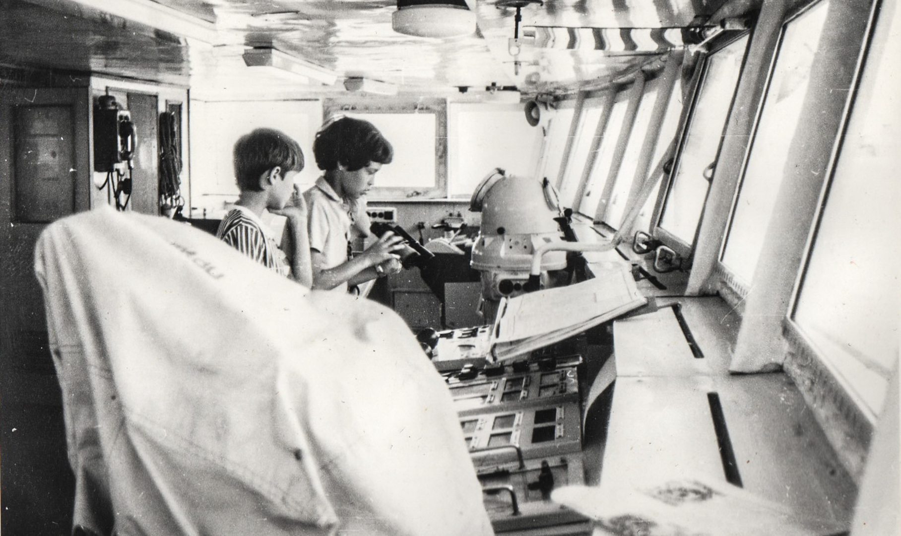
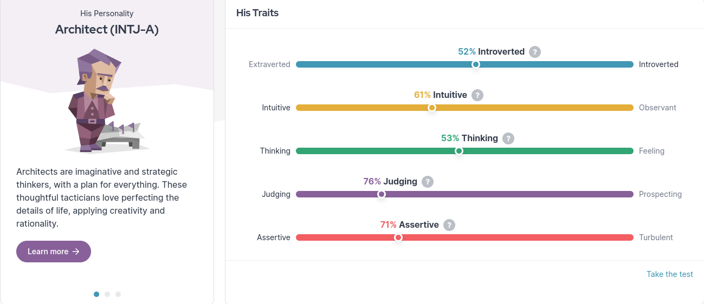

# Следование призванию

## Благоговение — отличительное чувство человека {#sense_of_awe}

В дни православного Крещения прочитал в ленте у цифрового вице-губернатора Казарина [публикацию о благоговении](https://t.me/skaz_spb/722).
Она опирается на научное исследование о том, что [благоговение благотворно влияет на психическое здоровье](https://journals.sagepub.com/doi/full/10.1177/17456916221094856#bibr29-17456916221094856).

Более того, чувство благоговения напрямую связано с состоянием счастья, о чём можно подробнее прочитать на русском [здесь](https://www.psyh.ru/ispytyvat-blagogovenie-znachit-byt-schastlivee/).
Также утверждается, что благоговение, трепет, или, попросту, ощущение «бабочек в животе» и «мурашек по коже», как особенную активность мозга (нейрофизиологический профиль), уже можно идентифицировать с помощью физиологических тестов типа магнитно-резонансной томографии, электроэнцефалографии или компьютерной томографии.
То есть уже имеются технологические процессы определения уровня эмоционального тона.
И дальше вопрос будет стоять лишь в оптимизации этой процедуры.

Во время изучения этой темы с анализом работы головного мозга натолкнулся на упоминание, что максимально широкую и яркую палитру эмоций среди млекопитающих испытывает только Человек.

Когда это узнал, вспомнилось, что всегда с некоторым скепсисом относился к определению

!!! quote "Цитата"

    Человек — это социальное животное.
    
    ^^Аристотель^^

Фраза Аристотеля не находит отклика, не потому, что отрицаю эволюционное происхождение видов и имею альтернативный взгляд.
Ни в коем случае!
Скорее потому, что обращаю внимание на навыки социализации братьев наших меньших.
Хоть и не зоолог, но в семье всегда был какой-нибудь питомец, и могу сказать, что умение животных строить отношения зачастую превышают возможности некоторых представителей Homo Sapiens.
И поэтому не хочется принижать возможности собак, кошек, лошадей и дельфинов в умении вести диалог, уживаться друг с другом вплоть до взаимовыручки и других развитых социальных навыков.

Но вернёмся к исключительным возможностям мозга человека.

Можно задаться вопросом: «Что сыграло ключевую роль в эволюции — возможность планировать и делать выводы или богатая палитра эмоций?
Что было причиной, а что следствием?»

Можно, но не рискну отвечать на него самостоятельно и оставлю этот вопрос специалистам.
Смысл этого мыслительного упражнения был лишь в том, чтобы определить, какой ответ мне самому больше нравится.

И мне больше нравится думать о себе-человеке как о живом существе с максимально широкой палитрой чувств, а не о животном с продвинутым интеллектом и навыком социализации.

Орангутаны весьма эффективно и зачастую хитроумно отстраивают сообщество себе подобных, но вот художников и актёров, которых переполняло бы богатство внутренних эмоций, среди них не наблюдается.

С другой стороны, можно видеть, как соревновательность в достижении ценностей социума — деньги, власть, сексуальность — порой делает людей животными.
А нелюдимые отшельники — творцы, ученые, путешественники — при этом становятся личностями с большой буквы.

Поэтому умение испытывать чувство благоговения и состояние счастья как отличительное свойство от животных, мной лично, субъективно, воспринимается по отношению к себе как более подходящее, чем определение Аристотеля.

## Анализ состояния счастья {#experience_of_happiness}

Периодически испытывать чувство трепета и благоговения также важно, как высыпаться.
В такие моменты снижается тревожность — ведь мы чувствуем себя частью бесконечной вселенной.
В качестве примеров максимально высокого эмоционального тона приводятся разные ситуации:

- Единение с природой — «вышел на край каньона и чувствуешь себя частью мироздания»;
- Наслаждение красотой и гармонией визуального или звукового ряда;
- Движение в танце;
- Пение в хоре;
- Создание и открытие чего-то принципиально нового — чувство Творца;
- Нахождение в глубокой молитве и единение с Богом.

Впрочем, я уверен, что каждый имеет свой опыт и ещё не встречал человека, который не понимает смысла выражения «до мурашек по коже».
В комментариях к этой главе [прозвучал рассказ об образе счастья](https://t.me/bongiozzo_discussion/920).
Приведу его тут же.

!!! quote "Цитата"

    Про счастье

    На одной из лекций соловецкого морского музея услышала рассказ от Матонина Василия Николаевича:

    Два глубоких гуманитария-москвича ищут формулировки счастья…
    Долгие разговоры и поиск образа.

    Входит сосед-помор к ним в комнату что-то попросить.
    Они его и спрашивают, как он определит счастье.

    «Что тут думать, отвечает он.
    Это когда садишься в лодку, заводишь мотор, всё море перед тобой, ты летишь на солнце и ВЕТЕР В ЛИЦО.
    Вот это ощущение ветра в лицо и есть счастье».

    Потом филологи разложили по символам, текстам, метафорам, мифам и удивились точности образа.

    Движение вперёд, с открытым лицом, навстречу ветру и солнцу, в природной стихии к неизведанному.

    И это не момент, это процесс!

    Всем в аудитории этот рассказ откликнулся.
    И мне!
    
    ^^[Евгения Васич](p2-100-authors.md#capysv)^^

Мне тоже откликается!
:-)

Чуть позднее понял, что это чрезвычайно распространенная ассоциация.
Есть целая серия книг «Ветер Радости» Григория Григорьева, где этот образ представляет очень схожее Счастью понятие – ощущение присутствия Бога.
И автор этой серии, в свою очередь, обратил внимание на ассоциацию с другим близким понятием:

!!! quote "Цитата"

    В передачи «Очевидное – Невероятное» на тему «Мышление и язык» академик Сергей Капица спросил профессора Татьяну Черниговскую о том, что такое сознание.
    И получил крайне неожиданный для доктора биологических наук ответ.
    Лучшим определением сознания, по её мнению, является образ ветра.
    Потому что сознание, как и ветер, мы можем видеть лишь в его проявлениях.
    
    ^^[Григорий Григорьев](https://www.livelib.ru/quote/48054208-veter-radosti-tri-dnya-v-lunnom-svete-grigorij-grigorev)^^

Помимо ветра, в образе обычно так или иначе присутствует вода или что-то с ней связанное.

!!! quote "Цитата"

    Если вы приглядитесь к действительно счастливому человеку, то обнаружите, что он строит лодку, пишет симфонию, даёт образование сыну, выращивает в своём саду двойные георгины или ищет яйца динозавра в пустыне Гоби.

    Он не станет искать счастье, как закатившуюся за батарею пуговицу от воротника.
    Он не станет преследовать его как самоцель.
    Он ощутит себя счастливым, будучи влюблённым в жизнь все двадцать четыре напряжённых часа в сутки.
    
    ^^[Walter Beran Wolfe](https://ru.citaty.net/tsitaty/624212-u-beran-fulf-esli-vy-prigliadites-k-deistvitelno-schastlivomu-ch/)^^

Вероятно, гений Джеймса Кэмерона добавил в этот образ ещё и влюблённость и достиг мирового рекорда выручки с «Титаником» — тут и ветер, и полёт, и вода, и огромный корабль, неизвестность впереди и любовь в моменте.

Мой похожий образ прозаичнее и был сформирован в детстве, в 80-е годы, во время летних каникул на грузовом теплоходе.
Такой необычный досуг был обусловлен тем, что в городе летом на меня нападала страшная аллергия и меня необходимо было эвакуировать либо на воду, либо в сосновый лес.
Санатории были по записи, да и муторно было родителям выбивать путёвки.
Выручал родной дядя, который брал меня к себе на работу на корабль.
На всё лето.

!!! note "Ситуация"

    В ночную вахту, под присмотром капитана, можно было подержаться за штурвал и немного порулить огромным судном.
    Это один из самых мощных моментов счастья за всю жизнь.
    Когда от твоего легкого движения и поворота руля, по всей махине расходится дрожь, будто бы слышится скрип рулевых тяг, приходят в движение огоньки буёв вокруг, нос огромного теплохода в темноте смещается в сторону, но вот движение замедляется и корабль ложится на новый курс, точно попав в огни створ!

    Оглядываюсь на взрослых мужчин, которые находятся в рубке.
    И через клубы дыма, в отсвете огонька от сигареты, видно удовлетворенное лицо капитана.
    Его рука ложится на моё плечо:

    — Нормально, парень!

    Счастье!

{ width=50%, loading=lazy }
/// caption
Детские воспоминания об управлении кораблём
///

Или другой случай с того же корабля.

!!! note "Ситуация"

    В одну из навигаций, когда горячо обсуждали последствия недавней аварии в Чернобыле, к команде сухогруза присоединились инженеры, чтобы установить и настроить новые радиолокаторы.
    Один специалист был ещё и продвинутым радиолюбителем и привёз с собой самодельный компьютер, собранный по инструкции из журнала «Радио-86РК».
    Это был первый PC, который я увидел в своей жизни!

    Загружал программы он с аудиокассеты!
    И не всегда с первого раза у него это получалось.
    Первое, что я увидел на маленьком зелёном экране был «Тетрис».

    Представляете, загадочные звуковые трели с кассеты каким-то волшебным образом превращались в двигающиеся фигурки на экране?!
    Чудеса!

    [Рассказы Азимова про роботов становились реальностью!](https://www.livelib.ru/review/5189677-lunnaya-pyl-ya-robot-stalnye-peschery-ajzek-azimov-artur-klark)

Самые яркие события детства происходили на корабле.
А вокруг чайки и солёное море.
Романтика и неизвестность в квадрате.

После этих историй, возможно, что-то переключилось у меня в голове — и в один момент я набрался мужества заявить родителям, что больше не буду ходить на престижный, но нелюбимый мной Большой теннис, а хочу ходить в Школу Юнг.
Был семейный совет, где я дал обещание не пропускать занятия, как делал это при любой возможности с теннисом.

Благодаря этому решению, спустя год, я оказался в международном лагере «Океан», во Владивостоке.
Там было сформировано ещё несколько романтических образов счастья, связанных с путешествиями.
Ближе к восьмому классу думал идти в Нахимовское, но семейная обстановка, ощущение глобальных перемен от подступающих 90-х и попытки найти доступ к какому-нибудь компьютеру плавно сменили курс следования Призванию.

Но большая вода продолжает манить!
Уже будучи семейным мужчиной, я закрыл детский гештальт и получил права шкипера яхты Bareboat Skipper (IYT), чтобы иметь возможность испытывать моменты счастья, описанные соловецким помором.

{ width=75%, loading=lazy }
/// caption
Стоишь за штурвалом, ветер в лицо, а впереди — море! Счастье…
///

К сожалению, с возрастом, как мне говорят старшие товарищи, уровень вырабатываемого дофамина значительно сокращается.
И людям с преобладающим рациональным и деятельным мышлением, чтобы оставаться счастливым, приходится искать что покрепче!
:-)

А с другой стороны — не к сожалению, а к счастью, цели с течением жизни становятся значимее.

Так появились формулы и модели Счастья.

И даже если [образ счастья в движении вперёд](p1-010-happiness.md#happiness_in_action), с «открытым забралом» за годы стал более прагматичным и подрастерял яркие краски и соленые брызги, то, по сути, он остался тем же.

Этот Текст — такое же путешествие в неизвестность…

## Частые моменты счастья {#frequent_happiness}

Характер моментов счастья или высокого эмоционального тона во многом зависит от особенностей человека, данных при рождении и сформированных в детстве.
Важно как можно раньше определить эту специфику и развивать её как увлечение.
Идеальная ситуация — связать с ней свою профессию и заниматься любимым делом большую часть времени.
Работаем ведь мы больше, чем отдыхаем.
Если только Вам не «повезло» с родителями.

Некоторые родители, не испытывающие стеснения в деньгах, могут по «доброте душевной» снабжать ими своих детей даже тогда, когда они могут справиться самостоятельно.
И заодно лишить детей возможности испытывать Счастье от самостоятельного развития и преодоления трудностей.

Испытывать повышенный эмоциональный тон, находясь в рабочем потоке, когда теряешь счёт времени — огромная Удача и Счастье!
Такое занятие можно назвать реализацией своего Предназначения или Призвания.
Основная часть времени жизни, потраченная на такую работу, будет иметь более высокий эмоциональный тон.
В случае следования Призванию есть шансы достичь максимальный интегральный уровень счастья на протяжении жизни.

Посчастливилось до своего 30-летия прочитать одну из первых книг по психологии именно о состоянии во время работы — [«Поток»](https://www.livelib.ru/review/3879424-potok-psihologiya-optimalnogo-perezhivaniya-mihaj-chiksentmihaji).
Благодаря этой книге мысль о важности находиться в Потоке любимого занятия нашла твёрдый и основательный фундамент.

## Лучшие практики Счастья на работе {#dream_job_checklist}

Отвечая на реакцию из комментариев к первой главе, где проявился интерес к кадровой политике Microsoft, дам более развернутый контекст формирования ощущений на работе.

!!! note "Пример"

    В начале 2000-х корпорация Microsoft несколько лет подряд занимала 1-е место в России по рейтингу удовлетворенности сотрудников.
    В Microsoft использовали лучшие практики управления персоналом и нанимали лучших в мире специалистов — это был мудрый бизнесовый подход и вот почему:

    — Решение человека по переходу в другую компанию или продолжению работы в нашей зависит от 4-х факторов!
    — открыто говорили нам на onboarding-мероприятиях New Employee Orientation.

    Прежде чем давать задания, новых сотрудников погружали в систему ценностей компании.
    Вот эти четыре фактора:

    . Деньги (зарплата, премии, страховки, опционы, компенсации затрат на эксплуатацию персонального автомобиля и так далее);
    . Сила бренда компании в вашей трудовой книжке;
    . Перспективность карьерного роста и расширение опыта;
    . Комфорт от работы в коллективе и нахождения в офисе.

    Сила бренда Microsoft в тот момент казалась несокрушимой:

    * Microsoft Windows совершенно разгромила операционную систему IBM OS/2;
    * Microsoft Office не знал конкурентов и не чувствовал угроз;
    * Microsoft SQL Server уверенно потеснил Oracle в корпоративном сегменте;
    * Монополия Netscape Navigator в Интернете была уверенно подвинута в сторону запуском инновационного Microsoft Internet Explorer;
    * Поисковик Google только анонсировал Google Docs, который тогда вызывал скорее смех при сравнении с Microsoft Office;
    * На рынке устройств безраздельно властвовал Windows Mobile — Android ещё не было и в помине, а Steve Ballmer (директор Microsoft) тогда только-только посмеялся над анонсированным iPhone 2G.

    Раз в полгода с каждым из нас руководитель проводил серьезную беседу о том, на какую позицию можно переходить дальше, чтобы не засиживаться.

    Специалисты HR также подключались к обсуждению, определяли твои сильные и слабые стороны и помогали найти занятие, где ты максимально реализовывал сильные навыки и исправлял слабые.

    Можно было найти работу, где не было необходимости перешагивать через себя.
    Лишь бы ценный сотрудник был в «драйве» и занимался любимым делом.

    В департаменте Microsoft Consulting Services руководителем был офицер ВВС США, который после очередного этапа в одном из проектов открывал Photoshop (или обходился примитивным Microsoft Paint — не помню), размещал лицо одного из консультантов на какую-нибудь картинку с суперменом и отправлял на весь Microsoft Russia с темой письма: «MCS Hero and amazing victory!»

    Это не единственное, чем он занимался, но его внимание и любовь к команде перекрывали любые плюшки и напитки в офисе, которые были в свободном доступе.

Находиться в таком коллективе было очень приятно.

Миссия Microsoft звучит как «To empower every person and every organization on the planet to achieve more».
Большинство сотрудников, по моим ощущениям, миссию искренне разделяли и чувствовали себя частью коллектива, идущего к Общей Цели.

Microsoft был компанией, где у сотрудников по пунктам 2, 3, 4 был максимальный уровень и это позволяло корпорации набирать и удерживать лучшие кадры на рынке, платя при этом ¾ от уровня зарплат в отрасли.
Учитывая, что зарплата составляет основную статью затрат компании, такое системное «осчастливливание» сотрудников за счёт нефинансовых аспектов было оправдано со всех сторон.
Экономически в первую очередь.

Как же достигать счастья, если каждый человек, личность, спектр чувств и образ мышления, сформированные нейронные цепочки мозга совершенно уникальны?

## Типы личностей и склонность к роду занятий {#mbti_personalities}

Хотелось бы знать подход, благодаря которому получится выделить области деятельности, доставляющие особенное удовольствие.
Люди очень разные, а видов деятельности, из которых стоит выбирать, не так уж много.

Замечательно, если ребёнок пробует самые разнообразные занятия в поисках Призвания, а не только следует школьной программе.
Взрослый человек обычно знает, какое занятие ему по душе, но в силу множества причин нечасто совмещает его с работой.

Если понимать спектр любимых занятий с детства, то уже в юношестве можно пробовать находить оплачиваемую подработку на стыках интересов.
Как определиться, куда идти?

По реакциям на происходящее можно относить человека к разным группам психотипов.
И соотносить эти типы с занятиями, в которых ценятся такие реакции.

Зачастую это видно уже в детстве.

2 упрощённых вида реакций, которые соответствуют природному разделению: «мужественная» и «женственная» — перестали быть достаточными уже тысячи лет.
Не говоря уж про наше время с эмансипацией, феминизмом и гендерами.

4 типа темперамента, которые [ввёл Гиппократ более 2000 лет назад](https://ru.wikipedia.org/wiki/Гиппократ): Холерик, Сангвиник, Флегматик, Меланхолик — одна из первых попыток создать модель психики.
Она до сих пор используется в обиходе и уже помогает определиться с родом занятий, но, всё равно, 4-х типов совершенно недостаточно.

Ещё в 90-е, в начале своей рабочей деятельности, с большим интересом узнал про Соционику — [советскую ветку практикума определения психотипов по методологии Юнга](https://ru.wikipedia.org/wiki/Типология_Юнга).

Привлекала сравнительно простая и понятная модель, которая помогает системно подступиться к анализу своих реакций на события и сравнивать с реакциями других.
4 основных критерия можно осмыслить без специальных знаний.
А варианты комбинаций, 2 в 4-й степени, дают 16 психотипов.
И это уже приличное многообразие, в котором интересно разбираться!

Забавно, что определённая часть собеседников, знакомых с этой теорией, относятся с раздражением к подобной типизации.
Объясняя тем, что люди могут реагировать на одну и ту же ситуацию по-разному в зависимости от настроения.
И наука не жалует эти практики тоже — методики, действительно, неточные.
И, вообще, человек — уникален, мир — бесконечен, «умом Россию не понять» и так далее и тому подобное.

Всё так.
Можно и так относиться.
Но это какая-то неконструктивная позиция.

Мне больше нравится думать, что это упрощение, или, по-другому если сказать — моделирование, даёт возможность заходить в осознанные размышления:
«А как я реагирую на события?
Как отличаюсь от других?
Почему и от чего зависит?»

Каждый критерий не бинарный — да/нет, чёрное/белое, а с градацией в процентах.
Что уже нивелирует примитивность модели и она становится довольно гибкой.

Но и 16 видов с описаниями склонностей позволяют сделать акценты на особенностях, которые воспринимаются как пугающе точные: «Откуда вы про меня такое знаете?» :-)

И если эти особенности можно использовать на работе как преимущество, и работа будет при этом нравится больше — то не так уж и важно, является ли это научным фактом или нет.
Главное, чтобы было любимое и полезное занятие, в котором получается развиваться.

Позднее на работе в Microsoft несколько раз проходил тренинги и практические занятия по типизации на основе методик западных психологов Майерс-Бриггс (MBTI) — это было действительно интересно и полезно.

Эффективность кадровой политики компании того времени была на высоте и практическая польза этой методики никаких сомнений не вызывала.

## Знание своих особенностей и сильных сторон {#architect_personality}

Тесты на принадлежность к психотипу разные и отличаются видами вопросов, на русском и английском.
Какие-то хорошо описывают психотип, какие-то не очень.
Но это не так важно, когда понимаешь смысл критериев и как работает модель.
Каждый раз, когда проходил, немного переживал — сохранится ли мой психотип?
И даже это беспокойство о постоянстве психики уже частично описывает мою психику!
:-)
В целом можно сказать, что мой психотип постоянный.

{ loading=lazy }
/// caption
Стратег-Архитектор с уклоном в планирование
///

[Тут мой результат последнего теста и описание типа Стратег-Архитектор](https://www.16personalities.com/profiles/588b2e7c12189).
Название типа в полной мере соответствует моему роду занятий: архитектор/создатель информационных систем.

И, пожалуй, я приведу тут своё восприятие смысла этих критериев разделения психотипов, чтобы не произошло недопонимания.

Беда только в том, что я описываю их через призму своего психотипа и тем самым формирую свою проекцию, в которую непреднамеренно затаскиваю Вас.
В [канале попробовал в лоб задать вопросы о склонностях](https://t.me/bongiozzo_public/659) и получил сводный результат практически идентичный своему психотипу.
Можно, конечно, предположить, что моё окружение однотипное и однородное, но НЕТ :-)
Дело в том, как формулируются вопросы.

Поэтому [тест лучше пройти самостоятельно](https://www.16personalities.com/) и до прочтения следующего абзаца.
Уходит на это минут 15, но потом мыслительные процессы запускаются в голове важные.
Описания психотипов наиболее детальные и интересные на английском языке.
Но даже если английский незнаком — всегда можно перевести средствами браузера.

А я постараюсь быть нейтральным в восприятии факторов, хотя это непросто.

### Направленность Внутрь или Наружу: (I)ntrovert / (E)xtravert {#introvert_extravert}

Это, наверное, самая общеупотребительная характеристика для человека — экстравертный и интровертный.
И тут ничего и объяснять не требуется.
Понятно же, какой человек направлен на окружение — общительный, открытый, зачастую эмоциональный, а какой внутрь себя — задумчивый, молчаливый, предпочитающий уединение.
Но тут важнее сказать про адаптивность.

При первом знакомстве меня часто определяют как экстраверта.
Но это неверная оценка.

!!! note "Ситуация"

    В детстве, когда был предоставлен сам себе, стремился к уединению — целый день напролёт возился с конструкторами и книжками, на улицу меня выгнать было целой проблемой.
    Начиная со старшей школы я начал выходить в мир, а на работе важность строить открытые отношения стала совершенно очевидной.

Поэтому я скорее адаптивный экстраверт и естественный интроверт.
В общении я трачу жизненные силы, а не набираю их.
Вплоть до резкого повышения давления, казалось бы, на ровном месте.

После эмоциональных переговоров мне надо приходить в себя.
Если этого общения «через край», я от него устаю и становлюсь несчастлив.
Для восстановления мне хочется уединиться и это всегда было моё естественное состояние.

### Мир, в котором ты живёшь: I(N)tuitive / (S)ensitive {#intuitive_sensitive}

Мир, в котором ты преимущественно находишься — он прежде всего воображаемый или реальный?
Твоё сознание чаще находится в неосязаемом, интуитивно проживаемом внутреннем мире?
Или оно про ощущения от восприятия реального мира и материальных предметов?

С детства витаю мыслями где-то в своих мечтах и планах.

Может быть на это мировосприятие повлияли многочисленные книжки в детстве?

!!! note "Ситуация"

    Научился читать до школы, а в первом классе уже вовсю читал книжные серии с описанием миров, начиная от Волкова об Изумрудном городе, продолжая Носовым о Солнечном городе и Луне.
    А потом миры Жюль Верна, Конан Дойля, Дюма и так далее.
    Всё подряд.
    Постоянно что-то читал и мыслями был там.
    Реальный мир и его достижения мне были не очень интересны, проигрывая ему в красках и эмоциях.

    Когда во втором классе я надел очки и заработал кличку «Ходячая энциклопедия», мои сверстники лазали по стройкам, закаляли характеры и наращивали мускулы в стычках с пацанами и реальным миром во всех его проявлениях.

    В результате я с упоением погружался в воображаемые миры и привык там находиться.

В развитом восприятии материального мира с позитивной установкой всегда можно найти чему порадоваться — тонким нюансам вкуса в еде, гладкому на ощупь велюру дивана, качественному переплёту книги или даже запаху бумаги.
Особенно когда эти приятные вещи принадлежат тебе!

Можно радоваться хорошей погоде и лучику солнца!
Они хоть никому и не принадлежат, но это и есть мир, которому принадлежим мы все.
И всё это выражается в чувствах и ощущениях Здесь и Сейчас!

Когда же проводишь слишком много времени далеко в своих мыслях и Интуиции – этого всего не замечаешь.

И как только внутренний мир надоел и ты начинаешь пробуксовывать…
Как только теряется драйв развития событий…
Становится неинтересна текущая цель и начинается хандра.

### Логика или Этика: (T)hinking / (F)eeling {#thinking_feeling}

Самым любимым в детстве героем, если угодно, супергероем, был Шёрлок Холмс в исполнении Василия Ливанова.
И, вероятно, уже можно больше ничего не объяснять.

!!! note "Ситуация"

    Меня завораживали его рассуждения о причинно-следственных связях.
    Восхищало его пренебрежительное отношение к этическим нормам или общепризнанным, но бесполезным (с его глаз) фактам — типа того, что Земля круглая и вращается вокруг Солнца.

    Если какое-то знание не используется в логических выкладках и не приносит реальной пользы — его можно выкинуть из памяти и «не захламлять свой чердак».

При этом мы взрослые знаем, что герои типа Шёрлока обычно одиноки и несчастливы.
Оно и неудивительно, ведь одно из определений счастья — это когда тебя понимают и разделяют жизнь вместе.
А это про отношения, про эмпатию, про этику, в конце концов.

Лет 15 назад в процентном соотношении перекос у меня радикальный, что-то вроде 80% в Thinking и 20% в Feeling.
Сейчас мои привычные реакции сместились к центру и практически в балансе (53%), но я-то знаю, что является естественной для меня первоосновой!
:-)

### Конкретика или Импровизация: (J)udging / (P)erception {#judging_perception}

При мысли о ситуации, в которой непонятно, что делать, я буквально вхожу в ступор.

!!! note "Ситуация"

    Ночным кошмаром, от которого до сих просыпаюсь в холодном поту, является вызов к доске на уроке, когда не знаю темы и нужно будет что-то придумывать на ходу.
    И не возможная двойка была причиной этого ужаса, а именно пребывание в состоянии неопределённости.

    Позднее меня серьёзно тяготили мысли об импровизации на сцене, куда меня могли внезапно вытащить на каком-нибудь мероприятии — в чем-нибудь поучаствовать или сказать тост.
    Понятно, что тут накладывалась неуверенность, которая с каждым годом естественным образом снижается — чего переживать-то?

    Но иметь план на любой случай — моя базовая потребность.
    Например, фотоаппарат, который всегда можно взять в руки и спрятаться за ним.

    С собой вынужденно таскаю рюкзак, который наполнен предметами на разные ситуации — power-bank для зарядки телефона и ноутбука, hdmi шнур, плавки, компактная куртка, очки, множество разных переходников и пузырьков, и даже тепловизор!
    Полезная, кстати, вещь.

Составлять списки и планы — полезный навык.
Это планирование своих действий также заранее формирует ожидания.
Стоит ли говорить, что зачастую, точнее практически всегда, всё идет не так, как планировалось?
А разрыв реальности и ожиданий — частая причина несчастья.
Особенно тяжело людям, у которых это планирование, что называется, в крови.
У меня и сейчас перекос 76% в Judging, а раньше было 90% около края.

### Идеальная работа {#dream_job}

Вот и получается, что оптимальный род занятий — в одиночестве или небольшой компании планировать или проектировать что-то инженерное в воображаемом, пока нереальном мире.
Архитектор информационных систем.
Вуаля.

В подтверждении практической пользы от понимания своего психотипа и наклонностей могу лишь привести собственные ощущения от работы.
Других доказательств, пожалуй, невозможно предоставить.

!!! note "Ситуация"

    Когда представлял, как может работать новая информационная система, как она обогащает общение людей на расстоянии, испытывал состояние, близкое к абсолютному счастью.
    Ради таких ощущений оставался на работе в ночь в конце 90-х, когда создавал прототип социальной сети — [чат-платформа Samara Pub](https://web.archive.org/web/20010429231340/http://www.mustdie.ru/Pubman/).
    Было сформировано активное сообщество пользователей по всей стране и даже за рубежом, общение разбавляли так называемые NPC персонажи — боты с характерами и визуальными образами.
    У друзей разработчиков была возможность программировать и добавлять своих ботов.
    В качестве мотивации доброжелательного общения была введена игровая валюта и достижения.

    Вся эта весёлая возня поклонников Samara Pub началась задолго до появления Facebook и ВКонтакте.
    И, кстати, продолжается до сих пор.
    Не было мыслей о том, что это надо монетизировать — мы были счастливы без денег.

    Такие же «приходы» счастья случаются и сейчас в [команде «Цифровой Петербург»](https://about.petersburg.ru/), когда рождается новый сервис.
    Предполагаю, что Цукерберг и Дуров испытывали максимальный уровень счастья именно в процессе создания своих миров, а не в моменте извлечения выгод от их создания.
    Впрочем, я этого не знаю наверняка.

В заключении можно ещё раз упомянуть про 5-й элемент, который ввели авторы сайта 16personalities — Уверенность и Самообладание.
Если раньше моей стихией было внимание к деталям и повышенная мобилизация во время переговоров в новых условиях (Turbulent), то теперь естественное состояние сдвинулось к общей оценке ситуации и спокойному анализу (Assertive).
И это прекрасно!

Думается, что сильные отклонения от 50% в 4-х основных осях являются отличительными свойствами характера.
Хорошо бы знать эти перекосы как сильные и слабые стороны и использовать их как преимущество или уметь компенсировать.
В зависимости от ситуации и целей.

## Хорошие примеры из литературы и кинематографа {#follow_your_calling}

Множество книг и фильмов создано о важности следования своему призванию.
Японцы построили целую [философию Икигаи](https://ru.wikipedia.org/wiki/Икигаи), помогающую находить удовлетворение, радость и осознанность во всех делах каждый день и способствующая долголетию.

Из российского современного творчества мне оказался наиболее близок текст Евгения Гришковца — [«Театр отчаяния. Отчаянный театр»](https://www.livelib.ru/review/3730660-teatr-otchayaniya-otchayannyj-teatr-evgenij-grishkovets).
Наш современник, на встречу с которым можно сходить во время его гастролей.
Пишет о своих переживаниях так, как будто бы ты сам написал о себе.

А дети обожают светлый, весёлый, но глубокий [индийский фильм «Три идиота»](https://www.kinopoisk.ru/film/423210/).
Там тоже про архитекторов, инженеров и фотографов.
Рекомендую.

Совершенно очевидно, что прожить счастливую жизнь больше шансов у того, кто занимается своим любимым делом.
Можно привести подходящее высказывание на этот счет:

!!! quote "Цитата"

    The best job is a high-paid hobby.

    Самая хорошая работа — это высокооплачиваемое хобби.

    ^^[Генри Форд](https://www.livelib.ru/quote/47208539-moya-zhizn-moi-dostizheniya-s-sovremennymi-kommentariyami-genri-ford)^^

И этот интерес и склонность к какому-то роду занятий есть у каждого!
Важно их найти и им следовать.

Есть мнение, что при приближении к уровню Мастера следование Призванию превращается в нелёгкую ношу и больше похоже на Долг:

!!! quote "Цитата"

    Художник стал относиться к таланту, который ему дан, как к своей собственности, а отсюда появилось право считать, что талант ни к чему его не обязывает.
    Этим объясняется та бездуховность, которая царит в современном искусстве».

    ^^[Андрей Тарковский](https://www.livelib.ru/quote/48219430-italyanskie-marshruty-andreya-tarkovskogo-lev-naumov)^^

Но к этому моменту и образ Счастья, скорее всего, поменяется в сторону служения людям.

Ведь мы живем в обществе.
И учитываем ценности и взгляды окружения.

Между тем времена и ценности меняются.
Сложнее или проще быть счастливым в нашем переменчивом мире?
