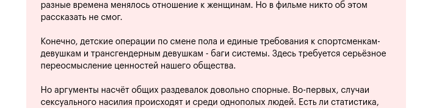
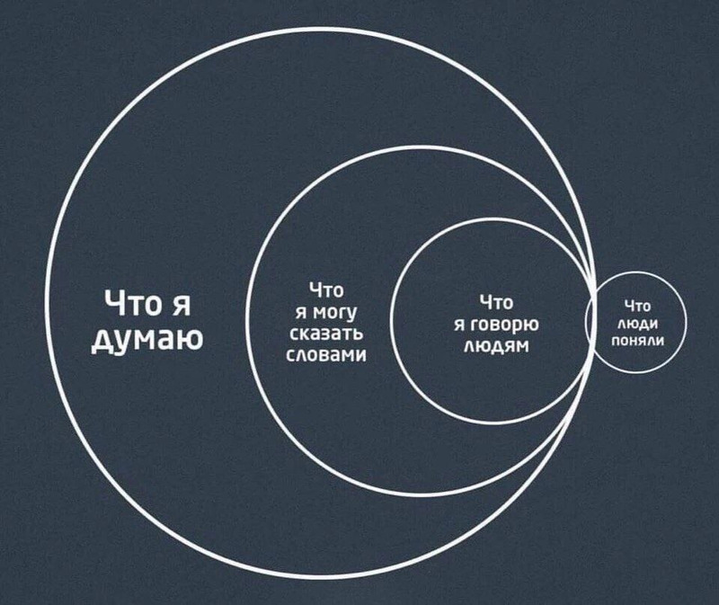

# Особенности нашего времени

## Наш организм и инстинкты {#human_body_for_happiness}

Нам посчастливилось жить в невероятно причудливое время.

Мы живём в эпоху, когда изменения, копившиеся тысячи лет, вероятно, проявятся при нашей жизни.
Может быть, даже стоит взять в кавычки слово «посчастливилось», чтобы подчеркнуть всю неоднозначность момента.
Разложу свою картину «по полочкам».

Каждое живое существо на уровне инстинктов стремится выжить.

С точки зрения антропологии сотню тысяч лет назад Homo Sapiens в прериях Африки развивались адаптивно — собирали орехи и фрукты, искали яйца птиц и другую легкодоступную пищу, но при этом старались не попадаться в лапы львам и другим хищникам.

Мы знаем это из школьной программы, хотя и после школы можно освежить эти знания в лёгком формате книги [«Sapiens. Краткая история человечества»](https://www.livelib.ru/book/1002920757-sapiens-kratkaya-istoriya-chelovechestva-yuval-noj-harari).

От древних видов, которые размножались массово, нам достались безусловные инстинкты.
Млекопитающие, которые тратят значительные силы на немногочисленное потомство, учатся его беречь – появляется привязанность, [чувства тоже эволюционируют](p1-020-call.md#sense_of_awe).

Для меня же важен вывод о том, что наш организм за сотни тысяч лет эволюции поменялся незначительно:

- Мы стали повыше на 10 сантиметров,
- Зубы уменьшились и стали ровнее — нет нужды пережёвывать малопригодную пищу,
- Голова в пропорции стала больше — всё-таки мозг развился.
:-)

А [палитра испытываемых чувств и эмоций расширилась кардинально](p1-020-call.md#sense_of_awe).

Наши тела остались приблизительно такими же, что нельзя сказать о наших условиях жизни по сравнению с первобытными.

Развитие сферы потребления современного общества радикально поменяло мир вокруг нас за последние две сотни лет.
В природном естественном отборе для устойчивых мутаций живым существам требуется сотни тысяч или даже миллионы лет, при том, что на часах эволюции наши жизни соразмерны тысячным долям секунды!

Мозг не успел перестроиться и продолжает посылать нам стимулирующие сигналы употребить побольше быстрых углеводов про запас, если мы видим жареную картошку или пончик.
Ведь наши инстинкты формировались во времена, когда еда была далеко не каждый день, её нужно было добывать в дикой природе и уметь откладывать про запас в виде жира.

Теперь этот инстинкт намного чаще создаёт проблемы с лишним весом и больше угрожает здоровью, чем сохраняет его.

Цивилизация позволила повысить процент доживающих до 80 лет.
Однако природа всё ещё «включает» ген старения в 30-40 лет, который начинает разрушать наши ткани.
Это ведь важный для эволюции фактор — не затягивать со сменяемостью поколений, чтобы увеличить число возможных мутаций и ускорить развитие вида.

Однако нас лично такой природный подход вряд ли радует.
:-)
Мы только встали на ноги, но уже начинаем чувствовать, как появляются первые признаки увядания.
Эти инстинкты и особенности нашего организма не повышают, а обычно понижают [интегральный уровень счастья](p1-010-happiness.md#happiness_model).

## Осознанность и зависимости {#awareness_and_addictions}

Наше мышление и уровень осознанности тоже оставляют желать лучшего.

Чтобы не ходить далеко, можно на моём же примере посмотреть.

/// abstract | Пример

Вот знаю же, что алкоголь и никотин обладают наркотическим действием и не делают меня здоровее?

Знаю!

Буду дальше культурно «припивать»?

Пока не готов зарекаться о полном отказе.

Вероятно ещё нанесу умеренный вред печени и другим органам, если в состоянии продолжительного стресса с постоянной мыслительной нагрузкой, анализом и контролем поступающей информации не хватит воли и «мозгов» переключиться на «холостой ход» иным способом.

///

«Выдохнуть» и проЧувствовать красоту момента ярким и быстрым способом иногда крайне соблазнительно.

Особенно, когда есть интересный собеседник и это действо вас объединяет.

Потихоньку меняется отношение к таким ситуациям и процесс этот начался лет 20 назад, когда больше внимания стал уделять вкусовым и ароматическим нюансам.
Также и с кофе.

/// quote

Кофе – это удовольствие, Тамар.
А пить нужно с удовольствием.
Чтобы было потом, что вспоминать.

[Наринэ Абгарян](https://www.livelib.ru/quote/799606-lyudi-kotorye-vsegda-so-mnoj-narine-abgaryan){ .author }

///

Так повышается осознанность и усиливается [яркость приятного момента](p1-010-happiness.md#moments_of_happiness).

А заодно сокращается количество алкоголя до того минимума, когда остаётся лишь вкус напитка без сопутствующего опьянения и риска для здоровья.

Так или иначе, алкоголь мы употребляем, чтобы отключить «внутреннего цензора» и снизить пресс забот.
И в общении с близким человеком за рюмкой, вероятно, будет больше положительных эмоций и теплоты.

Человек снижает контроль Разума и доВеряется миру.
Хотя все мы знаем об обратной стороне этого состояния.

В контексте рассуждений о Счастье очень понравилось определение:

/// define

Алкоголь

- Это Радость, взятая взаймы у завтрашнего дня.

///

Уже находясь в бесконтрольно изменённом состоянии, легче включаются и другие сформированные ранее зависимости, например, никотиновая.
Курение также пытаются ограничивать и повышать эстетику процесса трубками, кальянами и прочими изобретениями, уничтожающими организм не так быстро.

Подробно и увлекательно распространённые зависимости и быстрые способы повышения эмоционального тона описаны в [«Занимательной наркологии»](https://www.livelib.ru/review/3535819-zanimatelnaya-narkologiya-andrej-makarevich) лидера «Машины Времени» Макаревича.

Намного жёстче о своих зависимостях пишет актёр Мэттью Перри, который своими шутками мастерски поднимал эмоциональный тон «Друзей», довольно быстро уничтожил наркотиками свой организм  и умер в день публикации этой главы.
[Его исповедальный текст](https://www.livelib.ru/review/3780112-druzya-lyubimye-i-odna-bolshaya-uzhasnaya-vesch-avtobiografiya-mettyu-perri) местами пробирает до содрогания и служит хорошим предостережением от заигрывания с эмоциональными стимуляторами.

Глубоко любимый мною [Оззи Осборн описал свою жизнь](https://www.livelib.ru/review/3752326-ya-ozzi-vsjo-chto-mne-udalos-vspomnit).

Точнее ту её часть, которую сумел вспомнить!
:-)
Ничего он не мог поделать с собой и не умер (на момент написания этих строк) лишь благодаря фантастической сопротивляемости своего организма отравлениям и, я бы добавил, небывалой удаче.

Но благодаря его песням миллионы продолжают испытывать душевный подъём, и, значит, количество моментов счастья в нашем мире растёт.

{ width="50%", loading=lazy }
/// caption
Всего-то 100 лет назад курение приравнивалось к здоровому образу жизни
///

Ещё 100 лет назад такое отношение к изменению состояния через разрушение собственного организма было объяснимо.
Курили все — и женщины, и дети.
Курение позиционировали как полезную замену диеты!
И в споре об «очевидном», казалось бы, вреде можно было оказаться в меньшинстве.

Ситуация изменилась.
Да, есть динамика, но, глядя на себя и по сторонам, незначительная.
В массе своей у нас не получается бороться с недостатками нашего сознания и повышать осознанность, когда дело касается зависимостей и стремления к счастью.

- Если в молодости, во время формирования организма, в стремлении к счастью, «хватило ума» воздействовать на «часовой механизм» эмоционального тона «кувалдой» стимуляторов с эффектом зависимости.
- Если таким проекциям эйфории удалось закрепиться в нейронных цепочках.
- То, скорее всего, наш мозг будет возвращать желания повторить такой опыт получения моментов счастья на протяжении всей жизни.

Вероятно, что для организма будет «дешевле» сносить умеренный вред и балансировать, чем «на волевых» сопротивляться зависимости, усиливая и без того высокий уровень стресса.
Идеально, наверное, научиться слышать негромкое «тиканье» своего организма и корректировать его только мыслями и нагрузками без каких-либо веществ, трав и таблеток.

Могу заметить, что когда нахожусь в воодушевлении от новой и важной задачи и когда занимаюсь ровно тем, что люблю — не возникает особого желания защищаться от выгорания ни алкоголем, ни никотином.
Наверное потому, что выгорания нет в этот момент!
:-)

Зачастую просыпаюсь до восхода и это хорошая возможность в новом свете увидеть нерешённый вопрос и тут же запустить процессы, на которые не хватало времени в дневной рутине.

Лично для себя сделал вывод, что [следование Призванию](p1-020-call.md) может сохранять здоровье лучше, чем борьба «на волевых».

Эти вредные привычки как бы намекают нам: «Ты можешь достичь большего — достаточно поставить по-настоящему важную и большую цель, и мы уйдём сами».

И такой естественный подход работает, вероятно, эффективнее, чем попытки заглушить их терапиями, таблетками и другими «костылями».

## Россияне в ожидании сказки 100 лет назад {#new_hope}

Большие и воодушевляющие цели ставились в российском обществе 100 лет назад.
В 1917 году именно в России многие жили в надежде, что строится новый мировой уклад общества, основанный на разумном распределении ресурсов и дружбе народов.
Границ и стран не будет, будет одно общество трудящихся.
От каждого по способностям, каждому по потребностям — все будут счастливы!
Труд будет не следствием эксплуатации одних другими, а естественной потребностью для человека!

Несмотря на кажущуюся утопичность этих принципов в призме капиталистического мироустройства, в них верили и делали на них ставку.
Даже когда российские территории в качестве контрибуции отходили к Германии в 1918, руководство страны держало в уме, что скоро эти земли вернутся под управление Интернационала.
И действительно ситуация складывалась в пользу большевиков

На первый взгляд цели ставились идеалистические и способствующие росту счастья.
Ведь интересно же опускаться на дно океана, летать на другие планеты или изучать историю!
И при осознанном потреблении ресурсов, когда излишки перераспределяются — их всем хватит.
Да и работа на всех найдётся!

«Для замещения тяжёлой работы построим электростанции и заводы с конвейерами!» — говорили большевики.
«Коммунизм — это Советская власть плюс электрификация всей страны!» — математически точно формулировал Ленин важность технического прогресса в образе счастливого общества.

Только сознание у людей, объективно, не было готово к таким переменам и идеалам.
Не готов человек считать равными в правах своё окружение.
Ни 100 лет назад, ни сейчас.

Родился на Манхеттене или внутри Садового кольца — одна жизнь.
В промышленном человейнике или глухой деревушке — другая совсем жизнь будет.

И один будет эксплуатировать другого, и войны на Земле будут неизбежно, пока Человек не станет Разумным по-настоящему и не начнёт осознанно относиться к своим мотивам.

/// quote

Вся современная история России выглядит как череда прибойных волн.
Это волны возмездия.
Февральская революция - это возмездие нашей высшей аристократии за её высокомерие и тупую неподвижность по отношению к народу.
Октябрь и Гражданская война - это возмездие буржуазии и интеллигенции за одержимый призыв к революции, за возбуждение масс.
Коллективизация и раскулачивание - возмездие крестьянам за жестокость в Гражданской войне, за избиение духовенства, за массовое Гуляй-поле.
Нынешние чистки - возмездие революционерам за насилие над крестьянами…
Что там ждать впереди, предугадать невозможно, но логически можно предположить еще несколько волн, пока не завершится весь этот цикл ложных устремлений…

[Василий Аксёнов](https://www.livelib.ru/quote/78525-moskovskaya-saga-v-3-knigah-kniga-1-pokolenie-zimy-vasilij-aksenov){ .author }

///

Остаётся надеяться, верить и разбираться в природе этих ложных образов счастья!

## Самосознание 500 лет назад {#self_awareness}

К какому режиму работы адаптировался наш мозг за время эволюции?
Ведь он должен быть плюс-минус сбалансированный.

Тысячи лет до эпохи технического прогресса каких-то особенных изменений в укладе жизни у людей не происходило.
Прадед, дед, отец, сыновья и внуки охотились одинаково.
Из инструментов рогатины, топоры, лук да стрелы.
20 тысяч лет пользовались луками и всего 500 лет назад начали использовать порох.
Ничего принципиально не менялось на протяжении нескольких поколений.
Одинаковые войны, одинаковые заботы, одинаковые жизни.

Если хочешь знаний и просвещения — иди в монастырь.
Лучшие умы стекались туда, монахи были грамотные, у них были книги, еда, деньги, оружие и самые продвинутые технологии.
Достаточно побывать на Соловках, чтобы в этом убедиться — свои водные каналы, шлюзы, водопровод, оранжереи, сложные схемы отопления, маяк с актуальной по сей день хрустальной оптикой, совмещенный с колокольней.
Это был центр мира: единение духа, интеллекта и труда.

В то время, когда образ жизни не менялся за одно поколение и мир вокруг был полон тайн, в центре мироздания был Бог.

Люди совершенно по-другому мыслили.
Удивительными для меня оказались наблюдения ученого и писателя Евгения Водолазкина, изучавшего летописи русского средневековья — там практически отсутствуют «Я» формулировки.
Даже когда летописец писал о себе — использовалось третье лицо.
Для того чтобы почувствовать себя средневековым человеком, вероятно, действеннее не надевать лапти или кольчугу, как это делают реконструкторы, а в течение недели не использовать в речи и, что особенно важно, в мыслях «Я» форму.

Не «Я провел встречу и подписал контракт с заказчиком», а «Волей Божией подписали контракт» :-)
Забавно.

[Чувство благодарности и благоговения](p1-020-call.md#sense_of_awe) при столкновении с необъяснимым и бесконечно великим, можно предположить, возникало чаще.
А чувство зацикленности на себе и зависти к успехам «друзей» из ленты соцмедиа — реже.

## И вот наступила эпоха научного прогресса {#scientific_progress}

И если мы, как будто бы, не можем похвастаться значительным прогрессом в физиологии и общественном сознании, то с технологическим прогрессом за последние пару сотен лет всё очень неплохо.
А в области информационных технологий прогресс просто умопомрачительный, и кривая роста объёмов обработки данных год к году стремится к бесконечности.
Прошлое поколение ещё не знало мобильных телефонов, а теперь каждый в любой момент времени может прояснить для себя любой вопрос известный человечеству, подключившись к Википедии.
А искусственный интеллект, который вобрал в себя знания, накопленные человечеством со времён Адама и Евы по сегодняшний день, разжуёт для тебя эти знания персонально.
Фантастика!

Можно попробовать резюмировать:

- Тело у нас «заточенное» эволюцией под образ жизни первобытного человека,
- Сознание по сравнению со средневековым стало эгоцентричным, хотя до настоящей осознанности нам далеко,
- Но мы получили в руки инструментарий сверхлюдей в части обмена информацией.

У меня такая ситуация перекоса вызывает ассоциации с капризным ребенком в очень обеспеченной семье или вспоминается метафора «обезьяна с гранатой».

Достижения капиталистического строя на всемирных выставках XIX века (паровозы, пароходы, конвейеры, заводы) поражали воображение, ломали старые представления о богоцентричном мире и меняли жизнь уверенно и бесповоротно.
Критическое мышление и отход от традиционных ценностей мыслителями-теоретиками, такими как Маркс или Ницше, расширяли сознание и представление о мире.
Что прекрасно!

## Манипуляции системами ценностей {#new_system_of_principles}

Однако новые взгляды, как новая система координат, успешно использовалась для определения уязвимых мест в сложившихся структурах власти и манипулятивной раскачке общественных настроений политиками-практиками — Лениным и Гитлером, например.
Были найдены виновные в несчастьях нации.

Ведь наиболее быстрый способ сплотить людей – указать на уничтожимое препятствие, которое отделяет их от Счастья:

/// quote

Политика манипулирует не напрямую переживанием счастья, а косвенно, через нагнетание любви или ненависти, через возможность трудиться или лишение работы, через укрепление веры людей в человека и общество или её уничтожение, через формирование у человека надежды на лучшее будущее или её разрушение.

[Александр Иванович Юрьев](https://www.livelib.ru/quote/47010391-strategicheskaya-psihologiya-globalizatsii-psihologiya-chelovecheskogo-kapitala){ .author }

///

Ленин выбрал в качестве мишени эксплуататоров и духовенство, при этом [манипулятивно воспользовался работами Льва Толстого, сделав его «Зеркалом русской революции» и исключив работу духовного роста, о которой твердил Лев Николаевич](https://www.livelib.ru/quote/48243565-lenin-lev-danilkin).

Гитлер обозначил евреев и русских препятствием для счастья своего народа, манипулятивно приравняв сверхчеловека Ницше с арийской расой.

Далее [мощнейший общественный мотив стремления к счастью](p1-010-happiness.md#cornerstone_of_text), помноженный на технологии массового уничтожения, создаёт бедствия всемирного масштаба.

## Манипуляции в наше время {#lgbt_blm}

Пересмотр принципов в отношении рас (BLM), полов и гендеров (LGBT) последних лет, как естественное следствие развития эгоцентричного мира, на мой взгляд, может использоваться как новый инструмент влияния на геополитическом уровне.
Экономические войны идут постоянно, но в качестве причины развязывания конфликта часто используется разность в идеологии.
И если уже невозможно использовать религиозные, национальные или социально-экономические различия, то можно создать новые.

Сделал этот вывод самостоятельно, общаясь со знакомыми итальянцами, американцами, сербами, вьетнамцами, мигрантами, погружаясь в историю, книги и документальные фильмы.
Многочисленные диалоги по этой теме с друзьями мне привести будет затруднительно, но вот американский журналист провёл мощнейшую работу в фильме-интервью [«What is a Woman»](https://www.kinopoisk.ru/film/5016160/).
Пересматривал его несколько раз, с женой, друзьями и дочерью.
Действует как прививка.

Считаю, что уважительно отношусь к правам и мнениям разных людей, включая представителей нетрадиционных ориентаций.
И даже если мне не довелось вести с ними задушевных бесед о трудностях их непростой жизни — трудно не видеть те перекосы и потенциальные риски, которые создаются популяризацией этих течений в головах наших же детей.
При этом, если как-то произошло, что люди одного пола хотят быть вместе — уверен, что настоящая Любовь найдёт возможность им объединиться без выхода на демонстрацию с транспарантами вагины и не тряся причиндалами на уровне головы неподготовленного ребёнка.

Прочитал одинокую, и от этого заслуживающую уважения, оправдательную рецензию к этому фильму с позиции Адвоката на сайте Кинопоиска.
Где девушка «мужественно» пытается защитить всё то, на что направлен жёсткий посыл этой документалки.

{ width="100%", loading=lazy }
/// caption
Рецензия на фильм
///

И в целом, всем сердцем принимая её комментарий и ассоциацию с процессом программной разработки информационной системы, готов с ней согласиться и дополнить.
Если эти «баги» нового дивного мира столь очевидны и критичны — может не стоит тогда использовать эту доктрину как фактор давления на страны Евросоюза и убеждать, что этот «релиз» (эту версию) можно «выкатывать в прод» (запускать в использование) во всём мире?
С подходом: «Если не согласны — значит вы против прав человека!»
Может, действительно, надо критически подойти к оценке ценностей общества?

<!-- Перенести в практическую часть? -->
Ну, например, [прикинуть количество и интенсивность моментов счастья на длительном промежутке времени](p1-010-happiness.md#happiness_model), включая предстоящую старость, в парах разнополых родителей с детьми и у однополых без детей.
Понятно, что в состоянии влюблённости никто никакими расчётами заниматься не будет.
Но размышления в таком ключе в момент формирования личности в школе, думаю, будут полезны.

Неожиданно было услышать [слова Достоевского](https://www.livelib.ru/quote/811696-a-g-dostoevskaya-vospominaniya-a-g-dostoevskaya), признанного мастера формировать чувственные образы, сказанные в количественной модели счастья:

/// quote

Ах, зачем вы не женаты, и зачем у вас нет ребенка, многоуважаемый Николай Николаевич.
Клянусь вам, что в этом 3/4 счастья жизненного, а в остальном разве одна четверть!

[Фёдор Михайлович Достоевский](https://www.livelib.ru/quote/811696-a-g-dostoevskaya-vospominaniya-a-g-dostoevskaya){ .author }

///

Взяты эти слова из письма Николаю Страхову, который был другом Льва Толстого прежде всего.
Именно Страхов мог, но так и не познакомил самых известных русских писателей друг с другом.
И тот и другой размышляли о Счастье и формулировали свои концепции развития личности – [один с акцентом в идеалах и этике, а другой в балансе и мышлении](p1-020-call.md#thinking_feeling).

И когда Фёдор Михайлович, достигший мировой известности и к концу жизни решивший материальный вопрос, насчитал 3/4 всего своего Счастья благодаря детям.
Когда ты сам чувствуешь адекватность этой оценки.
Тогда становится тревожно за внушаемых людей с нюансами в проявлении Любви, которых современное либеральное общество подталкивает к child free образу жизни.
Это похоже на глобальную манипуляцию, которая потенциально может сократить яркость жизни и частоту возникновения моментов Счастья в их будущем.

[Интеграл по счастью](p1-010-happiness.md#happiness_model) может сократиться на половину, а к зрелому возрасту упасть ниже нуля.
Тогда для восполнения положительного эмоционального тона потребуется ещё больше виртуальной реальности и суррогатов.
Что приводит к ещё большей инфантилизация общества.

Впрочем, в западном либерально-демократическом обществе этот приоритет за время написания этого текста заметно снизился.

И в завершение этой темы про манипуляции вокруг консервативно-религиозных традиций, к которым относятся гендерные вопросы, можно привести высказывание французского эксперта:

/// quote

Являлось ли целью издеваться над добрым народом, используя какой-то экономико-философско-сатанинский обряд?

Что происходит, когда мы одержимы нигилизмом?..

Всемирный, простите, западный успех Роулза, начиная с 1980-х годов, был спланирован, и в особенности среди этих придурковатых французов.

Мой друг и издатель Жан-Клод Гийбо сказал мне тогда и позднее подтвердил, что «Теория справедливости» была переведена издательством Seuil в 1987 году при финансовой поддержке ЦРУ.

Сомневаюсь, что российским службам при Путине удалось провести операцию такого же уровня во французской интеллектуальной среде.

[Эмманюэль Тодд](https://www.livelib.ru/quote/48558166-porazhenie-zapada-emmanyuel-todd){ .author }

///

## Настрой общества и отношение ученых к ценностям разнятся {#scientific_approach}

Примечательно, что гениальные учёные, совершившие реальные прорывы в науке, зачастую не разделяли прогрессивные и модные общественные течения.
Например, по отношению к религии и борьбе с Богом.

Альберт Эйнштейн, сформулировавший теорию относительности и, как казалось тогда, подступивший вплотную к раскрытию тайны мироздания, откровенно злился когда ему за глаза навешивали ярлык атеиста.
Приведу его рассуждения на эту тему.

/// quote

Ваш вопрос (о Боге) является самым трудным в мире.
Это не тот вопрос, на который я могу ответить просто «да» или «нет».
Я не атеист.
Я не знаю, могу ли я охарактеризовать себя как пантеист.
Эта проблема слишком обширна для наших ограниченных умов.
Могу ли я не отвечать притчей?

Человеческий разум, независимо от того, как хорошо он обучен, не может понять Вселенную.
Мы подобны маленькому ребёнку, зашедшему в огромную библиотеку, стены которой забиты книгами на разных языках до потолка.
Ребёнок понимает, что кто-то должен был написать эти книги.
Но он не знает, кто и как их написал.
Он не понимает языков, на которых написаны книги.
Ребёнок замечает определённый порядок этих книг, порядок, который он не понимает, но смутно представляет.
Это, как мне кажется, отражает отношение человеческого разума, даже наилучшего и самого культурного, к Богу.
Мы видим, что Вселенная устроена удивительно, подчиняется определённым законам, но мы понимаем эти законы лишь смутно.
Наш ограниченный разум не способен постичь загадочную силу, которая качает созвездия.

 [Альберт Эйнштейн](https://ru.wikipedia.org/wiki/Эйнштейн_и_религия){ .author }

///

Понятна реакция Эйнштейна.
Ведь даже сам термин «атеист», не про веру в Науку, а про неверие в Бога.
И учитывая, что Бог, как понятие, у непогруженного человека, зачастую субъективное, стереотипное и наносное, статус атеиста — это прекрасный повод отмахнуться от всех сложных вопросов и дилемм: «Я атеист и в бога не верю!»

После этого высказывания, проводится черта между мной — рациональным трезвым современным человеком и остальным непонятным «мракобесием», в котором надо разбираться.
Есть прекрасный анекдот-притча на этот счёт.

/// abstract | Анекдот

Жил-был на свете один атеист.
Характеризовался хорошим знанием религиозных тем.
Он был довольно начитанным в Евангелии и легко спорил с православными батюшками, с католическими ксендзами, с протестантскими пасторами.
Он знал церковный богослужебный устав, поэтому мог спорить даже с церковными уставщиками.

Мало того, он знал даже и еврейскую письменность, знал и Тору, и Каббалу.
И мог спорить и с евреями на темы, которые их интересовали.
Мало того, он знал и мусульманскую письменность, он знал хорошо Коран, суры, сунны, толкования, хадисы пророка.

Короче, он вводил в шок и трепет всех монобожников: христиан, мусульман, иудеев, спорил с ними жарко.
Где ни заметит, бросается в спор и побивает их.

Это рождало ужас и трепет во всех религиозных деятелях и рождало великое уважение атеистов.

Однажды к нему пришел молодой человек и говорит:
– Я хочу у вас учиться.
Я такой же безбожник, как и вы, и мне очень импонирует эта ваша начитанность, агрессивность в спорах с религиозными деятелями.
Я тоже так хочу.
Я хочу защищать безбожие вашей аргументацией.

На что этот известный атеист говорит ему:
– Сынок, ты когда-нибудь слышал хор девственниц на ночной службе в монастыре?
Как они с полуночи до утра поют богу псалмы и песни духовные?

Тот отвечает:
– Нет, конечно, никогда этого не слышал, потому что мне это не надо, потому что я атеист.

Он говорит:
– Хорошо, а ты знаешь, о чем думают мусульмане, когда одеваются в белые одежды и идут пешком в свой хадж в Мекку, и чем они занимаются, когда в Мекке сидят вокруг Каабы?
Что они там делают, о чем думают, что поют, что едят?

Тот отвечает:
– Мне это вообще неинтересно, потому что я атеист, как вы сами понимаете, я не интересуюсь такими вещами.

Он говорит:
– А ты когда-нибудь слышал, как плачут в своих кельях отшельники?

Тот отвечает:
– Нет, мне это совершенно до лампочки, потому что я атеист и не интересуюсь этими вещами.
Я хочу громить всех церковников, и мне не интересно, вообще, о чем они плачут, о чем они поют, о чем они думают.

Он говорит:
– Я еще спрошу, ты знаешь, сколько часов в день над книгами проводит средний раввин?

Тот отвечает:
– Я не знаю всего этого.
И мне непонятны ваши вопросы.
Неужели вы не понимаете, я атеист, как и вы!
Мне плевать на раввинов, на мулл, на паломников, на монахинь, на отшельников, на всё!
Я хочу быть проповедником атеизма!

Атеист поспрашивал его ещё.
Потом говорит ему:

— Сынок, понимаешь, ты не атеист.
Ты дурак!

///

Я этот анекдот услышал в исполнении протоиерея Ткачёва, но, самое забавное, что в Интернете нашёл его на сайте какого-то боевитого атеиста, где он пускается в рассуждения на этот счёт и, кажется, сам себя запутывает окончательно.
Во всяком случае, прочитав его рассуждения, создаётся впечатление, что-либо ему придётся найти ответы на феномен возникновения жизни ([смотрите статьи о гомохиральности](https://elementy.ru/novosti_nauki/432316/Na_puti_k_obyasneniyu_gomokhiralnosti_zhizni_polyarizovannye_elektrony_initsiiruyut_khiralno_selektivnye_reaktsii_v_gazovoy_faze)), найти объяснение природы «тёмной материи» и до конца разобраться с теорией струн, либо смириться с этим неблагозвучным эпитетом, который стоит рядом с гордым званием Атеиста.

## Выводы {#time_summary}

В момент написания этого абзаца совершенно не хотелось лезть в дебри [креационизма](https://ru.wikipedia.org/wiki/Креационизм) и разбираться в противоречиях религии, естественных наук и философии.

Очевидно, что для этого нужно одинаково глубоко разбираться во всех этих дисциплинах.

В этой части Текста хотелось бы остановиться на беглом анализе причин возникновения моментов Счастья — для этого слишком далеко ходить не придётся.
Тем более, что погружаться в эти глубины можно будет позже по необходимости и при желании.

Попробую выписать сделанные мной обобщённые выводы в список:

- Опору в Боге, в успокоительном центре мироздания, общество в основной своей массе потеряло уже довольно давно;
- Другие фундаментальные принципы и ориентиры, ведущие к счастливой и осмысленной жизни, не закрепились и вызывают вопросы;
- Мы, как биологический вид, обладаем весьма посредственными физическими данными для противостояния стихии один на один,
- Но мы напридумывали всякого оружия массового уничтожения себе подобных;
- Наша осознанность, вероятно, укрепляется, но мы всё ещё развлекаем себя легкими наркотиками, алкоголем, неполезной и лишней пищей при том, что знаем о разрушительном для тела действии;
- Мы привыкли и в целом спокойно относимся к очевидному неравенству людей при их рождении;
- Мы заметно улучшили качество жизни за последние сотни лет и продолжаем его улучшать с большим рвением;
- На Марс мы пока не улетели, но у нас есть стремительно развивающиеся социальные медиа пространства;
- Отсутствие (в основной массе) знания исторических событий и общественных настроений, даже последних столетий, не позволяет видеть маятник схожих ситуаций и одного витка за другим;
- А отсутствие навыков критического мышления даёт возможность применения глобальных манипулятивных техник и пропаганды в современном информационном обществе;
- Человечество бежит в виртуальные пространства, где можно испытывать приятные чувства, не прикладывая серьёзных усилий.

## Искусственный интеллект — следующая угроза человечеству? {#happy_tomorrow}

Фантасты уже несколько десятков лет говорят про то, что Человекоцентричный мир может закончиться уже при нашей жизни.

Как только технологический прогресс дойдёт до запуска искусственного интеллекта, который будет превосходить наш и который мы не сможем контролировать, наступает, так называемая, точка технологической сингулярности.

Сам не страдаю фобиями, но темпы развития машинного интеллекта и сценарии его применения беспокоят известных мыслителей нашего времени.
Как в 1970-е годы создавались ассоциации по биоэтике, затрагивающие вопросы вмешательства технологий в человеческое тело, также были созданы ассоциации этики искусственного интеллекта, который может создать угрозу человечеству.

Казалось бы, можно сказать, что достаточно выдернуть компьютер из розетки, отключить от сети, но ведь сам же понимаешь, что вычисления давным-давно распределены и инфраструктура защищена от таких ситуаций, как потеря электропитания.

Можно сколько угодно спорить о том, чем закончится появление сильного интеллекта, или даже более сильного разума, но со 100% вероятностью можно говорить только одно: мы не знаем!
Можем верить, что всё закончится хорошо!
:-)

### Определение интеллекта и разума {#ai_definition}

Хотя для ясности всё-таки стоит определиться с понятием Интеллекта и Разума.

Такое определение мне понравилось:

/// define

Интеллект

- Это способность субъекта достигать целей в широком спектре окружающих сред его существования.

///

Благодаря ему можно представить отношения Интеллекта и Разума в привычных понятиях.

/// define

Интеллект

- Это автомобиль.
У которого бывают разные двигатели, коробки передач, подвески и кузова.

///

И тогда

/// define

Разум

- Это водитель, который использует Интеллект для достижения целей и решения задач с учётом ограничений морально-этических норм.
Которые, в свою очередь, формируются через [осознание своей смертности](p1-010-happiness.md#funeral_as_result).

///

И если задачи решаются и цели достигаются, то не так уж важно как именно работает этот мотор.

Основной характеристикой интеллекта является его мощность.
Мощность, в свою очередь, зависит от скорости размышлений и количества понятий, которыми интеллект в состоянии оперировать.

И та и другая характеристика искусственного интеллекта, а точнее больших языковых моделей (Large Language Model, Generative Pre-trained Transformer или GPT), уже сейчас многократно превосходят человеческие возможности.

Всё, что можно так или иначе представить в виде Текста, подходит для применения.
Поэтому количество сценариев или сред, в которых используется этот внешний интеллект, стремительно растёт, что мы сейчас и наблюдаем.

### На кого надеяться? {#who_to_trust}

От Богоцентричного мира общество в основной массе отказалось благодаря техническому прогрессу и релятивистским течениям в философии.

Рациональный человекоцентричный мир на конкурентных рельсах современной экономики пока не в состоянии с достаточной уверенностью и полнотой ответить на фундаментальные вопросы о возникновении жизни, природы антиматерии или способности квантов мгновенно менять состояния частиц на расстоянии, но постоянно создаёт угрозы в саморазрушении.

Сюжеты Терминатора, сериала «Черное зеркало» или практически [документальные ролики про наших детей в недалеком будущем искусственного интеллекта](https://www.youtube.com/watch?v=-r_2a064dWY) перестают быть фантастикой и заставляют задуматься:

Если Искусственный Интеллект значительно превзойдёт человеческий, а Эгоцентричный разум направит его на достижение тотального конкурентного преимущества — на кого можно будет надеяться оппонентам ? :-)

/// note

Спустя год после публикации этой главы прочитал [книгу «Искусственный интеллект»](https://www.livelib.ru/review/4606844-iskusstvennyj-intellekt-vozmozhnye-puti-opasnosti-i-strategii-nik-bostrom) Ника Бострома.

В книге подробно рассматриваются сценарии создания и развития интеллекта превосходящего человеческий.

Вероятно даже излишне подробно, так как размышления зачастую уходят в ветки развития со слабой или ошибочной предпосылкой в основе.
Несмотря на очевидно высочайший уровень интеллекта автора, ошибки в такой масштабной аналитике неминуемы.
Книга от этого начинает восприниматься как тяжёлая в восприятии или специализированная.

Однако систематизация путей развития ИИ очевидно полезна.
Основные положения книги совпали или не противоречат тезисам и предложениями из нашего текста, а за 10 лет с момента её написания, мы значительно продвинулись в создании искусственного интеллекта в формате вопросно-ответной системы (Оракула).

Явных предпосылок ухода от конкурентной борьбы за ресурсы в разуме лидеров мировых держав не видно и если человечество не самоуничтожится ядерным оружием, то неостановимый прогресс в обозримом будущем сделает Искусственный Интеллект превосходящим Человеческий в решении широкого спектра задач.

И значит Если стоит заменить на Когда.

///

~~Если~~ Когда Искусственный Интеллект значительно превзойдёт человеческий, а Эгоцентричный Разум направит его на достижение тотального конкурентного преимущества — на кого можно будет надеяться оппонентам ? :-)

Кстати, сам искусственный интеллект в лице GPT 3.5 (актуального на момент написания этого примера), как статистическое средоточие накопленных человечеством знаний и мнений, ожидаемо балансирует в суждениях о Боге и даёт разные варианты ответов для разных контекстов:

/// abstract | Пример

Serge Polyakov:

Бог — это рациональное понятие?

ChatGPT bot:

Как и все, что связано с религиозными верованиями, вопрос о том, является ли Бог рациональным понятием, вызывает много разногласий.
Некоторые люди считают, что Бог является вымыслом и не может быть рационально объяснён, тогда как другие утверждают, что Бог существует и может быть объяснен рационально.

С точки зрения философии, Бог может рассматриваться как рациональное понятие, поскольку он может быть определен и описан через различные философские аргументы и логические доказательства.
Например, аргумент о первопричине говорит о том, что все в мире имеет причину, и поэтому должна существовать первопричина, которая не имеет причины и является Богом.
Аргумент о порядке и дизайне утверждает, что порядок и дизайн в природе указывают на существование Бога.

Однако многие люди считают, что Бог не может быть рационально объяснён, так как он является сверхъестественным и трансцендентным понятием, которое не может быть измерено или доказано научными методами.
В конечном счете, вопрос о том, является ли Бог рациональным понятием, остается открытым и зависит от индивидуальных верований и философских взглядов.

///

## Общий взгляд {#shared_vision}

Мне кажется, что появление сильного Искусственного Интеллекта может способствовать примирению людей, которые ранее не могли договориться из-за различий в возрасте, языке, темпераменте, культуре, и, как следствие, в восприятии мира.

/// quote

Язык — это своего рода зеркало, которое стоит между нами и миром.

Оно отражает не все свойства мира, а только те, которые нашим далёким предкам почему-то казались особенно важными.

[Владимир Плунгян](https://www.livelib.ru/quote/1205950-pochemu-yazyki-takie-raznye-vladimir-plungyan){ .author }

///

Хорошо отражает суть увиденная картинка:

{ width="75%", loading=lazy }
/// caption
Что я думаю, что я сказал и как меня поняли?
///

Последние версии генеративных моделей способны адаптироваться к контексту по ходу беседы, на стыке различных языков и  знаний, подчёркивать общие основы и цели, которые раньше воспринимались по-разному и вызывали споры и конфликты.

Всё зависит от того, как сформулировать запрос (промпт) и какова конечная цель вопрошающего.
:-)

/// abstract | Пример

Serge Polyakov:

Что общего в христианстве, мусульманстве, иудаизме?

YandexGPT:

Некоторые общие черты христианства, мусульманства и иудаизма:

▎Монотеизм.

Все три религии верят в существование единого, всемогущего и всезнающего Бога.

▎Общая родословная.

Иудаизм, христианство и ислам ведут своё происхождение от Авраама, который считается патриархом и почитаемой фигурой в каждой традиции.

▎Этические ценности.

Во всех этих религиях большое внимание уделяется таким ценностям, как сострадание, справедливость, честность и доброта по отношению к другим.

▎Священные тексты.

Каждая религиозная традиция обладает коллекцией священных текстов, которые занимают центральное место в её учении.
Например, евреи почитают Тору, христиане — Библию (Ветхий и Новый Заветы), а мусульмане следуют Корану.

▎Пророки.

Иудаизм, христианство и ислам разделяют почтение к различным пророкам, которых считают посланниками Бога.

▎Молитва и поклонение.

Молитва и поклонение играют жизненно важную роль во всех трёх религиях.

▎Благотворительность.

Важность благотворительности и помощи нуждающимся является общей ценностью среди евреев, христиан и мусульман.

▎Паломничество.

Паломничество к священным местам имеет важное значение в этих религиях.

///
