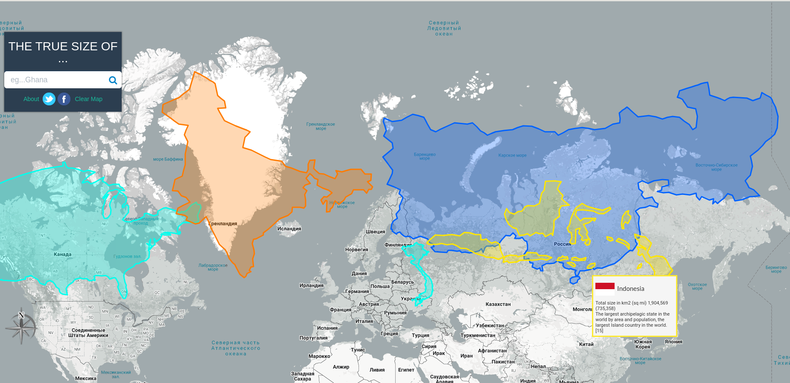
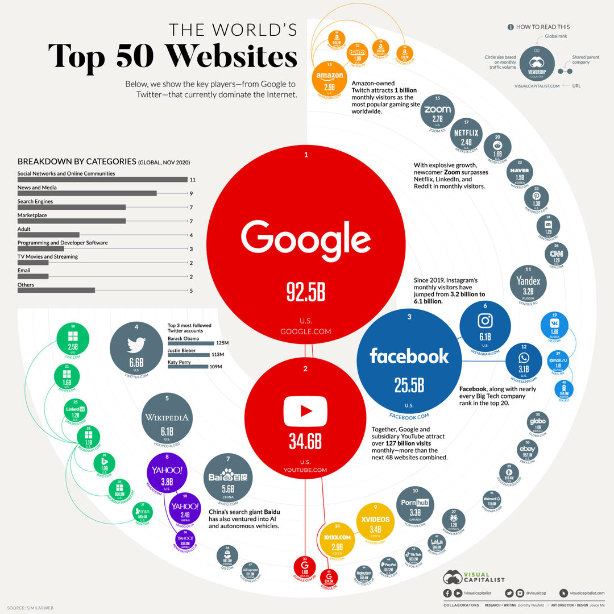

# Страна и страх

## Огромная, ресурсно богатая страна — счастье или проблема? {#happiness_in_russia}

Если проблемы в своей семье, а тем более в себе, люди обычно критически обсуждать не очень любят, то как управлять страной лучше, чем её руководство — большинство знают наверняка!
:-)
А несоответствие реальности и наших ожиданий обычно делает нас несчастными.
Настолько несчастными, что этот внутренний конфликт, не находя выхода, может разъедать человека, превращаясь в рак и другие болезни.
Видел тому множество примеров в жизни и всерьёз считаю взаимосвязанными внутреннюю гармонию и физическое здоровье.

Базово стараюсь занимать обратную сторону основному течению беседы по важным темам.
Даже если позиция является непопулярной, сомнительной, а может и покажется кому-то обидной.
При чём не в формате спора, а в формате встречных вопросов.
Думаю, что истина рождается не в спорах, а в собственных глубоких размышлениях.
[А в спорах обычно рождается гнев и томление духа](https://www.livelib.ru/quote/44313988-opravdanie-ostrova-evgenij-vodolazkin).

Такие обсуждения позволяют уточнить аргументацию на будущее, найти слабые стороны в своей позиции.
А если со всеми соглашаться, кивать и поддакивать, то начинаешь чувствовать, как тебя засасывает в трясину и тонешь в безысходности — ведь внятных, конструктивных предложений, кроме критики, обычно не звучит.

Пожалуй, стоит помнить, что средневзвешенный образ Счастья в разных культурах разный – русский или, даже точнее, российский культурный код восприятия понятия Счастья [отличается от американского взгляда, который распространялся десятилетиями в условиях глобализации](p1-010-happiness.md#what_is_happiness).

Любопытно было посмотреть на разность отношения в основополагающих документах двух государств, сделанной ChatGPT:

!!! note "Пример"
    Serge Polyakov:

    Чем отличается Конституция США и России в контексте понятия Счастья?

    ChatGPT:

    Конституции США и России различаются в подходе к концепции счастья и правам граждан, что может оказывать влияние на восприятие счастья в обеих странах.

    ▎Конституция США:

    . Декларация независимости: В ней упоминается "право на жизнь, свободу и стремление к счастью".
    Это подчеркивает индивидуальную свободу и право каждого человека искать собственное счастье.
    . Индивидуальные права: Конституция и поправки акцентируют внимание на защите индивидуальных прав и свобод, что может способствовать личному счастью через самореализацию и защиту от произвола.

    ▎Конституция России:

    . Социальные права: Конституция РФ акцентирует внимание на социальных гарантиях, таких как право на труд, образование, медицинское обслуживание.
    Это подразумевает, что государство должно создавать условия для достижения счастья.
    . Общие интересы: В российской Конституции больше внимания уделяется коллективным интересам общества, что может влиять на восприятие счастья как общего блага, а не только индивидуального.

    ▎Вывод:

    • В США счастье рассматривается как индивидуальное право, акцентирующее свободу выбора и самореализацию.

    • В России счастье связано с социальной справедливостью и обеспечением базовых прав и потребностей граждан.

    Эти различия могут формировать разные культурные подходы к счастью и его достижению в обеих странах.

Могу сказать, что мне лично такая оценка отзывается.
Мой жизненный опыт, прочитанные книги и общение с гражданами разных государств, а также представителями [западников и славянофилов](index.md#what_to_do) подтверждают такой взгляд.
Лучшие генеративные модели искусственного интеллекта от Google и китайских корпораций на момент публикации главы имеют схожее мнение — [можете оценить сами](https://lmarena.ai/).

То есть каждый человек стремится к Счастью, но в разных странах и культурах этот образ будет отличаться.
Это лишь напоминает нам о [непростой задаче нахождения единого образа Счастья.](p1-010-happiness.md#cornerstone_of_text)

В Штатах он [чуть более эгоцентричный](p1-040-unhappiness.md#egocentrism).

У нас более идеализированный и коллективный.
Зачем о Счастье говорить в конституции, когда Счастье это коллективное?

Хочешь быть счастливым — будь им!
Никто это право не отбирает.
Как право дышать общим воздухом и гулять по лесам и полям.
Которых у нас необъятно много.

И вот что мы, россияне, можем сказать про нашу страну прежде всего?

Моя первая ассоциация, что она очень большая и богатая.
И в привычной канве «кухонного разговора за жизнь», богатство это распределяется и управляется «как-то не очень справедливо и рационально».

## Особенности восприятия размеров нашей страны {#true_size}

Справедливости ради попробую переметнуться на обратную сторону и опровергнуть свой же тезис о размере нашей страны.

!!! note "Ситуация"

    Индонезия воспринималась с детства как группа экваториальных островов, которых и не заметно на карте мира.
    Ведь на настенных картах основную верхнюю часть занимает Россия.
    Почему-то ассоциируясь у меня с медведицей.
    И вот когда в разговоре кто-то упомянул, что пролететь из столицы Индонезии Джакарты на их же остров Папуа занимает больше 5 часов, я уточнил со снисходительной улыбкой:

    — Ну это, наверное, какой-то маленький винтовой самолет?

    — НЕТ.
    Это Boeing 737!

    И тут я удивился и полез оценивать реальные расстояния.
****

Надо сказать, что расстояния у нас колоссальные, но вполне сравнимые с азиатскими, например.
Безграничные пространства на мировой карте, которую мы с детства хорошо представляем, довольно сильно искажены.
Про проекцию Меркатора со школы все могут помнить, но забывается ведь.

А карта мира очень часто мелькает перед глазами.
[По ссылке](https://tinyurl.com/4asjphjd) можно увидеть, как выглядела бы карта мира, если США, Индия, Вьетнам, Индонезия или Китай находились на наших широтах.

Вьетнам простирается от Санкт-Петербурга до Севастополя.
Перелететь «ничтожно малые», на первый взгляд, экваториальные острова Индонезии — приблизительно, как добраться из Самары до Владивостока.
Не говоря о том, что населения там в 2 раза больше, чем в России.
И таких интересных и неочевидных сравнений бесконечно много.

{ width=100%, loading=lazy }
/// caption
Сайт True Size меняет представления о мире
///

Это просто любопытное наблюдение, которое показывает, как разные формы представления информации и доминирующее визуальное восприятие со школьного возраста формирует сознание.
Китайцы тысячелетиями называли свою страну «Срединное государство» и отображали его на карте по центру, где остальные страны распределены по периферии.

Представляете, какое сознание формируется, когда всю жизнь смотришь на свою страну в центре мира?

Сухие цифры воспринимаются не так ярко, хотя именно они и являются максимально объективными.
И цифры, конечно же, подтверждают, что нет у нас конкурентов по площади территорий и богатствам.

## Размер имеет значение {#big_size_matters}

Плодородные обширные земли нашей страны способствовали развитию сельского хозяйства.
До отмены крепостного права в 1861 году более 80% населения было занято в аграрной отрасли.
Освобождение людей от обязанности неоплачиваемой выработки основного экономического ресурса страны было колоссальным риском для существования империи в целом.
Отдалённые территории, на которых государственный контроль ослабевал, усложняли ситуацию.
Александр II взвешивал варианты — либо освободить крестьян и предотвратить революцию, либо потерять страну во время последующего экономического кризиса.

Однако риски масштабных крестьянских волнений перевесили и крепостное право было отменено.
Страну «колбасило» пару десятков лет пока не началась новая волна экономического роста.

Представьте, что в эмиграцию тогда уезжали русские дворяне, с проклятием в адрес своей родины и монарха за излишне либеральное и слишком человечное отношение к народу!
:-)

[Достоевский описывал настрой](https://www.livelib.ru/quote/46256764-dostoevskij-glazami-sovremennikov), царивший среди русской эмиграции того времени.
Вот уж маятник…

!!! quote ""
    Федор Михайлович часто говорил, что если мы останемся за границей, то он «погиб», что он не в состоянии больше писать, что у него нет материала, что он чувствует, как перестает помнить и понимать Россию и русских, так как дрезденские русские — наши знакомые, по его мнению, были не русские, а добровольные эмигранты, не любящие Россию и покинувшие ее навсегда.

    И это была правда: все это были члены дворянских семей, которые не могли примириться с отменою крепостного права и с изменившимися условиями жизни и бросившие родину, чтобы насладиться цивилизацией Западной Европы.

    Это были большею частью люди, озлобленные новыми порядками и понижением своего благосостояния и полагавшие, что им будет легче жить на чужбине.

## Новая история {#russia_in_new_history}

Столыпин, как реформатор и управленец, который впервые в истории России при этом не являлся царём, был нацелен на освоение бесконечных просторов Сибири, опираясь на здравую логику и успешный опыт колонизации США.
Начав в 1906 году обширные и назревшие преобразования для остановки революционных волнений, он планировал завершить передачу земли в собственность крестьянам спустя 20 лет при условии мирного существования империи.

Его действия, которые, по сути, вводили капитализм в деревнях, были чужды как крестьянам, так и политической оппозиции — общественный менталитет не был готов, и требовались долгие годы для его коррекции, что Пётр Аркадьевич, конечно же, осознавал. Отличались мы в менталитете от колонизаторов как тогда, так и сейчас.

Впрочем, убийство Столыпина в 1911 году и даже бодро начавшаяся на патриотической волне в 1914 и быстро забуксовавшая Первая Мировая война не остановили его реформу.
А вот февральская революция 1917 года, когда Николай II сложил полномочия, конечно же, полностью поставила на ней крест.

## Ленин — мечтатель-анархист? {#lenin_anarchist}

Ленин мечтал о государственном строе, где, по задумке, не будет ни руководства, ни партии.
И в этой стране Советы из разных отраслей будут договариваться между собой самостоятельно, и роль государства будет заключаться лишь в контроле исполнения этих договоренностей.

Для знакомых с информационными технологиями это может звучать, как [смарт-контракты](https://ru.wikipedia.org/wiki/Смарт-контракт) между Советами на базе государственной [блокчейн](https://ru.wikipedia.org/wiki/Блокчейн) платформы.

Диктатура пролетариата и связанные с ней жертвы — неотъемлемая часть революции.
А последующий откат до НЭПа являлся временным переходным шагом, который надо пережить, быстро маневрируя и балансируя.

Не могу знать, что в глубине души его мотивировало на эти свершения.
Но не склонен думать, что это была месть за смерть брата и жажда крови.
Как зачастую пытаются представить, сильно упрощая, его мотив.

Однако даже его фантастическая работоспособность и умение находить компромиссы не смогли предотвратить гражданской войны, кровавой продразверстки в деревнях, уничтожения семьи императора, жестокого подавления восстания изначально «своих в доску» моряков Кронштадта в условиях послереволюционной турбулентности.

А инсульт и смерть окончательно отбросили надежды на скорейшую реализацию этой мечты о счастливом обществе на русской земле.

## Новейшая история {#newest_history}

Даже в результате поверхностного, хотя и планомерного, изучения новейшей истории, анализа геополитических факторов и понимания направлений развития технологического прогресса, я не могу объективно определить эффективность руководства страны колоссального масштаба.

Слишком много нюансов, которые остаются за пределами поля зрения гражданина.

Даже та история, которая проходила перед глазами моих сверстников, быстро забывается.
После погружения в популярные антологии последних лет от Парфёнова или Зыгаря понравился образный и разносторонний анализ происходящего в стране, неожиданно, с глаз спортсменов 70, 80-х.
Боксёры и борцы сформировали вертикальную модель общества на основе психологии Воли в 90-е и сошли на нет в 2000-е.
[Книга василеостровца Евгения Вышенкова «Именем братвы»](https://www.livelib.ru/review/3634177-imenem-bratvy-proishozhdenie-gangstera-ot-sportsmena-ili-30-let-so-smerti-sssr-evgenij-vyshenkov).

Новое поколение уже не чувствует того времени, среднее уже подзабывает, а ситуация в стране была опасной и последствия её мы, безусловно, до сих пор ощущаем на себе.

## Русская модель управления {#russian_management}

Но стоит признать, что не боги горшки обжигают и руководство обычно формируется из управленцев среднего уровня.
Исторически серьёзные проблемы в России решались не системно — через экономию и оптимизацию, а через антикризисное управление и привлечение ещё больших ресурсов на коротких отрезках времени.
И вот это ресурсное богатство сформировало за несколько поколений у нас сильную экспертизу кризис менеджмента, а не планомерного операционного повышения эффективности в управлении.

Лучшие представители таких руководителей могут за неделю построить завод в лесу, что неоднократно происходило в нашей истории.
Но вот контролировать в цифре узкие места, бутылочные горлышки ключевых процессов, улучшать их и постепенно адаптировать из года в год под меняющиеся обстоятельства — не наша сильная черта.

В спокойные тучные годы, находясь на управлении, менеджеры нацелены на удержание своей позиции, распоряжаясь ресурсами по своему усмотрению и выдавая минимально достаточный результат.
Ситуацию могли бы поправить наработанные управленческие практики, а также железобетонные внутренние принципы и персональная система ценностей, которые формируются поколениями.
Но революции, перевороты и перестройки не способствуют их появлению и укреплению.

Хороший экскурс в особенности управления на наших бескрайних просторах можно найти в [книге Александра Прохорова «Русская модель управления»](https://www.livelib.ru/review/3093508-russkaya-model-upravleniya-aleksandr-prohorov).

Об уровне навыков управления у менеджеров крупных компаний и чиновников сам могу судить, так как сталкивался с ними по работе немало.
Готовил и проводил практические тренинги принятия решений на основе цифры для менеджмента крупнейших российских компаний металлургии и машиностроения на платформе Microsoft Business Intelligence в 2012.
Сейчас наблюдаю отработку навыков чиновников на проводимых стратегических сессиях по Цифровой Трансформации.
В общем, имею представление о критериях в принятии решений и принимаемый в расчёт горизонт планирования.
Запомнились несколько похожих случаев.

!!! note "Ситуация"
    На тренингах демонстрировали руководству, как с помощью автоматизированного процесса сбора данных и динамически обновляемого отчёта можно взять под контроль проблемный процесс на предприятии — технология рабочая, сроки запуска в пределах месяца, стоит существенно меньше, чем уже тратится сейчас и планируется потратить на решение.
    А интереса живого НЕТ!

    Ну как так-то?!

    В лучшем случае руководитель мог отвести меня в сторонку и сказать:

    — Ну вот куда ты лезешь?
    Если я внедрю этот подход, мне нечем будет 150 человек занять.
    А у меня градообразующее предприятие, между прочим!

    А айтишники занимали обычно другую позицию:

    — У нас на этом процессе уже 10 лет сидит подрядчик, который всех устраивает.
    И главное — мы же обслуживающее подразделение, а процесс этот производственный, и если в него лезть, то придётся ответственность брать.
    Зачем?

    И понимаю я, что если он «рыпнется» с какой-нибудь подобной «рацухой», то может и сам работы лишиться.
    Страшно.

У нас достаточно идейных и прекраснодушных людей, но для погружения в анализ процессов и ключевых показателей для повышения эффективности нужны навыки и воля руководства.

Когда жареный петух клюнет — мы сможем сделать быстро, только ресурсов сожжём в 10 раз больше, чем можно было.
Но не в нехватке ресурсов же наша ключевая проблема была до сих пор!
:-)

Рациональный подход в сознании у нас базово несколько атрофирован, если сравнивать с населением не такой богатой ресурсами и более прагматичной Германии, например.
И если нет отработанных управленческих практик в среднем звене, то дефицит будет и в верхних.
И требуются годы, чтобы кадровый дефицит подготовленных специалистов естественным образом исправился.

## Цифровая зрелость России {#russian_it}

В течение двух лет занимался продвижением российских информационных технологий в Юго-Восточную Азию, где встречался с экспортёрами из других стран, и могу с уверенностью сказать, что у нас с цифровизацией услуг населению — всё очень хорошо.

Россия [входит в десятку лучших в мире](https://digital.gov.ru/ru/events/42223/).
[Кремль в 2023 году поддержал инициативу открытия данных](http://kremlin.ru/acts/assignments/orders/70418) для последующего использования Искусственного Интеллекта.
Планируются к запуску и другие масштабные цифровые инициативы, которым нет аналогов в мире.

При этом жители нашей планеты для поиска информации и общения используют прежде всего Google и Facebook с внутренними механиками рекомендаций.
По большому счёту, только Китай и Россия являются исключением, со своими Яндекс и ВКонтакте.
В наш информационный век без собственных цифровых платформ в принципе невозможно быть суверенным государством с независимой системой ценностей.

{ width=100%, loading=lazy }
/// caption
Яндекс и ВК в кружках справа посередине. Из национальных сервисов также видны китайцы
///

То есть с информационными технологиями в стране всё очень неплохо.
Но глубокие практики управления на основе цифры у менеджеров среднего звена в крупном и малом бизнесе, а также среди чиновников, по моему мнению, оставляют желать лучшего.

Мой жизненный опыт говорит, что ресурсное богатство формирует сознание, которое не способствует развитию навыков планомерного повышения эффективности на основе объективной информации.
А прозрачность и эффективность процессов производства и управления, в конечном итоге, влияют на благосостояние населения и ощущение счастья.
Такой вывод ни в коем случае не может звучать как оправдание бездействия — это всего лишь задача, которую надо планомерно решать.
Видно, что процесс идёт, хотя, не скрою, очень хочется большей динамики.

Да, есть у нас отличительная черта в нерациональном отношении к тому, что имеем, в сравнении с немцами или японцами, территории которых, на порядок меньше средней площади одного нашего федерального округа!
А у нас их 8, ВОСЕМЬ, Карл!

В отличие от американцев, менталитет которых сравнительно недавно формировался предпринимателями, сорвавшимися со своих родных мест осваивать чужие территории, мы — в основной своей массе, оседлые крестьяне.
Причём наиболее хозяйственных, всего 100 лет назад, активно пускали в расход.

Хорошо отношусь и к американцам, и к немцам, и к вьетнамцам, и к русским без исключений.
Не навешиваю ярлыков — хороший, плохой, правильный, неправильный.
Всего лишь призываю знать свою историю и учитывать особенности присущего нам менталитета в практике управления.
В конечном итоге, такой подход даёт понимание, что можно делать самому, на своём месте, на своей земле, в настоящее время.

Чувствовать динамику и быть сравнительно счастливым!
:-)

Идея этого текста заключается в [коллективном его написании](index.md#text_as_dialogue).
Так создаются компьютерные программы в концепции Open Source — Открытый код.
От друга «прилетела» первая текстовая вставка о Страхе, как о причине несчастья.

Следующая глава звучит от лица друга — Владимира Лобачёва.
Я же пропустил его текст через себя и подписываюсь под каждой строчкой.
Стиль написания сохранён.

## Страх {#fear}

*Автор текста: [Владимир Лобачев](p2-100-authors.md#lobachev)*

Главу «Стереотипы счастья и причины несчастий» захотелось дополнить подразделом «Страх».
Страх изучал Зигмунд Фрейд, но я его не читал, так что скатиться в плагиат страха нет!
:-)

Страхи преследуют людей с детского возраста и имеют совершенно разные оттенки:

- Боязнь спросить что-то у постороннего;
- Страх перед физической расправой;
- Боязнь развода родителей и крушения привычного мира ребёнка;
- Наконец, страх перед смертью…

В процессе взросления часть страхов сохраняется, другие модифицируются в зависимости от пола, сексуальности, окружающего социума:

- Боязнь познакомиться с девушкой;
- Страх быть не принятым и осмеянным сверстниками;
- Боязнь поражения в соревновательном или учебном процессе…

И, наконец, страхи взрослого человека:

- Перед начальником;
- Перед супругом;
- Перед более преуспевающими знакомыми…
- Нарастающий с приближением конца страх смерти (заметьте, он присутствует только в детстве и старости, но не в юности).

По мере своего взросления человек учится бороться со своими страхами, часть из них ему удается укротить, часть остается в тени его сознания.

Как же наличие страха в подсознании человека влияет на его ощущение страха?
Из своего жизненного опыта я не могу сделать вывод, что я трус.
Случались критические ситуации, угрожавшие мне лично, или окружающим людям (например, сильнейший пожар в офисе), однако выброс нужной дозы адреналина делал сознание живым, а ход мыслей четким и ясным.
Отсутствовала паника, удалось организовать эвакуацию персонала и имущества, не было волнения, когда раз за разом возвращался в дымящееся помещение, несмотря на то, что крыша трещала и готова была обрушиться…

Однако считаю себя человеком, проживающим жизнь рядом со своими внутренними страхами, которые зачастую связаны в современных реалиях с опасением потерять стабильный доход, не справится с ролью главы семьи и отца, тревогами за здоровье и будущее детей…

Постоянно напоминая о себе и подпитываясь у части людей повышенной чувствительностью психики, или банальной вегетососудистой дистонией, страхи отравляют жизнь, мешая человеку ощущать себя счастливым здесь и сейчас.
Где бы ты ни был, на отдыхе в жарких странах, в заснеженном лесу с резвящимися детьми, или дома в постели, страх может в любую секунду вынырнуть из глубины тебя и отравить самые радостные моменты, крутясь в голове утомительным волчком.

Одним из «лекарств» против таких проявлений собственной психики стал однажды алкоголь, однако это тема отдельного исследования!
:-)

Вывод: не победив собственные страхи, причем не победив их здоровыми (не медикаментозными) средствами, человек не сможет достичь состояния Счастья.

И еще один подраздел пришёл на ум под названием «Конформизм» (что-то про неготовность сменить работу на занятие мечты, про неготовность отстаивать свои интересы в браке из-за боязни его разрушить, и тому подобное).
Но об этом в следующий раз.

## Завершение первой части {#end_of_analysis}

*Автор текста: [Сергей Поляков](p2-100-authors.md#bongiozzo)*

Согласен с каждым утверждением и испытывал все перечисленные страхи.
Думается, что сократить их влияние иногда помогало [следование Призванию](p1-020-call.md).
Зачастую оно выражалось в импульсивном и иррациональном решении, как Прыжок Веры — Leap of Faith, который так нравится поклонникам игры «Assassin`s Creed».

Про алкоголь тоже [упоминал ранее](p1-030-time.md#awareness_and_addictions), но также не стал описывать свои соображения, а попросту сослался на книги, которые были созвучны и занимательны.

Жду, когда количество таких вставок будет расти и начнут приходить Change Request непосредственно в GitHub, но радуюсь появлению этого дополнения как началу коллективной работы.
Можно сказать, что пора завершать часть Анализа причин и переходить к Практической части построения Счастья.
