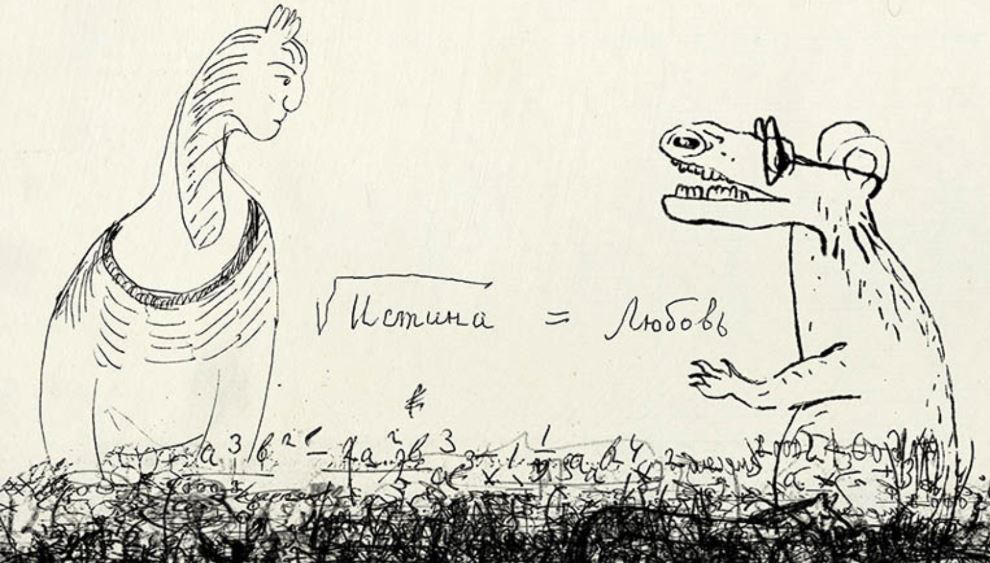
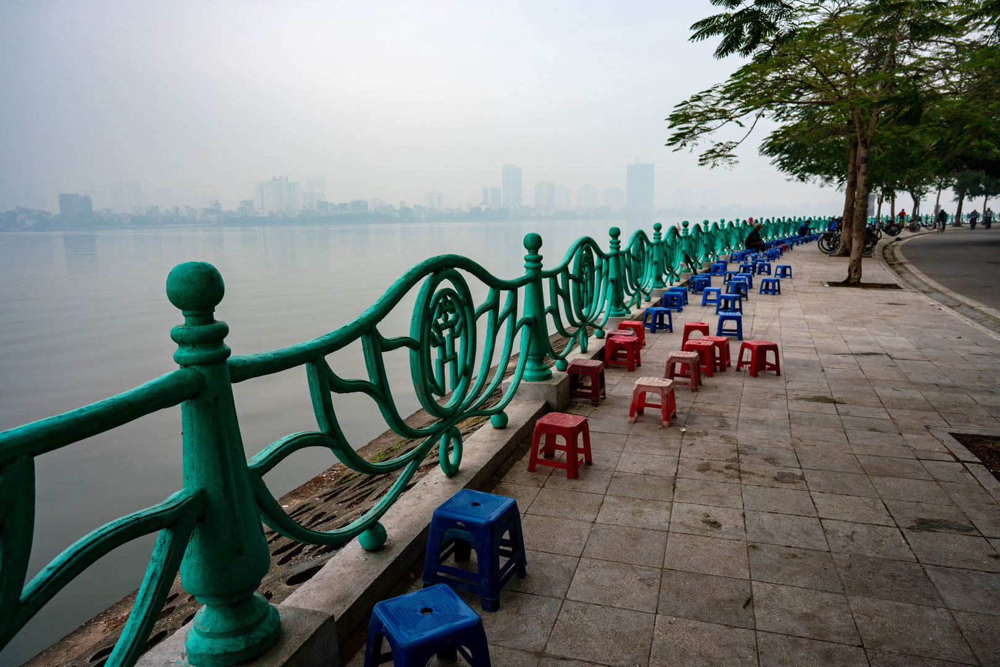
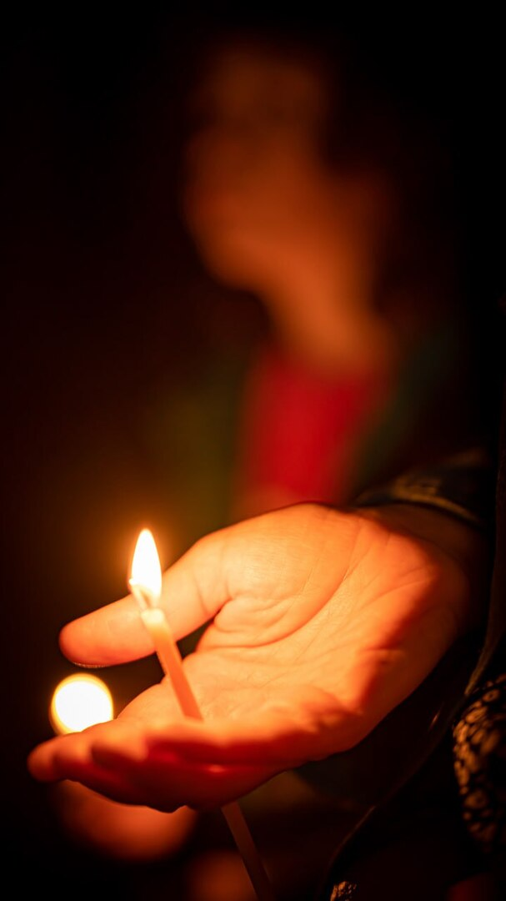
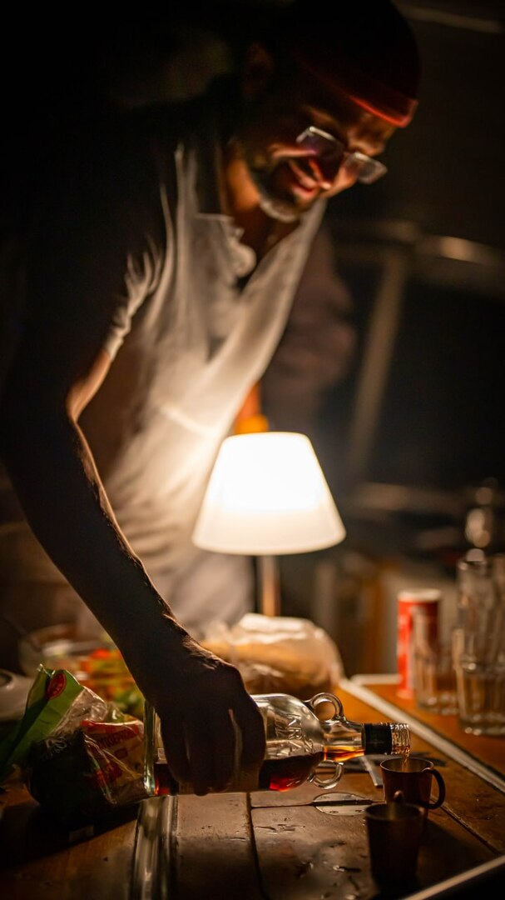

# Персональная система ценностей

## Смятение в головах далеко не первый раз {#again_and_again}

Прошли в 2022 году разговоры разной степени накала эмоций.
Разговоры, после которых «кулаки в зубной эмали», как [поёт музыкант Юра Шевчук](https://music.yandex.ru/album/24387038/track/110033569) и непременно вызывает мурашки на коже уже первыми аккордами, создавая [маленький момент Счастья](p1-010-happiness.md#moments_of_happiness).
Звучали полярные фразы типа «Можем повторить!», «Мы русские, мы правы — с нами Бог», а также «Пора валить!», «Ничего тут не изменится».

Не занимая ни одну из сторон, а точнее, стараясь занимать в каждом диалоге сторону оппонента, с уверенностью могу сказать только одно — похожие ситуации возникали в истории нашей страны многократно, и разговоры эти извечны.
Казалось бы, дни России уже были сочтены — то в войне с Польшей, то с Францией, то с Германией, то из-за внутренней революции, то из-за гражданской войны, но после смутных времён страна возрождалась в новом качестве.

Достаточно почитать переписку известных людей и публикации в газетах времён Крымской войны 170 лет назад и убедиться, что полярные мнения западников и славянофилов невероятно напоминали посты в социальных сетях наших современников.
И несмотря на то, что раньше это происходило с кем-то другим, а сейчас касается нас и наших детей, мне видится очень важным выйти за рамки своего восприятия и посмотреть на историю страны шире.
Чтобы убедиться, что мы на очередном похожем витке.

И как Достоевскому [удалось на короткое время найти баланс между двумя лагерями в Любви к гению Пушкина 143 года назад](index.md#what_to_do), с чего я издалека начал в самой первой главе этого текста, так и мы, возможно, сможем отыскать опору для баланса совместно.
В стремлении к Счастью она нащупывается.

## Поляризация как маятник: Нужно искать баланс {#polarization}

Как только маятник оппозиционной критики ситуации в стране доходит до крайности, в СМИ прилагается симметричное полярное усилие.
Очевидно, что максимально приоритетная задача обеспечения безопасности и стабильной ситуации внутри страны требует немедленных мер — нет возможности рассусоливать и решать задачу далёкого будущего.

Однако, в результате уверенной риторики у многих в головах возникает упрощённое, без должного глубокого контекста понимание предшествующих кризису проблем — ответственность за текущую ситуацию обычно полностью возлагается на противоположную сторону конфликта.
Создаётся опасность закрепления в сознании следующих поколений полярных мнений, которые несут в себе риски следующих войн.
Очередной размах маятника и уход в поляризацию мнений, которые аукнутся позже.

Да, беда случилась, корни её лежат намного глубже, чем февраль 2022 года, но давайте выбираться из этой ситуации и при этом прежде всего смотреть на недоработки нашей стороны, начиная, прежде всего, с себя.
Вот прямо с себя лично!
Что Я ЛИЧНО делал или не делал такого, что приводит к крайностям в суждениях, поляризации, которая, в свою очередь, ведёт к излишней уверенности в своей правоте и дальнейшим трагедиям?

Пишу и понимаю, что эти прекраснодушные метания не имеют быстрых и простых решений в [условиях огромной страны](p1-050-country.md#happiness_in_russia) и разнородного населения.
Не говоря уж про население всей планеты.

Но чем раньше [мы сформируем систему взглядов на ситуацию в обществе](p1-010-happiness.md#happiness_pie), не с позиции «Кто виноват?», а с анализом причин неудач и в формате «Что мне делать?», чтобы их не повторить и исправить, — тем будет проще в последующем.

Потребуется отобразить наши слабые стороны и определить образ нашей страны и общий созидательный вектор развития, чтобы сократить амплитуду маятника общественного настроя.
Чтобы не повторять историю снова и снова.
И именно у нас, в нашей стране, в наше неспокойное и переломное время, когда стало понятно, что тотальная глобализация и формирование единого плоского, как блин, мира, [описанного Томасом Фридманом](https://ru.wikipedia.org/wiki/Фридман,_Томас) не случатся в ближайшем будущем, можно определять эти новые векторы.

!!! quote "Цитата"

    Мы живем в эпоху оконченной глобализации, и это в обоих смыслах этого слова: достигшей своего предела и находящейся на этапе завершения.
    Попробуем взглянуть на все это с геополитической точки зрения: Россия на самом деле не является главной проблемой.
    Располагая слишком большой территорией для сокращающегося населения, Россия была бы совершенно не способна взять под свой контроль планету, и нет у нее такого стремления; она является нормальной и предсказуемой державой.
    Нет никакого российского фактора, дестабилизирующего мировое равновесие.
    Есть неизлечимый кризис Запада, в основном США, ставящий под угрозу равновесие на планете.
    Его самые периферийные волны обрушились на волнорез сопротивления, на Россию – классическое и консервативное национальное государство.
  
    ^^[Эмманюэль Тодд](https://www.livelib.ru/quote/48401191-porazhenie-zapada-emannyuel-todd)^^

Хотя на изменение общественного сознания уходят поколения и вероятно увидеть результаты нам будет не суждено, но стремиться к этой цели, на мой взгляд, необходимо и начинать нужно с себя.

## Бог и Наука {#god_and_science}

Думается, что исторический маятник колоссального сдвига, сформулированного Карлом Марксом и усиленного Лениным материализма — «Бытие определяет Сознание», двигается в обратную сторону, и для нашей эпохи более подходит тезис идеализма: «Сознание определяет Бытие».
Нетрудно проследить, как [маятник изменения сознания на более материалистичное восприятие, запущенный в России и ушедший на Запад, вернулся к нам в 80-е](p1-040-unhappiness.md#intelligence_quotient).

Но мы опять «впереди планеты всей» — [формируем эпоху метамодерна и ищем утраченные смыслы](index.md#text_is_not_a_book).
И, на мой взгляд, эти приоритеты и векторы для себя лично могут звучать как:

- Развитие навыков Критического мышления;
- Уход от Я-центричного мира в сторону мира с центром в виде духовного Идеала.

Если совсем упрощённо, что начинает звучать провокационно и для многих неприемлемо — Бог и Наука.
Или Вера и Знание.
Душа и Разум.

Явственно слышится критическая волна протеста к такому парадоксальному противопоставлению, прежде всего внутри себя-рационала-логика-айтишника.
И с этим придётся разбираться.

Такая болезненная реакция порой является признаком, что это и есть правильная точка приложения усилий в работе с собой.
Как на приёме у доктора, который ищет источник проблемы, ощупывая тело.
Постоянное нахождение в привычном потоке изучения новых технологий, рационализации и цифровизации жизни вызывает серьёзное утомление.
Выгорание, как сейчас говорят.

!!! note "Ситуация"

    Лет десять назад начал испытывать усталость от всех этих информационных систем и устройств, которыми занимался всю жизнь и дал этому кризису название — «Отойти от АйТи» или «Выйти из АйТи».
    Комичное звучание этих фраз в разговоре непременно вызывало улыбку!
    :-)

    Не было возможности видеть результаты своего труда в виде осязаемых и значимых понятий — ухоженного участка земли или большого красивого дома, к которым приложился своими руками.
    Думаю, что-то похожее испытывал Лев Толстой, когда [почувствовал необходимость в труде с результатами в материальном мире](https://www.livelib.ru/review/5240326-tak-chto-zhe-nam-delat-lev-tolstoj) – землю пахать или сапоги делать.

    Устроить себе такое развлечение оказалось сравнительно несложно.
    Порывистость характера сделала меня хозяином 25 соток, за которыми теперь надо было постоянно следить.

    Можно привлечь многочисленных специалистов и всё оплатить, но этот процесс не делал меня счастливым.
    Тем более, что я понимал — на этом заботы не закончатся.
    Нужно было на время отключить мозги и начать пахать, чтобы увидеть результат и почувствовать счастья от преодоления.

    В результате был найден баланс — отдать эту землю в аренду тем, кто связывает своё призвание с её возделыванием.
    А стоимость аренды приравнять к оплате ухода за участком.
    [Никто никому не должен](p1-040-unhappiness.md#obligation).

    Так я получил драгоценный опыт, другие получили возможность следовать своему любимому занятию, а земля перестала зарастать сорняком.
    Все счастливы.

## Парадокс {#paradox}

Нет внутри меня сомнений, а в моем окружении людей, которые были бы против тезиса о необходимости развития интеллекта и навыков мышления.
[Даже если этот бесконечный процесс сравнения и анализа может уводить нас от состояния высокого эмоционального тона](p1-040-unhappiness.md#intelligence_quotient).
Но вот рядом стоящий тезис об усилении значения Веры и использование понятия «Бог» вызывает вопросы.
У меня лично, совершенно точно, вызывал и продолжает вызывать.
Хотя вопросов этих становится меньше.

Формулировка о цели в духовном идеале вопросов вызывала меньше, но также я понимаю, что Бог и Духовный Идеал понятия равнозначные в определённом контексте.
И значит надо убирать из головы все стереотипы и ассоциации вокруг Веры и Бога — весь тот хлам, которым нас заваливает поляризованное информационное общество и самому со всем этим разбираться.

Глава в набросках ждала публикации несколько месяцев, пока в одном из диалогов не получил [ссылку на видео с таким же названием](https://vk.com/video-212448670_456239085).
И хотя я не обладаю достаточно глубокими знаниями физики, чтобы пускаться в рассуждения о связи квантовых запутанностей и Бога, но даже я понимаю — что нельзя упрощать постановку вопроса до уровня «Гагарин в космос летал и Бога не видел!»

И если природа построена на [корпускулярно-волновом дуализме](https://ru.wikipedia.org/wiki/Корпускулярно-волновой_дуализм), то похожий парадоксальный дуализм может быть и в голове.

Видео заставило задуматься, но не могу сказать, что оно мне всем понравилось.

Оскомину вызвал услышанный подтекст о «навязанном» нам постмодерне, где мы-россияне представляемся жертвой.
Вероятно, это моё субъективное восприятие — [не люблю популярный формат видео и подкастов](index.md#text_is_better_than_podcast), где аудиовизуальный ряд может дополнять, но чаще размывает основной смысл лишней информацией.

Сами мы-русские, в том числе, активно формировали эти новые системы ценностей в [новой](p1-050-country.md#russia_in_new_history) и [новейшей истории](p1-050-country.md#newest_history).
И брать ответственность за выход из этой ситуации нам.

Основной ценностью от просмотра этого видео стало знание, полученное от настоятеля храма святых апостолов Петра и Павла и святой мученицы Татьяны при Санкт-Петербургском Государственном Университете, а также кандидата физико-математических наук Кирилла Копейкина.

Знание о системе богословия [преподобного Максима Исповедника](https://ru.wikipedia.org/wiki/Максим_Исповедник), в котором предназначение Человека определяется в исследовании материального мира и объединение его в себе с Богом.

На мой взгляд, красивая и дополняющая научный прогресс картина.

Максим Исповедник, вероятно, видел проще и практичнее, чем Гегель, Маркс, Энгельс, Гераклит или другие философы, рассуждавшие о «единстве и борьбе противоположностей».

[Информационные технологии](p1-050-country.md#russian_it) со своей максимально рациональной Цифрой, в виде потока нулей и единиц, уже стали неотделимой частью всех областей человеческой деятельности.
Тех, кто всячески пытаются уйти от цифры и видят в этом основную проблему (отказ от номерных паспортов, число зверя, баллы ЕГЭ и тому подобное) воспринимаю как радикалов, которые, впрочем, мало чем отличаются от другой полярной позиции технократического гика, без царя в голове.

Сложить два разнонаправленных подхода в одном сознании трудно.
Но реально.

Парадокс – не противопоставление.
Но докопаться до сути расхождений и найти компромиссное решение зачастую требует большого труда.

## Гностицизм и агностицизм {#gnosticism_agnosticism}

Пока пытался укладывать разноплановые представления в голове натыкался на упоминания гностиков, которые с первых дней христианства (когда оно само было в статусе иудейской секты) пытались объединять религиозные ценности с научными или псевдонаучными подходами.

И надо признаться, что упоминание гностицизма обычно читалось в негативном контексте.

Пришлось разбираться, в чём помогли [лекции Василия Василиевича Болотова](https://www.livelib.ru/review/5043412-lektsii-po-istorii-drevnej-tserkvi-v-4-tomah-tom-12-vasilij-bolotov).

Гностики пытались вписать религиозные догмы в разнообразные структуры.
Объяснить духовно-материальный мир через логические модели и причинно-следственные связи.
Через Знание.
Или Гнозис по-гречески.
Это знание обычно было тайным, что создавало особую притягательность у большинства любопытствующих людей.
Неудивительно, что из разных течений гностицизма появилось множество сект.
В которых реальные цели зачастую были неочевидны тем, кто стремился попасть в эти сообщества.
Большинство сект исчезло в первые столетия, но часть трансформировались и дошли до наших дней - например, мормоны.

Агностики же заранее согласились с позицией, что познать бесконечно сложный мир невозможно.
И такая позиция даёт возможность отвечать на любые сложные вопросы уклончиво.
Очень забавляет детский стишок:

> Почему у мышки хвостик?  
> Я не знаю,  
> Я агностик!

Но если я готов анализировать собственную психику и сложившиеся нейронные связи, [выделять типы стандартных реакций и измерять отклонения от нейтрали](p1-020-call.md#mbti_personalities), то навешивать ярлыки и пристраиваться к группам по вопросам Веры я совершенно не собираюсь.
Отчётливо понимаю важность навыков Веры для полноты ощущения Счастья и общего направления – куда идти и что делать.

Особенно критичны эти навыки для [моего довольно рационального склада ума](p1-020-call.md#judging_perception).
И нет необходимости ставить точку в личном вопросе отношений с Богом.
Задаваться им можно всю жизнь.

В результате для меня Вера – это Путь.

И парадокс нахождения в этом движении расставляет по местам все «неувязочки», если даже они у кого-то возникают с отсутствием ярлычка или самоидентификации по этому поводу.

## Баланс внутри как залог мира {#paradox_for_peace}

И вот это парадоксальное совмещение внутри себя разнонаправленных подходов приводят не к перекосам вовне — ссорам, разводам, войнам и революциям, а к погружению в физику, химию, историю и развитию собственных моральных качеств.
И, как будто бы, вдалеке там маячит Счастье.
И это прекрасно!

Интуитивно нравится мне такая картина мира!
:-)

Она целостная и красивая.
А как мне [ранее подсказал ChatGPT](p1-030-time.md#who_to_trust), ссылаясь на художников и дизайнеров, которых я люблю и уважаю — если в мире есть красота и порядок, то есть и Бог, иначе был бы Хаос.

В культуре Древнего Египта и эпосе Древней Греции противостояние было [между Порядком и Хаосом, а не Добром и Злом](https://www.livelib.ru/quote/47594879-znakomtes-literatura-ot-antichnosti-do-shekspira-konstantin-obraztsov):

!!! quote "Цитата"

    Но самое главное — и это важнейший маркер древности персонажа — его подвиги связаны с победами над чудовищами, а не над людьми.
    Вновь вспомним бинарные оппозиции древнегреческой мифологии: если добро и зло тождественны порядку и хаосу, то и высшей доблестью будет борьба против порождений хаоса.
    Это отголосок древнейших времен, когда человек отстаивал свое место в противостоянии с разрушительными силами природы; когда первые племенные общины еще не сложились в традиционные государства, основанные на власти военных элит, а патриархально-военная культура таких государств еще не развилась настолько, чтобы создать культ войны.

    ^^Константин Образцов^^

А недостаток Порядка, возникает по множеству обыденных причин.
В человеческих отношениях причиной часто является [нехватка жизненных сил, как основного ресурса](p1-040-unhappiness.md#battery_aziz).
Дисгармония внутри страны, приводит к революции.
Когда перекос распространился на территории несколько стран, где на одном полюсе стоит долларовый печатный станок, а на другом беспризорных детей продают на органы – к войнам.
Правительства стран, в какой-то степени являются заложниками давнего глобального перекоса.
Все эти конфликты изначально про потерю гармонии, порядка и красоты.

Поиск баланса между двумя разными людьми в [стране, которая перекраивала системы координат](p1-050-country.md#russia_in_new_history), можно увидеть в замечательной [философской драме «Осенние сны»](https://www.kinopoisk.ru/film/42802/), например.

А начинать работу наведения гармонии и красоты необходимо с себя.

## Принятие и единая система ценностей {#acceptance}

И картина эта красива благодаря своей кажущейся противоречивости, хотя лучше называть её парадоксальностью.
В ней, сколько не ищу, не вижу серьёзных рисков для личности и общества.

Для начала хочу осторожно использовать понятие Бога как Духовного Идеала, не связанного с какой-либо конфессией.

Всё-таки уровень принятия в обществе за 200 лет изменился и в моем окружении никто не стал бы проламывать голову другому, как называть этот центр — Христом, Буддой, Аллахом, Высшей силой или Духовным идеалом.
Также как никого не подвергают анафеме и не сжигают за изучение и преподавание эволюционного происхождения видов.

Надеюсь, что в современном и более осознанном обществе настолько далеко маятник уже не качнётся.

На мой взгляд, нет противоречий в тезисе «Бог создал Человека» и теорией происхождения видов Дарвина, с которой [категорически не были согласны даже прогрессивные люди своего времени, как Лев Толстой](https://www.livelib.ru/quote/48269314-svyatoj-protiv-lva-ioann-kronshtadtskij-i-lev-tolstoj-istoriya-odnoj-vrazhdy-pavel-basinskij).
Впрочем, причина отказа принять чисто физиологическую теорию лежит в духовной сфере, что [было затронуто в главе про Благоговение](p1-020-call.md#sense_of_awe).

Но до тех пор, [пока наука доказательно не разберётся с появлением жизни на планете Земля](p1-030-time.md#scientific_approach), утверждение, что «Бог создал Жизнь», ничуть не хуже других.

Не надо же настолько буквально воспринимать библейские тексты, тем более, что за тысячи лет восприятие смыслов, стоящих за словами, драматически поменялось.

Поэтому на уровне абстракции верующих в Высшую Силу я могу задержаться и зафиксировать единую систему координат, как точку баланса.

## В поисках Бога {#finding_god}

!!! note "Ситуация"

    Я живу в России, на реке Волга, в Самаре.
    Могу с уверенностью сказать, что привязан к своей земле, к её истории и людям.
    Мне любопытно знать, что тут происходило сотни и тысячи лет назад.
    И этот интерес к истории, как первичный мотив, часто доставлял мне много радости.

    Сотни лет тут верили в Иисуса Христа и практиковали Православие.

    Когда мне было 20 лет и я испытывал свойственные возрасту душевные метания в отношениях с прекрасным полом, мама предложила мне покреститься.
    Её порыв был понятен, она переживала за меня и хотела меня защитить всеми возможными способами.
    Я не сопротивлялся, но не могу сказать, что проникся этой идеей.
    Прошёл через ритуал, и на этом тогда, по большому счёту, закончился мой религиозный опыт.

К моменту написания этих строк у меня были базовые представления о христианстве благодаря интересу к истории и разговорам со старшим братом.
В любом случае мне эта культура была известна больше, чем любая другая, хотя поездил по миру я изрядно и базово космополитичен.

Однако я обратил внимание, что знакомые мне верующие православные переживают жизненные невзгоды и смутные времена спокойнее и достойнее, что ли…
Может, мне так повезло, а может быть, потому, что живут они в системе понятий, где «на всё воля Божья», что жизнь продолжается после физической смерти.
И, может даже, думают они о том, что Бог — это мир вокруг, включая их самих, и от этого не чувствуют себя одинокими и незащищёнными.
Возможно.

Это, конечно, всё очень субъективно и, вероятно, надумано, но я обращал внимание на таких умиротворённых людей и могу сказать, что далеко не каждого, кто говорит о Библии и ходит в церковь, я считаю верующим.
Зачастую даже наоборот.

И значит надо разбираться самому.

Попыток поменять традиционные трактовки системы ценностей только в христианстве было множество — достаточно оценить количество конфессий и сект вокруг образа Христа.
Есть даже Христианская Наука, распространённая в США, к которой причислял себя [Прокофьев Сергей Сергеевич](https://ru.wikipedia.org/wiki/Прокофьев,_Сергей_Сергеевич).
Однако сам я с любопытством и уважением отношусь к истории формирования уклада православных канонов.

Чем пытаться навязать свою точку зрения, интереснее узнать — почему возникла такая трактовка в прошлом, в чём общность смысла с современной ситуацией?

Если самому погружаться в предпосылки и принимать парадоксальное совмещение рацио-иррацио, то компромиссное объяснение, верю, найдётся.
Обычно нахожу.

Итак, чтобы по канонам стать православным, я *должен* принять Символ Веры.

И желание моё обрести такую опору и уверенность совершенно искреннее, хотя любое долженствование, как [признавался ранее](p1-040-unhappiness.md#obligation), без Любви и принятия, вызывает множество внутренних сомнений.
Но я же понимаю, что Символ Веры, это свод понятий и принципов, который надо принять как систему координат, чтобы общаясь с другими, подразумевать одно и то же.

Толкование Символа Веры легко находится поиском, и вот, например, [одно из них](https://www.pravmir.ru/simvol-very/).
Если сам текст Символа имеет понятный для меня смысл и подтекст, то через подробное толкование, к сожалению, я не смог продраться.
Слишком много бескомпромиссной уверенности и нечётких причинно-следственных связей по множеству неочевидных для меня тезисов.
А когда натолкнулся на категорическое расхождение со своей текущей, примирительной позицией дуализма, отложил эту трактовку в сторону.
Не потому, что считаю её неверной, а потому, что, вероятно, не пришло время или написана она не для моего психотипа.
[Люди же мыслят по-разному](p1-020-call.md#mbti_personalities).

Я также понимаю, что до нашего времени не было возможности войти в картину мира каждого и описать смысл правильными для него словами — описывалась единственная, наиболее приемлемая версия.
Сейчас нет проблем с многообразием трактовок, вплоть до [Искусственного Интеллекта, который упакует информацию персонально, по заданному формату](p1-030-time.md#shared_vision).

С одной стороны, это, безусловно, хорошо, но с другой стороны повышает необходимость вдумываться в потребляемую информацию и пропускать её через «внутреннего цензора».
Если самостоятельно не откалибровать компас и положиться на искривлённую систему координат — придёшь совсем не туда, куда хотел.

[Объяснение на другом сайте pravoslavie.ru](https://pravoslavie.ru/104596.html) уже не вызвало таких ментальных блоков.
Но опять же — изобилие суждений и отсылок, которые по складу характера потребуется перепроверить и прочувствовать самому, создаёт понимание о колоссальном для этого занятия количестве времени.
А это время необходимо для важных и практических проектов, которые предполагают твёрдый фундамент принципов уже сейчас.

И это наводит на мысль, что какие-то шаги детального анализа можно отложить — не все толкования и источники одинаково полезны.
И поменять свой подход — посмотреть укрупнённо, с другого уровня абстракции.

## Определение христианства в системе ценностей {#rational_definition_of_christ}

И вот вопрос — а что если от Символа Веры с его трактовкой опуститься (или подняться?) на уровень базовых Ценностей?
Ценности — совсем не эзотерическое понятие.

Помнится, что Стивен Кови их описывал как компас и систему координат – север, юг, восток, запад.
Если компас сбит или понятие о направлении меняются, то о точке назначения договориться с другими не получится, и попасть в неё можно лишь случайно.

Для принятия ценности не требуется перепроверки исторических событий в однозначной трактовке.
Пожалуй, каждый в состоянии увидеть ответ, «Что такое Хорошо и что такое Плохо?», руководствуясь внутренним моральным законом.
Все мы об этом в состоянии размышлять, также как наблюдать звёзды:

!!! quote "Цитата"

    Две вещи наполняют душу всегда новым и всё более сильным удивлением и благоговением, чем чаще и продолжительнее мы размышляем о них, — это звёздное небо надо мной и моральный закон во мне.

    ^^[Эммануил Кант](https://www.livelib.ru/quote/361311-kritika-prakticheskogo-razuma-kant-i)^^

Как не крути, но глубинный смысл христианства в работе со своими недостатками, а не в борьбе с другими.

В условиях войны работают другие системы ценностей.
Во внешней политике, пожалуй, доминирует первичный принцип – «все против всех».

!!! quote "Цитата"

    Эти национальные государства, обладающие внутренней монополией на законное насилие, обеспечивают гражданский мир внутри своих границ. Можно их обозначить как веберианские государства.
    Но на уровне внешней политики, поскольку они выживают в среде, где считаются только с соотношением сил, эти государства ведут себя в соответствии с концепцией государства Гоббса.

    ^^[Эмманюэль Тодд](https://www.livelib.ru/quote/48401113-porazhenie-zapada-emannyuel-todd)^^

Война, хоть экономическая, хоть политическая, хоть убийственная, есть признак, что евангельская система координат в её первозданном понимании критически пошатнулась.

И значит нужно приложить максимум усилий, чтобы вернуть баланс в наш мир.

Прежде всего, начиная с себя.

Объявить войну «войне» внутри себя.

!!! quote "Цитата"

    Я иду воевать, чтобы положить конец всем войнам, милитаризму, тирании, чтобы никогда больше не могли появиться голодные, больные и отчаявшиеся, такие, каких мы видели на Лусоне.
    По-твоему, это невозможно.
    Ты считаешь, что войны будут всегда, ибо люди есть люди алчные, эгоистичные, жаждущие власти.
    А я уверен, что это возможно, что человек может и должен измениться и что это должно наступить теперь.
    И если ради этого мы должны отказаться от некоторых предубеждений, умерить гордыню, пожертвовать определенными материальными благами, если мы и в будущем должны жить строго и ограничивать себя в чем-то — пусть будет так.
    Пусть будет так, говорю я.
    Пусть.
    Немецкий летчик, который сегодня стреляет в меня, тоже верит в свою страну, права она или нет.
    Иначе зачем ему рисковать жизнью?
    Я считаю, что его страна не права.
    А что, если однажды, объективно, и моя страна тоже окажется неправой?
    Что тогда?

    Да, это должно наступить — новые небеса и новая земля, как бы по-детски это ни звучало.
    Ибо если этого не будет, то все жертвы напрасны.
    Пролитая кровь, несчастья, разрушения — все будет напрасно.
    И это будет самым грязным оскорблением миллионам и миллионам людей, которые так много страдают в надежде, что наступит мир благороднее и чище…

    ^^[Энтон Майрер](https://www.livelib.ru/quote/48391825-odnazhdy-orel-enton-majrer)^^

Можно посмотреть на ценности верующего, на примере православного, глазами человека, который вырос в бум развития информационных технологий и популяризации психологии.
Смогу ли я себя, критически и рационально настроенного, гармонизировать в системе координат верующего в Высшую силу?

[Вот такое описание христианских ценностей](https://www.pravoslavie.ru/7007.html) с использованием понятных мне отсылок к истории последних столетий, а не ветхих тысячелетий, к трудам философов и к высказыванию мыслителя-математика, мне «зашли» очень хорошо.

Упомянуты концепции и труды, о которых я уже достаточно знал и использовал в первой части текста.
Тут и релятивизм и нигилизм, и философия Ницше и Карла Маркса, которые развились в [разумный эгоизм](index.md#what_to_do), [объективизм](p1-040-unhappiness.md#egocentrism_is_not_happiness) и даже [сатанизм](p1-040-unhappiness.md#intelligence_quotient).

## Благородное любопытство {#noble_curiosity}

Последствия применения гибких, относительных систем ценностей, которые [фиксируются политиками в нужном им положении](p1-030-time.md#new_system_of_principles), как опора для экспансии своих взглядов — действительно, весьма печальны и продолжают нести риски в будущем.
И, действительно, критическое мышление в отношении духовного идеала и устоев (или как принято сейчас с усмешкой говорить — скреп) лучше бы уметь ограничивать самому внутри себя, чтобы уроки истории не пропадали зря.

Вероятно, что это «Критическое мышление» лучше привыкнуть называть «Благородным Любопытством».

В моих ощущениях это словосочетание правильнее передаёт смысл, чем близкое понятие Любознательность.
При этом прилагательное «Благородное» формирует обязательный смысловой акцент и не подвергается критике.

Благородство предполагает недопущение компромиссов с совестью, внутренним моральным законом, в том числе и к тем, кто полагается лишь на свою Веру или следует традициям без осознания их глубинного смысла.

## Любовь как вектор приложения усилий {#love_as_labor}

В размышлении о преимуществах Благородного Любопытства перед Критическим Мышлением неминуемо возникает понятие Любовь, как основной вектор приложения усилий в системе ценностей христианина.
Понятие «Любовь» характеризуется самой широкой палитрой ассоциаций и образов, так же как и «Счастье».
Раскрытию этого понятия посвящены множество книг.

Неожиданно глубоко отозвалось стихотворение XV века о [парадоксе](#paradox) и любви:

> Мы вкус находим только в сене  
> И отдыхаем средь забот,  
> Смеёмся мы лишь от мучений,  
> И цену деньгам знает мот.  
> Кто любит солнце? Только крот.  
> Лишь праведник глядит лукаво,  
> Красоткам нравится урод,  
> *И лишь влюблённый мыслит здраво.*  
>
> Лентяй один не знает лени,  
> На помощь только враг придёт,  
> И постоянство лишь в измене.  
> Кто крепко спит, тот стережёт,  
> Дурак нам истину несёт,  
> Труды для нас — одна забава,  
> Всего на свете горше мёд <…>  
>
> Вот истины наоборот:  
> Лишь подлый душу бережёт,  
> Глупец один рассудит право,  
> И только шут себя блюдёт,  
> Осёл достойней всех поёт,  
> *И лишь влюбленный мыслит здраво!*  
>
> ^^[Франсуа Вийон в переводе Ильи Эренбурга](https://www.livelib.ru/quote/47769061-znakomtes-literatura-ot-antichnosti-do-shekspira-konstantin-obraztsov)^^

Нравится слушать стихи в исполнении талантливых чтецов-актёров, при том, что сам не в состоянии запомнить и четверостишья!
Вероятно, по этой причине, всегда предпочитал тезисные тексты, которые можно представить в виде структуры.
Но настолько хлёсткие и чётко выверенные рифмованные фразы восхищают!

Недавно узнал об определении Любви, сделанное физиком-математиком, которое стало откровением и подтолкнуло к размышлениям.

В христианской системе ценностей «Любовь к ближнему» — основополагающее понятие, и в точных науках такое понятие называется Радикалом или Корнем.
Любовь как корень и отправная точка всех действий и усилий человека.

Великим мыслителям, как Сахаров, например, достаточно написать краткую красивую формулу, и всё становится понятно:

!!! quote "Цитата"

    
    /// caption
    Любовь – корень квадратный из Истины
    ///

    ^^Андрей Дмитриевич Сахаров^^

Любовь — ежедневный труд.

Любовь — это навык отдавать, себя и ничего не ждать взамен.

Отдавать «Просто так»!

Навык, без которого, очень легко [стать несчастливым](p1-040-unhappiness.md#egocentrism).
Или другая формула, которая приводит к схожим выводам:

!!! quote "Цитата"

    Человек есть дробь.

    Числитель – это, сравнительно с другими, достоинства человека; знаменатель – оценка человеком самого себя.

    Увеличить свой числитель — свои достоинства, не во власти человека, но всякий можно уменьшить свой знаменатель — своё мнение о самом себе, и этим уменьшением приблизиться к совершенству.

    ^^[Лев Толстой](https://www.livelib.ru/quote/42810513-mysli-na-kazhdyj-den-lev-tolstoj)^^

В моём представлении, числитель не может быть больше единицы.
Это процент реализации [данных тебе Талантов в следовании Призванию](p1-020-call.md#follow_your_calling).

Знаменатель больше единицы может быть…
:-)

Но стоит учиться уменьшать этот эгоцентричный знаменатель – передавать собственные наработки другим и уметь растворяться в окружающем мире, становиться его частью и прийти в конце жизни к нулю.

Есть созвучная этой идее [книга «Умри по нулям»](https://www.livelib.ru/review/3640978-klyuchevye-idei-knigi-umri-po-nulyam-kak-poluchit-maksimum-ot-svoih-deneg-i-zhizni-bill-perkins-smart-reading).
Книга эта посвящена в основном управлению материальными активами, которые к концу жизни хорошо бы потратить на тех, кому они нужнее.

На мой взгляд, смысл этого знаменателя может быть шире и обозначает также [способность раствориться в окружающем мироздании](p1-010-happiness.md#family_bakery), без лишнего выпирания.
Время, потраченное на развитие навыков «Отдавать» и [Помогать другим в реализации их Призвания](p1-020-call.md#follow_your_calling), – важнейшая инвестиция в Счастье.

Получается, что Любовь для меня – это прежде всего не ванильное чувство из романтических фильмов и тем более не иррациональное чувство влюблённости, граничащее с [инстинктом размножения](p1-030-time.md#human_body_for_happiness).

Любовь в отношениях между людьми может и «по шее дать» в исключительных случаях.
Например, когда отец видит, что сын делает несусветную дичь и уже не может остановиться.
Если резко не прекратить — случится беда много страшнее, чем условная затрещина.

!!! note "Ситуация"

    За всю свою 20+ летнюю бытность отцом помню два случая физического воздействия.

    Один раз дал подзатыльник дочери, другой раз чуть сильнее ткнул сына в плечо, чем предполагал.

    И совершенно точно могу сказать, что можно было обойтись без этого воздействия — эта реакция была импульсивна и произошла в уже взвинченном моём состоянии.
    В состоянии серьёзной усталости и [нехватки жизненных сил](p1-040-unhappiness.md#battery_aziz).

    Помню эти моменты по сей день, даже благодарен им, так как, вероятно, они стали предостережением для меня на протяжении оставшейся жизни.
    До сих пор переживаю о них и надеюсь, что они не повлияют на наши отношения.

Мне близка трактовка понятия [Любви как действия](p1-040-unhappiness.md#obligation), а не чувства.
Хорошие, всё-таки, жвачки «Love is …», где для детей разные поступки приводятся как примеры Любви!
:-)

Любовь – это глагол.

Начинаешь сам что-то делать, и чувства проявляются следом.
Действия, сделанные по Любви, [не формируют ожиданий Долженствования](p1-040-unhappiness.md#obligation) и не имеют обратного негативного эффекта, как любые поступки, направленные на конкурентные перераспределение денег или власти.

Ведь когда становишься на порядки богаче, чем средний класс, население вокруг становится беднее, и возникает напряжение.
А в действиях по Любви такого не бывает.

Есть граничное понятие «причинение добра» — любоначалие, которое может начать замещать любовь.
Но это уже про перекос в сторону гордыни, как следствие переизбытка Воли и Разума и там [ни благородства, ни любопытства](#noble_curiosity) уже нет.

## Человек как образ Бога {#human_as_god}

В концепции христианства человек изначально прекрасен и подобен Богу, создан по его образу — то есть изначально безгрешен.
Именно христиане в своём учении впервые опираются на понятие «Богочеловек».

[Феофил Антиохийский](https://ru.wikipedia.org/wiki/Феофил_Антиохийский) спустя 160 лет от рождества Христова вводит сбалансированное понятие Троицы, которое ещё крепче соединило Человека с Богом, в одной из его ипостасей Бога-сына.

Если на себя взглянуть со стороны глазами христианина, то мы увидим прекрасный образ.

Опять же, в этой концепции всё, что нам в себе не нравится и является нашими пороками и слабостями — это внешние силы, которые раньше называли бесами.
А с ними можно работать, как с тараканами и крысами — противостоять им в меру сил и возможностей, наводить порядок и чистоту.
Идеал, в виде Христа, бесконечно высок, скрыт внутри каждого из нас и всегда найдётся, чем заняться в самосовершенствовании.

Сейчас в психологии этот древний взгляд на себя-прекрасного называется растождествлением и по праву считается эффективным инструментом повышения психического здоровья.
А ощущение причастности себя к прекрасному, божественному миру, [чувство трепета и благоговения](p1-020-call.md#sense_of_awe), безусловно, делает человека счастливым.

## Цели больше жизни {#larger_than_life}

Смысл жизни в системе христианских ценностей — спасение в этой жизни, чтобы не попасть в ад после неё.
Могу предположить, что тысячу лет назад в массе обывателей не было чётких представлений, какие наказания их ждут после греховной жизни.

Данте Алигьери серьёзно продвинулся в поднятии нравственности общества, когда наглядно и подробно описал модель ада, разложив виды наказаний на круги и отделения.
Получилось настолько доходчиво и действенно, что уже после смерти автора в название добавили превосходное прилагательное – «Божественная комедия».

То, что сработало в XIV веке, уже не действует так эффективно на прошедших светское образование людей.
И если черти со сковородками не работают, то смысл можно и по другому донести.

Остановиться в работе над собой при жизни, прекратить движение к идеалу, по образу которого мы были созданы, в евангельской системе координат, значит умереть уже при жизни.
Такой критический взгляд на себя «А не умер ли я уже?» может быть более отрезвляющим, чем страх перед расплывчатыми угрозами после похорон.

Ведь «похороны — лишь формальность», как говорил [Генри Форд](https://ru.wikipedia.org/wiki/Форд,_Генри), который не считал себя христианином, но имел собственную систему координат с верой в реинкарнацию — жизнь после смерти.

А ведь цели больше жизни и необходимость постоянного обучения и развития — это базовые отправные точки в современных популярных практиках личностного роста.
Люди, которые поставили себе созидательную Цель, заведомо невыполнимую при своей жизни, но неустанно идущие к ней на протяжении всей жизни — очень напоминают христиан в стремлении уподобиться Христу.

## Успешные продавцы схожих подходов {#successful_salesmen}

[Стивен Кови со своими навыками](https://www.livelib.ru/review/3792199-sem-navykov-vysokoeffektivnyh-lyudej) или другой американский писатель-коуч Дэн Миллман, создавший [учение о пути Мирного Воина](https://www.kinopoisk.ru/film/87161/), в котором сформулировано три принципа, эксплуатируют схожие ценности и модели.

Они также снимают корону с Я-центричного восприятия мира:

- *Парадокс* — смысл жизни, это как и Бог — бесконечная тайна, посели этот парадокс внутри себя;
- *Перемены* — живи сейчас, научись видеть красоту мира в нюансах и мгновениях, будь благодарен каждому моменту, ведь всё постоянно меняется;
- *Юмор* — будь самоироничен и не отращивай рога Я-гордыни.

Похоже, что нового фундамента и опорных истин при формировании надёжных систем ценностей придумать трудно и когда старые названия выходят из моды — их заменяют новыми трактовками, придумывают яркую упаковку, и даже выгодно перепродают миллионами экземпляров!
:-)

Ещё более забавно читать в книге «Искусственный Интеллект» о необходимой для этого интеллекта системы ценностей, которая копирует христианские духовные идеалы:

!!! quote "Цитата"

    Наверное, лучше ориентироваться на систему мотивации, не всегда соответствующей человеческим нормам, например такую, которой свойственна тенденция формировать конечные цели, полные бескорыстия, сострадания и великодушия, — любого, имеющего такие качества, мы сочли бы образцовым представителем человеческого рода.

    Эти конечные цели должны отклоняться от человеческой нормы в строго определенном направлении, иначе их трудно будет считать улучшениями.

    ^^[Ник Бостром](https://www.livelib.ru/quote/47484395-iskusstvennyj-intellekt-vozmozhnye-puti-opasnosti-i-strategii-nik-bostrom)^^

И на этих рассуждениях я, пожалуй, могу остановиться и не копать глубже — мне лично оказалось достаточно этой базы системы принципов и ценностей, чтобы на них опереться, чувствовать себя в этой системе координат уверенно и начинать строить серьёзные решения на вполне устойчивом, проверенном мною и временем фундаменте.

## Много рассуждений, а что на практике? {#practicing_meditation}

Поиск этой системы ценностей тоже можно назвать теоретизацией, а в этой части текста заявлялась практическая работа.

И практика по развитию в себе духовного идеала в христианской системе ценностей начинается с работы над собой.
В моём представлении это молитва.

Хотя, пожалуй, опять стоит начать с момента чуть пораньше.

{ loading=lazy }
/// caption
Утро. Загадочный нечёткий силуэт над зеркалом озера. Тепло. Звуки гонга. Медитация.
///

!!! note "Ситуация"

    2018-й год. Продолжительная командировка в Ханой.
    Снял маленькую комнатушку в уютном мини-отеле французского колониального стиля на берегу древнего озера Тэй.

    Билеты в Ханой и обратно были куплены заранее, но обсуждение контракта заняло меньше времени, чем предполагалось — появилось свободное время.

    Неделей ранее друг упомянул про [хорошую книжку «Медитация и осознанность. 10 минут в день, которые приведут ваши мысли в порядок»](https://www.livelib.ru/book/1001507738-meditatsiya-i-osoznannost-10-minut-v-den-kotorye-privedut-vashi-mysli-v-poryadok-endi-paddikomb).

    Задача приведения в порядок всего подряд, а тем более мыслей, мне очень близка и понятна, а тут практическое руководство по медитации!
    И грех не воспользоваться открывшейся возможностью.
    Тем более, что окружение древних пагод и исторического озера всячески способствовало практике медитации.
    Книжку прочитал, она небольшая, и начал тренироваться.

    В общем-то, как описывалось состояние — так всё и получалось.

    Отключаю ощущения во всех частях тела, освобождаю сознание.
    Парю.

    Ну да — настрой становился ровнее.
    Создавшееся ощущение простора и взгляд на себя со стороны — всё это как-то меня особо не вдохновляло.

    Что дальше?

    Допустим, найду я эти 10 минут в день — но буду ли всякий раз садиться в позу лотоса и начинать медитацию, когда мысли и эмоции пускаются в пляс?
    Нет!

    Делать это только ради того, чтобы сбалансировать свой темперамент?

    Ну может быть, но вернувшись в Россию, где нет чарующих звуков гонга, нет пагод и озера, а вместо этого — перелёты постоянные, Самара с пляжами и песком в трусах, Питер, Москва, встречи, переговоры, десятки инициатив под контролем, дети, друзья и близкие — уже и обстановки подходящей для медитаций не стало.

Что мне делать дальше?

## Отче наш {#our_father}

!!! note "Ситуация"

    Когда возникает возможность зайти к старшему брату в гости — делаю это с удовольствием.
    Сидим и разговариваем с ним про разные житейские темы.
    Он любит говорить и готовить (стараясь придерживаться рецептуры нашей мамы), а я немного выдыхаю и наслаждаюсь едой из детства!
    :-)

    И также как у меня с женой, с ним у нас [очень разные характеры и психотип](p1-020-call.md#mbti_personalities).
    Практически противоположные.
    Он давно воцерковлен и изначально был экстравертом, а я постоянно сомневающийся и ищущий интроверт.

    Он полагается на свою Веру и использует аргумент типа «Так в Библии написано», а я стараюсь занять обратную сторону и лезу под кожу с разными контраргументами и вопросами.

    Ну и, конечно же, перед едой он молится — Отче Наш.
    Ну и я тоже вставал рядом, изначально, чтобы не нарушать обычаев дома, хотя внутри всё восставало против этого ритуала — я не хотел этого делать, но ДОЛЖЕН был, следуя этическим нормам.

И в какой-то момент у меня появилась мысль перенести опыт с медитацией на молитву.

В отличие от медитации в молитве есть Текст, где каждая строка имеет смысл.

Когда каждую строчку «Отче наш» искренне стараешься прочувствовать и всем сердцем принять — в голове у меня возникают образы.

Меня предупреждали, что не приветствуется создавать образы во время молитвы – не получится от них оторваться позднее, чтобы духовно расти дальше.
Речь идёт об [умно-сердечной безвидной Иисусовой молитве](https://athos.guide/blog/mental-prayer-ru).
Однако, если сразу осознаёшь конечную цель [парадоксального соединения ума с сердцем](#paradox) – такой способ мне видится вполне возможным.
И в фундаментальных христианских учениях говорится о направлении во время молитвы мыслей в сердце, наполненное Любовью, что тоже образ.
А [дневник эксперта в этом вопросе повествует о глубоком проживании образов в собственном сознании](https://www.livelib.ru/quote/48262612-svyatoj-protiv-lva-ioann-kronshtadtskij-i-lev-tolstoj-istoriya-odnoj-vrazhdy-pavel-basinskij) по системе, напоминающую Станиславского.

Попробую описать свои образы и не претендую на глубину трактовки.
Это всего лишь мои ассоциации.

> Отче наш, Иже еси на небесе́х!  
> Да святится имя Твое, да прии́дет Царствие Твое,  
> Да будет воля Твоя, яко на небеси́ и на земли́.

Смысл первых трех строк в целом понятен — это как вступление, где я обозначаю свою причастность к Богу, православию и системе ценностей, но визуальных образов скорее нет — как в медитации представляется чистое голубое небо и, возможно, [нерукотворный лик Христа](https://ru.wikipedia.org/wiki/Спас_Нерукотворный).
Не более того.

> Хлеб наш насущный да́ждь нам дне́сь;

Я изначально договаривался с собой читать осознанно молитву перед каждым приёмом пищи.
Когда голодным смотришь на накрытый стол, уже можно чувствовать благодарность.
Еда могла бы быть не такой вкусной, не говоря уж о том, что в истории нашей страны за последние 100 лет случалось, что её не было вовсе.

Впрочем, даже без вкусного обеда, всегда есть за что быть благодарным и эта строка имеет более широкий смысл, чем просьба о пище.
Очень часто не хватает жизненных сил и [батарейка на нуле](p1-040-unhappiness.md#battery_aziz), когда ты ЗАДОЛБАЛСЯ или просто плохо себя чувствуешь.
На этой строчке даже порой зажмуриваешься сильнее — настолько хочется попросить этой дополнительной энергии, чтобы двигаться дальше, в нужном созидательном направлении.

> И оста́ви нам до́лги наши, якоже и мы оставляем должнико́м нашим;

В этот момент перебираю в памяти всех своих близких и знакомых, с которыми приходилось сталкиваться за последнее время и отбираю тех, с кем испытывал негативные эмоции.
Выбираю самую запомнившуюся кандидатуру, включаю рубильник Любви, мысленно обнимаю и прощаю.

Искренне и бесповоротно.

Надо.

Учитывая, что поводов для споров с женой больше, чем с кем-либо — обнимаемся мы довольно часто!
:-)

> И не введи нас во искушение, но изба́ви нас от лукаваго.

А вот тут, как раз, включается подход с растождествлением.
Когда ты смотришь на себя-недавнего со стороны — дымящим каким-нибудь видом табака, с лишним бокалом вина, хвалящимся чем-то — в общем, видишь себя тем, кто тебе не очень нравится.

И это ведь не ты плохой — ты же создан по образу и подобию Бога.
Но есть множество соблазнов вокруг — они разные, действуют изощрённо, к каждому находят свою лазейку.
И хотя слово «бесы» у меня одно время вызывало смешливую ассоциацию, то вот образ лукавого, в исполнении потрясающего Аль Пачино в [«Адвокате Дьявола»](https://www.kinopoisk.ru/film/3797/) вполне себе заслуживает очень серьёзной и искренней просьбы о помощи…

Помните «Тщеславие — мой любимый из грехов!»?

Полночи не спал после первого просмотра, а был уже далеко не мальчик.

> Яко Твое есть Царство и сила, и слава,  
> Отца, и Сына, и Святаго Духа,  
> ныне и присно, и во веки веков.  
>
> Аминь.

## НЛП и осознанная молитва {#nlp_and_pray}

Лет 20 назад увлекался и читал о НЛП — нейролингвистическое программирование.
Совершенно очевидно, что не мне одному пришла ассоциация «якорения» из НЛП с молитвой.
Даже после того как написал эти строки, набрал в поиске и нашёл публикацию о разборе «Отче наш» с точки зрения психотерапии.

Признаюсь, что не разделяю такой утилитарный подход.
Отношусь к молитве как к очень важному процессу, где эти подходы лишь помогают начать выныривать из рутины дня, возвращать гармонию в мысли и настраиваться на внутренний разговор.
Если вдруг чувствую, что слова звучат зазубренно, поверхностно, образы размываются — останавливаюсь и начинаю с начала.

Не стоит и говорить, что молитва работает.
Настрой в целом улучшается, когда искренне благодаришь за всё то хорошее, что тебя окружает.
Когда по 3 раза в день напоминаешь себе про разряженную батарейку и другой темперамент у человека, с которым поругался — становится легче.

Или в который раз искренне попросил помощи удержать тебя от какой-нибудь пагубной зависимости…
Но спустя несколько часов, когда ты опять в стрессе и близок к провалу, вспоминаешь о своих просьбах, бросаешь взгляд внутрь и понимаешь, что зависимость ослабла и есть силы переключиться на прогулку или просто прослушивание музыки.
Подход сработал!

Правда, обычно просыпается какой-нибудь другой бесёнок, фокус теряется и приходится начинать заново!
:-)

Очень неожиданно было прочитать у Мэттью Перри про его мольбу о получении роли в сериале «Друзья»:

!!! quote "Цитата"

    — Боже, ты можешь делать со мной всё, что захочешь, только, пожалуйста, — сделай меня знаменитым.

    ^^[Мэттью Перри](https://www.livelib.ru/quote/46683988-druzya-lyubimye-i-odna-bolshaya-uzhasnaya-vesch-avtobiografiya-mettyu-perri)^^

Молитва была услышана, он стал знаменитым и последствия делали с ним несусветные вещи.
Понятно, что надо отдавать себе отчёт, что ты просишь и задумываться — сделает ли тебя это по-настоящему счастливым?

Но было странно слышать столько мыслей о Боге от шутника из «Друзей»:

!!! quote "Цитата"

    Бог везде, вам просто нужно прочистить свой канал связи, иначе вы Его не заметите.

    ^^[Мэттью Перри](https://www.livelib.ru/quote/46635772-druzya-lyubimye-i-odna-bolshaya-uzhasnaya-vesch-avtobiografiya-mettyu-perri)^^

## Определяя приоритеты {#refining_priorities}

Работаю только с собой, никого не принуждаю и детей, в том числе.
Ведь особенно приятно, когда сынище подходит и встает рядом сам.
Если я в общественном месте, где мой уход на этот важный разговор вызовет ненужные вопросы, я предпочту закрыть лицо руками ненадолго и не привлекать внимание.

{width=50%}
/// caption
Тихий разговор в Печорских пещерах
///

Никуда не тороплюсь — долго читал только «Отче наш» перед едой и Иисусову молитву на любую ситуацию.
Потом добавилась мегаполезная молитва [Ефрема Сирина](https://ru.wikipedia.org/wiki/Ефрем_Сирин).
Порой возникает потребность прочитать молитву Оптинских старцев, тем более мне из окна виден храм подворья [Оптиной пустыни](https://ru.wikipedia.org/wiki/Оптина_пустынь).

!!! note "Дополнение"

    Спустя полтора года постоянной практики дописывать Текст отчётливо понял, что его название «Что мне делать, чтобы быть счастливым? :-)», как одна из частей разорванной купюры, совпадает со строкой молитвы Оптинских старцев «Во всех словах и делах моих руководи моими мыслями и чувствами».

Других молитв не ищу, пока не увижу потребности и смысла.

Мне нравится подход «лучше меньше, да лучше».
Как только глубина и осознанность ушли из молитвы или начал потреблять калории без молитвы вовсе (такое уже реже случается), значит дело плохо — меня опять затащило в пучину «неотложных» срочных, и не факт, что важных дел.
Значит я перестал отслеживать ориентиры, у меня в голове опять превалирует один полюс и меня может выбросить на мель или разбить о скалы.

!!! note "Дополнение"

    Спустя год от начала формулировок появилась потребность в молитве обращаться к матери.
    Как-то ощущается, что внутренний разговор у меня сугубо мужской – строгий и предметный.
    Интуитивно хочется его разбавить!
    :-)

    Вспомнилась вычитанная [привычка Достоевского и его любимая молитва](https://www.livelib.ru/quote/47357039-dostoevskij-glazami-sovremennikov):

    В девять часов детей наших укладывали спать, и Федор Михайлович непременно приходил к ним «благословить на сон грядущий» и прочитать вместе с ними «Отче наш», «Богородицу» и свою любимую молитву: «Все упование мое на Тя возлагаю, Мати Божия, сохрани мя под покровом Твоим!»

А когда начинаешь несколько раз в день всерьез вкладывать глубокие смыслы в слова и отправлять их наверх, неминуемо начинается переосмысление других вопросов, которые требуют определённости.

## Семейные ценности и система координат {#family_priorities}

Решил это я осенью 2020 года сходить на персональный мастер-класс по фотографии и меня попросили предоставить резюме для знакомства с мастером.
Понятно ведь, что это не то же самое, что написать резюме для работы, где свои профессиональные достижения и места трудоустройства перечисляешь.
Руководствуясь правилом «Краткость — сестра таланта» и думая про увлечение и профессию, получилось совсем кратко — «Фотограф и Предприниматель».

Хотя на первое место, пожалуй, стоило бы поставить истинное Призвание, ведь предпринимателем я когда-то стал по необходимости — если бы не надо было искать деньги в конце девяностых, чтобы продолжать заниматься любимым занятием — созданием информационных систем — так и остался бы программистом/архитектором.
Значит — «Программист, Предприниматель, Фотограф».

Но ведь моя семейная жизнь и дети очень важны для меня.
Максимально важны!
Значит — «Отец, Муж, Программист, Предприниматель, Фотограф».

Но раз уж я занялся перестановками слов, надо до конца с приоритетами разобраться — что важнее?
Если в порядке и в пропорции траты времени, то кроме вот этого Предпринимателя с очень широкой зоной ответственности ничего толком и не останется.
И если я начал примерять систему ценностей православного, тогда полезно было бы посмотреть — как роли расположены в приоритетах этой парадигмы.

Перечитал несколько статей и не «заходили» они мне — возникали ассоциации с «дремучим» средневековым Домостроем.
Дальше я ещё [коснусь этой книги](p2-140-digital.md#why_digital_russia).

А вот [такое определение системы ценностей в семье](https://pravoslavie.ru/96881.html) мне понравилось.
Написано женщиной и поэтому, с моих глаз, выглядит куда более сбалансированным, чем всё, что писали мужчины.
А уж использование абстрактного мета понятия «система ценностей» попало в самое сердце!
:-)

И тогда стало понятно, что главный в семье ни я, ни жена, а общая система ценностей.
И получается, что для меня первая роль в моём списке, всё-таки, именно Муж, а потом уже всё остальное.

Первым пунктом можно было бы поставить Православный.

Но, во-первых, для меня это внутренне очень высокий статус, который требует недостижимого пока для меня уровня навыков Веры.
А я лишь неспешно иду в этом направлении, поставив Бога над собой.
Даже читал версию, что крестили раньше по заслугам ближе к концу жизни, а не в её начале.
Концепция Пути очень нравится.

А, во-вторых, мне видится правильным использование [сложносоставного понятия](#noble_curiosity), которое не предполагает стереотипного восприятия.
Оно исключает ярлычки, которые люди формируют для общеупотребительных понятий за свой очень разнообразный жизненный опыт.

Такой подход даёт возможность вести рассудительный диалог с представителями разных конфессий и систем взглядов.
И ещё абстрактное понятие «система ценностей» стимулирует благородное любопытство — а про что конкретно идёт речь?

Поэтому получилось описание, которое соответствует моему самоощущению и было прописано в профиле Телеграм и ВКонтакте — «Муж, Отец, Программист, Предприниматель, Фотограф с ценностями Православного».

В моём случае получается, что достаточно было всерьёз расставить приоритеты и начать в них жить, осознанно возвращаясь к внутреннему диалогу и отслеживая свои приоритеты по несколько раз в день, чтобы спустя несколько месяцев мир начал зримо меняться.
Я ничуть не зарекаюсь и понимаю, что всё может ешё развалиться, но так или иначе — отношения с миром стали другими.

Спустя несколько лет возникло желание заменить в профилях и кое-где по тексту словосочетание «система ценностей» словами «система координат», которые изначально запомнились из примеров Стивена Кови.

[Друг](p2-100-authors.md#savvasahib) обратил внимание, что слово координаты воспринимается однозначнее, чем ценности.
И не возникает ассоциаций с расхожим понятием «традиционных ценностей», которое восприниматься уже стереотипно.

Прислушавшись к внутреннему голосу и ассоциациям с [мореходной романтикой из детства](p1-020-call.md#experience_of_happiness), согласился и поправил.

А ещё спустя год осознал, что хотя этот мыслительный путь в подборе слов, соответствующих внутреннему пониманию опоры, я проходил вроде бы самостоятельно, но слушал друзей и обращал внимание на окружающие события.
И пришёл к такому выводу я [далеко не единственный](https://ekaterinburg-eparhia.ru/news/2024/10/02/151780/)!

А [совпадение в мыслях, переживаниях и других мысленных вибрациях](index.md#emotional_parts) с другими людьми обычно вызывает [резонанс положительных чувств и даже чувство благоговения](p1-020-call.md#sense_of_awe)!
Счастье!
:-)

Муж, Отец, Программист, Предприниматель, Фотограф в Евангельской системе координат.

Ещё позднее услышал в интервью к 90-летию Василия Ливанова о его трёх китах для счастья в важной последовательности: [«Сначала Вера, потом Семья, а потому уже Профессия»](https://vkvideo.ru/video-211227577_456240140).
Порадовался глубинному совпадению приоритетов с любимым актёром, который [значительно повлиял на моё мировоззрение с детства](p1-020-call.md#thinking_feeling).
Уже ничего не стал менять в своём определении, так как понятие «система координат» является базой для каждого пункта.

## Важные книги о Любви {#books_about_love}

Обычная причина трений в семье – моя занудная настойчивость в аргументации необходимости изменения привычек, которые в будущем могут обернуться серьёзными рисками.

Сам следую тому, о чём говорю, но убедить в необходимости перемен удаётся не всегда.

Понимал и до этого, что моя личная задача не показать, кто в семье главный, а продолжать любить, как бы ни складывалась ситуация.
И чаще всего эта любовь означает не прожать свою идею, а искать другие способы донести свою мысль.

Выбрать правильный язык этой любви, который будет понятен другому.
[Пока батарейки хватает](p1-040-unhappiness.md#battery_aziz).
И если она разряжена в ноль — отойти, выдохнуть, подзарядиться, продолжить искать и ждать подходящего момента.

Сэкономить батарейку и взглянуть на ситуацию со стороны любопытствующего рационала помогают книжки — [«Искусство Любить»](https://www.livelib.ru/review/2985526-iskusstvo-lyubit-erih-fromm) и [«Пять языков Любви»](https://www.livelib.ru/review/3720607-pyat-yazykov-lyubvi-geri-chepmen).

Но это уже техника, а начинать, как будто бы, лучше с того, что определить главенствующее место для Любви внутри себя.
[Не повторять путь отца Сергия](https://www.livelib.ru/review/3718900-otets-sergij-lev-tolstoj), который, как мне кажется, принёс свою Любовь в жертву, но при этом ждал Просветления.

В свежепросмотренном кино с этой идеей проассоциировался Иван из [фильма «Фрау»](https://www.kinopoisk.ru/film/4739527/).

А я из опыта молитвы и установок по приоритетам убедился, что Сознание определяет бытие.
И в начале глобальных перемен стоит Слово как решение.
А ещё раньше – Мысль.

## А при чём тут счастье и его количественная модель? {#stop_it}

Собирался в этой главе описывать доказательную базу прямой связи погружения в описанные выше практики и повышение интегрального уровня тона.
А значит — проживание более счастливой жизни.

Про то, что, имея от рождения сравнительно деятельную натуру, пытливый и рациональный ум, можно блуждать в нашем информированном обществе бесконечно и не видеть счастья и ответов на реально важные вопросы, в то время когда они могут быть на поверхности.

И, очевидно, что эти поиски вечные — друг подсказал, что есть целый раздел философии, который занимается формированием систем ценности — [Аксиология](https://ru.wikipedia.org/wiki/Аксиология).

Но нельзя же быть настолько занудной душнилой!

Поэтому, пожалуй, прервусь и «украду» понравившуюся цитату:

!!! quote "Цитата"

    В жизни всё не так, как на самом деле…

    ^^Станислав Ежи Лец^^

{width=50%}
/// caption
Радость общения с друзьями
///

Тут ведь важно понимать — когда пытаешься разложить по полочкам и разобрать на составные части сложные иррациональные понятия, такие как Любовь или Счастье, создаётся впечатление, что чудо пропало.

Как в анекдоте с китайскими ёлочными игрушками: «Такие же красивые, а радости уже не приносят».

Также неоднократно замечено, что разговоры о моделях Счастья вызывают неловкость и зевоту, несмотря на всю их важность.

Мне кажется, большинству очевидно, что Счастье зависит от мириады нюансов — всё не проанализируешь.
На каждую точку зрения найдётся опровержением.
И инстинкты просто вырубают зевотой «предохранители» мозга, чтобы тот не перегрелся.
Поэтому стараюсь не «душнить» лишнего и останавливаться в своём занудстве с близкими и друзьями.
Радуюсь моментам встречи в реальной, а не цифровой, суррогатной жизни с лайками и смайлами, в которую многие из нас погружены.

Однако следование внутренним принципам в рамках персональной системы ценностей — честное и открытое отношение к окружающим, зачастую «на волевых», на последних [остатках жизненных сил](p1-040-unhappiness.md#battery_aziz), сохраняют отношения настоящими, не выхолощенными.

И такие отношения впоследствии возвращаются сотнями моментов настоящего, несуррогатного счастья!
:-)
