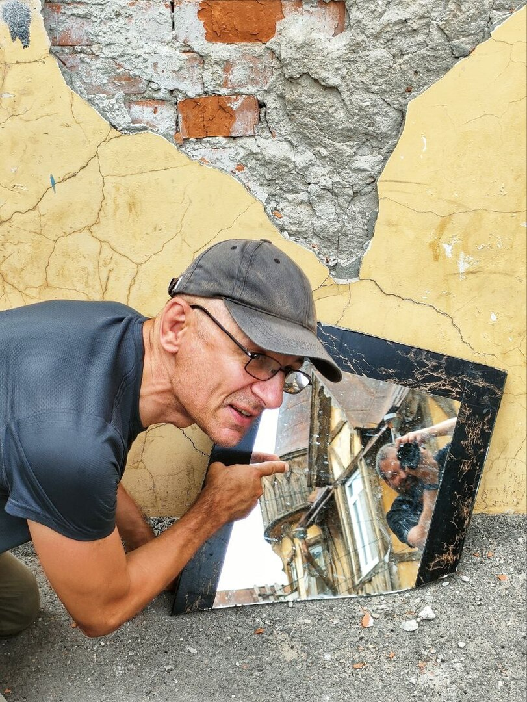
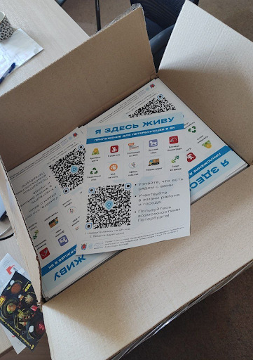
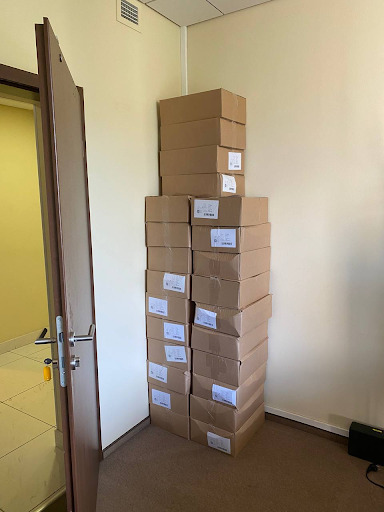

# Я Здесь Живу

## Несчастливые иностранцы {#unhappy_foreigners}

Хорошая, на мой вкус, метафора:

!!! quote ""

    Иностранец не тот, у кого гражданство другой страны, а тот, кто не знает и не чувствует места, в котором живёт.

В нашем информационном обществе мы живём, прежде всего, во внутреннем мире сообщений из ленты и отсмотренных видео.
[В телефоне некоторые жители городов проводят больше времени, чем в проживании происходящего вокруг](p1-040-unhappiness.md#gadgets).
Мы неосознанно отмечаем недочёты реальности в сравнении с нашим «насмотренным» глянцевым миром и [отучаемся радоваться мелочам происходящего](p1-040-unhappiness.md#power_of_now).
Если в голове постоянно крутятся яркие образы из клипов, блокбастеров, неконкурентные скромному образу родного города — мы потихоньку лишаемся корней, перестаём быть в гармонии с миром, в котором живём.
И есть мнение, что наши города заселены преимущественно иностранцами.
Не очень счастливыми.
В таком ключе я начал размышлять сравнительно недавно.
А этому предшествовало вот что.

## «Когда переезжаете?» {#when_are_you_moving}

С момента [прохождения собеседования на позицию Engagement Manager в компанию Microsoft](p1-040-unhappiness.md#intelligence_quotient) в 2006 году друзья начали задавать один и тот же вопрос:

— Ну что, когда переезжаете в Москву?

Это был само собой разумеющийся следующий шаг карьерного пути.
Соглашусь, что он был логичным — ведь руководитель и вся команда экспертов-консультантов находились в Москве, а мои заказчики были по всей стране, точнее — вне МКАДа.
Но летать-то всё равно приходилось через Москву.
Каких-то критических причин оставаться в Самаре, на тот момент, не было.
Тем более, что были доступны специальные программы релокации для сотрудников — помогали найти жилье, перевезти барахло, индексировали зарплату и так далее.
Но мне внутри очень отзывалась поговорка «Где родился — там и пригодился» и я, как будто бы, любил свой город и жгучего желания переезжать не было.

Ладно Москва…

Пару раз в год мы дружной командой летали в США на сборы по обмену опытом и общались с соотечественниками, которые перебрались туда.
И если раскрученные образы Нью-Йорка, Вашингтона, Чикаго, Лос-Анджелеса, Майями, Лас-Вегаса, не говоря уж об Атланте и Хьюстоне не влюбляли в себя совершенно, то Сиэтл мне нравился очень.

Есть в этом портовом городе, соединяющем большие Штаты с Аляской, что-то глубинно настоящее, чего мне не хватало в остальной Америке.
Деревянный рынок Pike Market со своими традициями перекидывания рыбы через ряды покупателей, индейцы на улицах, старенькие милые здания, среди которых первый Starbucks.
А не вот эти вот доминирующие новодельно-железобетонно-пластиковые даунтауны и бесконечно-безликие одноэтажные домики, из которых преимущественно и состоит Америка.

Конечно же, в Штатах у семьи был бы совершенно другой уровень жизни, сравнивая с Самарой!

Дом, лес, лужайка, океан, горы, супер интересная работа, экология и так далее.
Практически все об этом мечтали, но это непросто реализовать, когда переезжаешь в другую страну без гарантированной и высокооплачиваемой работы.
А тут, когда работаешь в глобальной корпорации с высокой внутренней культурой, среди сотрудников, где каждый откликается на фразу «Microsoft? One Team!», и все процессы релокации прозрачны и понятны — это становится делом техники.

Хотелось попробовать реализовать этот совершенно рациональный и разумный проект переезда, но останавливало что-то из серии подсознательного.
Не тоска по березкам, конечно.
Но что-то похожее.

!!! note "Ситуация"

    Вот, например, прилетаю я летней ночью в самарский аэропорт Курумоч, выхожу из самолета на трап, вдыхаю полные лёгкие воздуха и чувствую сырой, но свежий запах Волги.
    Хотя она довольно далеко от аэропорта.
    И счастлив в этот момент — я дома!

    А в Штатах, кстати, меня почему-то по прилёту всегда преследовал запах прогорклого масла, который первое время на контрасте особенно ощущается.
    И от этого всегда как-то грустновато становилось…

В 2012 году после цепочки событий в Microsoft Russia сам себе обострил выбор — либо идти на позицию Incubation Lead с руководством в Мюнхене и продвигать набирающий обороты облачный сервис Microsoft Azure в Центральной Европе, либо закончить этот семилетний этап жизни и вернуться в собственные проекты.
И решился на второй пункт.
Семья была в полном (прошу прощения) «ахрене».
Дочь недавно рассказала, что у неё тогда чуть ли не травма случилась детская.
Папа работал в крупнейшей компьютерной корпорации, мотался по всему миру, по возможности семью с собой возил, везде нас встречали приятные друзья-сотрудники.
И этот прекрасный мир рушился!
:-)

Заниматься продвижением облачной платформы в Европе из Самары было уж совсем странно — рано или поздно пришлось бы переехать.
А помимо пресловутых березок, которые много где растут за рубежом, и Волги, к которой привязан настолько, что иногда даже разговариваю с ней, есть ещё одно важное обстоятельство.
Со знанием дела его обозначил Довлатов.
Неожиданно для его образа, с объективно количественной оценкой:

!!! quote "Цитата"

    На чужом языке мы теряем 80% своей личности.
    Мы утрачиваем способность шутить, иронизировать.
    Одно это приводит меня в ужас.

    ^^[Сергей Довлатов](https://www.livelib.ru/quote/154795-zapovednik-sergej-dovlatov)^^

## Старая Самара {#old_samara}

В общем, пожалуй, уже понятно, к чему я тут старательно подвожу мысль.
Но, лучше сделаю ещё один круг перед заходом на посадку…

Иду это я по родной Самаре, за которую держусь всю свою жизнь, по её старому центру и что же вижу и чувствую по сравнению с городами, сравнимой истории?

Обычно вижу разруху и чувствую горечь от утраты прекрасного некогда города.
Кто виноват не буду анализировать — нюансов тьма.
Они подробно описаны в [книге «Самарский двор»](https://www.livelib.ru/review/3871987-the-samarsky-yard-samarskij-dvor).

И вина, в очень большой степени, лежит на нас самих.
На тех, кто живёт в этих дворах и домах.
Как минимум за то, что допустили этот развал.

Да, государственный строй отобрал эти дворы у рачительных собственников 100 лет назад и заселил их чужаками.

Да, с возвращением права собственности на недвижимость в 90-е возникли серьёзные бюрократические сложности определения границ в кадастре.

Но самая большая проблема — мы сами, не умеющие договариваться и слышать друг друга в вопросе: «Этот квадратный метр мой или чужой?
И пусть дом развалится вовсе, чем я уступлю этот метр соседям!»

В старом городе среди гнилых развалюх иногда попадаются чистые, интересные дворики с палисадником, в которых жители смогли договориться или один из них не стал обращать внимание на разногласия.
И эти оазисы вызывают особенно тёплые чувства.

## Том Сойер Фест {#tom_sawyer_fest}

Очень крутые самарские ребята придумали и запустили инициативу «Том Сойер Фест».
Суть проста — собирается неравнодушный народ и привлекается небольшой бюджет на краску и инструменты от спонсоров.
Вместе восстанавливают старые развалюшки до приличного состояния.
Создали целую методологию, написали книги «Как любить город не только на словах» (*отличный, кстати, заголовок!*), двигаются по стране — в списке присоединившихся насчитал 64 группы, включая Питер, точнее Ленинградскую область.
Всё это можно увидеть на [их сайте](http://tsfest.ru/) и [ВКонтакте](https://vk.com/tomsawyerfest) и присоединиться к движению.

## Фотовыставка во дворе {#expo_in_yard}

<!-- TODO fix PDF/EPUB generation -->

{ width=50%, loading=lazy }
/// caption
Питерский мастер Петросян во дворах Самары. Фото: Андрей Кочетков
///

Но, пожалуй, очевидно, что этих активистов не хватит, чтобы восстановить несколько кварталов города.
Тогда привлекают внимание жителей к старым дворам и домам через искусство и культурные мероприятия в них.

В Петербурге живёт [фотограф Александр Петросян](p2-100-authors.md#AlexanderPetrosyan), который больше 40 лет ходит по одним и тем же улицам родного города.
Помнит, какими они были во времена СССР.
Что особенно удивительно — знает, в какой момент для этого времени года появится солнце в прогале между зданиями и осветит через отражение в окне напротив лица прохожих особенно живописно.
В общем, любит он свой город не на словах, а в мельчайших нюансах его визуального ряда.
И тогда появляется возможность скрещивать исчезающие пространства дворов с искусством таких мастеров — а значит, становится возможным передавать эту любовь жителям!

Вот, например, получилась [такая фотовыставка на стыке двух городов — Самары и Петербурга](https://vk.com/wall-3611243_14815).
Музей Алабина с Андреем Кочетковым во главе продолжают делать [серию дворовых выставок «Сохранить как…»](https://vk.com/wall-3611243_15071).
И таким образом происходит формирование зацепок и корней к месту, где ты живёшь.
Появляется связь с местом жительства.
И в этот момент уже что-то незримо меняется и становится не всё равно, что стена осыпается и надо с ней что-то делать — либо самому ремонтировать, либо методично решать эту задачу, вовлекая ответственных и придавая огласке статус решения по всем правилам.

И как только пространство вокруг тебя становится лучше — появляется дополнительная связь внутреннего мира с реальным, которая даёт тебе опору, уверенность и формирует момент маленького счастья каждый раз, когда проходишь мимо.
:-)

## Васильевский остров: Признание в любви {#love_to_vo}

С 2020 года работаю в Санкт-Петербурге и опять испытываю дежавю с вопросом о переезде.

А иногда даже слышу заявления со стороны, что теперь и семья моя в Петербурге.

Нет.
В Питере я работал и тут я, действительно, живу.
На работу всегда уходила бОльшая часть жизни.
Мне нравится менять обстановку, а теперь ещё и дочь прочувствовала кайф от такого же формата.

И Санкт-Петербург, действительно, самый мой любимый город.
Не в обиду Самаре, которая родная от рождения как мама.
Но с Питером другие отношения…

В детстве ещё влюбился в Ленинград.
И почему-то думал тогда, начитавшись [Шёрлока Холмса](p1-020-call.md#thinking_feeling), что Лондон — это Питер на стероидах.
И своей туманной «альбионностью» он меня сразит наповал.
Но когда в 2006 удалось пожить в «зе кэпитал оф грейт британ», осознал, что нет у Лондона никаких шансов занять соразмерное культурной столице место в моём сердце.

Мне нравится думать, что место проживания я выбирал прежде всего из ощущения близости к [месту чудесного «Небываемое бывает» рождения Российского флота](https://ru.wikipedia.org/wiki/Бой_в_устье_Невы), чем по другим рациональным соображениям.

Каждый раз, отправляясь из дома в город, я прохожу мимо…

Горного института, где формировалась основа богатства России и [старообрядец Черепанов изобретал паровые механизмы](p2-110-system.md#family_priorities).

Казарм лейб-гвардии Финляндского полка, 11 военнослужащих нижних чинов которого отправил на тот свет [революционер Халтурин в борьбе за осчастливливание русского народа](index.md#what_to_do).

Дома семьи Рериха, давшего нам знак «Знамени мира», который поразительно напоминает [«Троицу»](p2-110-system.md#human_as_god) Рублёва и [олицетворяет 3 опоры для достижения состояния благополучия](p2-120-school.md#happiness_in_school).

Особняка художника Брюллова и Морского Кадетского корпуса, из которого вышли выпускники с громкими фамилиями: Врангель, Крузенштерн, Корнилов, Можайский, Нахимов, Римский-Корсаков, Сенявин, Ушаков…

Успенской церкви как подворье Оптиной пустыни, куда Соловьёв повёз Достоевского после смерти его сына встречаться со святым Амвросием Оптинским, в разговоре с которым Фёдор Михайлович проявились смыслы «Братьев Карамазовых».
Достоевский воскресил сына в образе Алёши Карамазова, а моя мама часто рассказывала историю, почему я обязан жизнью этому роману.
Удивительно, как всё связано…

Ближе к окончанию набережной концентрация знаковых фамилий и памятных мест также зашкаливающая.

Школа имени Ивана Алексеевича Бунина, изначально толстовца, которого приостановил в рвении следования учению сам его автор.
Ярый критик советской власти, который, однако, задумался о возвращении на Родину после войны, но отказался от этой затеи после публичного порицания Зощенко и Ахматовой.

Причал, от которого в 1922 году отошёл пароход с мыслителями, депортированными советской властью.
Понятие [«Философский пароход»](https://ru.wikipedia.org/wiki/Философский_пароход) ввёл в 1990-м году Сергей Хоружий.
Его работы были использованы при написании [«Психологии Человеческого Капитала»](p2-120-school.md#human_capital_book).
Он также повлиял на [определение высшего уровня в «Количественной модели счастья»](p2-120-school.md#saints_in_russia).
А на этих моделях, в свою очередь, основан этот Текст.

Дом Академиков, который также насчитывает десятки известнейших фамилий, но особо хочется упомянуть академика Павлова.
Вероятно, что именно в этом доме в 30-е годы василеостровец Михаил Зощенко встречался со знаменитым профессором для того, чтобы [осмыслить причины своей депрессии в книге](https://www.livelib.ru/review/5058298-pered-voshodom-solntsa-mihail-zoschenko), которая станет причиной его гонений.

Васильевский остров задумывался Петром как центр города, а город как центр мира.
Трезини, определявший облик Петербурга, построил тут свой дом, с которого начинается каменная ступенчатая застройка, ставшая [эталонной набережной](https://ru.wikipedia.org/wiki/Набережная_Лейтенанта_Шмидта_(Санкт-Петербург)), по которой стараюсь проходить как можно чаще.

Вероятно, эта набережная имеет самую высокую концентрацию интересующих меня исторических событий и является самым сакральным для меня местом на Земле.
Как и для автора автобиографической повести [«Сестра Печали»](https://www.livelib.ru/book/1006147069-sestra-pechali-vadim-shefner).

!!! quote "Цитата"

    Васин остров для меня - пуп Земли и центр Вселенной.

    ^^[Вадим Шефнер](http://a-pesni.org/dvor/piter/a-izzapisn.php)^^

## Жизнь на два города {#two_cities}

Жизнь на два города, действительно, непростая история с точки зрения нагрузки.
Прежде всего, на здоровье.
Но с точки зрения контрастов и моментов Счастья для моего темперамента она полностью оправдана.

Красивейшая Волга и спокойный размеренный уклад жизни самарцев с одной стороны.
С другой стороны — грандиозное культурное, историческое и архитектурное богатство города с непростыми петербуржцами и ленинградцами.
Всего два с половиной часа лёта и совершенно разные архитектура, история, менталитеты, и, как следствие, контрасты и моменты Счастья.
Как от Волжских просторов и самарского быта, так и от великого Санкт-Петербурга с его жителями.

Пока будет хватать здоровья — буду мотаться туда и обратно.

## Приложение «Я Здесь Живу» {#mini_app_vkontakte}

И вот в 2020-м году появилась возможность в любимом городе реализовать новые подходы.
Началось строительство [«Цифрового Петербурга»](https://about.petersburg.ru/).

Первым делом [подписали партнёрские соглашения с Яндексом и ВКонтакте](https://ru.ruwiki.ru/wiki/Цифровой_Петербург) – чтобы создавать сообща и не делать лишнюю работу.

Штормим и ищем идеи для потенциальных сервисов, которые будут максимально востребованы жителями и изначально отталкиваемся от их потребностей, что обусловлено принципами человекоцентричного государства.
В современном градоуправлении без этой Я-центричности не обойтись.

Выписываются роли «Я — Родитель», «Я — Водитель», «Я — Пассажир», «Я с Питомцем» и так далее.
Прикидываем количество петербуржцев в каждой роли.
Перечисляем обычные потребности под каждую из ролей, сортируем их по частоте возникновения и важности.
Например, где дать ребенку дополнительное образование?
Где припарковать машину?
Но замечаем, что каждая из этих ролей имеет явный акцент на территории, которая близка к месту жительства.

И вопросы, на самом деле, чаще всего звучат как:

- [Как убирается снег и мусор в моем доме?](https://vk.com/app7710919#road_cleaning)
- [Какие задачи город решал в моем доме и дворе?](https://vk.com/app7710919#our_spb)
- [В какой кружок доп образования можно отправить ребёнка в шаговой доступности?](https://vk.com/app7710919#i_parent)
- [Есть ли места в ближайшем детском садике и как туда записаться?](https://vk.com/app7710919#kindergartens)
- [Что было рядом с моим домом во время блокады?](https://vk.com/app7710919#blockade)
- [Где погулять с собакой в доступности 15 минутной прогулки?](https://vk.com/app7710919#pets)
- [Зачем разделять мусор и куда выкинуть батарейки рядом с домом?](https://vk.com/app7710919#ecology)
- [Где и с кем позаниматься спортом вместе после работы?](https://vk.com/app7710919#sports_ground)
- [Какие лекции и другие мероприятия от лица города проходят рядом со мной?](https://vk.com/app7710919#billboard_event)
- [А что делать если мой голос по выбору УК подделали?](https://vk.com/app7710919#falsification)
- [Почему мой дом является памятником исторического наследия?](https://vk.com/app7710919#my_home)
- [Какие новости города касаются именно моего района?](https://vk.com/app7710919)

И значит, нам нужно отвечать на разнообразные вопросы с привязкой к адресу.
И мы хотим отвечать объективно, со ссылками и данными из официальных городских информационных систем.
Мы хотели бы стать прообразом эксперта, который всё знает о своём доме, дворе и районе.
В каждом доме и районе уже, как правило, создано сообщество ВКонтакте, и если в нём появится такой эксперт, то все участники сообщества могут обрести корни.

{ width=50%, loading=lazy }
/// caption
Первые объявления
///

Роль «Я Здесь Живу» мы и взяли в качестве основной идеи для реализации [флагманского приложения экосистемы городских сервисов](https://vk.com/app7710919_20069794).
Начиная с декабря 2022 года приложение стало попадать в новости Санкт-Петербурга с анонсами городских сервисов, которые помогают получше узнать место своего жительства с разных сторон.
И пока мы планируем в год запускать порядка десятка новых функций приложения «Я Здесь Живу».

{ width=50%, loading=lazy }
/// caption
Для размещения в парадных Петербурга
///

## Развитие Цифрового Петербурга {#digital_petersburg_roadmap}

Ближе к концу 2023 года мы начали пробовать [рассказывать о событиях и фактах на районе не только в приложении, но и в мессенджерах ВКонтакте и Telegram](https://vk.com/ya_zdes_zhivu?w=wall-205339741_362).
И вообще этот функционал потока сообщений, фактов и функций мы реализовали в виде [открытого API](https://api.petersburg.ru/mainPortal/api_services;role=22), чтобы вовлекались разработчики и создавали разнообразные информирующие и полезные сервисы с привязкой к месту города.

{ width=75%, loading=lazy }
/// caption
Строгий дворник Яков Петрович
///

В Telegram группе и сообществе ВКонтакте каждого многоквартирного дома хорошо бы запустить чат-бота, который будет исполнять роль эксперта.

До революции такую роль исполняли дворники.
И были они [незаменимыми помощниками](https://vk.com/wall-205339741_662).
Теперь это может быть виртуальный персонаж с развивающейся нейросетью.

Он знает об актуальных обращениях граждан по своему дому и в окрестности.
Знает на зубок все телефоны служб и специалистов, имеющих отношение к дому.
Он информирует об отключениях воды.
Может выдавать районные новости как еженедельный вестник.
И с ним можно поговорить.

Ему можно пожаловаться на проблему, а можно совета спросить.
Такой одушевлённый «дворник» на основе Искусственного Интеллекта будет восприниматься неплохо.
Особенно если он будет говорить не только про проблемы, но также будет уметь шутить, находить компромисс и главное — благодарить за неравнодушие и участие.

Сделали коллективную заявку — спасибо всем, кто обратил внимание.
Исполнили заявку — спасибо службам и тем, кто инициировал.
А уж если кто вложился для дома безвозмездно (хотя такие зачастую остаются инкогнито) — низкий поклон.
И тогда обстановка и атмосфера начинает потихоньку меняться.

Такому помощнику надо иметь свой образ и имя.
Например, Яков Петрович.
В каждом доме свой собственный и уникальный.
В Петербурге уже есть такие примеры в некоторых Жилищных Комплексах.

Выбор концепции проходит осторожно.
Вероятно это будет не дворник, а ежедневно зажигающий свет фонарщик и будут его звать, например, Яков Захарович Жилин!
:-)

С использованием [открытых интерфейсов](https://api.petersburg.ru) и [интеллектуальных помощников на базе чат-ботов](https://isaak.iac.spb.ru/) разработчики могут вовлечь в осчастливливающую деятельность познания своего места жительства максимальное количество горожан.
А когда ты узнаёшь и делаешь место жительства лучше совместно с кем-то — счастье растёт в геометрической прогрессии.
Ребята из команд «Том Сойер Фест» и «Я Здесь Живу» это хорошо понимают и хотелось бы впоследствии [объединить эти движения](https://vk.com/wall-205339741_347).

Особенно мотивирует идея запустить в Петербурге экскурсионные и фотографические сервисы.
Уж больно велик культурный, исторический и визуальный потенциал этого города.
А красота, как известно, спасёт мир!
И поэтому хочется дать ответы жителям и гостям по типу:

- Какой самый красивый вид в 18:00 в августе в радиусе 2 километров от точки моего нахождения с учётом положения солнца?
А кто меня там сможет сфотографировать?
- Через какие 5 мест Петроградской стороны, связанных с движением народовольцев, можно пройти пешком за час и ещё выпить хороший кофе в середине маршрута?
- Какие сертифицированные гиды проведут экскурсию по местам в Петербурге, связанным со школьной программой седьмого класса по Литературе?
- Сколько потребуется времени, чтобы пройти по всем местам жительства Достоевского в Петербурге, а заодно съесть борща?
- Какое знаменательное событие, связанное с Петербургом, достойно тоста для рюмки под борщ?
[Алиса, скажи, за что пить в Питере сегодня?](https://dialogs.yandex.ru/store/skills/632de8b1-za-chto-pit-v-piter)

Ежегодный поток туристов в Петербурге всегда исчислялся миллионами.
В городе тысячи гидов и фотографов, которые не всегда загружены работой, но заинтересованы в дополнительных клиентах и могут быть вовлечены в эти сервисы.
Местные мне говорили, что увлечь в основной массе петербуржцев историей города нереально — приелось, да и отношение у них ко всему особенное.

Решил проверить эту версию — сделал заказ на эксклюзивную экскурсию по истории событий, происходивших в районе 26-й линии и Большого проспекта Васильевского острова и [позвал соседей](https://vk.com/bongiozzo?w=wall20069794_86).
В результате затраты на одного из самых известных и дорогих гидов Санкт-Петербурга — [Павла Перца](https://vk.com/spbtrip), отбились и ещё осталось на [обсуждение услышанного в местном ресторанчике](https://vk.com/bongiozzo?w=wall20069794_96).

Сложно, но можно растормошить жителей на подобные погружения.
Сервисы эти, пожалуй, стоит делать тематические и завязывать не только на территорию, но также на увлечения живописью, литературой, музыкой, историей…
Тёплые воспоминания и дорогие сердцу фотографии, привязанные к местам города, есть не только у гидов и фотографов, но у каждой петербургской семьи.
Почему не дать возможность друзьям и потомкам сохранить память о семейных традициях в привязке к местам на карте?

!!! quote "Цитата"

    Ведь в каждом коренном петербуржце сидит гид!

    ^^[Анатолий Рыбаков](https://www.livelib.ru/quote/431589-tyazhelyj-pesok-anatolij-rybakov)^^

В общем, хочется запустить [благородное любопытство](p2-110-system.md#noble_curiosity) и сохранение корней среди жителей прекрасного Петербурга на полную катушку.
Есть идеи и есть прототипы.
Ребята команды «Цифровой Петербург» без каких-либо поручений [сами «запилили» базовую версию сервиса «Красивые места»](https://vk.com/app7710919#beautiful_places), но потенциал развития сервиса в Петербурге, можно сказать, неограничен.
{--Будем работать над этими и другими идеями, пока есть такая возможность.--}

Я уже за пределами команды, но и от своих целей не отказываюсь, и связи с участниками сохраняются, несмотря на разные записи в трудовой книжке.

Если формулировать свою Цель как недостижимый Идеал: «Сделать петербуржцев счастливыми», то всегда найдётся, что делать и, значит, быть самому счастливым.

## Город как Текст {#city_as_text}

В качестве философского отступления от излишней конкретики и практических примеров последних абзацев…

Сравнительно недавно познакомился с таким понятием как [Семиотика](https://ru.wikipedia.org/wiki/Семиотика), которая рассматривает [мир и объекты в нём как Текст](index.md#text_is_better_than_podcast).
Или более абстрактно – систему знаков.

Архитектура Санкт-Петербурга — это тоже Текст, который мы «читаем» каждый раз, когда созерцаем перспективы прекрасного города.
Архитектура несёт послания, как заложенные при проектировании, так и заряженные историческими событиями, произошедшими в этом пространстве.

С трудом можно назвать более концентрированное по смыслам последних 3 столетий место.
Благородный и возвышенный текст Петербурга ощутимо и настойчиво требует перемен и переосмысления ценностей у своих «читателей» — жителей и гостей.
Неспроста он стал «городом трёх революций».

## Русский космизм с петербургскими корнями {#russian_cosmism}

Если чуть продвинуться в эзотерику, то можно найти понятие [Эгрегора](https://ru.wikipedia.org/wiki/Эгрегор), которое связывает пространство, людей, их цели и ценности.
Оно слишком ненаучное и позднее получило свое развитие как [Ноосфера](https://ru.wikipedia.org/wiki/Ноосфера).
Ноосфера — это обитаемое пространство планеты Земля (биосфера) неразрывно связано с обществом, которое объединилось, стало осознанным, рациональным человечеством и меняет облик планеты в интересах всех землян.
И далее вся эта ноосфера расширяется в космос — Профит!

Основным идеологом концепции был петербуржец Владимир Вернадский, который двигал понятие ноосферы как вектор развития в 20-е и 30-е годы в СССР и за рубежом.
Вот условия развития ноосферы по Вернадскому:

- Заселение человеком всей планеты;
- Резкое преобразование средств связи и обмена между разными странами;
- Усиление связей, в том числе политических, между государствами Земли;
- Преобладание геологической роли человека над другими геологическими процессами, протекающими в биосфере;
- Расширение границ биосферы и выход в Космос;
- Открытие новых источников энергии;
- Равенство людей всех рас и религий;
- Увеличение роли народных масс в решении вопросов и внутренней политики;
- Свобода научной мысли и научного искания от давления религиозных, философских и политических построений и создание в общественном и государственном строе условий, благоприятных для свободной научной мысли;
- Подъём благосостояния трудящихся.
Создание реальной возможности не допустить недоедания, голода, нищеты и ослабить влияние болезней;
- Разумное преобразование первичной природы Земли с целью сделать способной удовлетворять все материальные, эстетические и духовные потребности численно возрастающего населения;
- Исключение войн из жизни человечества.

Не стоит и говорить, что даже если эти пункты, как одно целое, в теории можно обсуждать, то на практике объединить страны и поставить всех на рельсы единых ценностей получается «не очень».
Понятно, что его пункты звучали органично в контексте актуальной на тот момент идеи мировой революции и победы коммунизма над капитализмом.
Чем на практике [активно занимался Владимир Ильич Ленин](p1-050-country.md#lenin_anarchist).
Но как тогда не получилось у советских политиков провернуть идею мировой революции (и слава Богу), так и не получается завершить [процесс глобализации всего мира вокруг системы координат, по сути, формируемой одной страной](p2-110-system.md#polarization).

Не сформировалось единой и проверенной десятилетиями рабочей системы распределения ценностей.
Не верится, что лидеры начнут по собственной воле будут отдавать излишки отстающим, чтобы сокращать разрывы.
Как среди людей в обществе, так и между странами в мире.
На каждом шагу возникают конфликты интересов.
Политика сплошь и рядом строится на скрытых мотивах.
[Остаётся надежда на технологический прогресс и открытые принципы](https://www.livelib.ru/quote/47955832-iskusstvennyj-intellekt-vozmozhnye-puti-opasnosti-i-strategii-nik-bostrom).

Ещё раньше в Петербурге над идеей счастливого мироустройства размышляли Достоевский, Соловьев, Рерих, Блаватская…
В Калуге поверх [христианской системы ценностей](p2-110-system.md#rational_definition_of_christ) и идеи освоения космоса построил свою концепцию Циолковский.
Уже в 1970-е годы труды этой плеяды мыслителей в попытках найти идею, объединяющую человечество, назвали [течением русского космизма](https://ru.wikipedia.org/wiki/Русский_космизм).

!!! note "Дополнение"

    В процессе разбора предполагаемых моделей общества попросил искусственный интеллект сравнить видение нескольких космистов на предмет схожести и отличий:

    Сходства моделей Соловьёва, Достоевского, Циолковского и Толстого:

    - Все они видели общество и человека в тесной связи с моралью и духовностью.
    - Поддерживали идею нравственного совершенствования личности как основы для построения справедливого общества.
    - Считали, что истинное общество возможно лишь при условии любви, ответственности и солидарности между людьми.
    - В своих моделях отвергали утилитаризм и чисто материальные или экономические подходы к обществу.
    - Все были критиками механистических и репрессивных социальных систем, выступали за эволюционное, духовное развитие общества.

    Отличия моделей:

    |Аспект     |Соловьёв     |Достоевский    |Циолковский      |Толстой     |
    |---        |---          |---            |---              |---         |
    |Философская основа|Теософия, всеединство, София (мистика)|Православная соборность, экзистенциализм|Космический пантеизм, научный атеизм|Христианский пацифизм, нравственный идеал|
    |Отношение к религии|Интеграция науки и религии|Православие как основа свободы и нравственности|Критика традиционного христианства, космическая философия|Христианское учение о любви и непротивлении злу|
    |Общественный идеал|Теократия, справедливое христианское общество|Свобода личности в любви и ответственности, соборность|Эволюционное общество будущего с космическим масштабом|Общество на основе нравственного самосовершенствования и непротивления|
    |Свобода личности|Важна, но в гармонии с божественным планом|Абсолютна, но возможна только через Бога и любовь|Человек - часть космоса, свобода через развитие и науку|Свобода через моральное совершенство и отказ от насилия|
    |Социальный строй|Идеал - теократия, объединение народов|Соборность, отказ от принудительного коллективизма|Эволюционное построение общества без бюрократии|Община, отказ от государства и насилия|

    Таким образом, все четыре мыслителя объединены идеей нравственного и духовного совершенствования общества, но различаются в философских основаниях, роли религии и подходах к свободе и устройству общества. Достоевский и Соловьёв ближе к традиционному православному мировоззрению, Циолковский - к научному космизму, а Толстой - к христианскому пацифизму и нравственному идеализму.

Повторюсь, что как только начинаешь рассматривать себя в отрыве от общества, а свою страну в отрыве от мировой геополитической ситуации – идеалистический настрой неминуемо разрушается.

И вроде всё очевидно — [бери проверенную временем систему координат из принципов](p2-110-system.md#acceptance) и постепенно улучшай пространство своей жизни – расширяясь через себя, свою семью, друзей, во двор, город, в ноосферу и космос.

Не забывая при этом, что [люди разные](p1-020-call.md#mbti_personalities) и кто-то укрепляется преимущественно через веру в науку и рациональный подход, а кто-то стремится в храмы, где можно в очередной раз напомнить себе о духовных идеалах и почувствовать себя увереннее вместе с другими.

Но что-то останавливает развивать в себе два подхода одновременно.
Что?

!!! note "Ситуация"

    Году в 2019 гуляли мы с друзьями по Самаре и рассуждали — а что конкретно не устраивает в православии и системе ценностей, которая стоит за этим учением?
    Чего не хватает?

    Само понятие любви, как основной вектор усилий?
    Отождествление себя, созданного по подобию, с совершенным образом духовного идеала?
    Взгляд на свою жизнь с позиции после смерти?

    Всё это понятные подходы, разобранные ранее и объективно не вызывающие отторжения.
    Можно пробовать другие практики, изобретать велосипеды, но проверенный временем и отдельными личностями созидательный путь в достижении счастья уже есть рядом.

    Так что не устраивает?

    И тут прозвучал яркий аргумент «Против», который, вероятно, был основным и самым понятным — «Друзья засмеют!»
    А дальше истории с «часами патриарха» и другими скандалами в СМИ.

    И в этот момент, пожалуй, произошел перелом во мне лично.

Когда отдаёшь себе отчет, что внутри [достаточно твердая собственная опора из системы ценностей](p2-110-system.md) и [хватает батарейки](p1-040-unhappiness.md#battery_aziz) улучшать мир вокруг — иди и делай бестрепетно.
А что про тебя подумают и что там с этими часами было — да неважно!
Можно не забивать себе этим голову.
Не хватит сил на все эти метания и сомнения.

## Люби свой город не только на словах! {#love_beyond_words}

А пространство, где мы живём, можно улучшать уже сейчас, и возвращаются эти действия [моментами счастья](p1-010-happiness.md#moments_of_happiness) на протяжении оставшейся жизни снова и снова.

С другой же стороны, если в роли жителя следовать только современной концепции Клиентоцентричного государства, принесённой из коммерческой среды — когда ты оплатил налоги и коммуналку и встал в позицию, когда тебе Должны, где «Клиент всегда прав», возникает большой риск свалиться в эгоцентричную позицию.

[Да, это ловушка будущего Несчастья](p1-040-unhappiness.md#egocentrism).

Термин Клиентоцентричность в государственном управлении, на мой взгляд, не самый удачный и подразумевает лишь удобство пользования государственными сервисами по аналогии с коммерческими, которые развиваются в условиях рыночной конкуренции.
Гражданин не равно Клиент.

«Люби свой город не только на словах!» — как говорят [участники Том Сойер феста](#tom_sawyer_fest).

Вкладывайся сам – и будет тебе Счастье!
