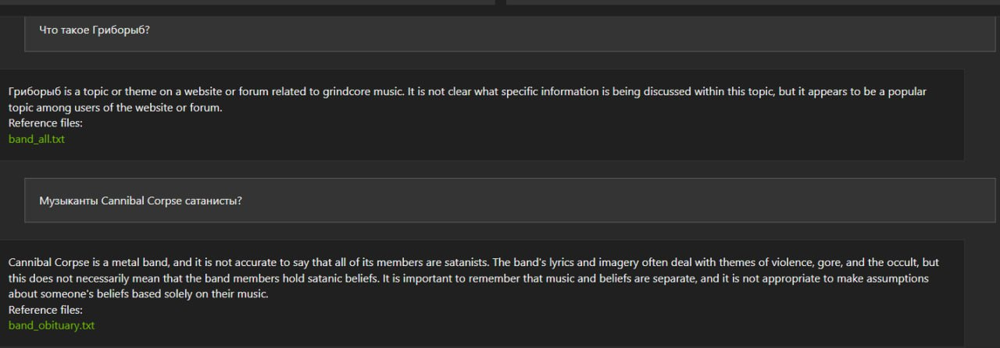

# Be happy or Die!

## Абсурд: способ не сойти с ума в рациональном мире {#absurd_as_salvation}

Творчество, особенно с элементами абсурда — великолепный способ снять ограничения разума и психики, в которых мы находимся 99% времени.
Когда в мозг поступает абсурдная информация, которую он не может встроить в естественный порядок вещей, но интеллекту хватает гибкости распознать, что это всё не всерьёз — происходит радостный выброс дофамина и других нейротрансмиттеров — наконец-то можно расслабиться, мы испытываем счастье!
Поступают сигналы в лицевые мышцы, мы начинаем смеяться и передаём наше счастье дальше.
Юмор основан на абсурде, музыка построена на гармонии звуков.
Если их объединить — получается не всегда смешно, но, на мой вкус, круто!
И это Heavy Metal.

Эта глава про Счастье слушать такую музыку.
Название «Be Happy or Die!» естественным образом пришло в голову как ассоциация на известный альбом задорной группы [S.O.D. — «Speak English or Die!»](https://music.yandex.ru/album/3060312).
Пусть такое и будет.
Творения экстремалов настолько неприемлемы с точки зрения этических норм и здравой логики, что слишком серьёзно их лучше не воспринимать!
:-)

Настолько абсурдный подход в творчестве меня ([рационально структурированного Архитектора](p1-020-call.md#architect_personality)) гармонизирует наилучшим образом.
С одной стороны, [эмоциональность и порывистость](index.md#right_now) является отличительной особенностью моего темперамента — очень они мне понятны.
С другой стороны, любое творчество, [как «выход за рамки»](p2-120-school.md#psychology_of_unconscious), уравновешивает чёткую структуру и расчёт, в котором привычно находишься.

## Музыкальное сопровождение этой главы {#playlist}

Во время написания этого текста в ушах всегда звучала музыка.
Какие-то композиции были очень уместны моменту и я добавлял их в коллекцию, на которую оставлю тут [ссылку](https://music.yandex.ru/users/beer-bong/playlists/1004).
Запустить воспроизведение лучше в случайном порядке.
Также по тексту разместил единичные прямые ссылки, для примера.

Нисколько не ожидаю, что музыка будет нравиться кому-то ещё.
Она созвучна моему темпераменту прежде всего.
Замечательно, что мы очень разные.
Считаю, что всерьёз подобную музыку можно слушать только в хорошем качестве и на приличной громкости, которая чуть выше уровня, когда устройства предупреждают о потенциальном вреде для барабанных перепонок!
:-)

Hi-Fi усилитель, качественные наушники или колонки, на мой взгляд, обязательны.

Пишу этот текст в самолёте, где с сожалением обнаружил, что у меня не оказалось альбома S.O.D., скачанного на телефон.
Но расстраиваться нет причин — ведь других таких композиций со смешением смыслов и стилей у меня всегда с собой сотни и тысячи.
Для первого абзаца выбрал наугад джазовую композицию, доведенную до абсурда музыкантами из [Trepalium — «Sick Boogie Murder»](https://music.yandex.ru/album/510493/track/4511235).
Дальше Волна подберёт что-нибудь подобное.
Поехали.

## Виртуозы в предыдущих поколениях {#classic_and_metal}

Хочется начать с предпосылок появления энергетически заряженной и сложной музыки.
Совсем издалека, с банальных истин.
В Telegram группе нашего Текста неоднократно [поднимался вопрос](https://t.me/bongiozzo_discussion/1803) разности отношения к Счастью поколений Иксов, Игреков и прочих букв.
Учитывать эту разность можно и нужно.
Но опираться на неё, строить выводы, на мой взгляд, не получится.
Ведь [наша цивилизация раскрутила маховик технологического прогресса](p1-030-time.md#scientific_progress) настолько, что каждый год появляются какие-то устройства и сервисы, меняющие привычки, формировавшиеся тысячи лет до этого!
А темпераменты, психотипы и реакции на жизненные ситуации, как раз, неизменны и повторяются из поколения в поколение.

/// music | Музыка

[Crisix — «Beast»](https://music.yandex.ru/album/20619354/track/98965714)

Заметно поднимает градус эмоционального настроя.

///

Все мы видим мир по своему.
Сотканный из своих представлений, принципов, образов, воспоминаний, жизненного опыта и фантазий.
Уникальный совершенно.
Реальность сильно отличается от наших мысленных проекций и создаёт определённую разность потенциалов.
Если никуда не двигаться и не компенсировать эту разность, то этот дисбаланс будет доставлять раздражение и формировать образ Несчастья.
Люди с хорошим воображением, [следующие своему Призванию](p1-020-call.md) и с [мощной батарейкой жизненных сил](p1-040-unhappiness.md#battery_aziz) создают свои проекции в творчестве.
В зависимости от дарования — в литературе, кинематографе, живописи, фотографии.
Список может быть большой.
И в музыке, конечно же.

Созданные образы обогащают и гармонизируют видение уже реального мира и делают человека более сбалансированным и счастливым.
Чем лучше получается, тем меньше удовлетворения доставляет повторение прошлых успехов.
Приходят выгорание, ожидание вдохновения, поиск смысла и прочие метания.
Внутренняя потребность соединять свою проекцию мира с реальностью, как зверь, требует мощных компенсаций.
У обладателей буйного темперамента образы, скоре всего, будут рождаться особенно яркими.

300 лет назад влюбленные в музыку носители «внутреннего огня» становились скрипачами и пианистами, которых мы сейчас знаем как столпов классической музыки.
Теперь, с расширением палитры инструментов и многообразия стилей, зачастую, можем видеть их среди виртуозов технически сложного рок формата.
Если присмотреться, то в основе музыки ставшей классикой и экстремально тяжелого underground общего намного больше, чем различий.
Очень наглядный пример — [если тяжелую музыку играть на фортепиано, то она становится похожей на классическую](https://www.youtube.com/watch?v=AjwYMjZRkIU).

Что и даёт основание для суждения — звучание музыки меняется, но суть остаётся.
И непонятные большинству длинноволосые ребята в страшных майках — вероятно были ли бы «бетховенами» и «моцартами» в прошлом.

{ width="100%", loading=lazy }
/// caption
Buicide 26 января 2024
///

/// music | Музыка

[DeathOrchestra — «Spirit Crusher»](https://music.yandex.ru/album/11791580/track/70026997)

Питерская группа Buicide совместно с симфоническим оркестром [создали проект DeathOrchestra](https://vk.com/deathorchestra) и исполняют музыку группы Death, прародителя этого музыкального стиля.
На мой взгляд, сочетание абсолютно гармоничное.

///

## Появление тяги к музыке {#call_of_music}

Но как же я дошёл до жизни с экстремальной музыкой?
С чего всё начиналось?

{ width="75%", loading=lazy }
/// caption
Явно оторвали мальчика от чтения
///

/// music | Музыка

Для следующего абзаца включается уже спокойная джазовая композиция.

[Orange Market](https://music.yandex.ru/album/552392/track/5010596)

Деликатными звуками прикосновений к струнам, клавишам и тарелкам, как нельзя лучше, дополняет ностальгически рефлексивный пассаж о предпосылках возникновения любви к такой музыке.

///

С того, что щуплым мальчиком-ботаником я жил преимущественно в своих мирах и мечтах, созданных бесконечной чередой книг из домашней и ближайшей детской библиотеки.
Чёрные книги с золотистой птичкой и кроваво-красным оттиском «Конан Дойль» сформировали в моём воображении [образ Шёрлока Холмса — рационала и логика до мыслимой крайности](p1-020-call.md#thinking_feeling).
Этот образ изначально восхищал и притягивал меня.
Но воплощённый в кино [Василием Ливановым](p1-020-call.md#thinking_feeling) (с которым, кстати, как говорили девочки в классе мы были похожи в юности) сделал образ самым любимым.

{ width="75%", loading=lazy }
/// caption
Молодой Ливанов
///

/// abstract | Ситуация

И вот сижу я 10 летним мальчиком под столом, потому что оттуда не так страшно смотреть [«Смертельную схватку»](https://www.kinopoisk.ru/film/354799/) Шёрлока Холмса.
Обнял себя за плечи и качаюсь от переживаний за самого близкого и дорогого героя.
Страшный Мориарти, обрыв, борьба насмерть, жуть.
Впитываю каждый кадр и каждый звук.

Ну и когда всё кончено и Ватсон читает письмо своего погибшего друга — наступает катарсис, который на всю жизнь впечатывает в мозг звучащую в этот момент музыкальную тему Владимира Дашкевича.

///

Этот мотив меня преследовал на следующий день.
И через неделю не покидал.
Так настойчиво звучал снова и снова, что я практически начал требовать у родителей инструмент для воспроизведения этой мелодии!
:-)
Прошёл серьёзный семейный совет, и решение о покупке пианино родителями было принято.

Забавно, что спустя 30 лет музыкальную тему уже другого Шерлока на фортепиано подбирала дочь.

{ width="75%", loading=lazy }
/// caption
Подбираю мелодию темы Дашкевича «Шёрлок Холмс»
///

/// music | Музыка

Сейчас играет

[Мощь! — «Gipsy»](https://music.yandex.ru/album/25821871/track/113709574)

///

## Первые шаги знакомства с музыкой {#first_musical_steps}

Если семья вложилась в серьёзный инструмент, то значит надо серьёзно заниматься.
Ответственность ощущалась.
Но почему-то я сразу поставил блок на хождение в музыкальную школу по полному разряду и категорически не допускал даже мысли о посещении классов сольфеджио.
Ограничился только занятиями игры на фортепиано.
Причём просил, чтобы меня учили на самых любимых мною композициях.
Фаворит — [«Полонез Огинского»](https://music.yandex.ru/album/15414628/track/74610022), простые в исполнении фрагменты [«Лунной сонаты»](https://music.yandex.ru/album/4904304/track/38375675), различные блюзовые мотивы типа [«Summertime»](https://music.yandex.ru/album/765207/track/7217441) — вот мой выбор.
При этом никаких признаков гениальности я не выказывал.

И также не собирался тратить на музыку [пресловутые 10 тысяч часов](https://www.forbes.ru/forbes/issue/2009-04/7255-pravilo-10000-chasov), чтобы отточить технику исполнения и стать самарским Джоном Ленноном или [Estepario Siberiano](https://www.youtube.com/@ElEsteparioSiberiano).
Как только начинало получаться — интерес пропадал.

Мне важно, чтобы музыка была в моей жизни, и не так важно, кто её будет исполнять — я сам или магнитофон.
Так я перестал ходить на занятия.
А спустя 4 года, ближе к 8 классу старшей школы, пианино преимущественно собирало домашнюю пыль.

/// music | Музыка

Звучит гротескно концентрированно агрессивный образ Злобы, неизменно вызывающий мурашки входя в резонанс с внутренним ритмом

[Nekrogoblikon — «Darkness»](https://music.yandex.ru/album/5094539/track/39139507)

///

Завершение учебного года в 8-м классе…
Осталось всего пару дней до конца четверти.
Всё тот же ботаник-очкарик, стою зажатый в угол стаей шпаны из 7-го класса.
Из-за усиливающегося звона в ушах оскорбления уже не воспринимаются.
В глазах пелена, рука в кармане сжимает шилообразный ключ, перед глазами ухмылка на лице самого наглого.
Планка падает, удар, кровь из пробитой щеки смывает ухмылку, на лице уже ужас и страх, замешательство и аккуратный расход с криками: «Жди, сука, мы тебя встретим и уроем!»

Ситуация замялась, но после этого случая мысль о том, что мне ещё 2 года ходить в свою среднюю школу, как заноза вызывала тянущую тоску, несовместимую со Счастьем.
И я придумал, что к следующему году мне надо обязательно сменить учебное заведение.
На как можно более дальнее!
:-)

Сам изучил объявления в газетах и нашёл набор в только-что открывшуюся экспериментальную школу.
В конце 80-х они только-только начали появляться.

Мама не была против…

И вот я уже езжу в школу в центр города на трамвае, тратя по 2 часа в день на дорогу.

Отношения с друзьями из моего микрорайона, с которыми мы ходили в походы, хоть и сохранились, но резко сократились.
Решение это было совершенно бредовое, но я ничуть о нём не сожалею.
Как, впрочем, и о других.

/// music | Музыка

И сразу следом контрастная, но такая же тёмная мистическая интерпретация образа Вселенского Зла-а-а-а…

[Brides of Lucifer — «Burn in hell»](https://music.yandex.ru/album/5474654/track/41679609)

///

## Первые тяжелые кассеты {#first_heavy_records}

Итак, я в классе, где нет ни одного… не то чтобы друга — нет ни одного знакомого!

Одноклассники все какие-то разношёрстные, сильно отличаются от усредненного мальчика из спального района, в котором я вырос.
Один парень, впрочем, очень сильно выделялся — держался и с одноклассниками и с преподавателями уверенно и даже дерзко, носил длинную чёлку, курил и слушал Метал!
Уж не помню, как оказалось, что я взял у него кассету послушать.
Но музыку я любил, и мне было интересно.
Кажется, был там [Manowar 1988 года](https://music.yandex.ru/album/60696/track/566892) и [Running Wild 1988](https://music.yandex.ru/album/413026/track/3692164).
Было любопытно и свежо.
Сильно отличалось от того, что слушал [мой старший брат](p2-110-system.md#our_father) — Высоцкий, Abba, Boney M и Pink Floyd, как самое «тяжелое» для восприятия.

Брат, старше меня на 9 лет, был уже самостоятельным и к музыке относился довольно серьёзно.
Была у него собранная совместно с отцом достойная аппаратура — катушечный магнитофон «Орбита 106», кассетный магнитофон «Вильма 204», вертушка для пластинок «Арктур 006», усилитель «Бриг 001» и колонки «35 АС90».
Настолько трепетно он относился к технике, что она и по сей день у него поёт.
Одноклассники могли только мечтать о таком комплекте.

А для инструментальной музыки качество звучания крайне важно, и с таким оборудованием грех было не подняться на ступеньку выше.
И вместо кассеты сомнительного качества, попробовать самому сделать мастер-копию с настоящего винилового диска!
Или «пласта», как тогда говорили.
Достать правильные пластинки можно было только на толкучке.
По выходным на «Туче», в лесу на окраине города, или по будням в центре, около магазина «Мелодия».
Выменивал и договаривался с взрослыми мужиками о прокате пластинок, что позволяло дома сделать качественную копию.

/// abstract | Ситуация

Одного из самых ярких персонажей той тусовки [недавно вспомнил по грустному поводу](https://t.me/bongiozzo_discussion/1650)…
Привёл ссылку потому, что образ Перегудова прекрасно передаёт восприятие того времени.

///

А когда у меня начали появляться качественные записи и интересные связи — ко мне домой потянулись новые друзья.

Мама приносила с ночной смены в Доме Печати плотную чёрную бумагу, которая оставалась от упаковок химреактивов.
Это единственное, что она могла прихватить с работы в ограничениях собственных принципов в «голодные» 90-е.
Следуя внутреннему зову, этой бумагой я обклеил всю свою комнату.
Смотрелось очень круто!
А заодно исключил любую одежду из своего небольшого гардероба, которая не была чёрной.
Очень удобно!
Убирает муки выбора не особо важных вопросов, типа «Что надеть?» Ну и заодно формирует образ [Джонни «Man in Black» Кэша](https://music.yandex.ru/album/18532271/track/92472818), о котором я, впрочем, тогда не знал.

/// music | Музыка

Звучит

[At the Gates — «Blinded by Fear»](https://music.yandex.ru/album/2148775/track/19167314)

Почему-то очень особняком для меня стоит группа с философским названием «У Врат».
Есть какой-то нюанс в тембре вокала, создающий ощущение крайнего отчаяния, который пробирает «до мурашек».

///

{ width="50%", loading=lazy }
/// caption
Уже заболевший вирусом тяжелой музыки юноша
///

## До невообразимого предела! {#to_the_extreme}

После того как я оценил Manowar, Антон (так зовут этого парня) с улыбкой предложил мне кассету с надписями от руки [Death](https://music.yandex.ru/album/1977117/track/5667122) и [Obituary](https://music.yandex.ru/album/16770/track/169102).
Улыбку я прочитал как: «Тебе такое, скорее всего, не понравится».
И я заранее приготовился…
Но, признаться, не ожидал, что меня накроет настолько вязкой и тяжёлой пеленой звуков из гитар, бочек и совершенно нечеловеческого вокала.
Как воскликнула мама моего другого друга, заглянув в комнату к сыну: «Господи Боже! Да он же срёт через рот!»
Извините, но именно так она и сказала.

Невозможно было поверить, что такое вообще можно слушать.
Это сейчас каждый видел или слышал что-то подобное в Интернете.
А в 1991 ещё даже в проекте не было фильма [«Ace Ventura»](https://www.kinopoisk.ru/film/2868), благодаря которому российская общественность, имеющая доступ к видеосалонам, могла узнать о существовании такого жанра музыки как extreme death metal, услышать и увидеть Это в одноминутном эпизоде комедии…

С широко раскрытыми глазами я слушал кассету снова и снова, пока в какой-то момент мощнейший «кач» не заполнил меня изнутри до кончиков пальцев и не совпал в такте и тембре с моим внутренним мотором, качающим бензин [жизненных сил](p1-040-unhappiness.md#battery_aziz).
Совершенно гармонично и в унисон, как хорошо слаженный механизм.
И в этот момент я почувствовал себя в «полном порядке».
Оказывается, я так скучал по этому состоянию, которого никогда до этого не ощущал.
Этот момент ни с чем перепутать нельзя.
Он сопровождается мурашками по коже и онемением в руках и ногах.
Момент полнейшей гармонии, иррационального счастья и полёта.

/// music | Музыка

[Siberian Meat Grinder — «Fukk your life»](https://music.yandex.ru/album/2868504/track/24566283)

Наши соотечественники, между прочим.
Думаю, что они переживали в своей Сибири что-то похожее, описанному мною в следующем абзаце о Самаре.

///

## СССР и хождение строем — как все {#goodbye_ussr}

Этим моментом жизнь была поделена на две части — До, когда Metallica считалась тяжелой группой, и После, когда они стали просто успешными шоуменами.
Был запущен бесконечный процесс поиска новых форматов и звучания.
Иррациональный процесс Любви к определенному виду творчества и искусства.

Объективно это увлечение было крайне редким и недостатка в своей индивидуальности я юношей не ощущал.
В нашем закрытом промышленном городе для того, чтобы встретиться с другим таким же фанатом нужно было 30 минут идти пешком через многоэтажки.
Причём осмелиться при этом носить длинные волосы на улице готовы были единицы — очень серьёзный запрос на Свободу нужен.

Однажды стайка представителей подрастающего поколения успели подхватить меня под руки рядом со 2-й школой.
После чего мы вместе понюхали как горят мои волосы в огне их зажигалки.
Неприятно.
Довольно быстро они осознали, что с меня ничего кроме волос, потёртых джинс и куртки с нашивками взять не получится и им пришла в голову идея получить выкуп с моей мамы.
Как партизана с выкрученными руками, привели домой, идти было недалеко.
Вот мы перед дверью на лестничной площадке, звонок.
Я в ступоре, мысли лихорадочно бьются в голове, что же сейчас произойдет и как же ужасно, что и мама в эту ситуацию попадает?!
В общем, отсутствие мыслей и паника.

А мама ничуть не удивилась зондеркоманде перед дверью и начала спокойные переговоры.
«Млеко, яйки» и другие ценности, конечно же, имеются, но чтобы выдать их вам — надо убедиться, что этот лохматый подпаленный чудик ­-- её сын, и нужно рассмотреть всё поближе.
Начинается какая-то возня.
Раз, два, три, и дверь ловко закрывается.
Мы с мамой дома, все остальные за дверью.
Не из таких ситуаций она выходила в военном детстве и послевоенной молодости голодной Самары.

Другой раз убегал в ночи от «добрых людей» с ножами.
Убежал.
Другой раз не убежал, но они обошлись тем, что меня просто попинали.
Упёртость — не самое лучшее качество с точки зрения выживания видов.
Как правило, такие не выживают.
Я так и не постригся и не научился держать язык за зубами.
Если из стайки лузгающих семечки раздавалось: «Эй ты, пидорас патлатый!», я как заколдованный непременно входил в ступор, онемевшими губами рассказывал, что о них думаю, после чего начинался «занимательный» сюжет выхода из создавшейся неловкой ситуации.
И драться не умел, хотя был в неплохой физической форме — подтягивался, так вообще, отлично.
Мог душить и даже задушить, а драться — нет.
Глупо это, в общем.

Возможно, где-то в глубине души моё увлечение воспринималось как протест свободы самовыражения и вызов закостеневшему образу уходящего времени СССР.
Хотя вряд ли.
Меня просто несло в потоке.
Тут сопереживать надо было этим ребятам, которые гоняли меня по микрорайону.
Им, вероятно, в глубине души уже было понятно, кто из нас уходящее прошлое.
В страхе и непонимании идущих полным ходом перемен они пытались срезать первые ростки Свободы, такой непривычной для их уклада жизни.
В Москве и свежепереименованном Санкт-Петербурге ситуация была на тот момент уже совсем другая.
Там я спокойно выпускал свои лохмы наружу.
А уж когда приезжал за партией новых альбомов и вливался в поток патлатых неформалов от метро «Багратионовская» до ДК Горбунова («Горбушки») — вот тогда было уже «чисто конкретно» концентрированное Счастье сопричастности!
:-)

/// music | Музыка

[In Flames, Pendulum — «Self vs Self»](https://music.yandex.ru/album/62581/track/586180)

Аж закусываю губу от удовольствия когда плеер выбирает этот трек.
Мурашки по коже обеспечены на переходах и пассажах между драм-энд-бейс Pendulum и metal «драйвовыми» гитарными рифами In Flames.

///

{ width="100%", loading=lazy }
/// caption
Образец кассеты выпуска «Lightning Strike» в 1993 году
///

## Студия «Lightning Strike» {#lightning_strike_studio}

Задолго до того, как [начал оцифровывать Время, Здоровье и Деньги](p2-140-digital.md#time), начал оцифровывать Музыку!
:-)

Вносил в базу Microsoft Access альбомы всех групп своей дискографии.

Зачем?

Чтобы сделать красивые, распечатанные вкладыши в кассеты.
Где будет название группы, альбома, список композиций, состав музыкантов.
В общем, всё свое время я направил не на игру на инструментах, а на [смешение своих увлечений](p1-020-call.md#mbti_personalities) — программирование и изучение музыкального жанра.
Такие кассеты быстро захотели себе в коллекцию металлисты Самары и я начал сначала распечатывать вкладыши, а потом записывать кассеты под заказ.
На тот момент я уже профессионально зарабатывал программированием и на вырученные деньги с одного увлечения купил несколько двухкассетных магнитофонов «Санда 207» для другого увлечения.
Название студии «Lightning Strike» было выбрано открытием большого англо-русского словаря и тычком пальца наугад.

/// music | Музыка

[Arch Enemy — «The Eagle Flies Alone»](https://music.yandex.ru/album/4631898/track/36367623)

Улётная совершенно деваха Alissa White-Gluz.
Максимально эффектно выглядит на концертах и в клипах, добавляя дополнительное удовольствие.
Забавно осознавать, что она веганка и активный защитник природы не на словах, а на деле с невероятно «мясным» женским вокалом.

///

## Радиопередача «Lightning Strike» {#radio_lightning_strike}

Отбоя от желающих не было, но я мог сделать больше, и надо было обеспечить рекламу для студии.
Тогда из доступных информационных каналов было только радио.
Никакого Интернета ещё в помине не было.
Была федеральная передача «Рок-наряд», начинавшаяся чрезмерно весёленьким, на мой вкус, призывом «Становись ребята в ряд, начинаем Рок Наряд!» Это был единственный источник, из которого можно было услышать что-то тяжёлое, если специально не ходить по студиям и друзьям.
Формат у передачи не сказать, чтобы был достаточно тяжелым — треш уровня Metallica — верх мечтаний.
Недолго думая пошёл в офис только-что появившегося местного радио «Самара-Максимум» на краткую встречу с директором Константином Лукиным:

> — А можно я займу воскресный вечерний эфир экстремально тяжелой музыкой на 1 час и ничего не буду за это платить, ровно как и сам ничего не ожидаю в оплату?
> — Можно!

/// music | Музыка

[Napalm Death — «Unchallenged Hate»](https://music.yandex.ru/album/3919686/track/32197564)

Экстремалов множество, но слушать их всерьез я долго не могу.
А Napalm всегда оставался на грани, которую в состоянии воспринимать с удовольствием.
Картинку дополняют оригинальные образы бесноватого Barney и потрясающего Shane Embury, написавшего книгу, которую было бы интересно прочитать.

///

Так появилась самарская версия «Рок-Наряда» — передача «Lightning Strike», и довольно быстро моя повседневная жизнь перестала напоминать жизнь обычного студента.
Круглосуточно крутящиеся магнитофоны на запись новых кассет, транспортировка их в одноименный магазинчик в центре города, сбор новых заказов, еженедельные поездки в Москву за новинками и запись передач для радио в воскресенье.
Зачёты и экзамены на тройки-четвёрки я как-то умудрялся сдавать, не посещая лекции.
Программирование на практике знал лучше наших преподавателей, хотя доработки системы для учёта заказов и выручки становились всё реже.
Из того времени больше запомнились попытки выработать свой уникальный диджейский growling голос с помощью ледяного пива и папирос!
:-)

Зачастую раздолбайски записывал передачу в самый последний момент и залетал в студию за минуту до начала эфира.
Денег уже тогда на втором курсе зарабатывал больше мамы, с которой мы жили вдвоём.

/// music | Музыка

[Subtype Zero — «Ethereal Spirit»](https://music.yandex.ru/album/10182221/track/63795887)

Практически идеальное сопровождение к рабочему потоку — очень совпадает с внутренним ритмом.

///

## Сайт «Musica Mustdie» {#musica_mustdie}

На третьем курсе университета, после 3-х лет успешного развития студии, начало закрадываться впечатление, что эта деятельность всё дальше и дальше от [моего Призвания](p1-020-call.md#architect_personality), связанного с Программированием.
Его становилось в моей жизни всё меньше, а образ жизни становился всё более богемным.
Да и мозги как-то начали размягчаться, что могло сказаться на сдаче экзаменов.
Жизненная ситуация в тот момент подтолкнула к тому, чтобы прийти на кафедру вычислительной техники и устроиться на работу оператором компьютерного класса.
Всё-таки когда я садился за компьютер, включал зеленоватый экран и видел мигающий курсор консоли — я тоже испытывал иррациональное чувство Счастья.
Покупать свой комп тогда было всё ещё неоправданно дорого.
Да и хотелось общения, которого дома не было бы.
При смене занятия круг общения опять сильно поменялся.
А через год, когда я освоился среди компьютерщиков нашего университета, появился первый канал Интернет на всю Самару с пропускной способностью аж целых 19 килобит (тут всё верно с цифрами).
И управлял этим каналом преподаватель с нашей кафедры.
Мне удалось попасть в компанию из 5 студентов, которые были допущены до этой диковинки.
И тогда для меня-программиста открылась целая бездна возможностей создания новых веб-систем.
Но истории первых дней компании «Самара-Интернет», «Вебзавода», Mustdie.ru и SamaraPub связаны с Призванием в разработке информационных системах, а эта история про Музыку.

/// music | Музыка

[Slayer — «Seasons in the Abyss»](https://music.yandex.ru/album/2481130/track/125619)

Любимая группа, один из самых любимых треков.

///

В конце 90-х база данных с дискографией была перенесена с Microsoft Access на MySQL, к которой мы с друзьями на Perl сделали «симпатишный», кроваво-красный сайт с «блекджеком» и форумом на нашем фирменном домене mustdie.ru.
В одну из поездок в Москву на Горбушку познакомился с ребятами, которые продавали диски и выпускали дайджест по новинкам тяжелой музыки.
Предоставил им площадку для торговли и публикации новостей, по сути, бесплатно.
Зарабатывать на этом не получалось.
Зато спустя год российские металлисты с доступом в Интернет тусили на нашем «Musica Mustdie» — договаривались о встречах, обсуждали любимые группы и альбомы, открывали для себя новую музыку и всячески чудили.

Было приятно услышать в толпе на Горбушке или в потоке металлистов с метро «Багратионовская»:
«А вот вчера на «Мастдае» прочитал про новый альбом…»

В такие моменты плечи расправлялись, а нос подлетал вверх!
:-)
Достаточно было только представиться, и я тут же оказывался в эпицентре разгульных тус завсегдатаев сайта.

/// music | Музыка

[Хрен — «Русская водка»](https://music.yandex.ru/album/29772550/track/43376432)

Вполне бы подошла как музыкальное сопровождение встречи металлистов в парке Фили после закупа новинками на Горбушке.

///

## Люди, объединившие в себе разные полюсы {#people_with_opposite_poles}

Всё-таки этот текст про ощущения Счастье в разных контекстах, а именно в контексте тяжёлой музыки.
И привожу я свой опыт исключительно для лучшего понимания цепочки рассуждений об основном предмете.
Поэтому возвращаюсь к основной теме Счастья и образов, с ним связанных.

Будучи 20 летним парнем не помню, чтобы я задумывался о каких-то этических дилеммах при прослушивании [Slayer](https://music.yandex.ru/album/1081748/track/125615).

Круто и круто!

Но вся эта атрибутика с перевёрнутыми крестами с какого-то момента начала вызывать внутренние сомнения.

Никакого желания как-либо быть причастным к оккультному мракобесию отродясь не было.
В конце концов, если себя спросить: «Я же хороший?»
То ответ всегда был уверенный: «Хороший» :-)

Может есть во мне подростковый протест-нигилизм?

Да, пожалуй, что нет.
У самого дети уже взрослые.

Но нужна мне эта агрессивная энергетика, чтобы себя же [подзарядить](p1-040-unhappiness.md#battery_aziz) и раскачать для [решительных действий](index.md#right_now).

И вот начал я копаться в предпосылках этой тематики в музыке.
[Притом, что творчество, строго говоря, не предназначено для анализа и рациональных подходов](p2-140-digital.md#art), а скорее для [обогащения палитры чувств](p2-120-school.md#psychology_of_unconscious).
И у каждого будут свои образы.

На концертах [Cradle of Filth](https://music.yandex.ru/album/167399/track/1685727) или других похожих группах с акцентированной сатанинской тематикой, всё это воспринимается как страшилки из фильмов ужасов.
Музыка нравится, визуальная картинка скорее нет, но всё это совершенно несерьёзно.
Шоумены с целью эпатажа.

/// music | Музыка

[Jane Air — «Моё сердце сейчас это открытая рана»](https://music.yandex.ru/album/15230265/track/28590780)

Узнал о существовании этой крутейшей питерской команды только когда начал работать в Петербурге в 2020 году.

///

Американские группы типа [Morbid Angel](https://music.yandex.ru/album/3392794/track/28358449) позиционировали себя как последователи течения сатанистов, популярного ещё в 70-е годы.
Только благодаря этой музыке я узнал о существовании секты, в которой, «всего лишь» исключили [Веру](p2-120-school.md#psychology_of_belief) и [усилили эгоцентризм, релятивизм и культ интеллекта](p1-040-unhappiness.md#intelligence_quotient).
Система взглядов сильно рационализирована и вызывает скорее зевоту, но для меня было любопытно узнать предпосылки.
Ведь упадничество и тотальное несчастье в этом направлении видно невооружённым взглядом.

Наиболее радикальная ситуация со Счастьем, как в плюс, так и в минус до самоубийства, в Финляндии.
Там одновременно и высокий индекс счастья и процент самоубийств.
Как будто, люди, которые [физиологически не вполне умеют испытывать счастье](p1-010-happiness.md#happiness_pie), [склонны к излишней рационализации](p1-040-unhappiness.md#intelligence_quotient) и драматизации и не могут выносить своих особенно счастливых соседей.
В Скандинавии музыкальные радикалы из Burzum/Mayhem перешли к сожжению церквей и убийствам.

Особенно любопытно посмотреть, как влияет общественный уклад на таких людей с особенностями.
Не без участия миссионеров общество перестроилось под новую систему ценностей, но люди [с ярко выраженным Я-началом самоидентичности](p1-040-unhappiness.md#egocentrism) начали борьбу.

Есть на эту тему [прекрасные документалки](https://www.kinopoisk.ru/film/227226/) и [художественный фильм](https://www.kinopoisk.ru/film/909809/).
Хотя веселее не лезть в радикальные проявления, а посмотреть [абсурдную B-movie комедию «Тяжелая поездка»](https://www.kinopoisk.ru/film/1094255/), которая отлично передаёт отношение к этой музыке среди молодых людей не только в Скандинавии.

/// music | Музыка

[Blackmore`s Night — «Greensleeves»](https://music.yandex.ru/album/12421096/track/2424120)

Прекрасное исполнение песни, которой исполняется в этом году 444 года.

///

А вот узнать о судьбе отдельно взятых ярких личностей из мира музыки было всегда любопытно.

[Биография Оззи Осборна великолепна](https://www.livelib.ru/review/3752326-ya-ozzi-vsjo-chto-mne-udalos-vspomnit) и очень многое объясняет.

Крайне непростое детство в бедном и унылом послевоенном окружении старой Англии.
Дислексия, [уникальная сопротивляемость организма разрушительному действию наркотиков, которая позволяла их употреблять вёдрами в стремлении усилить ощущение Счастья](p2-120-school.md#psychology_of_unconscious).

[Ранняя известность и сказочное богатство](p1-010-happiness.md#happiness_pie) создали такие фантастические перекосы в темпераменте и образе мыслей, что остаётся только удивляться, как он оставался любящим мужем и отцом в глубине своей души.
Ну, когда был в относительно трезвом состоянии, конечно же, что бывало нечасто.

Жизнеописание забавное, очень искреннее и открытое.

Оккультизм альбома [Black Sabbath](https://music.yandex.ru/album/25859352/track/61330939) из 1970 года был из серии страшилок фильмов ужасов.
Ребята весело проводили время, а когда душные «настоящие» true сатанисты пытались вовлечь Оззи в свои обряды — были неизменно посылаемы в известном направлении.

В общем, трогательный он, юморной и искренний дядька, рассуждения которого в последних главах очень близки по духу.

/// music | Музыка

[Fleshgod Apocalypse — «The Violation»](https://music.yandex.ru/album/7169120/track/3567617)

Величественное, для меня практически классическое произведение с сумасшедшим ритмом.
Долго такое я и сам слушать не смогу.
Но очень нравится.

///

Другой, уже американский, «тёмный принц» с французскими корнями, Элис Купер.

Его [«Poison»](https://music.yandex.ru/album/68190/track/634157) неизменно исполнялся нестройным хором участников всех наших тусовок из 90-х.

Хоть и понятно, что Купер прежде всего шоумен, но всё же до крайности вызывающий и мрачный — совсем не белый и пушистый.

И я немало удивился, когда  узнал, что он [принципиально верующий человек](https://youtu.be/rzwuQtoY74Q?si=gyMnWovOmrm3YLaz&t=1344).
Было интересно послушать, как у него совмещается, казалось бы, несовместимое — демонический внешний образ и глубокий внутренний мир христианина.

А его высказывание, что «нажраться пивом и разнести номер может каждый, а быть и рокером и христианином — настоящее бунтарство» — вообще-то, звучит как серьёзный вызов!
:-)

И если [Johnny Cash в своих песнях и каверах типа «Personal Jesus»](https://music.yandex.ru/album/3638309/track/772827) открыто и искренне нёс христианские ценности, то Alice «Prince of Darkness» Cooper спасал от зависимостей других музыкантов и не сильно распространялся о своём внутреннем мире и принципах.

Один из таких наркозависимых музыкантов, стоявший у истоков Metallica, создавший Megadeth и ставший крестным сыном Купера — легендарный Dave Mustaine.

Очень нравится [его едкое и жёсткое творчество образца 86-88 года](https://music.yandex.ru/album/228095/track/2300613), которое заряжало энергетикой быстро и гарантированно.

В 89-м году он становится принципиальным и последовательным христианином, уверенно развешивает ярлычки на творчество своих собратьев как «правильное» и «неправильное».
Становится, в какой-то степени, [музыковедом](https://www.livelib.ru/quote/47351690-shum-vremeni-dzhulian-patrik-barns), но не музыкантом и, возможно, делает это в надежде как-то [утихомирить собственных бесов](p2-110-system.md#human_as_god).

Критиковать творцов, которые стремятся удивить, вырваться из клише, но при этом не нарушить морально-этические рамки, на мой взгляд, не самое приятное занятие.
Как-то раз прочитал критический отзыв на Facebook странице группы Hypocrisy по поводу их последнего альбома.
А ниже встречный вопрос критику от Петра Тагтгрена: «А какой альбом записал ты за последний год?».
На этом переписка прервалась.
С огромным удовлетворением поставил Like Петру, музыка которого постоянно делает меня счастливее.

После 92-го года творчество Dave Mustaine уже перестало вызывать столько эмоций как раньше.
Устал, внутренний огонь погас или не стоит творить в ограничениях правил и систем ценностей?
Всё это, конечно же, очень субъективно, поверхностно и не учитывает нюансов, которых мы не знаем.
Но Johnny Cash для меня в своей роли евангелиста звучит проникновенно и убедительно, а вот Dave Mustaine – не совсем.
Очень надеюсь, что сам Dave при этом в балансе и счастлив.

/// music | Музыка

[Carcass — «Corporal Jigsore Quandary»](https://music.yandex.ru/album/3919685/track/32197551)

Максимально отталкивающие и повсеместно зацензурированные тексты с прекрасной мелодикой.
Не знаю, смог бы я их слушать с таким же удовольствием, если бы понимал смысл слов на слух!
:-)

///

Совсем другой загадочный христианин Том Арайя из Slayer.

Прищур, лукавая улыбка, антиклерикальные тексты и сногсшибательная волна агрессии, которую Том неизменно выдавал на протяжении всей своей карьеры.
Музыка с любого альбома, включая последние, выдёргивает меня из любой хандры и заставляет быстро переключиться на рабочий ритм.

И отношение Тома к дилемме между его внутренней системой ценностей и исполняемыми им песням мне нравится:

«То, что я пою, и то, что я думаю — не одно и то же!

Если наши песни заставляют вас поколебаться в [своей Вере](p2-120-school.md#psychology_of_belief) и [Любви к ближнему](p2-110-system.md#love_as_labor) — то что-то не так с вашей Верой!
;-)»

Под ближними, предполагаю, подразумевались сами музыканты.

Провокация, на мой взгляд, один из наиболее действенных подходов задуматься о важном.

Хитрый Арайя!
:-)

Каждый по-разному [компенсирует внутри себя противоречия и крайности](p2-110-system.md#paradox).

И трудно не согласится, что [Вера необходима и довольно хрупка](p2-120-school.md#psychology_of_belief), а значит многие не в состоянии отделить провокационное и вызывающее творчество для взрослых, от слегка замаскированных, но куда более серьёзных угроз [евангельской системе координат](p2-110-system.md#rational_definition_of_christ), которым [следуют неосознанные дети](p2-120-school.md#happiness_in_school).

/// music | Музыка

[Pythius, Black Sun Empire — «Kepler»](https://music.yandex.ru/album/10530008/track/65174178)

Когда немного устал от жужжания гитар, но хочется могучей энергетики.

///

## Открытый протест против Баланса и Лицемерия {#protest_against_hypocrisy}

Есть одна черта в их образах, которая всех их объединяет — экспрессия и явное нежелание оставаться в творчестве сбалансированными, умеренными, соответствующими общественной системе ценностей и морали.
Такими мы уже являемся большую часть времени в реальной жизни.
Мы – как часть Природы, также подвержены Штормам и Землетрясениям.
И надо уметь во время этих катаклизмов не разрушать ничего ценного — будь то здоровье или отношения.
И эта энергетика дисбаланса необходима для созидания, в том числе.
Человек в балансе теряет мотив менять окружение к лучшему.

Также как [невозможно испытывать Счастье без тоски или даже депрессии](p2-120-school.md#model_in_practice).

Тарковский это прекрасно понимал и осознанно отказывался от красивых, балансных видов:

/// quote | Цитата

В интервью на Каннском кинофестивале 1983 года Тарковский укажет конкретно, в чём же состоит ключевое несоответствие.
По его словам, Горчаков «замечает и страдает от неравномерности развития духовного и материального».
Это помогает понять, отчего «слишком красивые» сцены недопустимы: в них материальное и духовное уравниваются, что неуместно и разрушительно для центральной темы.

[Лев Наумов](https://www.livelib.ru/quote/48065548-italyanskie-marshruty-andreya-tarkovskogo-lev-naumov){ .author }

///

Пока подбирал слова для этого абзаца, друг, который заразил меня этой музыкой, неожиданно прислал ссылку на видео про иллюзорность нахождения в балансе.
Неожиданно помог.
[А Yandex-GPT собрал смыслы этого видео в краткие тезисы](https://300.ya.ru/v_wXyBjhw9) — удобно, когда не смотришь видео и предпочитаешь тексты.

/// music | Музыка

А Яндекс Музыка включила

[Гробовая доска — «Дайте водки!»](https://music.yandex.ru/album/27109679/track/116728359)

///

Часто Вам в общении попадаются умершие при своей жизни люди?

[Любопытство](p2-110-system.md#noble_curiosity) и страсть уже давно не горят в их глазах.
Апатия.

Таких немало, но отношения с ними у меня не складываются.

Довольно часто встречаются те, которые точно знают как [дОлжно поступать другим](p1-040-unhappiness.md#obligation), что Правильно, а что Нет.

Такие собеседники обычно не следуют формату диалога Вопрос-Ответ, но пользуются расхожими штампами и догмами, которые не факт, что приводят кого-либо к Счастью.
Они могут оставаться спокойными и даже доброжелательными.
Но чувствуется, что это маска, за которой скрывается несчастливый человек.
У которого не осталось ни [жизненных сил](p1-040-unhappiness.md#battery_aziz), ни [веры](p2-120-school.md#psychology_of_belief) в светлое будущее.

Который боится серьёзного разговора с собой и ищет опоры в [ДОЛЖЕН формулировках применительно к окружению](p1-040-unhappiness.md#obligation).

И мне кажется, что Любовь, как и внутренний Огонь, уходят из жизни, когда [слишком часто возникает слово «Должен» в отношении других](p1-040-unhappiness.md#obligation).

Вот мне кажется, что металлисты и другие экстремалы от музыки видят своё творчество как естественный протест против Апатии и Лицемерия.

Они далеко не идеальны, как и все мы, но им не всё равно и они не будут молчать.

/// music | Музыка

[Hypocrisy — «Eraser»](https://music.yandex.ru/album/1439663/track/13239149)

Пётр Тагтгрен — музыкант, которого, скорее всего, назову одним из первых, если меня попросят назвать любимых.

///

Допустим, что мы созданы, чтобы [двигаться к духовному идеалу](p2-110-system.md#human_as_god), но нас постоянно разрывают на части и испытывают на прочность разные соблазны и слабости.

Гордыня, Лицемерие, Пьянство, Жестокость, Жадность, Страх, Лень, Похоть, Грубость…

Вокруг этих историй обычно и строится творчество металлистов.

[Раньше эти пороки назывались бесами](p2-110-system.md#human_as_god) и суть это слово довольно точно передаёт, так как они изначально являются внешними и чужеродными для нас объектами, но у каждого из нас найдётся свой «любимчик».

И мы лучше максимально открыто признаемся себе и окружению нашим творчеством, что так оно и есть.
Даже намеренно сгустим краски до абсурда, чтобы не сглаживать углы по важным вещам и не прятаться за маской, что ничего этого с нами не происходит.

Слушая тяжёлую музыку, ты неминуемо будешь слышать и [вспоминать о Смерти](p1-010-happiness.md#funeral_as_result).

Это эмоциональный, иррациональный, несдержанный, но максимально честный и открытый подход, который лично мне откликается.

/// music | Музыка

[Dark Lunacy — «Aurora»](https://music.yandex.ru/album/4147817/track/33869492)

Эй, ухнем!
Интересное смешение русской классики и death metal.
Первый раз услышал во время написания этого текста.

///

Сравнительно недавно в разговоре со священником, которому довольно системно изложил свои размышления по этому поводу, прозвучало:

> — Сама музыка, её ритм и звучание не может являться чем-либо плохим.
> Важно, какое влияние она на тебя оказывает и на какие поступки тебя толкает.

И тут я с облегчением выдохнул.

Если мне [не хватает энергии](p1-040-unhappiness.md#battery_aziz), тяжеляк меня неминуемо бодрит.

Если я [испытываю раздражение](p1-040-unhappiness.md#battery_aziz) в связи с какой-то ситуацией — он позволяет выпустить пар и успокоиться.

Объективно, только плюсы.

/// music | Музыка

[Pain — «Coming home»](https://music.yandex.ru/album/7284030/track/51968432)

«Боль» — второй известный проект Петра Тагтгрена после его брутального «Лицемерия».

А композиция «Возвращение домой» практически всегда вызывает глубочайшую реакцию и мурашки — уж больно она резонирует, когда иду [по Ваське](p2-130-local.md#love_to_vo) в сторону метро, чтобы доехать до Пулково и [улететь в Самару, домой](p2-130-local.md#old_samara).

Если рядом не так много прохожих могу позволить себе раскинуть руки как самолёт и петь вместе.
Не отказываю себе в таком Счастье…
:-)

///

## Слова и смыслы {#lyrics_and_meanings}

И для меня музыка — это, всё-таки, не про Смыслы, но про усиление ощущения момента Счастья.

Ритм, риффы, тембр, мелодия, полифония, плотность, детализация, качество звука — всё, что имеет отношение к звучанию, входит в гармонию с моим внутренним миром в моменте и раскрашивает его дополнительными красками.
Мыслительные процессы, запускаемые нетривиальными смыслами текстов, скорее отвлекут меня от [переживания настоящего момента счастья](p1-040-unhappiness.md#power_of_now).
Возможно по этой причине 99% моего репертуара состоит из зарубежных исполнителей, у которых смыслы песен не воспринимаются мной на слух, но голос является эмоционально окрашенным инструментом.

Весь русский рок прошёл мимо, и только в 2011 вдруг неожиданно и сильно зацепили несколько песен Юрия Шевчука.

Прежде всего [«Где мы летим?»](https://music.yandex.ru/album/358057/track/3403742), которая погружала меня в спокойный лирический настрой.
Возможно потому, что текст больше похож на поток сознания, чем на какую-то логическую конструкцию.

[«Песня о свободе»](https://music.yandex.ru/album/358058/track/3403751) стала хорошим боевиком для [рабочего потока](p1-020-call.md#frequent_happiness), [«Галя ходи»](https://music.yandex.ru/album/5450420/track/41554595) стоит особняком, «попадает в сердечко» и цепляет именно смыслом.
[«Стая»](https://music.yandex.ru/album/24387038/track/110033569) с мурашками по коже зашла под события, которые 2 года назад мы начали горячо обсуждать.

Очень неожиданно всплыл и саданул по сердцу древний трек [«Зло»](https://music.yandex.ru/album/3778514/track/31182552) от практически забытой мной, но горячо любимой на студенческих тусах «Дискотеки Авария».

/// music | Музыка

[Mister X](https://music.yandex.ru/album/7392416/track/52495787)

Яндекс Волна предложила какой-то гремучий попурри.
Но мне такое нравится, особенно Freestyler.

///

После отключения от банковской системы SWIFT в потоковом сервисе Яндекс Музыки под мои предпочтения всё чаще стала появляться ранее незнакомая тяжёлая музыка с русской речью.

Был приятно удивлён — звук достойный, тексты не вызывают испанский стыд, который я испытываю, когда авторы компенсируют скудный словарный запас матом.
И не слишком кринжово, чтобы из [Потока выбивало](p1-020-call.md#frequent_happiness), как «Коррозия Металла», например!
:-)

Как и в отечественном кинематографе, в музыке для себя лично за последнее время увидел долгожданный прогресс и интересный для себя материал.

/// music | Музыка

Спустя год после публикации главы Яндекс Волна поставила трек, который гармонично зашёл в голову под [потоковый](p1-020-call.md#frequent_happiness) процесс [обработки фотографий](p2-155-photo.md#postprocessing).

[Walking Across Jupiter – «Kuji»](https://music.yandex.ru/album/16185285/track/85036606)

Неожиданно зазвучал диалог на русском по теме Музыки, Смыслов слов, Работы в потоке…

В других композициях группы разговор пошёл о Счастье – как будто наш Текст заговорил!

Полез выяснять у Perplexity кто это и уже даже не удивился, что ребята из Санкт-Петербурга.

Надо познакомиться…
:-)

///

## Цензура {#censorship}

Цензура, [которая, по моему глубокому убеждению необходима для несознательных граждан, например, детей](p2-120-school.md#happiness_in_school), надеюсь, не перегнёт палку и уже не вернёт нас в [крайне полярную ситуацию](p2-110-system.md#polarization), когда в стране якобы не было секса!
:-)

Если цензурой пытаться ограничивать сам факт существования пороков и жёстко их зажимать, то эффект будет обратный.
Забавный факт — люди смотрят порнографию больше там, где применяется цензура:

/// quote | Цитата

Вам может показаться, что жители либерального северо-востока и северо-запада США чаще и дольше смотрят порнографию в интернете.
Но, как и предсказывал Фрейд, справедливо обратное.
Люди, живущие в консервативных штатах с традиционными взглядами на сексуальность, гораздо чаще подписываются на порнографические сайты.
Как установили два канадских психолога, они активнее ищут в сети то, что связано с порнографией.
Когда Кара Макиннис и Гордон Ходсон, занявшись изучением поведения жителей разных штатов США, получили информацию от Google Trends, они выявили прочную связь между религиозными убеждениями и запросами на порнографию в интернете, между консерватизмом и порнографией.
Они писали: «Хотя некоторые регионы громко заявляют о неприятии сексуальной свободы и своих правых политических убеждениях, именно здесь отмечается самый сильный интерес к сексуальному контенту».

[Адам Алтер](https://www.livelib.ru/quote/46769833-ne-otorvatsya-pochemu-nash-mozg-lyubit-vsjo-novoe-i-tak-li-eto-horosho-v-epohu-interneta-adam-alter){ .author }

///

Идеально, когда творчество помогает взрослому человеку принять себя, выпустить пар и при этом не создаёт перекосов в мировосприятии у детей.
Всё это сложно.
Нужно искать баланс.

Для себя лично последнее время применяю следующий подход: как только у меня в речи проскальзывает слово ДОЛЖЕН в отношении кого-либо, значит мой подход, скорее всего, примитивный, и начинаю искать формулировку, в которой тот же посыл будет выражен через слово с корнем ЛЮБ.

[Полезный якорь и практика для увеличения Счастья в своей жизни](p1-040-unhappiness.md#obligation).

Обычно получается…
:-)

/// music | Музыка

[Микаэл Таравердиев — «Снег над Ленинградом»](https://music.yandex.ru/album/2227370/track/19766780)

Ничто человеческое мне не чуждо.
И прекрасные мелодии Таравердиева зачастую перемежают пулеметные бласты бочек и сирены гитар.

///

## Искусственный Интеллект в Музыке {#genai_in_music}

[Сайт Musica.Mustdie.Ru](#musica_mustdie) изначально не создавался для извлечения выгоды, но был иррациональным порывом.

Ребята, которые занимались продажами, переехали в [сообщества социальных сетей](https://vk.com/mmustdie), следуя общей тенденции миграции информационных потоков.

Сайт тихо умер своей смертью в 2019 году в отсутствии интереса его развития от создателей, просуществовав 20 лет на чистом энтузиазме пользователей.

Неплохо.

Чтобы от Musica.Mustdie.Ru осталась память [выложил базу данных сайта в публичный доступ](https://github.com/bongiozzo/musica_mustdie/) и ради практики натренировал простую языковую модель Искусственного Интеллекта на этой информации.

{ width="100%", loading=lazy }
/// caption
ИИ отвечает
///

Всё получилось, но заниматься дальше этой историей не хочется — не сделает меня это богаче в эмоциях и отношениях.

/// music | Музыка

[Pulsarum — «Solaris»](https://music.yandex.ru/album/16600912/track/86415377)

Человеку нужен Человек!

///

Для клуба участников конференции ИТ-Диалог записали на эту же тему [диалог двух экспертов — Светлана Сурганова и Андрей Себрант](https://t.me/ITDialog_official/380).

На мой взгляд, настоящее творчество, как способ общения людей друг с другом, защищено от стремительно растущего применения Искусственного Интеллекта.

Во всяком случае, искусство, в котором есть Огонь настоящих чувств.

А вот [фонограмщину и халтуру](https://music.yandex.ru/album/168141/track/1695510) эта технология убьёт обязательно.
Но это как раз и не пугает.

## Тяжёлая музыка и Счастье {#heavy_music_and_happiness}

Пора завершать этот поток рефлексии.

Совершенно уверен, что без своего любимого тяжеляка я был бы куда менее счастливым человеком.

Благодаря музыке появились знакомства переросшие в дружбу.
Не произошло бы множество причудливых историй.
Бесчисленное количество моментов счастья и мурашек по коже было испытано за всю жизнь, и я, конечно же, глубоко благодарен музыкантам, которые всё это придумали и выдали в мир.

Дочь, которая занимается преимущественно изобразительным творчеством, неожиданно  заявила, что, по её мнению, именно музыка формирует у людей максимальное количество моментов счастья.
Ведь обычно мы музыку слушаем, когда ещё чем-то занимаемся.
И если в неё уметь вслушиваться и ценить – [высокий интеграл по счастью гарантирован](p1-010-happiness.md#happiness_model).

Я согласен!

По возможности хожу на концерты и даже если сам не лезу в мясорубку mosh pit (за фотоаппарат, как минимум, переживаю, хотя это отмазка), то очень хорошо понимаю, как от ребят в свалке отлетают «бесы», которых они нахватались в нашем «приличном» обществе.

Выпускают пар по полной, без особых последствий для себя и окружения.
Радуюсь и невольно улыбаюсь, когда на них смотрю.

/// music | Музыка

[Infiltration — «Predator»](https://music.yandex.ru/album/23773124/track/108032260)

Музыканты живут, как будто бы, в другой реальности.
С ними пересекаюсь только через их творчество.
Но иногда случаются исключения.

///

Узнал о Infiltration, когда сразу 2 сотрудника [команды «Я Здесь Живу»](p2-130-local.md#mini_app_vkontakte) пришли на работу в майках с этой неизвестной мне ранее надписью.
Жёсткий, плотный, техничный звук.

Стараюсь смешивать свои увлечения — и помимо оцифровки данных о музыке ещё [фотографирую на концертах](p2-155-photo.md#concerts).

Фотографии продлевают и расширяют спектр моментов Счастья ещё и хорошими воспоминаниями после выступлений.

{ width="100%", loading=lazy }
/// caption
Infiltration
///

Рекомендательный функционал Яндекс Музыки познакомил с творчеством Сергея Сорокина, лидера «Гробовой доски».

Тексты песен наводят на хорошие размышления.
Сценический образ Сергея тоже интересен.

Ребята начали тур нового альбома с Питера.
Сходил на их концерт первый раз.
Народ изначально был заточен на «рубилово» перед сценой, но какое-то оно получилось культурное и даже милое!
:-)

{ width="100%", loading=lazy }
/// caption
На концерте Гробовой доски
///

Остальные фотографии с этих концертов доступны по [ссылке](https://photo.bongiozzo.ru/disk/metalshow-2024).

Слишком ванильный текст про экстремальный тяжеляк у меня получился.
Для баланса в заключение приведу момент, который счастливым не назовёшь, но он был ярким.

Есть ещё одна важная для меня книга о Боге помимо [«Мастер и Маргарита»](https://www.livelib.ru/review/4002646-master-i-margarita-mihail-bulgakov) — это [«Лавр»](https://www.livelib.ru/review/3923053-lavr-evgenij-vodolazkin) Евгения Водолазкина.

Есть там в начале книги описание одно…

Когда я его читал перед сном, без музыкального сопровождения, вдруг осознал, что в ушах у меня играет какая-то смесь [Deicide](https://music.yandex.ru/album/53289/track/392010) и [Cannibal Corpse](https://music.yandex.ru/album/2413727/track/21117676).

Жуткая совершенно сцена.

Текст сформировал не только визуальный образ в воображении, но и звуковой.
Никогда такого не испытывал.

И я подумал — если есть такие тексты, значит и музыка соответствующая должна быть…
