# Фотография – экспрессия, эмоция, жизнь!

!!! quote "Цитата"

    В изображении главное – это тень.

    Если вслушаться в мысль Леонардо да Винчи: «Красота – это борьба света с мраком», – и сделать её ключевой, то станет ясно, что нужно претворять.

    И в самой истории, и в изображении.

    ^^[Георгий Рерберг](https://ru.wikipedia.org/wiki/Рерберг,_Георгий_Иванович)^^

!!! quote "Цитата"

    Из беседы в чате:

    Ph. Mikhail Krugov, [2 Jun 2025 at 20:56:01]:
    К сожалению, или к счастью, беда большого города – всем друг на друга … без разницы!

    Фотограф Александр Петросян, [2 Jun 2025 at 20:56:01]:
    Поэтому люди, исследующие этот мир камерой, могут чувствовать себя счастливчиками, избежавшими заражения вирусом всеобщего безразличия!

    ^^[Александр Петросян](https://t.me/petrosphotos)^^

## С чего начать? {#photo_moments}

Мне самому странно, почему не с фотографии я начал [этот свой Текст – «Что мне делать, чтобы быть счастливым? :-)»](p2-200-text.md)

Очень многие друзья видят во мне прежде всего фотографа.
Да и сам я в этой роли довольно часто себя ощущаю.

[В роду есть художники и даже иконописец](p2-140-digital.md#dna), да и у меня в восприятии визуальный канал преобладает.

Поэтому главу эту вставлю в середину Практической части, как довольно фундаментальную.
Так будет правильнее.

90 лет назад очень похожую работу с написанием Текста про поиск Счастья начал Михаил Михайлович Зощенко.
Он всерьёз задумался о том, что ему мешает быть счастливым и в чём причина его частых депрессий.
[Взял на себя ответственность за собственное счастье и начал писать](p2-200-text.md#writing_is_not_reading).
Рукопись изначально называлась «Ключи Счастья» и представляла собой основательный самоанализ его жизни.

[В его книге даётся описание времени, исторических событий и встреч с важными людьми](https://www.livelib.ru/review/5058298-pered-voshodom-solntsa-mihail-zoschenko).
Всё, что могло всерьёз повлиять на восприятие жизни и запомнилось.
Всё это аккуратно выписывалось в форме рассказов-зарисовок.

Работа была совершенно новаторская ещё и потому, что Зощенко был лично знаком с Иваном Петровичем Павловым и использовал свежие на тот момент изыскания советской школы [физиологии высшей нервной деятельности](https://ru.wikipedia.org/wiki/Физиология_высшей_нервной_деятельности).

Поиск этих ключей от счастья был среди «фотографий жизни» – важных моментов, которые сформировали его сознание:

!!! quote "Цитата"

    Достаточно вспомнить только то, что было связано с душевным волнением.
    Только тут и могла лежать разгадка.

    И тогда я стал вспоминать наиболее яркие картины, оставшиеся в моей памяти.
    И увидел, что память сохранила их с необычайной точностью.
    Сохранились мелочи, детали, цвет, даже запах.
    Душевное волнение, как свет магния, осветило то, что произошло.
    Это были моментальные фотографии, оставшиеся на память в моем мозгу.
    С необычайным волнением я стал изучать эти фотографии.
    И увидел, что они меня волнуют больше, чем даже желание найти причину моих несчастий.

    ^^[Михаил Михайлович Зощенко](https://www.livelib.ru/quote/48042808-pered-voshodom-solntsa-mihail-zoschenko)^^

До Зощенко описания ярких образов детства, которые сформировали сознание, сделали [Лев Толстой](https://www.livelib.ru/book/1010788457-detstvo-lev-tolstoj) и [Максим Горький](https://www.livelib.ru/book/1008780553-detstvo-maksim-gorkij).
Эти произведения стали классикой мировой литературы, хотя и не несли такой практической цели и структурного подхода.

Из шедевров кинематографа на ум приходит [фильм «Зеркало» Тарковского](https://www.kinopoisk.ru/film/45275/).
Примечательно, что каждый участник съёмочного процесса обязательно вспоминает каких трудов стоило собрать эти яркие эпизоды воедино.

2 года назад под впечатлением от [эффекта узнавания](index.md#emotional_parts) во время [прочтения сборника «Моменты счастья»](p1-010-happiness.md#moments_of_happiness_book) я также начал выписывать свои ассоциации из памяти в виде коротких текстовых записей и снабжать их свойствами: Год, Место, Спутник и наличие Фотографии.

Пока в электронной таблице, но очевидно, что эта упорядоченная структура Текста и Изображений [моделирует будущую Информационную систему](p2-120-school.md#brief_happiness_model).

Но, возвращаясь к теме фотографии, продолжу разбирать формирование восприятия этого понятия из детства.

!!! quote "Цитата"

    Детство – самое совершенное состояние души – всех любишь, ни на кого не держишь зла.

    ^^[Наринэ Абгарян](https://www.livelib.ru/quote/799961-lyudi-kotorye-vsegda-so-mnoj-narine-abgaryan)^^

## Фотографии из детства {#photo_childhood}

Отец увлекался фотографией, и [у нас дома фотографий было намного больше, чем у моих одноклассников](p2-140-digital.md#family_stories).
Семейные фотографии «жили» в альбомах, и мы просматривали их довольно часто.
Но также в коробках было множество фотографий из походов, в которые ходил папа.
Так как в них никто кроме него не бывал – смотрели их значительно реже альбомных.

Отец фотографировал на «Зенит» и воспринимался друзьями как фотограф-любитель.

Когда мне было 10 лет, он подарил [фотоаппарат «ФЭД Микрон-2»](https://ru.wikipedia.org/wiki/ФЭД-Микрон-2), который в каникулы я [брал с собой на корабль](p1-020-call.md#experience_of_happiness).
Брал его в руки нечасто, лишь в моменты, когда происходило что-то невероятное.

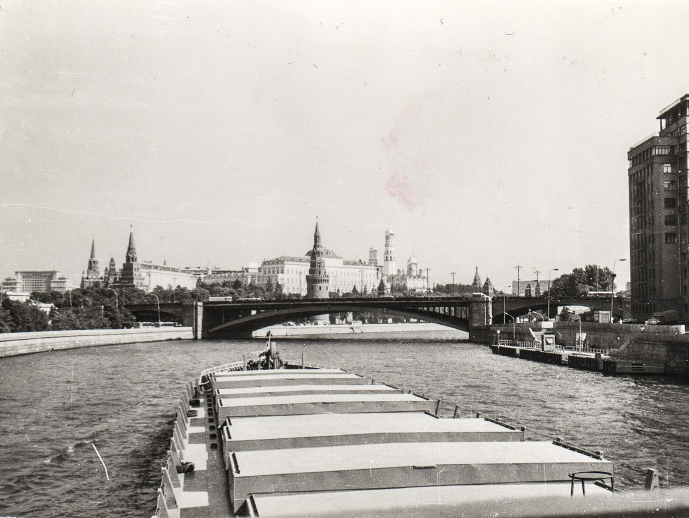{ width=50%, loading=lazy }
/// caption
Например
///

Фотографии получались совсем не художественные, но довольно чёткие для того времени – фотоаппарат всё-таки был простым и качественным.
Сделан по технологиям японской Konica.

Никаких кружков я не посещал, имел базовые представления о процессе проявки и печати, но и большого интереса к этому занятию тогда не испытывал.

## Стремление сохранить момент {#photo_family}

Спустя 20 лет, когда появилась семья и дочь начала радовать своими шалостями, появилось сильное желание сохранять эти возникающие моменты счастья.

Желание остановить момент очень распространённое, хотя бывают и исключение:

!!! quote "Цитата"

    Я вспоминаю, как в одной из ознакомительных поездок в Узбекистан, где мы собирались снимать фильм, который после так и не был нами сделан, он решил отдать трём пожилым мусульманам снятую для них фотографию.
    Старейший, бегло взглянув на снимок, вернул его со словами: „К чему останавливать время?“
    Эта необычная форма отказа была для нас настолько неожиданной, что лишила дара речи, ввергнув в состояние полнейшего удивления и невозможности что-либо сказать в ответ.

    Тарковский часто размышлял над подобным полётом „времени“ и желал только одного: остановить его – пусть даже и быстрым взглядом из моментальных полароидных изображений.

    ^^[Лев Наумов](https://www.livelib.ru/quote/48072508-italyanskie-marshruty-andreya-tarkovskogo-lev-naumov)^^

Как только появилось желание – [сразу было принято решение](index.md#right_now) купить фотоаппарат и надо было его выбрать.

## Выбор техники  {#equipment}

Наиболее частый вопрос, когда малознакомому человеку показываешь фотографию:

– О, клёво, а на что ты фотографировал?

На этот вопрос обычно хочется ответить:

– На голову и руки!

Конечно же, это не так.
Фотографируешь сердцем!
:-)

Ладно…
От техники многое зависит, но разговоры о ней почему-то напоминают рассуждения о погоде.
Говорят о ней чаще всего, но смысла в этих разговорах не так много.

Однако свой путь я также начал именно с вопроса выбора техники.

Сейчас можно проследить все этапы смены техники, так почему этого не сделать?

На сегодняшний день эта информация уже вряд ли будет полезной, но может у кого-то вызовет приятные ностальгические воспоминания.

## Фотокамера {#camera}

Как раз в то время в фотографическом мире происходил переломный момент массового перехода с фотоплёнки на цифровые матрицы.

Плёночные фотоаппараты ещё доминировали, а соответствующие им по качеству цифровые были довольно дорогими.
Но уже было совершенно очевидно, что плёнка – это уходящая эпоха.

Процесс обработки плёнки я представлял с детства и никакого ретро-трепета эта канитель у меня не вызывала.

В 2005-м году я думал прежде всего о практичности и удобстве.
Идея Полароида, на самом деле, была довольно близка.
Поэтому подбирал небольшую цифровую универсальную камеру с откидывающимся экранчиком.

Выбрал такую – [Casio EXP505](https://mobile-review.com/foto/camreview/casio-ex-p505.shtml).

И эта мыльница три года вполне устраивала меня качеством кадров.

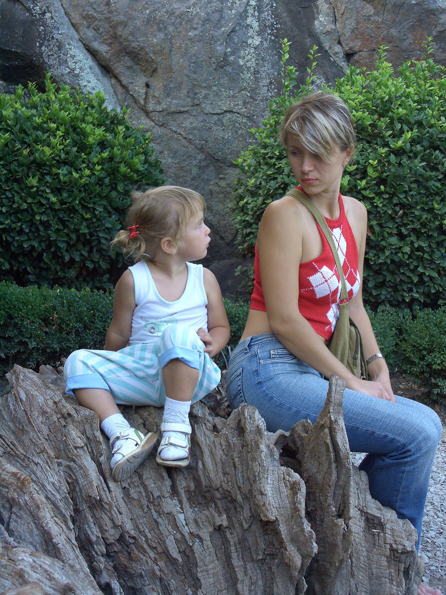{ width=75%, loading=lazy }
/// caption
Люди прекрасны
///

После полутора тысяч сделанных кадров, в которых практически невозможно создать глубину и многоплановость, мне категорически перестала нравиться картинка.
И я решился перейти на камеру со сменной оптикой.

В этот момент важно понимать только одно – когда купил несколько объективов, поменять марку фотоаппарата будет значительно сложнее.
Поэтому с этим выбором лучше не торопиться и подойти основательно.
Я это понимал и приступил к анализу.

Что выбрать – Canon, Nikon или Sony?

Кто-то выбирал по совету друзей, кто-то смотрел на стоимость и доступность объективов на рынке, а у меня был свой подход.

Sony тогда только-только купили технологии компании Konica Minolta и решили всерьёз потеснить на рынке двух лидеров – Canon и Nikon.

Дерзкие планы Sony мне-предпринимателю были намного ближе по духу, чем стабильность и доминирование мастодонтов.
Обычно интереснее ставить не на лидера, а на догоняющего.
У вторых номеров больше желания перегнать первого, чем у лидера критически оценить свои преимущества.

В то время перспективность Sony в борьбе за долю рынка обсуждали многие.
История эта обрастала слухами.

Например, обсуждались патенты Sony на изготовление [вогнутых цифровых матриц](https://image-sensors-world.blogspot.com/2012/10/sony-applies-for-curved-sensor-patent.html).

Идея состояла в том, чтобы использовать в фототехнике принципы построения человеческого глаза.

Глазное дно с рецепторами, воспринимающими освещённость, у нас же изогнутое.
А хрусталик представляет собой простейшую линзу, но с изменяемой кривизной.
И такой сравнительно простой принцип, разработанный эволюцией, позволяет нам быстро фокусироваться на объектах разной удалённости.

Сложность объективов во многом обусловлена необходимостью спроецировать без искажений неплоское изображение на изначально плоскую фотопластину или плёнку.
А матрицу в отличие от плёнки можно сделать и вогнутую – на что и был сделан патент.
Соответственно, теоретически самый качественный объектив будет представлять собой всего лишь одну линзу.

Но возникают и другие сложности – кривизна матрицы должна совпадать с кривизной линзы.
И тогда под каждую линзу надо менять кривизну матрицы.
И в общем это уже не имеет быстрого практического решения, но сама идея мне понравилась.

Можно лишь представить какой бы был скачок в качестве и удешевлении объективов, если бы этот подход был реализован.

Также в тот момент появились слухи о том, что матрицы Sony чрезвычайно качественные и Nikon втайне закупает их для своих флагманских камер.
[Слухи эти позднее подтвердились](https://photographybay.com/2012/09/03/nikon-d800-sensor-confirmed-as-made-by-sony/).

Все эти истории формировали ощущения от Sony как от инноваторов, которые знают как развивать устоявшийся рынок.
Поэтому мой внутренний предприниматель сделал ставку на них.

Так в 2008 году была куплена [Sony Alpha 350](https://en.wikipedia.org/wiki/Sony_Alpha_350).

Это была классическая зеркалка начального уровня.
Я быстро вкусил прелестей сменной оптики и с интересом следил за агрессивными анонсами новых моделей Sony.

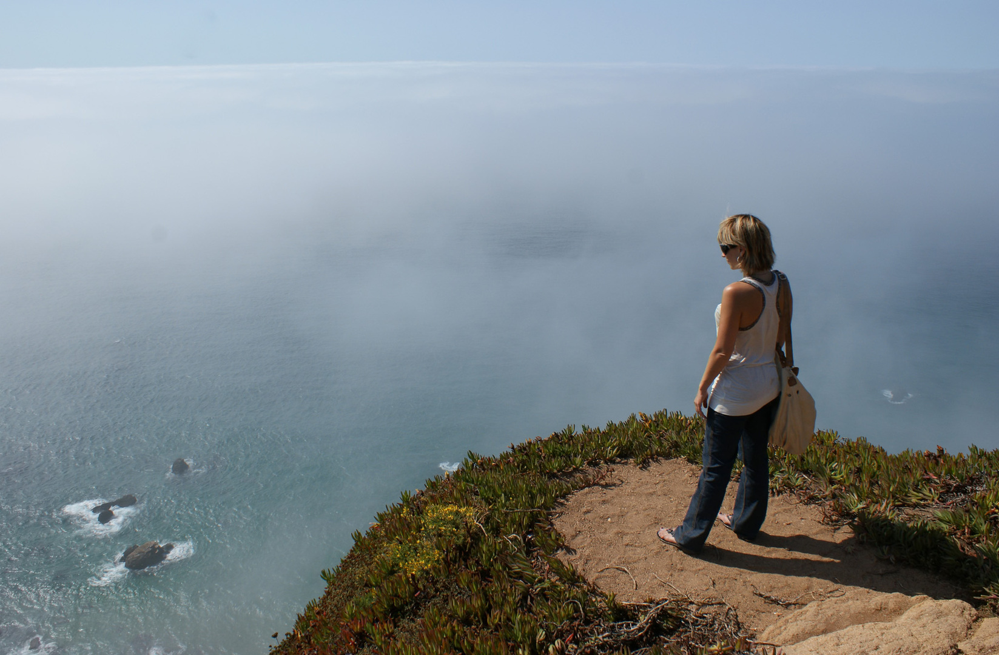{ loading=lazy }
/// caption
Появилась глубина кадра
///

В 2009-м я уже поменял Alpha 350 на более продвинутую зеркалку среднего уровня – [Sony Alpha 550](https://en.wikipedia.org/wiki/Sony_Alpha_550).

Лучшая чувствительность матрицы ISO давала меньше шума в темноте, но всё равно без вспышки не получалось сделать качественный снимок.
В рекламных материалах говорилось про более точную автофокусировку, но мазал я изрядно.

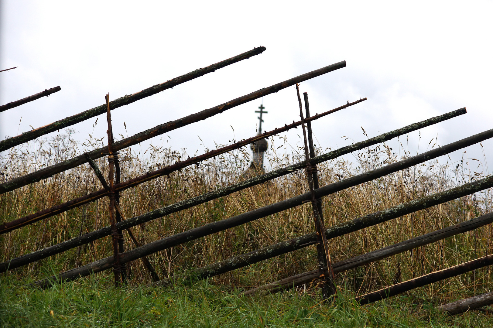{ loading=lazy }
/// caption
Больше детализация
///

В следующем же 2010 году опять заметный технологический прогресс – [Sony Alpha 55](https://en.wikipedia.org/wiki/Sony_Alpha_55).

Новая технология с полупрозрачным зеркалом, которое теперь не двигалось во время экспозиции кадра.
Механика заметно упростилась и, значит, стала надёжнее, а также камера стала легче и компактнее.
Заметно улучшили автофокус и чувствительность матрицы ISO.
В результате качество изображения технически выросло, но эмоционального восприятия моих фотографий не прибавлялось…
:-)

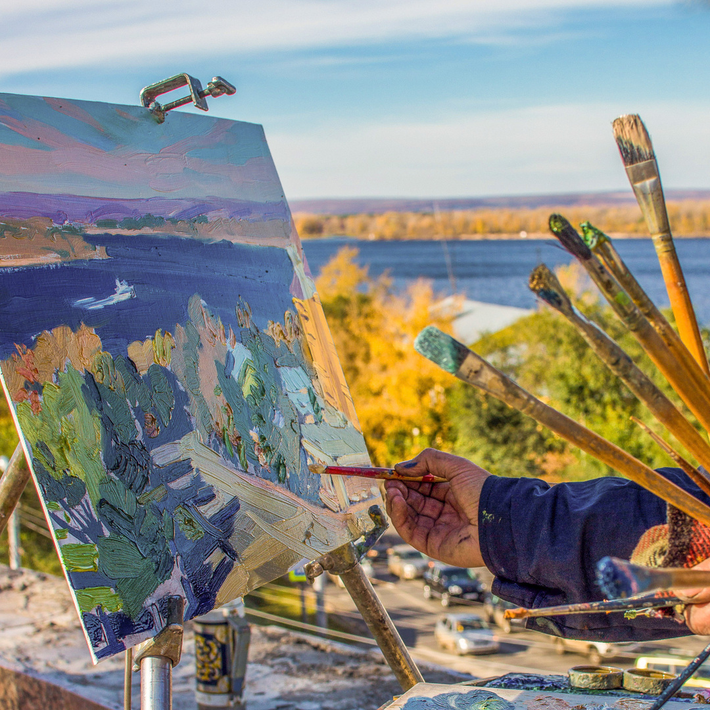{ loading=lazy }
/// caption
Камера теперь всегда с собой
///

## Обучение {#study}

Это обстоятельство подтолкнуло меня записаться и пройти [базовый курс в Школе Фотографии](https://fotoshkola.net/).
Излишне говорить, что с этого шага стоило бы начать!
:-)

По накатанной уже в следующем 2011 год я покупаю [Sony Alpha 77](https://en.wikipedia.org/wiki/Sony_SLT-A77) и продаю предыдущую камеру.

Первый раз от новинки испытал жуткое расстройство.

Каждая новая камера до этого давала улучшение качества снимков, а тут…
Незначительные, я бы сказал, незаметные улучшения в снимках, хотя камера была значительно дороже и тяжелее предыдущей.

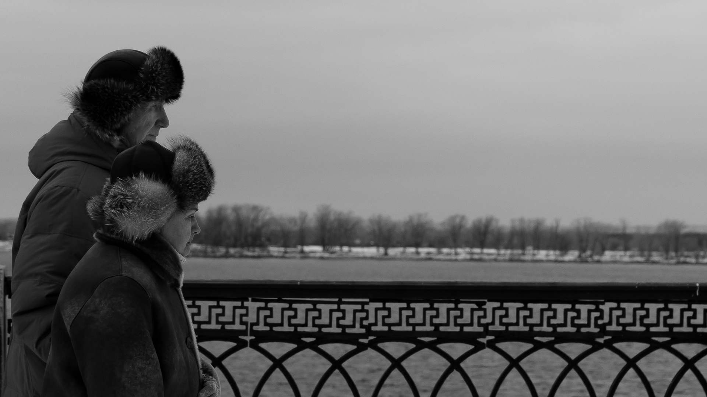{ loading=lazy }
/// caption
Всё уныло и дело не в технике
///

Обучение в школе напомнило основы, которые я представлял до этого, но на прогресс в снимках, на мой взгляд, не повлияло.

Куда глубже меня затронула [очень достойная книга «Passionate Photographer»](https://www.ozon.ru/product/the-passionate-photographer-dream-it-be-it-1383528294/?at=z6tOYvE7xcVOql7VH7NQGyyiwlA90vcp6RVmEULEYJyy#section-description--offset-140--offset-80), в которой кратко и доходчиво донесена основная мысль: чтобы стать хорошим фотографом, нужно постоянно делать фотографии.
Сотни тысяч фотографий.

[Правило 10 000 часов](p2-150-absurd.md#first_musical_steps), которые необходимо инвестировать, работает как в музыке, так и в живописи, в фотографии и других видах искусства.

Мозг нужно тренировать на больших количествах снимков, чтобы начинать инстинктивно чувствовать нюансы.

На тот момент я это уже понимал, и книга лишь укрепила меня в правильности пути.

Видимо, там же я вычитал, что если хочется чётких снимков, то в нагрузку к фотоаппарату придётся таскать с собой ещё и штатив.
[Сплошное Преодоление](p2-180-sharedgoals.md#overcoming).

## Полный кадр {#full_frame}

А ещё эта неудовлетворённость камерой подтолкнула меня к радикальному решению зреющего вопроса: а не настала ли пора переходить на полный кадр?

Настала.

Sony очень кстати в 2012-м анонсирует обновление своего флагмана.
A77 был продан практически новым, и я перешёл на первый серьёзный фотоаппарат – [Sony Alpha 99](https://en.wikipedia.org/wiki/Sony_SLT-A99).

Сразу планировалась полная перезагрузка – заодно с камерой надо было поменять все объективы для урезанной (crop) матрицы на полнокадровые.

И вот когда на полной матрице с соответствующим объективом я начал делать снимки камерой, закрепленной на штативе, у меня отпали все вопросы по качеству фотографий.

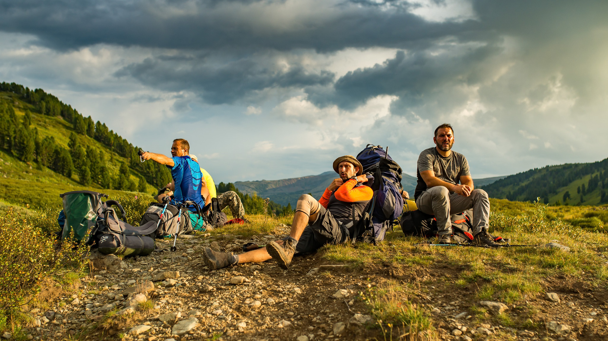{ loading=lazy }
/// caption
А таскать с собой эти килограммы порой очень непросто
///

Вероятно, если бы я прочитал эту книгу и обзавёлся штативом раньше, было бы меньше метаний.
Но эта камера впервые продержалась у меня не год, а целых 5 лет!
Очень хороший был фотоаппарат.

Но прогресс не стоит на месте и Sony анонсируют новый прогрессивный байонет E-Mount для беззеркальных фотоаппаратов.
Для которого будут ещё более компактные и качественные камеры и объективы.
Опять предстоит смена оптики.

В 2017-м беру [Sony Alpha 7R III](https://en.wikipedia.org/wiki/Sony_α7R_III).

Камера – абсолютный ТОП!
И что удивительно для скоротечного мира цифровых технологий – актуальна спустя 8 лет и используется до сих пор.

Качество снимков на этой камере избыточно.
Фотографии такого разрешения могут потребоваться в профессиональной студийной работе, но моё зрение уже не позволяет разглядеть разницу на отпечатке формата A4, например.

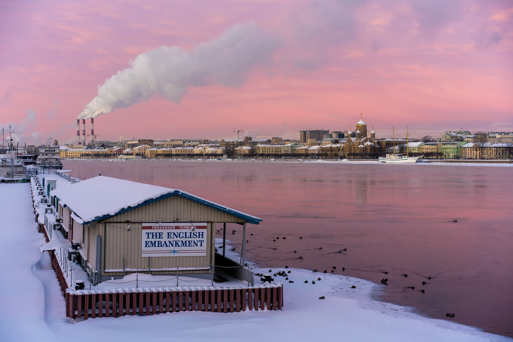{ loading=lazy }
/// caption
Про технику уже не думаешь…
///

Поэтому в 2022-м я спокойно сделал downgrade до новой модели в более бюджетном сегменте – [Sony Alpha 7 IV](https://en.wikipedia.org/wiki/Sony_α7_IV).

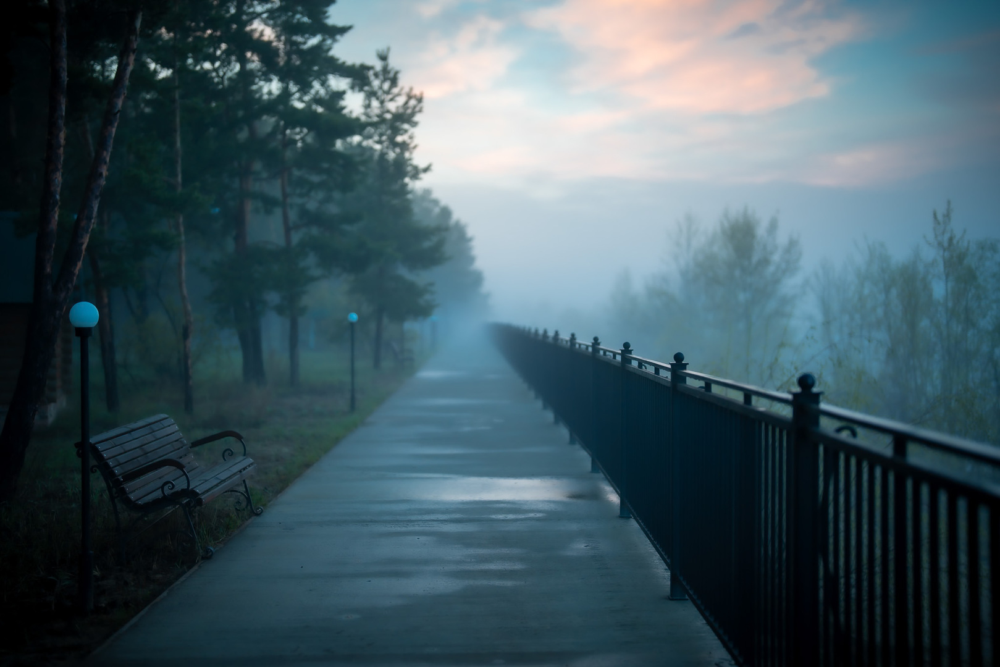{ loading=lazy }
/// caption
Только про ощущение момента
///

Если не произойдёт ничего «из ряда вон» – в 2026-м году буду думать о следующей новинке в этом же сегменте.

## Объективы {#lenses}

А с объективами, после того как была выбрана компания-производитель, было проще.

Вместе с первой зеркалкой был куплен так называемый китОвый, универсальный зум объектив.
Китовый (kit) означает, что он шёл с фотоаппаратом впридачу.
Обычно они недорогие и не дают каких-либо особенных визуальных преимуществ.

Но объективы теперь можно менять и постоянно улучшать!

Как разобраться среди многообразия вариантов, какой объектив будет самой правильной покупкой?

Поможет [любимый цифровой подход](p2-140-digital.md).

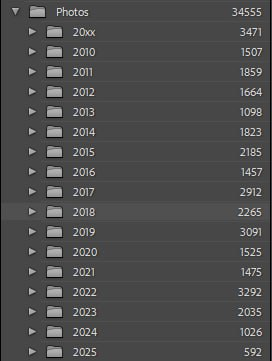{ loading=lazy }
/// caption
Сколько фотографий всего?
///

Когда во время съёмки подкручиваешь колесо фокусного расстояния зум объектива, его значение сохраняется в свойствах снимка и копируется в файл при экспорте.

Когда сделано множество фотографий, появляется возможность проанализировать, какое фокусное расстояние использовалось чаще всего.

Приобретение объектива с лучшими характеристиками по чёткости и светосиле (количеству пропускаемого через стёкла света) для фокусного расстояния, которое встречается чаще всего – верный способ максимально повысить удовлетворение от снимков.

Опять же – [подход с интегралом на базе количественной модели](p1-010-happiness.md#happiness_model).

Поначалу мне хотелось фотографировать пейзажи и простор мест, куда меня занесло.
По этой же причине я стремился засунуть в кадр как можно больше пространства.
Поэтому первыми покупались широкоугольные объективы.

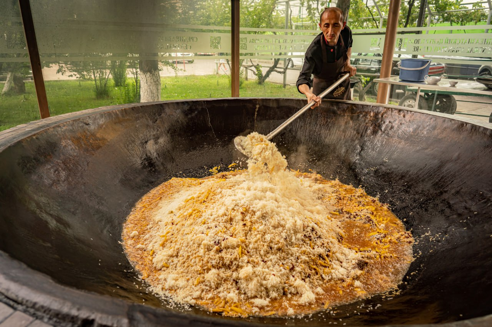{ loading=lazy }
/// caption
Шире угол – больше плова
///

Когда я «наелся» пловом, пейзажами и архитектурой, тогда решил попробовать поснимать на телеобъектив, но дело не пошло.
Телевик чаще валялся без дела.

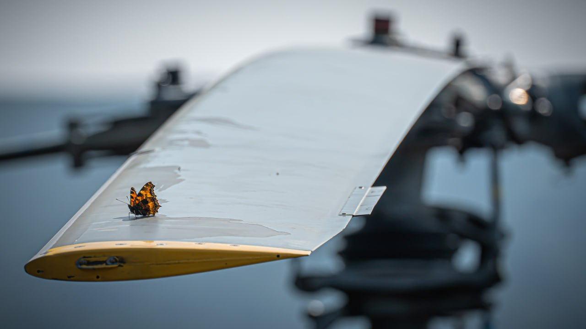{ width=75%, loading=lazy }
/// caption
Два пепелаца в сжатой перспективе
///

А когда осознал, что чаще всего мне хочется фиксировать картинку счастливого момента моей жизни, как я её вижу, то есть с ракурсом и фокусным расстоянием, приблизительно соответствующим человеческому взгляду – 50 миллиметров, тогда качественный полтинник или «полтос» практически перестал покидать мой фотоаппарат.

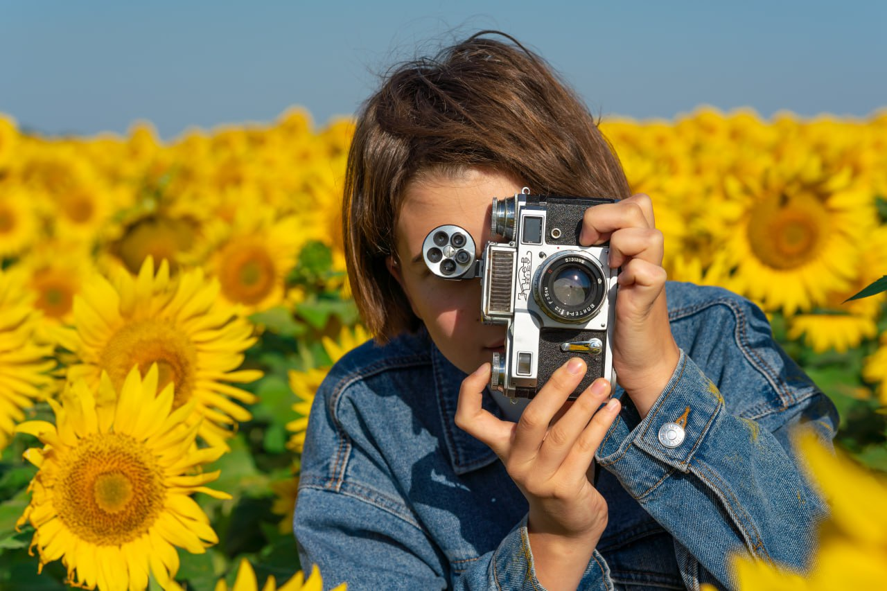{ loading=lazy }
/// caption
Стандартно и качественно
///

Не самый большой и тяжёлый, чтобы его можно было всегда носить с собой.
Стандартно и качественно.
Мой любимый вариант.

В конце концов я обзавёлся самым светлым полтинником, что есть на рынке – f/1.2.

Это позволяет снимать без вспышки в полутемных помещениях.

### Взгляд {#eyes}

Но самое для меня важное – минимальная глубина резкости, которая позволяет сделать максимальный акцент на зрачках глаз.

Ведь глаза, как известно, зеркало души.

Это неторопливое погружение в душу через снимок зачастую завораживает.

Есть мнение, что самой яркой фотографией всех времён и народов является [портрет афганской девочки](https://ru.wikipedia.org/wiki/Шарбат_Гула), сделанный Стивом Маккарри.
Взгляд девочки лучше всех слов передаёт страдания народа.

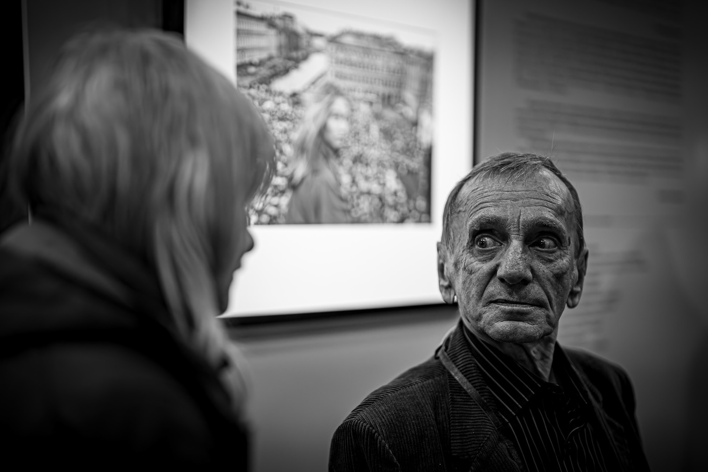{ loading=lazy }
/// caption
Неслучайный взгляд на выставке Сергея Подгоркова
///

[Центральной фотографией выставки Сергея Подгоркова была фотография девушки](https://gorod-812.ru/pojmavshemu-moment/), сделанная на митингах времён августовского путча 1991 года в Санкт-Петербурге.
На заднем плане снимка можно видеть Синий мост и толпу, но взгляд девушки приковывает внимание и несёт 99% смысла.

По этим причинам подавляющее количество кадров последних лет сделано стандартным портретником.

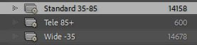{ loading=lazy }
/// caption
Спустя 18 лет и 30 тысяч фотографий статистика такая
///

Глядя на мою статистику надо учитывать, что в первые годы «выживали» в среднем 10% от сделанных фотографий.
А последнее время конверсия стремится к 1%.

Таким образом мной сделано порядка миллиона фотографий и за это время натренировалась какая-никакая персональная «нейронка».

## Пейзажи, Архитектура {#landscapes}

На первой мыльнице снимать что-либо многоплановое и сложное не получалось.
А когда есть определённая насмотренность чужих фотографий и ожидания высоки – даже желания не возникало экспериментировать.
Поэтому в мыльнице использовал банальный подход размещение объекта съёмки в центр.

Point and shoot.

Поначалу для семейной фотографии большего и не требовалось и в этом формате было снято 90% кадров первых лет.

Фотоаппарат обычно берёшь с собой в поездки…
И когда планируешь маршрут, то заранее представляешь, что там можно посмотреть.

[Галерея путешествий](https://adobe.ly/4mEfE2J)

Когда обзавёлся качественной оптикой начинают возникать соблазны забраться ещё дальше и встать пораньше, чтобы в восход запечатлеть красоту неземную.
Уже сам момент появления первых лучей солнца неизменно поднимает настроение.

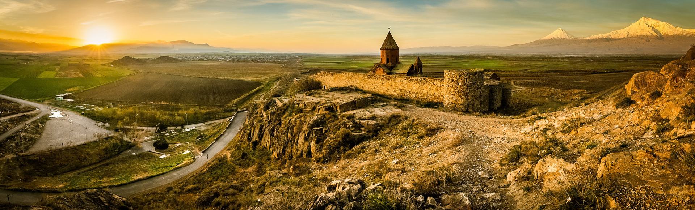{ loading=lazy }
/// caption
Восход у подножья горы Арарат
///

Основная трудность проснуться затемно и до восхода солнца дотащить до места съёмки штатив с фотоаппаратурой.
Ну или найти такую возможность и ракурс во время вечернего «золотого часа».

Так в фотографиях из путешествий стали появляться пейзажи.

[Галерея пейзажей](https://adobe.ly/4jz19KG)

При этом банальных правил третей мне обычно хватало, чтобы построить простенькую композицию.
А наличие широкоугольного объектива позволяло добавлять на передний план какие-то интересные объекты.

Красиво, гармонично, но ярких эмоций в этих снимках маловато.

## Люди – Друзья, Концерты, Театры {#people}

Понятно, что больше всего этих эмоций я получаю через отношения с людьми.

И фотографий с людьми у меня в десятки раз больше, чем пейзажей.
Хотя я обычно их не публикую.

Прохожие с улицы меня не очень интересуют.
Хотя иногда я не удерживаюсь и фотографирую незнакомцев.

Но отношусь к этому как к полезному упражнению создания доверительных отношений с чистого листа.
Делаю это с улыбкой и предлагаю обменяться контактами, чтобы выслать фотографию позже.
Как Печкин с фоторужьём.

Мне эти новые знакомства ни к чему, но для ребят помоложе это может быть великолепным поводом для знакомства с продолжением.

Хотя обычно вторгаться в чужое пространство не очень хочется, и эмоций от снимка намного больше с людьми, которые с тобой как-то связаны.

### Друзья {#friends}

Но когда получилось удачно запечатлеть близкого человека и ему этот снимок нравится тоже – размеры счастья растут в двойном, а то и в тройном размере.

Множество раз слышал в процессе совместного просмотра снимков, что мои фотографии самые яркие! :-)

Это, конечно же, очень приятно, но при этом я прекрасно понимаю, что [не в моем Таланте основная причина](p2-120-school.md#psychology_of_unconscious).

Человек в кадре был счастлив в тот момент – происходит возвращение в ту ситуацию, эмоции подкатывают – это благодатная почва для яркого восприятия.
Я также был счастлив – как минимум – мне получилось поймать мгновение и угадать с визуальным акцентом во время продолжительной обработки фотографий.

Но самое важное – в результате этих счастливых совпадений и потраченных усилий наши отношения подсветились эмоциональными красками.

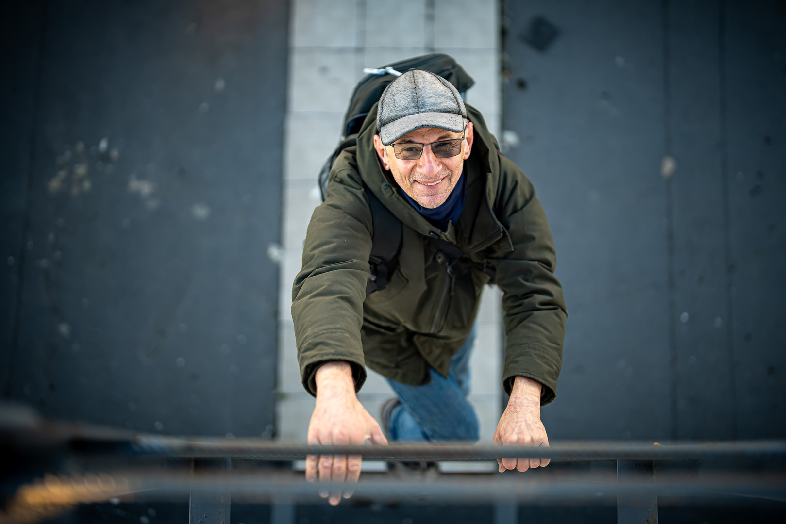{ loading=lazy }
/// caption
Фотография друга
///

Иногда архивы писем и фотоальбомы становились спасением отношений – как в истории Веры Алентовой и Владимира Меньшова:

!!! quote "Цитата"

    А позже, уже в Москве, Володя готовил статью о Ромме и попросил меня о помощи: поискать в нашей с ним переписке фрагменты, где он пишет о Михаиле Ильиче.
    Володе нужно было восстановить какие-то подробности, он сказал, что ему это очень важно и очень нужно и что дело срочное.
    Все письма хранились у меня, и я ответила, что поищу.
    Стала искать, перечитывая письма…
    И погрузилась в то время, а с ним и в те чувства нашей такой юной, чистой и горячей любви.
    И всё вспомнилось: все-все её детали, и смешные, и глупые, и трогательные, и горькие.
    Я стала плакать и чувствовала, как со слезами оттаивает мое заледеневшее сердце.
    Мне стало жаль нашей любви – такой необъятной и такой необыкновенной…

    ^^[Вера Алентова](https://www.livelib.ru/quote/48190393-vsjo-ne-sluchajno-vera-alentova)^^

Фотографий членов семьи в моём архиве подавляющее большинство.
Наверное, как и у большинства фотографов-любителей.

[Хранение переписки и семейных фотографий – мощнейший фундамент](p2-140-digital.md#family_stories).

Понятно, что фотография друга или родственника у постороннего незнакомца не вызовет заметных эмоций.

И чтобы сделать кадр, который неизменно будет вызывать резонанс в душе у широкой публики нужны или выдающееся мастерство, или невероятная удача, или уникальное место.

А лучше и то, и другое, и третье! :-)

### Походы {#hikes}

Самые глубокие эмоции испытываешь во время совместного [Преодоления](p2-180-sharedgoals.md#overcoming).

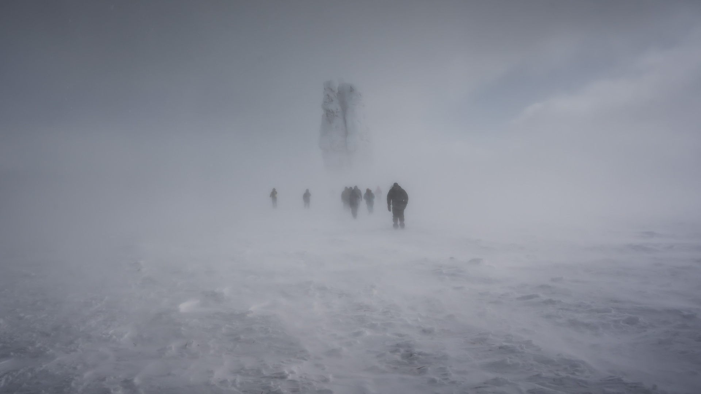{ loading=lazy }
/// caption
Преодоление
///

Такие моменты часто возникают во время движения к нетронутым цивилизацией местам.
[Туризм, на мой взгляд, идеальный вариант такой активности](p2-140-digital.md#health_activity).

Отдых после нагрузок, помноженный на красоту окружающей природы, невероятно поднимают эмоциональный тон.

Но для того, чтобы ходить во все эти походы, нужно иметь [Шило в одном месте](p2-180-sharedgoals.md#ants_in_your_pants) и [достаточное количество жизненных сил](p1-040-unhappiness.md#battery_aziz).

[Походная галерея](https://adobe.ly/3FJTiMm)

### Концерты {#concerts}

Но ведь сильные эмоции испытываешь не только через преодоление трудностей.

Очень хорошо понимаю, [как энергичная музыка может запустить в резонанс внутренний эмоциональный мотор](p2-150-absurd.md#to_the_extreme).

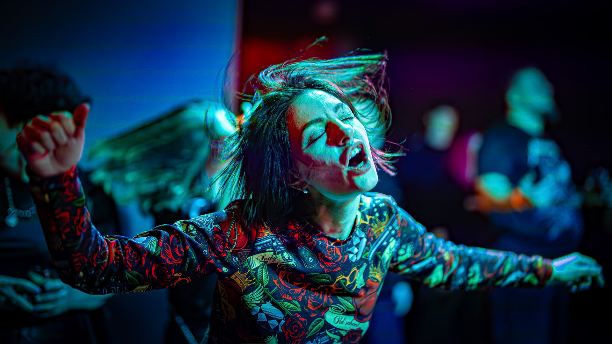{ loading=lazy }
/// caption
На концерте
///

И на [концертах любимых музыкантов](p2-150-absurd.md#heavy_music_and_happiness) в близком контакте с исполнителями и поклонниками эмоций кратно больше.

[Концертная галерея](https://adobe.ly/3T5NVu0)

Поклонники и музыканты радуются, когда находят свои фотографии с концертов.

### Спектакли {#theatre}

Но опять же, сильные эмоции совсем необязательно случаются в экстремально громком и ярком окружении.

Глубочайшие переживания могут происходить в полнейшей тишине.
Например, на камерном спектакле.

И каждый xref:p1-010-happiness.adoc#moments_of_happiness[воспринимает происходящее на сцене через свои каналы].
Кто-то обращает внимание прежде всего на игру актёров, кто-то на музыку, кто-то на свет и декорации.

И зачастую реакция зрителей говорит о спектакле больше, чем фотографии самих актёров.

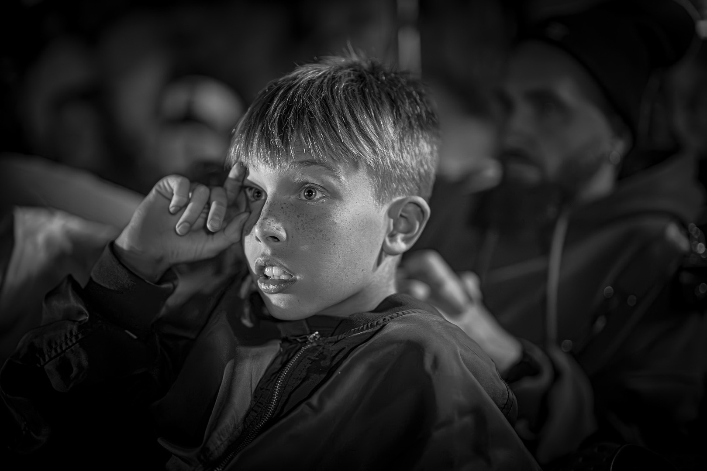{ loading=lazy }
/// caption
Зрители
///

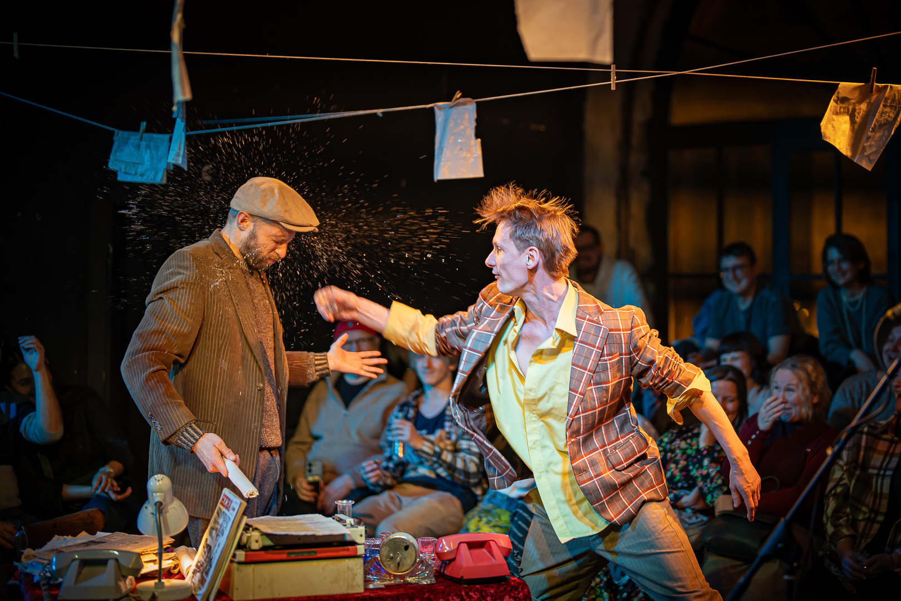{ loading=lazy }
/// caption
Актёры
///

Возможность сходить на понравившийся спектакль второй раз с фотоаппаратом и получить разрешение на съёмку – великая удача!

[Театральная галерея](https://adobe.ly/3T5kDf4)

## Обработка фотографий {#postprocessing}

[Любимое программирование](p1-020-call.md#dream_job) предполагает просиживание круглыми сутками за компьютером, придумывая всякие интересные штуки.
Действительно, это наиболее притягательный образ времяпрепровождения, хотя далеко [не самый полезный для здоровья](p2-140-digital.md#health).

В процессе создания фотографий мне больше всего нравится этап их обработки перед публикацией.
Для многих фотографов это звучит, как минимум, странно, но в моём случае это так.

!!! note ""

    Разное отношение к этапам творческого процесса можно проследить и в кинематографе. 
    Из [книги о Тарковском узнал](https://www.livelib.ru/quote/48196756-italyanskie-marshruty-andreya-tarkovskogo-lev-naumov), что Эйзенштейн уделял монтажу больше внимания, чем самому процессу съёмки.
    Разработанный Эйзенштейном метод – [монтаж аттракционов](https://ru.wikipedia.org/wiki/Монтаж_аттракционов), во многом повлиял на мировой кинематограф, а Андрей Арсеньевич совсем не разделял такого подхода и формировал картинку сразу в видоискателе кинокамеры.

После поездки подключаешь камеру к компьютеру и, даже не копируя все фотографии на диск, а в режиме предпросмотра Adobe Lightroom, отбираешь удачные снимки.
Из тысячи снимков может быть выбрана лишь сотня.

А дальше не надо никуда торопиться.

Отобранный материал может отлёживаться месяцами.
Зачастую такая пауза помогает разглядеть действительно ценные моменты и избавиться от проходных снимков.
Можно дождаться дождливой погоды, когда особенно приятно налить чашку вкусного чая, устроиться поудобнее и начать творить.

Обработка фотографий – творческий процесс.

Вспоминаешь собственные ощущения от того момента.
Возможно даже звуки и запахи, которых не будет на фотографии.
И через визуальные акценты стараешься их воссоздать.
Оттенок или фильтр, который усилил восприятие, может быть применён ко всем снимкам в серии.

Обычно хочется сделать объект, на который был направлен взгляд во время съёмки, более заметным.
Делаю его светлым и чётким, приглушаю маловажные детали.

В длительном процессе обработки фотографий не торопясь сам проживаю моменты снова и снова.
Очень мне нравится это умиротворяющее занятие.
Сродни художеству.
Даром, что ли, [предок был иконописец](p2-140-digital.md#family_stories)?

## Беседы с фотографами {#interview}

Готовился к написанию этой главы про фотографию в [контексте количественной модели счастья](p2-120-school.md#brief_happiness_model) несколько месяцев.
В это время пересекался с несколькими фотографами и заводил с ними беседы на эту же тему.
Вот некоторые выдержки.

### Павел Сульдин {#suldin}

С Павлом мы познакомились несколько десятков лет назад, когда ни он, ни я ещё не имели отношения к фотографии.
И если для меня фотография сейчас лишь увлечение, то для Павла это работа, которая обеспечивает основной доход.

Сейчас у него [известная в Самаре фотостудия](https://vk.com/studio_times) и [признание профессионального уровня](https://vk.com/p.suldin).

У Паши есть прекрасная традиция – приглашать друзей к себе в гости на философские беседы и параллельно делать фотографии.

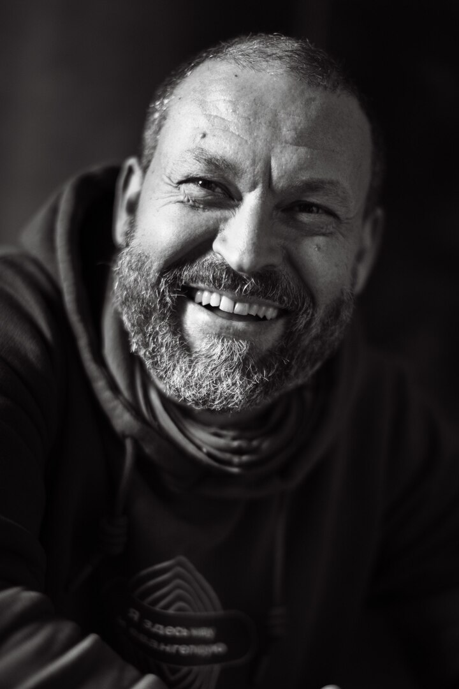{ width=75%, loading=lazy }
/// caption
Паша фотографировал меня
///

В своей студии, с отличным светом, с фотоаппаратом в одной руке и бокалом приятного напитка в другой.

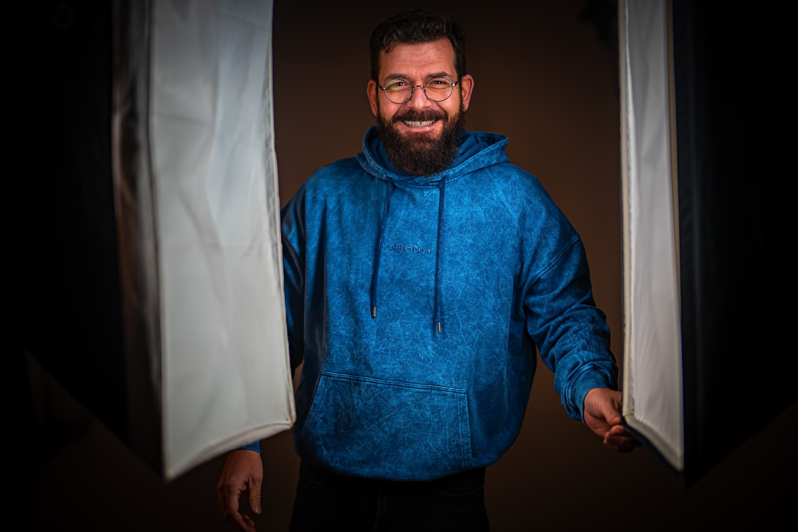{ loading=lazy }
/// caption
А я фотографировал Пашу
///

И, вероятно, наличие двух фотоаппаратов в студии отличало нашу с ним беседу от других.

Мы провели несколько часов за приятной беседой, которая однозначно запомнилась.

Любимый жанр фотографии у Павла – мужской портрет.
Паша любит ловить естественные эмоции, которые отражают характер человека.

Он прекрасно понимает, каким должен быть свет и не разменивается на компромиссы.
Поэтому в студии высоченные потолки и качественное световое оборудование.

Профессиональный свет прорисовывает лицо и выявляет эмоцию так, как не позволяет естественное освещение.
Вне студии добиться такого же результата крайне трудно!

Он выжал из бизнеса, который [совпадает с его Призванием](p1-020-call.md#follow_your_calling), максимум того, что можно достичь в нашем городе.

Павел постоянно балансирует, следя за требованиями и течениями рынка в поисках возможности заниматься любимой фотографией и развиваться.
Совмещение увлечения с арендой помещения или дорогостоящей техники – отличный повод держаться на плаву.

Я и сам все свои объективы, с которыми жаль расставаться насовсем, но которые могут понадобиться другим, [сдал в аренду в Modjo Films – пользуйтесь](https://t.me/modjo_rental/88)!

#### Количественная модель оценки фотографии  {#photo_quality_model}

Из разговора запомнился простой и запоминающийся подход к оценке фотографий для развития своих навыков.
Вероятно я о нём мог где-то читать раньше, но Паша очень доходчиво, на пальцах его рассказал.

Смотрим на фотографию и отвечаем на 3 вопроса.
Каждый положительный ответ даёт один балл.

1. Соответствие техническим характеристикам – экспозиция без пересвета, резкость на нужном объекте, нет пятен и шума;
1. Композиция кадра – изображение гармонично, есть визуальный ритм, используются правила третей или золотого сечения, соблюдены отступы и так далее;
1. Многоплановость – есть пространство для изучения кадра взглядом, присутствуют объекты на переднем и заднем плане, чувствуется глубина, перспектива.

В сумме каждый пункт даёт 3 балла удовлетворительного снимка.

Но если глядя на фотографию возникают заметные эмоции – это сразу ещё 3 балла, что составляет половина успеха.

Понятно, что этот пункт будет субъективным.

Родители сразу же закивают на снимок своего ребёнка, тогда как посторонний человек лишь пожмёт плечами.
Портрет Брюса Виллиса наберёт намного больше баллов среди опрашиваемых, чем точно такой же снимок другого лысого, улыбающегося мужчины.

В сумме получается 6, ну или 5 с плюсом.

Эта количественная [модель](p2-140-digital.md#art) для оценки фотографий нужна прежде всего [для ощущения движения в собственном развитии](p2-140-digital.md#continual_improvement).

Понятно, что этот подход будет нужен до тех пор, пока не натренировалась собственная фотографическая «нейронка».

Когда потрачены 10 тысяч часов с фотоаппаратом и привычка выработана, эти оценки проставляются инстинктивно:

- В моём архиве большинство снимков имеет оценку 3 – яркие эмоции вызывают очень редкие снимки, а к чему придраться душниле – всегда найдётся;
- Единички или двойки используются для сохранения истории;
- Четвёрки намечают направления желаемого развития в фотографии;
- Пятёрки редки, входят в отобранные галереи и периодически пересматриваются.

### Евгений Шестаков {#shestakov}

С [Женей](https://vk.com/id4846145) мы познакомились во время написания этой главы, погружаясь в «Апрельские тезисы».
Под таким кодовым названием скрывался авантюрный поход на плавдоме.

Тут, видимо, надо дать некоторые пояснения.

Плавдом – это дом, который плавает.
Ну, это очевидно.
Хотя правильнее – ходит.
Извините.

В нём есть несколько кают, кухня, зал, который моряки называют кают-компанией, с камином и телевизором, баня, обогреваемые полы, два санузла, танцпол и … твердотопливный котёл.
Наверняка я что-то забыл, но это не важно.
Важно, что это не яхта, а дом.

А авантюрность этого путешествия от Самары до Свияжска заключалась в том, что на момент выхода из точки отправления ещё не была открыта навигация.
Это означает, что на реке ещё не установлены буи, не горят створы и шлюзы штатно тоже не работают.
Первозданные просторы, как во время стояния Ивана Грозного под Казанью.
Река пустая – никого вокруг.
Сказка!

И вот в одном доме на пустой реке оказалось два фотографа.
Конечно же, мы разговорились, и мне было любопытно прочувствовать специфику другого подхода к съёмке.

[Тут можно познакомиться](https://t.me/vodoplav_adventures) с этим волшебным форматом неторопливого и комфортного перемещения.
Большинство фотографий и видео от Евгения, но есть и [моя подборка](https://t.me/vodoplav_adventures/212).

Мотивы в фотографии у нас, как мне кажется, совпали.
И он, и я начали брать фотоаппарат с собой на мероприятия, чтобы всегда была возможность заниматься тем, что нравится.

Человек с серьёзным фотоаппаратом в руках на любом событии выпадает из целевой аудитории гостей, и его не воспринимают как мишень, которую надо вовлекать в культурную программу.
Фотограф входит в категорию обслуживающего персонала и не представляет интереса.
И это [спасение для интроверта](p1-020-call.md#introvert_extravert), которому [нужен план отхода в любой ситуации](p1-020-call.md#judging_perception)!

И если для меня это способ не привлекать внимания, то Евгений Шестаков довёл этот навык до профессии, фотографируя сами мероприятия.
С какого-то момента мероприятия стали преимущественно спортивные.

И он настолько целенаправленно этим занимается, что, похоже, полностью узурпировал эту тему в нашем городе.
Во всяком случае, его группа ВКонтакте называется [Самара Спорт-Фото](https://vk.com/samarasportfoto).

И в этом совмещении спорта с фотографией много плюсов.

Необходимо самому погружаться в специфику вида спорта, который снимаешь.
На кроссах и гонках требуется самому знать трассу и уметь быстро перемещаться между ключевыми точками, используя тот же способ, что и спортсмены.

Это требует подготовки и самого держит в форме.
И эта форма настолько хороша, что порой возникают моменты, когда фотограф бежит быстрее чем спортсмен, но при этом ещё фотографирует происходящее.
Очень забавно!
:-)

В какой-то момент это занятие обрело коммерческую форму и начало развиваться.

К Евгению подключились его сыновья и тоже начали заниматься фотографией.

А это уже стало прекрасным способом для них начать зарабатывать на карманные расходы, при этом занимаясь спортом и творчески развиваясь.

Такой подход в любимом занятии вызывает здоровую такую зависть!

А через полгода я вдруг осознал, что на плавдоме было как минимум ТРИ фотографа и известный художник.
Список расширился благодаря создателю плавдома.

Многие годы [Александр](p2-100-authors.md#BerdnikovSamara) строит не просто лодку, а дом на воде!

Что само по себе уже [является залогом продолжительного состояния счастья](p1-020-call.md#experience_of_happiness)!
:-)

И эта история тянет на целую книгу, а тут всего лишь заметка про фотографию и художников.

### Волга глазами Климта {#volga_klimt}

*Автор текста: [Александр Бердников](p2-100-authors.md#BerdnikovSamara)*

Фотографией я занимался со школьных лет.
Мама подарила мне её.

У мамы был крутой [Зенит-Е](https://ru.wikipedia.org/wiki/Зенит-Е) (с экспонометром)!  
А я стал обладателем [Смены-8М](https://ru.wikipedia.org/wiki/Смена-8М).
Потом и [Зенита 122 с объективом Гелиос](https://ru.wikipedia.org/wiki/Зенит-122).
Прыгающая диафрагма, TTL — это просто космические технологии, я их ощутил, испытал и применил в полной мере.
У одноклассников в альбомах остались мои черно-белые фотки.

Позже, уже «на свои» я себе позволил [Nikon F90](https://en.wikipedia.org/wiki/Nikon_F90).
С каким-то китовым объективом, уже не помню.
Zoom-объектив перевернул моё представление о возможностях фотографии.
Потом наступила цифровая эпоха.
[Canon 350D](https://en.wikipedia.org/wiki/Canon_EOS_350D), [Canon 6D](https://en.wikipedia.org/wiki/Canon_EOS_6D), несколько L-объективов.

<!-- Есть хорошие, с "2" или даже "3" за эмоции. -->

Экспозиция, композиция, глубина резкости и даже зуммирование во время экспозиции - это я всё изучал «в поле», никакого специального образования или курсов на эту тему у меня нет.
Просто я много фоткал – любил это делать.

Со всех событий все ждали именно мои фотки.
Мне даже пришлось году примерно в 2005 «изобрести» Instagram, чтобы была возможность делиться избранными фотками с разными избранными людьми.
Но реализовать не успел - меня опередили!
:-)

В доцифровую эпоху черно-белое печатал всегда сам.
Увеличитель УПА, ванная комната с красным фонарём, ночная романтика…
Знаете сколько есть творчества даже после того, как негатив уже готов?
Если бы у нас был совмещённый санузел - ничего бы не было.

Когда появился телефон Nokia с камерой - я был в шоке и в полном непонимании.
Тупик и абсолютно бесполезная вещь.

Помню, что, приобретая Canon 350D c 8 мегапикселями, я вычислил, что для достижения плёночного качества нужно примерно 90 мегапикселей, что я посчитал недостижимым.

На свой Canon 6D с 16-35, 24-70 и 28-300 (все "L" за какие-то тыщи $) я фоткал ещё года 2 или 3 назад.

Это всё здорово и круто.
И у этого большой творческий потенциал.
Но время выделить не получается.

И я нашёл более короткий путь к экстазу от конечного изображения.
Телефончик даёт стабильные "2" и даже "3" [по технической шкале](#photo_quality_model).
И телефончик всегда под рукой.
Признаю, был не прав, когда думал про тупик с камерой телефона.
Ведь картинка в итоге нужна в телефончике, чтоб поделиться ей.

Поэтому в итоге остался телефон + ИИ.

Потому что ИИ помогает придать фотке моё видение.
Не сразу, не быстро, и не легко - но оно того стоит.

Вообще, что живёт вечно?
Какие цели за пределами жизни одного конкретного человека?
Научные открытия/достижения и искусство.
Что ещё?
Не знаю.

Изобразительное искусство все оцифровано.
Фотки теперь тоже - исключительно цифровые.

Кроме подаренной моей мамой фотографии у меня есть ещё один бесценный подарок, который мне бабушка и дедушка преподнесли, – это Волга.
Волга – моя.
Такой её нет ни у кого больше.
Обладая таким богатством, я не могу им не делиться.

Раньше я дарил исключительно мою Волгу.
Просто мои фотографии, напечатанные на пигментном Epson А3+ (он уже умер от долгого ожидания очередного шедевра) и вставленные в рамку.
Около десятка таких произведений где-то есть.
Знаю, что некоторые до сих пор радуют глаз.

Но мои фото - это просто фиксация.
Пусть с любовью, но без воображения.
Я представил, что получилось бы из вида Моей Волги через воображение какого-нибудь великого художника, положенное на холст в его технике.
Благо, всё оцифровано.
Инструменты в виде разных нейросетей появились.
Преобразовать фото в изображение в чьём-то стиле - минутное дело.

Остаётся добавить воображения.
Вот с этим сложно.
В попытках получить не мою Волгу, а Волгу, скажем Густава Климта пришлось изучить его творчество, наделать разных фото уже с этим знанием, скормить их разным нейросетям сотнями разных способов…

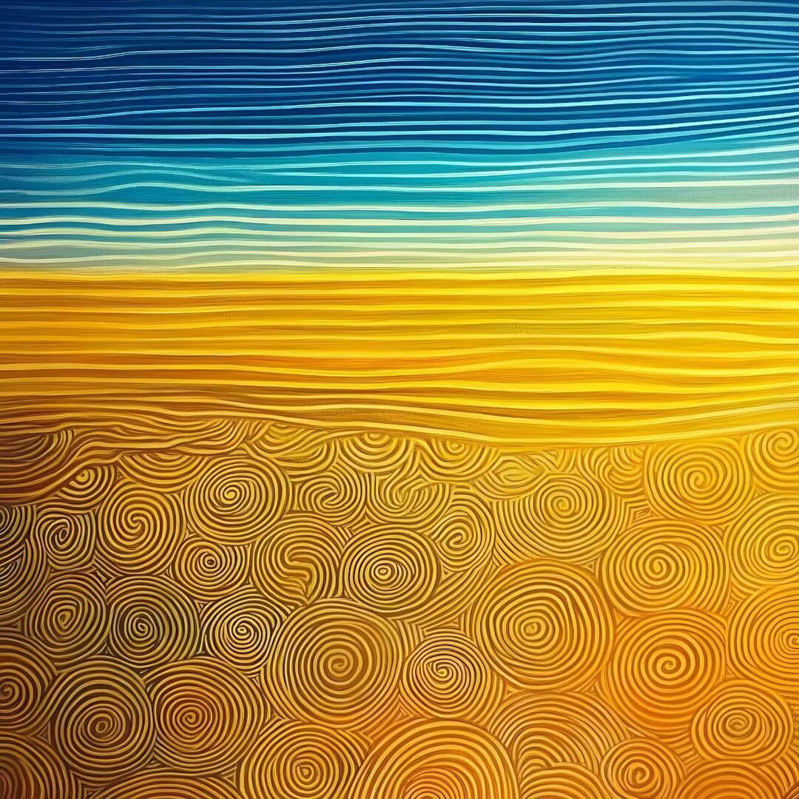{ width=75%, loading=lazy }
/// caption
Волга Густава Климта
///

Вот это, как мне кажется, и есть Волга Густава Климта.
Спокойные волжские волны создают своё отражение на золотом песке.
Золото в символизме Климта олицетворяет собою вечность.
Непрестанно меняющиеся, всегда пребывающие в движении волны находят свое отражение в вечности, но и они не способны смыть с песка отпечатки, оставленные божественными пяточками любимой женщины.

Ну так мы с Густавом это видим…

В [канале «Моя Волга»](https://t.me/volgajoy) продолжение этой истории.

### ИИ в Фотографии {#genai_in_photo}

*Автор текста: [Сергей Поляков](p2-100-authors.md#bongiozzo)*

Что тут скажешь?

На мой взгляд – круто!

Изображение само по себе нравится, а когда погружаешься в историю художника, знакомишься с его техникой, понимаешь чувства, стоящие за произведением – появляется радость в душе, которой хочется делиться.

Помимо Климта, оценивали наброски других художников.
Надеюсь можно будет увидеть Волгу глазами Моне, Врубеля, Рериха…
Картины в работе и планах.

Так же как и в музыке, [Искусственный Интеллект](p1-030-time.md#happy_tomorrow), на мой взгляд, [является угрозой для фонограмщиков и ремесленников](p2-150-absurd.md#genai_in_music) – то есть, для людей, которые занимаются искусством уже не по Любви и Призванию, а больше ради денег.

Для людей, которые [творчеством](p2-120-school.md#psychology_of_unconscious) компенсируют [аналитическую](p2-120-school.md#psychology_of_mind) и [волевую](p2-120-school.md#psychology_of_will) нагрузку в процессе заработка и дополнительно ещё [реализуют свои таланты](p1-020-call.md#follow_your_calling), технологии генеративного интеллекта только во благо.

### Александр Петросян {#petrosyan}

Спустя 15 лет после того, как купил фотоаппарат, я задумался о прохождении обучения у Мастера.

А может и не задумывался я вовсе, а просто товарищ прислал [ссылку на интересного фотографа](p2-100-authors.md#AlexanderPetrosyan), с которым захотелось познакомиться.

Получится ли чему-то научиться на персональном мастер-классе - были сомнения.
Сомнения во мне самом.

Но во время подготовки к первой встрече с учителем был запущен очень важный и необычный мыслительный процесс, [о котором писал ранее](p2-110-system.md#family_priorities) и который не имеет непосредственного отношения к фотографии.

А с точки зрения навыков съёмки основной урок оказался в том, что нужно просто внимательно наблюдать за тем, что делает Петросян, когда выходит на фотоохоту.

[Правило 10 000 часов остаётся основополагающим](p2-150-absurd.md#first_musical_steps).
И Александр провёл с фотоаппаратом в несколько раз больше времени.
И значит нам остаётся либо долго нарабатывать свой почерк, либо внимательно наблюдать за действиями Мастера на совместной фото прогулке и перенимать интересные подходы.

Кстати, любопытно, что половина приходящих на мастер-классы по фотографии – программисты и «айтишники».

Вероятно, многие, так же как и я, чувствуют необходимость компенсации [своего чрезмерно рационального мышления](p1-020-call.md#architect_personality) через близкое к визуальному восприятию творчество.

А с Сашей в результате мы начали говорить не про объективы, выдержки и диафрагмы, а про смысл жизни и образы счастья на городских пространствах.
Даже получилось провести близкую по смыслу [фотовыставку в Самаре](p2-130-local.md#expo_in_yard).

Вопрос о смысле жизни, пожалуй, касается каждого, хотя далеко не все готовы о нём задумываться.

И для Александра смысл жизни видится как пойманный в решающий момент идеальный кадр.
Который без слов описывает его мироощущение.
Который отражает смысл его жизни.

Это [вечный поиск Идеала](p2-110-system.md#human_as_god).

Этот поиск трудно назвать счастьем, потому что это [вечное Преодоление](p2-180-sharedgoals.md#overcoming) и [Перфекционизм, как недовольство достигнутым](p2-170-opensource.md#mastery).
Это те качества, которые отличают Мастера от Профессионала.

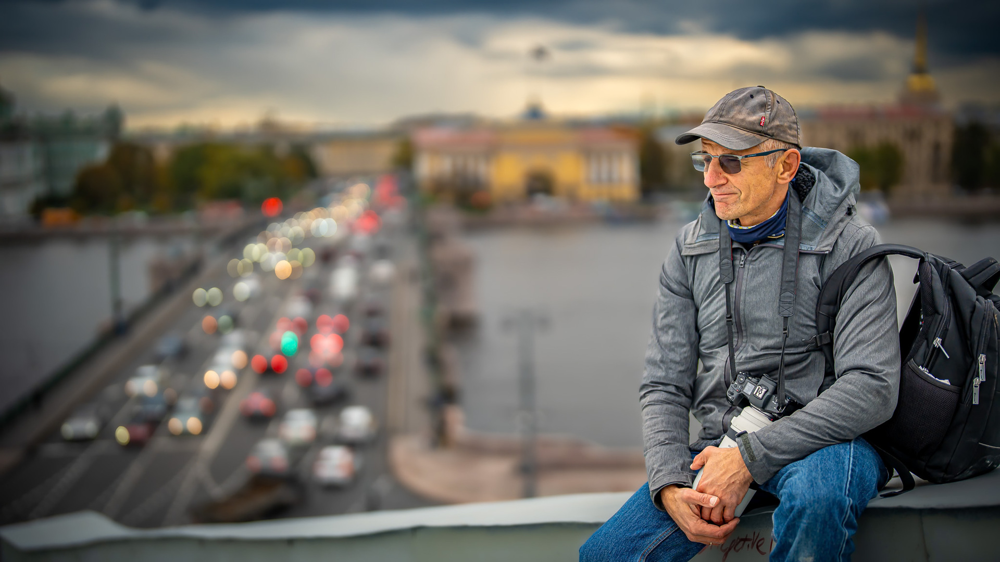{ loading=lazy }
/// caption
В поисках Идеала
///

В кинематографии, в образе такого Мастера, который [счастье воспринимает как несовместимое со своим занятием состояние](p1-010-happiness.md#what_is_happiness), можно вспомнить Тарковского, например:

!!! quote "Цитата"

    И, скажем, собираясь делать свою новую картину, собираясь делать новый шаг…, мне совершенно ясно, что я должен относиться к нему не как к свободному творчеству, а как к поступку, как к вынужденному акту, когда уже работа не может приносить удовлетворение, а является каким-то тяжёлым и даже гнетущим долгом.
    По правде говоря, я никогда не понимал, что художник может быть счастлив в процессе своего творчества.
    Или слово это неточное?
    Счастлив?
    Нет, никогда.
    Человек живёт не для того, чтобы быть счастливым.
    Есть вещи гораздо более важные, чем счастье!

    ^^[Андрей Тарковский](https://www.livelib.ru/quote/48219463-italyanskie-marshruty-andreya-tarkovskogo-lev-naumov)^^

На мой взгляд, образ счастья Тарковского был в том, чтобы [быть нужным другим](https://www.livelib.ru/quote/48218479-italyanskie-marshruty-andreya-tarkovskogo-lev-naumov).
Чтобы через его творчество запускался [поиск ответов на важные вопросы](https://www.livelib.ru/quote/48219505-italyanskie-marshruty-andreya-tarkovskogo-lev-naumov).

Конечно же, этот образ никак не связан с [расхожим представлениям «happiness», как комфортное состояние](https://www.livelib.ru/quote/48217174-italyanskie-marshruty-andreya-tarkovskogo-lev-naumov).
Равно как и [его искусство максимально далеко от задачи «развлекалова»](https://www.livelib.ru/quote/1208283-martirolog-andrej-tarkovskij).  

## В качестве заключения {#final_thought}

В стадии завершения этой главы, во время [прослушивания мемуаров Эльдара Рязанова](https://www.livelib.ru/review/5220355-nepodvedennye-itogi-eldar-ryazanov) (ох, сколько же в нём «рацио» и какой же он оказался «зануда» в рассуждениях – [родная душа](index.md#introduction)!), с удивлением обнаружил, что не видел его [фильма «Зигзаг Удачи»](https://www.kinopoisk.ru/film/45352/).

Исправил это упущение за время написания этих строк.

История про фотографа, и про человеческие отношения, и про мечту о покупке [фотоаппарата «Зенит-6»](https://ru.wikipedia.org/wiki/Зенит-4#«Зенит-6»), которая стала причиной основной завязки фильма.
В общем – рязановское рассуждение о счастье фотографа с актёрской игрой высочайшего уровня – 10 баллов.
