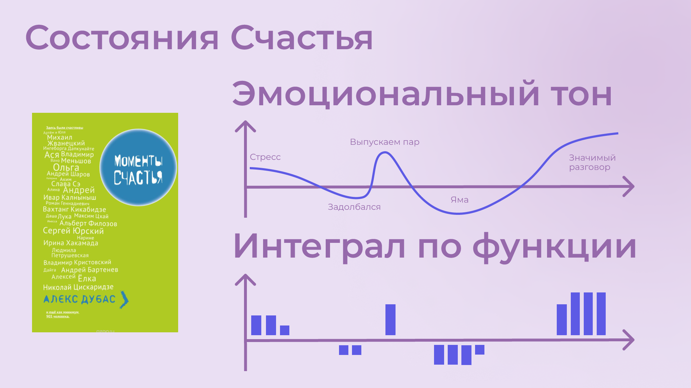
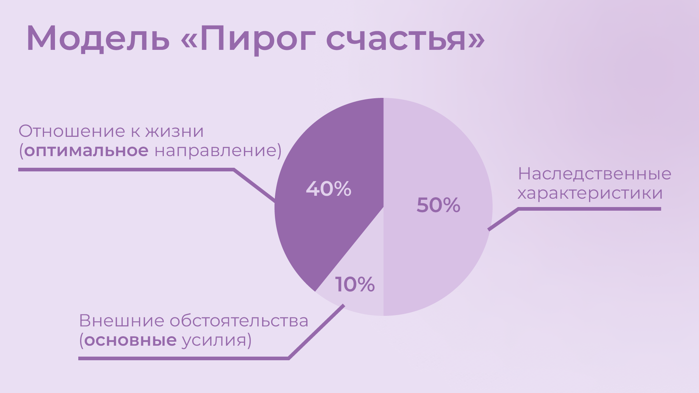
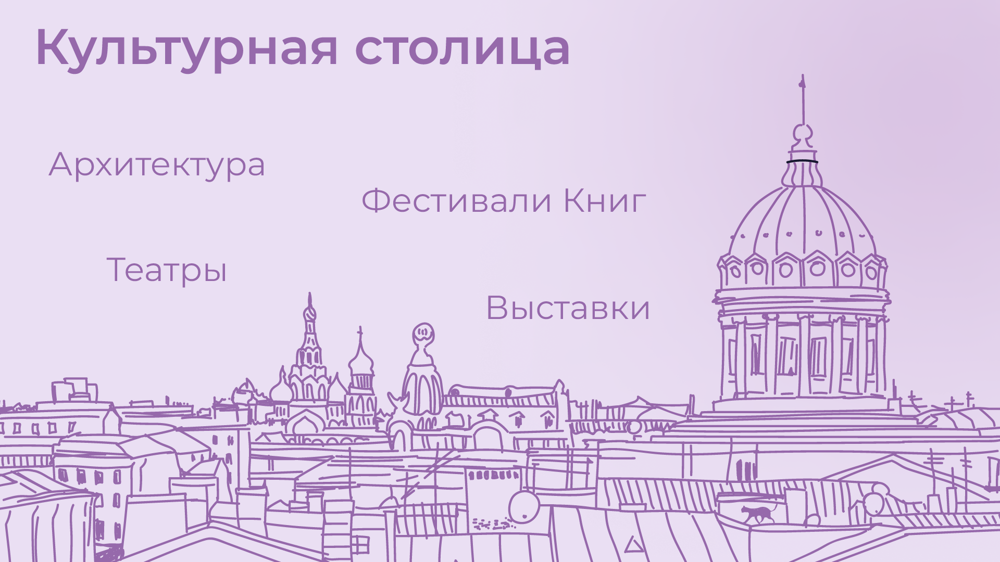
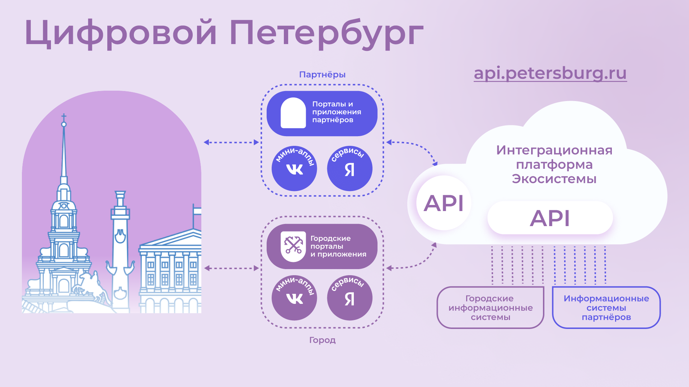
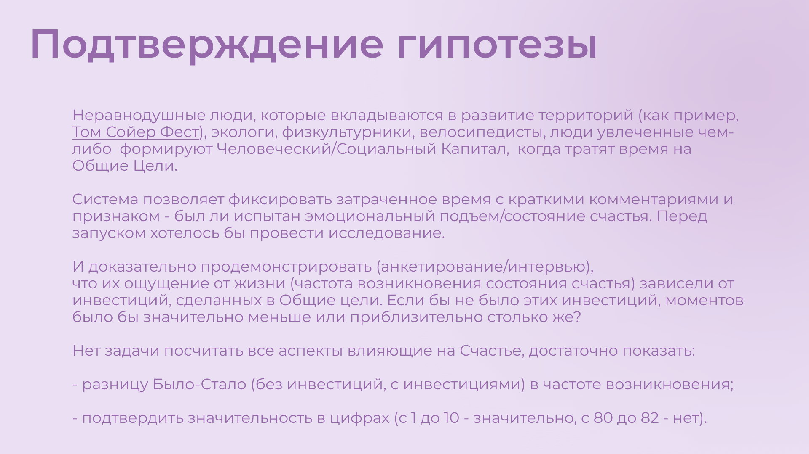
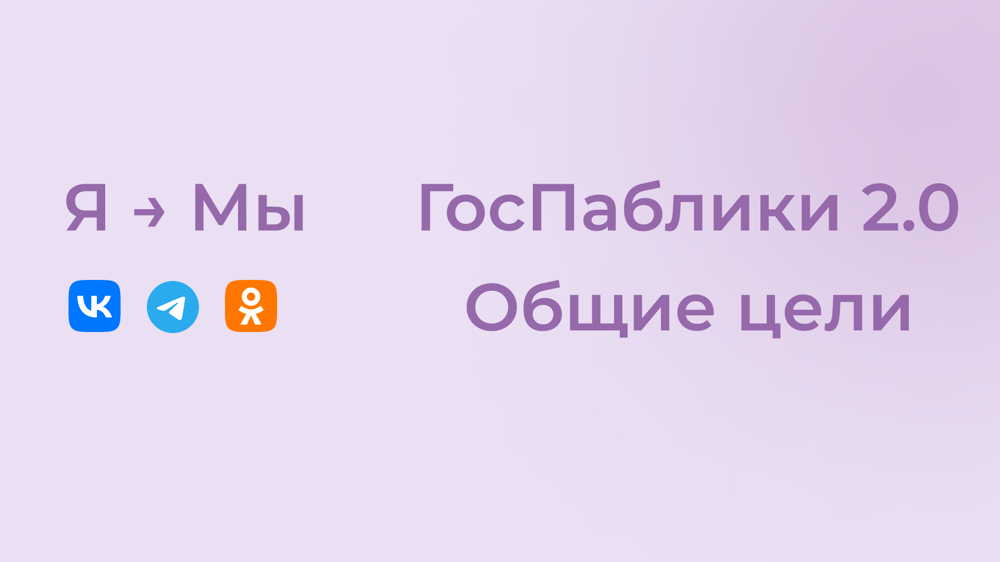
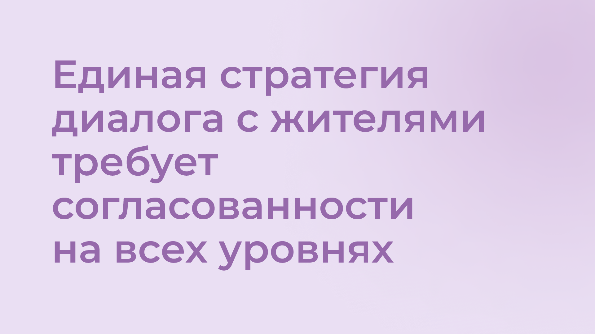
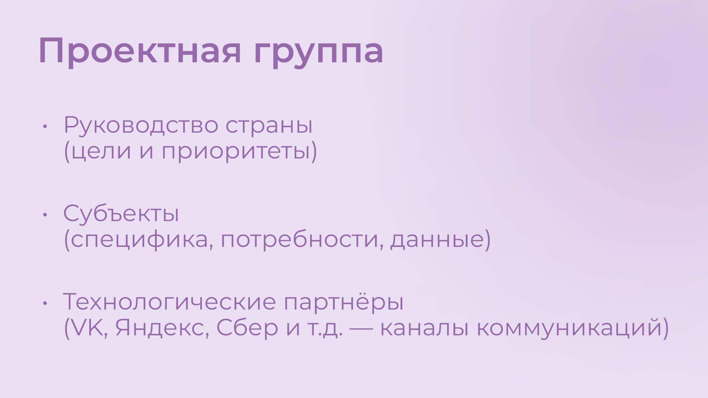
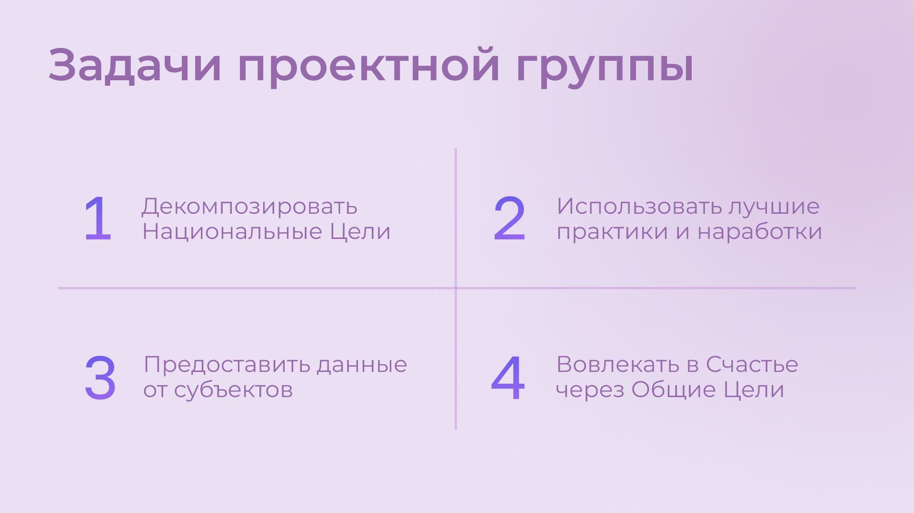

# Общие Цели: Презентация

Глава является выжимкой [ранее написанного Текста](index.md#text_idea).
Предназначена она для быстрого погружения в основные смыслы.

Во всяком случае, так мне видилось на момент её написания в июне 2024 года.

Текстовые связи поддержаны [визуальным рядом](p1-010-happiness.md#moment_for_vision) – слайдами.
Презентация сделана в Figma и доступна по адресу [sharedgoals.ru](https://sharedgoals.ru).

## 1. Время перемен — Время возможностей {#time_possibilities}

{ width="100%", loading=lazy }
/// caption
Время перемен — Время возможностей
///

2 года как в обществе идёт заметное переосмысление ценностей.
И в [истории России это уже случалось не единожды](p2-110-system.md#again_and_again).
И каждый раз страна выходила на новый уровень.

<!-- С новой страницы при печати -->

## 2. Цели государства и Потребности граждан {#goals_needs}

{ width="100%", loading=lazy }
/// caption
Цели государства и Потребности населения слабо связаны
///

Очевидно, что руководство страны симметрично реагирует на вызовы, определяет стратегию, но привычки и потребности населения в моменте расходятся с верхнеуровневыми целями.
[Спустя время разрыв сокращается, но по инерции, спустя 20-40 лет после взлёта, идёт следующий взмах маятника и его падение](p2-110-system.md#polarization).
Хотелось бы, сократить амплитуду будущего взмаха и выйти на стабильный рост.

## 3. Каналы коммуникаций {#communication_channels}

{ width="100%", loading=lazy }
/// caption
Поменялись каналы коммуникаций
///

И если 30 лет назад руководство любой страны формировало общее представление через централизованные СМИ — газеты, радио, ТВ, то сейчас это [коммерческие цифровые платформы, которые отвечают запросам общества потребления](p1-040-unhappiness.md#gadgets).
Очевидно, что государство присутствует в этих каналах коммуникаций со своей официальной повесткой.
Но информация от государства не может быть такой же занимательной и яркой, чтобы конкурировать с рекламой и независимыми блогерами.

## 4. Гражданин не равно Клиент {#citizen_client}

{ width="100%", loading=lazy }
/// caption
Гражданин не равно Клиент
///

Государство присутствует в коммерческих каналах коммуникаций и даже следует мантре Клиентоцентричного сервиса, постоянно повышая ожидания и удобство, но опосредованно при этом поддерживает образ «Клиент всегда прав».
В сознании происходит отделение себя от государства, снижается сопричастие и, как следствие, растёт недовольство и несчастье.

Люди быстрее всего [сплачиваются в условиях внешней угрозы и борьбы против кого-либо](p2-110-system.md#again_and_again).
Тогда они становятся соотечественниками.
В мирном формате чувство плеча появляется вместе с соседями, [когда вкладываешься в созидательную деятельность и повышаешь благоустройство](p2-130-local.md#love_beyond_words).

В любом случае – Гражданин не равно Клиент.

## 5. Счастье как смысл жизни {#happiness_as_mission}

{ width="100%", loading=lazy }
/// caption
Счастье как смысл жизни
///

При всех разных точках зрения и разных ролях, которые мы играем в жизни существует одна система координат, которая объединяет практически всех людей на Земле.

[Это стремление быть Счастливым](p1-010-happiness.md).

## 6. Научное сообщество о Счастье {#science_about_happiness}

{ width="100%", loading=lazy }
/// caption
Научное сообщество о Счастье
///

Стремление к Счастью — это краеугольный камень стратегии диалога с жителями.
И если цифровизаторы-айтишники стали обеспечивать диалог города и жителей и разрабатывать городские сервисы для решения их потребностей, то [необходимо понимать и измерять ожидаемое целевое состояние и динамику](p1-010-happiness.md#happiness_model).
Счастье — понятие очень индивидуальное и ассоциируется с положительными эмоциями.
Однако надо понимать — в результате этого диалога люди действительно становятся счастливее?

Мысль это далеко не нова, и в научном сообществе уже есть наработки по теме [моделей измерения ощущения от жизни от айтишников-психологов](https://www.livelib.ru/work/1008288064-model-kolichestvennoj-otsenki-urovnya-schastya-vladimir-andreev) и [интегрального понятия «Человеческий Капитал» (и близкого понятия «Социальный Капитал») от политологов-психологов](https://www.livelib.ru/review/4165063-strategicheskaya-psihologiya-globalizatsii-psihologiya-chelovecheskogo-kapitala).

## 7. Состояния Счастья {#states_of_happiness}

{ width="100%", loading=lazy }
/// caption
Состояния Счастья
///

Строго говоря — [жизнь состоит из моментов, характеризуемых эмоциональным тоном](p1-010-happiness.md#moments_of_happiness).
Отрицательным или Положительным.
«Счастливая ли жизнь?» можно измерить интегралом по функции эмоционального тона на протяжении всего времени.
И несмотря на то, что уровень эмоционального тона в моменте можно измерять по физиологическому состоянию организма, как [постоянный мониторинг уровня сахара в крови](p2-140-digital.md#health), например, и это станет возможным в обозримом будущем — речь пойдёт совершенно о другом.

Чтобы не сильно смущать разговорами об интегралах по функции Счастья можно вспомнить [книгу-сборник «Моментов Счастья», которая вдохновила нас не меньше, чем количественные модели](p1-010-happiness.md#moments_of_happiness_book).

## 8. Пирог Счастья {#pie_of_happiness}

{ width="100%", loading=lazy }
/// caption
Пирог Счастья
///

[Природа феномена ощущения Счастья](p1-010-happiness.md#happiness_pie) такова, что предпосылки его появления на 50% зависят от физиологических и наследственных особенностей, которые обуславливают наш характер/темперамент/психотип.

На 10% от внешних обстоятельств, которые соответствуют Ожиданиям: «Захотел и Получил»!
Сюда обычно и прикладывается максимум усилий.

И на 40% зависят от Отношения к жизни, которое мы чаще всего оставляем без внимания.

Наблюдения эти подтверждаются в исследованиях и описаны в книгах — уже упомянутая [«Количественная модель счастья»](https://www.livelib.ru/work/1008288064-model-kolichestvennoj-otsenki-urovnya-schastya-vladimir-andreev) [Владимира Андреева](p2-100-authors.md#andreevvs) и [«Психология Счастья»](https://www.b17.ru/blog/401335/) Сони Любомирски.

## 9. Путь Этапов Развития Личности {#path_of_happiness}

{ width="100%", loading=lazy }
/// caption
Путь Этапов Развития Личности
///

Частота возникновения моментов счастья, в свою очередь, зависит от уровня развития Личности, который человек достигает, преодолевая Кризисы.
Можно перескочить какой-то кризис и не выработать необходимых навыков для преодоления, что создаст дисбаланс и сложности в будущем.

[Модель ПЭРЛ имеет множество аналогий](p2-120-school.md#brief_happiness_model) и им не противоречит. Тут кратко приведу уровни:

1. Детская Беспомощность;
1. Зависимость от старших;
1. Умение проявлять [свою Волю](p2-120-school.md#psychology_of_will), принимать решения и выходить из Подчинения;
1. [Навыки Разума](p2-120-school.md#psychology_of_mind) обустроить жизнь по нормам социума — Необходимость достичь минимальный уровень достатка;
1. [Иррациональный навык найти свой Интерес](p2-120-school.md#psychology_of_unconscious) и [следовать Призванию](p1-020-call.md#follow_your_calling), возможно вопреки голосу Разума — многие себя так и не реализовали на этом этапе;
1. Интегрировать интерес и заработок, реализоваться как эксперт в своей области — успешные предприниматели и деятели культуры;
1. Преобразование полученного за жизнь опыта в Смысл, [обрести Веру](p2-120-school.md#psychology_of_belief) — лидеры и писатели, люди, вошедшие в историю;
1. [Идеалы, которые смогли достичь полного единения с мирозданием](p2-120-school.md#idealization) — святые.

Нет практически никаких шансов дойти до самого конца Пути…
:-)
Слишком много Воли и Веры потребуется.

Однако [лучше иметь наглядное представление об этом Пути с юности](p2-120-school.md#happiness_in_school).

И государство может помогать и помогает преодолевать кризис поиска Интереса через развитие потенциала в Творчестве.
На нём застревало и застревает слишком большая часть населения планеты Земля.

Дилемма эта извечна и решения пока не имеет.
Аллегорически, [в виде театральной Комедии как у Данте](p2-110-system.md#larger_than_life), битву философских подходов в поиске выхода описал Франкл:

/// quote | Цитата

СОКРАТ (подчеркнуто): Искусство! Они сказали, что только искусство может повлиять на людей там, внизу?

КАНТ. Не лишено интереса! Идея не-плоха!

СОКРАТ (воодушевляясь): Я сначала не хотел об этом говорить. Но ведь действительно, нет другого выхода, теперь я в этом убежден.

СПИНОЗА: Искусство – значит фантазии, мифы, поэмы, но отнюдь не истина… Разве мы можем участвовать в чем-то подобном?

КАНТ: Смешное возражение – не обижайтесь! То нереальное, которое искусство преподносит людям, подчас бывает ближе к истине, чем их человеческая реальность.

СПИНОЗА: Хорошо, но это приведет к вседозволенности.

СОКРАТ: Опыт истории опровергнет ваши сомнения, Барух.

КАНТ: Безусловно. Но дело в другом: как вы себе это представляете практически, Сократ? Самим нам тут устраивать театр, или вдохновить каких-нибудь драматургов, или еще чёрт знает что?

СПИНОЗА: Господин профессор прав. Не можем же мы тут стать артистами и что-то представлять!

СОКРАТ: Но как иначе говорить с ними? Только конкретные образы действенны.

СПИНОЗА: Прекрасно, но мы же будем смешны!

КАНТ: И кроме всего прочего мы на такое… (тихо, значительно) не получим разрешения.

СОКРАТ: Стоп! Это уже будет моя забота. Есть и другие – не-люди становятся людьми, чтобы помогать людям.

КАНТ: Повторяю – на это не будет согласия, вот увидите!

[Виктор Франкл, Синхронизация в Биркенвальде](https://www.livelib.ru/quote/47015722-skazat-zhizni-da-psiholog-v-kontslagere-viktor-frankl)
{ .author }

///

Однако наше поколение будет отличаться от предыдущих, на мой взгляд, [приходом сильного Искусственного интеллекта и Роботизации](p2-160-routine.md#love_manifest_robots).
Спасение это или нет – посмотрим.
Но эти явления уже начинают оставлять без работы тех, кто [зарывает свои таланты](p2-180-sharedgoals.md#social_capital_finance) и не стремится к идеалу.

## 10. Петербург в поисках Счастья {#petersburg_and_happiness}

{ width="100%", loading=lazy }
/// caption
При чём здесь Петербург?
///

Хорошо, но при чём здесь Петербург?

Когда расставлял ссылки в тексте и восполнял собственные пробелы в знании жизнеописаний русских святых новой истории из Википедии, узнал о [пророчестве Серафима Вырицкого о роли Петербурга](https://ru.wikipedia.org/wiki/Серафим_Вырицкий).
Эта информация меня и порадовала и огорчила.
Порадовала, потому что  красиво вписывается в общую картину.
Но, к сожалению, также держу в уме поправку на то, что предсказания публикуются по прошествии времени и делают это зачастую те, кому хочется построить на них свои выводы.
Как мне, например…
:-)

Хотя я понимаю, что известные артисты посвящают [своему таланту](p1-020-call.md#follow_your_calling) более [10 тысяч часов и тогда переходят на принципиально иной уровень понимания и чувств](p2-150-absurd.md#first_musical_steps).

Я верю, что Иоанн Кронштадтский, который проводил в служении Богу и выслушивании исповедников по 20 часов ежедневно, в какой-то момент [начал понимать нужды каждого при беглом взгляде](https://www.livelib.ru/quote/48267490-svyatoj-protiv-lva-ioann-kronshtadtskij-i-lev-tolstoj-istoriya-odnoj-vrazhdy-pavel-basinskij).

Также и другие [высокоразвитые личности](p2-120-school.md#saints_in_russia), находясь беспрецедентно долгое время во [внутреннем диалоге](p2-110-system.md#practicing_meditation) и [состоянии высокого эмоционального тона](p1-010-happiness.md#happiness_model), начинают «видеть» или прогнозировать события на продолжительных отрезках времени.

Когда смотришь на ответы последних версий языковых моделей GPT, также с трудом верится, что они исходят не от невероятно разностороннего и одухотворённого (иногда придурковатого) человека, а являются последовательным подбором символов на основе вероятностных распределений, сформированных из петабайт текстовой информации.

Однако Петербург имеет совершенно понятные предпосылки, чтобы стать точкой роста.

## 11. Культурная столица {#culture_capital}

{ width="100%", loading=lazy }
/// caption
Культурная столица
///

В Петербурге сконцентрировано запредельное количество заведений науки и искусства.
Кроме этого очевидного факта, существует [понятие «Текст города»](p2-130-local.md#city_as_text).
Это Архитектура города, которую «читают» его жители и гости, когда идут по улицам и смотрят по сторонам.
Архитекторы, определявшие облик Петербурга, очевидно закладывали стремление к Идеалам.
Высокая культура и «Текст города» работают.

В Петербурге модно быть читателем.
Городская библиотека имени Маяковского по читательскому билету предоставляет [бесплатный доступ к электронным книгам](https://pl.spb.ru/virtual-resources/index.php?ELEMENT_ID=13092).

В городе всегда была невероятная концентрация идеалистов.
Упомянутые книги о Счастье были написаны мыслителями из Петербурга, так же как и [движение русских космистов развивалось в Культурной столице](p2-130-local.md#russian_cosmism).
Обычно Петербург вспоминают как город трёх революций, но хотелось бы, чтобы эти идеалы послужили катализатором для прохождения кризиса Интереса у граждан.

Точкой прорыва России может стать объединение двух российских полярных максимумов — амбициозной, рациональной Москвы и идеалистичного, культурного Петербурга.
Такой российский гигаполис с заложенным внутри [парадоксальным дуализмом](p2-110-system.md#paradox) может стать качественным скачком и переосмыслением.

Тем более, что именно в Петербурге [мы начали успешно освобождать чиновников от рутинной работы](p2-160-routine.md#robots_in_spb), выполняя её роботами, а людей переводить на более творческие задачи.

## 12. Цифровой Петербург {#digital_petersburg}

{ width="100%", loading=lazy }
/// caption
Цифровой Петербург
///

Когда [строили «Цифровой Петербург» в 2020 году](p2-130-local.md#mini_app_vkontakte), изначально использовали принципы Открытого Правительства.

Упор был сделан на [открытие данных и создание программных интерфейсов (API) городских информационных систем](p2-170-opensource.md), поверх которых можно создавать новые сервисы для жителей, интегрированные с популярными цифровыми каналами коммуникаций.
С площадками, где уже находятся жители.

Использование платформ приложений от партнёров ВКонтакте и Яндекс дало возможность быстро запускать новые сервисы для жителей и масштабироваться в другие субъекты.

## 13. Я Здесь Живу {#i_live_here_app}

{ width="100%", loading=lazy }
/// caption
Я Здесь Живу
///

[«Я Здесь Живу»](https://vk.com/ya_zdes_zhivu) — флагманское приложение [«Цифрового Петербурга»](https://about.petersburg.ru) построено не как отдельное приложение, а как набор разнообразных сервисов с привязкой к адресу города, поверх которых создан мини-апп ВКонтакте.
[Предполагается запуск сервисов на других платформах](p2-130-local.md#digital_petersburg_roadmap).

## 14. Подход Цифрового Петербурга {#roots_approach}

{ width="100%", loading=lazy }
/// caption
Подход Цифрового Петербурга
///

Есть метафора, что [наши города заполнены Иностранцами, которые не знают места, где они живут](p2-130-local.md#unhappy_foreigners).
Их мало что связывает с местом жительства, так как живут они образами, сформированными цифровыми каналами массовой информации.

Разность реальности и этих образов (не самых правдивых) порождает раздражение и несчастье.
Мы пока не говорим, что по настоящему приносит Счастье место, которое не только знакомо, но и частично преобразилось в результате труда жителей.

Мы следуем Пути, который позволяет жителям «пускать корни» и делает его экспертом места, в котором он живёт.

## 15. Новые метрики {#new_metrics}

{ width="100%", loading=lazy }
/// caption
Социальный капитал и Общие цели
///

[Следуя принципу «Не можешь измерить — не можешь управлять»](p2-140-digital.md#why_digital_russia) для изменения ситуации необходимо сначала научиться измерять текущее состояние и понимать желаемое в ключевых процессах и целях общества.

Для лучшего понимания эффективности наших усилий в диалоге с жителями от лица города мы начали искать новые понятия и метрики — например, [Социальный капитал](p2-180-sharedgoals.md#social_capital).

## 16. Определение Социального капитала {#social_capital_definition}

{ width="100%", loading=lazy }
/// caption
Определение Социального капитала
///

Самый драгоценный ресурс для общества и человека, который изначально [надо уметь измерять и оценивать — это наше Время](p2-140-digital.md#time).
[Социальный капитал](p2-180-sharedgoals.md#social_capital) представляется как интегральная инвестиция времени в общие цели.

Это время, которое люди тратят не на «себя любимого», а на своё окружение, и при этом не ожидают оплаты.
Не «ты мне — я тебе», а «мы вместе для нас».
По сути, это [цифровая метрика Любви](p2-110-system.md#love_as_labor).

Оно очень похоже с понятием Человеческий капитал, о котором написана уже упомянутая здесь книга [«Психология человеческого капитала»](https://www.livelib.ru/review/4165063-strategicheskaya-psihologiya-globalizatsii-psihologiya-chelovecheskogo-kapitala).
Примечательно, что заключение книги посвящено [Счастью, как краеугольному камню](p1-010-happiness.md#cornerstone_of_text) в понятии Человеческий Капитал.

Будь то Социальный или Человеческий, но этот Капитал разительно отличается от Финансового Капитала, который доминирует в мире, что создаёт перекосы и конфликты, в том числе военные.
И если это понятие так важно, то его нужно постепенно вводить в управленческую практику наравне с Финансовым капиталом и уметь его измерять, чтобы достигать баланса.

Вполне вероятно, что потребуется введение в обиход принципиально нового понятия, которое отражает смысл инвестиций сделанных в общее дело.

Инвестиции в Счастье.

## 17. Новое осмысление Умного Города {#smart_city_slide}

{ width="100%", loading=lazy }
/// caption
Рост социального капитала города
///

В системе координат, где помимо Финансового капитала начинает оцениваться Человеческий, можно переосмысливать знакомые понятия.

[Умный город — не тот, где больше камер или датчиков, а тот, где Социальный капитал растёт быстрее](p2-180-sharedgoals.md#smart_city).

Если в СССР граждане строили коммунизм без денежных отношений, который воспринимался на уровне обывателя довольно причудливо и непонятно.
То вот сейчас важно понимать, что в результате деятельности помимо Финансового капитала растёт ещё и Человеческий, который является залогом нашего Счастливого Завтра.
И мы видим этот рост на открытых формулах и цифрах в срезах нашего места жительства и рода занятий.

## 18. Житель — инвестор, а не потребитель {#citizen_investor}

{ width="100%", loading=lazy }
/// caption
Житель — инвестор
///

Финансовая независимость, о которой мечтает подавляющая часть населения, приобретается только через навыки Инвестиций.
Чтобы научиться инвестировать Деньги, сначала нужно научиться управлять и инвестировать Время, которое имеется у всех в равной степени.
Для этого требуется управлять Волей, чтобы не разбазаривать это Время на [ловушки, которые создаёт для нас легкодоступный цифровой мир развлечений](p1-040-unhappiness.md#information_flow).

Вырабатывать эти навыки проще всего на [инвестициях в улучшение своего жизненного пространства](p2-130-local.md#tom_sawyer_fest).
Без вовлечения в развитие своего дома и двора, вероятно, не получится стать счастливым и обеспеченным.
Улучшение жизненного пространства является общей целью жителей и руководства города.

## 19. Вовлечение в инвестиции {#investment_involvement}

{ width="100%", loading=lazy }
/// caption
63% готовы инвестировать
///

Треть «Сильных идей», предлагаемых Агентством Стратегических Инициатив о [вовлечении граждан в созидательную деятельность на благо общества](p2-180-sharedgoals.md#shared_goals_for_citizens).

По данным опроса, не менее 63% наших жителей ответили, что они готовы инвестировать своё время на благо Общества.

Люди очень разные, но все хотят быть счастливыми.
И в глубине души все понимают, что для этого надо как-то вложиться.
Есть порыв, но нет понимания «Что же конкретно можно сделать, чтобы помочь?»

## 20. Общие цели {#shared_goals_slide}

{ width="100%", loading=lazy }
/// caption
Общие цели
///

На эти вопросы ответит [платформа Общие Цели](p2-180-sharedgoals.md#shared_goals).
И все проекты про вовлечение можно будет объединить [одной открытой цифровой платформой](p2-170-opensource.md#shared_goal).

И тогда общественное движение, клуб по интересам, обычная семья или неравнодушный гражданин могут [присоединиться или создать Общую Цель](p2-180-sharedgoals.md#entity_goal).
Где [определяется Время как возможная Инвестиция](p2-180-sharedgoals.md#entity_contract).

[Экспертами может быть предложен план рекомендованных действий](p2-180-sharedgoals.md#entity_instruction), чтобы избежать ненужных рисков и направить временные инвестиции в оптимальное русло.
И фиксируется [совершённый временной вклад в Общую цель](p2-180-sharedgoals.md#entity_commit).
Когда виден результат от сделанных инвестиций, то возникают и отмечаются Моменты Счастья.

Именно они могут быть мотиваторами для тех, кто собирался заняться этой темой, но не хватало времени, а точнее воли.

«Я Здесь Живу» является лишь подмножеством Общих Целей, объединенных адресом многоквартирного дома.
А [искусственный интеллект](p2-180-sharedgoals.md#ai_tool) в лице [цифрового аватара Яков Петровича или Яков Захарыча](p2-130-local.md#digital_petersburg_roadmap) (дворник или фонарщик, зажигающий свет) в чатах может подсказать, что происходит вокруг и какими Общими Целями можно заняться.

## 21. Что мне делать? :-) {#this_text}

{ width="100%", loading=lazy }

[Так называется этот Текст](index.md#what_to_do), который спонтанно начал писать в GitHub совместно с единомышленниками год назад.

Что надо делать, чтобы быть Счастливым?
Что сделать, чтобы основные правила и вехи в этом Пути стали более очевидными?

Вопросов, сомнений, рассуждений — множество.
Хотя основные выводы в тексте видятся вполне устойчивыми и выдержали не одну дискуссию.
Тем не менее у каждого может быть свой нюансный взгляд и каждый может его добавить в [концепции Open Source](p2-170-opensource.md#associations_with_open_source).
И значит Текст этот может дополняться бесконечно и [не является законченным продуктом или книгой](index.md#text_is_not_a_book).

## 22. Подтверждение гипотезы {#proof}

{ width="100%", loading=lazy }
/// caption
Подтверждение гипотезы
///

Требовалось показать зависимость между вложенными инвестициями в общее дело с возникновением состояний счастья впоследствии.
В июне мы запустили исследование с участниками Том Сойер Феста — «Делает ли волонтеров совместное восстановление домов счастливее?»

Спустя пару месяцев мы с уверенностью можем сказать, что [Делает](https://vk.com/wall-136227449_5513)!

Однако [задача искать риски и перекосы модели](p2-180-sharedgoals.md#balance_check) остаётся важной.
В этом деле будет полезна любая помощь — тем более, что советы любят давать многие!
:-)

Хотя тут потребуется готовность включения в поиск решения и временные инвестиции.

## 23. Желаемый результат {#result}

{ width="100%", loading=lazy }
/// caption
Желаемый результат
///

Общие цели, являясь независимой открытой цифровой платформой, можно встроить через виджеты, мини-аппы и чат-боты в уже существующие сообщества, группы и ГосПаблики.
По желанию модераторов и администраторов этих сообществ, конечно же.
Ряд изменений можно делать автоматизировано, через API, без необходимости ручного ввода.

И тогда в тематических сообществах можно наблюдать динамику общих временных инвестиций, активность участников и поток деперсонализированных моментов счастья, которые появились в результате вложений.

[Важные результаты](p2-120-school.md#human_capital_book):

- Вклад в Общие цели можно соотнести с вкладом в соответствующие национальные цели, определяемые руководством страны;
- Платформа может стать инструментом для измерения человеческого/социального капитала, наряду с финансовым;
- Становится возможным формулировать измеримые и понятные цели для общества, напрямую связанные с интересами граждан и влияющими на их счастье.

## 24. Необходимые условия {#requirements}

{ width="100%", loading=lazy }
/// caption
Необходимые условия
///

[Несмотря на растущую важность Цифровизации для государств и явное её присутствие в национальных целях](p1-050-country.md#russian_it), мы понимаем, что далеко не всё можно решить с помощью информационных систем.
Потребуется согласованность усилий на всех уровнях.
На наш взгляд, основы психологии и философии в максимально доступной и наглядной форме, понимание природы наркологических и поведенческих зависимостей, необходимость прохождения пути развития уровней личности для испытания моментов счастья на протяжении жизни, историю героев, которые прошли этот путь, [необходимо давать уже в средней школе](p2-120-school.md#happiness_in_school).

Конечно же, содержанием школьной программы должны заниматься специалисты в образовании, но пока предмета о Счастье нет в школе, ответственность за счастливое завтра детей полностью лежит на плечах родителей.
Мы также понимаем, какие последствия может иметь цифровизация роли наставника для детей, которая сейчас и происходит через компьютерные игры и непрерывное потребление информации с телефона.
Ребенку нужны живые Папа и Мама, равно как Человеку нужен Человек.
Тут скорее необходимо направлять усилия на осознание сложившейся ситуации в головах взрослых.
Через открытый, прямой, объективный диалог.

[В наших силах снабдить цифровыми помощниками уже созданные домовые чаты в мессенджерах](p2-130-local.md#digital_petersburg_roadmap), где присутствует население России, проживающее в многоквартирных домах.
В этих группах часто можно наблюдать разгул «диванной аналитики» и «глубокого знания жизни», когда виноват кто угодно, но не сам говорящий.
Не слишком серьёзный персонаж, типа виртуального дворника или фонарщика, сможет рассказывать, что Город делает для дома и двора, что делают неравнодушные люди неподалёку, и как можно им помочь.
Может даже порассуждать о природе Счастья и навести на мысли, которые прорастут позже.

## 25. Проектная группа {#project_team}

{ width="100%", loading=lazy }
/// caption
Проектная группа
///

Думается, что важно включиться в проектную рабочую группу, в которой присутствуют представители Руководства, Субъектов и Технологических Партнеров, чтобы согласовать эти действия.

## 26. Задачи проектной группы {#project_tasks}

{ width="100%", loading=lazy }
/// caption
Задачи проектной группы
///

Потребуется:

- Декомпозировать Национальные Цели на исполнимые гражданами планы Общих Целей с помощью экспертов и ответственных из отрасли: Благоустройство — Субботник, Экология — Полить газон во дворе, Благосостояние — Послушать лекцию о важности контроля трат и начала инвестирования и так далее;
- Использовать лучшие методологические практики и технические наработки, которые не создадут рисков в дальнейшем;
- Структурировать и снабдить данные API на уровне субъектов для ведения объективного диалога с жителями;
- И вовлекать людей в Общие Цели.

Обсудить положения этой главы и всего остального текста можно в группе [по ссылке](https://t.me/bongiozzo_public).
