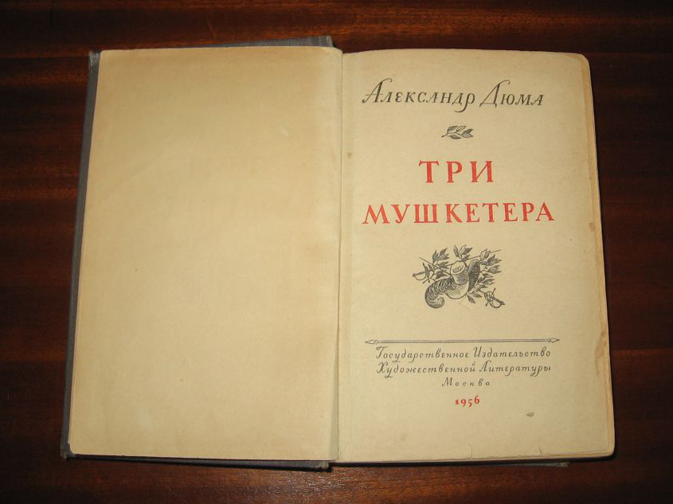
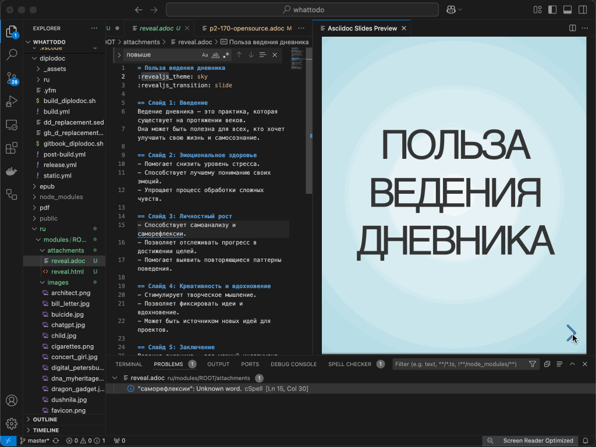
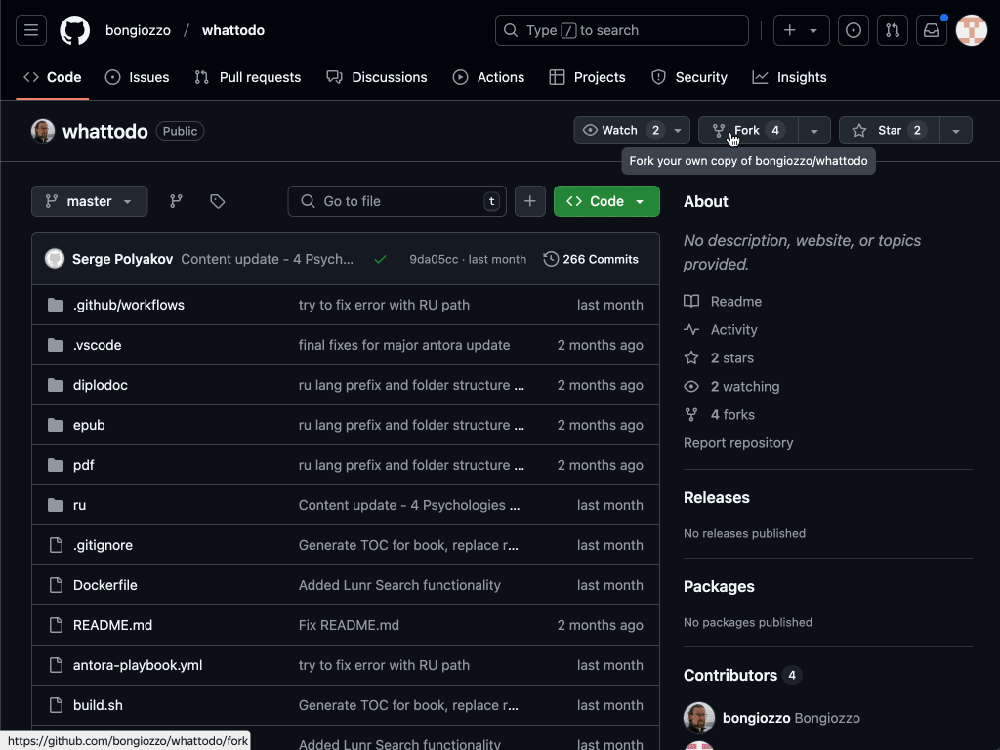
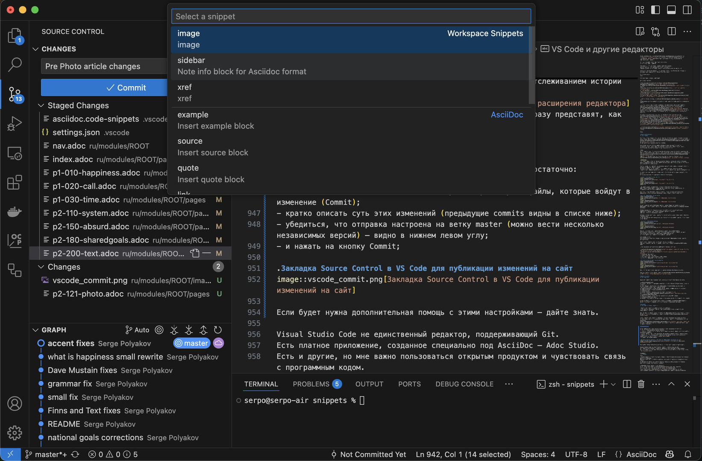

# Жизнь как Текст

/// quote | Цитата

Хорошо бы начать книгу, которую надо писать всю жизнь…

То есть не надо, а можно писать всю жизнь: пиши себе и пиши.

Ты кончишься, и она кончится.

И чтобы всё это было — правда.

Чтобы всё — искренне!

[Андрей Битов](https://www.livelib.ru/quote/47589023-zhizn-v-vetrenuyu-pogodu-sbornik-andrej-bitov){ .author }

///

## Понимание Текста {#text_meaning}

Интересно бывает задуматься и разложить по полочкам привычные понятия в голове.
Как они представлялись раньше и что изменилось за последние годы?

Вот, например, взять такое понятие как Текст.
Это слово само пишется с большой буквы последнее время.

Так бывает когда с каким-то глубоко уважаемым человеком договорились перейти на Ты.
Уже даже выпили на брудершафт!
А всё равно непроизвольно вылетает Вы при обращении.

Текст звучит в мыслях и речи по несколько раз в день уже второй год.
Но так было не всегда.

Какие ассоциации понятие Текст вызывало в детстве?

Прописи и школьные упражнения по навыкам письма?
Пожалуй, что Нет.

Ассоциации с Текстом скорее связаны с первыми книжками.
Книжки, помню, оценивались прежде всего толщиной и тактильными ощущениями – любопытная или нет?

Хотя сам-то я их изначально не читал.
Это мне читали и рассказывали сказки.

/// abstract | Ситуация

Больше книжных сказок мне нравилось слушать истории о похождениях двух забавных тараканов – Ивана и Филиппа.
Эти истории придумывал [мой старший брат](p2-110-system.md#our_father).
И меня искренне восхищала его способность из головы, без книг, придумывать сюжеты.
Почему-то всегда думал, что ничего настолько же забавного я придумать не смог бы.

Рассказы брата звучали на сон грядущий, в темноте.
А в темноте представлять этих тараканов, которые вечно попадали во всякие передряги, получалось особенно хорошо.

///

Немало удивился [схожести отношений «пустяшного малого» Лёвушки Толстого со старшим братом и его «муравейными братьями»](https://www.livelib.ru/quote/48235906-lev-tolstoj-svobodnyj-chelovek-pavel-basinskij).

[Ассоциации из детства формируют образы счастья на всю жизнь](https://www.livelib.ru/quote/48235699-la-mort-divan-ilitch-smert-ivana-ilicha-lev-tolstoj).

Когда интересный мультфильм или кинофильм по телевизору показывали один раз в неделю – смотреть собственное «кино» в голове было прекрасной альтернативой!
:-)

Пожалуй, эти постоянные упражнения в развитии собственного воображения и сформировали наиболее притягательный образ времяпрепровождения – мечты.

И когда брата не было рядом, но хотелось снова оказаться в фантазийном мире, источником для новых «путешествий» стали книги, которые начал читать ещё до школы.

Период «детских» книг с картинками прошёл довольно быстро.
Запомнились [талантливо иллюстрированные книги Волкова из серии об Изумрудном Городе и Носова о Незнайке](p1-020-call.md#intuitive_sensitive).
Но потом картинки скорее отвлекали, чем заинтересовывали.
Ведь началась Фантастика!

## Форма подачи {#text_form}

И если иллюстраций было мало и они несильно влияли на восприятие, то форма текста, а именно – переплёт книги, качество бумаги и даже шрифт, оставались важны!

/// abstract | Ситуация

В начале 90-х жили с мамой вдвоём.
Она в ночную смену работала корректором в Доме Печати, а я учился в школе.
Хотя стоит начать пораньше…

Мама часто рассказывала о своей детской мечте – работать библиотекарем.
Сколько она себя помнила, всегда её притягивал мир книг, в котором можно найти ответы на любые вопросы.
Где тихо и спокойно.

Библиотека виделась ей центром мироздания и всего самого хорошего, что есть на свете.

Знаю, что она не одна жила такой фантазией.
Когда Евгений Гришковец описывал свои детские представления от библиотеки в [моноспектакле о своём Призвании](p1-020-call.md#follow_your_calling), то мне сразу вспомнились рассказы мамы с [«эффектом узнавания»](index.md#emotional_parts).

Но работа в библиотеке никогда не была денежной.
И так случилось, что в 50-е годы, деньги в семье мамы стали приоритетом номер один.

Мой дед, офицер Красной Армии, отсутствовал дома, вероятно, больше, чем был с семьёй.
В 20-х годах он борется с бандитизмом и басмачеством, в 39-м уходит на Финскую.
В мирные периоды строил и поднимал советское хозяйство.
С пятью детьми и домом управляется его жена, моя бабушка.
Жили как все – офицерского довольствия хватало.
Но и от соседей особенно не отличались.

Война с Германией в 1941-м стала логичным продолжением не такой уж «довоенной» для него жизни.

Карьера офицера у деда закончилась в 1943-м.
В котле Сталинградского ада рядом с воронкой в развалинах дома солдат замечает кожаный планшет.
На другом конце ремешка этой полевой сумки, под обломками, обнаружился серьёзно контуженный, но ещё живой Иван Кириллов.
Мой дед.
Далее госпиталь и демобилизация по инвалидности.

В администрации города Куйбышев (советское название Самары) его знали как опытного управленца, который может в короткие сроки и с минимальными затратами наладить работу.
Сейчас таких называют кризис-менеджерами.

Во время войны дед поднимает совхоз Волжский.
Мама вспоминала дружбу с деревенскими детьми, с которыми они играли на Царёвом кургане.
Запомнилось, что соседи частенько угощали овощами и фруктами со своих участков – ибо уважали, а собственного хозяйства у нашей семьи не было.

Запомнились мамины воспоминания о рационе питания – отварная сушёная вобла, варёный лук, жмых на десерт и царское блюдо – жареная картошка, за которую дети дрались.
Не всерьёз, конечно, но за последний кусочек на общей сковороде развёртывалось настоящее фехтовальное сражение на вилках, о котором напоминал шрам на руке.

Дальше в послужном списке деда – Самарский ипподром и следом назначение на объект посолиднее – Самарский спиртзавод.

Там, по рассказам мамы, он вскрывает масштабные махинации с нелегальным сбытом ходовой продукции и ввязывается в разбирательство.

Существуют различные сценарии судебных процессов, особенно когда вовлечено высокое руководство.
В результате неожиданных поворотов в ходе расследования он сам становится обвиняемым и отправляется по этапу.

Спустя несколько лет с делом разобрались – деда реабилитировали, выпустили досрочно и вызвали в Обком Партии принести извинения.
Однако вместо принятия извинений он сам кладёт свой партийный билет на стол.
В 1917-м сын иконописца поверил в систему координат большевиков и 17-летним юношей ушёл в Красную Армию.
Но в зрелом возрасте вера в [идеалы Ленина](p1-030-time.md#new_hope) иссякла.

Так вот.
Заниматься чтением книг в библиотеке, когда отец в лагере, а мать думает как прокормить ораву у моей мамы не получалось совсем.

Поэтому вместо библиотеки, литературы и филологии она выбирает железнодорожный техникум с ускоренным освоением специальности Бухгалтер.
И чтобы сократить количество голодных ртов в семье – совсем девчонкой отправляется на стажировку в Узбекистан.
Там с едой проблем не было, а заработанные деньги можно было отправлять домой в Самару.

70 лет назад ситуация была обратной к той, которую мы сейчас считаем обычной…
:-)

Половину жизни она работала главным бухгалтером на разных предприятиях.
Её кипучий темперамент позволял подступаться к пересмотру процессов учёта, а аккуратность в расчётах высоко ценилась и прилично оплачивалась.
Но [Призванием](p1-020-call.md#frequent_happiness) всегда оставались Книги.
И когда в конце 80-х, на фоне развала СССР, бухгалтерский учёт стал смещаться в ремесло по снижению налоговой базы, обычно не самыми «прямыми» путями, мама решила вернуться к любимому делу.
И пошла делать книги в Самарский Дом Печати.

Заработок сильно сократился, но 1 подросток в 80-е – это совсем не то же самое, что 5 детей в 50-м.
Да и сам я [начал подрабатывать на заводе уже в 5-м классе](p1-040-unhappiness.md#money_for_nothing).
А в старших классах уже зарабатывал написанием программ.

Пронесённая через всю жизнь любовь к книгам у мамы проявлялась иногда причудливым образом.
Очень она, например, сердилась, когда видела, что книгу в развернутом виде кладут страницами на стол или, ещё хуже, на пол.

Так портился переплёт!

///

### Цифрой формат = Свобода {#digital_format_freedom}

Это отношение передалось и мне в какой-то степени.
Я понимаю любовь к бумажным книгам, очень хорошо чувствую эмоции и канву пьесы [«Прощание с бумагой»](https://www.livelib.ru/book/1002345591-proschanie-s-bumagoj-evgenij-grishkovets).
Мне нравится бывать в книжных магазинах.

Но обладать бумажными книгами, как впрочем любыми необязательными предметами, мне совсем не хочется.
[Эффект от тактильных ощущений и запаха бумаги](p1-020-call.md#intuitive_sensitive), даже очень хороших изданий, сильно уступает кайфу свободы.
Свобода – это же незанятое личное пространство и [отсутствие лишнего веса при перемещении](p2-140-digital.md#health_activity).

А дорогие памяти образы у меня есть в голове или [в смартфоне](p2-140-digital.md#art) и это «кино» с важными моментами можно прокрутить в любой момент.

### Шрифт {#font}

В детстве особенно не задумывался, но, вспоминая сейчас свои ощущения, понимаю, что особенно нравились книги со шрифтом с засечками.
Аккуратные завитушки букв, как лихо закрученные усы какого-нибудь пиратского капитана Блада, обещали, что дальше будет множество приключений!

Такой шрифт появился вместе с книгопечатанием в XV веке и эти засечки каким-то образом помогают глазам цепляться и не сильно уставать при длительном чтении.

А Sans Serif, что в смеси французского и английского означает «без засечек», больше подходит для представления текста на мониторе.
Однако он используется и в бумажной печати.

Запомнилось разочарование, когда при открытии книжки текст выглядел как-то уныло, грубовато и даже топорно.
Оно и понятно – рубленый же шрифт! :-)
Хотя может быть это случилось ещё и потому, что в книге бумага и переплёт были дешёвыми.

Но старые, восстановленные книги с жёлтыми и частично разрушенными страницами, наоборот, вызывали в детстве дополнительные эмоции.
Всю серию «Мушкетеров» Дюма читал в издании 1956 года и было ощущение, что книга была напечатана ещё при жизни Д'Артаньяна и прошла всякие испытания!
И шрифт там был с самыми залихватскими засечками!
:-)

{ width="75%", loading=lazy }
/// caption
Издание Мушкетёров 1956 года
///

## Слово: ожидания {#word}

/// abstract | Ситуация

Во время написания этой главы заводил разговор об ассоциациях по восприятию Текста с друзьями и знакомыми.
Случилось заговорить по этому же поводу со священнослужителем.
Я же понимаю, что перечисление элементов сотворения мира отражают представление наших предков о структуре мироздания.
В порядке вложенности смысловых слоёв.

– Сказано же, что в начале было Слово! – начал было я.

Но меня сразу же поправили.
Изначально, в Старом Завете, мир создавался с Дня и Ночи, Неба и Воды и так далее, до Человека.
И никаких Слов и Текстов.
И только в [Евангелии от Иоанна](https://ru.wikipedia.org/wiki/Евангелие_от_Иоанна), в важном Тексте редакции 2000-летней давности, зазвучала фраза, которая так естественно заполняет мысли.

В начале было Слово.

///

Мне лично не нужно дополнительно объяснять, [почему Слово, как основная часть Текста, встало на первое место в списке](p2-110-system.md#god_and_science).

В [эволюционирующей системе ценностей и ограничений, которой на протяжении тысячелетий является религия](https://www.livelib.ru/quote/47809153-lektsii-po-istorii-drevnej-tserkvi-v-4-tomah-tom-12-vasilij-bolotov), это изменение происходит естественно.
Как только [маятник общественного сознания](p2-110-system.md#polarization) пересекает черту между материализмом и идеализмом, наступает обратная фаза для обеспечения баланса.
Всё как при прохождении через разные [кризисные этапы в жизни](p2-120-school.md#perl).

Когда начал погружаться в первоисточники стало понятно, что перевод «В начале было Слово» на русский неполный.
Изначально был Логос, как Мысль, объединяющая материальный и божественный (идеализированный) мир:

/// quote | Цитата

При этом подле абсолютной единицы ставится понятие о Логосе.
Это понятие не исчерпывается ни русским «слово», ни латинским «verbum».
«Ἐν άρχη ήν ό Λόγος» («В начале было Слово») нельзя передать точно словами «in principio erat Verbum».
Verbum есть собственно ρήμα.
Уже Тертуллиан заметил, что основной момент в понятии Λόγος – не «слово», а «разум» = ratio, и пытался ввести в употребление более чем verbum соответственное «sermo».
Греческий язык пропорциональность частей, взаимное отношение между ними означает также словом λόγος.
Λόγος в философии означает отражение божественного в мире.
Λόγος есть не только отображение Абсолютного, но и идеальный мир, совокупность «Богословская стадия» раскрытия учения о Богочеловеке идей, которые в мире осуществляются.
Греки названием Λόγος давали понять, что это выражение Абсолюта в действии.

[Василий Васильевич Болотов](https://www.livelib.ru/quote/47780680-lektsii-po-istorii-drevnej-tserkvi-v-4-tomah-tom-12-vasilij-bolotov){ .author }

///

Эти не самые простые для восприятия мысли я для себя объяснил на примере житейского опыта – когда кто-либо даёт Слово, но потом никакого Дела не происходит, когда нет связи между идеей и реальностью, Вера пропадает.

Самостоятельное погружение в историю появления первосмыслов и поиск простого их объяснения, безусловно, имеют определённые риски, но это же часть [Благородного Любопытства](p2-110-system.md#noble_curiosity).
Хочется, как в детстве, немножко побыть в роли Индианы Джонса…
:-)

И эти изыскания иногда дают [результат совершенно другого порядка](https://www.livelib.ru/quote/48262909-svyatoj-protiv-lva-ioann-kronshtadtskij-i-lev-tolstoj-istoriya-odnoj-vrazhdy-pavel-basinskij).

Важность Текста, на мой взгляд, повышается, когда осознаёшь, что [твои цели больше, чем оставшаяся жизнь](p2-110-system.md#larger_than_life).
И не так важно – жизнь видится короткой или цели большими!
:-)

Появляется необходимость [уложить эти цели в виде Текста](index.md#text_idea).

Мне особенно важно, чтобы [Текст был структурированным](p1-020-call.md#judging_perception), практичным и основательным.
Был увязан внутри причинно-следственными связями.

Последовательность размышлений была приблизительно такая:

- [Мы все хотим быть счастливыми](p1-010-happiness.md#cornerstone_of_text), причастными нашему миру, понятыми и принятыми.
- Ускользающий образ Мечты как Цели хочется [явно обозначить](p2-180-sharedgoals.md#entity_goal).
- Этот [образ может быть направлением движения](p1-020-call.md#follow_your_calling), как флигель или путеводная звезда, но вряд ли будет точкой назначения. Скорее «Люблю программировать», а не «Напишу программу складского учёта».
- [Это не столько Цель, сколько Идеальное состояние](p2-110-system.md#god_and_science).
- [Ведь Счастье в том, чтобы идти в сторону Идеала и радоваться движению](p1-010-happiness.md#happiness_in_action).
- [Его всё равно невозможно достичь – парадокс](p2-110-system.md#paradox)!
- У каждого будет [свой идеальный образ, соответственно цель и направление](p2-180-sharedgoals.md#balance_check) – важно себя не терять!
- Так или иначе образ формируется в ощущениях из пережитых [Моментов Счастья](p1-010-happiness.md#moments_of_happiness).
- И когда они возникают – их лучше «проживать» каждой клеткой организма, [не отвлекаясь ни на какие рассуждения](p1-040-unhappiness.md#power_of_now).
- Однако небесполезно отмечать и периодически анализировать, а [что я делал?](index.md#what_should_i_do) В результате чего произошёл этот момент?
- И когда ты выписал эти предпосылки, несколько раз их переписал и осмыслил – то, наконец, и сам понял, что такое «Хорошо», и что такое «Плохо» :-)
- Этот опубликованный результат обеспечивает уверенность и помогает в общении с важными для тебя людьми.
- [Без бесконечных повторений](index.md#text_idea).
- Ну, практически!
:-)

### Текст как пирамида {#text_as_pyramid}

Текст понятие абстрактное, а мне очень важно визуализировать результат. И в моем представлении Текст выглядит как пирамида.

У пирамиды есть:

- [Вершина с образом Счастья](p2-180-sharedgoals.md#balance_check), о котором мечтаешь, но который, вероятно, невозможно достичь;
- [Основная практическая часть собственных подходов и планов](p2-100-authors.md#practical_part), которым стоит следовать;
- И [Общий для всех мотив и анализ системы координат нашего общества](p1-010-happiness.md#cornerstone_of_text) в роли фундамента и краеугольного камня.

В Тексте, как и в пирамиде, ничего лишнего.
Слова как камни складываются в смыслы-слои и устремляются вверх.
[Аудио- и Видеоформаты](index.md#text_is_better_than_podcast) несут значительную сопутствующую информацию, которая не имеет прямого отношения к смыслу слов.
Голосовые интонации, жестикуляция, мимика могут не только помогать, но и отвлекать, искажать и даже замещать смыслы.

### Связность и простота {#text_linked}

При этом очевидно, что в силу разности жизненного опыта и [типа личности](p1-020-call.md#mbti_personalities) прочитанное и понятое будет существенно отличаться от того, что подразумевал и написал автор.
А со сменой поколений и [образ мышления меняется](p1-030-time.md#self_awareness), при том, что [глубинные смыслы в системах ценностей остаются малочисленны и неизменны](p2-110-system.md#successful_salesmen).

И это означает, что [лучше использовать простые (насколько это возможно) слова из разговорного лексикона](index.md#simple_language).
И увязывать их перекрёстными ссылками, чтобы не терять нюансов и взаимосвязи смыслов.
Получится этакий цифровой граф – карта связанных смыслов-вершин.
Будет любопытно впоследствии оптимизировать Текст, чтобы граф действительно был в форме пирамиды.

Благодаря такому представлению непроизвольно вырабатывается подход – если какая-то новая информация «просится» в Текст и красиво «вписывается» в пирамиду, и значит влияет на ощущение Счастья – это важная информация.
Если нет – тогда это скорее информационный шум.

Такой подход, похоже, может работать как отличный фильтр «А надо ли?», когда возникает желание что-либо опубликовать в социальных медиа.

Это действительно сделало меня счастливым, чтобы [захотелось этим счастьем поделиться с другими](p1-010-happiness.md#moments_of_happiness_book)?

### Возможность изменений {#text_editable}

Изменить написанное на бумаге непросто.
«Что написано пером, не вырубить топором» и без корректирующего карандаша не обойтись.

В электронном виде исправить или удалить написанное не представляет сложности, но при этом неминуемо снижается уровень доверия и требовательности к написанному.
Чего не хотелось бы.
Нести ответственность за написанное и думать, что пишешь – обязательное, на мой взгляд, требование.

С течением времени в Тексте неминуемо захочется привести более наглядный пример или вставить цитату.
Я уж не говорю про исправление грамматических ошибок.

Поэтому все изменения в Тексте должны быть зафиксированы по временной шкале, но при этом содержание и структура могут меняться.

### Создавать вместе {#text_with_coauthors}

Изначально виделось требование, что у [Текста не может быть единственного автора](index.md#text_as_dialogue).
Как в любых отношениях, есть два взгляда на ситуацию.
От авторства я не отказываюсь, но когда есть блок Текста по теме от кого-то ещё – должна быть возможность его добавить.
С сохранением авторства.

Тут ещё вот какой момент завязан на коллективное написание…

Так как этот Текст по моему же собственному ограничению [не может нести ущемления чьих-либо прав в стремлении к счастью](p1-030-time.md#new_system_of_principles), то в случае возникновения таких перекосов каждый должен иметь возможностью аргументированно возразить.

Но опять же – в формате собственного Текста!
[Никаких аудио и видео дебатов и других видов шоу!](index.md#text_is_better_than_podcast)
Где на десяток байт смысла приходятся гигабайты лишней информации.
Где реальными целями обычно являются рост аудитории, ажиотаж и эпатаж, а не «занудный» поиск компромисса.

### Без рутины {#automated_publishing}

И при всех этих требованиях к формату ещё хотелось бы, чтобы можно было фокусироваться только на Тексте и его структуре.
А все действия связанные с его преобразованием в разные форматы и публикация происходили автоматически.
[Без рутины](p2-160-routine.md#routine_as_disease).
По нажатию кнопки.
В любой момент.
Даже с телефона.

### Бесплатно как воздух {#text_and_freedom}

И в завершение…

Все эти возможности должны быть абсолютно [открытыми и бесплатными](p2-170-opensource.md).
В моём представлении возможность приводить мысли в порядок сродни возможности [дышать свежим воздухом или праву быть счастливым](p1-050-country.md#happiness_in_russia).

Я тут не говорю о бесплатных книгах.
[Наш Текст – это же не книга](index.md#text_is_not_a_book).
Совершенно очевидно, что у книги как конечного материального продукта всегда есть стоимость.

Речь только о том, что процесс изложения и структурирования своего сознания в Тексте должен быть бесплатен и открыт для доработок.

Мой поиск такой модели осознанный.
Отдаю себе отчёт, что Текст этот [нужен прежде всего мне самому](index.md#text_idea) и обладает приблизительно нулевой художественной ценностью.
Однако он является [попыткой ответа на главный вопрос](index.md#what_should_i_do), которым задаются очень многие, но далеко не все находят ответ.
Недостаток [жизненных сил](p1-040-unhappiness.md#battery_aziz), [денег](p1-040-unhappiness.md#money_for_nothing), [переизбыток информации](p1-040-unhappiness.md#information_flow) и другие причины нашей безжалостной реальности всячески этому препятствуют.

Должна быть модель, которая не требует оплаты, но обеспечивает эту возможность.
Надо её нащупать!

[Ведь как только осознаёшь, что ты ничего не продаёшь](p1-010-happiness.md#cornerstone_of_text) и тебя не интересует рост аудитории (скорее наоборот) – сразу же отпадает «головная боль» с маркетингом и распространением, продвижением и печатью.
Если никому не нужна бесплатная, хоть и [требующая определённых усилий](p2-180-sharedgoals.md#overcoming), возможность создавать текстовый цифровой двойник своего сознания – значит и продажа будет очередным «впариванием» и манипуляцией, а это не про Счастье.

## Дело: реализация {#deed}

Строить Планы и писать Тексты хорошо, но важно самому постоянно заниматься Делом, которое является [Призванием](p1-020-call.md#dream_job).

Нет у меня сомнений, что рано или поздно информационная платформа, [аналогичная Shared Goals](p2-180-sharedgoals.md#balance_check), потеснит существующие социальные сети, построенные на [Эгоцентризме](p1-040-unhappiness.md#egocentrism).
И в одиночку такую историю двигать не то что сложно – на мой взгляд, попросту, нельзя!

Но главное потихоньку двигаться и искать единомышленников.

И чтобы дойти до [основной практической главы](p2-180-sharedgoals.md#ai_tool) были написаны предшествующие.
Без которых главная висела бы в воздухе.

- Про [Принципы](p2-110-system.md) как основу и фундамент.
- Про [Моделирование](p2-120-school.md) своих мотивов, чтобы принимать обоснованные решения.
- Про [Цифровизацию](p2-140-digital.md) и [Автоматизацию](p2-160-routine.md).
- Про [Открытый подход к разработке](p2-170-opensource.md) информационных систем.
- Про отношение к [Месту жительства](p2-130-local.md) – что особенно важно в эпоху урбанизации общества.
- Про противоречивое зачастую [Искусство](p2-150-absurd.md), без которого не будет баланса всех этих правил и ограничений.

И за полтора года этих описаний у меня получилось «доточить» процесс структурирования информации в Тексте до уровня, когда он [лишён рутины](#automated_publishing) и доставляет удовольствие.
Этими наработками хочется и можно делиться.

Вот почему процесс создания публичного связного Текста заслуживает, на мой взгляд, этой отдельной главы и описания.

Напомню, что Текст снабжён оглавлением и всегда можно пропустить мытарства отладки процесса и [перейти к финалу](#writing_is_not_reading) или заключительному выводу – [Счастье есть или нет](#writing_is_happiness)? :-)

### Между бумагой и цифрой {#paper_or_digital}

Всерьёз рассматривать возможность структурировать мысли на бумаге, как это делалось тысячи лет до появления компьютеров, я не собирался.
Могу лишь представлять идеального мыслителя, у которого законченные тезисы рождаются в голове и безупречно ложатся на бумагу.
Каллиграфически написанные или безошибочным набранные на [клавиатуре печатной машинки](p2-160-routine.md#routine_and_improvement)…
Ну, конечно же, нет.

Но для многих процесс чтения на материальной бумаге, в силу [сложившегося склада мышления](p1-020-call.md#intuitive_sensitive) или жизненного опыта, более яркий.
И значит одним из представлений Текста должна быть бумажная рукопись.

Бюджет для издания сколь-нибудь значимого тиража «тянет» на 1-2 миллиона рублей.
Можно печатать и единичными экземплярами, но книгу, в любом случае, придётся сверстать.
И это работа специалистов с бюджетом в десятки тысяч рублей.

В общем, всё, что связано с материальной бумагой будет стоить денег.
А мне важно остаться в [свободном и бесплатном, как воздух, формате](#text_and_freedom).
И при этом самому себя занять [любимыми цифровыми технологиями](p2-140-digital.md).

Значит буду собирать цифровой автоматизированный сценарий, где книжная структура заложена изначально, а вёрстка происходит автоматически.

### Уход от формата дневника {#personal_public_diary}

Можно предположить, что навыки письма зачастую формируются с ведения дневника.
Раньше вели персональные дневники.
Писали для себя, так сказать, в стол.
Шёл искренний, рефлексивный разговор с собой.

Из прочитанного во время написания главы отмечу [дневники Иоанна Кронштадтского](p2-120-school.md#saints_in_russia).
Чуть позже добавил [мартиролог Тарковского](https://www.livelib.ru/quote/48063718-italyanskie-marshruty-andreya-tarkovskogo-lev-naumov) и [самое важное произведение Льва Толстого](https://www.livelib.ru/quote/48237328-lev-tolstoj-svobodnyj-chelovek-pavel-basinskij).

Читать мемуары и дневники, на мой вкус, интереснее, чем художественную литературу.
Различные жизнеописания составляют не менее половины прочитанных книг за последние годы.

Мои предки, кстати, тоже вели дневники.
Некоторые записи удалось найти благодаря [цифровизации своего происхождения](p2-140-digital.md#dna).

/// abstract | Ситуация

Один мой друг уже несколько лет пишет себе электронные письма.
И спустя годы их перечитывает.

Очень мне симпатична такая практика.

А у меня формат и инструментарий постоянно менялся и был сугубо практическим.
Большую часть жизни я скорее [планировал](p2-120-school.md#psychology_of_mind) и [ставил себе цели](p2-120-school.md#psychology_of_will), чем вёл внутренний рефлексивный разговор.

С момента [появления в моей жизни компании Microsoft](p1-020-call.md#dream_job_checklist) все планы были в Outlook.
Помимо писем там создавались списки to-do задач на каждый день.

Когда задач и планов стало слишком много, появился OneNote, где записи можно было расширять и структурировать до планов на неделю, месяц и далее.
Также в OneNote велись заметки и наблюдения, которыми планировал поделиться с кем-то ещё.

После того как поделился, черновик уже был не нужен – используешь публичную ссылку.

А когда электронная почта перестала быть основным средством коммуникаций и Outlook уже стал не нужен.

Задачи переехали в Google Keep, а потом и вовсе в Telegram.

Сейчас пишу задачки и планы в Telegram с разными тегами, которые можно использовать для сообщений в папке Избранное.

Использование [единого инструмента для взаимодействия с окружением и с собой](p1-040-unhappiness.md#information_flow), на мой взгляд, формирует в голове более целостную картину…
:-)

///

Проплакаться, выговориться или даже прокричаться полезно для психологического здоровья, если не заниматься этим всё время.
Но чувства, выписанные на бумаге и потом прочитанные теми, для кого они не предназначались, или когда ситуация абсолютно изменилась, могут привести к разрыву отношений.

Дневники Льва Николаевича Толстого, изначально переданные им невесте, с первых дней [серьёзнейшим образом повлияли на его отношения с Софьей Андреевной](https://www.livelib.ru/quote/48242128-lev-tolstoj-svobodnyj-chelovek-pavel-basinskij).
А спустя 30 лет, когда их взгляды уже радикально отличались и дневники стали персональными, драматически усложнили их.
И в моей семье дневники, не предназначенные для широкого круга, тоже стали причиной тяжёлого конфликта.

Однако в нашем цифровом информационном обществе заметки чаще пишут и сразу публикуют в социальных медиа.
Можно соглашаться с тезисом, что молчание – золото, но в целом, считаю, что делиться своим видением и планами с окружением – неплохая практика.

Люди ведь больше любят давать советы, чем их получать!
:-)
И если реально интересна реакция на твои планы, то послушать и выбрать то, что не учитывал, будет полезно.

Одно время было поветрие вести ЖЖ, у меня была своя лента в Facebook.
Существовала альтернатива ВКонтакте.

Это всё бесплатные платформы ведения дневников, у которых есть необходимый инструментарий для публикации текстов.
Почему не использовать их для публикации собственных планов?

Отвечу по пунктам:

- Эти бесплатные платформы эксплуатируют стремление делиться своими и реагировать на чужие события для заработка на сопутствующей рекламе;
- С которой начинаешь свыкаться как с информационным шумом, но который [всё равно фонит](p1-040-unhappiness.md#information_flow);
- Досадное ограничение дневников, хоть бумажных, хоть электронных, в том, что Текст всегда привязан ко времени публикации.
Изменять в дневнике задним числом Текст, который был написан для ситуации год назад, в большинстве случаев, [будет некорректно](#text_editable);
- Часть таких платформ совершенно не приспособлена к пространным размышлениям и текстам.

Мы, как поколение, всё больше привыкаем к коротким текстовым сообщениям, а то и вовсе обходимся без слов картинками и мемами.
Наблюдается исход текстовых социальных сетей, о чём по-разному пишут многие.
Например, [тут](https://t.me/theworldisnoteasy/2062) или [тут](https://vk.com/wall463377_97790).

Понимаю ценность быть лаконичным и [не повторяться](index.md#text_idea).
Понимаю, когда сам себе ставишь ограничения и правила, как это делал Сергей Довлатов, например.

/// quote | Цитата

Синтаксис Сергей и правда упразднил.
У него и запятых раз-два – и обчёлся.
Иначе и быть не могло.
Как все теперь знают, Сергей исключал из предложения – даже в цитатах! – слова, начинающиеся на одну букву.
Сергей называл это своим психозом.
Чтобы не было двух начальных “н”, в пушкинской цитате “не зарастет народная тропа” он переделывал “народную” на “священную”.

[Александр Генис](https://www.livelib.ru/quote/47608390-dovlatov-i-okrestnosti-aleksandr-genis){ .author }

///

Однако зависеть от сторонних ограничений платформы по объёму или формату текста не согласен.

Существуют цифровые платформы создания веб-сайтов, у которых нет таких ограничений.
WordPress, Drupal и другие [системы управления содержимым](https://ru.wikipedia.org/wiki/Система_управления_содержимым).
В них можно не привязываться ко времени и построить любую структуру.
Можно избавиться от рекламы, если самому оплачивать необходимые затраты «хостинга».
Однако все эти платформы создавались под задачи сопровождения веб сайтов, а не интерактивного Текста.

### Сервисы публикации {#text_publishing_platforms}

Для очистки совести был проведён анализ существующих платформ публикации текста на соответствие требованиям.

Присматривался к идее Wiki, как к очевидному инструменту для коллективного формирования связанного Текста.
И даже сам начал корректировать статьи в Wikipedia и RuWiki.
Но практический опыт и знакомство с профессионалами из среды цифровых энциклопедий отвратили меня от мысли использования Wiki концепции.
Позднее возвращался к этому выбору, но лишь убеждался в правильности отказа.

Есть специализированные сервисы для публикации книг.
Например, FlippingBook для создания электронных книг в формате PDF.
Но с платной ежемесячной подпиской – 19 долларов в месяц за возможность иметь электронную версию собственной книги.
Точно Нет.

В семействе российских книжных сервисов вокруг LitRes нашёлся [SelfPub](https://selfpub.ru/).
Там есть бесплатные опции.
Решил примерить его к своему Тексту.

В самом начале предлагают выбрать модель публикации – по главам или сразу целиком?

Идея с публикацией по главам мне нравилась изначально, очень крутой подход!
Начинаешь публиковать, а понимание «Зачем это было надо?» приходит в процессе…
:-)

Однако сразу же при регистрации меня просят назначить цену для будущей книги.
И определить долю в гонораре сервиса SelfPub.
А я и [книгу не пишу](index.md#text_is_not_a_book), и продавать ничего не собираюсь.

На определении жанра я также споткнулся.
Не нашлось ничего подходящего.
Один читатель назвал этот Текст исповедальной прозой.
Если следовать определению видов литературы, можно называть лирикой с элементами эпоса.
Хотя я этот Текст и к литературе-то не отношу.

Ну и предполагается, что Текст будет писать единственный автор, а это не так.

В общем, тоже Нет.

Известного готового решения я не знал, но хотел начать движение.
Поэтому первый быстрый и практический шаг был сделан в редакторе [Google Doc](index.md#right_now).

Лет 15 назад это [был бы Microsoft Word](p1-020-call.md#dream_job_checklist).
А сейчас понятно, что разросшийся функционал Microsoft Word скорее избыточен, и его выбор зачастую является лишь привычкой.
Богатство форматирования мне скорее помешает и отвлечёт от содержания.
А Google Doc изначально создавался таким, чтобы на любом устройстве, в любом месте, с Интернетом или без него, можно было продолжать редактировать Текст.
И вот это действительно важно для меня.
Стараюсь [находиться в движении](p2-140-digital.md#health_activity) – обычно куда-то еду или иду.
И необходимо иметь возможность продолжить работу с Текстом в любой ситуации.

Но это был инструмент только для того, чтобы начать…

### Git {#git}

В выборе инструментария для работы с Текстом не хотелось изменять [Призванию](p1-020-call.md#architect_personality).
Разработчики же постоянно имеют дело с Текстом и знают как им управлять.

[Git](https://ru.wikipedia.org/wiki/Git) – это набор инструментов, которые используются для совместной работы с программным кодом.
А программный код – это же тоже Текст.
И когда есть опыт работы в [чётком автоматизированном процессе](p2-170-opensource.md#no_routine) – размениваться на полумеры уже не хочешь.

Git был разработан в концепции Open Source как замена закрытым, коммерческим решениям контроля версий.
Одним из инициаторов этого проекта был небезызвестный Линус Торвальдс.
Идею подхватили другие разработчики и технология стала популярной.

Git позволяет отслеживать все изменения Текста, вплоть до запятой.
Сохраняется первоначальная версия и дальше фиксируются все изменения.
Каждая такая транзакция называется [Commit](p2-180-sharedgoals.md#entity_commit) – фиксация изменения.
Смысловой акцент на первом слове.
Отслеживается вся история трансформации начиная с самой первой версии.

Когда сторонний автор сделал несколько Commit для улучшения Текста и хочет представить свои доработки сообществу, он формирует из них Pull Request.
Это формализованное предложение владельцам Текста внести изменения.
Если модераторы согласны – нажатие одной кнопки завершает дело и это предложение становится его частью.

Таким образом Текст развивается, но всегда можно проследить – кто, когда и зачем вносил в него изменения.

Git напоминает ДНК – у каждого своя версия Текста, но можно оценить процент совпадений и различий между ними.
Всегда можно увидеть сколько принципиально нового и когда было добавлено.

/// warning | Дополнение

В деталях узнать о том, как появилась такая технология и как она работает внутри можно из [книги «Pro Git»](https://www.livelib.ru/review/5457061-pro-git-skott-chakon).

Текст написан в лучших традициях Open Source – он не только совершенно бесплатен и открыт на нескольких языках, но ещё и использует Git для постоянного своего улучшения.

///

Как получается использовать технологию Git бесплатно?

[Инструментарий Git](https://github.com/git/git) разрабатывается в [концепции Open Source](p2-170-opensource.md), которая не предполагает оплаты лицензий за пользование программным продуктом.

Но ведь затраты на хранение информации и вычислительные ресурсы чего-то стоят и за них когда-то и кому-то необходимо платить!

Да.
Можно развернуть собственную оплачиваемую инфраструктуру git, чтобы ни от кого не зависеть, но можно воспользоваться бесплатным тарифом [GitHub](https://github.com) и вот почему.

GitHub поддерживает Open Source проекты.
Оплата требуется для сопровождения закрытых проектов с количеством разработчиков больше трёх человек.
Суммарная выручка с этих проектов перекрывает затраты на весь сервис.
При этом новички-программисты могут брать за основу открытые наработки, учиться и создавать свои продукты.
А это стимулирует рост отрасли в целом.

Но, что ещё более важно в наше время – на этом самом большом открытом хранилище кода также учится «программировать» [Искусственный Интеллект](p2-160-routine.md#love_manifest_robots).

И Microsoft (владелец GitHub) с успехом продаёт этот инструмент-помощник Copilot программистам, которые теперь могут создавать код намного быстрее и качественнее.
Деньги в компании Microsoft всегда умели считать и инвестировать.

И я буду только рад, если разнообразные модели Искусственного Интеллекта пройдутся по выводам нашего открытого Текста в самом большом хранилище текстов.
[Запуск платформы естественного, человеческого сверхразума](p2-180-sharedgoals.md#ai_tool), где ИИ выступает в роли инструмента, помогающего следовать созидательным Общим Целям, и есть важный смысл этого Текста.

[Деньги – не самое главное для Счастья](p1-040-unhappiness.md#wealth_is_not_happiness).
И, как мы знаем из истории человечества, любой серьёзный перекос рано или поздно приходит в состояние баланса.

В общем могу заключить, что GitHub:

- [Сохраняется история всех изменений](https://github.com/bongiozzo/whattodo/commits/);
- Нет никаких ограничений на объём текста;
- Есть подходящий функционал для публикации сайтов GitHub Pages;
- А также возможности запуска автоматизированных процессов;
- Сервис совершенно бесплатен и не пытается зарабатывать на рекламе;
- Даже если GitHub станет недоступен, Git как открытый стандарт, позволит перенести проект в другое хранилище – например, [GitVerse](https://gitverse.ru) от Сбера.

### GitBook {#gitbook}

Git – набор инструментов для работы с хранилищем текстов, GitHub – хранилище, поддерживающее этот инструментарий.
Обе технологии создавались для программистов, а не читателей и писателей.
И поэтому мне нужна связка между Текстом и Человеком.

Идея использования Git для сопровождения электронных человекочитаемых текстов не нова.
Уже давно существует популярный сервис GitBook, который чаще всего используется для создания технической документации.

Базовый функционал сервиса GitBook доступен бесплатно, а полноценный функционал публикации представляет собой уже коммерческий сервис.
Такая модель называется Freemium.

Мне хватило бесплатного функционала, чтобы начать публиковать Текст по главам.
Перекладывал уже написанные в Google Doc с промежутком в пару недель.
И мне нравилось, какой результат даёт GitBook – получился аккуратный сайт с навигацией и поиском.
Стало удобно находить и присылать ссылки на [нужные места из Текста](index.md#text_idea).

Между тем функционал GitBook довольно прост.
Его основная задача – преобразовать текст, написанный в формате Markdown, в формат веб-браузеров – HTML.

Однако читать пространные цифровые тексты удобнее не в браузере, а в приложениях для книг с поддержкой форматов Epub, FB2 или PDF.
И когда текст ([по объёму, а не формату](index.md#text_is_not_a_book)) начал тянуть на книгу – возник вопрос с оплатой сервиса.
Генерация PDF файлов в GitBook является платным функционалом.

### Markdown {#markdown}

Но давайте разберёмся с упомянутым выше Markdown.

Самый простой формат представления электронного текста - это последовательность символов, который мы встречаем в файлах с расширением .txt.
Он настолько примитивен, что невозможно как-либо ограничить его использование.
Это база.

Но для Текста, очевидно, требуются заголовки, форматирование, ссылки, картинки, структура и так далее и тому подобное.
Под такие требования появляются коммерческие форматы – например, .doc (позже .docx), который был разработан компанией Microsoft для программы Word.

Как только начинаешь использовать удобный коммерческий формат – становишься зависимым от компании-разработчика, которая в какой-то момент может [попросить дополнительных денег за сервис](#text_and_freedom).

Хотя тут важнее другое – появляется новая зависимость.
Несвобода.
Например, наши зарубежные партнёры могут взять и отключить платёжные сервисы SWIFT.

[Markdown](https://ru.wikipedia.org/wiki/Markdown) – [открытый формат](https://ru.wikipedia.org/wiki/Открытый_формат) текстовой разметки, который позволяет автору с помощью специальных слов, определять представление и структуру.
Эти вставки настолько незначительны к объёму текста и при этом инстинктивно воспринимаются, что практически не ухудшают читаемость.
Что можно сразу самому писать в этом формате!
А скрипты автоматически его преобразуется в HTML и другие машинные форматы.
HTML же тоже язык разметки текста, включающий все возможные мультимедийные способы представления информации в Интернет.

Довольно быстро привыкаешь писать в простом Markdown и хотелось найти открытое решение, похожее на GitBook.

### Diplodoc {#diplodoc}

Удивительно, насколько близко всё это время находилась альтернатива GitBook – платформа [Diplodoc](https://diplodoc.com).

Это Open Source проект департамента Яндекс Облако, с которым [в 2020 году «Цифровой Петербург» подписал соглашение о партнёрстве](p2-130-local.md#mini_app_vkontakte).
Также грел душу тот факт, что ключевая часть разработки находится в Петербурге…
:-)

Diplodoc, так же как и GitBook, является надстройкой для публикации текста в формате Markdown из хранилища с поддержкой Git.
Технология была создана для решения внутренней потребности сопровождать документацией сервисы Яндекс Облака.
Разработчики добавили внутрикорпоративные стандарты Яндекс в оформлении документации и получился Yandex Flavored Markdown – YFM.

Для переезда на новую технологию пришлось слегка [переразметить Текст в этот Yandex Flavored Markdown формат](https://github.com/bongiozzo/whattodo/commit/bae8cdbb05efadf5491acd5efb98c29530b4ecf9.patch).
Хранилище Текста по-прежнему располагалось в GitHub, а внешнее представление сайта <https://text.sharedgoals.ru> переехало на платформу Diplodoc.
Внешний вид, на мой взгляд, по сравнению с GitBook, стал ещё элегантнее и удобнее для чтения с телефона.

В Diplodoc есть возможность сгенерировать элементарный формат PDF, но отсутствуют удобные книжные форматы типа Epub.

А ожидания растут…

Markdown хоть и открытый формат, но слишком простой.
Я бы даже сказал – примитивный.
Когда его пытаются использовать в чуть более сложных сценариях, чем оформление одной статьи – приходится додумывать свою разметку – вот эти вот flavors.

И таких «ароматов» расплодилось для разных сценариев от разных компаний целый букет – и они между собой несовместимы.
С одним форматом книги наладишь процесс, другой отваливается.

Пришлось в очередной раз посмотреть по сторонам…

### AsciiDoc {#asciidoc}

И обнаружить целое семейство наработок в создании Текста – [AsciiDoc](https://asciidoctor.org/docs/what-is-asciidoc/).

AsciiDoc – это, пожалуй, самый продвинутый на сегодняшний день открытый формат разметки.
Не такой распространённый как Markdown, но имеющий самодостаточную инфраструктуру инструментов для его обработки.

Вплоть до сборки текста в книгу.

Об этом формате я и узнал, когда разбирался, как устроена сборка книги «Pro Git», [упомянутой выше](#git).

У AsciiDoc также реализована базовая возможность обозначать элементы заголовков, иллюстраций и ссылок.
Но также есть способы отмечать смысловые акценты в Тексте.

Например, с помощью [sidebar] я начал отмечать ситуации из жизни, которые эмоционально закрепили какой-то вывод.

Есть специальная возможность приводить цитаты с указанием авторства – [quote].
Их превеликое множество в нашем Тексте – [ведь он представляет собой на 80% обобщение кем-то написанных и прочитанных Текстов](p3-references.md).

Или отмечать стихи с помощью тега [verse].
Например, как в [стихотворении про Любовь](p2-110-system.md#love_as_labor).

И для формата AsciiDoc уже созданы [открытые и бесплатные инструменты конвертации, которые называются AsciiDoctor](https://asciidoctor.org/).
Они преобразовывают во всевозможные форматы, включая [PDF](https://docs.asciidoctor.org/pdf-converter/latest/), [Epub](https://docs.asciidoctor.org/epub3-converter/latest/), [FB2](https://github.com/asciidoctor/asciidoctor-fb2) и даже [слайды презентаций](https://docs.asciidoctor.org/reveal.js-converter/latest/).

А если есть возможность из ascii-текста делать книги и презентации с мультимедийным содержимым, значит эти задачи уже сейчас можно делегировать многочисленным Large Language Module инструментам (в просторечии GPT), которые получают запросы и отвечают с помощью ascii-текста.

Вот, например, [ответ Perplexity на просьбу создать презентацию о пользе ведения дневников](https://www.perplexity.ai/search/sozdai-prezentatsiiu-na-5-slai-y4vS1NzURCekgp1oCuFmxA).
Бесплатный сервис нового поколения, который уже сейчас отлично конкурирует с привычными поисковиками, выдаёт результат сразу с инструкцией по дальнейшим действиям и приводит ссылки на источники в Интернет.

Для тех, кому совсем нелюбопытно пробовать самому, приведу тут результат:

/// details | Исходник

```asciidoc
--8<-- "reveal.adoc"
```

///

В редакторе текста Visual Studio Code, где сейчас набираю эти строки, я сразу же вижу эту готовую презентацию.

{ width="100%", loading=lazy }
/// caption
VS Code c разметкой AsciiDoc и просмотром презентации
///

А для вас поделюсь [ссылкой на этот результат работы искусственного интеллекта](assets/reveal.html){ target=”_blank” rel=“noopener” }.

Помимо конвертеров создана открытая платформа, которая генерирует целые порталы на основе текстов AsciiDoc – [Antora](https://antora.org/).
И когда я вник в её возможности, мне показалось бессмысленным продолжать использовать Markdown.
Интереснее сразу перейти на перспективный AsciiDoc.

Тем более, что повторять уже открытое качественное решение – [противоестественно принципам Open Source](p2-170-opensource.md#custom_development).

Поэтому Текст в очередной раз [поменял формат с YFM на AsciiDoc](https://github.com/bongiozzo/whattodo/commit/043e540cec41f8c0a2cc611bf44b2831375639df.patch).

Каждая такая переделка предполагает пускай беглое, но перечитывание и уточнение выводов в Тексте.
Чему я только рад.

Разобраться с настройками публикации в платформе Antora задача не для рядового пользователя – нужен опыт.
Но это, кстати, неплохая возможность для Diplodoc – добавить поддержку AsciiDoc в свою платформу и предоставить более наглядный, элегантный способ публикации.

А для меня сам процесс освоения этого богатого инструментария [доставляет удовольствие](p1-020-call.md#dream_job).
У других это может стать первым шагом для знакомства с информационными технологиями.
Ничего сложного в настройке этой публикации нет.

Diplodoc поднял планку требований к оформлению сайта и мне пришлось самому (с помощью ИИ) дорабатывать шаблон представления Antora, чтобы получить [тёмную тему оформления сайта](https://gitlab.com/bongiozzo/antora-ui-bongiozzo).
И теперь ей могут воспользоваться другие пользователи Antora.
Визуальное многообразие и дизайнерское оформление не является приоритетом разработчиков AsciiDoc.

### MkDocs {#mkdocs}

Спустя год после быстрых запросов к Perplexity я начал использовать профессиональный Copilot для доработок платформы AsciiDoc.

[Поправил плагин для VS Code](https://github.com/asciidoctor/asciidoctor-vscode/pull/968), чтобы проще было ставить перекрёстные ссылки.
[Доработал поиск по сайту Antora](https://gitlab.com/antora/antora-lunr-extension/-/merge_requests/106).

И в процессе небыстрых согласований этих доработок я осознал, что разработчиков AsciiDoc и Antora очень немного.
2-3 активных человека максимум.

Это чётко ограниченная правилами разметка, но, вероятно, она слишком жёсткая для массового использования.
[Мне-душниле](index.md#introduction) это подходит, но таких мало.

В это же время я читал документацию про разные библиотеки Python на сайтах, которые выглядели куда более продвинутыми в части подачи текстовой информации и вокруг них [ощущалась «движуха»](p1-010-happiness.md#happiness_in_action).

И я начал посматривать на другие платформы публикации…

Собственно, я уже перепробовал весь спектр открытых платформ – это было интересно и полезно.
Но нужно было делать следующий шаг.

При выборе любых программных продуктов и технологий я прежде всего задаюсь вопросом:

> – А перспективна ли она в контексте стремительно растущего использования технологий ИИ?

AsciiDoc представляет собой смесь скриптов Ruby и Node.js, а разработчики искусственного интеллекта чаще используют Python.

В это же время я переходил на последнюю версию операционки macOS Tahoe 26, где активно продвигались приложения, заточенные под неё и использующие Markdown – Drafts, Bear, One Markdown, я уж не говорю про популярные Obsidian или Notion.
Распространённость Markdown по сравнению с AsciiDoc даже сравнивать бессмысленно.
Ведь большинство не будет дорабатывать плагины для AsciiDoc в VSCode, как это делал я, когда есть столько готовых решений для Markdown.

Значит Python + Markdown.

А тут есть очевидный лидер – [MkDocs](https://mkdocs.org/) и его расширение с поддержкой Material Design – [Material for MkDocs](https://squidfunk.github.io/mkdocs-material/).

Тем более, что в Python есть свой стиль Markdown – [Python Markdown](https://python-markdown.github.io/) и разработчики к нему дописали поверх [расширение PyMdown](https://facelessuser.github.io/pymdown-extensions/), чтобы сделать «процесс документирования более радостным» :-)

В этот момент я почувствовал себя Форрестом Гампом, который добежал до берега Атлантического океана, развернулся и направился к Тихому.

В течение месяца я переносил Текст на новую платформу и прочувствовал – как поменялись подходы в разработке за последние пару лет.

Очевидно было, что [рутинную работу нужно автоматизировать](p2-160-routine.md#routine_as_disease).

Но просто попросить ИИ переделать текст с более чем миллионом знаков совершенно неправильно!

Каждое слово в смысловом Тексте подобрано мной и мне важно, чтобы оно таким и оставалось.
А галлюцинации при использовании ИИ неминуемо случаются и даже смысл может поменяться!

Значит, нужен чёткий процесс, то есть программа, которая переделает разметку из AsciiDoc в Markdown.
Такие есть, но у каждого решения миллион нюансов и возиться с настройками мне тоже не хотелось.
Я в состоянии был сформулировать требования к конвертеру и попросил ИИ его реализовать в скрипте.

И такой подход сработал великолепно и даже сформировалось новое правило:

/// success | Правило

Не нужно искать готовые программы конвертации из одного текстового формата в другой.
Проще и быстрее поставить задачу ИИ на создание собственного решения.

///

Этот подход я начал применять и для конвертации Текста в книжный Epub вариант.
И увлёкся!
ИИ подсказывал, как сделать красивее…

Так появился [Makefile и набор скриптов](https://github.com/bongiozzo/whattodo/blob/master/Makefile), которые полностью автоматизировали задачу и сделали её расширяемой для других форматов.

Важно при этом поддерживать баланс и использовать существующие, хорошо зарекомендовавшие себя [Open Source решения](p2-170-opensource.md).
В моём случае для генерации Epub я использую [Pandoc](https://pandoc.org/), который базово умеет разложить текст на элементы и к ним уже применять фильтры конвертации в другие форматы с учётом всех нюансов.
И если сам такой фильтр на незнакомом мне языке программирования Lua я писал бы небыстро, то с помощью ИИ справился легко.

Заодно пришлось проанализировать Текст на типы отступлений:

- Цитата (с автором и ссылкой на источник),
- Ситуация (из жизни),
- Дополнение,
- Пример / История / Анекдот / Притча,
- Определение / Правило,
- Исходник,
- Музыка сопровождения чтения.

Каждый тип теперь имеет [свой формат отображения и цвет](https://github.com/bongiozzo/whattodo/blob/master/text/ru/assets/css/extra.css) и наследуется из [общего стиля Material for MkDocs](https://squidfunk.github.io/mkdocs-material/reference/admonitions/#supported-types).

Благодаря этому причесыванию я осознал, что у меня в части цитат нет ссылок на высказывания авторов.
Полез перепроверять и нашёл полную версию цитаты Аристотеля, от которой [я в начале отталкивался, как от неприемлемой для себя](p1-020-call.md#sense_of_awe).

Она, оказывается, совсем по-другому звучит в полной форме!
И не соглашаться с ней уже нет смысла.

А вместо цитаты Друкера, на которую я любил опираться: «Не можешь измерить – не можешь управлять», нашёл разгромную статью, что он так никогда не говорил…
Убрал упоминания Друкера и уточнил свою позицию [здесь](p1-010-happiness.md#happiness_model) и [здесь](p2-120-school.md#models_in_history).

Но в истории Git [старые версии остались](https://github.com/bongiozzo/whattodo/commit/24db218528785c62e5e17d5867c495b913a878f1.patch).
Всё по-честному.

И, кстати, про историю Git.

После прочтения [книги «Pro Git»](#git) я обнаружил, что моё поверхностное представление о технологии год назад стало причиной неаккуратностей в истории версий.
При переходе с одной платформы на другую были нарушены связи между версиями файлов.
Из-за большого количества отличий они были обозначены как Удаление и Создание нового, а не Переименование и Изменение.
А мне было важно чувствовать, что первые опубликованные строки в 2023 году неразрывно связаны с текущей версией Текста.
Смело можно назвать настолько принципиальное отношение к целостности Текста «моим психозом».

Поэтому заодно с миграцией я решил исправить эту ситуацию, вместе с ИИ перебрал все версии с самого начала и восстановил связи между файлами.
Самостоятельно я этого сделать бы не смог.
Сам Текст при этом сохранился.

Так.

Теперь надо будет поправить инструкцию по созданию своего Текста с использованием Material for MkDocs.

## Создание своего Текста  {#writing_is_not_reading}

В качестве эпиграфа к этой главе взял высказывание петербуржца Андрея Битова.
То, о чём мечтал Андрей Георгиевич, похоже становится доступно каждому.
Хотелось бы поделиться с ним этой радостью.
Всё в его цитате прекрасно.
Даже оговорка, которая [отрицает Долженствование](p1-040-unhappiness.md#obligation), хотя оно в отношении к себе вполне допустимо.

Наткнулся на его рассуждения в статье [«О средневековой письменности и современной литературе»](http://lib2.pushkinskijdom.ru/%D1%82%D0%B5%D0%BA%D1%81%D1%82-%D0%B8-%D1%82%D1%80%D0%B0%D0%B4%D0%B8%D1%86%D0%B8%D1%8F-%D0%B0%D0%BB%D1%8C%D0%BC%D0%B0%D0%BD%D0%B0%D1%85) Евгения Водолазкина.
Эксперта по части Текста.
Евгений Германович обратил внимание, что мы (с [«нашим» Метамодерном](index.md#text_is_not_a_book)) пришли к подходам в создании Текста, которые были в средневековье!
Забавная цикличность!
:-)

И поэтому понятие Текст, пройдя через толщу времён и сохранив свои особенности, формирует у меня это сакральное и уважительное отношение на Вы и с большой буквы.

С таким же отношением к довольно абстрактному понятию до этого сталкивался в культуре Армении.
Было неожиданно.

Там Алфавит олицетворяет идентичность целого народа.
Ему ставят памятники и относятся как к Иконе.

И тут Текст становится отражением и средоточием собственной жизни.
В нём смыслы, отношения, устремления, воспоминания, планы и чувства.

[Жизнь как Текст.](index.md#text_is_better_than_podcast)

/// abstract | Ситуация

Когда обсуждал идею об [уроке осознанного отношения к Счастью](p2-120-school.md#happiness_in_school) с директором одной продвинутой школы и рассказывал, зачем я пишу Текст «Что мне делать? :-)», вдруг получил непроизвольную реакцию:

– О, а я не буду читать Ваш текст, простите.
Но вот свой теперь напишу!

И признаюсь, что мне такая реакция ОЧЕНЬ понравилась.
Намного больше, чем обещание прочитать мой Текст.
Обещали многие, но до конца, видимо, дойти практически нереально…
:-)

Несколько человек признались, что, начиная читать, они уходили по ссылкам и начинали сами разбираться с поднятыми вопросами.

И это прекрасно!

///

И у меня даже родилась гипотеза…

Что любой человек:

- Имеющий базовые навыки прохождения [кризисов пути развития личности](p2-190-presentation.md#path_of_happiness);
- Обладающий [благородным любопытством](p2-110-system.md#noble_curiosity) и значит;
- Имеющий относительный [кругозор в истории развития человечества](p1-030-time.md) и
- Представление о [тенденциях технологического прогресса](p2-160-routine.md#smart_assistants);
- Если «поселит» в голове [количественную модель счастья](p2-120-school.md#brief_happiness_model);
- И начнёт письменно отвечать на [вопрос о смысле жизни и что ему делать](p1-010-happiness.md#cornerstone_of_text);

Придёт к схожим выводам, к [которым пришёл я](p2-180-sharedgoals.md#ai_tool).
С небольшими поправками и нюансами в силу разности темпераментов и жизненного опыта.

При этом, если мы плюс-минус совпадаем в предпосылках, уже не потребуется описывать те очевидные и зачастую банальные выводы, которые приведены во [вводной части Текста](p1-010-happiness.md#cornerstone_of_text).
А, следуя [принципам Open Source](p2-170-opensource.md#mastery), позволит фокусироваться на [практической части](p2-100-authors.md#practical_part) и описывать свой опыт и план в достижении Мечты, стремление к которой приносит Счастье.

И когда в голову пришла эта мысль – я получил ответ, почему мне так [не понравилась идея использовать Wiki](#text_publishing_platforms).
Wiki – это же единственная версия правды, Истины, в которую нереально вместить многообразие эмоций и взглядов разных [темпераментов](p1-020-call.md#mbti_personalities), [культур](p1-050-country.md#happiness_in_russia) и [поколений](p1-030-time.md#scientific_approach).
Это привилегия Бога, которую пытаются водрузить на плечи люди, живущие в состоянии тянущихся десятилетиями [экономических и идеологических войн](p1-030-time.md#new_system_of_principles).

/// quote | Цитата

Сколько голов, столько и разных путей для скорейшего достижения счастья человечества.

[Василий Аксёнов](https://www.livelib.ru/quote/45716146-moskovskaya-saga-pokolenie-zimy-vasilij-aksenov){ .author }

///

Поэтому мне ближе [открытые и некоммерческие](p2-170-opensource.md#associations_with_open_source) Тексты, объединенные Общей Целью достижения счастья и опубликованные в [Git](#git).

/// quote | Цитата

Великая история заслонила маленькую историю.
Хотя такие маленькие истории, миллионы таких маленьких историй, может быть, и составляют главную историю человечества.

[Анатолий Рыбаков](https://www.livelib.ru/quote/247735-tyazhelyj-pesok-anatolij-rybakov){ .author }

///

Именно они могут стать базой для обучения моделей Искусственного Интеллекта, который в состоянии [отделять основные мотивы от нюансов разных культур, темпераментов и жизненного опыта](p1-030-time.md#shared_vision) и помогать [совместному созидательному движению к всеобщему счастью](p2-180-sharedgoals.md#ai_tool).

/// warning | Дополнение

Ну, например, вот такой [Текст о Городе счастливых людей](https://happycities.the-csr.ru/).

///

Итак.

## Инструкция {#text_instruction}

Для того чтобы сделать свою версию Текста, достаточно нажать ссылку в верхнем правом углу сайта – [«Писать»](https://github.com/bongiozzo/whattodo/).
Вы перейдёте на хранилище Текста в GitHub.

Если у Вас ещё нет учётной записи GitHub – легко зарегистрироваться.
На данный момент регистрация не вызывает сложностей, нужно только решить головоломку, для подтверждения своей человечности…
:-)

Хотя, сдаётся мне, что головоломка уже устарела и легко проходится агентами ИИ.
Вопрос тому же ИИ – как с помощью него обойти проверки на Человечность и [вполне годный ответ](https://www.perplexity.ai/search/kakie-instrumenty-iskusstvenno-yy9BeBiJQQqptpBzS9o8gw).
Напомню, что ИИ уже может не только на вопросы текстом отвечать, но и [нажимать на кнопки и двигать мышкой](p2-160-routine.md#robots_are_coming).

При регистрации оставьте тип пользователя Public, не переключайте в Private.
Иначе создаваемые Вами проекты будут по умолчанию закрытыми, а наш – открытый и его не получится использовать.

Обычно, когда речь заходит об изменении какой-то информации, возникает вопрос о правах доступа на редактирование.
Свобода свободой, но не сказать, что я буду счастлив, если все начнут редактировать опубликованный мною Текст в моём репозитории, как им вздумается!
:-)

Но никто не может запретить скопировать открытый проект к себе и изменять свою версию.
В терминологии Git это называется Fork – ответвление.

{ width="100%", loading=lazy }
/// caption
Создать свой Текст очень просто
///

Попробуйте нажать кнопку Fork, оставив другие поля по умолчанию.
Спустя пару секунд будет создан Ваш персональный, новый, независимый, но связанный и уже готовый к запуску проект.

Для того чтобы «вдохнуть жизнь» в Текст, чтобы он начал автоматически публиковаться при внесении изменений, нужно сделать всего 2 действия.

{ width="100%", loading=lazy }
/// caption
Включить публикацию для проекта
///

В настройках проекта (Settings) зайти в раздел Pages (Страницы) и выбрать публикацию этих страниц с помощью автоматизированных процессов – «Deploy Github Actions».

GitHub Actions – это такие программы (скрипты), которые автоматически запускаются каждый раз, когда возникает какое-то событие.
Например, вносится изменение в Текст.

Actions эти уже настроены, работают в моём проекте и были скопированы в Ваш при создании Fork.
И так как наши проекты пока ничем не отличаются – они будут работать точно также и для Вашего.

{ width="100%", loading=lazy }
/// caption
Разрешить исполнение Actions
///

Выбрать в верхнем меню раздел Actions и нажать там кнопку Enable.
Если Вы умеете читать код, то имеет смысл полюбопытствовать – оценить процесс сборки Текста и предложить улучшение – буду благодарен.
Но этого базово не требуется – он неплохо работает.

В принципе – всё!
Все необходимые действия сделаны и дальше процесс публикации должен работать автоматически.

Текст можно редактировать и сохранять прямо в браузере.
Например, изменить первую страницу Приветствия в файле text/ru/index.md.

После изменения автоматически запускается Action, который:

- [Скачает из облака и развернёт образ открытой операционной системы Linux Ubuntu](p2-170-opensource.md#saas),
- Установит на неё [открытое программное обеспечение MkDocs, Pandoc](#mkdocs),
- Обработает Ваш Текст,
- Соберёт из него веб сайт,
- Сверстает электронную книжку в Epub,
- И всё это опубликует в сеть Интернет.

{ width="100%", loading=lazy }
/// caption
Автоматический процесс сборки Текста
///

Весь этот процесс можно наблюдать в разделе Actions уже Вашего проекта.

Дальше остаётся только писать Текст – [сопутствующая рутина публикации автоматизирована](p2-160-routine.md#routine_as_disease).

## Что дальше? {#what_is_next}

Также потребуется персонализировать несколько свойств уже Вашего проекта:

**mkdocs.yml:**

- [x] site_name: Поправить организацию-издателя, в моём случае – «Общие Цели», можно и оставить;
- [x] site_url: указать получившуюся при публикации ссылку GitHub или привязать к собственному домену в настройках проекта;
- [x] site_author, copyright, site_description: очевидные изменения;
- [x] repo_url: ссылка на github проект;
- [x] repo_name: что будет написано в ссылке на него;
- [x] extra/social/link: ссылка на Вашу ленту, канал, группу или просто контакт;
- [x]nav: Сделать свой список частей и глав в содержании или просто добавить свою главу;

**epub/book_meta.yml:**

- [x] Внести такие же корректировки для книжного формата Epub;

А дальше удалять всё лишнее (или оставить) из папки text/ru и писать свой Текст в файлах, которые оставили в оглавлении nav.

## VS Code и другие редакторы {#vscode}

Редактировать Текст в браузере можно, но неудобно.
После каждого изменения собирать сайт неоправданно долго и избыточно.

Весь процесс от планирования структуры до публикации Текста можно делать в одном удобном, [открытом](p2-170-opensource.md#freedom_of_choice) и бесплатном редакторе [Visual Studio Code](https://code.visualstudio.com/).

Можно редактировать Текст в оффлайне, сохраняя изменения на локальный диск.
И синхронизироваться с хранилищем по завершению работы с отслеживанием истории изменений.
[Многочисленные расширения редактора](https://marketplace.visualstudio.com/vscode) помогут в написании Текста – укажут на ошибки в тексте и сразу представят, как он будет выглядеть.

Чтобы опубликовать Текст после внесения в него изменений достаточно:

- [x] Открыть слева закладку Source Control;
- [x] С помощью кнопок + и - справа от каждого файла в левой части редактора выбрать те, которые войдут в изменение (такое изменение называется Commit);
- [x] Кратко описать суть этих изменений (предыдущие описания видны в списке ниже) – например, "Pre Photo article changes";
- [x] Убедиться, что отправка настроена в ветку изменений под названием master (можно создавать и вести несколько независимых веток изменений) – название ветки видно в строке статуса, в нижнем левом углу;
- [x] И нажать на кнопку Commit.

В строке статуса можно проверить статус синхронизации изменений – для чего нужно навести курсор на название ветки.
Если синхронизация не завершена – нажмите на кольцо со стрелками.
Запустится синхронизация.

{ width="100%", loading=lazy }
/// caption
Закладка Source Control в VS Code для публикации изменений
///

Visual Studio Code не единственный редактор, поддерживающий Markdown и Git.
Их десятки и количество только растёт - каждый найдёт себе что-то по душе.
Мне лично важно пользоваться [открытым](p2-170-opensource.md#freedom_of_choice) продуктом и чувствовать связь с программным кодом.

Можно попробовать использовать Obsidian, как инструмент ведения личных заметок.
Записи могут быть структурированными, весьма пространными и связанными друг с другом.
В описании продукта явно звучит целевой сценарий использования – создание цифрового образа собственного сознания.

У Obsidian много общего с моим подходом.
В нём также используется [Markdown](#markdown) как язык разметки и предполагается использовать [Git](#git) для хранения.
Но для синхронизации между устройствами и публикации потребуется платная подписка.

Вероятно этот инструмент подойдёт тем, кому функционал Visual Studio и Git будет слишком непривычен, а также нет желания делиться своими взглядами с окружением.

Любые вопросы можно задать мне в группе [канала](https://t.me/bongiozzo_public) или пообщаться с ИИ-заместителем – ссылка в верхнем правом углу страницы сайта.

## Планируемые доработки {#text_plans}

Уже выписаны задачки для улучшения этого процесса:

- При редактировании Текста доработать добавление внутренних ссылок и смещение на подзаголовок при переходе.
*Реализовано.*

- Добавить представление, в котором будет видна последовательность правок.
*Реализовано в VSCode GitLens.*

- Визуализировать Текст в виде графа со ссылками до подзаголовков.
*Мне важно убедиться, что ссылки стремятся к вершине и [напоминает Пирамиду](#text_as_pyramid)!*
:-)

- Сделать выдачу результата поиска до подзаголовка.
*[Реализовал для Antora](#mkdocs).*

- Автоматически переводить Текст на английский язык при публикации.
*Было любопытно оценить возможности [Yandex Cloud](https://yandex.cloud) для этой задачи, но задача уже [частично реализована](https://deepwiki.com/bongiozzo/whattodo/1-overview).*

- Подготовить зеркало процесса в [GitVerse от Сбера](https://gitverse.ru) или другого отечественного хранилища.

Уверен, что развивающийся Искусственный Интеллект поможет сделать эти доработки с меньшими усилиями.

## Создание Текста как Счастье {#writing_is_happiness}

Практика выписывать свои мысли и вести дневник традиционно считалась оздоровительной.
Стресс снижается, мысли-скакуны успокаиваются и расходятся по местам.
И эта мозговая деятельность не только [про размышления, анализ и принятие решений](p2-120-school.md#psychology_of_mind), но и про [чувства](p2-120-school.md#psychology_of_unconscious).

Ведь образы и «узелки памяти» счастливых моментов (которые [призываю фиксировать](p2-180-sharedgoals.md#entity_commit)) вызывают [позитивные эмоции](index.md#emotional_parts).

Когда их раскапываешь в завалах своей памяти, отбираешь важные и выписываешь – память развивается и настроение поднимается.

Процесс подбора [гармонично звучащих Слов](#word), который устремлён на рациональное решение [Цели больше жизни](p2-110-system.md#larger_than_life), но также описывающий [эмоции жизненных ситуаций](index.md#emotional_parts), как мне кажется, близок по профилю мозговой деятельности к состоянию [умной молитвы](p2-110-system.md#practicing_meditation) и в какой-то момент вызывает [чувство Благоговения](p1-020-call.md#sense_of_awe).

А от пребывания в таком состоянии и физическое здоровье улучшается.

Сплошная польза!

Впрочем, [как мы видели выше](#asciidoc), про это уже каждая нейронка знает!
:-)

Развитие искусственного интеллекта [эксперты видят в переходе от уже популярных GPT / Large Language Models к узкоспециализированным моделям и Large Actions Models](p2-160-routine.md#smart_assistants).
Ведь результатом работы ИИ может быть не только человеческий текст, но и материальный предмет, напечатанный 3d принтером по текстовой инструкции.

Или не просто текст, но действия, которые сделаны по инструкции последовательных нажатий клавиш и движения мыши.
И тогда такой текст полностью имитируют действия пользователя за компьютером.
Который открыл браузер и что-то делает в сети Интернет.

Простой ascii-текст не имеет каких либо ограничений и [уже сейчас используется для создания не только текстовых, но и мультимедийных продуктов](p2-160-routine.md#genai_in_business) и материальных объектов.

Умные компаньоны потихоньку начнут вытеснять привычные смартфоны.
А вместе с ними и работников рутинного труда.

[В начале было, есть и, что особенно важно, будет направленная на созидание мысль, которую облекли в форму Текста.](#word)

А когда Текст, отражающий твоё сознание и намерение, может автоматически преобразовываться в разные форматы, включая визуальный.
Когда он может распространяться по запросу, но при этом отслеживаются все изменения.
Ты за это ни копейки не платишь, но все наработки открыты и доступны каждому.
То и на душе становится светлее.
Мир даже как-то становится уютнее… :-)

/// warning | Дополнение

Разговаривали с Другом про [персональные системы ценностей](p2-110-system.md), которые стоит выписать.
Но я уже потратил порядком времени на этот Текст и в результате многолетнего оформления мыслей в виде Текста получился цифровой образ сознания более чем на миллион знаков.
Давать ссылку на такой объём информации в наше время бесчеловечно :-)

А думающая (deep reasoning) модель ИИ, которая его прочитала, вполне может выдать сокращённый список.
Perplexity Research сообщила о десятке пунктов, которые я самостоятельно распределил на 3 блока:

- [Структурирование](p1-020-call.md#thinking_feeling) – [Ничего лишнего](#digital_format_freedom) – [Красота](p2-155-photo.md);
- [Неразрывность Слова и Дела](#word) – [Сознание определяет Бытие](p2-110-system.md#god_and_science) – [Неразрывность связки формирует Веру](p2-120-school.md#psychology_of_belief);
- [Обязательное следование Призванию](p1-020-call.md) - [Не зарывать Таланты](p2-180-sharedgoals.md#social_capital_finance) – [Путь к Идеалу](p2-120-school.md#idealization)!

Мне понравилось!

///

Такую обширную текстовую информацию уже можно использовать для создания экспертного Искусственного Интеллекта.
Такой подход называется RAG – Retrieval-Augmented Generation.

И спустя 4 месяца после публикации этой главы появилась «нейронка» DeepWiki, которая из [Open Source](p2-170-opensource.md#associations_with_open_source) репозиториев [Git](#git) создаёт документацию с визуализацией в диаграммах.

10 минут работы DeepWiki — и мысли, которые ты выписывал месяцами, приобрели совершенно другой вид.

Вот [переведённый на английский язык, намного более структурированный формат Текста с визуализацией](https://deepwiki.com/bongiozzo/whattodo/).

Учитывайте, что сервис зарубежный и, возможно, доступ к нему будет ограничен.

Теперь с Текстом и поговорить можно!
:-)

DeepWiki, скажи:

– [Как начать писать свой Текст?](https://deepwiki.com/search/_9fa28cde-9d58-4193-9a67-457671a5427a)

– [Как сделать презентацию из нашего Текста?](https://deepwiki.com/search/-asciidoc-revealjs-shared-goal_659599eb-423d-4c9a-b9a4-f34f90d8f44f)

Или вот ближе к вопросу об [уроке осознанности и ответственности за собственное Счастье](p2-120-school.md#happiness_in_school) – по ссылке есть версия для взрослых и адаптированная для детей:

– [Как меняются образы счастья на жизненном пути?](https://deepwiki.com/search/_3b9e5ccf-d118-4eae-9ae8-7a2db198cef8)

Чуть-чуть ещё и наш Текст [сам создаст платформу Общие Цели](p2-180-sharedgoals.md#balance_check)!
Хотя лучше вместе, мне самому интересно!
:-)

Если Текст сам себе помогает развиваться – значит подход был выбран правильный!

## РазумИЙ {#razum_ai}

Ссылку на этого появившегося помощника вынес в меню сайта, чтобы всегда был под рукой и отвечал на вопросы по Тексту.

Назвал «Разум-ИИ», чтобы не ассоциировалось с агентами, ассистентами и компаньонами, но отражало [связку Разума и Интеллекта](p1-030-time.md#ai_definition).

Прочитал как «Разумий».
Посоветовался с семьёй – понравилось.
Пусть пока будет с таким именем, пока не придумается что получше.

Планирую добавлять туда другие ИИ сервисы, которые будут решать задачи и отвечать на вопросы в [системе координат нашего текста](p2-110-system.md#rational_definition_of_christ).

Желаю испытывать Счастье в процессе написания своих Текстов, изучения прорывных технологий и погружения в собственные мысли…
:-)
