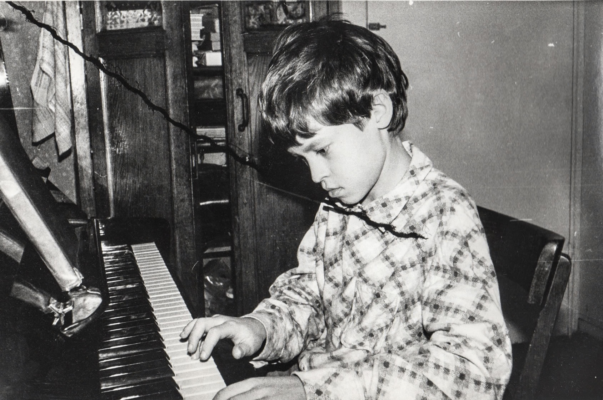

# 12. Be happy or Die! 

Краткие тезисы по главе

- [Автор начинает с того, что тяжелая музыка является настольно абсурдной и чрезмерной по сути, что напоминает Юмор.](#absurd_as_salvation)
- [По ходу текста будет упоминаться десятки композиций, на которых поставлены ссылки. Также они собраны в отдельный плейлист.](#playlist)
- [Предполагается, что склонность к энергетически заряженной и сложной музыке была во все времена и зависит от темпераментов, например.](#classic_and_metal)
- [Автор пытается на своём примере разобраться когда и как появились первые отношения с музыкой и это — Шерлок Холмс.](#call_of_music)
- [В 80е чтобы слушать понравившуюся музыку нужно было научиться её играть самому. Благодаря чему дома появилось пианино.](#first_musical_steps)
- [Первая кассета с heavy metal, как и первая сигарета, пришлась на подростковый возраст активного знакомства с взрослым миром.](#first_heavy_records)
- [Экстремальная скорость и плотность звука оказались ключиком для внутреннего мира автора, о чём он не догадывался ранее.](#to_the_extreme)
- [Этот момент совпал с грандиозными переменами в стране и обществе и, возможно, увлечение музыкой стало символом этих перемен и взросления.](#goodbye_ussr)
- [Оцифровка музыки и создание программы для печати вкладышей — следование Увлечениям становится работой и Счастья становится больше.](#lightning_strike_studio)
- [Смешение нескольких увлечений может иметь причудливые, например, диджей экстремальной передачи на радио.](#radio_lightning_strike)
- [Появление Интернет создало новую форму на стыке увлечений музыкой и программированием — сайт, который стал объединять людей друг с другом.](#musica_mustdie)
- [Автор погружается в рефлексию о противоречиях тяжёлой музыки и известных личностях, которые объединили в себе полюсы.](#people_with_opposite_poles)
- [Звучит гипотеза, что тяжелая музыка является признанием своих слабостей и протестом против апатии и лицемерия. Иносказательным.](#protest_against_hypocrisy)
- [Предлагается относится к музыке как к усилителю моментов Счастья, а к провокационным Смыслам в творчестве относится философски.](#lyrics_and_meanings)
- [Технологические инновации создают новые формы — попытка создать heavy metal GPT, вероятно, неудачная. Хорошо это или плохо и что будет дальше?](#genai_in_music)
- [Благодаря тяжёлой музыке появились друзья, сформировалось мировоззрение и случились тысячи моментов Счастья в записи и вживую.](#heavy_music_and_happiness)

## Абсурд: способ не сойти с ума в рациональном мире" 

Доведение до абсурда и крайностей — проверенный способ в юморе и также вполне в стилистике Heavy Metal. Эта глава о Счастье как раз про такую Музыку. Название "Be Happy or Die!" естественным образом пришло в голову как ассоциация на известный альбом задорной группы [S.O.D. — "Speak English or Die!"](https://music.yandex.ru/album/3060312). Пусть такое и будет. Творения экстремалов настолько ужасны с точки зрения этических норм и здравой логики, что всерьёз их лучше не воспринимать :-) И в целом такой совершенно иррациональный подход в творчестве меня, вероятно, как-то компенсирует, [рацио структурированного Архитектора](../analysis/sledovanie-prizvaniyu.md#architect_personality). А несдержанность и порывистость является и пороком и отличительной особенностью моего темперамента. Очень они мне понятны.

## Музыкальное сопровождение этой главы 


Во время написания этого текста в ушах всегда звучала музыка. Какие-то композиции были очень уместны моменту и я добавлял их в коллекцию, на которую оставлю тут [ссылку](https://music.yandex.ru/users/beer-bong/playlists/1004). Запустить воспроизведение лучше в случайном порядке. Также по тексту разместил единичные прямые ссылки, для примера.

Нисколько не ожидаю, что музыка будет нравиться кому-то ещё. Она созвучна моему темпераменту и моему восприятию мира. Замечательно, что мы очень разные. Считаю, что всерьез подобную музыку можно слушать только в хорошем качестве и на приличной громкости, которая чуть выше уровня, когда телефон предупреждает о потенциальном вреде для барабанных перепонок :-) HiFi усилитель и качественные наушники или колонки, на мой взгляд, обязательны.

Пишу этот текст в самолёте, где с сожалением обнаружил, что у меня не оказалось альбома S.O.D., скачанного на телефон. Но расстраиваться нет причин — ведь других таких композиций со смешением смыслов и стилей у меня всегда с собой сотни и тысячи. Для первого абзаца выбрал наугад джазовую композицию, доведенную до абсурда музыкантами из [Trepаlium - "Sick Boogie Murder"](https://music.yandex.ru/album/510493/track/4511235). Дальше Волна подберёт что-нибудь подобное. Поехали.


## Виртуозы в предыдущих поколениях 

Хочется начать с предпосылок появления энергетически заряженной и сложной музыки. Совсем издалека, с банальных истин. В Telegram группе нашего Текста неоднократно [поднимался вопрос](https://t.me/bongiozzo_discussion/1803) разности отношения к Счастью поколений Иксов, Игреков и прочих букв. Учитывать эту разность можно и нужно, но опираться на неё, строя выводы, на мой взгляд, не получится — ведь постоянно появляются новые особенности! А темпераменты, психотипы и реакции на жизненные ситуации, как раз, неизменны и повторяются из поколения в поколение. Уже вспоминал, как находясь в [раздумьях про батарейку жизненных сил](../analysis/stereotipy-schastya.md#battery_aziz) после лыжного похода в Хибинах, на посадке в самолет увидел надпись на толстовке одного из пассажиров, которая буквально пронзила сознание: "Злых людей нет, есть только люди несчастливые". До того пришлась к моменту эта банальная вечная истина, что я непроизвольно достал телефон и молча сфотографировал немало удивившегося попутчика. 


[Crisix — "Beast"](https://music.yandex.ru/album/20619354/track/98965714) заметно поднимает градус эмоционального настроя.


Все мы видим мир по своему. Сотканный из своих представлений, принципов, образов, воспоминаний, жизненного опыта и фантазий. Уникальный совершенно. Конечно же, реальность сильно отличается от наших проекций и создаёт определённую разность потенциалов. Если никуда не двигаться и не компенсировать эту разность, то этот дисбаланс будет доставлять раздражение и формировать образ Несчастье. Люди с хорошим воображением, [следующие своему Призванию](../analysis/sledovanie-prizvaniyu.md) и с достаточной батарейкой жизненных сил создают свои проекции в творчестве. В зависимости от дарования — в литературе, кинематографе, живописи, фотографии... список будет большой... И в музыке, конечно же. Созданные образы обогащают и гармонизируют видение уже реального мира и делают человека более сбалансированным и счастливым. Чем лучше получается, тем меньше удовлетворения доставляет повторение прошлых успехов. Приходит выгорание. Внутренняя потребность как зверь требует мощных компенсаций. У обладателей буйного темперамента образы скоре всего будут рождаться особенно энергичными. И если лет 300 назад влюбленные в музыку обладатели внутреннего огня становились скрипачами и пианистами, которых мы сейчас знаем как столпов классической музыки. Теперь с расширением палитры инструментов и многообразия стилей зачастую можем их видеть среди виртуозных мастеров технически сложного рок формата. Если присмотреться, то в основе музыки ставшей музыкальной классикой и экстремально тяжелой музыкой общего намного больше, чем различий.


[DeathOrchestra — "Spirit Crusher"](https://music.yandex.ru/album/11791580/track/70026997) Отличный наглядный пример как питерская группа Buicide совместно с симфоническим оркестром [создали проект DeathOrchestra](https://vk.com/deathorchestra) и исполняют музыку группы Death, прародителя этого музыкального стиля. На мой взгляд, сочетание очень гармоничное, что даёт основание для такой оценки.


## Появление тяги к музыке 

Но как же я дошел до жизни с экстремальной музыкой? С чего всё начиналось? 


Для следующего абзаца включается уже спокойная [джазовая композиция Orange Market](https://music.yandex.ru/album/552392/track/5010596), которая деликатными звуками прикосновений к струнам, клавишам и тарелкам как нельзя лучше дополняет ностальгически рефлексивный пассаж о предпосылках возникновения любви к такой музыке.


С того, что щуплым мальчиком-ботаником я жил преимущественно в своих мирах и мечтах, созданных бесконечной чередой книг из домашней и ближайшей детской библиотеки. Черные книги с золотистой птичкой и кроваво красным оттиском Конан Дойль сформировали в моём воображении образ Шерлока Холмса — рационала и логика до мыслимой крайности. Этот образ изначально восхищал и притягивал меня. Но воплощенный в кино Василием Ливановым (с которым, кстати, как говорили девочки в классе мы были похожи в юности) сделал образ самым любимым.

И вот сижу я 10 летним мальчиком под столом, потому что оттуда не так страшно смотреть фильм. Обнял себя за плечи и качаюсь от переживаний за самого близкого и дорогого героя. Страшный Мориарти, борьба на смерть, обрыв, жуть. Впитываю каждый кадр и каждый звук. Ну и когда всё кончено и Ватсон читает письмо своего погибшего друга — наступает катарсис, который на всю жизнь впечатывает в мозг звучащую в этот момент музыкальную тему Владимира Дашкевича. Этот мотив меня преследовал и на следующий день и через неделю не покидал. Так требовательно звучал снова и снова, что я практически начал требовать у родителей, чтобы они  купили мне какой-нибудь инструмент для воспроизведения этой мелодии :-) Был серьезный семейный совет и решение о покупке пианино родителями было принято. Забавно, что спустя 30 лет музыкальную тему уже другого Шерлока на фортепиано подбирала дочь. 


Сейчас играет [Мощь! — "Gipsy"](https://music.yandex.ru/album/25821871/track/113709574)


## Первые шаги знакомства с музыкой 

Если вложились в серьезный инструмент, то значит надо серьезно заниматься. И я почему-то сразу поставил блок на хождение в музыкальную школу по полному разряду и категорически не допускал даже мысли о посещении классов сольфеджио. Ограничился только занятиями игры на фортепиано. Причем просил, чтобы меня учили исключительно на любимых мною композициях. Фаворит - ["Полонез Огинского"](https://music.yandex.ru/album/15414628/track/74610022), простые в исполнении фрагменты ["Лунной сонаты"](https://music.yandex.ru/album/4904304/track/38375675), различные блюзовые мотивы типа ["Summertime"](https://music.yandex.ru/album/765207/track/7217441) — вот мой выбор. При этом никаких признаков гениальности я не выказывал. И также не собирался тратить на музыку [свои 10 тысяч часов](https://www.forbes.ru/forbes/issue/2009-04/7255-pravilo-10000-chasov), чтобы отточить технику исполнения и стать самарским Джоном Леноном или [Estepario Siberiano](https://www.youtube.com/@ElEsteparioSiberiano). Как только начинало получаться — интерес пропадал. Мне важно чтобы музыка была в моей жизни и не так важно кто её будет исполнять — я сам или магнитофон. Так я перестал ходить на занятия и спустя 4 года, ближе к 8 классу старшей школе, пианино преимущественно собирало домашнюю пыль. 


Звучит гротескно концентрированный агрессивный образ Злобы, неизменно вызывающий мурашки входя в резонанс с внутренним энергетическим ритмом
[Nekrogoblikon — "Darkness"](https://music.yandex.ru/album/5094539/track/39139507)


Завершение учебного года в 8-м классе, осталось пару дней до конца четверти. Оставаясь таким же ботаником-очкариком, стою зажатый в угол стаей шпаны из 7 класса. Из-за усиливающегося звона в ушах оскорбления уже не воспринимаются. В глазах пелена, рука в кармане сжимает шилообразный ключ, перед глазами ухмылка на лице самого наглого. Планка падает, удар, кровь из пробитой щеки смывает ухмылку, на лице уже ужас и страх, замешательство и аккуратный расход с криками: "Жди, сука, мы тебя встретим и уроем!" Ситуация замялась, но после этого случая мысль о том, что мне ещё 2 года ходить в среднюю школу номер 2, как заноза вызывала тянущую тоску, несовместимую со Счастьем. И я придумал, что к следующему году мне надо обязательно сменить учебное заведение. На как можно более дальнее :-) Сам изучил объявления в газетах и нашёл набор в только-что открывшуюся экспериментальную школу, которые только начали появляться в конце 80х. Мама не была против и вот я уже езжу в школу в центр города на трамвае. Тратя по 2 часа в день на дорогу. Отношения с друзьями из моего микрорайона, с которыми мы ходили в походы хоть и сохранились, но резко сократились. Решение это было совершенно бредовое, но я ничуть о нём не сожалею. Как впрочем и о других.


И сразу следом контрастная, но такая же тёмная мистическая интерпретация образа Вселенского Зла-а-а-а...
[Brides of Lucifer — "Burn in hell"](https://music.yandex.ru/album/5474654/track/41679609)


## Первые тяжелые кассеты 

Вот я в классе, где нет ни одного... не то чтобы друга — ни одного знакомого! Одноклассники все какие-то разношёрстные, сильно отличаются от усредненного уровня спального района, в котором я вырос. Один парень впрочем очень сильно выделялся — держался и с одноклассниками и с преподавателями уверенно и даже дерзко, носил длинную чёлку, курил и слушал Метал! Уж не помню, как оказалось, что я взял у него кассету послушать. Музыку я любил и мне было интересно. Кажется был там [Manowar 1988](https://music.yandex.ru/album/60696/track/566892) и [Running Wild 1988](https://music.yandex.ru/album/413026/track/3692164). Было любопытно и свежо. Сильно отличалось от того, что слушал мой старший брат — Высоцкий, Abba, Boney M и Pink Floyd, как самое тяжелое для восприятия. Но брат, старше меня на 9 лет, был уже самостоятельным и к музыке относился довольно серьезно. Была у него совместно с отцом собранная достойная аппаратура — катушечный магнитофон Орбита 106, кассетный магнитофон Вильма 204, вертушка для пластинок Арктур 006, усилитель Бриг 001 и колонки 35 АС90. Настолько трепетно относился, что эта техника и по сей день у него работает и поёт. Одноклассники могли только мечтать о таком комплекте. А для инструментальной музыки качество звучания крайне важно и с такой техникой грех было не подняться на ступеньку выше и вместо кассеты сомнительного качества попробовать самому сделать мастер копию с настоящего винилового диска. Или пласта, как тогда говорили. Достать правильные пластинки можно было только на толкучке. По выходным на Туче, в леске на окраине города, или по будням в центре около магазина Мелодия. Выменивал и договаривался с взрослыми мужиками о прокате пластинки, что позволяло дома сделать качественную копию. Кстати, одного из самых ярких персонажей той тусовки [недавно вспомнил по грустному поводу](https://t.me/bongiozzo_discussion/1650)... А когда у меня начали появляться качественные записи и интересные связи — ко мне домой потянулись новые друзья. 


Звучит [At the Gates — "Blinded by Fear"](https://music.yandex.ru/album/2148775/track/19167314).
Почему-то очень особняком для меня стоит группа с философским названием У Врат. Есть какой-то нюанс в тембре вокала, создающий ощущение крайнего отчаяния.


## До невообразимого предела! 

Довольно скоро после того как я оценил Manowar, Антон (так зовут этого парня) с улыбкой предложил мне кассету с надписями от руки [Death](https://music.yandex.ru/album/1977117/track/5667122) и [Obituary](https://music.yandex.ru/album/16770/track/169102). Улыбку я прочитал как — тебе такое вряд ли понравится. И я заранее приготовился... Но, признаться, не ожидал, что меня накроет настолько вязкой и тяжёлой пеленой звуков из гитар, бочек и совершенно нечеловеческого вокала. Как воскликнула мама моего другого друга, заглянув в комнату к сыну: "Господи Боже! Да он же срёт через рот!". Извините, но именно так она и сказала. Невозможно было поверить, что такое вообще можно слушать. Это сейчас каждый видел или слышал что-то подобное в Интернет. А в 1991м ещё даже в проекте не было фильма [Ace Ventura](https://www.kinopoisk.ru/film/2868), благодаря которому российская общественность, имеющая доступ к видеосалонам, могла бы узнать о существовании такого жанра музыки как extreme death metal и смогла услышать и увидеть Это в одно-минутном эпизоде комедии... С широко раскрытыми глазами я слушал кассету снова и снова пока в какой-то момент мощнейший кач не заполнил меня изнутри до кончиков пальцев и не совпал в такте и тембре с моим внутренним мотором, качающим бензин жизненных сил. Совершенно гармонично и в унисон, как хорошо слаженный механизм. И в этот момент я почувствовал себя в полном порядке. Оказывается, я так скучал по этому состоянию, которого никогда до этого не ощущал. Этот момент ни с чем перепутать нельзя. Он сопровождается мурашками по коже и онемением в руках и ногах. Момент полнейшей гармонии, иррационального счастья и полёта.


[Siberian Meat Grinder — "Fukk your life"](https://music.yandex.ru/album/2868504/track/24566283) наши соотечественники, в между прочим. Думаю, что они чувствовали в своей Сибири, что-то похожее описанному мною в следующем абзаце о Самаре.


## СССР и хождение строем — как все 

Этим моментом жизнь была поделена на две части — До, когда Metallica считалась тяжелой группой, и После, когда они стали успешными шоуменами. Был запущен бесконечный процесс поиска новых форматов и звучания. Иррациональный процесс Любви к определенному виду творчества и искусства. Объективно это увлечение было крайне редким и недостатка в своей индивидуальности я юношей не ощущал. В нашем закрытом промышленном городе для того, чтобы встретить другого такого же фаната нужно было 30 минут идти пешком. Причем осмелиться при этом носить длинные волосы на улице готовы были единицы. Один раз мне их жгли зажигалкой рядом со 2й школой, после чего, выкрутив руки, притащили домой и требовали с матери выкуп — она как-то убедила этих борцов за нравственность, что сейчас всё будет, смогла закрыть дверь и больше не открывала — не из таких ситуаций выходила в своей послевоенной молодости. Другой раз убегал в ночи от добрых людей с ножами. Убежал. Другой раз не убежал, но они обошлись тем, что меня просто попинали. При этом так и не научился держать язык за зубами. Если из стайки лузгающих семечки раздавалось: "Эй ты, пидорас патлатый!" я непременно входил в ступор и онемевшими губами рассказывал, что о них думаю. А драться я как раз не умел. Мог душить и даже задушить, а драться — нет. Глупо, в общем. Возможно где-то в глубине души моё увлечение воспринималось как протест и вызов закостеневшему образу уходящего времени СССР. Хотя вряд ли, меня просто несло в потоке. Тут сопереживать надо было этим ребятам, кто гонял меня по микрорайону. Им, вероятно, в глубине души уже было понятно кто из нас уходящее прошлое. В страхе и непонимании идущих полным ходом перемен они пытались срезать первые ростки свободы, такой непривычной для их уклада жизни. В Москве и свеже-переименованном Санкт-Петербурге ситуация была на тот момент уже другая. Там я спокойно выпускал свои лохмы наружу. А уж когда приезжал за партией новых альбомов и вливался в поток патлатых неформалов от метро Багратионовская до ДК Горбунова (до Горбушки) — вот тогда было уже чисто конкретно концентрированное Счастье сопричастности! :-)


[In Flames, Pendulum — "Self vs Self"](https://music.yandex.ru/album/62581/track/586180) аж закусываю губу от удовольствия когда плеер выбирает этот трек. Мурашки по коже обеспечены на переходах и пассажах между драм-н-бейс Pendulum и metal "драйвовыми" гитарными рифами In Flames.  


## Студия Lightning Strike 

Задолго до того, как [начал оцифровывать Время, Здоровье и Деньги](./upravlenie-na-osnove-cifry.md#time), начал оцифровывать Музыку :-) Вносил в базу на Microsoft Access альбомы всех групп своей дискографии. Зачем? Чтобы сделать красивые, распечатанные вкладыши в кассеты. Где будет название группы, альбома, трек-лист, состав музыкантов. В общем всё свое время я направил не на игру на инструментах, а на смешение своих увлечений — программирование и коллекционирование и изучение музыкального жанра. Такие кассеты быстро захотели себе в коллекцию металлисты Самары и я начал записывать их под заказ. Уже пару лет на тот момент как я профессионально зарабатывал программированием и на вырученные деньги с одного увлечения купил несколько двухкассетных магнитофонов Санда 207 для другого увлечения. Название студии Lightning Strike было выбрано открытием большого англо-русского словаря и тычком пальца наугад.


[Arch Enemy — "The Eagle Flies Alone"](https://music.yandex.ru/album/4631898/track/36367623) улётная совершенно деваха Алисса Уайт-Глаз. Очень эффектно выглядит на концертах и в клипах, добавляя дополнительное удовольствие. Всегда забавно вспоминать, что она веганка и активный защитник природы с невероятно мясным женским вокалом.  


## Радиопередача Lightning Strike 

Отбоя от желающих не было, но я мог больше и надо было обеспечить какое-то продвижение для своей студии. Тогда из доступных информационных каналов было только радио. Никакого Интернет в помине не было :-) Была федеральная передача Рок-наряд, начинавшаяся чрезмерно веселеньким и легкомысленным, на мой вкус, призывом "Становись ребята в ряд, начинаем Рок Наряд!". Это был единственный источник, из которого можно было услышать что-либо новое, если специально не ездить в Москву. Формат у передачи не сказать, чтобы был тяжелым — треш уровня Metallica — верх мечтаний. Недолго думая пошел в офис только-что появившегося местного Радио-Самара-Максимум на краткую встречу с директором Константином Лукиным:
— А можно я займу воскресный вечерний эфир экстремально тяжелой музыкой на 1 час и ничего не буду за это платить, ровно как и сам ничего не ожидаю в оплату?
— Можно!


[Napalm Death — "Unchallenged Hate"](https://music.yandex.ru/album/3919686/track/32197564). Экстремалов всяких множество, но слушать их всерьез я не могу. А Napalm всегда оставался на грани, которую я слушал с удовольствием. Картинку дополняют оригинальные образы бесноватого Барни и потрясающего Shane Embury, написавшего книгу, которую было бы интересно прочитать.


Так появилась самарская версия Рок-Наряда — передача "Lightning Strike" и довольно быстро моя повседневная жизнь перестала напоминать жизнь обычного студента. Круглосуточно крутящиеся магнитолы на запись новых кассет, транспортировка их в одноименный магазинчик в центре города, сбор новых заказов, еженедельные поездки в Москву за новинками и запись передач для радио в воскресенье. Зачёты и экзамены на тройки-четвёрки я как-то умудрялся сдавать не посещая лекции. Программирование я знал на практике лучше преподавателей, хотя доработки системы для учета заказов и выручки становились всё реже. Из того времени больше запомнились попытки выработать свой уникальный диджейский growling голос с помощью ледяного пива и папирос :-) Зачастую раздолбайски записывал передачу в самый последний момент и залетал в студию за минуту до начала эфира. Денег уже тогда на втором курсе зарабатывал больше мамы, с которой мы жили вдвоём. 


[Subtype Zero — "Ethereal Spirit"](https://music.yandex.ru/album/10182221/track/63795887) Практически идеальное сопровождение к рабочему потоку — очень совпадает с внутренним ритмом.


 ## Сайт Musica Mustdie 

На третьем курсе университета, после 3х лет успешного развития студии, начало закрадываться впечатление, что эта деятельность всё дальше и дальше от [моего Призвания](../analysis/sledovanie-prizvaniyu.md#architect_personality), связанного с Программированием. Его становилось в моей жизни всё меньше, а образ жизни становился всё более богемным. Да и мозги как-то начали размягчаться, что могло сказаться на сдаче экзаменов. Жизненная ситуация в тот момент подтолкнула к тому, чтобы прийти на кафедру вычислительной техники и устроиться на работу оператором компьютерного класса. Всё таки когда я садился за компьютер, включал зеленоватый экран и видел мигающий курсор консоли — я тоже испытывал иррациональное чувство Счастья. Покупать свой комп тогда было всё ещё неоправданно дорого, да и хотелось общения, которого дома не было бы. При смене занятия круг общения опять сильно поменялся. А через год, когда я освоился среди компьютерщиков нашего университета, появился первый канал Интернет на всю Самару с пропускной способностью аж целых 19 килобит (тут всё верно с цифрами). И управлял этим каналом преподаватель с нашей кафедры. Мне удалось попасть в компанию из 5 студентов, которые были допущены до этой диковинки и тогда для меня-программиста открылась целая бездна возможностей создания новых веб систем. Но истории первых дней компании Самара-Интернет, Вебзавода, Mustdie.ru и SamaraPub связаны с Призванием в разработке информационных системах, а эта история про Музыку. 


[Slayer — "Seasons in the Abyss"](https://music.yandex.ru/album/2481130/track/125619) любимая группа, один из самых любимых треков.


В конце 90х база данных с дискографией была перенесена с Microsoft Access на MySQL, к которой мы с друзьями на Perl сделали "симпатишный", кроваво-красный сайт с "блекджеком" и форумом на нашем фирменном домене mustdie.ru. В одну из поездок в Москву на Горбушку познакомился с ребятами, которые продавали диски и выпускали дайджест по новинкам тяжелой музыки. Предоставил им площадку для торговли и публикации новостей, по сути, бесплатно. Зарабатывать на этом не получалось. Зато спустя год российские металлисты с доступом в Интернет тусили на нашем Musica Mustdie — договаривались о встречах, обсуждали любимые группы и альбомы, открывали для себя новую музыку и всячески чудили, придумывая всякое. Например, Гриборыба. Помню было довольно круто услышать в толпе на Горбушке или в потоке металлистов с метро Багратионовская: "А вот вчера на Мастдае прочитал про новый альбом...". В такие моменты плечи расправлялись, а нос подлетал вверх :-) Пару раз бывал на разгульных тусах завсегдатаев сайта, когда вырывался на несколько дней в Москву.

Вот такой был путь следования и смешения своих увлечений — тяжелой музыки и оцифровки знаний о ней.


[Хрен — "Русская водка"](https://music.yandex.ru/album/29772550/track/43376432) — вполне бы подошла как музыкальное сопровождение встречи металлистов в парке Фили после закупа новинками на Горбушке.  


## Люди, объединившие в себе разные полюсы 

Всё таки этот Текст не про мои воспоминания, а про восприятие Счастья в контексте музыки. И приведён мой опыт тут исключительно для лучшего понимания цепочки моих рассуждений об основном предмете. Поэтому возвращаюсь к основной теме Счастья и образов с ним связанных.

Будучи 20 летним парнем не помню, чтобы я задумывался о каких-то этических вопросах при прослушивании [Slayer](https://music.yandex.ru/album/1081748/track/125615), который остаётся моим самым любимым музыкальным коллективом по сей день. Круто и круто! Но вся эта атрибутика с перевёрнутыми крестами с какого-то момента начала вызывать беспокойство — никакого желания как-либо быть причастным к оккультному мракобесию отродясь не было. В конце концов, если себя спросить: Я хороший? Хороший :-) Есть во мне подростковый протест-нигилизм? Да, пожалуй, что нет, у самого дети взрослые. Но нужна мне эта энергетика и даже агрессия, чтобы себя же раскачать для решительных действий. И вот начал я разбираться... На концертах [Cradle Of Filth](https://music.yandex.ru/album/167399/track/1685727) или других похожих группах с акцентированной сатанинской тематикой всё это воспринимается как страшилки из фильмов ужасов. Шоумены. Музыка скорее нравится, посмотреть забавно, но всё это совершенно несерьёзно.


[Jane Air — "Моё сердце сейчас это открытая рана"](https://music.yandex.ru/album/15230265/track/28590780) узнал о существовании этой крутейшей питерской команды только когда начал работать Петербурге в 2020 году :-)


Скандинавские радикалы, которые перешли к перестрелкам и сожжению церквей на примере Burzum/Mayhem мне были любопытны скорее в контексте исторических перекосов с миссионерством в этой местности, где сравнительно недавно население было погружено в собственный богатый эпос. Ну и наложились отклонения в психике у отдельно взятых экстремистов. Есть про эту и другие истории [прекрасные документальные](https://www.kinopoisk.ru/film/227226/) и [художественный фильм](https://www.kinopoisk.ru/film/909809/). Хотя лучше не забивать голову историями про единичные исключения, а посмотреть [забойную комедию "Тяжелая поездка"](https://www.kinopoisk.ru/film/1094255/), которая лучше всего передаёт отношение к этой музыке.

Некоторые американские группы типа [Morbid Angel](https://music.yandex.ru/album/3392794/track/28358449) упоминались как участники популярного ещё в 60-70е годы течения американских сатанистов и его лидера с русскими корнями Антона Лавея. Благодаря этому факту разбирался с этой историей и для себя отметил, что течение базировалось на доведенных до крайней степени принципов эгоцентризма, релятивизма и [культа интеллекта, о чем ранее упоминал в стереотипах о Счастье](../analysis/stereotipy-schastya.md#intelligence_quotient). Всё относительно, всё можно подвергнуть сомнению и обесценить, ты и есть центр мира, будь умным, культурным и грамотным, чтобы обеспечить себя всем самым лучшим здесь и сейчас. Если прочитать эти же слова без контекста о том, что это основные ценности сатанистов, то они вполне могут сойти за ценности современного образованного человека :-) В целом любопытно, для общего развития, но углубляться дальше никогда не было интереса.


[Blackmore's Night — "Greensleeves"](https://music.yandex.ru/album/12421096/track/2424120) — прекрасное исполнение песни, которой исполняется в этом году 444 года.


А вот поразмышлять о судьбе отдельно взятых ярких личностей из мира музыки было всегда интересно.

[Биография Оззи Осборна великолепна](https://www.livelib.ru/review/3752326-ya-ozzi-vsjo-chto-mne-udalos-vspomnit) и очень многое объясняет. Крайне непростое детство в бедном и унылом послевоенном окружении, дислексия, уникальная сопротивляемость разрушительному действию наркотиков, которая позволяла их употреблять ведрами в стремлении усилить ощущение Счастья, ранняя известность и сказочное богатство создали такие фантастические перекосы в темпераменте и образе мыслей, что остаётся только удивляться как он глубоко внутри оставался любящим мужем и отцом. Ну, когда был в относительно трезвом состоянии, конечно же. Что бывало нечасто. Жизнеописание забавное, очень искреннее и открытое. Оккультизм альбома [Black Sabbath](https://music.yandex.ru/album/25859352/track/61330939) из 1970 года был из серии страшилок фильмов ужасов. Ребята весело проводили время, а когда душные "настоящие" сатанисты пытались как-то вовлечь Оззи в свои ряды — были неизменно посылаемы в известном направлении. В общем трогательный он, юморной и искренний дядька, рассуждения которого в последних главах очень близки по духу.


[Fleshgod Apocalypse — The Violation](https://music.yandex.ru/album/7169120/track/3567617) — величественное, для меня практически классическое произведение с сумасшедшим ритмом. Долго такое я и сам слушать устану. Но очень нравится.


Другой, уже американский "тёмный принц" с французскими корнями, Элис Купер. Его ["Poison"](https://music.yandex.ru/album/68190/track/634157) неизменно исполнялся нестройным хором участников всех наших тусовок из 90х. Хоть и понятно, что Купер прежде всего шоумен, но всё же до крайности вызывающий и мрачный — совсем не белый и пушистый. И я немало удивился, когда  узнал, что он [принципиально верующий человек](https://youtu.be/rzwuQtoY74Q?si=gyMnWovOmrm3YLaz&t=1344). Было интересно послушать как у него совмещается, казалось бы, несовместимое — демонический внешний образ и глубокий внутренний мир христианина. А его высказывание, что пить пиво и разнести номер может каждый, а быть рокером и христианином настоящее бунтарство — вообще, звучит как серьезный вызов :-) И если [Johnny "Man in Black" Cash](https://music.yandex.ru/album/18532271/track/92472818) открыто и искренне нёс христианские принципы, то Alice "Prince of Darkness" Cooper, помогающий спастись от зависимостей множеству музыкантов — не менее великий дядька, который при этом не сильно распространяется о своём внутреннем мире и принципах.

Один из таких метал музыкантов, ставший крестным сыном Купера — легендарный Dave Mustaine, стоявший у истоков Metallica и создавший Megadeth. Очень нравится [его едкое и жесткое творчество образца 86-88 года](https://music.yandex.ru/album/228095/track/2300613). Заряжало энергетикой быстро и гарантированно. В 89м году он становится принципиальным и последовательным христианином, уверенно делит музыку своих собратьев на правильную и неправильную, тем самым, видимо, пытаясь как-то утихомирить своих бесов. После 92го года его творчество, почему-то, уже не вызывает такого интереса как раньше. Внутренний огонь погас? Всё это, конечно же, очень субъективно и поверхностно, но мне так откликается. Johnny Cash звучит в этой роли очень органично, а вот Dave Mustaine не совсем. Очень надеюсь, что сам Дейв при этом в балансе и счастлив!


[Carcass — Corporal Jigsore Quandary](https://music.yandex.ru/album/3919685/track/32197551) максимально отталкивающие и повсеместно зацензурированные тексты с прекрасной мелодикой. Не знаю, смог бы я их слушать с таким удовольствием, если бы понимал слова на слух :-)


Совсем другой загадочный христианин Том Арайя из Slayer. Прищур, хитрая улыбка, антиклерикальные тексты и сногсшибательная волна агрессии, которую музыканты неизменно выдают на протяжении всей своей карьеры. Музыка с любого альбома, включая поздние, выдергивает меня из любой хандры и заставляет быстро переключиться на рабочий ритм. И отношение Тома к дилемме между его внутренней системой ценностей и исполняемыми им песням мне нравится: "Если наши песни заставляют вас поколебаться в своей Вере и Любви к ближнему (т.е. и к ним в том числе) — то что-то не так с вашей Верой! ;-)". Хитрый Арая :-)

Каждый по разному [компенсирует внутри себя противоречия и полюсы](./personalnaya-sistema-cennostei.md#dualism), по разному создаёт разность потенциалов, умеет раскачивать себя и излучать разный уровень энергетики.


[Pythius, Black Sun Empire — "Kepler"](https://music.yandex.ru/album/10530008/track/65174178) когда немного устал от жужжания гитар, но хочется могучей энергетики 


## Открытый протест против Баланса и Лицемерия 

Но всё же есть одна черта в их образах, которая всех их объединяет — экспрессия и явное нежелание оставаться в творчестве сбалансированными и умеренными. Такими мы уже являемся большую часть времени в реальной жизни. И постоянно быть в балансе несвойственно человеку. Мы как часть Природы также подвержены Штормам и Землетрясениям. И стоит научиться во время этих катаклизмов не разрушать ничего ценного — здоровье или отношения. И эта энергетика дисбаланса необходима для созидания в том числе. Человек в балансе теряет мотив менять окружение к лучшему. Очень похожий и банальный вывод про Счастье, которое [невозможно испытывать без периодической грусти, упадка сил, тоски или даже депрессии](./schaste-kak-predmet-srednei-shkoly.md#model_in_practice).


Когда подбирал слова для этого абзаца, друг, который дал мне первую кассету, неожиданно прислал мне ссылку на видео про иллюзорность нахождения в балансе. [А Yandex-GPT собрал смыслы этого видео в краткие Тезисы](https://300.ya.ru/v_wXyBjhw9) — очень своевременно и удобно, учитывая, что я не люблю смотреть видео, но люблю читать.

А Яндекс Музыка врубила [Гробовую доску — "Дайте водки!"](https://music.yandex.ru/album/27109679/track/116728359)


Иногда в общении попадаются умершие уже при жизни люди, который впали в Апатию, им уже всё равно. Таких наверное немало, просто мне не часто попадаются. Обычно встречаются те, которые точно знают как ДОЛЖНЫ поступать другие, что Правильно, а что Нет. Такие собеседники обычно не сомневаются и не особо следуют формату диалога Вопрос-Ответ, но пользуются расхожими штампами и догмами. Иногда, на мой вкус, с неподтвержденным опытом, что такие действия приводят к Счастью. Они могут оставаться спокойными и даже доброжелательными. Но чувствуется, что это зачастую маска, за которой скрывается совершенно другой образ. Образ несчастливого человека, который теряет Веру, боится глубоко взглянуть внутрь для серьёзного разговора с собой и ищет опоры в ДОЛЖЕН формулировках применительно к окружению. И мне кажется, что Любовь как и Огонь уходят из жизни когда слишком часто возникает слово Должен в отношении других. Вот мне почему-то кажется, вероятно довольно наивно, что металлисты и разные другие экстремалы от музыки видят своё творчество как естественный протест против Апатии, Лицемерия. Они далеко не идеальны (как и все мы), но им не всё равно.


[Hypocrisy — "Eraser"](https://music.yandex.ru/album/1439663/track/13239149) — Пётр Тагтгрен — музыкант, которого скорее всего назову одним из первых, если меня попросят назвать любимых.


Да, мы люди. Пусть мы созданы, чтобы [двигаться к духовному идеалу](./personalnaya-sistema-cennostei.md#human_as_god). Но нас постоянно разрывают на части и испытывают на прочность разные соблазны и слабости. Гордыня, Лицемерие, Пьянство, Жестокость, Жадность, Страх, Лень, Похоть, Грубость... Вокруг этих историй обычно и строится творчество металлистов. Раньше эти пороки назывались бесами и суть это слово довольно точно передаёт, т.к. они изначально являются внешними и чужеродными для нас объектами, но у каждого из нас найдётся свой "любимчик". И мы лучше максимально открыто признаемся себе и окружению нашим творчеством, что так оно и есть. Даже намеренно сгустим краски до абсурда, чтобы не сглаживать углы по принципиальным и важным вещам и не прятаться за маской, что ничего этого с нами не происходит. Это эмоциональный, иррациональный, несдержанный, но максимально честный и открытый подход, который лично мне откликается. 


[Dark Lunacy — "Aurora"](https://music.yandex.ru/album/4147817/track/33869492) — Эй Ухнем! Интересное смешение русской классики и death metal. Первый раз услышал во время написания этого текста.


Сравнительно недавно в разговоре со священником, которому я довольно системно изложил свои размышления по этому поводу, прозвучало: 
> - Сама музыка, её ритм и звучание не может являться чем-либо плохим. Важно какое влияние она на тебя оказывает и на какие поступки тебя толкает. 

И тут я спокойно выдыхаю. Если мне не хватает энергии, тяжеляк меня неминуемо бодрит. Если я испытываю раздражение в связи с какой-то ситуацией — позволяет выпустить пар и успокоиться. Объективно, только плюсы.


[Pain — "Coming home"](https://music.yandex.ru/album/7284030/track/51968432). "Боль" — второй известный проект Петра Тагтгрена после его брутального "Лицемерия" :-) А трек "Возвращение домой" практически всегда вызывает глубочайшую реакцию и мурашки — уж больно он резонирует, когда иду по Ваське в сторону метро, чтобы доехать до Пулково и улететь в Самару, домой. Если рядом не так много прохожих могу позволить себе раскинуть руки как самолет и петь вместе. Не отказываю себе в таком моменте Счастья :-) 


## Слова и смыслы 

И для меня музыка это, всё таки, не про Смыслы, но про усиление ощущения момента Счастья. Ритм, риффы, тембр, мелодия, полифония, плотность, детализация, качество звука — всё, что имеет отношение к звучанию, входит в гармонию с моим внутренним миром в моменте и раскрашивает его дополнительными красками. [Мыслительные процессы, запускаемые нетривиальными смыслами текстов, скорее отвлекут меня от переживания настоящего момента счастья](../analysis/stereotipy-schastya.md#power_of_now), связанного с моим текущим занятием. Возможно по этой причине 99% моего репертуара состояло из зарубежных исполнителей, у которых смыслы песен не воспринимаются на слух, но голос являются эмоционально окрашенным инструментом.

Весь русский рок прошёл мимо и только в 2011 вдруг неожиданно и сильно зацепили несколько песен Юрия Шевчука. Прежде всего ["Где мы летим?"](https://music.yandex.ru/album/358057/track/3403742), которая погружала меня в комфортное размеренное состояние. Кажется, прежде всего потому, что текст больше похож на поток сознания, чем на какую-то логическую конструкцию. ["Песня о свободе"](https://music.yandex.ru/album/358058/track/3403751) стала хорошим боевиком для рабочего потока, ["Галя ходи"](https://music.yandex.ru/album/5450420/track/41554595) стоит особняком, "попадает в сердечко" и цепляет именно смыслом. ["Стая"](https://music.yandex.ru/album/24387038/track/110033569) очень гармонично и с мурашками по коже зашла под события, которые 2 года назад мы начали горячо обсуждать. Крайне неожиданно всплыл и саданул по сердцу древний трек ["Зло"](https://music.yandex.ru/album/3778514/track/31182552) от практически забытой, но горячо любимой на тусах когда-то Дискотеки Авария.


[Mister X](https://music.yandex.ru/album/7392416/track/52495787) — Яндекс Волна предложила какую-то гремучую попурри. Но мне такое нравится, особенно Freestyler.


После блокировки SWIFT в streaming сервисе Яндекс Музыки под мои предпочтения всё чаще стала появляться ранее незнакомая тяжелая музыка с русской речью. Был приятно удивлён — звук достойный, тексты не вызывают испанский стыд, который я испытываю, когда авторы компенсируют скудный словарный запас матом. И не слишком кринжово, чтобы из [Потока выбивало](../analysis/sledovanie-prizvaniyu.md#frequent_happiness), как Коррозия Металла, например :-) Как и в отечественном кинематографе в музыке для себя лично за последнее время увидел долгожданный прогресс и интересный для себя материал.

Цензура, [которая по моему глубокому убеждению совершенно уместна в определённых вещах](./personalnaya-sistema-cennostei.md#noble_curiosity), вроде не перегибает палку и уже не вернёт нас в крайне полярную ситуацию, когда в стране якобы не было секса :-) Если цензурой пытаться ограничивать сам факт существования пороков и зажимать жёстко, то меньше их от этого не станет. Забавный факт — [люди смотрят порнографию больше в тех штатах, где более консервативная политика и применяется цензура](https://www.livelib.ru/quote/46769833-ne-otorvatsya-pochemu-nash-mozg-lyubit-vsjo-novoe-i-tak-li-eto-horosho-v-epohu-interneta-adam-alter). Идеально, когда творчество помогает взрослому человеку принять себя, выпустить пар и при этом не создает перекосов в мировосприятии у детей. Всё это сложно. Нужно искать балансы. Для себя лично последнее время применяю следующий подход: как только у меня в речи проскальзывает слово ДОЛЖЕН в отношении кого-либо, значит мой подход, скорее всего, примитивный и я сразу же начинаю искать формулировку, в которой тот же посыл будет выражен через слово с корнем ЛЮБ. [Полезный якорь и практика для увеличения Счастья в своей жизни](../analysis/stereotipy-schastya.md#frequent_happiness). Обычно получается :-)


[Микаэл Таравердиев — "Снег над Ленинградом"](https://music.yandex.ru/album/2227370/track/19766780) — ничто человеческое мне не чуждо. И прекрасные мелодии Таравердиева зачастую перемежают пулеметные бласты бочек и сирены гитар. 


## Искусственный Интеллект в Музыке 

Сайт [Musica.Mustdie.Ru](http://musica.mustdie.ru) изначально не создавался для извлечения выгоды, но был иррациональным порывом. Ребята, которые занимались продажами, переехали в сообщества социальных сетей, следуя общей тенденции миграции информационных потоков. Вот, например, [сообщество Musica Mustdie ВКонтакте](https://vk.com/mmustdie). Сайт тихо умер своей смертью в 2019 году в отсутствии интереса его развития от создателей, просуществовав 20 лет на чистом энтузиазме пользователей. Неплохо. И вот спустя 7 лет внезапно появился запрос о покупке домена musica.mustdie.ru от человека, который испытывал тёплое чувство ностальгии и хотел возродить некогда крутой сайт. Домен, коды и бекап базы данных лежат в архивах и сделать это нетрудно. Может быть я и неправ, но думаю, что делать этого не стоит. Надо искать новые форматы. 

Решил попрактиковаться в создании Generative Pre-trained Transformers (ChatGPT, Gemini, Large Language Model и вот это вот всё). Благо в базе больше полумиллиона текстовых размеченных заметок, как либо имеющих отношение к тяжелой музыке, которые можно использовать для тренировки LLM. Подготовил 8 с лишним тысяч текстовых файлов о музыкальных стилях, группах, альбомах и связанных с ними комментариями фанатов. [Выложил всё это накопленное богатство в публичный GitHub](https://github.com/bongiozzo/musica_mustdie/) и запустил генерацию модели для собственного ChatGPT, благо что NVidia сильно упростила эту задачку для энтузиастов выпуском [Chat with RTX](https://www.nvidia.com/en-us/ai-on-rtx/chat-with-rtx-generative-ai/). 

В общем выполнил я свой инженерный запрос и сам разобрался с темой создания простых генеративных моделей и можно дальше её оптимизировать, уточнять, настраивать, тренировать. Но не хочется. Не хочется и совсем неинтересно иронизировать, дурачиться и провоцировать в разговоре эту железку. Не создаст новых отношений и не сделает меня это богаче в спектре испытываемых эмоций и ощущений. 

> [Человеку нужен Человек! Pulsarum — "Solaris"](https://music.yandex.ru/album/16600912/track/86415377)

Поэтому, мне кажется, что настоящее творчество, как способ общения людей друг с другом, в какой-то степени защищено от стремительно растущего применения Искусственного Интеллекта. Во всяком случае, творчество, в котором есть Огонь и Любовь. А вот [фонограмщину и халтуру](https://music.yandex.ru/album/168141/track/1695510) в творчестве эта технология убьёт обязательно. Но это как раз и не пугает :-)

## Тяжелая музыка и Счастье 

Пора завершать этот поток рефлексии. Совершенно уверен, что без своего любимого тяжеляка я был бы куда менее счастливым человеком. Благодаря музыке появились знакомства переросшие в дружбу. Не произошло бы множество причудливых историй. Бесчисленное количество моментов счастья и мурашек по коже было испытано за всю жизнь и я, конечно же, глубоко благодарен музыкантам, которые всё это придумали и выдали в мир :-)

По возможности хожу на концерты и даже если сам не лезу в мясорубку mosh pit (за фотоаппарат, как минимум, переживаю, хотя это отмазка гнилая), то очень хорошо понимаю как от этих ребят в этот момент отлетают "бесы", которых они нахватались в нашем "приличном" обществе. Выпускают пар по полной без особых последствий для себя и окружения. Радуюсь и невольно улыбаюсь, когда на них смотрю :-)


[Infiltration — "Predator"](https://music.yandex.ru/album/23773124/track/108032260) музыканты живут, как будто бы, в другой реальности. С ними пересекаюсь только через их творчество. Но иногда случаются исключения.


Узнал о Infiltration когда сразу 2 сотрудника [команды "Я Здесь Живу"](./ya-zdes-zhivu.md#mini_app_vkontakte) пришли на работу в майках с этой неизвестной мне ранее надписью. Жесткий, плотный, техничный звук. Стараюсь смешивать свои увлечения — и помимо оцифровки данных о музыке ещё фотографирую на концертах. Фотографии продлевают и расширяют спектр моментов Счастья ещё и хорошими воспоминаниями после выступлений.

Яндекс Музыка недавно познакомила с творчеством Сергея Сорокина, лидера Гробовой доски. Неожиданно подтекст песен отозвался. Нетривиальные. Ровно как и сценический образ Сергея. Ребята с Питера начали турне с новым альбомом. И народ был заточен на рубилово перед сценой, но какое-то оно получилось культурное и даже милое :-)

Остальные фотографии с этих концертов доступны по [ссылке](https://photos.app.goo.gl/nxty7vakVDzLzv3u7).

Слишком ванильный текст про экстремальный тяжеляк у меня получился. Неправильно это. В качестве заключения приведу момент, который счастливым не назовёшь, но он был ярким. Есть ещё одна важная для меня книга о Боге помимо ["Мастер и Маргарита"](https://www.livelib.ru/review/4002646-master-i-margarita-mihail-bulgakov) — это ["Лавр"](https://www.livelib.ru/review/3923053-lavr-evgenij-vodolazkin) Евгения Водолазкина. Есть там в начале книги описание одно. И вот когда я его читал перед сном, без музыкального сопровождения, вдруг осознал, что в ушах у меня играет какая-то смесь [Deicide](https://music.yandex.ru/album/53289/track/392010) и [Cannibal Corpse](https://music.yandex.ru/album/2413727/track/21117676). Жуткая какая-то партия совершенно. Текст сформировал не только визуальный образ в воображении, но и звуковой. Никогда такого не испытывал. И тогда я подумал — значит и такая музыка должна быть, если есть такие тексты...

[Краткий пересказ главы](#kratkie-tezisy-po-glave)