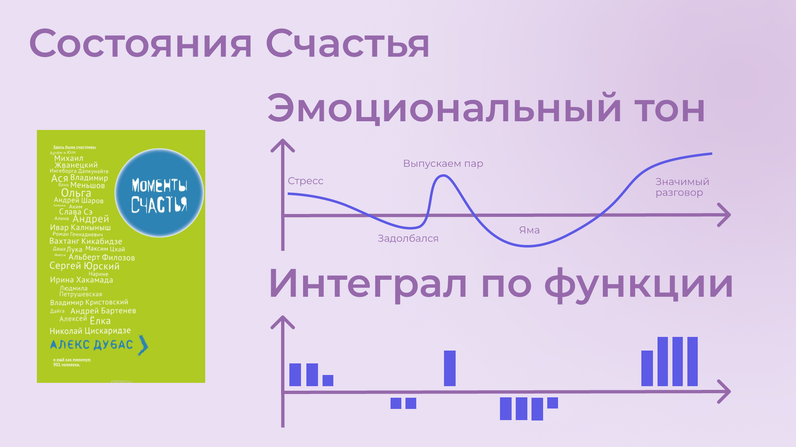

# 16. Общие Цели: Презентация 

Оглавление

1. [Время перемен — Время возможностей](#time_possibilities)
1. [Цели государства и Потребности граждан](#goals_needs)
1. [Каналы коммуникаций](#communication_channels)
1. [Гражданин не равно Клиент](#citizen_client)
1. [Счастье как смысл жизни](#happiness_as_mission)
1. [Научное сообщество о Счастье](#science_about_happiness)
1. [Состояния Счастья](#moments_of_happiness)
1. [Пирог Счастья](#pie_of_happiness)
1. [Путь Этапов Развития Личности](#path_of_happiness)
1. [Петербург в поисках Счастья](#petersburg_and_happiness)
1. [Культурная столица](#culture_capital)
1. [Цифровой Петербург](#digital_petersburg)
1. [Я Здесь Живу](#i_live_here)
1. [Подход Цифрового Петербурга](#roots_approach)
1. [Новые метрики](#new_metrics)
1. [Определение Социального капитала](#social_capital)
1. [Новое осмысление Умного Города](#smart_city)
1. [Житель — инвестор, а не потребитель](#citizen_investor)
1. [Вовлечение в инвестиции](#investment_involvement)
1. [Общие цели](#shared_goals)
1. [Что мне делать? :)](#what_to_do)
1. [Подтверждение гипотезы](#proof)
1. [Желаемый результат](#result)
1. [Необходимые условия](#requirements)
1. [Проектная группа](#project_team)
1. [Задачи проектной группы](#project_tasks)

## 1. Время перемен — Время возможностей 

2 года как идёт заметное переосмысление ценностей. И в [истории России это уже случалось далеко не первый раз](./personalnaya-sistema-cennostei.md#again_and_again). И каждый раз страна выходила на новый уровень.

## 2. Цели государства и Потребности граждан 

Очевидно, что руководство страны симметрично реагирует на вызовы, определяет стратегию, но привычки и потребности населения в моменте расходятся с верхнеуровневыми целями. [Спустя время разрыв сокращается, но по инерции, спустя 20-40 лет после взлета, идёт следующий взмах маятника и его падение](./personalnaya-sistema-cennostei.md#polarization). Хотелось бы, сократить амплитуду будущего взмаха и выйти на стабильный рост.

## 3. Каналы коммуникаций 

И если 30 лет назад руководство страны формировало общее представление через централизованные СМИ — газеты, радио, ТВ, то сейчас это [коммерческие цифровые платформы, которые отвечают запросам общества потребления](../analysis/stereotipy-schastya.md#gadgets). Очевидно, что государство присутствует в этих каналах коммуникаций со своей официальной повесткой. Но информация от государства не может быть такой же занимательной и яркой, чтобы конкурировать за внимание с рекламой и независимыми блогерами.

## 4. Гражданин не равно Клиент 

Государство присутствует в коммерческих каналах коммуникаций и даже следует мантре Клиентоцентричного государства с государственными сервисами, постоянно повышая удобство и ожидания, но опосредованно поддерживая образ "Клиент всегда прав" и проводя черту между. В сознании происходит отделение гражданина от государства, снижается сопричастие и, как следствие, растёт недовольство и несчастье. [Гражданин не равно Клиент](./ya-zdes-zhivu.md#love_beyond_words).

## 5. Счастье как смысл жизни 

При всех разных точках зрения и разных ролях, которые мы играем в жизни существует одна система координат, которая объединяет практически всех людей на Земле. [Это стремление быть Счастливым](../analysis/schaste-kak-smysl-zhizni.md#happiness_as_life_goal).

## 6. Научное сообщество о Счастье 

Стремление к Счастью это краеугольный камень всей стратегии диалога с жителями. И если цифровизаторы-айтишники стали обеспечивать диалог города и жителей и разрабатывать городские сервисы для решения их потребностей, то [необходимо понимать и как-то измерять ожидаемое целевое состояние и динамику](../analysis/schaste-kak-smysl-zhizni.md#happiness_model). Счастье понятие очень индивидуальное и обычно ассоциируется у нас с положительными эмоциями. Однако надо понимать — в результате этого диалога люди становятся счастливее или нет? Мысль это далеко не нова и в научном сообществе уже есть наработки по теме [моделей измерения ощущения от жизни от айтишников-психологов](https://www.livelib.ru/work/1008288064-model-kolichestvennoj-otsenki-urovnya-schastya-vladimir-andreev) и [интегрального понятия Человеческий Капитал (и близкого понятия Социальный Капитал) от политологов-психологов](https://www.livelib.ru/review/4165063-strategicheskaya-psihologiya-globalizatsii-psihologiya-chelovecheskogo-kapitala).

## 7. Состояния Счастья 

Строго говоря — [жизнь состоит из моментов, характеризуемых эмоциональным тоном](../analysis/schaste-kak-smysl-zhizni.md#moments_of_happiness). Отрицательным или Положительным. "Счастливая ли жизнь?" можно измерить интегралом по функции эмоционального тона на протяжении всего времени. И несмотря на то, что уровень эмоционального тона в моменте можно измерять по физиологическому состоянию организма, как [постоянный мониторинг уровня сахара в крови](./upravlenie-na-osnove-cifry.md#health), например, и это станет возможным в обозримом будущем — речь далее пойдет совершенно о другом.

Чтобы не сильно смущать разговорами об измерении счастья людей, обладающих преимущественно иррациональным (или образным) мышлением можно вспомнить [книгу-сборник особенно ярких "Моментов Счастья", которая вдохновила нас больше, чем количественные модели](../analysis/schaste-kak-smysl-zhizni.md#moments_of_happiness_book).

## 8. Пирог Счастья 

Важное в [природе феномена ощущения Счастья](../analysis/schaste-kak-smysl-zhizni.md#what_is_happiness), что предпосылки его появления зависят приблизительно на 50% от физиологических и наследственных особенностей (которые обуславливают наш характер/темперамент/психотип), на 10% от внешних обстоятельств, которые соответствуют Ожиданиям: Захотел и Получил (куда и прикладывается максимум усилий), и на 40% от Отношения к жизни, которое мы чаще всего оставляем без внимания.

Наблюдения эти подтверждаются в исследованиях и описаны в книгах — уже упомянутая ["Количественная модель счастья"](https://www.livelib.ru/work/1008288064-model-kolichestvennoj-otsenki-urovnya-schastya-vladimir-andreev) [Владимира Андреева](./equator.md#andreevvs) и ["Психология Счастья"](https://www.b17.ru/blog/401335/) Сони Любомирски.

## 9. Путь Этапов Развития Личности 

Частота возникновения моментов счастья зависит от этапов развития Личностей, которые человек достигает, преодолевая Кризисы. Можно перескочить какой-то кризис и не выработать необходимые навыки его преодоления, что создаст дисбаланс и сложности в будущем. [Существует множество моделей, можно рассмотреть такую](./schaste-kak-predmet-srednei-shkoly.md#brief_happiness_model):

1. Детская Беспомощность;
1. Зависимость от старших;
1. Умение проявлять свою Волю, принимать решения и выходить из Подчинения;
1. Рациональный навык обустроить жизнь по нормам социума — Необходимость достичь средний уровень достатка и Независимости;
1. Иррациональный навык найти свой Интерес и следовать Призванию, зачастую рисковать вопреки голосу разума — многие себя не реализовали на этом этапе;
1. Интегрировать Интерес и Заработок, Реализоваться как эксперт в своей области — успешные предприниматели и деятели культуры;
1. Объединение опыта полученного за жизнь в Смысл, чтобы передать следующим поколениям — известные руководители, писатели, вошедшие в историю;
1. Идеалы, которые достигли полного баланса и ставшие частью мироздания — на нашей земле можно вспомнить Сергия Радонежского, Серафима Саровского, в Петербурге Иоанна Кронштадтского, Серафима Вырицкого, Ксению Петербургскую, в других культурах Будду и т.д

Неоднократно замечают, что в семьях с [устоявшейся системой ценностей](./personalnaya-sistema-cennostei.md#god_and_science), где заметное место занимают:

- Учёба и тренировка навыков Разума, чтобы уметь добывать необходимые для жизни ресурсы;
- Вера в духовные идеалы, которая служит стержнем, помогает преодолевать препятствия и формирует ориентиры для роста;
- Труд по объединению этих двух полюсов нашей психики и поведения;

формируются навыки, которые помогают проходить эти кризисы и начинают работать как Генератор моментов счастья.

Нет никаких шансов всем дойти до конца Пути :-) Слишком много требуется Воли и Веры для работы над выработкой необходимых навыков. Но государство может помочь преодолеть кризис поиска Интереса.

Тем более, что [растущее влияние Искусственного интеллекта и роботизации может вынудить нас это сделать уже при нашей жизни](./vkalyvayut-roboty-schastliv-chelovek.md#love_manifest_robots).

## 10. Петербург в поисках Счастья 

Хорошо, но при чём здесь Петербург?

Будучи [рационалом до мозга костей](../analysis/sledovanie-prizvaniyu.md#architect_personality) (совсем не уверен, что это к счастью), к пророчествам отношусь скорее как к следствию навыков высокоразвитых личностей, которые в состоянии видеть/прогнозировать тенденции на продолжительных отрезках времени и поэтому не особо удивился, когда уже после написания текста увидел [пророчество упомянутого выше Серафима Вырицкого о роли Петербурга](https://ru.wikipedia.org/wiki/Серафим_Вырицкий). И, конечно же, держим в уме поправки на то, как публикуются предсказания по прошествию времени и кто это делает.

Однако Петербург имеет вполне рациональные предпосылки стать такой точкой роста:

## 11. Культурная столица 

Есть [понятие Текст города](./ya-zdes-zhivu.md#city_as_text) — это Архитектура города, которую читают все его жители и гости. Она передает смыслы и Петербург, конечно же, строился с целью формировать сознание людей, стремящихся к идеалам. И этот Текст работает. Обычно Петербург вспоминают как город трёх революций, но мне лично это понятие очень не нравится и хотелось бы их больше не допускать на нашей земле. [Собственно и текст назвал "Что мне делать? :-)", чтобы изменить ассоциацию этого вопроса](../README.md#what_to_do).

Упомянутые ранее книги о Счастье были написаны мыслителями из Петербурга, также как и [движение Русских Космистов тоже развивалось, прежде всего, в Петербурге](./ya-zdes-zhivu.md#russian_cosmism). Петербург носит титул Культурной столицы с изобилием возможностей для пробуждения всевозможных Интересов.

Тем более, что именно в Петербурге [мы начали успешно освобождать чиновников от рутинной работы](./vkalyvayut-roboty-schastliv-chelovek.md#robots_in_spb), выполняя её роботами, а людей переводить на более интеллектуальные задачи. От чего они становятся заметно счастливее.

## 12. Цифровой Петербург 

Когда мы [создавали Цифровой Петербург в 2020 году](./ya-zdes-zhivu.md#mini_app_vkontakte) мы изначально использовали принципы Открытого Правительства.

Прежде всего упор был сделан на открытие данных и создание программных интерфейсов (API) городских информационных систем, поверх которых можно будет создавать новые сервисы для жителей и станет возможной интеграция с популярными цифровыми каналами коммуникаций. С площадками, где уже находятся жители.

Использование платформ приложений от партнёров дало возможность быстро запускать новые сервисы для жителей и масштабироваться в другие субъекты.

## 13. Я Здесь Живу 

[Я Здесь Живу](https://vk.com/ya_zdes_zhivu) — флагманское приложение [Цифрового Петербурга](https://about.petersburg.ru) построено не как отдельное приложение, а как шина данных с привязкой к адресу города и реализован на платформе мини-аппов ВКонтакте. [Также планируется запуск сервисов на других платформах со ссылками на первоисточник](./ya-zdes-zhivu.md#digital_petersburg_roadmap).

## 14. Подход Цифрового Петербурга 

Есть метафора о том, что [наши города заполнены Иностранцами, которые не знают места, где они живут](./ya-zdes-zhivu.md#unhappy_foreigners). Их мало что связывает с местом жительства, т.к. живут они в ментальных проекциях, сформированных цифровыми каналами коммуникаций. Разность проекции (далеко не всегда правдивой) и реальности порождает раздражение и несчастье. Мы уж не говорим про другие усилия, помимо знания, которые необходимо сделать, чтобы место стало своим и стало приносить моменты Счастья.

Мы следуем Пути, который позволяет жителям пускать корни и делает его экспертом места, в котором он живет.

## 15. Новые метрики 

[Следуя принципу "Не можешь измерить — не можешь управлять"](./upravlenie-na-osnove-cifry.md#why_digital_russia) для изменения ситуации необходимо сначала научиться измерять текущее состояние и понимать желаемое в ключевых процессах и целях общества.

Для лучшего понимания эффективности наших усилий в диалоге с жителями от лица города мы начали искать новые понятия и метрики — например, [Социальный капитал](./socialnyi-kapital-i-obshie-celi.md#social_capital).

## 16. Определение Социального капитала 

Не могу сказать, что мне легко даются определения из социологии и психологии, но точно знаю, что самый драгоценный ресурс, который изначально [надо уметь измерять и оценивать — это наше Время](./upravlenie-na-osnove-cifry.md#time). И для меня Социальный капитал представляется как интегральная временная инвестиция в общие цели для социума. Это время, которое люди тратят не на себя любимого, а на общество в котором живут. Не ты мне, я тебе, а мы вместе для нас.

Оно очень похоже с понятием Человеческий капитал, о котором написана уже упомянутая здесь книга ["Психология человеческого капитала"](https://www.livelib.ru/review/4165063-strategicheskaya-psihologiya-globalizatsii-psihologiya-chelovecheskogo-kapitala). Примечательно, что заключение книги посвящено [Счастью, как краеугольному камню](../analysis/schaste-kak-smysl-zhizni.md#cornerstone_of_text) в понятии человеческий капитал.

Будь то Социальный или Человеческий, но этот Капитал сильно отличается от Финансового Капитала, который пока доминирует в нашем мире и создаёт конфликты, в том числе военные. И если это понятие так важно, то его нужно вводить в обиход наравне с Финансовым и уметь его измерять, чтобы достигать баланса.

Вполне вероятно, что потребуется введение в обиход принципиально нового понятия, которое отражает смысл инвестиций сделанных в общее дело.

Может быть — Инвестиции в Счастье?

## 17. Новое осмысление Умного Города 

В этой сбалансированной системе координат можно переосмысливать понятия.

[Умный город — не тот, где больше камер или датчиков, а тот, где Социальный капитал растёт быстрее](./socialnyi-kapital-i-obshie-celi.md#smart_city).

Если в СССР мы строили не очень понятный для рядового гражданина коммунизм, то вот сейчас мне важно понимать, что помимо финансового капитала растёт ещё и человеческий и формирует образ Счастливого Завтра. И мы видим этот рост на открытых цифрах.

## 18. Житель — инвестор, а не потребитель 

Финансовая независимость, о которой мечтает подавляющая часть населения, приобретается только через навыки Инвестиций. Чтобы научиться инвестировать Деньги, сначала нужно научиться управлять и инвестировать Время, которое имеется у всех в равной степени. А для этого требуется управлять Волей, чтобы не разбазаривать это Время на [ловушки, которые создаёт для нас легкодоступный цифровой мир](../analysis/stereotipy-schastya.md#information_flow).

Вырабатывать эти навыки проще всего на [инвестициях в улучшение своего жизненного пространства](./ya-zdes-zhivu.md#tom_sawyer_fest). Без вовлечения в развитие своего дома и двора, вероятно, не получится стать счастливым и обеспеченным. Улучшение жизненного пространства является общей целью жителей и руководства города.

## 19. Вовлечение в инвестиции 

Треть "Сильных идей" предлагаемых Агентством Стратегических Инициатив о том, чтобы [растормошить и вовлечь активистов и неравнодушных людей в разную созидательную деятельность](./socialnyi-kapital-i-obshie-celi.md#shared_goals_for_citizens).

По данным опроса, не менее 63% наших жителей ответили, что они готовы инвестировать своё время на благо Общества.

Охотно в это верю — люди очень разные, но все хотят быть счастливыми и в глубине души все понимают, что для этого надо как-то вложиться. Есть порыв, но нет понимания "Что же конкретно надо сделать-то?! :-)"

## 20. Общие цели 

На эти вопросы ответит [платформа Общие Цели](./socialnyi-kapital-i-obshie-celi.md#shared_goals). И все проекты про вовлечение можно будет объединить [одной открытой цифровой платформой](./open-source-svoboda-v-dvizhenii-k-lyubvi.md#shared_goals).

И тогда общественное движение, клуб по интересам, обычная семья или неравнодушный гражданин могут [создать Общую Цель](./socialnyi-kapital-i-obshie-celi.md#entity_goal). Далее [определяется Время как возможная Инвестиция](./socialnyi-kapital-i-obshie-celi.md#entity_contract). Опционально можно указать [предложенный экспертами план и набор рекомендованных действий](./socialnyi-kapital-i-obshie-celi.md#entity_plans), чтобы избежать ненужных рисков и направить временные инвестиции в правильное русло. А дальше фиксируется [совершённый временной вклад в Общую цель](./socialnyi-kapital-i-obshie-celi.md#entity_commit). И если чувствуется результат от сделанных инвестиций, то возникают и отмечаются Моменты Счастья. Именно они могут быть мотиваторами для тех, кто собирался заняться этой темой, но не хватало времени, а точнее воли.

"Я Здесь Живу" является лишь подмножеством Общих Целей, объединенных адресом многоквартирного дома. А [цифровой аватар Яков Петрович или Яков Захарыч](./ya-zdes-zhivu.md#digital_petersburg_roadmap) (дворник или фонарщик, зажигающий свет) в домовых чатах сможет подсказать, что происходит вокруг и какими Общими Целями можно заняться.

## 21. Что мне делать? :) 

Что мне делать? :)

[Так называется этот Текст](../README.md#what_to_do), который спонтанно начал писать в GitHub совместно с единомышленниками год назад.

Что надо делать, чтобы быть Счастливым? Что сделать, чтобы запустить это движение?

Вопросов, сомнений, рассуждений — множество. Хотя основные выводы в тексте видятся вполне устойчивыми и выдержали не одно критическое замечание, тем не менее у каждого может быть свой нюансный взгляд и каждый может его добавить в [концепции Open Source](./open-source-svoboda-v-dvizhenii-k-lyubvi.md#associations_with_open_source). И значит Текст этот может дополняться бесконечно и [не является законченным произведением или книгой](../README.md#text_is_not_a_book). И поэтому, чтобы не сгущать краски поставил смайл в конце, чтобы отличаться от Николая Гавриловича и не быть слишком серьёзным :-)

## 22. Подтверждение гипотезы 

На данный момент требуется выработать простую и понятную формулу, из которой будет следовать зависимость между вложенными инвестициями в общее дело с возникновением состояний счастья впоследствии. А потом ещё и доказать эту формулу на практике.

[Это основная задача, в решении которой будет полезна любая помощь](./socialnyi-kapital-i-obshie-celi.md#what_to_do) — советы, которые многие любят давать :-), примеры из жизни, готовность предоставить доказательство или опровержение гипотезы. Чем полнее будет исследование, тем точнее можно будет настроить систему.

## 23. Желаемый результат 

Общие цели, являясь независимой открытой цифровой платформой, можно встроить через виджеты, мини-аппы и чат-боты в уже существующие сообщества, группы и ГосПаблики. По желанию модераторов и администраторов этих сообществ, конечно же. Ряд изменений можно делать автоматизировано, через API, без необходимости ручного ввода. И тогда в тематических сообществах можно будет наблюдать динамику общих временных инвестиций, активность участников и поток деперсонализированных моментов счастья, которые появились в результате вложений.

[Важные результаты](./socialnyi-kapital-i-obshie-celi.md#human_capital_book):

- вклад в Общие цели можно соотнести с вкладом в соответствующие национальные цели, определённые Президентом;
- платформа может стать инструментом для измерения человеческого/социального капитала, наряду с финансовым;
- можно формулировать измеримые и понятные цели для общества, напрямую связанные с интересами граждан и влияющими на их счастье.

## 24. Необходимые условия 

[Несмотря на растущую важность цифровизации для государств и явное присутствие в национальных целях](./upravlenie-na-osnove-cifry.md#russian_it), мы, цифровизаторы, понимаем, что далеко не всё можно решить с помощью информационных систем. Потребуется согласованность усилий на всех уровнях. На наш взгляд, основы психологии и философии в максимально доступной и наглядной форме, понимание природы наркологических и поведенческих зависимостей, необходимость прохождения пути развития уровней личности для испытания моментов счастья на протяжении жизни, историю героев, которые прошли этот путь [необходимо давать уже в средней школе](./schaste-kak-predmet-srednei-shkoly.md#happiness_in_school). Конечно же, содержанием школьной программы должны заниматься специалисты в образовании, но пока предмета о Счастье нет в школе, ответственность за счастливое завтра детей полностью лежит на плечах родителей. Мы также понимаем, какие последствия может иметь цифровизация роли наставника для детей, которая сейчас и происходит через компьютерные игры и непрерывное потребление информации с телефона. Ребенку нужны живые Папа и Мама, равно как Человеку нужен Человек. Тут скорее необходимо направлять усилия на осознание сложившейся ситуации в головах взрослых. Через открытый, прямой, объективный диалог.

[В наших силах снабдить цифровыми помощниками уже созданные домовые чаты в мессенджерах](./ya-zdes-zhivu.md#digital_petersburg_roadmap), где присутствует население России, проживающее в многоквартирных домах. В этих группах часто можно наблюдать разгул диванной аналитики и глубокого знания жизни, когда виноват кто угодно, но не сам говорящий. Не слишком серьёзный персонаж, типа виртуального дворника или фонарщика, сможет рассказать, что Город делает для дома и двора, что делают неравнодушные люди неподалёку, и как можно было им помочь. Может быть даже порассуждать о природе Счастья и навести на мысли, которые прорастут позже.

## 25. Проектная группа 

Думается, что важно включиться в проектную рабочую группу, в которой присутствуют представители Руководства, Субъектов и Технологических Партнеров, чтобы согласовать эти действия.

## 26. Задачи проектной группы 

Потребуется:

- декомпозировать Национальные Цели на исполнимые гражданами планы Общих Целей с помощью экспертов и ответственных из отрасли: Благоустройство - Субботник, Экология - Полить Газон во дворе, Благосостояние - Послушать лекцию о важности контроля трат и начала инвестирования и т.д.;
- Использовать лучшие методологические практики и технические наработки, которые не создадут рисков в дальнейшем;
- Структурировать и Открыть данные на уровне субъектов для ведения объективного диалога с жителями;
- И вовлекать людей в Общие Цели.

Обсудить положения этой главы и всего остального текста можно в группе [по ссылке](https://t.me/bongiozzo_public).
