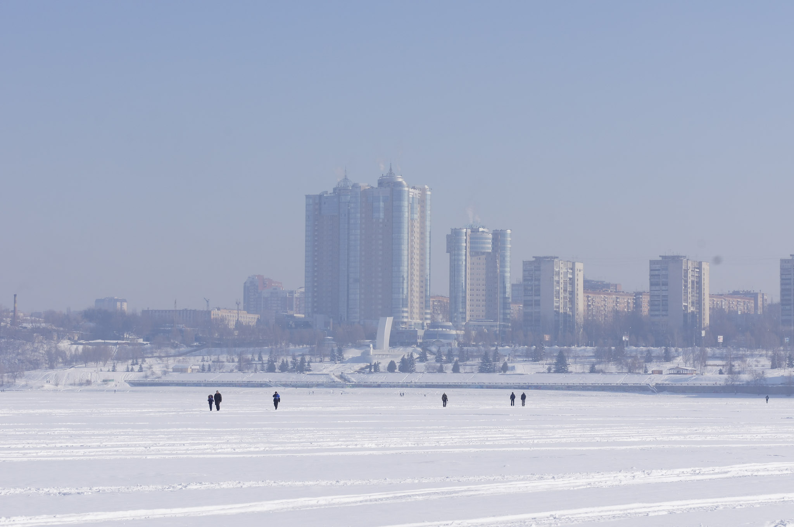
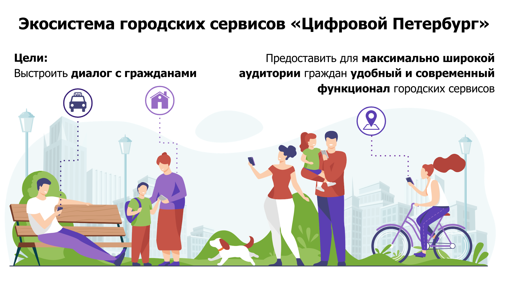
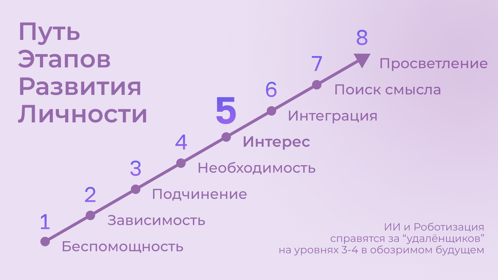

# 15. Социальный капитал и Общие цели 

Краткие тезисы по главе

- [Преодоление](#overcoming)
- [Шило в Ж...](#ants_in_your_pants)
- [Сценарии использования системы](#use_case)
- [Сущность: Цель](#entity_goal)
- [Сущность: Контракт](#entity_contract)
- [Сущность: Исполнение](#entity_commit)
- [Сущность: План действий](#entity_instruction)
- [Аналоги систем целеполагания](#goal_setting_systems)
- [Прототип Общие цели — Shared Goals](#shared_goals)
- [Социальный капитал](#social_capital)
- [Общие Цели для граждан](#shared_goals_for_citizens)
- [Новая трактовка понятия Умный город](#smart_city)
- [Что мне делать? :-)](#what_to_do)
- [Стратегическая психология глобализации. Психология человеческого капитала](#human_capital_book)
- [4 вида психологии в модели Счастья](#types_of_psychology)
- [Психология разума](#psychology_of_mind)
- [Психология воли](#psychology_of_will)
- [Психология бессознательного](#psychology_of_unconscious)
- [Психология веры](#psychology_of_belief)
- [Национальные цели](#national_goals)

Краткое содержание построено YandexGPT (модель Краткий пересказ, Температура 0.1):

- Статья представляет собой описание системы целеполагания и общих целей.
- Автор рассматривает различные подходы к целеполаганию и их аналоги в системах обмена сообщениями.
- Обсуждается важность выработки привычек для достижения целей и счастья.
- Платформа Shared Goals может иметь платную закрытую версию или подписку для корпоративного использования.
- Автор считает, что платформа Общих Целей должна быть простой, удобной и доступной из привычных каналов общения.
- Необходимо найти настраиваемый баланс рацио и иррацио подходов для ощущения вовлеченности.
- Обсуждается концепция Shared Goals для вовлечения граждан в достижение общих целей, полезных для города и общества.
- Социальный капитал города растет, когда жители тратят время на раздельный сбор мусора, спортивные мероприятия и другие полезные действия.
- Создание единой платформы Shared Goals позволит соотносить общие цели и объединять усилия для достижения их.
- Временные инвестиции, сделанные в общие цели, будут социальным капиталом.
- Умный город приобретает новый смысл, когда его социальный капитал растет быстрее, чем в других городах.
- Автор предлагает создать платформу Общих Целей, объединяющую все области интересов взрослого человека.

## Преодоление 


Мой Друг, которого неоднократно упоминал в этом Тексте, спустя практически 20 лет после нашего выпуска из старшей школы вдруг обнаружил неожиданную для меня привычку. Оказывается он бегает по субботам. А я, признаюсь, с детства терпеть не могу ни бег, ни лыжи. Велосипед очень люблю, а бег и лыжи попали в чёрный список занятий. С этим другом мы вечно исследовали всякого рода [зависимости](../analysis/osobennosti-nashego-vremeni.md#awareness_and_addictions), слушали [тяжёлую музыку](./be-happy-or-die.md) и попадали в разные истории, поэтому чего-то "правильного" и "полезного" я от него никогда не ждал. Только неформатное общение и приключения. Мне стало немного любопытно и завидно, что у меня нет такого опыта и мы договорились пробежаться вместе... И вот через неделю, в пятницу вечером, когда я уже и позабыл об этом разговоре, он пишет:

— Ну что, завтра бегаем?

А я в постоянных разъездах, командировках и чтобы как-то обосновать свой отказ, перезваниваю ему и начинаю живописно рассказывать как я замотался и собираюсь отдохнуть:

— Да я ещё в Шереметьево, мне лететь в Самару, а потом до дома ещё добираться! Хорошо бы заснуть к 3м часа ночи! — как бы между строк, говорю ему, что Не смогу.

А он меня выслушал и так кратко обронил:

— Так я сам в Домодедово.

Бляха-муха, думаю… Ну а я, тряпка что-ли? Не сливаться же!

— Хорошо, до завтра!

На утро с замиранием сердце продираю один глаз и смотрю в телефон с надеждой — не нашел ли причину “Не бежать” товарищ? Но нет… Нехороший человек. Пишет, что собирается и выходит. Что же делать? Сливаться в такой ситуации и изменять своим принципам и данному слову для меня немыслимо. И вот я уже смирился, собрался и приехал на набережную. Неторопливая пробежка, приятная беседа, разогрев. И вот уже и купание в проруби не кажется идиотской затеей и ты стоишь на снегу, от тебя валит пар, но при этом не холодно, удивительно легко и глубоко дышится…  А вокруг... Бескрайнее пространство Волги и силуэт Самары в морозной дымке… Счастье :-)


Если системно разобрать эту ситуацию, что произошло? Мы довольно разные люди по складу характера, у нас сравнимый уровень серьёзной нагрузки и дефицит времени, мы друг другу ничего не должны, но друг друга уважаем. Для каждого из нас — данное слово весомо. При этом заставлять себя делать усилия после нервной работы, которую я, например, всё таки стараюсь естественным образом [разбавлять физическими нагрузками](./upravlenie-na-osnove-cifry.md#health) — довольно трудно. И я могу легко себя оправдывать, когда игнорирую объективно полезные, но не особо любимые мной спортивные занятия. И уж тем более меня не мотивирует всякого рода соревнования и "достигаторство" типа Iron Man. Но тут изначально сработало данное обещание в момент приятного общения. А по завершению первой пробежки уже совсем просто договориться о следующем разе. И эта повторяемость и прозрачность временных инвестиций — каждую субботу, пару часов, играет немаловажную роль. Я даже представил, как подписал сам с собой подобие контракта — тратить время в субботу на совместные занятие, которые в некоторой степени является преодолением. Именно сам с собой, т.к. считаю, что [никому ничего не должен](../analysis/stereotipy-schastya.md#egocentrism). Для меня был важен момент отсутствия долженствования и всяких напоминалок и будильников. Если бы решил бегать один и поставил себе в календарь повторяющиеся блоки и настроил будильники, очень быстро случились бы поводы по работе или в семье, из-за которых этот договор я бы с раздражением разорвал. Объективно, рабочая нагрузка всегда была высокая. А если бы мы начали оперировать договоренностями между друг другом, ты мне должен или наоборот — тогда бы пропал кайф. А тут, ты видишь, что при приближении исполнения контракта твой товарищ готов его исполнять и ты САМ исполняешь свой контракт также. Круговая порука в достижении счастья :-)

Совершенно банальна мысль о том, что чаще всего [моменты Счастья](../analysis/schaste-kak-smysl-zhizni.md#moments_of_happiness) наступают после Преодоления. После непростой работы с собой. И осознание этой необходимости Преодоления хорошо бы, чтобы постоянно присутствовало в жизни. Спорт также про Преодоление, хотя я его и [не люблю в силу не близкой моему психотипу соревновательности](./upravlenie-na-osnove-cifry.md#health). И вот эти совместные пробежки, разговоры, а, по сути, совместное время за определённым занятием привели к следующей стадию Преодоления и Общих целей. Походы.

## Шило в Ж... 


10 лет назад тот же Друг на пробежке обмолвился, что его друзья собираются в Жигулёвскую Кругосветку на байдарках и ищут тех, кто готов присоединиться. Я ходил в этот [знаменитый подход](https://ru.wikipedia.org/wiki/Жигулёвская_кругосветка) ещё в средней школе. Тогда увязался в поход с одноклассниками, когда ещё толком плавать не умел. Сохранилось мощное детское романтичное воспоминание, которое хотелось повторить. Но уже со своими детьми.


В кругосветку мы сходили — и так я попал в компанию друзей, которым не сидится на месте. Которые постоянно планируют какие-то совместные путешествия. Морозы, горные болезни, сырость от болот и дождей и многое другое было испытано. Чтобы в конце концов, пройдя через все эти препятствия, стать счастливыми вместе. Название у этой группы друзей — "Шило в ж…" Впрочем, соль названия именно в слове Шило, которое не даёт сидеть на месте, заставляет поднимать эту Ж, куда-то идти, что-то придумывать. Снова и снова. Шило это торчит необязательно у кого-то одного. Оно может даже не у всех и есть. Вообще, по моим наблюдениям, оно переходящее. Но когда кто-либо в группе обозначает свою готовность идти на Алтай, или Маньпупунер, или Эльбрус, Казбек, Хибины… Не важно. Каждый внутри задаётся вопросом — “А я пойду?”. И когда наблюдаешь, как осторожно начинает формироваться группа хорошо знакомых тебе людей, у которых также есть всякие вопросики по здоровью, дети, семья, работа — внутренне говоришь ДА, я тоже пока ещё могу разрулить свою непростую ситуацию и сказать ДА грядущим испытаниям. Не было бы этого Шила в моей жизни, не срывался бы я из дома и так задолбанный по работе — не было бы значительной части богатства, которое я имею. И, естественно, сейчас разговор не про деньги. Группа ширилась — появились "Шило-Девочки". И плодилась — выросло и сформировалось "Детское Шило". Так что, это Шило стало целым общественным движением. И это Шило, оно общее, как и Счастье и Цели, которые ведут к этому Счастью :-)

## Сценарии использования системы 

В общем, проанализировав свои мотивы, я осознал, что мне пошла бы на пользу система, в которую я мог бы вносить Контракты с самим собой о том сколько времени я готов тратить на движение к большим Целям. Такое планирование, как упражнение, многие выделяют как обязательное. У [Кови в навыках такое было](https://www.livelib.ru/review/3792199-sem-navykov-vysokoeffektivnyh-lyudej) и я для себя периодически такие заметки делал. Сразу стало ясно, что эта вспомогательная система планирования ни в коем случае не должна считать, что она умнее меня и не должна делать каких-либо напоминаний о моих обещаниях. Хотя мне было бы любопытно переодически посматривать на динамику в достижении таких же Целей другими. Нетрудно заметить, что эти требования и ограничения являются анализом моей мотивации из историй, рассказанных выше. Вероятно для [других психотипов](../analysis/sledovanie-prizvaniyu.md#mbti_personalities) такая мотивация не будет работать, но мне видится, что в ней нет никаких скрытых или явных манипуляций и самообмана. Всё просто, честно и объективно. Самый ценный ресурс — [это время, им надо управлять и его крайне полезно учиться планировать и измерять](./upravlenie-na-osnove-cifry.md#time). Если тратить время на созидательные и социальные Цели, то они неминуемо возвращаются [моментами Счастья](../analysis/schaste-kak-smysl-zhizni.md#moments_of_happiness). И тогда мы и общество становится всё более Счастливым. Прекрасно.

Взаимодействие с этой системой должно быть, как будто бы, растворено в привычном канале коммуникаций и она не должна являться "ещё одной системой". Ты общаешься в группе в Телеге или в сообществе ВКонтакте и прямо тут же можешь в "два клика" или с помощью специальной команды к боту отметить свои планы по движению к Цели. Например, провёл 2 часа анализа систем для Цели "Пилот системы Shared Goals". Или готов присоединиться к цели "Детская площадка во дворе" по QR ссылке, которую увидел во дворе и в Домовом чате. Как только получается выделить это время и что-либо сделать — ещё минута и вот уже готов микро отчёт, что время инвестировано, было сделано "Сценарии использования системы" или "Сформировали чертёж детской площадки", следующим шагом планируем "Проектирование архитектуры" или "Создание сметы". И значит другие участники получат в удобном для них формате статус о динамике достижения Общей Цели. И в какой-то момент, вероятно, решатся присоединиться к созидательному порыву.

Такой сценарий использования системы можно реализовать созданием программных интерфейсов (API), которые описаны и опубликованы в открытом формате, а клиенты и интеграция с системой Shared Goals в Telegram, ВКонтакте и других каналах реализуются сообществом в [концепции Open Source](./open-source-svoboda-v-dvizhenii-k-lyubvi.md), также как разрабатывались первые версии приложений для только что появившегося в то время мессенджера Telegram.

В 2014м году перспективность хорошо знакомого технологического стека Microsoft для российских реалий стала вызывать серьёзные вопросы и я начал посматривать на [новые Open Source наработки](./open-source-svoboda-v-dvizhenii-k-lyubvi.md#shared_goals). А в качестве практики задумался опробовать их на собственном проекте. И начал описывать пользовательские сценарии и основные сущности новой системы. И сущности эти, в общем и целом, элементарны:

### Сущность: Цель 

Цели у людей, как мне кажется, по большей части, являются Общими. И типов этих Целей не так уж и много. Большинство хотят найти работу с большей зарплатой и жильё поудобнее, иметь фигуру постройнее. И даже в этих персональных целях, как правило, есть сочувствующие. Если зарплатой и жильём озадачился муж или жена, то в этой цели также будет заинтересован и другой партнер, от которого достижение цели зависит, вероятно, не меньше. Учиться на новую профессию, искать желаемый район жительства, определиться с финансированием намного эффективнее вместе. Худеть тоже лучше в компании с друзьями и соседями.

Цели могут быть совершенно глобальными — как общемировой призыв бегать каждый день. Могут быть территориально специфичны — строим детскую площадку в нашем дворе. Или озеленяем [Васильевский остров](./ya-zdes-zhivu.md#love_to_vo). Такие цели можно найти в каталоге по ключевым словам или по территориальному признаку. Или наведя телефон на QR, который увидел во дворе дома. Для айтишника, который сидит в командной строке, возможно, запомнится команда типа `/join Run Every Day`, доступная в консольном клиенте системы. Должны поддерживаться разные сценарии в разных условиях. На расстоянии двух нажатий.

Могут быть цели, ограниченные конкретными участниками — муж с женой, или 3 предпринимателя, которые объединились, чтобы создать новый бизнес. В них вступают по приглашению, по присланной ссылке.

Цель может быть и вовсе персональная. Хотя это вырожденный сценарий общей цели, в которую никого не пригласили кроме самого автора.

Что делать для достижения каждой цели, на самом деле, вторично. Самое важное — выделять время. В конце концов, если не знаешь, что делать — начинай составлять план достижения цели. Подготовка тоже требует времени.

### Сущность: Контракт 

Время, которое ты готов тратить на достижение Цели представляет собой суть Контракта. Один час в неделю или 20 минут в месяц. Неважно. Количество выделяемого времени и периодичность у участников может быть совершенно разные. Важно начать с чего либо, больше чем 0.

Мне было бы любопытно периодически получать сводку по Целям, к которым присоединился. Сколько участников активно, сколько человек реально исполнили договоренности и что они при этом делали. Видится важным дозреть до активных действий самостоятельно, лишь наблюдая за другими участниками.

Если не получается выделить запланированное Контрактом время в полной мере, можно в пару кликов его скорректировать на реалистичное и Исполнить. Главное — начать движение к общей Цели.

### Сущность: Исполнение 

Когда Контракт исполнен, потребуется сделать короткую отметку. Commit. Исполнено.

Это самая часто обновляемая сущность системы. Чем больше этих исполнений, "коммитов", тем быстрее движение к Цели.

Хотя по умолчанию отметку лучше снабдить затраченным временем из Контракта, а также указать, что было сделано и что планируется следующим шагом. Если это Исполнение Контракта уже не первое и в прошлой транзакции был указан Следующий шаг, то можно подставить его в поле "Что было сделано?". Короткие сообщения, наподобие tweets, дают представление о том, что происходит с целью. Если человеку неинтересно разбирать эти потоки сообщений, то [Искусственный Интеллект легко справится с этой рутиной](./vkalyvayut-roboty-schastliv-chelovek.md#routine_and_improvement) — выдать резюме происходящего, найти зависимость, предложить следующий шаг.

Легко заметить, что чаще всего моменты Счастья наступают после успешного Преодоления и через активные действия. А Счастье становится наиболее сильным, когда им можно поделиться с теми, кто разделяет Общую Цель.

Если Исполнение Контракта было в какой-то степени Преодолением и привело к повышению эмоционального тона или даже стало [моментом Счастья](../analysis/schaste-kak-smysl-zhizni.md#moments_of_happiness) — это можно отметить особым флажком с яркой эмоцией. По типу того, как это происходит в элементарном, но качественно сделанном приложении [How We Feel](https://howwefeel.org/). Тогда мы получим в одной системе поток моментов созидательного Счастья, [частью которого хочется быть](../analysis/schaste-kak-smysl-zhizni.md#what_is_happiness).

Цели, в которых начинают возникать моменты Счастья у разных людей можно, пожалуй, считать действительно достойными, т.к. они на практике [соответствуют общему и важному устремлению быть Счастливыми](../analysis/schaste-kak-smysl-zhizni.md).

В поле Следующего шага по умолчанию можно подставить "Что было сделано?" или взять следующий пункт из планов для этой Цели.

### Сущность: План действий 

На мой взгляд, План действий — это второстепенная сущность. В стремлении [рационала и логика](../analysis/sledovanie-prizvaniyu.md#architect_personality) всё разложить по полочкам и пунктикам таится риск чрезмерного микро-менеджмента, который убивает экспромт и творческое начало и в какой-то момент отравляет желание чем-либо заниматься. И нужно искать [баланс, который у всех разный](./personalnaya-sistema-cennostei.md#dualism). И, на мой взгляд, если выработать привычку кратко описывать "Что было сделано?" и "Что делать далее?", то этого будет достаточно для большинства целей. Однако и люди разные и задачи могут быть космически сложными, новыми и непонятными. Поэтому сущность Планов я для себя отложил как дополнительную. На потом.

Формированием планов действий могут заниматься эксперты и профессионалы в этой области. К тому же, в этой сущности угадывалась потенциальная возможность для монетизации системы. Ведь каждый контрагент захочет предложить для целевой аудитории план действий, где одним из пунктов будет его услуга. А мне не хочется накручивать идею заработка изначально. Она точно есть, но хочется сделать систему движения к Целям и Счастью максимально доступной, удобной, открытой и расширяемой.

## Аналоги систем целеполагания 

Надо признаться, что уже реализованных аналогов этого подхода тьма тьмущая. "Человеку нужен Человек" и с появлением Интернет сразу же, как грибы после дождя, начали рождаться системы для обмена сообщениями, а значит — эмоциями. Никаких Telegram, ВКонтакте и даже Facebook в помине тогда ещё не было. В конце 90х с друзьями [проектировали и создавали чат платформу Samara Pub](../analysis/sledovanie-prizvaniyu.md#architect_personality) с социальными ролями, игровыми персонажами-роботами и внутренней валютой. Какой-либо цели в разработке не было тоже — мы были просто счастливы в общении с друзьями, которых появилось очень много и в разных городах.  Посмотреть как это выглядело можно в [архивах Интернет](https://web.archive.org/web/20010429231340/http://www.mustdie.ru/Pubman/). Спустя несколько лет, в отсутствии цели, сервис естественным образом прекратил своё существование, но оставил дружеские отношения и ностальгию.  Как зарабатывать на продуктах в Интернет, находясь в Самаре, я тогда не понимал и нацелился на заработок в проектной корпоративной среде, где [в тот момент безраздельно царил Microsoft](../analysis/sledovanie-prizvaniyu.md#dream_job_checklist).

В корпорации тогда как раз только придумали и запустили платформу для совместной работы и движения к общим целям — Share Point. Примечательно, что платформа была бесплатной и довольно быстро распространилась в корпоративной среде по всему миру. Вероятно, Россия стояла чуть особняком, где Сергей Рыжиков уже создал компанию Битрикс и мастерски используя проверенные стратегические подходы занял рынок корпоративных порталов совместной работы. Недорогая или бесплатная платформа плюс коммерческий продукт на её основе, работа с заказчиками через партнеров, отстройка от глобального маркетинга в российскую специфику, альянс с 1С — все эти и другие действия ограничили возможности корпорации Microsoft на российском рынке. Очень хороший пример в части импортозамещения и противостояния монополиям. А в Microsoft прежде всего SharePoint использовался для согласованности движения сотрудников к целям корпорации. Руководство компании определяло стратегию конкурентной борьбы, определяло цели, которые раскатывались на всех сотрудников через, так называемые, Commitments. Дважды в год, как минимум, происходила выверка и корректировка этих целей. Впрочем, я про эту [методику формирования корпоративной культуры уже рассказывал ранее](../analysis/sledovanie-prizvaniyu.md#dream_job_checklist).

Эти платформы и инструменты имеют очень чёткую специализацию на корпоративный сегмент и рабочие процессы, хотя и привносят в неё элементы геймификации из социальных сетей. С трудом представляю себе друзей с единым увлечением, которые легко создали группу в Telegram для общения, но потом подключили платные подписки Office 365 или Битрикс24 или Яндекс 360, настроили их, оплатили и перенесли общение туда. Хотя есть исключения и я сам знаю таких людей :-) Но их менее 1% и это не может быть массовым явлением. И вообще, надо помнить, что само [понятие целеполагания неестественно для человеческой натуры](./upravlenie-na-osnove-cifry.md#summary_and_references). Эволюцию миллионы лет вырабатывала единственную цель — выжить. Но для перехода на другие [уровни развития личности](./schaste-kak-predmet-srednei-shkoly.md#brief_happiness_model) цели ставить необходимо и для этого надо вырабатывать привычки.

Однако и представления о работе и увлечениях меняются. Между ними стираются границы. Люди всё больше зарабатывают занимаясь любимым делом, а технологии в этом не только помогают, но уже и [вынуждают следовать за Призванием](./vkalyvayut-roboty-schastliv-chelovek.md#smart_assistants), забирая на себя рутинную деятельность. Прогресс неостановим. Процесс коммуникаций постоянно улучшается и изменяется в условиях конкуренции.

Согласованные действия и коммуникации для достижения целей компании критичны в конкурентной среде. Facebook, который бурно рос как канал коммуникаций в социальной среде, в корпоративном мире, пожалуй, не часто применяется для общения. Возможно потому, что и Facebook и Instagram построены с центром в "Я" концепции, с лентой личных достижений, а в компаниях, и тем более в современных IT компаниях, больше работает МЫ концепция. Microsoft купили корпоративную социальную сеть Yammer и продолжают её развивать как Viva Engage, вводя чат-ботов и искусственный интеллект. В России также есть аналоги — вот пример [корпоративной социальной сети DаOffice с функционалом вовлечения сотрудников в общие цели](https://www.daoffice.ru/functional#communication). Но эти инструменты социализации и вовлечения сотрудников специфичны только для корпоративной среды, но не общественной.

На мой взгляд, из универсальных каналов коммуникаций на текущий момент наиболее интересен Telegram. Благодаря:

- отказу от [манипулятивных техник рекомендаций и отсутствию навязчивой рекламы](../analysis/stereotipy-schastya.md#information_flow),
- использованию [концепции Open Source в разработке клиентских приложений](./open-source-svoboda-v-dvizhenii-k-lyubvi.md), что формирует и доверие и надёжность,
- [постоянным улучшениям](./upravlenie-na-osnove-cifry.md#continual_improvement) и
- единой и глобальной стратегии продукта, которая изначально включала не только удобный обмен сообщениями, но и платформу для приложений-роботов и последующую монетизацию.

Хотим мы или нет, но в удобном Telegram всё больше обсуждается рабочих вопросов, которые смешиваются с другими целями, также требующих общения и времени. А увлечённые и счастливые люди зачастую не разделяют работу от личной жизни.

В общем понятно, что руководство компаний готовы платить за координацию усилий сотрудников в достижении целей. Люди неохотно будут переходить на специфичные инструменты, когда есть привычные, надёжные, быстрые и современные. И очевидно, что платформа Shared Goals может иметь платную закрытую версию или подписку для корпоративного использования, интегрируясь в эти привычные каналы коммуникаций. Неважно какие именно.

Неоднократно замечал в командах, где посчастливилось работать — когда объединяются изначально очень разные люди, которые горят идеей, искрят и спорят в поиске лучших решений, но вместе идут к Общей Цели, не особо щадя себя — в какой-то момент они чаще испытывают общее Счастье :-) И значит этот подход нужно развивать повсеместно.

## Прототип Общих целей — Shared Goals 

И значит платформа Общих Целей должна быть одинаково проста, удобна и доступна из привычных каналов общения, которые используются и на работе и в личной жизни. И нужно найти настраиваемый баланс рацио и иррацио подходов для ощущения вовлеченности. Нужно иметь возможность [ограничить или убрать количественные персональные показатели](https://www.livelib.ru/quote/46659634-ne-otorvatsya-pochemu-nash-mozg-lyubit-vsjo-novoe-i-tak-li-eto-horosho-v-epohu-interneta-adam-alter), которые сравнивают тебя с другими и делают несчастным.

> Социальные сети стоило бы избавить от количественных показателей, чтобы люди не использовали их для социального сравнения и постоянного целеполагания.

Нужно отдавать отчёт, что [геймификация должна вовлекать и приводить к появлению моментов созидательного счастья](https://www.livelib.ru/quote/46659631-ne-otorvatsya-pochemu-nash-mozg-lyubit-vsjo-novoe-i-tak-li-eto-horosho-v-epohu-interneta-adam-alter), а не создавать новые зависимости и не являться скрытыми способами заработка.

> Геймификация — мощное средство и, как все мощные средства, она имеет и побочные эффекты. С одной стороны, она делает рутинные и неприятные вещи увлекательными и радостными. Она дарит больным облегчение боли, школьников избавляет от скуки, а игроки получают возможность жертвовать средства нуждающимся. Одни только эти результаты придают ей важность и ценность. Это хорошая альтернатива традиционным медицинским приемам, методикам обучения и подходам к благотворительности, потому что во многих отношениях все эти подходы глухи к стимулам человеческой мотивации. Но Ян Богост совершенно справедливо указал на опасности геймификации. Такие игры, как FarmVille и Hollywood Ким Кардашьян, эксплуатируют человеческую мотивацию ради финансовой выгоды. Они обращают геймификацию против игрока, который попадается в непреодолимо соблазнительные сети игры. Но, как я уже говорил, технология не бывает только хорошей или исключительно дурной. То же относится и к геймификации. Лишенная фальшивой популярности и наукообразного названия, геймификация — это эффективный способ построения любого опыта. Игры прекрасно снимают боль, делают скучное увлекательным и поощряют благотворительность, делая ее интересной и приятной.

Идеей заинтересовался Друг, который был знаком с концепцией Samara Pub не понаслышке. Зовут его [Евгений Картавченко](./equator.md#onegin) и он, в отличии от меня, всё это время продолжал заниматься любимым программированием и реализовал [действующий прототип системы Shared Goals](http://web.sharedgoals.net), разделив его на модули и следуя [концепции Open Source](./open-source-svoboda-v-dvizhenii-k-lyubvi.md). Это первый опытный образец — система готова к функциональному и нагрузочному тестированию, доработкам и интеграции. Дальше нужно было доукомплектовывать команду разработчиков, брать тестовые группы активистов и аккуратно с ними начинать её использовать.

Но тут подвернулся случай попробовать себя на поприще международной деятельности и экспорта отечественных разработок в страны Юго-Восточной Азии. Всерьёз заниматься запуском системы будучи в разъездах, на мой взгляд, совершенно нереально и процесс приостановился.

Пара лет ушло на погружение в совершенно иную для моего восприятия культуру бурно растущего Вьетнама. Удивительно, как по другому видят мир и строят деловые отношения вьетнамцы. Прививка понимания, что люди видят привычные нам вещи совершенно в другом свете и даже живут в другой системе координат, была очень ценная.

## Социальный капитал 

Но вот в 2020 году случился новый вызов — присоединиться к созданию [экосистемы городских сервисов "Цифровой Петербург"](https://about.petersburg.ru).

Мы начинали определять принципы экосистемы и искали проверенные модели как надежную основу. И тогда я впервые услышал от [Казарина Станислава Валериевича](https://t.me/skaz_spb) о [Социальном капитале](https://ru.wikipedia.org/wiki/Социальный_капитал). Понятие интересное и глубокое. Но при первом его упоминании в разговоре оно обычно вызывало ассоциацию с Социальным Рейтингом. Образом цифрового контроля и поощрений, которые СМИ раскрутили в рубрике "Их нравы" с рассказами о современном Китае. И ассоциация эта не сказать, чтобы была позитивная. У россиян восприятие Социального рейтинга из таких заметок вполне однозначное — это численная оценка лояльности гражданина к власти. Перешёл дорогу на красный свет — получай минус в карму, причем с публичным порицанием на ближайшем экране. Не заплатил налог вовремя — получай ещё. Такую систему в ещё более чёрных красках можно увидеть в сериале "Чёрное зеркало". И наша свободная русская душа, [сформировавшаяся на наших бескрайних просторах](../analysis/strana.md#big_size_matters) восстаёт против такой системы только при первом её упоминании. Не про нас такой подход. И поэтому ничего общего с таким понятием не хотелось иметь даже на уровне ассоциаций, а это ведь как одёжка, по которой встречают.

Впрочем, когда я начал перепроверять образ Социального рейтинга глазами самих китайцами, стало понятно, что образ этот сфабрикован и напоминает медведей на наших улицах с водкой в лапах. Пока сам не приедешь и не поговоришь с людьми — представления реалистичного не составить. Жизнь и заботы среднестатистического китайца в мегаполисе без прикрас можно увидеть, например, в [нетуристическом репортаже "Погнали!"](https://youtu.be/5ByThkUVwrM?si=yQoNL0C2vQGsTWGP), а также в последующем разборе этого репортажа с экспертами.

Хотя Общая цель у китайцев, и наверное, у азиатов, вспоминая вьетнамцев, безусловно, есть. В их культуре ярче выделено стремление быть богатым. И демонстрация своего состояния не считается зазорным. Вероятно это объяснимо несколькими столетиями выживания, другой культурой, религией и системой ценностей и, как следствие, другим менталитетом.


Товарищи, которые ездили в Китай лет 15 назад, приезжали немножко изменённые:

— Представляешь, вот приехали мы в город размером с Москву. При этом название этого города никогда в жизни и не слышали до этого. Таких несколько в Китае. И вот в этом мегаполисе переходим через дорогу по пешеходному мосту. Поднялись на несколько метров над асфальтом и взглянули на поток. Это нескончаемая река людей, которые спешат на работу. Люди разные, но практически не видно праздношатающихся. Самое поразительное, что на лицах отражена общая цель. И это ощущение поражает до глубины души. Понимаешь, что это практически стихия, которая не знает преград. Это даже страшно.

На мой взгляд эта очевидная общая цель для населения и направляющая роль руководства страны стали причинами роста экономики, которая заметно превосходит динамику роста экономик других стран.


Однако я отвлёкся, и понятие Социальный капитал, в любом случае, совершенно про другое. На мой взгляд, это про готовность вложиться своим временем (по сути своим трудом) в задачи, которые касаются не только себя любимого. Обычно это проще всего получается в [благоустройстве места где живут](./ya-zdes-zhivu.md), хотя этим не ограничивается. Примечательно, что рост Социального капитала будет означать и рост Счастья не только у тех, кто в этот капитал вложился изначально.

Давайте представим город, в котором администрация и жители друг друга дополняют и поддерживают.

Вероятно одной из первых общих целей является повышение доходов малообеспеченного населения. Поделиться или откупиться деньгами и ресурсами — самый простой, но, как правило, неработающий подход в долгой перспективе. Нужно вкладываться и своим опытом и временем чтобы поправить ситуацию основательно. И тут потребуется [вкладываться в финансовую грамотность](./upravlenie-na-osnove-cifry.md#finance_for_citizens), без которой 100% не будет состоятельности. Знать о [дефиците кадров на производстве сегодня](https://петербург-заводской.рф/) и [представлять профессии завтрашнего дня](https://new.atlas100.ru/) и учиться под них уже сейчас — ведь прогресс неумолим и меняет образ нашей жизни.

Или экология. Допустим, в условном городе избыток машин и изначально неприспособленная инфраструктура и он говорит — у нас по статистике сейчас в городе 1 миллион машин в сутки передвигается. Мы хотели бы сократить загазованность и улучшить вид города. Для этого вкладываемся в развитие Общественного транспорта.  Если одобряете Общую цель сделать наш город более экологичным и готовы переключиться на общественный транспорт — подключитесь к этой цели и отмечайте свой вклад. Мы не обещаем вам за это каких-то бонусов. Это не про "Ты мне — Я тебе". Это наша Общая Цель. Мы готовы рассказывать, что мы планируем делать и воспринимать конструктивную критику. Нам, как управленцам, важно понимать — можем ли мы достичь, например, 100 тысяч часов в неделю, когда вместо персонального автомобиля использовался общественный транспорт? Где эта инициатива работает хорошо, а где не очень? Ваши персональные данные никуда не передаются, но мы сможем точнее посчитать динамику в достижении важной цели, а вы будете видеть свой вклад в Общую цель, лучше понимать проблематику.

Если помимо отказа от личного автомобиля, вы проделали путь пешком — то каждые 10 минут прогулки также пойдут в зачёт Общей цели экологичного города. А также другой общей цели поднятия физической активности.

В сообществе активистов озеленения озвучили Общую цель — высадить 1000 деревьев и приглашают волонтёров. Посмотрите условия, они несложные. Может быть вам будет по силам высадить своими руками 2-3 дерева и знать, что в нашем городе есть и ваши деревья? Укажите количество часов, которое вы можете потратить на это занятие и мы обещаем, что ни разу не напомним вам о вашем намерении :-) Мы не про то, чтобы вызывать чувство неудовлетворённости от собственных неисполненных планов. Однако с этого моменты мы будем знать, что есть ещё один потенциально желающий стать причастным к благому делу, а вы будете в курсе — сколько людей присоединились к этой же цели, сколько исполнили свои намерения и сколько времени суммарно потратили. Мы хотим поддерживать каждого в достижении наших общих целей и будем информировать вас об общей динамике.

Социальный капитал города растёт, когда жители тратят время на раздельный сбор мусора, когда они становятся здоровее на спортивных площадках и мероприятиях. Когда соседи видят, какие обращения по благоустройству их двора и дома попадают городские службы — тогда соседи тоже вовлекаются и выделяют особенно важные. И даже несколько минут на прочтение и осознание проблем своего дома и нажатие кнопки для поднятия важности какой-то отдельно взятой проблемы — уже вклад. [Безразличия становится меньше, когда сам хоть что-то вложил](./ya-zdes-zhivu.md#old_samara). И тогда эти обращения уже не напоминают жалобную книгу, а становятся общим делом и город может исправлять проблемы в порядке их важности для всех. А не в том порядке, в котором они создавались отдельно взятым активистом-одиночкой.

И тогда Социальный Капитал это не персональная метрика кого-то, а суммарный (интегральный) показатель всех доступных для учёта временных инвестиций всех участников всех общих целей, которые объективно идут на пользу общества. Город наверняка сможет мотивировать и даже привлекать спонсоров с призами на какие-то особо важные цели или события. Через геймификацию можно выдавать медальки для профилей в социальных сетях, но именно [причастность к общему движению без явного эгоцентризма делает людей счастливыми](../analysis/stereotipy-schastya.md#egocentrism). И это должно оставаться основным приоритетом, должен соблюдаться баланс. Иначе выделение персонального вклада обретёт черты пресловутого Социального рейтинга — будь-то медальки за достижения или доски позора.

## Общие Цели для граждан 

Таких целей у города десятки и сотни, а с учётом отдельно взятых зданий и дворов — тысячи. Их нет надобности придумывать, активисты объединяются в сообщества социальных сетей, привлекая внимание к решению задач. В Петербурге действует практика инициативного бюджетирования ["Твой Бюджет", о которой мы рассказали в главе про Управление на основе цифры](./upravlenie-na-osnove-cifry.md#your_budget). В федеральном Агентстве Стратегических Инициатив собирают ["Сильные идеи нашего времени"](https://идея.росконгресс.рф/) и по моим оценкам порядка 30% идей по своей сути являются вовлечением неравнодушных граждан в разного рода Общие Цели для города и страны.

Создание единой платформы для вовлечения в Общие Цели позволит:

- объединять усилия,
- соотносить эти Цели между собой и расставлять приоритеты,
- прилагать больше внимания и ресурсов к тем, где динамика неудовлетворительная.

И тогда единая платформа SharedGoals может стать инструментом для подсчёта динамики роста Социального капитала. Ведь временные инвестиции, сделанные в эти Общие Цели и будут Социальным Капиталом. На базе единой платформы впоследствии станет возможным выработать единые стандарты для интеграции. И тогда ввод этих транзакций для учёта Социального Капитала может быть полностью автоматизирован. Тем более когда городские сервисы соответствуют принципам Открытого Правительства и также имеют программные интерфейсы (API) для интеграции. [Цифровой Петербург изначально создавался открытым и соответствовал этим принципам](./upravlenie-na-osnove-cifry.md#api_petersburg_ru), что делает его сервисы доступными в разных каналах коммуникаций, там где удобнее жителям.

Например, на платформе ВКонтакте уже существуют сообщества для любых социальных ролей — Я за экологию, Я фотограф, Я музыкантов и прочее. Государство также создает сообщества по отраслям и территориям, именуемые Госпаблики. Там ведётся, как правило, одностороннее информирование. Но если в эти сообщества разместить виджеты связанных с ними Общих Целей. Если там будут публиковаться Планы действий по достижению Общих целей, которые формируются экспертами или непосредственно городскими службами. И туда же станут попадать реальные сообщения из Исполнений Контрактов. Тогда начнётся предметный и конструктивный разговор о том, что стоит поправить в предложенных Планах. Что мешает? Чего не хватает?

На больших количествах транзакций по Контрактам и при наличии API можно будет полноценно подключать Искусственный Интеллект. Для подсказок и созданию выжимок-резюме. Что будет напрямую соответствовать [поручению об использовании Искусственного Интеллекта в управлении страной](../analysis/strana.md#russian_it).

## Новая трактовка понятия Умный город 

И тогда уже немодное и выхолощенное понятие Умный город приобретёт новый смысл. Ведь что такое Умный город?

Кажется, что человек в умном городе может быть более счастлив, чем в других. Но про умные города обычно говорят в контексте каких-то дорогостоящих городских проектов с камерами и датчиками, звучат слова про Цифровизацию, как [100 лет назад звучали слова про Электрификацию](../analysis/stereotipy-schastya.md#new_hope). Всё это так. Но! Что это означает для жителей? С Электрификацией было понятнее — чтобы лампочка в каждом доме зажглась. А тут, не думаю, что всем понятен конечный результат Цифровизации. И отсюда вопрос — насколько это вся [Цифровизация делает жителей по настоящему счастливыми](../analysis/stereotipy-schastya.md#gadgets)? Есть всякие индексы счастья, которые в одно время появились в капиталистических странах, но в конечном счёте эти индексы прежде всего завязаны на деньги и на экономику. Но ведь [счастливый человек совсем не то же самое, что обеспеченный](../analysis/stereotipy-schastya.md#money_for_nothing)! Счастливый человек обычно не чувствует себя стеснённым в возможностях, которые есть у большинства, но также понимает как его вклад помогает обществу, частью которого он является. Счастливый человек сравнительно здоров, у него есть интересы и увлечения. Идеально, если он состоялся и чувствует признание в области его интересов. Он отдохнул и у него хватает батарейки жизненных сил на духовный рост. Всё это есть в [кратком изложении количественной модели счастья](./schaste-kak-predmet-srednei-shkoly.md#brief_happiness_model). Но вот сейчас будет особенно ВАЖНО. Он понимает, что его ждёт завтра и куда мы все идём, он понимает Цель. И если показатели Общих целей, интересных и понятных жителю, растут, то тогда растёт Социальный Капитал города. И Город можно назвать Умным, если его Социальный Капитал растёт быстрее, чем в других городах. И жители такого Города скорее всего будут более счастливыми.

И в 10й раз вспомню изречение Питера Друкера: Не можешь измерить — не можешь управлять. Это всё про современное управление, которое невозможно [без подходов постоянной оценки бутылочных горлышек в цифре](./upravlenie-na-osnove-cifry.md#continual_improvement).

## Что мне делать? :-) 

Такое ощущение, что за что бы я не брался — в итоге опять получается какая-то конструкция близкая к Shared Goals. И вряд ли у меня получиться успокоиться до тех пор, пока не появится в каком-то виде платформа, где люди смогут объединяться и мотивировать друг друга в достижении общих светлых целей и при этом самим становится счастливее.

Важно, что одна платформа Общих Целей может объединять все области интересов взрослого человека. И личные и семейные цели, и рабочие и общественные. По сути, это создание социальной сети с фокусом не на Я, а на достижение Общих целей из разных областей жизни.

Для России такое целеполагание, на мой взгляд, весьма органично по культурному коду:

- Он инженерный, но простой и открытый для развития — [ведь Кулибины у нас во все времена были](https://ru.wikipedia.org/wiki/Кулибин,_Иван_Петрович);
- Главным приоритетом не являются Деньги. [Хотя и они тоже не забыты](./upravlenie-na-osnove-cifry.md#finance_for_citizens);
- Подход не такой уж конкурентно рационально соревновательный. Не в стилистике "достигаторства" и лидерства. Хотя он формирует привычки и [учит ответственно относится к самому ценному ресурсу — Нашему Времени](./upravlenie-na-osnove-cifry.md#time);
- Это больше про баланс и компенсацию растворяющихся [Духовных Идеалов](./personalnaya-sistema-cennostei.md#god_and_science). Про создание Счастливого Общества. И мысли об этом опять же наша особенность, достаточно [вспомнить целую плеяду русских космистов](./ya-zdes-zhivu.md#russian_cosmism).

Ведь Космос, как понятие, [изначально было не про физику, ракеты и технологии, но и про духовные идеалы, смыслы и мироздание в целом](https://www.livelib.ru/quote/46881931-kratkaya-istoriya-vsego-ken-uilber). В балансе.

> Вопрос: Мы проследим развитие эволюции в различных сферах, от материи до жизни и разума. Вы называете эти основные области материей, или космосом, жизнью, или биосферой, и разумом, или ноосферой. И все три области вы называете словом «Космос»?  
> Кен Уилбер: Да, Пифагорейцы ввели понятие «Космос», которое мы обычно переводим как космос. Но изначальное значение этого слова — упорядоченная природа или процесс всех областей существования, от материи и разума до Бога, а не только физический мир, который соответствует сегодняшнему употреблению слова «космос» или «вселенная». Поэтому я хотел бы определить этот термин заново. И, как вы говорили, Космос содержит космос (или физиосферу), жизнь (или биосферу), душу или разум (ноосферу) и божественное (теосферу или область божественного).

Собственно, одна из основных причин появления этого Текста именно в том, чтобы проверить и обосновать идею запуска этой системы на всех уровнях и в должном масштабе. Весь Текст изобилует ссылками на цитаты из прочитанных книг и основан на множестве моментов Счастья, которые происходили и происходят в моей жизни. Эта часть должна была стать кульминационная и в качестве фундамента использовала весь пласт знаний и практического опыта.

Будет здорово услышать критические замечания по Тексту. Ещё важнее найти соавторов, которые дадут своё видение по этой теме. Ну и самое важное — найти единомышленников, которым будет любопытно присоединиться к общей цели запуска Shared Goals :-)

## Стратегическая психология глобализации. Психология человеческого капитала 

Уже когда вносил финальные правки в текст главы мне в руки попалось учебное пособие от 2006 года для учащихся кафедры политической психологии — [«Стратегическая психология глобализации. Психология человеческого капитала»](https://www.livelib.ru/review/4165063-strategicheskaya-psihologiya-globalizatsii-psihologiya-chelovecheskogo-kapitala). Рекомендовали к прочтению этот труд политологов как всесторонний и фундаментальный взгляд на восприятие Счастья обществом. Забежав вперёд, посмотрел чем всё заканчивается и в последней главе авторы приходят к выводу, что образ Счастья для общества есть основной мотиватор и инструмент политика. Благодаря этому я лишь укрепился в собственной трактовке понятия Политики. Это Искусство создать образ Счастливого Завтра для общества. И начал читать книгу с начала :-)

При чтении непроизвольно кивал в согласии с рассуждениями и [выписывал цитаты одну за одной](https://www.livelib.ru/book/1001128870/quotes-strategicheskaya-psihologiya-globalizatsii-psihologiya-chelovecheskogo-kapitala). В самом начале вводится [мысль о роли психологии для каждого ищущего ответы на важные вопросы человека](https://www.livelib.ru/quote.47214101-strategicheskaya-psihologiya-globalizatsii-psihologiya-chelovecheskogo-kapitala):

> Вероятно, что психология человека не исчерпывается кругом вопросов, заявленных в оглавлениях учебников, и необходимо рассмотреть, чем психологическая наука может помочь интеллектуалам вернуть свое место в жизни общества. Для этого можно попытаться расширить принятую сегодня дифференциацию психологического знания на сферы Разума, Воли, Бессознательного и Веры.

## 4 вида психологии в модели Счастья 

Модель из четырёх типов мышления органично переплетается с [Путём Этапов Развития Личности (ПЭРЛ) и собственным жизненным опытом](./schaste-kak-predmet-srednei-shkoly.md#brief_happiness_model). Тезис о том, что для достижения гармонии и счастья эти навыки хорошо бы развивать сбалансировано уже можно считать традиционным и ожидаемым.

Книгу лучше читать самостоятельно, однако оставлю тут своё прочтение и восприятие этих видов:

### Психология Разума 

Психология Разума [доминирует с начала технологического прогресса в нашем современном обществе](../analysis/osobennosti-nashego-vremeni.md#scientific_progress). Психология построения выводов на основе фактов и причинно-следственных связей. Педагогика строится на этой же системе координат — в школе мы прежде всего получаем навыки рационального мышления, без которых, вероятнее всего, не сможем пройти кризис Независимости (4) в модели ПЭРЛ и начать достойно зарабатывать.

Наш организм, формировавшийся эволюцией сотни тысячи лет, значительно не изменился за последние сотню лет и мы, строго говоря, не стали умнее. Но у нас стало намного больше доступной Информации, которой совсем недавно обладали лишь немногочисленные мудрецы, которых природа наделила выдающимися способностями. Доступная Информация стала подменять навыки Анализировать и Делать выводы. Можно следовать желанию в поглощении информации, но при этом вряд ли станешь умнее и, тем более, счастливее. [Скорее наоборот](../analysis/stereotipy-schastya.md#intelligence_quotient).

### Психология Воли 

Психология Воли является первопричиной в эволюции выживания видов. Воля это то, что связывает мотив и следующий за ней поступок. Мотив, направленный на самосовершенствование и, чаще всего, преодоление. Выживает тот вид, который в результате [частого проявления Воли выработал привычки](../README.md#right_now) и стал лучшей версией себя. В ситуациях прямых столкновений в конкуренции за критические ресурсы это вопрос жизни и смерти. В современном обществе навыки Воли чаще нарабатываются в спортивной состязательности и лидерстве на работе. Но далеко не все граждане развивают их в должной мере для прохождения кризиса Подчинения (3) в модели ПЭРЛ. Уклад современного общества позволяет прожить без них и общество инфантилизируется.  

Если тысячи лет назад более волевые представители Homo Sapiens выживали, то их современники обычно зарабатывают больше Денег. Деньги — суррогат Воли. Но если Волю нельзя было украсть или передать по наследству, то Деньги ­можно. Именно поэтому [Деньги лишь кажущийся атрибут Счастья](../analysis/stereotipy-schastya.md#money_for_nothing). Для настоящего Счастья за деньгами должна стоять настоящая Воля.

### Психология Бессознательного 

Психология Бессознательного, в моём представлении, даёт возможность выйти за ограничения Разума и Воли. [Концепция жизни в балансе](./personalnaya-sistema-cennostei.md#polarization) требует противоположных ориентиров, не имеющих ограничений. Утомившись от бесконечных рассуждений и волевых поступков душа требует свободы и отсутствия правил.

Если присутствует Шило в одном месте, то можно ехать на край света, где, сняв с себя ограничения города и социума, растворяешься в природе и окружающем мире. [Испытываешь благоговение и состояние Счастья](../analysis/sledovanie-prizvaniyu.md#sense_of_awe). Искусство без границ также является такой свободой и зачастую является Призванием в живописи, литературе, вокале, танцах и других видах творчества. Этот вид мышления, на мой взгляд, важно развить, чтобы пройти кризис поиска Интереса (5) в модели ПЭРЛ. Я очень хорошо чувствую этот иррациональный интерес, эту свободу и постоянно «выдыхаю» благодаря [абсурдной, но от этого такой притягательной тяжёлой музыке](./be-happy-or-die.md).

Хотя и тут человечество нашло суррогаты и лёгкие стимуляторы перехода в бессознательное с помощью [разнообразных веществ, вызывающих зависимости](../analysis/osobennosti-nashego-vremeni.md#awareness_and_addictions). Всегда с особым приятием реагировал на редких людей, которые с улыбкой отказывались от предлагаемой выпивки: «Спасибо! Своей дури хватает! :-)»

Помимо путешествий и творчества где-то рядом в области бессознательного находятся поиски [выхода за границы возможностей организма](./schaste-kak-predmet-srednei-shkoly.md#hidden_possibilities). Однако полагаться на бессознательное в жизненно важных вопросах, в силу отсутствия жёсткого каркаса из принципов, правил и, собственно, ограничений, на мой взгляд, очень опасно.

### Психология Веры 

Психология Веры на уровне восприятия в современном обществе, на мой взгляд, существенно обесценена. Информационное общество с системой координат психологии Разума сместило полярное представление о Вере в область невежества. Но если взглянуть на Веру в контексте сотен тысячелетий эволюции, то она скорее видится как необходимый предохранитель для наших мыслительных возможностей от перегрева в понимании бесконечно сложного мира. Как эволюция в какой-то момент сформировала хорду у примитивных животных, также в своё время появился позвоночник Веры в теле нашей психики. Ведь несмотря на, казалось бы, [очевидную тщетность результата наших усилий](../analysis/schaste-kak-smysl-zhizni.md#funeral_as_result) именно Вера в светлое будущее и [состояния Счастья](../analysis/sledovanie-prizvaniyu.md#experience_of_happiness), которые мы испытываем в движении, не дают нам остановиться.

Человек постоянно проявляющий Волю в [объединении благородного любопытства изучения нашего мира и достижения духовных идеалов](./personalnaya-sistema-cennostei.md#dualism), на мой взгляд, куда более Верующий и потенциально более Счастливый, чем борец с неверными и рьяный ортодоксальный представитель какой-угодно религиозной конфессии, ассоциирующейся с Верой. Кажется, что для прохождения кризиса реализации Смысла Жизни (7) и достижения высокого уровня развития личности в модели ПЭРЛ именно обретение значимых навыков Веры является необходимым условием. Только обретшие Веру смогли найти в себе силы и смысл жить в ужасе концлагеря — именно к такому выводу, на мой взгляд, нас подводит Франкл в [книге «Скажи жизни Да»](https://www.livelib.ru/review/4226059-skazat-zhizni-da-psiholog-v-kontslagere-sbornik-viktor-frankl). [Примеры личностей наивысшего уровня Совершенства или Просветления уже неразрывно ассоциируются с психологией Веры](./schaste-kak-predmet-srednei-shkoly.md#saints_in_russia). Возможно только максимально развитые навыки психологии Веры позволяют конвертировать несовместимое для многих понятие Смирения и укрощения собственной Гордыни в навык полного Доверия и Принятия окружающего мира. Необходимого для высшего уровня Просветления (8) по модели ПЭРЛ.

Обретение навыков Веры для людей с [доминирующим рациональным типом мышления](../analysis/sledovanie-prizvaniyu.md#architect_personality) максимально трудный опыт. Мне так кажется. Скорее всего эти навыки не получится в полной мере развить за всю жизнь. Куда проще научиться достоверно играть роль человека с духовными идеалами, чем искренне верить в них на самом деле. Казаться, а не Быть. Однако прикидываться счастливым совсем не хочется, хочется им быть :-) И похоже, что Вера со Счастьем в какой-то момент жизни становятся сильно взаимосвязаны.

В книге изложены соображения на стыке знаний в философии, истории, социологии, психологии, политике. Особенно порадовало, что этот научный труд и соображения из нашего текста не являются повторением, а дополняют друг друга как теория и практика.

## Национальные цели 

Неожиданным совпадением для меня стало то, что именно в день публикации главы о Социальном капитале и Общих Целях вышел [Указ Президента Российской Федерации от 07.05.2024 № 309 "О национальных целях развития Российской Федерации на период до 2030 года и на перспективу до 2036 года"](http://publication.pravo.gov.ru/document/0001202405070015). Первым делом поискал в тексте указа слово Счастье. Не нашёл :-) Оно и понятно — указ нацелен на служащих исполнительной власти и определяет цели, как метрики в работе. Однако каждая озвученная цель — Здоровье, Реализация Таланта, Благоустройство, Экология, Технологическое лидерство, История, Цифровая трансформация является чьим-то Призванием. И значит инвестиции в созвучные национальным Общие цели уже будут связаны со Счастьем напрямую.

[Краткий пересказ главы](#kratkie-tezisy-po-glave)
