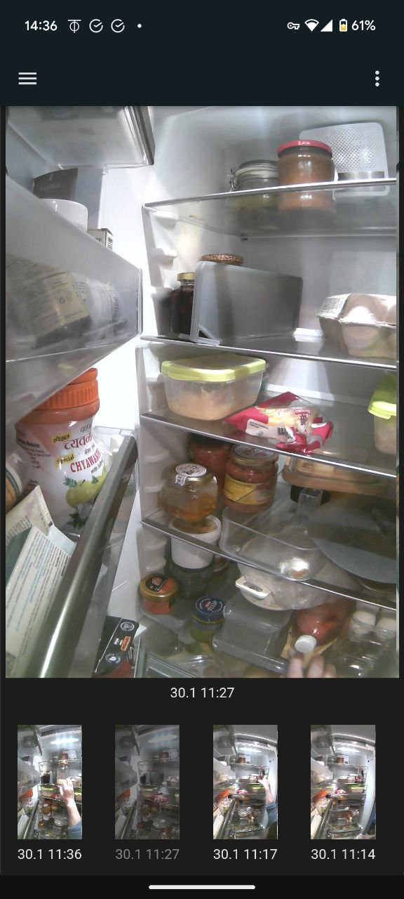
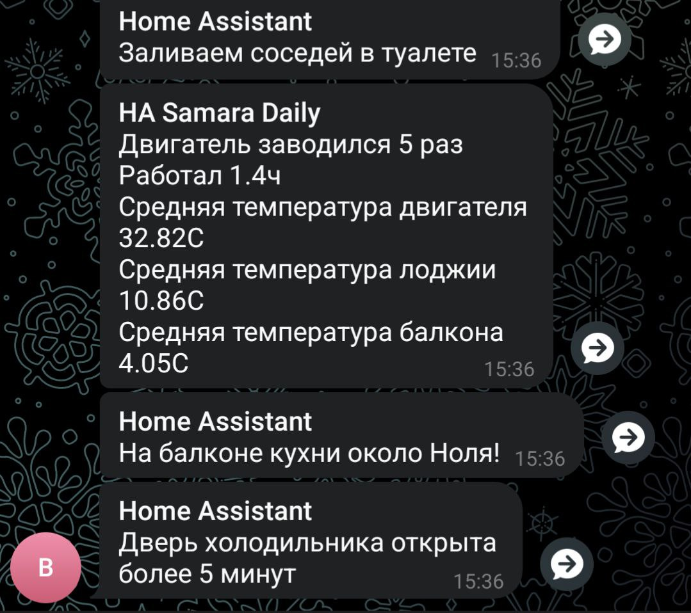
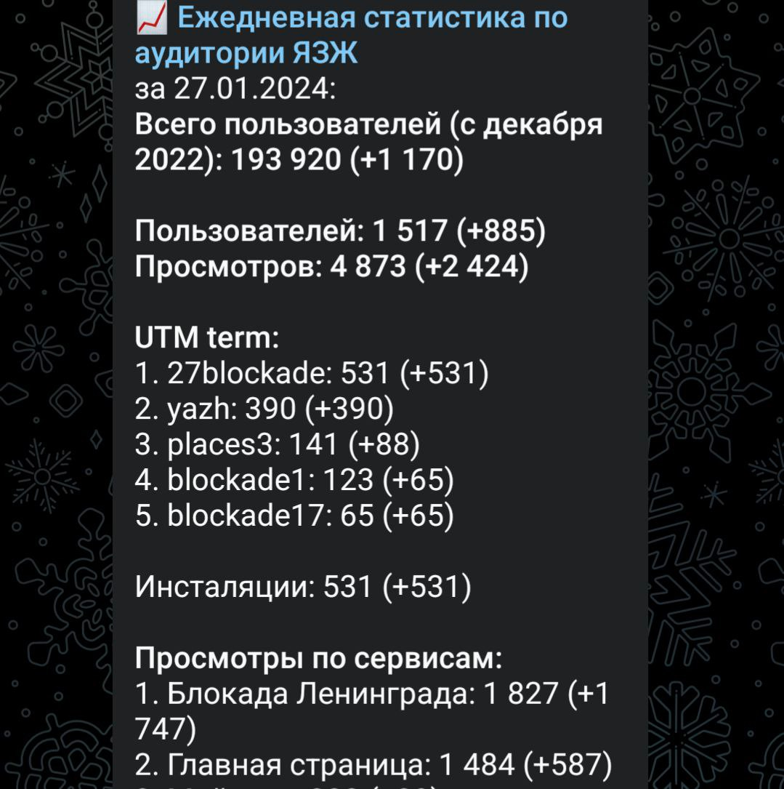

# 11. Управление на основе цифры 

Краткие тезисы по главе

- [Автор акцентирует важность управления на основе Цифры именно для России. Почему мы такие особенные?](#why_digital_russia)
- [Неожиданно в контексте управления автор начинает говорить о темпераментах, отношениях в команде и их измерениях.](#relationship_management)
- [Управление важными процессами на основе Цифры, с точки зрения автора, неразрывно связано с процессом постоянных улучшений.](#continual_improvement)
- [Предлагается взглянуть на подготовку правильного управленческого отчёта как на рецепт, например, борща :-)](#report_as_borsch)
- [Пункт 1 — выписываем, находим или покупаем все необходимые для борща продукты. Т.е. находим источники данных.](#products)
- [Пункт 2 — чистим и нарезаем все ингридиенты, подготовив их для приготовления. Приводим данные в единое соответствие.](#clean)
- [Пункт 3 — поджарка, варка, перемешивание всех ингридиентов в определенных пропорциях, температуре и времени. Формируем модель данных.](#process)
- [Пункт 4 — сервировка и подача блюда. Создаем представление данных. Проблема подготовки отчетов, что зачастую этим этапом начинают и заканчивают.](#present)
- [Как сделать вдумчивый подход и практику измерений для молодых руководителей такими же привычными как чистка зубов?](#reporting_for_dummies)
- [Можно показывать как на практике управлять критическими для всех людей ресурсами. Редко кто всерьез анализировал самый важный — Время.](#time)
- [Контроль ключевых показателей организма меняет привычки, влияющие на Здоровье. Байка о русских и лифтах. Мысли о Спорте, Полётах и Сновидениях.](#health)
- [Учёт каждой траты и необходимость периодического сведения баланса по счетам формируют привычки по управлению Деньгами.](#money)
- [Технологии Умного дома, позволяют реализовываться автору как Архитектору и Разработчику, контролировать состояние и повышать комфорт Дома.](#home)
- [При создании сервисов Цифрового Петербурга наиболее сложная работа состоит в поиске и получению доступа к данным.](#api_petersburg_ru)
- [Комитет Финансов Санкт-Петербурга проводит мероприятия нацеленные на ликвидацию финансовой безграмотности.](#finance_for_citizens)
- [Инициатива Твой Бюджет 2.0 нацелена на создание цифровых сервисов совместно с активистами и является образовательной практикой.](#your_budget) 
- [Автор сожалеет о элементарных, но распространенных ошибках в управлении и даёт ссылки на полезную литературу и фильм.](#summary_and_references)

## Почему цифра особенна важна для России? 

В первой части текста рассуждал о том, что [рациональные навыки управления и ведения хозяйства не являются сильной российской национальной чертой](../analysis/strana.md#russian_management). Очень похожий вывод от исследования также увидел в [ранее упомянутом докладе Сергея Иванова "Душа России на распутье"](./personalnaya-sistema-cennostei.md#dualism), где буквально в первых же минутах говорится о том, что в России больше людей, которые видят мир через призму собственных представлений, опираясь на веру, чем на объективные факты и цифры. Аллегории с Иванушкой-дурачком, который лежал на печи и мечтал, вполне уместны. Возможной причиной такой нашей особенности могут быть наши богатства, [о чем писал ранее и дал наводки на куда более глубокий анализ](../analysis/strana.md#big_size_matters), но важнее обсудить, Что с этим делать? И ответ, как будто бы, очевиден — для будущих руководителей, которые будут сохранять и приумножать наши богатства, развивать рациональные подходы в сохранении и контроле важных ресурсов ещё со школы, не забывая про [духовные ценности](./personalnaya-sistema-cennostei.md#god_and_science). Целевая модель — балансная, без перекосов.

У людей разные темпераменты и образы мышления и подходы к управлению у всех руководителей будут, пожалуй, тоже разные. Объективный и количественный подход в принятии решений, основанный на динамике изменений численных показателей в ключевых процессах (Key Performance Indicators, KPI или Objectives and Key Results, OKR) — лично мне, видится отличным подходом. Чем больше данных и точнее модели отражающие эти процессы — тем точнее принимаемые решения. Очевидно, что агитировать за использование Цифры в управлении уже давно бессмысленно. Высказывание бизнес-гуру и экономиста Питера Друкера я привожу [в каждом удобном случае, даже в контексте Счастья](./schaste-kak-predmet-srednei-shkoly.md#models_in_history):

> Не можешь измерить — не можешь управлять. Или. Можно управлять только тем, что можно измерить.

## Измерения темперамента, сильных и слабых сторон 

И руководитель, он же не про команду, прежде всего. Задача руководителя помимо понимания проблемного места целевого состояния фронта своей работы и его индикатора — сплотить коллектив. И это про человеческие отношения, который как и Счастье, как будто бы, невозможно измерить и нужен опыт, умение слышать и для каждого найти правильные слова. Но этот текст, как раз, начинался с того, что в успешных компаниях руководителей [учат измерять темпераменты и сильные/слабые стороны личностей в своих командах](../analysis/sledovanie-prizvaniyu.md#mbti_personalities). Измерять в процентах отклонения от балансных показателей. И если общеизвестные виды темперамента (сангвиник, холерик, флегматик, меланхолик) слабо применимы в работе на практике, то 16 психотипов с учётом сильных отклонений от баланса 50/50 и шпаргалка по сильным сторонам психотипа уже позволяют лучше понять руководителю — как по разному на одну задачу будут смотреть и делать её сотрудники. Это знание, возможно, убережет особо уверенных в себе руководителей от стиля "Я начальник, ты дурак". И напомнит, что у каждого свой взгляд и сильные стороны и задача руководителя помочь найти каждому его место. Зачастую слыша упреки по поводу методологий MBTI, DISC, соционика — "это не доказано, это не наука, жизнь сложнее" и т.д. вынужден подчеркнуть — Да, это не наука, а практический подход, который работает в 90% случаев и с которого можно начинать разбираться в предмете. Да, жизнь в нюансах очень разнообразна, но есть и общие правила. В английском для такого подхода даже есть название — Rule of thumb. Попытка измерить что-то грубо, на глаз с помощью пальца. В русском не нашёл аналога. Подсказали про "эмпирический подход", вспомнил про "Метод научного тыка", но это немного другой смысл. Есть Правило большого пальца правой руки в физике, но это совсем про другое :-) 

## Цифровая Трансформация для Постоянного Улучшения 

Даже опытные управленцы зачастую не видят важность первичных данных при анализе узких мест в производственных процессах. Сразу начинают говорить о внедрении полномасштабных информационных систем, которые должны решить какую-то проблему раз и навсегда. Звучат термины — CRM система, ERP система, упоминаются программные продукты от компаний SAP, Microsoft, 1С, Битрикс, amoCRM и т.д. Это очевидный подход, но на мой взгляд, для начала, хорошо бы самому разобраться в том, что является критической проблемой процесса и оцифровать ключевой показатель, связанный с этой проблемой. Стоит самому изучить проблематику на базовом уровне. С помощью быстрого и доступного инструмента типа Excel или Яндекс Форм можно создать прототип и отследить слабые звенья. Понимание процесса и ежедневный контроль ключевых показателей, пусть даже собираемых пока на коленках, намного важнее, чем внедрение какой-то очередной системы без понимания нюансов. В какой-то момент назревает целесообразность внедрения единой платформы, но не разобравшись с первопричинами, очень часто такой подход создает ещё больший неработающий зоопарк.


В Microsoft мы с другом, как раз, помогали найти такие причины сотрудникам российских предприятий и обучали как быстро и совершенно незатратно можно с помощью Цифры анализировать и находить решения. Даже сделали типовое [консалтинговое предложение](https://bd.webzavod.ru/), но такой проект должен начинаться с собственника. На каждом предприятии проблема будет своя уникальная, со своими нюансами и причем слабо зависимая по сложности от размера бизнеса. Иногда даже на малом предприятии найти узкое бутылочное горлышко сложнее, чем на большом предприятии, а возможность оплаты такого проекта будет различаться в несколько порядков. В результате мы много где помогли, что видно на странице Клиентов, но сделать из этого бизнес желаемого размера не получилось. Нужно было самому становится наёмным консультантом с уровнем зрелости и общения не ниже собственников этих бизнесов. И эти метания в поиске контакта руководителя крупного предприятия и формирования доверия у него требовали порядочно усилий с непредсказуемым результатом, а для малого и среднего бизнеса зачастую не окупались. Товарищ до сих пор обучает и помогает создавать инструменты контроля на платформе Microsoft. И подход этот неизменно работает и улучшает ситуацию, если не увлекаться лишнего и не пытаться на Excel делать несвойственные для него вещи типа автоматизации макросами. 


## Кулинарный рецепт подготовки хорошего отчета 

На практических занятиях создания отчётов с сотрудниками крупных предприятий мой друг придумал прекрасный наглядный пример правильного подхода к работе с данными для контроля ключевых показателей. Большинство участников этих тренингов, которые готовили отчеты, были женщинами и явно не понаслышке знали как готовить еду, поэтому кулинарный пример получился максимально доходчивым.

Представьте, что вам надо приготовить борщ. Вкусный, который будут нахваливать гости. И вот теперь давайте разбираться по порядку из чего состоит процесс приготовления.

### Поиск продуктов / Получение доступа к данным 


Нам потребуется аккуратно выписать и найти все те продукты, которые потребуются по рецепту - Мясо с костью, Капуста, Свёкла, Лук, Морковь, Картошка или Фасоль, Сельдерей (опционально), Сметана, Вода… Очень желательно, чтобы на первом этапе все продукты были отдельными, т.е. не были заготовками и полуфабрикатами и, конечно же, наилучшего качества — должны быть очень свежими! Протухший или недостающий ингредиент может загубить всю идею Борща на корню.


Также и с отчетом — нам нужно определиться какие первичные данные нам потребуются и где мы их возьмем. Допустим, нам потребуется список пользователей, список их заказов со всеми атрибутами и статусами, список магазинов и т.д. Мы должны убедиться, что доступ к данным у нас постоянный и в любой момент мы получим актуальную версию, а не какую-то выгрузку недельной давности. Актуальную информацию можно всегда получить если есть программный доступ (Application Program Interface, API) к системе или источнику, где используются эти первичные данные. Всякие временные выгрузки являются полумерой и в какой-то момент "несвежие" данные делают отчёт нерабочим.

### Подготовка ингредиентов / Подготовка данных 


Дальше, обычно, мы чистим лук, морковь, свёклу, нарезаем на одинаковые по размеру кубики, дольки, трём на терке, фильтруем воду. Шинкуем капусту. Складываем излишки в холодильник и раскладываем по красивым контейнерам для последующего приготовления. Грязная, нечищенная и целая морковь недопустимы. 


Иногда к данным отношение не столь же требовательное как к продуктам и их пытаются начинать использовать не разобравшись в формате и нюансах. Данные тоже надо подготовить, структурировать и удалить лишнее. Например, оставляем только активные заказы, убирая все выполненные. Очищаем данные — убирая дубликаты заказов, приводим и преобразовываем значения в единый формат. Сохраняем их для многократного использования. Наводим красоту с форматом и хранением уже на этом этапе.

### Процесс приготовления / Подготовка цифровой модели 


Далее всё смешиваем в правильной последовательности, длительности приготовления и температурных условиях. Обжарить лук, добавить туда же морковь, потом свеклу. Параллельно отварить мясо. Потом всё это объединить и ещё варить вместе до готовности. Перчим, солим — обогащаем вкусовую палитру. Хорошо бы ещё настояться дать. Следование рецепту и нюансам приготовления очень важно. В серьезных ресторанах процесс жёстко регламентирован и соблюдается для сохранения постоянного вкуса и качества, а умелые повара доводят процесс до полного автоматизма, на глаз (Rule of Thumb) контролируя процесс.


С отчётами мы делаем очень похожие вещи — наборы данных объединяются друг с другом в определенной последовательности с помощью идентификаторов. Группируются по определенным признакам, вычисляются агрегатные показатели. Объединенные выборки данных обогащаются с использованием внешних функций. Все действия мы чётко фиксируем в виде алгоритма и программируем на автоматическое исполнение по расписанию или нажатию кнопки.

### Сервировка и подача / Подготовка отчета 


Ну а когда борщ готов, прошли сутки — можно разливать по тарелкам красивым, разогревать пампушки, доставать хлеб, чеснок, сметану, смалец и готовить сопутствующие напитки. Делаем всё так, как понравится нашим едокам.


С отчётом также. Представление, где взгляд сразу падает на ключевые показатели и можно проанализировать динамику и влияющие причины, мы облекаем в удобную для руководителя форму — распечатываем или выводим на панель в кабинете. Или отправляем сообщением в мессенджер, в котором руководители сидят с засученными рукавами по локоть в рабочих процессах.

На моей практике, зачастую, приходится наблюдать как задача отчетности решается с конца и внимания уделяется заключительному этапу больше всего. Сотрудники “разлиновывают” форму, к которой привык руководитель, и Excel зачастую используется только как инструмент табличной формы представления данных. Данные берут не первой свежести из почты или недельных выгрузок в том же Excel. И чаще всего вручную, copy-paste, заполняют таблицу, в лучшем случае используя функции подстановки или макросы, которые уже давно использовать нельзя. Зачастую промахиваясь ячейками. Новым сотрудникам передаются тонкости и “секреты” подготовки отчетов для руководства, а новые сотрудники все равно нещадно “косячат”. Буду рад ошибаться, но 10 лет назад это был самый распространенный способ подготовки управленческой отчётности на крупных ведущих российских предприятиях машиностроения и металлургии. А в государственном управлении такое и сейчас наблюдаю.

Проводя обратную аналогию, насколько получается свежий, вкусный и горячий борщ если уделять время сервировке, но не качеству продуктов и следования рецептуре — можно догадаться.

## Развитие базовых навыков управления на основе Цифры 

У управленцев любого уровня эти навыки работы с цифрой должны от зубов отскакивать, если в ночи разбудят. Качества данных, которое используется для принятия важных решений, не должно вызывать сомнений, также как уверенность к свежести продуктов блюда, для своих близких. Пока не поменяем отношения к цифре и процессам на самом базовом уровне, так и будут рассчитывать на авось и богатство нашей страны. Вот такое моё субъективное мнение. А как эти навыки формировать? На мой взгляд, начиная со школы и на наглядных, интересных и практических примерах.

Не знаком с программой старших классов в школе. Дочь, насколько помню :-), уже ВУЗ заканчивает, а сын, вроде бы :-), в средние классы перешел, и я не слышал от них о таких предметах.

Ничто так не усиливает рабочие навыки как постоянная практика. Сам стремлюсь измерять наиболее важные ключевые показатели, которые имеют особенную ценность для меня не только по работе, но и по жизни в целом. Тем более, когда не разделяешь эти два понятия. Когда значения и динамика изменения ключевого показателя нормализуются, причины влияющие на него становятся понятными, процесс корректировки входит в привычку и внимание переключается на другой показатель.

### Время 

Я бы порекомендовал начать с наиболее важного и невосполнимого ресурса — Время. Очень просто запустить эксперимент и выписывать в течении 2-3 недель на что было потрачено время за прошедший день. Вполне подойдет онлайн таблица Google Sheet или аналог. Такая практическая задачка по силам пятиклассникам. Сколько времени ушло на сон, утреннюю раскачку, на еду, на дорогу, на обучение или работу, на отдых в промежутках, на игру, кино и зависания в телефоне, на общение. Не всем это нужно, но до 20-30 лет, вероятно, было бы полезно всем получить такой опыт и осознать, на что уходит время. 

| Дата	     | Занятие                  | Время (часы) |
| -          | -                        | -            |
| 25.01.2024 | Сон                      | 8            |
| 25.01.2024 | Побудка                  | 0.5          |
| 25.01.2024 | Еда в одиночку           | 0.5          |
| 25.01.2024 | Дорога пешком            | 2            |
| 25.01.2024 | Контроль в Telegram      | 4            |
| 25.01.2024 | Текст                    | 4            |
| 25.01.2024 | Обед в компании          | 1            |
| 25.01.2024 | Ужин в компании под вино | 2            |
| 25.01.2024 | Чтение                   | 3            |

Главное в процессе учёта себе не врать и не заниматься приписками. Особенно по роду занятий, которое не приводит нас к росту Интегрального Счастья. Спустя месяц с [помощью механизма Сводных таблиц](https://support.google.com/docs/answer/1272900?hl=ru) в Google Sheets или Excel сгруппировать эти записи по роду занятий и посмотреть суммарные значения и пропорции. Анализ зачастую отрезвляет и меняет привычки в моменте. Тем более, когда уже отдохнул достаточно, начинаешь тупить и помнишь, что потом придется занести это время в табличку. 

### Здоровье 

Как только ближе к 40 начали возникать первые вопросики по здоровью, пошёл учет показателей с ним связанных.

У меня совсем не очень хорошая наследственность по диабету и гипертонии и есть значительные риски. Постоянно мерить давление у меня не получилось. Электронный тонометр, который я таскал с собой, меня сильно перепугал, показывая слишком высокие цифры и я ещё больше начинал нервничать. Но вот ручные измерения, сделанные аналоговыми тонометрами вставленными в уши докторов-профессионалов старой школы, меня успокоили. Периодически проверяю, вроде в норме.

Ежедневные показатели по сахару натощак меня поначалу тоже напрягали. Но увеличение физической нагрузки и корректировка рациона довольно быстро сделали эти показатели приемлемыми. Продолжаю их контролировать. Нашел глюкометр с синхронизацией данных, который сразу же считает средние значения и учитывает пороговые и стремлюсь держать средние показатели в норме, корректируя нагрузки или питание.

По питанию учитывал даже не калории, а углеводы. При этом искал варианты блюд, которые обязательно нравились бы, а не просто были полезными. Купил платную подписку на приложение для удобного и быстрого ввода данных и автоматизации подсчета. Учитывал до тех пор, пока не добился желаемых результатов по весу и уровню сахара и не сформировал привычку. После чего учёт становится ненужным и внимание переключается на другие проблемки. На мой взгляд, Посты в религиях изначально имеют цели совершенно не связанные с диетами. Это скорее про мысли, которые стоит привести в гармонию и подпилить себе рожки гордыни, но побочное действие от воздержания в излишествах также идёт на пользу фигуре. Хотя в любом случае, постоянное желание что-нибудь сожрать такого, чтобы похудеть на 5 килограммов, конечно же, остаётся :-)

Ходить на какой-либо спорт периодически я совершенно неприспособлен — это не про лень вообще. Но [мой психотип Архитектора](../analysis/sledovanie-prizvaniyu.md#architect_personality) формирует отношение к Спорту как к какой-то сублимированной истории состязательности, в своих корнях имеющую много общего с Войной (вспоминается экстремальная максима экстремальной группы Slayer — The Sport is Total War). Я ни в коем случае не против Спорта, есть ещё как минимум 15 других психотипов, просто это не моя вода и лично мне радости эта состязательность не приносит. А нагрузки и необходимое преодоление можно найти другим образом. Поэтому активности стараюсь встраивать в повседневную жизнь, не тратя на спорт драгоценное время. Первое же устройство Fitbit, которое появилось на рынке в начале 2000х было немедленно куплено. 7-8 тысяч шагов в сутки не хватало для улучшения здоровья в привычном образе жизни. Следуя [принципам баланса](./personalnaya-sistema-cennostei.md#dualism), осознанно смешивал подходы древние и инновационные — первым делом принёс в жертву благо цивилизации автомобиль и практически отказался от его использования в перемещении по городу. Количество шагов увеличилось в 3 раза. Заодно увеличилась положительная дельта ежемесячных финансовых показателей и где-то Грета Тунберг захлопала в ладоши. Или она ещё тогда не родилась? Средний показатель на сегодняшний день порядка 15 тысяч шагов в сутки. В поездках или походах показатель драматически увеличивается. Стараюсь не пользоваться лифтами, особенно после услышанной забавной истории. В летние периоды с огромным удовольствием использую велосипед. Каждый раз нехотя выкатывая его во двор думаю, что в этот раз поеду спокойно... Но, когда выезжаешь на просторную набережную лейтенанта Шмидта навстречу Неве, непроизвольно встаёшь с седла, нажимаешь на педали и вот ты уже летишь в мощнейшем ощущении Счастья. И вот это для меня имеет значение!


В Microsoft ходила внутренняя забавная история из начала 2000х про русского разработчика, который переехал работать в Штаты. В потоке счастливых обладателей загородных домов и больших машин он каждый рабочий день приезжает в downtown, в офис и проходит мимо толпы своих коллег, которые в холле бизнес центра со стаканчиками Starbucks коротают время в small talks в ожидании лифта, и направляется к пожарной лестнице. Офис Microsoft был (условно) на 26 этаже. Стоит ли говорить, что порой ему вслед крутили пальцем у виска... И вот как-то раз один остряк бросил ему вслед:

— А что, русские не умеют пользоваться лифтами? ;-)

Ответ прозвучал молниеносно:
— Умеют, но русские ещё умеют ими НЕ пользоваться.


Сон — важнейший физиологический процесс, который тоже довольно точно измеряют современные часы-браслеты. Даже с учётом фаз — глубокий сон, легкий и быстрый. В зависимости от того чего больше хочется — отдыха или сновидений интересных, пробую воздействовать на увеличение той или иной фазы с помощью затемнения, физических занятий и питания. А также [устройства, которое влияет на эти фазы](https://deep-russia.online/). Результат не всегда, но всё же есть, а порой значительный. Да и уважаемые мной специалисты подтвердили, что определенный эффект должен быть. Друзья с опытом использования даже звучат более уверенно. А особенно яркие и интересные сновидения также выписываю как моменты Счастья, пополняя [интегральный показатель Счастливой жизни](schaste-kak-predmet-srednei-shkoly.md#brief_happiness_model).

### Деньги 

Пока в стране не наступил другой экономический уклад и деньги играют важную роль в жизни каждого, ими надо учить управлять. Про финансовую грамотность многие говорят, кто-то уже просвещает (смотри далее), но я бы даже не начинал рассказывать про финансовые инструменты без сформированной привычки учёта всех транзакций с поступлениями и тратами. Тем более, что это уже работает практически автоматически в контуре одного банка. В Тинькофф и Сбере уже есть инструменты для выработки правильных привычек. В 90е годы таких сервисов от банков, конечно же, не было и тогда, помню, начинал использовать Excel и Microsoft Money. Сейчас есть несколько удобных сервисов для контроля персональных финансов. Тем более отдельный инструмент для учёта необходим если счета заведены в нескольких банках. Учет онлайн транзакций можно полностью автоматизировать, а вот оплата наличными потребует ручного ввода. Также как процесс подведения баланса по счетам и выявления расхождений. Заодно неминуемо проводишь анализ по тратам и остаткам. И когда баланс, наконец-то, по всем счетам сходится и все недочеты поправлены — случается маленький момент Счастья, как после генеральной уборки в квартире, когда всё сверкает чистотой. Порядок! :-)

Дочь получила свою банковскую карточку в 15 лет в 2017. Т.к. финансы я учитывал постоянно — понимал сколько уходит на её образование и сопутствующие потребности — оплата школьных завтраков, кружков, репетиторов, проверки у врачей, сезонная одежда и т.д. Весь этот бюджет начал перекидывать ей на карту. Чтобы она оплачивала их самостоятельно и формировала свои привычки управления деньгами и понимала сколько что стоит пораньше. Если может не платить репетитору, а самостоятельно выучить какой-то предмет — прекрасная мотивация. Я её даже не собирался контролировать в этом. Уже 3 года как она зарабатывает и, насколько мне известно, применяет инструменты инвестирования. Размер её заработка, на мой взгляд, не так важен, как привычка учитывать эти деньги и выбирать работу, которая доставляет бОльшее удовольствие, а не оплату. Сын недавно получил карточку в 11 лет. Посмотрим как пойдёт — дети очень разные :-)

### Умный Дом 

Дома хочется качественно отдыхать, иначе потом работать не получается. Важные показатели места, в котором я живу включают температуру, влажность воздуха, содержание в нём кислорода или CO2, энергопотребление, местоположение автомобиля, его статус и состояние. Интересно было повысить комфорт с помощью собственных сервисов контроля наличия продуктов в холодильнике, умного управление светом и системами кондиционирования. Мониторинг всех этих значений, уведомления по событиям и ежедневная статистика, интеграция сервисов с колонкой Алисой и автоматизация процессов максимально созвучны основной моей деятельности на работе. Самостоятельное улучшение системы умного дома позволяет мне не забывать навыки программирования и поддерживать себя в тонусе, хотя я уже давно не являюсь профессиональным разработчиком. Тут, как мне кажется, наилучшим образом работает [принцип следования Призванию](../analysis/sledovanie-prizvaniyu.md#frequent_happiness), когда не разделяешь работу от остальной жизни. Когда процесс входит в привычку, внимание переключается на другие измерения.

## Открытые данные Цифрового Петербурга 

Важность первичных данных для контроля ключевых процессов невозможно переоценить, а один американский бизнесмен в 2006 году метко сказал про новые приоритеты в экономике:

> Данные — это новая нефть.

Могу признаться, что не менее 50% сложностей [для команды Цифрового Петербурга в создании мини-аппа "Я Здесь Живу"](./ya-zdes-zhivu.md#mini_app_vkontakte) заключаются именно в поиске и получении доступа к этой нефти, а не в программировании и создании интерфейсов приложения. Даже если эти данные лежат в недрах какой-то организации, не являются персональными или секретными и не используются толком — отдавать их обычно не торопятся. Всё таки у всех есть понимание, что это реальная ценность и их, на всякий случай, лучше держать при себе. Да и понятно же, что как только будет получен доступ к этим данным, сразу начнутся уточняющие вопросы один за другим. И начнут вскрываться разного рода недоработки и проявляться серые зоны, в которых не наведен порядок и даже видны возможные нарушения. Поэтому когда цифровизаторы приходят в организации и начинают задавать вопросы о данных и целевых показателях ключевых процессов — это как если бы к вам домой пришел доктор с градусником и линейкой без приглашения и начал делать всякие измерения. Мало кому такое понравится. Помогают [поручения, связанные с открытием данных для развития систем Искусственного интеллекта на государственном уровне](../analysis/strana.md#russian_it). Хотя после открытия данных и их анализа ситуация, как правило, улучшается со всех точек зрения и для всех участников.

Ещё в 2020 году были создан каталог цифровых сервисов для петербуржцев. Но что важнее, с точки зрения развития экосистемы, также был запущен каталог программных интерфейсов (Application Program Interface, API) с доступом к городским данным. С использованием этих данных было проведено несколько хакатонов для разработчиков. 1 июня 2022 года запустили глобальный четырехмесячный [конкурс "Код Петербурга"](https://vk.com/@vkappsdev-vyigrat-priz-i-pomoch-gorodu-otkryvaem-konkurs-vk-spb) на разработку городских приложений поверх данных [API.petersburg.ru](https://api.petersburg.ru) от лица губернатора Санкт-Петербурга совместно с социальной сетью ВКонтакте.

Для планирования и создания новых сервисов экосистемы Петербурга и развития функций [приложения “Я Здесь Живу”](https://vk.com/ya_zdes_zhivu) было проведено 9 масштабных мероприятий с привлечением более 400 участников из разных комитетов и организаций, чтобы отобрать 13 потенциальных сервисов для реализации и определить какие данные для них потребуются. Могу предположить, что основная ценность этих мероприятий заключалась в том, чтобы вовлечь сотрудников государственных организаций в процессы, связанные с созданием сервисов и сформировать у них представление о важности открытия данных.

Для команды рост числа активных пользователей сервиса "Я Здесь Живу" является на данный момент самой важной метрикой. Сколько НОВЫХ пользователей пришло в сервис за вчерашний день сообщает служебный чат-бот в групповом чате КАЖДЫЙ день. Ключевые показатели и узкие места меняются и должны корректироваться как только они перестают быть узкими. Как только запускается новый сервис и мы побиваем свой же предыдущий рекорд в группе взлетают сердечки Общего Счастья :-)

## Финансовый ЛикБез [(Сергей Сергеевич Поляков)](./equator.md#zpss) 

Стоит отметить, что интересы команды "Цифровой Петербург" в части расширения аудитории очень сильно пересеклись с задачами Комитета финансов СПб. Попробую раскрыть эту мысль.

Одной из целей деятельности Комитет является борьба с безграмотностью в управлении личными финансами жителей города. Действительно, уже с 2016 года Комитет пытается бороться с финансовым мракобесием. Для начала расскажу про первые «яркие» подходы «к снаряду». 


В начале 2017 года к нам пришел один «товарищ», который уверял, что для разгромной победы над безграмотностью необходим лишь правильный маркетинг и продвижение. После его уверенных речей забурлила активная деятельность по проработке идей для социальной рекламы. В то время, как раз, активно начали набирать оборот микрокредитные организации, и, соответственно, мы решили, что наша целевая аудитория — это как раз клиенты таких фирм. 
Я, будучи человеком достаточно прямолинейным, решил, что максимально попадающий в точку портрет человека в трудной жизненной ситуацию — это портрет типично питерского БОМЖа. Кстати, как-то имел разговор с теперь уже одним из великих руководителей Санкт-Петербурга, на тему — Почему это бездомных так и тянет сюда, на север. Заключение его было забавное. Как он выразился, если бы он был на их месте — то точно подался бы в Сочи, а не в Питер.

Соответственно на просторах интернета была найдена фотография бедолаги, к которой была приделана надпись: ”Он уже “микрокредитнулся”, а ты?”.
После дискуссий внутри Комитета финансов было принято решение не шокировать жителей и не устраивать «революций». Более того через непродолжительное время ещё и появились результаты социологии и стало понятно, что на тот момент основным потребителем МФО были не люди, попавшие в критическую ситуацию, а импульсивные молодые граждане, желающие здесь и сейчас купить себе новый гаджет.


Сейчас основы финансовой грамотности это уже более менее отстроенная система, так во всех школах она внедрена во внеурочную деятельность. В этом году, кстати, проведу тестирование на собственном ребенке :-). Мы ведем активную работу с банками через их офисы (в основном речь про телефонные мошенничества) и их мероприятия для клиентов. Вместе с ними же проводим лекции для возрастного населения. Присутствует и социальная реклама и, кстати, в этом году мы начали активно использовать не только физические носители для социальной рекламы, но и таргетированные механизмы цифрового продвижения на крупных площадках Яндекса и ВКонтакте.

Наша задача научить людей думать, анализировать, считать и делать рациональные выводы и, что не маловажно, постепенно менять себя и среду вокруг. Постепенно, итерационно, без «революций». Ставить цели и идти к ним опираясь на измеримые показатели своего результата.

## Твой Бюджет 2.0 

Так вот, одним из наших инструментов по направлению финансовой грамотности, а как мы теперь говорим и основ финансовой культуры является проект «Твой бюджет».
Это проект инициативного бюджетирования в формате краудсорсинга идей среди всех жителей, который мы проводим с 2016 года. В рамках проекта, помимо воплощения идей граждан, происходит и образовательный процесс — становится понятнее как управляется город и принимаются решения. Стоит отметить, что победители проекта вынуждены работать со своими идеями до их реализации и не получают за это наград, денег и т.п. Всё делается на чистом энтузиазме. Важнейшим аспектом "Твоего бюджета" является его коммуникативная функция. Он позволяет жителям города напрямую взаимодействовать с органами власти, высказывать свои идеи и вносить предложения по улучшению городской инфраструктуры. Это способствует повышению доверия между жителями и властью, а также создает условия для более активного участия граждан в управлении городом и повышения прозрачности данного процесса.

Экосистема общественного участия в бюджетном процессе Петербурга, поступательно формируемая с 2016 года, в виде нескольких проектов инициативного бюджетирования и соучаствующего проектирования, рассчитанных как на взрослую, так и подростковую аудиторию представлена на сайте [https://tvoybudget.spb.ru/](https://tvoybudget.spb.ru/). Если говорить о результатах, то, с одной стороны, количественные показатели не самые гигантские. 

За 7 лет в этих проектах:
- приняли участие более 100 тысяч человек;
- выбрано 160 инициатив, включая и взрослый, и школьный проекты, из них 113 уже реализованы;
- общая стоимость этих проектов — 2,8 млрд рублей.

С другой стороны, думаю, мы получили очень значимый качественный результат. Он состоит в том, что мы научились производить жизнеспособные и востребованные инструменты вовлечения горожан в принятие решений. Возможно, они не носят массового характера, но мы знаем что городским активистам известно, что такое «Твой Бюджет» и многие из них неоднократно становились участниками Проекта.

Часть из них вошла в ряды муниципальных депутатов, кто-то пополнил ряды городских активистов, есть примеры объединения нескольких городских сообществ вокруг одной идеи или проекта, создания новых коллабораций.

В 2021 году, через 5 лет после запуска проекта “Твой бюджет”, мы поняли, что его пора трансформировать. Если проект не менять, он перестает жить в проектной логике и становится рутиной. К Проекту начали привыкать и начались попытки использовать его в качестве ещё одного «источника финансирования». Вместо необычных, сложных, но «живых» инициатив мы стали наблюдать поток банальных предложений по ремонту школ и садиков, закупке оборудования для поликлиник и т.п.
Между тем, в опыте «Твоего бюджета» было много повторяющихся, системных запросов, дающих понимание, каких объектов городской среды не хватает, какие потребности удовлетворяются не должным образом. Отмечу несколько: спортивная инфраструктура для подростков, вело-инфраструктура, инклюзивная среда, соучаствующее проектирование и биоразнообразие в городе, поддержка бездомных — причем, как людей, так и животных.

В сентябре 2022 года, после летних обсуждений, в том числе с командой "Цифрового Петербурга" было принято решение о проведении следующего цикла проекта, нацелив его на создание цифровых сервисов для населения и сбор идей о том, каких городских данных не хватает нашим жителям, бизнесу, активистам. Более того? мы понимали, что в ходе реализации участники увидят какие шаги предшествуют появлению нового электронного сервиса, какие данные потребуется найти и как их подготовить, а финансирование этих инициатив, по сути, будет направлено прежде всего на формирование и открытие этих данных.

В итоге, после паузы, взятой в 2022 году на разработку новой модели, 1 марта 2023 года мы запустили обновленный «Твой Бюджет 2.0». Было немного боязно запускать проект в таком формате, ибо практик подобного мероприятия в нашей стране еще не было. Как правило, 90% всех подобных проектов по всей России (да и во всем мире) сводятся к установке “клумб” и “скамеек”, а тут была выбрана достаточно сложная тема — цифровые сервисы. Однако, если быть максимально краткими, то у нас вместе с командой "Цифрового Петербурга" пока всё получается. На первом этапе удалось собрать более сотни предложений от жителей, которые, пройдя через сито проекта, превратились в 6 полноценных цифровых сервисов, которые предстоит реализовать как часть городской инфраструктуры:
- Петербургский цифровой архив государственных финансов и управления;
- «Жду малыша» — развитие сервиса «Календарь беременности» на портале «Здоровье петербуржца»;
- Цифровая карта инфраструктуры для беспилотной авиационной системы (БАС);
- Создание и ведение сайта «Соучаствующее проектирование в Санкт-Петербурге»;
- «Город во времени, пространстве и лицах» — база данных фактов из истории города с привязкой к адресу, персоне и дате;
- Велосипедная экосистема Санкт-Петербурга.

Конечно, можно рассказать про каждый проект, но не думаю, что это формат сего документа, тем более, что эти проекты еще только предстоит реализовать. Но ключевая ценность — в раскрытии данных информационных систем Санкт-Петербурга и создании на основе этих данных сервисов для жителей, заложена в их фундамент. 

А это и есть то, что повышает прозрачность управления — открытый доступ к данным.

Что будет дальше с «Твоим бюджетом» пока даже мне не очень понятно, но, надеюсь, что в новом цикле мы сохраним его ключевую идею — открытость и прозрачность, в том числе и в «цифре».  В чем я абсолютно точно уверен, так это в том, что 2023 году мы смогли параллельно с перезапуском ТБ 2.0 поместить понятие инициативного бюджетирования в закон Санкт-Петербурга и тем самым на несколько лет вперед обеспечили возможность его существования гарантированно.

## Выводы, типовые ошибки и источники [(Сергей Поляков)](../README.md#introduction) 

На мой взгляд выбор технологического инструментария в решении задачи контроля процессов хоть и важен, но вторичен. Куда важнее уметь разбираться в сути и понимать, что надо измерять и менять. Одной из самых сильных книг, оказавших влияние на привычки в работе, была [книга "Цель"](https://www.livelib.ru/review/3908812-tsel-protsess-nepreryvnogo-uluchsheniya). Первый раз читал бизнес литературу с элементами драмы и разборок в семье :-) Всё как в жизни. Но основная мысль была донесена очень качественно и глубоко — необходимо постоянно контролировать самое узкое место в своей работе. Ну т.е. буквально каждый день измерять и следить за динамикой этого показателя. Разбираться в факторах, которые влияют на рост и падение, пробовать что-то новое, смотреть на результат, опять пробовать. И когда ситуация сдвигается с мертвой точки — искать другое узкое место. Вроде всё просто, но на практике обычно видишь, что если напряглись и начали что-то измерять, то спустя какое-то время после изменения ситуации (а может даже и без изменения) интерес ожидаемо пропадает, отчет теряет смысл и процесс опять сваливается в рутину. Каждый год показатели должны существенно пересматриваться и изменяться! Более современный текст о практическом опыте использования количественных и амбициозных целей в ИТ отрасли —  [книга "Измеряйте самое важное. Как Google, Intel и другие компании добиваются роста с помощью OKR"](https://www.livelib.ru/review/3937348-izmeryajte-samoe-vazhnoe-kak-google-intel-i-drugie-kompanii-dobivayutsya-rosta-s-pomoschyu-okr-dzhon-dorr). Такой подход отлично работает в конкурентной среде, но было удивительно узнать, что Целеполагание как понятие практически отсутствовало в литературе и, соответственно, в сознании до 1950 года и начало активно применяться лишь в 90е. Поэтому можно предположить, что подход с постановкой амбициозных исчислимых целей противоестественен человеческой природе и про это стоит помнить.

Вероятно лучшая производственная драма-триллер про критическое мышление и поиск узких мест в кинематографе — [фильм "Премия"](https://www.kinopoisk.ru/film/43235/). Ещё в год моего рождения был снят. Забавно, что в моей практике был проект, где начали измерять и контролировать отклонение от плана очень похожего ключевого показателя хода стройки. Но когда на практике подход подтвердился — руководство планового отдела в заказчике проект закопало.

В Telegram группе этого текста дискуссия [пошла ещё глубже](https://t.me/bongiozzo_public/688?comment=1819), но в целом, я верю, что раннее развитие практических навыков периодического объективного контроля на основе цифры позволит нам лучше сохранять и преумножать наши богатства. Очень больно наблюдать, как эти детские ошибки бесконтрольного управления или показушной отчётности снова и снова приводят нас не туда куда шли. И особенно радуешься, когда ситуация качественно исправляется, команда продукта и клиенты получают сервис нового уровня качества и испытывают маленькие моменты Счастья! :-)

[Краткий пересказ главы](#kratkie-tezisy-po-glave)