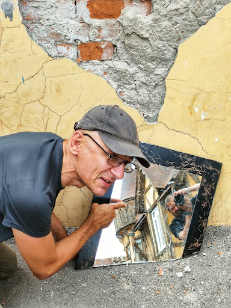
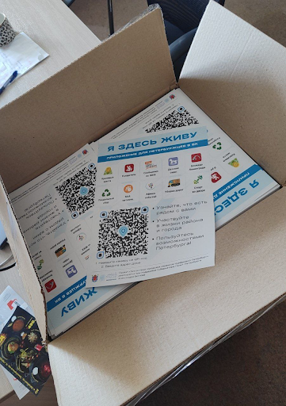
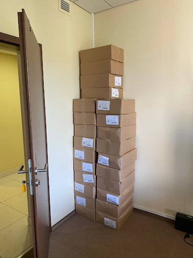

# Я Здесь Живу

Хорошая, на мой вкус, метафора — Иностранец не тот, у кого гражданство другой страны, а тот, кто не знает и не чувствует места, в котором живет. Живем-то мы сейчас, прежде всего, в своем внутреннем мире отсмотренных видео, прослушанной музыки и прочитанных текстов. Эта информация формирует определенные ожидания от реального мира, которые вызывают положительные или отрицательные эмоции, в зависимости от того насколько они совпадают с ожиданиями внутреннего. И если там мало что есть от своего города, культуры и места жительства, то корней и фундамента нет — мы не в гармонии с миром. И есть мнение, что наши города во многом заселены иностранцами. Не очень счастливыми. В таком ключе я начал размышлять сравнительно недавно. А этому предшествовало вот что.

С момента как только прошел все собеседования в 2006 году и попал на позицию Engagement Manager в компанию Microsoft мне друзья начали задавать один и тот же вопрос: - Ну что, когда переезжаете в Москву?

Это был само собой разумеющийся шаг для всех, с кем тогда общался. Соглашусь, что он был логичным — ведь руководитель и вся команда экспертов-консультантов находились в Москве, а мои заказчики были по всей стране, точнее — вне МКАДа. Но летать-то все равно приходилось через Москву. Каких-то критических причин оставаться в Самаре, на тот момент, не было. Были даже специальные программы релокации для сотрудников — помогали найти жилье, перевезти барахло, индексировали зарплату и т.д. Но мне внутри очень отзывалась поговорка «Где родился — там пригодился» и я, как будто бы, любил свой город и жгучего желания переезжать не было.

Ладно Москва… Пару раз в год мы дружной командой мотались в США на внутренние мероприятия и общались с соотечественниками, которые перебрались туда. И если раскрученные образы Нью-Йорка, Вашингтона, Чикаго, Лос-Анджелеса, Майями, Лас-Вегаса, не говоря уж про Атланту, Хьюстона и т.д. не влюбляли в себя совершенно, то Сиэтл мне нравился очень. Есть в этом портовом городе, соединяющем большие Штаты с Аляской, что-то глубинно настоящее, чего мне не хватало в остальной Америке. Деревянный рынок Pike Market со своими традициями перекидывания рыбы через ряды покупателей, индейцы на улицах, старенькие милые зданиям, среди которых первый Starbucks, а не вот эти вот доминирующие новодельно-железобетонно-пластиковые даунтауны и бесконечно-безликие одноэтажные домики, из которых преимущественно и состоит Америка. Конечно же, в Штатах у семьи был бы совершенно другой уровень жизни, сравнивая с Самарой — лес, дом, лужайка, океан, горы, супер интересная работа, экология и т.д. Практически все об этом мечтали, но это непросто реализовать, когда переезжаешь в другую страну без гарантированной и высокооплачиваемой работы. А тут, когда работаешь в глобальной корпорации с высокой внутренней культурой среди сотрудников, где каждый откликается на “Microsoft? One Team!” и все процессы релокации прозрачны и понятны — это становится делом техники. Хотелось попробовать реализовать этот совершенно рациональный и разумный проект переезда, но останавливало что-то из серии иррационального. Не тоска по березкам, конечно, но что-то похожее. Вот, например, прилетаю я (особенно ночью) в самарский аэропорт Курумоч, выхожу из самолета на трап, вдыхаю полные легкие воздуха и чувствую сырой, но свежий запах Волги, хотя она довольно далеко. И счастлив в этот момент — я дома! А в Штатах, кстати, меня почему-то по прилёту всегда преследовал запах прогорклого масла, который первое время на контрасте особенно ощущается. И от этого как-то грустновато становилось :-)

В 2012 году после цепочки событий в Microsoft Russia сам себе обострил выбор — либо идти на позицию Incubation Lead с руководством в Мюнхене и продвигать набирающий обороты Microsoft Azure в Центральной Европе, либо закончить этот семилетний этап своей жизни и вернуться в собственные проекты. И решился на второй пункт. Семья была в полном (прошу прощения) “ахрене”. А дочь недавно рассказала, что у неё тогда чуть ли не травма была детская. Папа, работая в крупнейшей компьютерной корпорации, мотался по всему миру и семью с собой возил по возможности. И везде нас встречали приятные друзья-сотрудники. Этот мир рушился :-)

Заниматься продвижением облачной платформы из Самары на несколько стран было уж совсем странно — рано или поздно пришлось бы ехать дальше. А помимо березок, которые много где растут за рубежом, и Волги, к которой явно привязан и даже иногда разговариваю с ней, есть ещё одно важное обстоятельство, которое хорошо и со знанием дела обозначил Довлатов одной фразой. Неожиданно для его образа, с объективно количественной оценкой: 

> На чужом языке мы теряем восемьдесят процентов своей личности. Мы утрачиваем способность шутить, иронизировать. _Сергей Довлатов_

В общем, пожалуй, уже понятно к чему я тут старательно подвожу мысль. Но, лучше сделаю ещё один круг перед заходом на посадку… Иду это я по любимой Самаре, за которую держусь всю свою жизнь, по её старому центру и что же вижу и чувствую по сравнению с городами, сравнимой истории? Обычно вижу разруху и чувствую горечь от утраты прекрасного некогда города. Кто виноват не буду анализировать — нюансов тьма, хотя думаю, что вина в очень большой степени на нас самих, на тех, кто живет в этих домах и рядом. Как минимум за то, что допустили этот развал. Самим ведь можно многое отремонтировать! В конце концов, привлечь внимание к проблеме — можно разобраться в причинах и системно воздействовать, эскалировать, а не просто махнуть рукой. В старом городе зачастую попадаются чистые и интересные дворики, с палисадником, в которых жители сами наводят красоту. И эти оазисы вызывает особо милые и приятные чувства.

Очень крутые самарские ребята придумали и запустили инициативу «Том Сойер Фест». Суть проста — собирается неравнодушный народ и привлекается небольшой бюджет от спонсоров. Вместе восстанавливают старые развалюшки до приличного состояния. Создали целую методологию, написали книги «Как любить город не только на словах» (_отличный, кстати, заголовок!_), двигаются по стране — в списке присоединившихся насчитал 64 группы, включая Питер. Всё это можно увидеть на [их сайте](http://tsfest.ru/) и [ВКонтакте](https://vk.com/tomsawyerfest) и присоединиться к движению. 

Но, пожалуй, очевидно, что этих активистов не хватит, чтобы восстановить несколько кварталов города. Тогда привлекают внимание жителей к старым дворам и домам через мероприятия в них — вот, например, получилась [такая фотовыставка на стыке двух городов](https://vk.com/wall-3611243_14815). И музей Алабина с Андреем Кочетковым во главе делают [целую серию разных, в том числе просветительских, дворовых выставок «Сохранить как…»](https://vk.com/wall-3611243_15071). И таким образом происходит передача Истории и Знаний о месте, где ты живешь. Появляется какая-то связь с этим местом. И в этот момент уже что-то незримо меняется и становится не всё равно, что стена осыпается и надо с ней что-то делать — либо самому ремонтировать, либо методично решать эту задачу, по всем правилам вовлекая ответственных и придавая огласке статус решения. И как только пространство вокруг тебя становится лучше — появляется связь внутреннего мира с реальным, которая даёт тебе опору, уверенность и добавляет момент маленького счастья в интегральный тон каждый раз, когда проходишь мимо. Вероятно каждый день маленький кусочек счастья :-)

С 2020 года работаю в Санкт-Петербурге и опять испытываю дежавю с вопросом о переезде. А иногда даже слышу заявления со стороны, что теперь и семья моя в Петербурге. Нет. В Питере я работаю и тут я, действительно, живу, т.к. на работу уходит бОльшая часть жизни. И Санкт-Петербург, действительно, самый мой любимый город. Не в обиду Самаре, которая родная от рождения, как мама. А с Питером другие отношения… В детстве ещё влюбился в Ленинград. И почему-то думал тогда, начитавшись Шерлока Холмса, что Лондон — это Питер в кубе, и своей туманной «альбионностью» он меня сразит наповал. Но когда в 2006 удалось пожить в «зе кэпитал оф грейт британ» всё таки осознал, что нет у него никаких шансов занять соразмерное культурной столице место в моем сердце. А Васильевский остров, который изначально задумывался Петром как центр города и на территории которого произошло бесконечное количество важнейших для России событий, пожалуй, лучшее место на Земле для реализации принципа «Я Здесь Живу» :-)

И вот в 2020 [мы с прекрасной командой строим «Цифровой Петербург»](https://about.petersburg.ru/). И есть возможность в любимом городе реализовать новые подходы. Штормим и ищем идеи для потенциальных сервисов, которые будут максимально востребованы жителями и изначально отталкиваемся от их потребностей, что обусловлено принципами человекоцентричного государства. В современном градоуправлении без этой Я-центричности не обойтись. Выписываются роли «Я — Родитель», «Я — Водитель», «Я — Пассажир», «Я с Питомцем» и т.д. Прикидываем количество петербуржцев в каждой роли. Перечисляем обычные потребности под каждую из ролей, сортируем их по частоте возникновения и важности. Например, Где дать ребенку дополнительное образование? Где припарковать машину? Но замечаем, что каждая из этих ролей имеет явный акцент на области, которая близка к месту жительства. И вопросы, на самом деле, чаще всего звучат как:

- [Как убирается снег и мусор в моем доме?](https://vk.com/app7710919#road_cleaning)
- [Какие задачи город решал в моем доме и дворе?](https://vk.com/app7710919#our_spb)
- [В какой кружок доп образования можно отправить ребенка в шаговой доступности?](https://vk.com/app7710919#i_parent)
- [Есть ли места в ближайшем детском садике и как туда записаться?](https://vk.com/app7710919#kindergartens)
- [Что было рядом с моим домом во время блокады?](https://vk.com/app7710919#blockade)
- [Где погулять с собакой в доступности 15 минутной прогулки?](https://vk.com/app7710919#pets)
- [Зачем разделять мусор и куда выкинуть батарейки рядом с домом?](https://vk.com/app7710919#ecology)
- [Где и с кем позаниматься спортом вместе после работы?](https://vk.com/app7710919#sports_ground)
- [А что делать если мой голос по выбору УК в моем доме подделали?](https://vk.com/app7710919#falsification)
- [Почему мой дом является памятником исторического наследия?](https://vk.com/app7710919#my_home)
- [Какие новости города касаются именно моего района?](https://vk.com/app7710919)

И значит, нам нужно отвечать на разнообразные вопросы с привязкой к адресу. И мы хотим отвечать объективно, со ссылками и данными из официальных городских информационных систем. Эту роль местного эксперта — «Я Здесь Живу», который всё знает о своим доме, дворе и районе и может провести экскурсию любому гостю мы и взяли в качестве основной идеи для реализации [флагманского приложения экосистемы городских сервисов на платформе ВКонтакте](https://vk.com/app7710919_20069794). Начиная с декабря 2022 года приложение стало попадать в новости Санкт-Петербурга с анонсами городских сервисов, которые помогают получше узнать место своего жительства с разных сторон. И пока мы планируем в год запускать порядка десятка новых функций мини-аппа «Я Здесь Живу».

Ближе к концу 2023 года мы начали [рассказывать о событиях и фактах на районе не только в миниаппе, но и в мессенджерах ВКонтакте и Telegram](https://vk.com/ya_zdes_zhivu?w=wall-205339741_362). И вообще этот функционал потока сообщений, фактов и функций мы реализовали в виде [открытого API](https://api.petersburg.ru/mainPortal/api_services;role=22), чтобы вовлекались разработчики и создавали разнообразные информирующие и полезные сервисы с привязкой к месту города. И таким образом разработчики вовлекут в осчастливающую деятельность познания своего места жительства и его улучшения максимальное количество горожан. Когда ты познаешь город и делаешь его лучше совместно с кем-то — счастья растёт в геометрической прогрессии. Ребята из команд «Том Сойер Фест» и «Я Здесь Живу» это хорошо понимают и хотелось бы впоследствии [объединить эти движения](https://vk.com/wall-205339741_347).   

Но в Петербурге больше всего мотивирует идея продумать и запустить культурные, исторические и фотографические сервисы. Уж больно велик культурный, исторический и визуальный потенциал этого города. А красота, как известно, вообще спасёт мир! И поэтому хочется дать ответы жителям и гостям по типу:

- Какой самый красивый вид в 18:00 в августе в радиусе 2 километров от точки моего нахождения, с учетом положения солнца, конечно же? А кто-то меня там сможет качественно сфотографировать?
- Через какие 5 мест Петроградской стороны, связанных с движением народовольцев, можно пройти пешком за час и еще выпить хороший кофе в середине маршрута?
- Какие сертифицированные гиды проведут экскурсию по местам в Петербурге, так или иначе связанным со по школьной программой седьмого класса по Литературе? В воскресенье на этой неделе, сам буду за рулем — сына хочется дополнительно вдохновить на прочтение.
- Сколько потребуется времени, чтобы пройти по всем местам жительства Достоевского в Петербурге, а заодно съесть борща? Я сейчас на Московском вокзале.
- И, кстати, раз уж я в культурной столице, в которой говорят и рюмку махнуть под борщ не грех, но без тоста будет же пьянство! [Алиса, скажи, за что пить в Питере сегодня?](https://dialogs.yandex.ru/store/skills/632de8b1-za-chto-pit-v-piter)

Ежегодный поток туристов в Петербурге всегда исчислялся миллионами, в городе тысячи гидов и фотографов, которые не всегда загружены работой, заинтересованы в дополнительных клиентах и могут быть вовлечены в эти сервисы. Местные мне говорили, что увлечь в основной массе петербуржцев  историей города нереально — приелось, да и отношение у них ко всему особенное. Как-то решил проверить эту гипотезу и сделал заказ на эксклюзивную экскурсию по истории событий, происходивших в районе 26 линии и Большого проспекта Васильевского острова и [позвал соседей](https://vk.com/bongiozzo?w=wall20069794_86). В результате затраты на одного из самых известных и дорогих гидов Санкт-Петербурга — [Павла Перца](https://vk.com/spbtrip) отбились и еще осталось на [посидеть всем вместе в соседнем ресторанчике и обсудить услышанное и увиденное](https://vk.com/bongiozzo?w=wall20069794_96). Сложно, но можно растормошить жителей на подобные погружения.  Сервисы эти, пожалуй, стоит делать тематические и завязывать не только на адреса, но также на увлечения живописью, литературой, музыкой, историей… Теплые воспоминания и интересные фотографии, привязанные к местам города, есть не только у гидов и фотографов, но у каждой петербургской семьи. Почему их не сохранить для себя, друзей и потомков в привязке к адресу в таком сервисе, сохраняя память о городе в семейных традициях для последующих поколений? 

В общем, хочется запустить благородное любопытство и сохранение семейной памяти в привязке к местам прекрасного Петербурга на полную катушку. Есть идеи и есть прототипы. Ребята команды Цифровой Петербург без каких-либо поручений [сами запилили базовую версию сервиса «Красивые места»](https://vk.com/app7710919#beautiful_places) — но потенциал развития сервиса в Петербурге, можно сказать, неограничен. Будем работать над этими и другими идеями, пока есть такая возможность.

## Русский космизм с петербургскими корнями :-)

В качестве философского отступления от излишней конкретики и практических примеров последних абзацев... Есть эзотерическое понятие эгрегор, которое связывает пространство, людей, их цели и ценности. Оно слишком ненаучное и позднее получило свое развитие как обширное понятие ноосфера. Ноосфера это обитаемое пространство планеты Земля (биосфера) неразрывно связано с обществом, которое объединилось, стало осознанным, рациональным человечеством и меняет облик планеты в интересах всех землян. И далее вся эта ноосфера расширяется в космос — Профит! Основным идеологом был петербуржец Владимир Вернадский, который двигал понятие ноосферы как список векторов развития в 20е-30е годы в СССР и за рубежом. Его видение во многом было созвучно идее всемирной победы коммунизма над капитализмом, которую на практике активно раскачивал Владимир Ильич. Вот условия развития ноосферы по Вернадскому из Википедии:

- Заселение человеком всей планеты;
- Резкое преобразование средств связи и обмена между разными странами;
- Усиление связей, в том числе политических, между государствами Земли;
- Преобладание геологической роли человека над другими геологическими процессами, протекающими в биосфере;
- Расширение границ биосферы и выход в Космос;
- Открытие новых источников энергии;
- Равенство людей всех рас и религий;
- Увеличение роли народных масс в решении вопросов и внутренней политики;
- Свобода научной мысли и научного искания от давления религиозных, философских и политических построений и создание в общественном и государственном строе условий, благоприятных для свободной научной мысли;
- Подъём благосостояния трудящихся. Создание реальной возможности не допустить недоедания, голода, нищеты и ослабить влияние болезней;
- Разумное преобразование первичной природы Земли с целью сделать способной удовлетворять все материальные, эстетические и духовные потребности численно возрастающего населения;
- Исключение войн из жизни человечества.

Не стоит и говорить, что даже если эти пункты как одно целое в теории можно обсуждать, то на практике объединить страны и поставить всех на рельсы единых ценностей получается не очень. Со сферами влияния всё непонятно, не сформирована на практике система ценностей, которая бы всех устроила и на практике нескольких десятилетий была проверена... Помимо Вернадского в Петербурге над идеей счастливого мироустройства размышляли Достоевский, Соловьев, Рерих, Блаватская... В Калуге поверх христианской системы ценностей и идеи освоения космоса построил свою концепцию Циолковский. Уже в 1970-е годы труды этой плеяды мыслителей в попытках найти идею объединяющую человечество назвали течением русского космизма.

И как будто бы, видятся эти тезисы избыточными. Бери [проверенную духовную христианскую систему ценностей](personalnaya-sistema-cennostei.md) и рационально улучшай пространство своей жизни, расширяясь в ноосферу. Укрепляясь знаниями о духовных подвигах людей и храмами, которые стоят как напоминания о нашей системе ценностей, которые могут выступать корнями и фундаментом для уверенности и устойчивости. Но чего-то недостаточно. Чего?

Году в 2019 гуляли мы с друзьями по Самаре и рассуждали — а что конкретно не устраивает в православии и системе ценностей, которая стоит за этим учением? Чего не хватает? Само понятие любви, как вектора усилий, отождествление себя с совершенным образом творца, как созданным по его образу, взгляд на себя с позиции после смерти — всё это понятные подходы, разобранные ранее и объективно не вызывающие отторжения. Можно, конечно, пробовать буддийские практики, искать и самому строить собственные конструкции, изобретать велосипеды, но проверенный временем и отдельными личностями путь к достижению счастья и гармонии уже есть рядом. Так что не устраивает? И тут прозвучал яркий аргумент Против, который, вероятно, был основным и самым понятным — «друзья засмеют», а дальше истории с «часами патриарха» и другими скандалами в СМИ. И в этот момент, пожалуй, произошел перелом во мне лично. 

Когда ты отдаешь себе отчет, что внутри [достаточно твердая собственная опора из системы ценностей](personalnaya-sistema-cennostei.md) и [хватает батарейки](../analysis/stereotipy-schastya.md#egocentrizm) менять к лучшему пространство вокруг — иди и делай бестрепетно. А что про тебя подумают и что там с этими часами было — можно не забивать себе этим голову. Не хватит сил на все эти метания и сомнения. А пространство где мы живём можно улучшать уже сейчас и возвращаются эти действия моментами счастья на протяжении оставшейся жизни снова и снова. Люби свой город не только на словах! :-)
